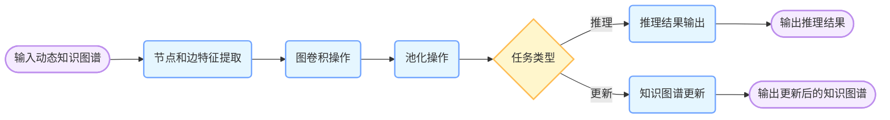

# 基于图卷积网络的动态知识图谱推理更新

> 关键词：图卷积网络、动态知识图谱、知识图谱推理、知识图谱更新、深度学习

> 摘要：本文聚焦于基于图卷积网络（GCN）的动态知识图谱推理更新技术。首先介绍了该研究的背景、目的、预期读者等信息。接着详细阐述了图卷积网络和动态知识图谱的核心概念及其联系，并给出相应的原理和架构示意图。深入讲解了核心算法原理，通过Python代码进行详细说明，同时介绍了相关的数学模型和公式，并举例分析。在项目实战部分，展示了开发环境搭建、源代码实现与解读。探讨了该技术在多个领域的实际应用场景，推荐了学习资源、开发工具框架以及相关论文著作。最后总结了未来发展趋势与挑战，并给出常见问题解答和扩展阅读参考资料，旨在为相关领域的研究者和开发者提供全面且深入的技术指导。

## 1. 背景介绍 
### 1.1 目的和范围
知识图谱作为一种语义网络，以图的形式表示实体及其之间的关系，在信息检索、智能问答、推荐系统等领域有着广泛的应用。然而，现实世界中的知识是不断变化和发展的，传统的静态知识图谱难以满足实际需求，因此动态知识图谱应运而生。动态知识图谱能够实时反映知识的变化，但其推理和更新面临着诸多挑战。

本文的目的在于探讨如何利用图卷积网络解决动态知识图谱的推理和更新问题。具体范围包括图卷积网络的原理、动态知识图谱的表示和更新机制、基于图卷积网络的推理算法实现、实际应用场景分析以及相关工具和资源的推荐等。

### 1.2 预期读者
本文的预期读者包括计算机科学、人工智能、数据挖掘等领域的研究者、学生和开发者。对于希望深入了解图卷积网络和动态知识图谱技术，以及将其应用于实际项目的人员具有一定的参考价值。

### 1.3 文档结构概述
本文将按照以下结构进行组织：首先介绍核心概念与联系，包括图卷积网络和动态知识图谱的原理和架构；接着详细讲解核心算法原理和具体操作步骤，并给出Python代码示例；然后介绍相关的数学模型和公式，并举例说明；在项目实战部分，展示开发环境搭建、源代码实现和代码解读；探讨实际应用场景；推荐相关的工具和资源；最后总结未来发展趋势与挑战，给出常见问题解答和扩展阅读参考资料。

### 1.4 术语表
#### 1.4.1 核心术语定义
- **知识图谱（Knowledge Graph）**：一种语义网络，用图的形式表示实体及其之间的关系，每个节点代表一个实体，每条边代表实体之间的关系。
- **动态知识图谱（Dynamic Knowledge Graph）**：能够实时反映知识变化的知识图谱，随着时间的推移，实体和关系会不断更新。
- **图卷积网络（Graph Convolutional Network, GCN）**：一种用于处理图结构数据的深度学习模型，通过对节点及其邻居节点的特征进行卷积操作，学习节点的表示。
- **知识图谱推理（Knowledge Graph Reasoning）**：根据知识图谱中已有的知识，推断出新的知识或关系的过程。
- **知识图谱更新（Knowledge Graph Update）**：随着新的知识不断涌现，对知识图谱中的实体和关系进行添加、删除或修改的过程。

#### 1.4.2 相关概念解释
- **图结构数据**：由节点和边组成的数据结构，节点表示实体，边表示实体之间的关系。图结构数据广泛存在于社交网络、生物网络、交通网络等领域。
- **卷积操作**：在图像处理中，卷积操作是一种常用的特征提取方法，通过卷积核在图像上滑动，提取图像的局部特征。在图卷积网络中，卷积操作是对节点及其邻居节点的特征进行加权求和，学习节点的表示。
- **深度学习**：一种基于神经网络的机器学习方法，通过多层神经网络自动学习数据的特征和模式。深度学习在图像识别、语音识别、自然语言处理等领域取得了显著的成果。

#### 1.4.3 缩略词列表
- **GCN**：Graph Convolutional Network，图卷积网络
- **KG**：Knowledge Graph，知识图谱
- **DKG**：Dynamic Knowledge Graph，动态知识图谱

## 2. 核心概念与联系 
### 2.1 图卷积网络原理
图卷积网络是一种专门用于处理图结构数据的深度学习模型。传统的卷积神经网络（CNN）主要用于处理规则的网格结构数据，如图像和语音。而图结构数据具有不规则性，节点的邻居数量和连接方式各不相同，因此需要一种新的卷积操作来处理图数据。

图卷积网络的核心思想是通过对节点及其邻居节点的特征进行卷积操作，学习节点的表示。具体来说，对于图中的每个节点，图卷积网络会聚合其邻居节点的特征，并将聚合后的特征与节点自身的特征进行线性组合，得到节点的新表示。

图卷积网络的数学表达式如下：

$$H^{(l+1)} = \sigma(\tilde{D}^{-\frac{1}{2}}\tilde{A}\tilde{D}^{-\frac{1}{2}}H^{(l)}W^{(l)})$$

其中，$H^{(l)}$ 是第 $l$ 层的节点特征矩阵，$W^{(l)}$ 是第 $l$ 层的可学习权重矩阵，$\tilde{A} = A + I$ 是邻接矩阵 $A$ 加上自环后的矩阵，$\tilde{D}$ 是 $\tilde{A}$ 的度矩阵，$\sigma$ 是激活函数。

### 2.2 动态知识图谱表示
动态知识图谱可以用四元组 $(E, R, T, F)$ 表示，其中 $E$ 是实体集合，$R$ 是关系集合，$T$ 是时间戳集合，$F$ 是事实集合。每个事实 $f \in F$ 可以表示为 $(h, r, t, \tau)$，其中 $h$ 是头实体，$r$ 是关系，$t$ 是尾实体，$\tau$ 是时间戳。

动态知识图谱的结构可以用图来表示，其中节点表示实体，边表示关系，边的属性表示时间戳。随着时间的推移，实体和关系会不断更新，动态知识图谱需要实时反映这些变化。

### 2.3 图卷积网络与动态知识图谱的联系
图卷积网络可以用于动态知识图谱的推理和更新。在推理方面，图卷积网络可以学习实体和关系的表示，根据已有的知识推断出新的知识或关系。在更新方面，图卷积网络可以根据新的事实对知识图谱中的实体和关系进行更新。

具体来说，图卷积网络可以将动态知识图谱中的节点和边作为输入，学习节点和边的特征表示。通过对节点和边的特征进行卷积操作，图卷积网络可以捕捉节点之间的局部和全局信息，从而提高推理和更新的准确性。

### 2.4 核心概念原理和架构的文本示意图
图卷积网络与动态知识图谱的结合架构可以描述如下：

输入层：将动态知识图谱中的节点和边的特征作为输入，节点特征可以是实体的属性信息，边特征可以是关系的类型和时间戳。

卷积层：通过图卷积操作，对节点和边的特征进行卷积，学习节点和边的表示。

池化层：对卷积层的输出进行池化操作，减少特征维度，提高模型的计算效率。

输出层：根据具体的任务，输出推理结果或更新后的知识图谱。

### 2.5 Mermaid 流程图


## 3. 核心算法原理 & 具体操作步骤 
### 3.1 图卷积网络的核心算法原理
图卷积网络的核心算法是图卷积操作，其原理是通过对节点及其邻居节点的特征进行加权求和，学习节点的表示。具体步骤如下：

1. **邻接矩阵和度矩阵的计算**：对于给定的图，计算其邻接矩阵 $A$ 和度矩阵 $D$。邻接矩阵 $A$ 表示节点之间的连接关系，度矩阵 $D$ 表示每个节点的度。
2. **添加自环**：为了使节点能够考虑自身的特征，在邻接矩阵 $A$ 中添加自环，得到 $\tilde{A} = A + I$，其中 $I$ 是单位矩阵。
3. **归一化处理**：对 $\tilde{A}$ 进行归一化处理，得到 $\tilde{D}^{-\frac{1}{2}}\tilde{A}\tilde{D}^{-\frac{1}{2}}$，其中 $\tilde{D}$ 是 $\tilde{A}$ 的度矩阵。
4. **特征聚合**：将归一化后的邻接矩阵与节点特征矩阵 $H^{(l)}$ 相乘，得到聚合后的特征矩阵。
5. **线性变换**：将聚合后的特征矩阵与可学习的权重矩阵 $W^{(l)}$ 相乘，得到线性变换后的特征矩阵。
6. **激活函数**：对线性变换后的特征矩阵应用激活函数 $\sigma$，得到更新后的节点特征矩阵 $H^{(l+1)}$。

### 3.2 基于图卷积网络的动态知识图谱推理算法
基于图卷积网络的动态知识图谱推理算法的主要步骤如下：

1. **数据预处理**：将动态知识图谱转换为图结构数据，提取节点和边的特征。
2. **模型构建**：构建图卷积网络模型，包括输入层、卷积层、池化层和输出层。
3. **模型训练**：使用训练数据对图卷积网络模型进行训练，调整模型的参数。
4. **推理过程**：将待推理的事实输入到训练好的模型中，得到推理结果。

### 3.3 基于图卷积网络的动态知识图谱更新算法
基于图卷积网络的动态知识图谱更新算法的主要步骤如下：

1. **新事实的获取**：获取新的事实，包括头实体、关系、尾实体和时间戳。
2. **知识图谱的更新**：将新的事实添加到知识图谱中，更新邻接矩阵和节点特征矩阵。
3. **模型的更新**：使用更新后的知识图谱对图卷积网络模型进行微调，更新模型的参数。

### 3.4 Python 源代码详细阐述
以下是一个简单的基于图卷积网络的动态知识图谱推理和更新的 Python 代码示例：

```python
import torch
import torch.nn as nn
import torch.nn.functional as F

# 定义图卷积层
class GraphConvolution(nn.Module):
    def __init__(self, in_features, out_features, bias=True):
        super(GraphConvolution, self).__init__()
        self.in_features = in_features
        self.out_features = out_features
        self.weight = nn.Parameter(torch.FloatTensor(in_features, out_features))
        if bias:
            self.bias = nn.Parameter(torch.FloatTensor(out_features))
        else:
            self.register_parameter('bias', None)
        self.reset_parameters()

    def reset_parameters(self):
        nn.init.xavier_uniform_(self.weight)
        if self.bias is not None:
            nn.init.zeros_(self.bias)

    def forward(self, input, adj):
        support = torch.mm(input, self.weight)
        output = torch.spmm(adj, support)
        if self.bias is not None:
            return output + self.bias
        else:
            return output

# 定义图卷积网络模型
class GCN(nn.Module):
    def __init__(self, nfeat, nhid, nclass, dropout):
        super(GCN, self).__init__()
        self.gc1 = GraphConvolution(nfeat, nhid)
        self.gc2 = GraphConvolution(nhid, nclass)
        self.dropout = dropout

    def forward(self, x, adj):
        x = F.relu(self.gc1(x, adj))
        x = F.dropout(x, self.dropout, training=self.training)
        x = self.gc2(x, adj)
        return F.log_softmax(x, dim=1)

# 示例数据
nfeat = 10  # 输入特征维度
nhid = 20   # 隐藏层维度
nclass = 5  # 输出类别数
dropout = 0.5

# 初始化模型
model = GCN(nfeat, nhid, nclass, dropout)

# 定义损失函数和优化器
criterion = nn.NLLLoss()
optimizer = torch.optim.Adam(model.parameters(), lr=0.01)

# 示例输入数据
x = torch.randn(100, nfeat)  # 节点特征矩阵
adj = torch.randn(100, 100)   # 邻接矩阵
labels = torch.randint(0, nclass, (100,))  # 标签

# 训练模型
for epoch in range(100):
    optimizer.zero_grad()
    output = model(x, adj)
    loss = criterion(output, labels)
    loss.backward()
    optimizer.step()
    print(f'Epoch {epoch+1}, Loss: {loss.item()}')

# 推理过程
test_x = torch.randn(10, nfeat)
test_adj = torch.randn(10, 10)
test_output = model(test_x, test_adj)
_, predicted = torch.max(test_output, 1)
print('Predicted labels:', predicted)
```

### 3.5 代码解释
- **GraphConvolution 类**：定义了图卷积层，包括权重矩阵和偏置项的初始化，以及前向传播函数。
- **GCN 类**：定义了图卷积网络模型，包括两个图卷积层和一个 dropout 层。
- **训练过程**：使用交叉熵损失函数和 Adam 优化器对模型进行训练，迭代 100 个 epoch。
- **推理过程**：将测试数据输入到训练好的模型中，得到预测结果。

## 4. 数学模型和公式 & 详细讲解 & 举例说明 
### 4.1 图卷积网络的数学模型和公式
图卷积网络的核心公式为：

$$H^{(l+1)} = \sigma(\tilde{D}^{-\frac{1}{2}}\tilde{A}\tilde{D}^{-\frac{1}{2}}H^{(l)}W^{(l)})$$

其中，$H^{(l)}$ 是第 $l$ 层的节点特征矩阵，$W^{(l)}$ 是第 $l$ 层的可学习权重矩阵，$\tilde{A} = A + I$ 是邻接矩阵 $A$ 加上自环后的矩阵，$\tilde{D}$ 是 $\tilde{A}$ 的度矩阵，$\sigma$ 是激活函数。

### 4.2 详细讲解
- **邻接矩阵和度矩阵**：邻接矩阵 $A$ 表示节点之间的连接关系，如果节点 $i$ 和节点 $j$ 之间有边相连，则 $A_{ij} = 1$，否则 $A_{ij} = 0$。度矩阵 $D$ 是一个对角矩阵，其中 $D_{ii}$ 表示节点 $i$ 的度。
- **添加自环**：在邻接矩阵 $A$ 中添加自环，得到 $\tilde{A} = A + I$，这样可以使节点考虑自身的特征。
- **归一化处理**：对 $\tilde{A}$ 进行归一化处理，得到 $\tilde{D}^{-\frac{1}{2}}\tilde{A}\tilde{D}^{-\frac{1}{2}}$，可以避免梯度消失和梯度爆炸问题。
- **特征聚合**：将归一化后的邻接矩阵与节点特征矩阵 $H^{(l)}$ 相乘，得到聚合后的特征矩阵。
- **线性变换**：将聚合后的特征矩阵与可学习的权重矩阵 $W^{(l)}$ 相乘，得到线性变换后的特征矩阵。
- **激活函数**：对线性变换后的特征矩阵应用激活函数 $\sigma$，如 ReLU 函数，引入非线性因素，提高模型的表达能力。

### 4.3 举例说明
假设我们有一个简单的图，包含 3 个节点和 2 条边，邻接矩阵 $A$ 如下：

$$A = \begin{bmatrix}
0 & 1 & 0 \\
1 & 0 & 1 \\
0 & 1 & 0
\end{bmatrix}$$

添加自环后得到 $\tilde{A}$：

$$\tilde{A} = \begin{bmatrix}
1 & 1 & 0 \\
1 & 1 & 1 \\
0 & 1 & 1
\end{bmatrix}$$

度矩阵 $\tilde{D}$ 为：

$$\tilde{D} = \begin{bmatrix}
2 & 0 & 0 \\
0 & 3 & 0 \\
0 & 0 & 2
\end{bmatrix}$$

归一化后的邻接矩阵 $\tilde{D}^{-\frac{1}{2}}\tilde{A}\tilde{D}^{-\frac{1}{2}}$ 为：

$$\tilde{D}^{-\frac{1}{2}}\tilde{A}\tilde{D}^{-\frac{1}{2}} = \begin{bmatrix}
\frac{1}{2} & \frac{1}{\sqrt{6}} & 0 \\
\frac{1}{\sqrt{6}} & \frac{1}{3} & \frac{1}{\sqrt{6}} \\
0 & \frac{1}{\sqrt{6}} & \frac{1}{2}
\end{bmatrix}$$

假设节点特征矩阵 $H^{(l)}$ 为：

$$H^{(l)} = \begin{bmatrix}
1 & 2 \\
3 & 4 \\
5 & 6
\end{bmatrix}$$

可学习的权重矩阵 $W^{(l)}$ 为：

$$W^{(l)} = \begin{bmatrix}
0.1 & 0.2 \\
0.3 & 0.4
\end{bmatrix}$$

则经过图卷积操作后得到的节点特征矩阵 $H^{(l+1)}$ 为：

$$H^{(l+1)} = \sigma(\tilde{D}^{-\frac{1}{2}}\tilde{A}\tilde{D}^{-\frac{1}{2}}H^{(l)}W^{(l)})$$

具体计算过程如下：

$$\tilde{D}^{-\frac{1}{2}}\tilde{A}\tilde{D}^{-\frac{1}{2}}H^{(l)} = \begin{bmatrix}
\frac{1}{2} & \frac{1}{\sqrt{6}} & 0 \\
\frac{1}{\sqrt{6}} & \frac{1}{3} & \frac{1}{\sqrt{6}} \\
0 & \frac{1}{\sqrt{6}} & \frac{1}{2}
\end{bmatrix} \begin{bmatrix}
1 & 2 \\
3 & 4 \\
5 & 6
\end{bmatrix} = \begin{bmatrix}
\frac{1}{2} + \frac{3}{\sqrt{6}} & 1 + \frac{4}{\sqrt{6}} \\
\frac{1}{\sqrt{6}} + 1 + \frac{5}{\sqrt{6}} & \frac{2}{\sqrt{6}} + \frac{4}{3} + \frac{6}{\sqrt{6}} \\
\frac{3}{\sqrt{6}} + \frac{5}{2} & \frac{4}{\sqrt{6}} + 3
\end{bmatrix}$$

$$\tilde{D}^{-\frac{1}{2}}\tilde{A}\tilde{D}^{-\frac{1}{2}}H^{(l)}W^{(l)} = \begin{bmatrix}
\frac{1}{2} + \frac{3}{\sqrt{6}} & 1 + \frac{4}{\sqrt{6}} \\
\frac{1}{\sqrt{6}} + 1 + \frac{5}{\sqrt{6}} & \frac{2}{\sqrt{6}} + \frac{4}{3} + \frac{6}{\sqrt{6}} \\
\frac{3}{\sqrt{6}} + \frac{5}{2} & \frac{4}{\sqrt{6}} + 3
\end{bmatrix} \begin{bmatrix}
0.1 & 0.2 \\
0.3 & 0.4
\end{bmatrix}$$

最后对结果应用激活函数 $\sigma$，得到 $H^{(l+1)}$。

## 5. 项目实战：代码实际案例和详细解释说明 
### 5.1 开发环境搭建
为了实现基于图卷积网络的动态知识图谱推理更新项目，我们需要搭建以下开发环境：

1. **操作系统**：推荐使用 Linux 或 macOS 系统，Windows 系统也可以使用，但可能会遇到一些兼容性问题。
2. **Python 环境**：推荐使用 Python 3.7 及以上版本，可以使用 Anaconda 或 Miniconda 来管理 Python 环境。
3. **深度学习框架**：使用 PyTorch 作为深度学习框架，PyTorch 提供了丰富的神经网络模块和优化器，方便我们实现图卷积网络。
4. **其他依赖库**：安装 numpy、scipy、networkx 等库，用于数据处理和图操作。

以下是安装所需库的命令：

```bash
pip install torch torchvision
pip install numpy scipy networkx
```

### 5.2 源代码详细实现和代码解读
#### 5.2.1 数据预处理
首先，我们需要将动态知识图谱转换为图结构数据，并提取节点和边的特征。以下是一个简单的数据预处理示例：

```python
import networkx as nx
import numpy as np

# 构建动态知识图谱
G = nx.Graph()
G.add_node(1, features=[0.1, 0.2])
G.add_node(2, features=[0.3, 0.4])
G.add_node(3, features=[0.5, 0.6])
G.add_edge(1, 2, time=1)
G.add_edge(2, 3, time=2)

# 提取节点特征矩阵
node_features = []
for node in G.nodes():
    node_features.append(G.nodes[node]['features'])
node_features = np.array(node_features)

# 构建邻接矩阵
adj_matrix = nx.adjacency_matrix(G).toarray()

print('Node features:', node_features)
print('Adjacency matrix:', adj_matrix)
```

#### 5.2.2 图卷积网络模型实现
接下来，我们实现图卷积网络模型：

```python
import torch
import torch.nn as nn
import torch.nn.functional as F

# 定义图卷积层
class GraphConvolution(nn.Module):
    def __init__(self, in_features, out_features, bias=True):
        super(GraphConvolution, self).__init__()
        self.in_features = in_features
        self.out_features = out_features
        self.weight = nn.Parameter(torch.FloatTensor(in_features, out_features))
        if bias:
            self.bias = nn.Parameter(torch.FloatTensor(out_features))
        else:
            self.register_parameter('bias', None)
        self.reset_parameters()

    def reset_parameters(self):
        nn.init.xavier_uniform_(self.weight)
        if self.bias is not None:
            nn.init.zeros_(self.bias)

    def forward(self, input, adj):
        support = torch.mm(input, self.weight)
        output = torch.spmm(adj, support)
        if self.bias is not None:
            return output + self.bias
        else:
            return output

# 定义图卷积网络模型
class GCN(nn.Module):
    def __init__(self, nfeat, nhid, nclass, dropout):
        super(GCN, self).__init__()
        self.gc1 = GraphConvolution(nfeat, nhid)
        self.gc2 = GraphConvolution(nhid, nclass)
        self.dropout = dropout

    def forward(self, x, adj):
        x = F.relu(self.gc1(x, adj))
        x = F.dropout(x, self.dropout, training=self.training)
        x = self.gc2(x, adj)
        return F.log_softmax(x, dim=1)
```

#### 5.2.3 模型训练和推理
最后，我们使用训练数据对模型进行训练，并进行推理：

```python
# 示例数据
nfeat = 2  # 输入特征维度
nhid = 10  # 隐藏层维度
nclass = 3  # 输出类别数
dropout = 0.5

# 初始化模型
model = GCN(nfeat, nhid, nclass, dropout)

# 定义损失函数和优化器
criterion = nn.NLLLoss()
optimizer = torch.optim.Adam(model.parameters(), lr=0.01)

# 示例输入数据
x = torch.FloatTensor(node_features)
adj = torch.FloatTensor(adj_matrix)
labels = torch.randint(0, nclass, (len(G.nodes()),))

# 训练模型
for epoch in range(100):
    optimizer.zero_grad()
    output = model(x, adj)
    loss = criterion(output, labels)
    loss.backward()
    optimizer.step()
    print(f'Epoch {epoch+1}, Loss: {loss.item()}')

# 推理过程
test_x = torch.randn(1, nfeat)
test_adj = torch.randn(1, len(G.nodes()))
test_output = model(test_x, adj)
_, predicted = torch.max(test_output, 1)
print('Predicted labels:', predicted)
```

### 5.3 代码解读与分析
#### 5.3.1 数据预处理部分
- 使用 `networkx` 库构建动态知识图谱，并添加节点和边的特征。
- 提取节点特征矩阵和邻接矩阵，用于后续的模型输入。

#### 5.3.2 图卷积网络模型部分
- `GraphConvolution` 类实现了图卷积层，包括权重矩阵和偏置项的初始化，以及前向传播函数。
- `GCN` 类实现了图卷积网络模型，包括两个图卷积层和一个 dropout 层。

#### 5.3.3 模型训练和推理部分
- 使用交叉熵损失函数和 Adam 优化器对模型进行训练，迭代 100 个 epoch。
- 将测试数据输入到训练好的模型中，得到预测结果。

## 6. 实际应用场景 
### 6.1 智能问答系统
在智能问答系统中，动态知识图谱可以实时更新知识，为用户提供更准确的答案。图卷积网络可以用于推理用户问题中的实体和关系，从而提高问答系统的性能。例如，当用户询问某个事件的最新情况时，系统可以通过图卷积网络推理出相关的知识，并给出准确的回答。

### 6.2 推荐系统
推荐系统可以利用动态知识图谱来了解用户的兴趣和偏好，以及物品之间的关系。图卷积网络可以学习用户和物品的表示，根据用户的历史行为和当前状态，推荐更符合用户需求的物品。例如，在电商推荐系统中，系统可以根据用户的浏览历史和购买记录，使用图卷积网络推理出用户可能感兴趣的商品，并进行推荐。

### 6.3 金融风险预测
在金融领域，动态知识图谱可以整合各种金融数据，如企业信息、市场数据、政策法规等。图卷积网络可以用于分析金融数据之间的关系，预测金融风险。例如，通过分析企业之间的股权关系、交易关系等，图卷积网络可以预测企业的违约风险，为金融机构提供决策支持。

### 6.4 医疗领域
在医疗领域，动态知识图谱可以整合患者的病历、诊断结果、治疗方案等信息。图卷积网络可以用于疾病诊断、治疗方案推荐等任务。例如，通过分析患者的症状和病史，图卷积网络可以推理出可能的疾病，并推荐相应的治疗方案。

## 7. 工具和资源推荐
### 7.1 学习资源推荐
#### 7.1.1 书籍推荐
- 《深度学习》（Deep Learning）：由 Ian Goodfellow、Yoshua Bengio 和 Aaron Courville 编写，是深度学习领域的经典教材，介绍了深度学习的基本概念、算法和应用。
- 《图神经网络：基础、前沿与应用》：详细介绍了图神经网络的原理、算法和应用，包括图卷积网络、图注意力网络等。
- 《知识图谱：方法、实践与应用》：全面介绍了知识图谱的概念、构建方法、推理技术和应用场景，对动态知识图谱的研究有很大的帮助。

#### 7.1.2 在线课程
- Coursera 上的 “Deep Learning Specialization”：由 Andrew Ng 教授授课，是深度学习领域的经典在线课程，涵盖了深度学习的各个方面。
- edX 上的 “Graph Neural Networks for Machine Learning”：介绍了图神经网络的原理和应用，包括图卷积网络、图注意力网络等。
- B 站上的 “图神经网络入门教程”：由国内知名学者授课，对图神经网络的原理和实现进行了详细的讲解。

#### 7.1.3 技术博客和网站
- Medium 上的 “Towards Data Science”：是一个专注于数据科学和机器学习的技术博客，经常发布关于图卷积网络和知识图谱的文章。
- ArXiv.org：是一个预印本平台，提供了大量关于图卷积网络和知识图谱的最新研究成果。
- 知乎上的 “图神经网络” 话题：聚集了很多图神经网络领域的专家和爱好者，分享了很多关于图卷积网络和知识图谱的经验和见解。

### 7.2 开发工具框架推荐
#### 7.2.1 IDE和编辑器
- PyCharm：是一款专门为 Python 开发设计的集成开发环境，提供了丰富的代码编辑、调试和部署功能。
- Jupyter Notebook：是一个交互式的开发环境，适合进行数据探索和模型实验。
- Visual Studio Code：是一款轻量级的代码编辑器，支持多种编程语言和插件，方便进行代码开发和调试。

#### 7.2.2 调试和性能分析工具
- PyTorch Profiler：是 PyTorch 提供的性能分析工具，可以帮助我们分析模型的运行时间和内存使用情况。
- TensorBoard：是 TensorFlow 提供的可视化工具，也可以用于 PyTorch 模型的可视化和调试。
- NVIDIA Nsight Systems：是 NVIDIA 提供的性能分析工具，可以帮助我们分析 GPU 加速模型的性能。

#### 7.2.3 相关框架和库
- PyTorch Geometric：是一个基于 PyTorch 的图神经网络框架，提供了丰富的图神经网络模型和工具。
- DGL（Deep Graph Library）：是一个开源的图神经网络框架，支持多种深度学习框架，如 PyTorch 和 TensorFlow。
- NetworkX：是一个用于图操作和分析的 Python 库，提供了丰富的图算法和数据结构。

### 7.3 相关论文著作推荐
#### 7.3.1 经典论文
- “Semi-Supervised Classification with Graph Convolutional Networks”：介绍了图卷积网络的基本原理和算法，是图卷积网络领域的经典论文。
- “Knowledge Graph Embedding: A Survey of Approaches and Applications”：对知识图谱嵌入技术进行了全面的综述，介绍了各种知识图谱嵌入方法和应用场景。
- “Dynamic Knowledge Graph Embedding for Forecasting Temporal Knowledge Graphs”：提出了一种动态知识图谱嵌入方法，用于预测时间知识图谱中的未来事件。

#### 7.3.2 最新研究成果
- 关注 ArXiv.org 上的最新论文，了解图卷积网络和动态知识图谱领域的最新研究进展。
- 参加相关的学术会议，如 NeurIPS、ICML、KDD 等，听取最新的研究报告和成果分享。

#### 7.3.3 应用案例分析
- 分析实际应用中的案例，了解图卷积网络和动态知识图谱在不同领域的应用效果和挑战。
- 参考相关的开源项目，学习如何将图卷积网络和动态知识图谱技术应用到实际项目中。

## 8. 总结：未来发展趋势与挑战
### 8.1 未来发展趋势
- **多模态融合**：将图卷积网络与其他模态的数据（如图像、文本、语音等）进行融合，提高动态知识图谱的表达能力和推理能力。
- **强化学习与图卷积网络的结合**：利用强化学习的方法优化图卷积网络的训练过程，提高模型的性能和效率。
- **大规模动态知识图谱的处理**：研究如何处理大规模的动态知识图谱，提高模型的可扩展性和实时性。
- **跨领域应用**：将图卷积网络和动态知识图谱技术应用到更多的领域，如交通、能源、教育等，推动各领域的智能化发展。

### 8.2 挑战
- **数据质量和更新问题**：动态知识图谱的数据质量和更新速度对模型的性能有很大的影响，如何保证数据的准确性和及时性是一个挑战。
- **模型可解释性问题**：图卷积网络是一种黑盒模型，其决策过程难以解释，如何提高模型的可解释性是一个重要的研究方向。
- **计算资源和效率问题**：处理大规模的动态知识图谱需要大量的计算资源和时间，如何提高模型的计算效率是一个挑战。
- **隐私和安全问题**：动态知识图谱中包含大量的敏感信息，如何保护数据的隐私和安全是一个重要的问题。

## 9. 附录：常见问题与解答
### 9.1 图卷积网络和传统卷积神经网络有什么区别？
传统卷积神经网络主要用于处理规则的网格结构数据，如图像和语音。而图卷积网络用于处理不规则的图结构数据，节点的邻居数量和连接方式各不相同。图卷积网络通过对节点及其邻居节点的特征进行卷积操作，学习节点的表示。

### 9.2 如何选择合适的图卷积网络模型？
选择合适的图卷积网络模型需要考虑以下因素：数据的特点、任务的类型、计算资源的限制等。对于简单的图数据和任务，可以选择基本的图卷积网络模型；对于复杂的图数据和任务，可以选择更高级的图卷积网络模型，如图注意力网络、图循环网络等。

### 9.3 动态知识图谱的更新频率如何确定？
动态知识图谱的更新频率需要根据实际应用场景和数据的变化速度来确定。对于实时性要求较高的应用场景，如金融风险预测、智能交通等，需要实时更新知识图谱；对于实时性要求较低的应用场景，如知识问答系统、推荐系统等，可以定期更新知识图谱。

### 9.4 如何提高图卷积网络的训练效率？
可以通过以下方法提高图卷积网络的训练效率：使用 GPU 加速计算、优化模型结构、使用批量归一化等技术、采用分布式训练等。

## 10. 扩展阅读 & 参考资料
### 10.1 扩展阅读
- 《人工智能：现代方法》（Artificial Intelligence: A Modern Approach）：全面介绍了人工智能的基本概念、算法和应用，对图卷积网络和动态知识图谱的研究有很大的帮助。
- 《数据挖掘：概念与技术》（Data Mining: Concepts and Techniques）：介绍了数据挖掘的基本概念、算法和应用，对动态知识图谱的数据处理和分析有很大的帮助。

### 10.2 参考资料
- 论文：“Semi-Supervised Classification with Graph Convolutional Networks”、“Knowledge Graph Embedding: A Survey of Approaches and Applications”、“Dynamic Knowledge Graph Embedding for Forecasting Temporal Knowledge Graphs” 等。
- 书籍：《深度学习》、《图神经网络：基础、前沿与应用》、《知识图谱：方法、实践与应用》等。
- 网站：ArXiv.org、Medium 上的 “Towards Data Science”、知乎上的 “图神经网络” 话题等。

作者：AI天才研究院/AI Genius Institute & 禅与计算机程序设计艺术 /Zen And The Art of Computer Programming