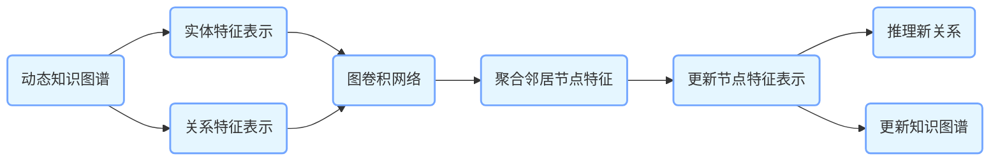

# 基于图卷积网络的动态知识图谱推理更新技术

> 关键词：图卷积网络、动态知识图谱、推理更新技术、知识表示、深度学习

> 摘要：本文聚焦于基于图卷积网络的动态知识图谱推理更新技术。随着知识图谱在众多领域的广泛应用，其动态性和实时性的需求日益凸显。图卷积网络作为一种强大的图数据处理工具，为解决动态知识图谱的推理和更新问题提供了有效的手段。文章首先介绍了该技术的背景信息，包括目的、预期读者等。接着详细阐述了核心概念、算法原理、数学模型，并通过实际项目案例展示了技术的应用。同时，探讨了其实际应用场景，推荐了相关的学习资源、开发工具和论文著作。最后，对未来发展趋势与挑战进行了总结，并提供了常见问题解答和扩展阅读参考资料。

## 1. 背景介绍 
### 1.1 目的和范围
知识图谱旨在以结构化的方式表示现实世界中的实体及其关系，为信息检索、智能问答等众多应用提供支持。然而，现实世界是动态变化的，新的实体不断出现，实体之间的关系也在不断演变，这就要求知识图谱具备动态更新和推理的能力。本文的目的在于深入探讨基于图卷积网络（Graph Convolutional Networks, GCN）的动态知识图谱推理更新技术，详细介绍其原理、实现步骤以及实际应用。范围涵盖了从核心概念的阐述到算法原理的剖析，再到实际项目的案例分析，以及相关工具和资源的推荐等方面。

### 1.2 预期读者
本文预期读者包括计算机科学、人工智能、数据挖掘等领域的研究人员和学生，他们希望深入了解图卷积网络在动态知识图谱中的应用。同时，对于从事知识图谱相关项目开发的工程师和技术人员，本文也提供了实用的技术指导和案例参考。此外，对新兴技术感兴趣，希望了解知识图谱动态更新和推理机制的非专业人士也能从本文中获得一定的启发。

### 1.3 文档结构概述
本文将按照以下结构展开：首先介绍背景信息，包括目的、预期读者和文档结构概述。接着详细阐述核心概念与联系，包括图卷积网络和动态知识图谱的基本原理以及它们之间的关系。然后讲解核心算法原理和具体操作步骤，并给出相应的Python源代码。之后介绍数学模型和公式，并通过举例进行详细说明。再通过实际项目案例展示该技术的具体应用，包括开发环境搭建、源代码实现和代码解读。随后探讨实际应用场景，推荐相关的工具和资源。最后总结未来发展趋势与挑战，提供常见问题解答和扩展阅读参考资料。

### 1.4 术语表
#### 1.4.1 核心术语定义
- **图卷积网络（Graph Convolutional Networks, GCN）**：是一种专门用于处理图结构数据的神经网络，通过聚合节点及其邻居节点的特征信息来更新节点的表示。
- **动态知识图谱（Dynamic Knowledge Graph）**：是一种能够实时反映现实世界中实体和关系动态变化的知识图谱，需要不断进行更新和推理。
- **知识图谱推理（Knowledge Graph Reasoning）**：是指利用知识图谱中已有的知识，通过一定的推理规则和算法，推导出新的知识或判断知识的正确性。
- **知识图谱更新（Knowledge Graph Update）**：是指根据新的数据和信息，对知识图谱中的实体、关系和属性进行添加、删除或修改的操作。

#### 1.4.2 相关概念解释
- **图（Graph）**：由节点（Vertex）和边（Edge）组成的数据结构，用于表示实体及其之间的关系。在知识图谱中，节点通常表示实体，边表示实体之间的关系。
- **特征表示（Feature Representation）**：是指将实体和关系用向量或矩阵的形式表示，以便计算机进行处理和分析。在图卷积网络中，节点的特征表示是通过聚合邻居节点的特征信息得到的。
- **深度学习（Deep Learning）**：是一种基于人工神经网络的机器学习方法，通过多层神经网络自动学习数据的特征和模式。图卷积网络是深度学习在图数据处理中的应用。

#### 1.4.3 缩略词列表
- **GCN**：Graph Convolutional Networks（图卷积网络）
- **KG**：Knowledge Graph（知识图谱）
- **DKG**：Dynamic Knowledge Graph（动态知识图谱）

## 2. 核心概念与联系 
### 2.1 图卷积网络（GCN）原理
图卷积网络是一种在图结构数据上进行卷积操作的神经网络。传统的卷积神经网络（Convolutional Neural Networks, CNN）主要用于处理规则的网格结构数据，如图像。而图结构数据具有不规则性，节点的邻居数量和连接方式各不相同。GCN通过聚合节点及其邻居节点的特征信息来更新节点的表示。

设图 $G=(V, E)$，其中 $V$ 是节点集合，$E$ 是边集合。每个节点 $v_i$ 有一个特征向量 $x_i$。GCN的一层卷积操作可以表示为：

$$H^{(l+1)}=\sigma(\tilde{D}^{-\frac{1}{2}}\tilde{A}\tilde{D}^{-\frac{1}{2}}H^{(l)}W^{(l)})$$

其中，$H^{(l)}$ 是第 $l$ 层的节点特征矩阵，$W^{(l)}$ 是第 $l$ 层的可学习权重矩阵，$\sigma$ 是激活函数，$\tilde{A}=A + I$ 是邻接矩阵 $A$ 加上自环后的矩阵，$\tilde{D}$ 是 $\tilde{A}$ 的度矩阵。

### 2.2 动态知识图谱（DKG）概念
动态知识图谱是一种能够实时反映现实世界中实体和关系动态变化的知识图谱。与静态知识图谱不同，动态知识图谱需要不断地进行更新和推理，以保证其知识的准确性和时效性。动态知识图谱中的实体和关系可能会随着时间的推移而发生变化，例如新的实体出现、实体之间的关系发生改变等。

### 2.3 图卷积网络与动态知识图谱的联系
图卷积网络为动态知识图谱的推理和更新提供了有效的方法。通过将动态知识图谱表示为图结构数据，利用GCN可以学习到节点（实体）和边（关系）的特征表示。在推理过程中，可以根据节点的特征表示预测新的关系或判断关系的正确性。在更新过程中，可以根据新的数据更新节点和边的特征表示，从而实现知识图谱的动态更新。

### 2.4 文本示意图
```plaintext
动态知识图谱（DKG）
|
|-- 实体（节点）
|   |-- 特征表示
|
|-- 关系（边）
|   |-- 特征表示
|
|-- 图卷积网络（GCN）
    |-- 聚合邻居节点特征
    |-- 更新节点特征表示
    |-- 推理新关系
    |-- 更新知识图谱
```

### 2.5 Mermaid 流程图


## 3. 核心算法原理 & 具体操作步骤 
### 3.1 图卷积网络的核心算法原理
图卷积网络的核心思想是通过聚合节点及其邻居节点的特征信息来更新节点的表示。具体来说，在每一层卷积操作中，首先计算节点的邻居节点的特征信息的加权和，然后通过一个非线性激活函数进行变换，得到更新后的节点特征表示。

以下是一个简单的图卷积层的Python实现：

```python
import torch
import torch.nn as nn
import torch.nn.functional as F

class GraphConvolution(nn.Module):
    def __init__(self, in_features, out_features, bias=True):
        super(GraphConvolution, self).__init__()
        self.in_features = in_features
        self.out_features = out_features
        self.weight = nn.Parameter(torch.FloatTensor(in_features, out_features))
        if bias:
            self.bias = nn.Parameter(torch.FloatTensor(out_features))
        else:
            self.register_parameter('bias', None)
        self.reset_parameters()

    def reset_parameters(self):
        nn.init.xavier_uniform_(self.weight)
        if self.bias is not None:
            nn.init.zeros_(self.bias)

    def forward(self, input, adj):
        support = torch.mm(input, self.weight)
        output = torch.spmm(adj, support)
        if self.bias is not None:
            return output + self.bias
        else:
            return output
```

### 3.2 基于GCN的动态知识图谱推理更新算法步骤
#### 步骤1：数据预处理
将动态知识图谱表示为图结构数据，包括节点（实体）和边（关系）。为每个节点和边分配特征向量，并将邻接矩阵进行归一化处理。

```python
import numpy as np
import scipy.sparse as sp

def normalize_adj(adj):
    """对称归一化邻接矩阵"""
    adj = sp.coo_matrix(adj)
    rowsum = np.array(adj.sum(1))
    d_inv_sqrt = np.power(rowsum, -0.5).flatten()
    d_inv_sqrt[np.isinf(d_inv_sqrt)] = 0.
    d_mat_inv_sqrt = sp.diags(d_inv_sqrt)
    return adj.dot(d_mat_inv_sqrt).transpose().dot(d_mat_inv_sqrt).tocoo()

# 示例邻接矩阵
adj = np.array([[0, 1, 1], [1, 0, 1], [1, 1, 0]])
adj_normalized = normalize_adj(adj)
```

#### 步骤2：构建图卷积网络模型
使用前面定义的图卷积层构建一个多层的图卷积网络模型。

```python
class GCN(nn.Module):
    def __init__(self, nfeat, nhid, nclass, dropout):
        super(GCN, self).__init__()
        self.gc1 = GraphConvolution(nfeat, nhid)
        self.gc2 = GraphConvolution(nhid, nclass)
        self.dropout = dropout

    def forward(self, x, adj):
        x = F.relu(self.gc1(x, adj))
        x = F.dropout(x, self.dropout, training=self.training)
        x = self.gc2(x, adj)
        return F.log_softmax(x, dim=1)
```

#### 步骤3：训练模型
使用训练数据对图卷积网络模型进行训练，优化模型的参数。

```python
# 示例节点特征矩阵
features = torch.FloatTensor(np.array([[1, 0, 0], [0, 1, 0], [0, 0, 1]]))
# 示例标签
labels = torch.LongTensor([0, 1, 0])
# 转换邻接矩阵为稀疏张量
adj_sparse = torch.sparse.FloatTensor(torch.LongTensor(np.vstack((adj_normalized.row, adj_normalized.col))),
                                      torch.FloatTensor(adj_normalized.data),
                                      torch.Size(adj_normalized.shape))

# 初始化模型
model = GCN(nfeat=features.shape[1], nhid=16, nclass=2, dropout=0.5)
optimizer = torch.optim.Adam(model.parameters(), lr=0.01, weight_decay=5e-4)

# 训练模型
for epoch in range(200):
    model.train()
    optimizer.zero_grad()
    output = model(features, adj_sparse)
    loss_train = F.nll_loss(output, labels)
    loss_train.backward()
    optimizer.step()
```

#### 步骤4：推理新关系
使用训练好的模型对新的实体和关系进行推理，预测新的关系或判断关系的正确性。

```python
# 示例新节点特征
new_features = torch.FloatTensor(np.array([[0.5, 0.5, 0]]))
# 进行推理
model.eval()
with torch.no_grad():
    new_output = model(new_features, adj_sparse)
    _, new_pred = torch.max(new_output, 1)
    print("推理结果:", new_pred.item())
```

#### 步骤5：更新知识图谱
根据推理结果和新的数据，更新知识图谱中的实体、关系和属性。

```python
# 示例更新知识图谱
# 假设新推理出的关系为 (0, 3)，类型为 1
new_adj = np.zeros((4, 4))
new_adj[:3, :3] = adj
new_adj[0, 3] = 1
new_adj[3, 0] = 1
new_adj_normalized = normalize_adj(new_adj)
```

## 4. 数学模型和公式 & 详细讲解 & 举例说明 
### 4.1 图卷积网络的数学模型
图卷积网络的数学模型主要基于图信号处理和神经网络的思想。在图卷积网络中，节点的特征表示通过聚合邻居节点的特征信息得到。

设图 $G=(V, E)$，其中 $V$ 是节点集合，$|V|=N$，$E$ 是边集合。每个节点 $v_i$ 有一个特征向量 $x_i\in\mathbb{R}^F$，节点的特征矩阵为 $X=[x_1, x_2, \cdots, x_N]^T\in\mathbb{R}^{N\times F}$。邻接矩阵 $A\in\mathbb{R}^{N\times N}$ 表示节点之间的连接关系。

图卷积网络的一层卷积操作可以表示为：

$$H^{(l+1)}=\sigma(\tilde{D}^{-\frac{1}{2}}\tilde{A}\tilde{D}^{-\frac{1}{2}}H^{(l)}W^{(l)})$$

其中，$H^{(l)}$ 是第 $l$ 层的节点特征矩阵，$H^{(0)} = X$；$W^{(l)}\in\mathbb{R}^{F^{(l)}\times F^{(l+1)}}$ 是第 $l$ 层的可学习权重矩阵；$\sigma$ 是激活函数，如ReLU函数；$\tilde{A}=A + I$ 是邻接矩阵 $A$ 加上自环后的矩阵，$I$ 是单位矩阵；$\tilde{D}$ 是 $\tilde{A}$ 的度矩阵，即 $\tilde{D}_{ii}=\sum_{j=1}^{N}\tilde{A}_{ij}$。

### 4.2 公式详细讲解
- **邻接矩阵加上自环**：$\tilde{A}=A + I$ 的目的是让节点在聚合邻居节点特征时也考虑自身的特征信息。
- **度矩阵归一化**：$\tilde{D}^{-\frac{1}{2}}\tilde{A}\tilde{D}^{-\frac{1}{2}}$ 是对邻接矩阵进行对称归一化处理，使得每个节点的邻居节点特征信息在聚合时具有相同的重要性。
- **线性变换**：$H^{(l)}W^{(l)}$ 是对第 $l$ 层的节点特征矩阵进行线性变换，通过可学习的权重矩阵 $W^{(l)}$ 学习节点特征的表示。
- **非线性激活**：$\sigma(\cdot)$ 是一个非线性激活函数，如ReLU函数，用于引入非线性因素，增强模型的表达能力。

### 4.3 举例说明
假设我们有一个简单的图，包含3个节点，邻接矩阵为：

$$A=\begin{bmatrix}0 & 1 & 1\\1 & 0 & 1\\1 & 1 & 0\end{bmatrix}$$

节点的特征矩阵为：

$$X=\begin{bmatrix}1 & 0 & 0\\0 & 1 & 0\\0 & 0 & 1\end{bmatrix}$$

首先，计算 $\tilde{A}=A + I$：

$$\tilde{A}=\begin{bmatrix}1 & 1 & 1\\1 & 1 & 1\\1 & 1 & 1\end{bmatrix}$$

然后，计算 $\tilde{D}$：

$$\tilde{D}=\begin{bmatrix}3 & 0 & 0\\0 & 3 & 0\\0 & 0 & 3\end{bmatrix}$$

接着，计算 $\tilde{D}^{-\frac{1}{2}}$：

$$\tilde{D}^{-\frac{1}{2}}=\begin{bmatrix}\frac{1}{\sqrt{3}} & 0 & 0\\0 & \frac{1}{\sqrt{3}} & 0\\0 & 0 & \frac{1}{\sqrt{3}}\end{bmatrix}$$

再计算 $\tilde{D}^{-\frac{1}{2}}\tilde{A}\tilde{D}^{-\frac{1}{2}}$：

$$\tilde{D}^{-\frac{1}{2}}\tilde{A}\tilde{D}^{-\frac{1}{2}}=\begin{bmatrix}\frac{1}{3} & \frac{1}{3} & \frac{1}{3}\\\frac{1}{3} & \frac{1}{3} & \frac{1}{3}\\\frac{1}{3} & \frac{1}{3} & \frac{1}{3}\end{bmatrix}$$

假设第一层的可学习权重矩阵 $W^{(0)}=\begin{bmatrix}1 & 0\\0 & 1\end{bmatrix}$，则第一层的输出 $H^{(1)}$ 为：

$$H^{(1)}=\sigma(\tilde{D}^{-\frac{1}{2}}\tilde{A}\tilde{D}^{-\frac{1}{2}}XW^{(0)})$$

$$\tilde{D}^{-\frac{1}{2}}\tilde{A}\tilde{D}^{-\frac{1}{2}}X=\begin{bmatrix}\frac{1}{3} & \frac{1}{3} & \frac{1}{3}\\\frac{1}{3} & \frac{1}{3} & \frac{1}{3}\\\frac{1}{3} & \frac{1}{3} & \frac{1}{3}\end{bmatrix}\begin{bmatrix}1 & 0 & 0\\0 & 1 & 0\\0 & 0 & 1\end{bmatrix}=\begin{bmatrix}\frac{1}{3} & \frac{1}{3} & \frac{1}{3}\\\frac{1}{3} & \frac{1}{3} & \frac{1}{3}\\\frac{1}{3} & \frac{1}{3} & \frac{1}{3}\end{bmatrix}$$

$$H^{(1)}=\sigma\left(\begin{bmatrix}\frac{1}{3} & \frac{1}{3} & \frac{1}{3}\\\frac{1}{3} & \frac{1}{3} & \frac{1}{3}\\\frac{1}{3} & \frac{1}{3} & \frac{1}{3}\end{bmatrix}\begin{bmatrix}1 & 0\\0 & 1\end{bmatrix}\right)=\sigma\left(\begin{bmatrix}\frac{1}{3} & \frac{1}{3}\\\frac{1}{3} & \frac{1}{3}\\\frac{1}{3} & \frac{1}{3}\end{bmatrix}\right)$$

如果使用ReLU激活函数，则：

$$H^{(1)}=\begin{bmatrix}\frac{1}{3} & \frac{1}{3}\\\frac{1}{3} & \frac{1}{3}\\\frac{1}{3} & \frac{1}{3}\end{bmatrix}$$

## 5. 项目实战：代码实际案例和详细解释说明 
### 5.1  开发环境搭建
#### 安装Python
首先需要安装Python环境，建议使用Python 3.7及以上版本。可以从Python官方网站（https://www.python.org/downloads/）下载安装包进行安装。

#### 安装深度学习框架
本文使用PyTorch作为深度学习框架，可以根据自己的CUDA版本和操作系统选择合适的安装方式。可以使用以下命令安装PyTorch：

```sh
pip install torch torchvision
```

#### 安装其他依赖库
还需要安装一些其他的依赖库，如NumPy、SciPy等。可以使用以下命令安装：

```sh
pip install numpy scipy
```

### 5.2  源代码详细实现和代码解读
#### 完整代码实现
```python
import torch
import torch.nn as nn
import torch.nn.functional as F
import numpy as np
import scipy.sparse as sp

# 定义图卷积层
class GraphConvolution(nn.Module):
    def __init__(self, in_features, out_features, bias=True):
        super(GraphConvolution, self).__init__()
        self.in_features = in_features
        self.out_features = out_features
        self.weight = nn.Parameter(torch.FloatTensor(in_features, out_features))
        if bias:
            self.bias = nn.Parameter(torch.FloatTensor(out_features))
        else:
            self.register_parameter('bias', None)
        self.reset_parameters()

    def reset_parameters(self):
        nn.init.xavier_uniform_(self.weight)
        if self.bias is not None:
            nn.init.zeros_(self.bias)

    def forward(self, input, adj):
        support = torch.mm(input, self.weight)
        output = torch.spmm(adj, support)
        if self.bias is not None:
            return output + self.bias
        else:
            return output

# 定义图卷积网络模型
class GCN(nn.Module):
    def __init__(self, nfeat, nhid, nclass, dropout):
        super(GCN, self).__init__()
        self.gc1 = GraphConvolution(nfeat, nhid)
        self.gc2 = GraphConvolution(nhid, nclass)
        self.dropout = dropout

    def forward(self, x, adj):
        x = F.relu(self.gc1(x, adj))
        x = F.dropout(x, self.dropout, training=self.training)
        x = self.gc2(x, adj)
        return F.log_softmax(x, dim=1)

# 归一化邻接矩阵
def normalize_adj(adj):
    """对称归一化邻接矩阵"""
    adj = sp.coo_matrix(adj)
    rowsum = np.array(adj.sum(1))
    d_inv_sqrt = np.power(rowsum, -0.5).flatten()
    d_inv_sqrt[np.isinf(d_inv_sqrt)] = 0.
    d_mat_inv_sqrt = sp.diags(d_inv_sqrt)
    return adj.dot(d_mat_inv_sqrt).transpose().dot(d_mat_inv_sqrt).tocoo()

# 示例数据
adj = np.array([[0, 1, 1], [1, 0, 1], [1, 1, 0]])
features = torch.FloatTensor(np.array([[1, 0, 0], [0, 1, 0], [0, 0, 1]]))
labels = torch.LongTensor([0, 1, 0])

# 归一化邻接矩阵
adj_normalized = normalize_adj(adj)
adj_sparse = torch.sparse.FloatTensor(torch.LongTensor(np.vstack((adj_normalized.row, adj_normalized.col))),
                                      torch.FloatTensor(adj_normalized.data),
                                      torch.Size(adj_normalized.shape))

# 初始化模型
model = GCN(nfeat=features.shape[1], nhid=16, nclass=2, dropout=0.5)
optimizer = torch.optim.Adam(model.parameters(), lr=0.01, weight_decay=5e-4)

# 训练模型
for epoch in range(200):
    model.train()
    optimizer.zero_grad()
    output = model(features, adj_sparse)
    loss_train = F.nll_loss(output, labels)
    loss_train.backward()
    optimizer.step()

# 推理新关系
new_features = torch.FloatTensor(np.array([[0.5, 0.5, 0]]))
model.eval()
with torch.no_grad():
    new_output = model(new_features, adj_sparse)
    _, new_pred = torch.max(new_output, 1)
    print("推理结果:", new_pred.item())

# 更新知识图谱
new_adj = np.zeros((4, 4))
new_adj[:3, :3] = adj
new_adj[0, 3] = 1
new_adj[3, 0] = 1
new_adj_normalized = normalize_adj(new_adj)
```

#### 代码解读
- **图卷积层（GraphConvolution）**：定义了一个图卷积层，包含可学习的权重矩阵和偏置项。在`forward`方法中，首先对输入的节点特征矩阵进行线性变换，然后通过稀疏矩阵乘法聚合邻居节点的特征信息。
- **图卷积网络模型（GCN）**：定义了一个两层的图卷积网络模型，包含两个图卷积层和一个ReLU激活函数。在`forward`方法中，依次进行第一层图卷积、ReLU激活、Dropout操作和第二层图卷积，最后使用`log_softmax`函数进行分类。
- **归一化邻接矩阵（normalize_adj）**：对邻接矩阵进行对称归一化处理，使得每个节点的邻居节点特征信息在聚合时具有相同的重要性。
- **训练模型**：使用Adam优化器对模型进行训练，通过最小化负对数似然损失函数来更新模型的参数。
- **推理新关系**：使用训练好的模型对新的节点特征进行推理，预测新的关系。
- **更新知识图谱**：根据推理结果更新知识图谱的邻接矩阵，并对新的邻接矩阵进行归一化处理。

### 5.3  代码解读与分析
#### 模型复杂度分析
- **时间复杂度**：图卷积网络的时间复杂度主要取决于邻接矩阵的稀疏性和节点数量。在稀疏图的情况下，时间复杂度为 $O(E + N)$，其中 $E$ 是边的数量，$N$ 是节点的数量。
- **空间复杂度**：主要取决于节点特征矩阵和邻接矩阵的存储，空间复杂度为 $O(NF + E)$，其中 $F$ 是节点特征的维度。

#### 模型性能分析
- **准确性**：通过训练模型，可以学习到节点和关系的特征表示，从而提高推理的准确性。可以使用准确率、召回率等指标来评估模型的性能。
- **泛化能力**：为了提高模型的泛化能力，可以使用Dropout等正则化方法，避免模型过拟合。

## 6. 实际应用场景 
### 6.1 智能问答系统
在智能问答系统中，动态知识图谱可以实时更新实体和关系的信息。基于图卷积网络的推理更新技术可以根据用户的问题，在动态知识图谱中进行推理，找到相关的答案。例如，当用户询问关于某个明星的最新作品时，系统可以通过推理更新技术在动态知识图谱中查找该明星的最新作品信息，并返回给用户。

### 6.2 推荐系统
推荐系统可以利用动态知识图谱来表示用户、物品和它们之间的关系。通过图卷积网络的推理更新技术，可以实时更新用户和物品的特征表示，从而提高推荐的准确性和时效性。例如，当用户购买了新的商品时，系统可以通过推理更新技术更新用户的特征表示，并根据新的特征表示为用户推荐更符合其兴趣的商品。

### 6.3 金融风险预警
在金融领域，动态知识图谱可以表示企业、个人和金融产品之间的关系。基于图卷积网络的推理更新技术可以实时监测企业和个人的财务状况、信用记录等信息，及时发现潜在的金融风险。例如，当某个企业的财务指标出现异常时，系统可以通过推理更新技术分析该企业与其他企业的关系，预测可能的风险传播路径，并发出预警。

### 6.4 医疗诊断辅助
在医疗领域，动态知识图谱可以表示疾病、症状、药物和患者之间的关系。图卷积网络的推理更新技术可以根据患者的症状和病史，在动态知识图谱中进行推理，辅助医生进行诊断和治疗方案的制定。例如，当患者出现新的症状时，系统可以通过推理更新技术查找相关的疾病和治疗方法，并提供给医生参考。

## 7. 工具和资源推荐
### 7.1 学习资源推荐
#### 7.1.1 书籍推荐
- 《深度学习》（Deep Learning）：由Ian Goodfellow、Yoshua Bengio和Aaron Courville所著，是深度学习领域的经典教材，介绍了深度学习的基本原理和方法。
- 《图神经网络：基础、前沿与应用》：全面介绍了图神经网络的基本概念、算法和应用，包括图卷积网络等。
- 《知识图谱：方法、实践与应用》：详细介绍了知识图谱的构建、推理和应用，对于理解动态知识图谱有很大的帮助。

#### 7.1.2 在线课程
- Coursera上的“Deep Learning Specialization”：由Andrew Ng教授授课，是深度学习领域的经典在线课程，涵盖了深度学习的各个方面。
- edX上的“Graph Neural Networks”：专门介绍图神经网络的在线课程，包括图卷积网络的原理和实现。
- 中国大学MOOC上的“知识图谱”：由国内知名高校教授授课，介绍了知识图谱的基本概念、技术和应用。

#### 7.1.3 技术博客和网站
- Medium上的“Towards Data Science”：有很多关于深度学习、图神经网络和知识图谱的技术文章。
- arXiv.org：可以查找最新的学术论文，了解图卷积网络和动态知识图谱的最新研究成果。
- 开源中国（OSChina）：有很多关于人工智能和数据挖掘的技术文章和开源项目。

### 7.2 开发工具框架推荐
#### 7.2.1 IDE和编辑器
- PyCharm：是一款专门用于Python开发的集成开发环境，具有强大的代码编辑、调试和分析功能。
- Jupyter Notebook：是一个交互式的开发环境，适合进行数据探索和模型实验。
- Visual Studio Code：是一款轻量级的代码编辑器，支持多种编程语言和插件扩展。

#### 7.2.2 调试和性能分析工具
- PyTorch Profiler：是PyTorch自带的性能分析工具，可以帮助开发者分析模型的运行时间和内存使用情况。
- TensorBoard：是TensorFlow的可视化工具，也可以用于PyTorch模型的可视化和调试。
- cProfile：是Python的内置性能分析工具，可以帮助开发者找出代码中的性能瓶颈。

#### 7.2.3 相关框架和库
- PyTorch Geometric：是一个基于PyTorch的图神经网络框架，提供了丰富的图神经网络层和数据集。
- DGL（Deep Graph Library）：是一个用于图神经网络的深度学习框架，支持多种深度学习后端，如PyTorch和TensorFlow。
- NetworkX：是一个用于创建、操作和研究复杂网络的Python库，可以用于图数据的处理和可视化。

### 7.3 相关论文著作推荐
#### 7.3.1 经典论文
- “Semi-Supervised Classification with Graph Convolutional Networks”：介绍了图卷积网络的基本原理和实现，是图卷积网络领域的经典论文。
- “Knowledge Graph Embedding: A Survey of Approaches and Applications”：对知识图谱嵌入的方法和应用进行了全面的综述。
- “Dynamic Knowledge Graph Embedding for Link Prediction”：研究了动态知识图谱的嵌入方法和链接预测问题。

#### 7.3.2 最新研究成果
- 可以在arXiv.org、ACM Digital Library、IEEE Xplore等学术数据库中查找关于图卷积网络和动态知识图谱的最新研究成果。

#### 7.3.3 应用案例分析
- 可以在相关的学术会议和期刊上查找图卷积网络和动态知识图谱在实际应用中的案例分析，如智能问答系统、推荐系统等。

## 8. 总结：未来发展趋势与挑战
### 8.1 未来发展趋势
#### 多模态融合
未来的动态知识图谱推理更新技术将与多模态数据（如图像、文本、语音等）进行融合，以更全面地表示现实世界的知识。例如，在智能问答系统中，可以结合图像和文本信息进行更准确的推理和回答。

#### 强化学习与图卷积网络的结合
强化学习可以用于优化图卷积网络的推理更新策略，使系统能够在动态环境中做出更智能的决策。例如，在金融风险预警中，可以使用强化学习来动态调整推理更新的频率和策略。

#### 分布式和并行计算
随着知识图谱的规模不断增大，分布式和并行计算将成为未来的发展趋势。通过分布式和并行计算，可以提高图卷积网络的训练和推理效率，处理大规模的动态知识图谱。

### 8.2 挑战
#### 数据质量和稀疏性
动态知识图谱的数据质量和稀疏性是一个挑战。由于数据来源广泛，数据可能存在噪声和错误，同时知识图谱中的关系可能比较稀疏，这会影响图卷积网络的学习和推理效果。

#### 可解释性
图卷积网络是一种黑盒模型，其推理过程和结果缺乏可解释性。在一些对可解释性要求较高的应用场景中，如医疗诊断辅助，如何提高图卷积网络的可解释性是一个亟待解决的问题。

#### 实时性要求
动态知识图谱需要实时更新和推理，以反映现实世界的变化。如何在保证推理准确性的前提下，满足实时性要求是一个挑战。

## 9. 附录：常见问题与解答
### 9.1 图卷积网络与传统卷积神经网络有什么区别？
传统卷积神经网络主要用于处理规则的网格结构数据，如图像，其卷积核在网格上进行滑动卷积操作。而图卷积网络用于处理不规则的图结构数据，通过聚合节点及其邻居节点的特征信息来更新节点的表示。

### 9.2 如何选择合适的图卷积网络模型？
选择合适的图卷积网络模型需要考虑多个因素，如图的规模、节点特征的维度、任务的复杂度等。一般来说，可以先尝试简单的模型，如两层的图卷积网络，然后根据实验结果进行调整和优化。

### 9.3 动态知识图谱更新的频率应该如何确定？
动态知识图谱更新的频率需要根据具体的应用场景和数据的变化速度来确定。在一些对实时性要求较高的场景中，如金融风险预警，需要实时更新；而在一些对实时性要求较低的场景中，可以定期更新。

### 9.4 如何评估基于图卷积网络的动态知识图谱推理更新技术的性能？
可以使用准确率、召回率、F1值等指标来评估推理的准确性。同时，还可以考虑模型的时间复杂度和空间复杂度，以及更新的及时性和稳定性等方面。

## 10. 扩展阅读 & 参考资料
### 10.1 扩展阅读
- 《人工智能：一种现代的方法》（Artificial Intelligence: A Modern Approach）：全面介绍了人工智能的基本概念、方法和应用，对于理解图卷积网络和动态知识图谱的背景有很大的帮助。
- 《神经网络与深度学习》：详细介绍了神经网络和深度学习的基本原理和方法，包括卷积神经网络、循环神经网络等。

### 10.2 参考资料
- Kipf, T. N., & Welling, M. (2016). Semi-Supervised Classification with Graph Convolutional Networks. arXiv preprint arXiv:1609.02907.
- Wang, Q., Mao, Z., Wang, B., & Guo, L. (2017). Knowledge Graph Embedding: A Survey of Approaches and Applications. IEEE Transactions on Knowledge and Data Engineering, 29(12), 2724-2743.
- Li, Y., Jing, Y., & Huang, X. (2019). Dynamic Knowledge Graph Embedding for Link Prediction. Proceedings of the 28th ACM International Conference on Information and Knowledge Management, 1693-1702.

作者：AI天才研究院/AI Genius Institute & 禅与计算机程序设计艺术 /Zen And The Art of Computer Programming