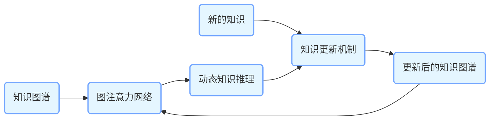

# 基于图注意力的动态知识推理更新机制设计

> 关键词：图注意力机制、动态知识推理、知识更新机制、图神经网络、知识图谱

> 摘要：本文聚焦于基于图注意力的动态知识推理更新机制的设计。首先介绍了该研究的背景，明确目的和范围，界定预期读者及文档结构。接着阐述核心概念与联系，包括图注意力机制、动态知识推理等概念及它们之间的关系，并给出文本示意图和 Mermaid 流程图。详细讲解核心算法原理，使用 Python 源代码进行说明，同时分析数学模型和公式并举例。通过项目实战，展示代码实际案例并详细解释。探讨了实际应用场景，推荐相关工具和资源，最后总结未来发展趋势与挑战，解答常见问题并提供扩展阅读和参考资料。旨在为相关领域的研究和应用提供全面且深入的指导。

## 1. 背景介绍 
### 1.1 目的和范围
在当今信息爆炸的时代，知识呈现出海量、动态变化的特点。传统的知识推理方法往往难以适应这种动态性，无法及时准确地更新知识并进行有效的推理。本研究的目的在于设计一种基于图注意力的动态知识推理更新机制，以提高知识推理的准确性和效率，能够在知识不断变化的环境中实时更新知识表示并进行合理推理。

本研究的范围主要涵盖图注意力机制在动态知识推理中的应用，包括如何利用图注意力机制捕捉知识图谱中实体和关系的动态特征，设计知识更新的算法和策略，以及对整个机制的性能评估和优化。同时，将结合实际的项目案例，验证该机制在不同场景下的有效性和实用性。

### 1.2 预期读者
本文预期读者主要包括人工智能、计算机科学、信息检索等领域的研究人员和学者，他们对知识推理、图神经网络等相关技术有一定的了解，希望深入探索基于图注意力的动态知识推理更新机制的原理和实现方法。此外，从事自然语言处理、智能问答系统、推荐系统等实际应用开发的工程师也可以从本文中获取有价值的信息，将该机制应用到实际项目中。

### 1.3 文档结构概述
本文将按照以下结构进行组织：
- 核心概念与联系：介绍图注意力机制、动态知识推理等核心概念，分析它们之间的联系，并给出文本示意图和 Mermaid 流程图。
- 核心算法原理 & 具体操作步骤：详细讲解基于图注意力的动态知识推理更新机制的核心算法原理，使用 Python 源代码进行说明，并给出具体的操作步骤。
- 数学模型和公式 & 详细讲解 & 举例说明：建立该机制的数学模型，给出相关公式，并通过具体例子进行详细讲解。
- 项目实战：代码实际案例和详细解释说明：通过一个实际的项目案例，展示该机制的代码实现过程，并对代码进行详细解释和分析。
- 实际应用场景：探讨该机制在不同领域的实际应用场景，如智能问答系统、推荐系统等。
- 工具和资源推荐：推荐相关的学习资源、开发工具框架和论文著作，帮助读者进一步深入学习和研究。
- 总结：未来发展趋势与挑战：总结本文的主要内容，分析该机制的未来发展趋势和面临的挑战。
- 附录：常见问题与解答：解答读者在阅读和实践过程中可能遇到的常见问题。
- 扩展阅读 & 参考资料：提供相关的扩展阅读材料和参考资料，方便读者进一步探索相关领域的知识。

### 1.4 术语表
#### 1.4.1 核心术语定义
- **图注意力机制（Graph Attention Mechanism）**：一种用于图数据的注意力机制，能够根据节点之间的关系和特征，自适应地分配注意力权重，从而更好地捕捉图的结构信息。
- **动态知识推理（Dynamic Knowledge Reasoning）**：在知识不断变化的环境中，根据新的知识和已有知识进行推理，得出新的结论的过程。
- **知识图谱（Knowledge Graph）**：一种以图的形式表示知识的方法，其中节点表示实体，边表示实体之间的关系。
- **知识更新（Knowledge Update）**：根据新的知识和信息，对已有的知识表示进行更新和修正的过程。

#### 1.4.2 相关概念解释
- **注意力机制（Attention Mechanism）**：一种模拟人类注意力的机制，能够在处理大量信息时，自动聚焦于重要的部分，提高信息处理的效率和准确性。
- **图神经网络（Graph Neural Network，GNN）**：一类专门用于处理图数据的神经网络，能够学习图的结构信息和节点特征，广泛应用于知识图谱、社交网络等领域。
- **表示学习（Representation Learning）**：一种自动学习数据表示的方法，能够将原始数据转换为低维的向量表示，便于后续的机器学习和推理任务。

#### 1.4.3 缩略词列表
- **GAT**：Graph Attention Network（图注意力网络）
- **GNN**：Graph Neural Network（图神经网络）
- **KG**：Knowledge Graph（知识图谱）

## 2. 核心概念与联系 

### 核心概念原理
#### 图注意力机制
图注意力机制是在图神经网络的基础上引入了注意力机制。传统的图神经网络在处理图数据时，通常对所有邻居节点一视同仁，而图注意力机制能够根据节点之间的特征和关系，自适应地为每个邻居节点分配不同的注意力权重。具体来说，对于图中的一个节点 $v_i$，它会计算与每个邻居节点 $v_j$ 之间的注意力系数 $\alpha_{ij}$，该系数表示节点 $v_j$ 对节点 $v_i$ 的重要程度。然后，根据这些注意力系数对邻居节点的特征进行加权求和，得到节点 $v_i$ 的更新特征。

#### 动态知识推理
动态知识推理是在知识不断变化的环境中进行推理的过程。知识图谱中的知识可能会随着时间的推移而发生变化，例如新的实体和关系被发现，旧的知识被修正或删除。动态知识推理需要能够及时捕捉这些变化，并根据新的知识和已有知识进行推理，得出新的结论。

#### 知识更新机制
知识更新机制是指根据新的知识和信息，对已有的知识表示进行更新和修正的过程。在基于图注意力的动态知识推理中，知识更新机制需要结合图注意力机制，根据新的知识和图的结构变化，更新节点和边的特征表示，从而保证知识图谱的准确性和时效性。

### 架构的文本示意图
我们可以将基于图注意力的动态知识推理更新机制的架构描述如下：

知识图谱作为输入，包含实体节点和关系边。图注意力网络对知识图谱进行处理，通过计算注意力权重，捕捉节点之间的重要关系。在动态知识推理过程中，当有新的知识到来时，知识更新机制会根据新的知识和图注意力网络的输出，对知识图谱进行更新。更新后的知识图谱再输入到图注意力网络中，进行新一轮的推理。整个过程形成一个闭环，不断迭代更新知识并进行推理。

### Mermaid 流程图


该流程图展示了基于图注意力的动态知识推理更新机制的工作流程。首先，知识图谱输入到图注意力网络中进行处理，得到推理结果。然后，当有新的知识到来时，知识更新机制结合推理结果和新的知识对知识图谱进行更新。更新后的知识图谱再次输入到图注意力网络中，继续进行推理和更新，形成一个循环的过程。

## 3. 核心算法原理 & 具体操作步骤 

### 核心算法原理
#### 图注意力层
图注意力层是图注意力网络的核心组件，它的主要作用是计算节点之间的注意力权重，并根据这些权重对邻居节点的特征进行加权求和。下面是图注意力层的详细算法原理：

假设我们有一个图 $G=(V, E)$，其中 $V$ 是节点集合，$E$ 是边集合。每个节点 $v_i \in V$ 有一个特征向量 $h_i \in \mathbb{R}^F$，其中 $F$ 是特征维度。图注意力层的输入是节点的特征矩阵 $H = [h_1, h_2, \cdots, h_N]^T \in \mathbb{R}^{N \times F}$，其中 $N$ 是节点数量。

首先，我们定义一个可学习的线性变换矩阵 $W \in \mathbb{R}^{F' \times F}$，将输入特征 $h_i$ 变换到一个新的特征空间 $\mathbb{R}^{F'}$ 中，得到 $h_i' = W h_i$。

然后，对于节点 $v_i$ 和它的邻居节点 $v_j$，我们计算它们之间的注意力系数 $\alpha_{ij}$，计算公式如下：

$\alpha_{ij} = \frac{\exp(\text{LeakyReLU}(a^T [h_i' || h_j']))}{\sum_{k \in \mathcal{N}(i)} \exp(\text{LeakyReLU}(a^T [h_i' || h_k']))}$

其中，$a \in \mathbb{R}^{2F'}$ 是一个可学习的注意力向量，$\mathcal{N}(i)$ 是节点 $v_i$ 的邻居节点集合，$||$ 表示向量拼接操作，$\text{LeakyReLU}$ 是一个激活函数。

最后，我们根据注意力系数 $\alpha_{ij}$ 对邻居节点的特征进行加权求和，得到节点 $v_i$ 的更新特征 $h_i^{new}$：

$h_i^{new} = \sigma\left(\sum_{j \in \mathcal{N}(i)} \alpha_{ij} h_j'\right)$

其中，$\sigma$ 是一个激活函数，通常使用 $\text{ReLU}$ 或 $\text{Softmax}$ 函数。

#### 动态知识推理和更新
在动态知识推理过程中，当有新的知识到来时，我们需要对知识图谱进行更新。具体来说，我们可以根据新的知识更新节点和边的特征，然后将更新后的知识图谱输入到图注意力网络中进行推理。

假设新的知识是一个新的三元组 $(s, r, o)$，其中 $s$ 是头实体，$r$ 是关系，$o$ 是尾实体。我们可以通过以下步骤进行知识更新：

1. 如果 $s$ 或 $o$ 是新的实体，则在知识图谱中添加相应的节点，并初始化其特征。
2. 添加边 $(s, r, o)$ 到知识图谱中，并初始化边的特征。
3. 根据新的知识和图注意力网络的输出，更新节点和边的特征。

### 具体操作步骤
#### 步骤 1：数据预处理
首先，我们需要对知识图谱数据进行预处理，将其转换为适合图注意力网络输入的格式。具体来说，我们需要将实体和关系进行编码，得到节点和边的特征矩阵。

#### 步骤 2：构建图注意力网络
使用 PyTorch 或 TensorFlow 等深度学习框架构建图注意力网络，包括图注意力层和其他必要的层。

#### 步骤 3：训练图注意力网络
使用训练数据对图注意力网络进行训练，优化网络的参数，使其能够准确地捕捉图的结构信息和节点特征。

#### 步骤 4：动态知识推理和更新
在推理阶段，当有新的知识到来时，根据上述的知识更新步骤对知识图谱进行更新，然后将更新后的知识图谱输入到图注意力网络中进行推理。

### Python 源代码实现
以下是一个使用 PyTorch 实现图注意力层的示例代码：

```python
import torch
import torch.nn as nn
import torch.nn.functional as F

class GraphAttentionLayer(nn.Module):
    def __init__(self, in_features, out_features, dropout, alpha, concat=True):
        super(GraphAttentionLayer, self).__init__()
        self.dropout = dropout
        self.in_features = in_features
        self.out_features = out_features
        self.alpha = alpha
        self.concat = concat

        self.W = nn.Parameter(torch.empty(size=(in_features, out_features)))
        nn.init.xavier_uniform_(self.W.data, gain=1.414)
        self.a = nn.Parameter(torch.empty(size=(2*out_features, 1)))
        nn.init.xavier_uniform_(self.a.data, gain=1.414)

        self.leakyrelu = nn.LeakyReLU(self.alpha)

    def forward(self, h, adj):
        Wh = torch.mm(h, self.W)  # h.shape: (N, in_features), Wh.shape: (N, out_features)
        e = self._prepare_attentional_mechanism_input(Wh)

        zero_vec = -9e15*torch.ones_like(e)
        attention = torch.where(adj > 0, e, zero_vec)
        attention = F.softmax(attention, dim=1)
        attention = F.dropout(attention, self.dropout, training=self.training)
        h_prime = torch.matmul(attention, Wh)

        if self.concat:
            return F.elu(h_prime)
        else:
            return h_prime

    def _prepare_attentional_mechanism_input(self, Wh):
        # Wh.shape (N, out_feature)
        # self.a.shape (2 * out_feature, 1)
        # Wh1&2.shape (N, 1)
        # e.shape (N, N)
        Wh1 = torch.matmul(Wh, self.a[:self.out_features, :])
        Wh2 = torch.matmul(Wh, self.a[self.out_features:, :])
        # broadcast add
        e = Wh1 + Wh2.T
        return self.leakyrelu(e)

    def __repr__(self):
        return self.__class__.__name__ + ' (' + str(self.in_features) + ' -> ' + str(self.out_features) + ')'


```

### 代码解释
- `__init__` 方法：初始化图注意力层的参数，包括输入特征维度、输出特征维度、丢弃率、注意力系数 $\alpha$ 等。
- `forward` 方法：实现图注意力层的前向传播过程，包括计算注意力系数、对邻居节点的特征进行加权求和等。
- `_prepare_attentional_mechanism_input` 方法：辅助方法，用于计算注意力系数的中间步骤。

通过上述代码，我们可以构建一个简单的图注意力网络，并使用它进行知识推理和更新。

## 4. 数学模型和公式 & 详细讲解 & 举例说明 

### 数学模型
基于图注意力的动态知识推理更新机制可以用以下数学模型来描述：

#### 图注意力网络模型
图注意力网络可以看作是一个函数 $f: \mathcal{G} \rightarrow \mathcal{H}$，其中 $\mathcal{G}=(V, E)$ 是知识图谱，$\mathcal{H}$ 是节点的特征表示空间。图注意力网络通过多层图注意力层对知识图谱进行处理，将知识图谱中的节点和边的信息映射到特征表示空间中。

#### 知识更新模型
知识更新模型可以表示为一个函数 $g: \mathcal{G}, \mathcal{K}_{new} \rightarrow \mathcal{G}_{new}$，其中 $\mathcal{G}$ 是当前的知识图谱，$\mathcal{K}_{new}$ 是新的知识，$\mathcal{G}_{new}$ 是更新后的知识图谱。知识更新模型根据新的知识和图注意力网络的输出，对知识图谱进行更新。

### 数学公式
#### 图注意力系数公式
如前面所述，节点 $v_i$ 和邻居节点 $v_j$ 之间的注意力系数 $\alpha_{ij}$ 的计算公式为：

$\alpha_{ij} = \frac{\exp(\text{LeakyReLU}(a^T [h_i' || h_j']))}{\sum_{k \in \mathcal{N}(i)} \exp(\text{LeakyReLU}(a^T [h_i' || h_k']))}$

其中，$h_i' = W h_i$ 是节点 $v_i$ 经过线性变换后的特征向量，$a$ 是可学习的注意力向量，$\mathcal{N}(i)$ 是节点 $v_i$ 的邻居节点集合。

#### 节点更新公式
节点 $v_i$ 的更新特征 $h_i^{new}$ 的计算公式为：

$h_i^{new} = \sigma\left(\sum_{j \in \mathcal{N}(i)} \alpha_{ij} h_j'\right)$

其中，$\sigma$ 是激活函数。

### 详细讲解
#### 图注意力系数公式
图注意力系数公式的作用是计算节点 $v_i$ 对每个邻居节点 $v_j$ 的注意力权重。通过计算 $a^T [h_i' || h_j']$，我们可以得到节点 $v_i$ 和 $v_j$ 之间的相关性得分。然后，使用 $\text{LeakyReLU}$ 激活函数对得分进行非线性变换，最后通过 $\text{Softmax}$ 函数将得分转换为概率分布，得到注意力系数 $\alpha_{ij}$。这样，注意力系数 $\alpha_{ij}$ 就表示了节点 $v_j$ 对节点 $v_i$ 的重要程度。

#### 节点更新公式
节点更新公式根据注意力系数 $\alpha_{ij}$ 对邻居节点的特征进行加权求和，得到节点 $v_i$ 的更新特征 $h_i^{new}$。通过这种方式，节点 $v_i$ 可以更好地融合邻居节点的信息，从而捕捉图的结构信息。

### 举例说明
假设我们有一个简单的知识图谱，包含 3 个节点 $v_1, v_2, v_3$，节点的特征向量分别为 $h_1 = [1, 2]^T, h_2 = [3, 4]^T, h_3 = [5, 6]^T$，邻接矩阵为：

$A = \begin{bmatrix}
0 & 1 & 1 \\
1 & 0 & 0 \\
1 & 0 & 0
\end{bmatrix}$

表示节点 $v_1$ 与节点 $v_2$ 和 $v_3$ 相邻，节点 $v_2$ 和 $v_3$ 只与节点 $v_1$ 相邻。

首先，我们定义线性变换矩阵 $W = \begin{bmatrix}
0.1 & 0.2 \\
0.3 & 0.4
\end{bmatrix}$ 和注意力向量 $a = [0.1, 0.2, 0.3, 0.4]^T$。

计算节点经过线性变换后的特征向量：

$h_1' = W h_1 = \begin{bmatrix}
0.1 & 0.2 \\
0.3 & 0.4
\end{bmatrix} \begin{bmatrix}
1 \\
2
\end{bmatrix} = \begin{bmatrix}
0.5 \\
1.1
\end{bmatrix}$

$h_2' = W h_2 = \begin{bmatrix}
0.1 & 0.2 \\
0.3 & 0.4
\end{bmatrix} \begin{bmatrix}
3 \\
4
\end{bmatrix} = \begin{bmatrix}
1.1 \\
2.5
\end{bmatrix}$

$h_3' = W h_3 = \begin{bmatrix}
0.1 & 0.2 \\
0.3 & 0.4
\end{bmatrix} \begin{bmatrix}
5 \\
6
\end{bmatrix} = \begin{bmatrix}
1.7 \\
3.9
\end{bmatrix}$

计算注意力系数：

对于节点 $v_1$，其邻居节点为 $v_2$ 和 $v_3$。

$[h_1' || h_2'] = \begin{bmatrix}
0.5 \\
1.1 \\
1.1 \\
2.5
\end{bmatrix}$

$[h_1' || h_3'] = \begin{bmatrix}
0.5 \\
1.1 \\
1.7 \\
3.9
\end{bmatrix}$

$a^T [h_1' || h_2'] = [0.1, 0.2, 0.3, 0.4] \begin{bmatrix}
0.5 \\
1.1 \\
1.1 \\
2.5
\end{bmatrix} = 1.62$

$a^T [h_1' || h_3'] = [0.1, 0.2, 0.3, 0.4] \begin{bmatrix}
0.5 \\
1.1 \\
1.7 \\
3.9
\end{bmatrix} = 2.64$

$\text{LeakyReLU}(a^T [h_1' || h_2']) = 1.62$

$\text{LeakyReLU}(a^T [h_1' || h_3']) = 2.64$

$\alpha_{12} = \frac{\exp(1.62)}{\exp(1.62) + \exp(2.64)} \approx 0.21$

$\alpha_{13} = \frac{\exp(2.64)}{\exp(1.62) + \exp(2.64)} \approx 0.79$

计算节点 $v_1$ 的更新特征：

$h_1^{new} = \text{ReLU}(\alpha_{12} h_2' + \alpha_{13} h_3') = \text{ReLU}(0.21 \begin{bmatrix}
1.1 \\
2.5
\end{bmatrix} + 0.79 \begin{bmatrix}
1.7 \\
3.9
\end{bmatrix}) = \text{ReLU}(\begin{bmatrix}
1.53 \\
3.51
\end{bmatrix}) = \begin{bmatrix}
1.53 \\
3.51
\end{bmatrix}$

通过这个例子，我们可以更直观地理解图注意力机制的计算过程。

## 5. 项目实战：代码实际案例和详细解释说明 

### 5.1  开发环境搭建
#### 操作系统
建议使用 Linux 系统，如 Ubuntu 18.04 或更高版本，因为 Linux 系统在深度学习开发中具有更好的稳定性和兼容性。

#### Python 环境
安装 Python 3.7 或更高版本，可以使用 Anaconda 来管理 Python 环境。以下是创建和激活虚拟环境的命令：

```bash
conda create -n graph_attention python=3.8
conda activate graph_attention
```

#### 深度学习框架
安装 PyTorch 和相关的库，用于构建和训练图注意力网络。可以根据自己的 CUDA 版本选择合适的 PyTorch 版本，以下是安装命令：

```bash
pip install torch torchvision torchaudio
```

#### 其他依赖库
安装其他必要的依赖库，如 `numpy`、`scikit-learn` 等：

```bash
pip install numpy scikit-learn
```

### 5.2  源代码详细实现和代码解读
以下是一个完整的基于图注意力网络的动态知识推理更新机制的代码示例：

```python
import torch
import torch.nn as nn
import torch.nn.functional as F
import numpy as np
import scipy.sparse as sp

# 图注意力层
class GraphAttentionLayer(nn.Module):
    def __init__(self, in_features, out_features, dropout, alpha, concat=True):
        super(GraphAttentionLayer, self).__init__()
        self.dropout = dropout
        self.in_features = in_features
        self.out_features = out_features
        self.alpha = alpha
        self.concat = concat

        self.W = nn.Parameter(torch.empty(size=(in_features, out_features)))
        nn.init.xavier_uniform_(self.W.data, gain=1.414)
        self.a = nn.Parameter(torch.empty(size=(2*out_features, 1)))
        nn.init.xavier_uniform_(self.a.data, gain=1.414)

        self.leakyrelu = nn.LeakyReLU(self.alpha)

    def forward(self, h, adj):
        Wh = torch.mm(h, self.W)  # h.shape: (N, in_features), Wh.shape: (N, out_features)
        e = self._prepare_attentional_mechanism_input(Wh)

        zero_vec = -9e15*torch.ones_like(e)
        attention = torch.where(adj > 0, e, zero_vec)
        attention = F.softmax(attention, dim=1)
        attention = F.dropout(attention, self.dropout, training=self.training)
        h_prime = torch.matmul(attention, Wh)

        if self.concat:
            return F.elu(h_prime)
        else:
            return h_prime

    def _prepare_attentional_mechanism_input(self, Wh):
        Wh1 = torch.matmul(Wh, self.a[:self.out_features, :])
        Wh2 = torch.matmul(Wh, self.a[self.out_features:, :])
        e = Wh1 + Wh2.T
        return self.leakyrelu(e)

    def __repr__(self):
        return self.__class__.__name__ + ' (' + str(self.in_features) + ' -> ' + str(self.out_features) + ')'

# 图注意力网络
class GAT(nn.Module):
    def __init__(self, nfeat, nhid, nclass, dropout, alpha, nheads):
        super(GAT, self).__init__()
        self.dropout = dropout

        self.attentions = [GraphAttentionLayer(nfeat, nhid, dropout=dropout, alpha=alpha, concat=True) for _ in range(nheads)]
        for i, attention in enumerate(self.attentions):
            self.add_module('attention_{}'.format(i), attention)

        self.out_att = GraphAttentionLayer(nhid * nheads, nclass, dropout=dropout, alpha=alpha, concat=False)

    def forward(self, x, adj):
        x = F.dropout(x, self.dropout, training=self.training)
        x = torch.cat([att(x, adj) for att in self.attentions], dim=1)
        x = F.dropout(x, self.dropout, training=self.training)
        x = F.elu(self.out_att(x, adj))
        return F.log_softmax(x, dim=1)

# 数据预处理函数
def normalize_adj(mx):
    """Row-normalize sparse matrix"""
    rowsum = np.array(mx.sum(1))
    r_inv_sqrt = np.power(rowsum, -0.5).flatten()
    r_inv_sqrt[np.isinf(r_inv_sqrt)] = 0.
    r_mat_inv_sqrt = sp.diags(r_inv_sqrt)
    return mx.dot(r_mat_inv_sqrt).transpose().dot(r_mat_inv_sqrt)

def sparse_mx_to_torch_sparse_tensor(sparse_mx):
    """Convert a scipy sparse matrix to a torch sparse tensor."""
    sparse_mx = sparse_mx.tocoo().astype(np.float32)
    indices = torch.from_numpy(
        np.vstack((sparse_mx.row, sparse_mx.col)).astype(np.int64))
    values = torch.from_numpy(sparse_mx.data)
    shape = torch.Size(sparse_mx.shape)
    return torch.sparse.FloatTensor(indices, values, shape)

# 主函数
def main():
    # 生成示例数据
    n_nodes = 10
    n_features = 5
    n_classes = 2
    adj = sp.random(n_nodes, n_nodes, density=0.2, format='csr')
    adj = adj + adj.T.multiply(adj.T > adj) - adj.multiply(adj.T > adj)
    adj = normalize_adj(adj + sp.eye(adj.shape[0]))
    adj = sparse_mx_to_torch_sparse_tensor(adj)

    features = torch.randn(n_nodes, n_features)
    labels = torch.randint(0, n_classes, (n_nodes,))

    # 初始化模型
    model = GAT(nfeat=n_features, nhid=8, nclass=n_classes, dropout=0.6, alpha=0.2, nheads=8)
    optimizer = torch.optim.Adam(model.parameters(), lr=0.005, weight_decay=5e-4)

    # 训练模型
    epochs = 100
    for epoch in range(epochs):
        model.train()
        optimizer.zero_grad()
        output = model(features, adj)
        loss_train = F.nll_loss(output, labels)
        loss_train.backward()
        optimizer.step()

        print(f'Epoch: {epoch+1}/{epochs}, Loss: {loss_train.item()}')

if __name__ == "__main__":
    main()


```

### 代码解读
#### 图注意力层（GraphAttentionLayer）
- `__init__` 方法：初始化图注意力层的参数，包括输入特征维度、输出特征维度、丢弃率、注意力系数 $\alpha$ 等。
- `forward` 方法：实现图注意力层的前向传播过程，包括计算注意力系数、对邻居节点的特征进行加权求和等。
- `_prepare_attentional_mechanism_input` 方法：辅助方法，用于计算注意力系数的中间步骤。

#### 图注意力网络（GAT）
- `__init__` 方法：初始化图注意力网络的参数，包括输入特征维度、隐藏层维度、输出类别数、丢弃率、注意力系数 $\alpha$ 和多头注意力的头数等。
- `forward` 方法：实现图注意力网络的前向传播过程，包括多个图注意力层的堆叠和输出层的计算。

#### 数据预处理函数
- `normalize_adj` 方法：对邻接矩阵进行归一化处理，使其满足图卷积网络的输入要求。
- `sparse_mx_to_torch_sparse_tensor` 方法：将稀疏矩阵转换为 PyTorch 的稀疏张量。

#### 主函数（main）
- 生成示例数据，包括邻接矩阵、节点特征和标签。
- 初始化图注意力网络模型和优化器。
- 训练模型，并打印每个 epoch 的损失值。

### 5.3  代码解读与分析
#### 模型结构分析
该代码实现了一个简单的图注意力网络，包括多个图注意力层的堆叠和一个输出层。通过多头注意力机制，模型可以更好地捕捉图的结构信息和节点特征。

#### 训练过程分析
在训练过程中，使用负对数似然损失函数（`F.nll_loss`）来计算损失，并使用 Adam 优化器来更新模型的参数。通过不断迭代训练，模型的损失值逐渐降低，说明模型在不断学习和优化。

#### 可扩展性分析
该代码具有较好的可扩展性，可以通过调整模型的参数，如隐藏层维度、多头注意力的头数等，来提高模型的性能。同时，也可以将该模型应用到不同的知识图谱数据集上，进行动态知识推理和更新。

## 6. 实际应用场景 
### 智能问答系统
在智能问答系统中，知识图谱可以作为知识库，存储大量的实体和关系信息。基于图注意力的动态知识推理更新机制可以实时更新知识图谱，当用户提出问题时，系统可以根据更新后的知识图谱进行推理，给出准确的答案。例如，在一个医学问答系统中，当有新的医学研究成果发布时，知识图谱可以及时更新，系统可以根据新的知识为用户提供更准确的医学建议。

### 推荐系统
在推荐系统中，知识图谱可以用于建模用户和物品之间的关系。基于图注意力的动态知识推理更新机制可以根据用户的行为和反馈，实时更新知识图谱，从而为用户提供更个性化的推荐。例如，在一个电商推荐系统中，当用户购买了新的商品时，知识图谱可以更新用户的兴趣偏好，系统可以根据更新后的知识图谱为用户推荐更符合其需求的商品。

### 金融风险评估
在金融领域，知识图谱可以用于建模金融实体之间的关系，如企业、银行、投资者等。基于图注意力的动态知识推理更新机制可以实时监测金融市场的变化，更新知识图谱中的信息，从而对金融风险进行评估和预警。例如，当一家企业出现财务问题时，知识图谱可以及时更新相关信息，系统可以根据更新后的知识图谱对该企业的风险进行评估，并为投资者提供决策建议。

### 社交网络分析
在社交网络中，知识图谱可以用于建模用户之间的关系和社交行为。基于图注意力的动态知识推理更新机制可以根据用户的社交活动，实时更新知识图谱，从而分析用户的社交圈子和行为模式。例如，在一个社交平台中，当用户关注了新的好友或发布了新的内容时，知识图谱可以更新相关信息，系统可以根据更新后的知识图谱分析用户的社交影响力和兴趣偏好。

## 7. 工具和资源推荐
### 7.1 学习资源推荐
#### 7.1.1 书籍推荐
- 《深度学习》（Deep Learning）：由 Ian Goodfellow、Yoshua Bengio 和 Aaron Courville 编写，是深度学习领域的经典教材，涵盖了深度学习的基本概念、算法和应用。
- 《图神经网络：基础、前沿与应用》：介绍了图神经网络的基本原理、算法和应用，包括图卷积网络、图注意力网络等。
- 《知识图谱：方法、实践与应用》：详细介绍了知识图谱的构建、推理和应用，适合对知识图谱感兴趣的读者。

#### 7.1.2 在线课程
- Coursera 上的 “Deep Learning Specialization”：由 Andrew Ng 教授授课，是深度学习领域的经典在线课程，涵盖了深度学习的各个方面。
- edX 上的 “Graph Neural Networks”：介绍了图神经网络的基本原理和应用，包括图卷积网络、图注意力网络等。
- 中国大学 MOOC 上的 “知识图谱”：由国内知名高校的教授授课，介绍了知识图谱的构建、推理和应用。

#### 7.1.3 技术博客和网站
- Medium 上的 Towards Data Science：是一个数据科学和机器学习领域的技术博客，经常发布关于图神经网络、知识图谱等方面的文章。
- arXiv：是一个预印本论文平台，提供了大量关于图神经网络、知识图谱等领域的最新研究成果。
- 开源中国：是一个国内的开源技术社区，提供了大量关于人工智能、机器学习等领域的技术文章和开源项目。

### 7.2 开发工具框架推荐
#### 7.2.1 IDE和编辑器
- PyCharm：是一款专门为 Python 开发设计的集成开发环境，提供了丰富的代码编辑、调试和测试功能。
- Jupyter Notebook：是一个交互式的开发环境，适合进行数据探索和模型实验。
- Visual Studio Code：是一款轻量级的代码编辑器，支持多种编程语言和插件，适合快速开发和调试。

#### 7.2.2 调试和性能分析工具
- PyTorch Profiler：是 PyTorch 提供的性能分析工具，可以帮助用户分析模型的性能瓶颈和内存使用情况。
- TensorBoard：是 TensorFlow 提供的可视化工具，可以帮助用户可视化模型的训练过程和性能指标。
- cProfile：是 Python 内置的性能分析工具，可以帮助用户分析代码的性能瓶颈。

#### 7.2.3 相关框架和库
- PyTorch Geometric：是一个基于 PyTorch 的图神经网络框架，提供了丰富的图神经网络层和数据集。
- DGL（Deep Graph Library）：是一个开源的图神经网络框架，支持多种深度学习框架，如 PyTorch、TensorFlow 等。
- NetworkX：是一个用于创建、操作和研究复杂网络的 Python 库，提供了丰富的图算法和数据结构。

### 7.3 相关论文著作推荐
#### 7.3.1 经典论文
- “Graph Attention Networks”：提出了图注意力网络（GAT）的概念，是图注意力机制的经典论文。
- “Knowledge Graph Embedding: A Survey of Approaches and Applications”：对知识图谱嵌入的方法和应用进行了全面的综述。
- “Dynamic Knowledge Graph Embedding for Temporal Knowledge Graph Completion”：研究了动态知识图谱嵌入的方法，用于解决时间知识图谱补全的问题。

#### 7.3.2 最新研究成果
- 可以通过 arXiv、ACM Digital Library、IEEE Xplore 等学术数据库搜索关于图注意力机制、动态知识推理等方面的最新研究成果。

#### 7.3.3 应用案例分析
- 可以参考一些实际应用案例的论文和报告，如智能问答系统、推荐系统等领域的应用案例，了解基于图注意力的动态知识推理更新机制在实际应用中的效果和挑战。

## 8. 总结：未来发展趋势与挑战
### 未来发展趋势
#### 多模态融合
未来的研究可能会将图注意力机制与多模态数据（如图像、文本、音频等）相结合，实现更全面、更准确的知识推理和更新。例如，在一个智能安防系统中，可以将视频监控数据和知识图谱相结合，通过图注意力机制对视频中的人物和事件进行推理和分析。

#### 强化学习与知识推理的结合
强化学习可以用于优化知识推理的策略，提高推理的效率和准确性。未来的研究可能会将强化学习与基于图注意力的动态知识推理更新机制相结合，实现智能的知识推理和决策。例如，在一个机器人导航系统中，可以使用强化学习来优化机器人的导航策略，同时结合知识图谱进行环境感知和推理。

#### 可解释性和透明性
随着人工智能技术的广泛应用，可解释性和透明性成为了重要的研究方向。未来的研究可能会致力于提高基于图注意力的动态知识推理更新机制的可解释性和透明性，使人们能够更好地理解模型的决策过程和推理结果。例如，在一个医疗诊断系统中，医生需要了解模型的诊断依据和推理过程，以便做出更准确的决策。

### 挑战
#### 大规模知识图谱的处理
随着知识图谱的规模不断增大，如何高效地处理大规模知识图谱成为了一个挑战。图注意力机制在处理大规模图数据时，可能会面临计算复杂度高、内存占用大等问题。未来的研究需要开发更高效的算法和技术，以提高大规模知识图谱的处理能力。

#### 动态知识的实时更新
在实际应用中，知识往往是动态变化的，需要实时更新知识图谱。如何快速、准确地更新知识图谱，同时保证推理的准确性和稳定性，是一个需要解决的问题。未来的研究需要开发更高效的知识更新算法和策略，以适应动态知识的实时更新需求。

#### 数据质量和噪声处理
知识图谱中的数据质量和噪声会影响知识推理的准确性。如何处理数据中的噪声和错误，提高数据质量，是一个重要的挑战。未来的研究需要开发更有效的数据清洗和预处理方法，以提高知识推理的准确性和可靠性。

## 9. 附录：常见问题与解答
### 问题 1：图注意力机制和传统的图神经网络有什么区别？
图注意力机制和传统的图神经网络的主要区别在于对邻居节点的处理方式。传统的图神经网络通常对所有邻居节点一视同仁，而图注意力机制能够根据节点之间的特征和关系，自适应地为每个邻居节点分配不同的注意力权重，从而更好地捕捉图的结构信息。

### 问题 2：如何选择合适的图注意力网络的参数？
选择合适的图注意力网络的参数需要进行实验和调优。一般来说，可以从以下几个方面入手：
- 隐藏层维度：可以通过实验选择不同的隐藏层维度，观察模型的性能变化，选择性能最优的隐藏层维度。
- 多头注意力的头数：多头注意力的头数可以控制模型对不同特征的关注程度，可以通过实验选择合适的头数。
- 丢弃率：丢弃率可以防止模型过拟合，可以通过实验选择合适的丢弃率。

### 问题 3：基于图注意力的动态知识推理更新机制在处理大规模知识图谱时会遇到什么问题？
在处理大规模知识图谱时，基于图注意力的动态知识推理更新机制可能会遇到以下问题：
- 计算复杂度高：图注意力机制需要计算节点之间的注意力系数，在大规模图数据中，计算复杂度会显著增加。
- 内存占用大：大规模知识图谱需要存储大量的节点和边信息，会占用大量的内存。
- 训练时间长：由于计算复杂度高和内存占用大，模型的训练时间会显著增加。

### 问题 4：如何评估基于图注意力的动态知识推理更新机制的性能？
可以从以下几个方面评估基于图注意力的动态知识推理更新机制的性能：
- 推理准确率：通过比较模型的推理结果和真实结果，计算推理准确率。
- 知识更新效率：评估模型在知识更新时的效率，包括更新时间和更新的准确性。
- 可扩展性：评估模型在处理大规模知识图谱时的可扩展性，包括计算复杂度和内存占用。

## 10. 扩展阅读 & 参考资料
### 扩展阅读
- 《人工智能：一种现代的方法》（Artificial Intelligence: A Modern Approach）：全面介绍了人工智能的基本概念、算法和应用，是人工智能领域的经典教材。
- 《神经网络与深度学习》（Neural Networks and Deep Learning）：由 Michael Nielsen 编写，是一本免费的在线书籍，详细介绍了神经网络和深度学习的基本原理和算法。
- 《图算法》（Graph Algorithms）：介绍了图算法的基本概念、算法和应用，包括图搜索、最短路径、最小生成树等。

### 参考资料
- Vaswani, A., Shazeer, N., Parmar, N., Uszkoreit, J., Jones, L., Gomez, A. N.,... & Polosukhin, I. (2017). Attention is all you need. Advances in neural information processing systems, 5998-6008.
- Velickovic, P., Cucurull, G., Casanova, A., Romero, A., Lio, P., & Bengio, Y. (2017). Graph attention networks. arXiv preprint arXiv:1710.10903.
- Bordes, A., Usunier, N., Garcia-Duran, A., Weston, J., & Yakhnenko, O. (2013). Translating embeddings for modeling multi-relational data. Advances in neural information processing systems, 2787-2795.

作者：AI天才研究院/AI Genius Institute & 禅与计算机程序设计艺术 /Zen And The Art of Computer Programming