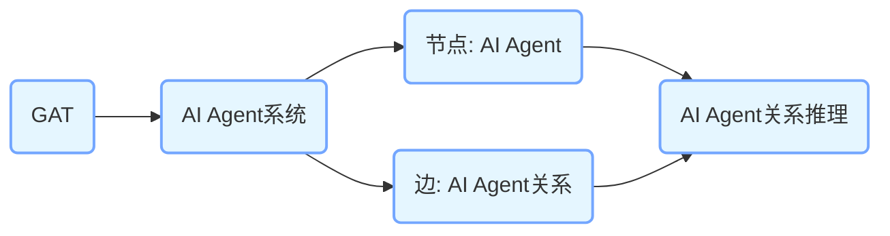

# 基于图注意力网络的AI Agent关系推理

> 关键词：图注意力网络、AI Agent、关系推理、深度学习、图神经网络

> 摘要：本文围绕基于图注意力网络的AI Agent关系推理展开深入探讨。首先介绍相关背景知识，包括研究目的、预期读者和文档结构等内容。接着阐述核心概念，分析图注意力网络与AI Agent的原理及联系，并给出相应的文本示意图和Mermaid流程图。详细讲解核心算法原理，用Python代码展示具体实现步骤。探讨数学模型和公式，通过举例加深理解。结合项目实战，展示代码实际案例并进行详细解释。分析实际应用场景，推荐相关的工具和资源。最后总结未来发展趋势与挑战，解答常见问题并提供扩展阅读与参考资料，旨在为读者全面呈现基于图注意力网络的AI Agent关系推理的理论与实践。

## 1. 背景介绍 
### 1.1 目的和范围
在人工智能领域，AI Agent通常代表具有自主决策和行动能力的智能实体。理解和推理AI Agent之间的关系对于多智能体系统的协同、智能决策以及复杂环境下的任务执行具有至关重要的意义。图注意力网络（Graph Attention Network，GAT）作为一种强大的图神经网络模型，能够有效地处理图结构数据，捕捉节点之间的复杂关系。本研究的目的在于探索如何利用图注意力网络来进行AI Agent关系推理，挖掘AI Agent之间隐藏的关系模式，提高多智能体系统的性能和效率。研究范围涵盖了图注意力网络的基本原理、AI Agent关系建模、相关算法的实现以及在不同场景下的应用。

### 1.2 预期读者
本文预期读者包括对人工智能、图神经网络、多智能体系统等领域感兴趣的研究人员、学生和工程师。对于希望深入了解图注意力网络在AI Agent关系推理中应用的专业人士，以及想要学习相关技术并将其应用于实际项目的开发者，本文都具有一定的参考价值。

### 1.3 文档结构概述
本文将按照以下结构进行阐述：首先介绍背景知识，包括研究目的、预期读者和文档结构等；接着讲解核心概念，分析图注意力网络和AI Agent的原理及联系；然后详细阐述核心算法原理和具体操作步骤，给出Python代码示例；再探讨数学模型和公式，并通过举例说明；结合项目实战，展示代码实际案例并进行详细解释；分析实际应用场景；推荐相关的工具和资源；最后总结未来发展趋势与挑战，解答常见问题并提供扩展阅读与参考资料。

### 1.4 术语表
#### 1.4.1 核心术语定义
- **图注意力网络（Graph Attention Network，GAT）**：一种基于图结构数据的神经网络模型，通过注意力机制自适应地学习节点之间的关系权重，从而更好地捕捉图的结构信息。
- **AI Agent**：具有自主决策和行动能力的智能实体，能够感知环境、做出决策并执行相应的动作。
- **关系推理**：根据已知信息推断AI Agent之间的关系，例如合作关系、竞争关系等。
- **图结构数据**：由节点和边组成的数据结构，节点表示实体，边表示实体之间的关系。

#### 1.4.2 相关概念解释
- **注意力机制**：在深度学习中，注意力机制允许模型在处理输入时自动关注不同部分的重要性，从而提高模型的性能。在图注意力网络中，注意力机制用于计算节点之间的关系权重。
- **多智能体系统**：由多个AI Agent组成的系统，这些智能体通过交互和协作来完成共同的任务。

#### 1.4.3 缩略词列表
- **GAT**：Graph Attention Network（图注意力网络）

## 2. 核心概念与联系 

### 图注意力网络原理
图注意力网络是一种专门用于处理图结构数据的神经网络模型。传统的图神经网络在处理节点特征时往往采用固定的邻接矩阵，而图注意力网络通过注意力机制，能够自适应地学习节点之间的关系权重。

其基本原理如下：对于图中的每个节点 $i$，它会计算与相邻节点 $j$ 之间的注意力系数 $\alpha_{ij}$，这个系数表示节点 $j$ 对节点 $i$ 的重要性。注意力系数的计算通常通过一个共享的注意力函数来实现，例如：

$$e_{ij} = a\left(\mathbf{W}h_i, \mathbf{W}h_j\right)$$

其中，$\mathbf{W}$ 是一个可学习的权重矩阵，$h_i$ 和 $h_j$ 分别是节点 $i$ 和节点 $j$ 的特征向量，$a$ 是注意力函数，通常采用一个单层前馈神经网络。

为了使注意力系数具有可比性，通常会对其进行归一化处理，例如使用softmax函数：

$$\alpha_{ij} = \frac{\exp\left(e_{ij}\right)}{\sum_{k\in\mathcal{N}_i}\exp\left(e_{ik}\right)}$$

其中，$\mathcal{N}_i$ 表示节点 $i$ 的邻居节点集合。

最后，节点 $i$ 的新特征表示可以通过聚合相邻节点的特征得到：

$$h_i' = \sigma\left(\sum_{j\in\mathcal{N}_i}\alpha_{ij}\mathbf{W}h_j\right)$$

其中，$\sigma$ 是激活函数，例如ReLU函数。

### AI Agent原理
AI Agent是具有自主决策和行动能力的智能实体。它通常由感知模块、决策模块和执行模块组成。感知模块用于感知环境信息，决策模块根据感知到的信息做出决策，执行模块执行决策模块给出的动作。

AI Agent的决策过程可以基于不同的算法，例如强化学习、决策树等。在多智能体系统中，AI Agent之间需要进行交互和协作，因此需要对它们之间的关系进行建模和推理。

### 图注意力网络与AI Agent的联系
可以将AI Agent看作图中的节点，AI Agent之间的关系看作图中的边，从而将AI Agent系统建模为一个图结构数据。图注意力网络可以用于处理这个图结构数据，学习AI Agent之间的关系权重，从而实现AI Agent关系推理。

例如，在一个多智能体游戏中，每个智能体可以看作一个节点，智能体之间的交互（如合作、竞争等）可以看作边。通过图注意力网络，可以学习到不同智能体之间的重要性，从而更好地理解智能体之间的关系，提高游戏的性能。

### 文本示意图
```plaintext
           +-------------------+
           |  图注意力网络    |
           |  (GAT)           |
           +-------------------+
                   |
                   |  处理图结构数据
                   v
           +-------------------+
           |  AI Agent系统     |
           |  (图结构数据)     |
           +-------------------+
                   |
                   |  节点: AI Agent
                   |  边: AI Agent关系
                   v
           +-------------------+
           |  AI Agent关系推理 |
           +-------------------+
```

### Mermaid流程图


## 3. 核心算法原理 & 具体操作步骤 

### 核心算法原理
图注意力网络的核心算法主要包括注意力系数的计算和节点特征的聚合。下面我们将详细介绍这两个步骤。

#### 注意力系数计算
注意力系数的计算是图注意力网络的关键步骤。如前面所述，对于节点 $i$ 和其邻居节点 $j$，注意力系数 $e_{ij}$ 可以通过以下公式计算：

$$e_{ij} = a\left(\mathbf{W}h_i, \mathbf{W}h_j\right)$$

其中，$\mathbf{W}$ 是一个可学习的权重矩阵，$h_i$ 和 $h_j$ 分别是节点 $i$ 和节点 $j$ 的特征向量，$a$ 是注意力函数。在实际实现中，通常采用一个单层前馈神经网络来实现注意力函数，例如：

$$e_{ij} = \mathbf{a}^T\left[\mathbf{W}h_i || \mathbf{W}h_j\right]$$

其中，$\mathbf{a}$ 是一个可学习的向量，$||$ 表示拼接操作。

#### 节点特征聚合
在计算出注意力系数后，需要对相邻节点的特征进行聚合，得到节点 $i$ 的新特征表示。节点 $i$ 的新特征表示可以通过以下公式计算：

$$h_i' = \sigma\left(\sum_{j\in\mathcal{N}_i}\alpha_{ij}\mathbf{W}h_j\right)$$

其中，$\alpha_{ij}$ 是归一化后的注意力系数，$\sigma$ 是激活函数，例如ReLU函数。

### 具体操作步骤
下面我们将使用Python和PyTorch库来实现图注意力网络的具体操作步骤。

```python
import torch
import torch.nn as nn
import torch.nn.functional as F

class GraphAttentionLayer(nn.Module):
    def __init__(self, in_features, out_features, dropout, alpha, concat=True):
        super(GraphAttentionLayer, self).__init__()
        self.dropout = dropout
        self.in_features = in_features
        self.out_features = out_features
        self.alpha = alpha
        self.concat = concat

        self.W = nn.Parameter(torch.empty(size=(in_features, out_features)))
        nn.init.xavier_uniform_(self.W.data, gain=1.414)
        self.a = nn.Parameter(torch.empty(size=(2*out_features, 1)))
        nn.init.xavier_uniform_(self.a.data, gain=1.414)

        self.leakyrelu = nn.LeakyReLU(self.alpha)

    def forward(self, h, adj):
        Wh = torch.mm(h, self.W)  # h.shape: (N, in_features), Wh.shape: (N, out_features)
        e = self._prepare_attentional_mechanism_input(Wh)

        zero_vec = -9e15*torch.ones_like(e)
        attention = torch.where(adj > 0, e, zero_vec)
        attention = F.softmax(attention, dim=1)
        attention = F.dropout(attention, self.dropout, training=self.training)
        h_prime = torch.matmul(attention, Wh)

        if self.concat:
            return F.elu(h_prime)
        else:
            return h_prime

    def _prepare_attentional_mechanism_input(self, Wh):
        N = Wh.size()[0]  # number of nodes

        # Below, two matrices are created that contain embeddings in their rows in different orders.
        # (e stands for embedding)
        # These are the rows of the first matrix (Wh_repeated_in_chunks): 
        # e1, e1, ..., e1,            e2, e2, ..., e2,            ..., eN, eN, ..., eN
        # '-------------' -> N times  '-------------' -> N times       '-------------' -> N times
        # 
        # These are the rows of the second matrix (Wh_repeated_alternating): 
        # e1, e2, ..., eN, e1, e2, ..., eN, ..., e1, e2, ..., eN 
        # '----------------------------------------------------' -> N times
        # 
        Wh_repeated_in_chunks = Wh.repeat_interleave(N, dim=0)
        Wh_repeated_alternating = Wh.repeat(N, 1)
        # Wh_repeated_in_chunks.shape == Wh_repeated_alternating.shape == (N * N, out_features)

        # The all_combination_matrix, created below, will look like this (|| denotes concatenation):
        # e1 || e1
        # e1 || e2
        # e1 || e3
        # ...
        # e1 || eN
        # e2 || e1
        # e2 || e2
        # e2 || e3
        # ...
        # e2 || eN
        # ...
        # eN || e1
        # eN || e2
        # eN || e3
        # ...
        # eN || eN

        all_combinations_matrix = torch.cat([Wh_repeated_in_chunks, Wh_repeated_alternating], dim=1)
        # all_combinations_matrix.shape == (N * N, 2 * out_features)

        e = torch.matmul(all_combinations_matrix, self.a).squeeze(1)
        # e.shape == (N * N,)

        return self.leakyrelu(e).view(N, N)

    def __repr__(self):
        return self.__class__.__name__ + ' (' + str(self.in_features) + ' -> ' + str(self.out_features) + ')'
```

### 代码解释
1. **初始化**：在 `__init__` 方法中，我们定义了图注意力层的参数，包括输入特征维度、输出特征维度、dropout率、注意力系数的负斜率 $\alpha$ 等。同时，我们初始化了权重矩阵 $\mathbf{W}$ 和注意力向量 $\mathbf{a}$。
2. **前向传播**：在 `forward` 方法中，我们首先计算 $Wh$，然后调用 `_prepare_attentional_mechanism_input` 方法计算注意力系数 $e_{ij}$。接着，我们使用 `softmax` 函数对注意力系数进行归一化处理，得到归一化后的注意力系数 $\alpha_{ij}$。最后，我们通过矩阵乘法聚合相邻节点的特征，得到节点的新特征表示。
3. **注意力系数计算**：在 `_prepare_attentional_mechanism_input` 方法中，我们通过拼接和矩阵乘法计算注意力系数 $e_{ij}$。具体来说，我们将 $Wh$ 进行重复和拼接，得到所有节点对的特征表示，然后通过矩阵乘法计算注意力系数。

## 4. 数学模型和公式 & 详细讲解 & 举例说明 

### 数学模型和公式
#### 注意力系数计算
如前面所述，注意力系数 $e_{ij}$ 的计算公式为：

$$e_{ij} = \mathbf{a}^T\left[\mathbf{W}h_i || \mathbf{W}h_j\right]$$

其中，$\mathbf{W}$ 是一个可学习的权重矩阵，$\mathbf{a}$ 是一个可学习的向量，$h_i$ 和 $h_j$ 分别是节点 $i$ 和节点 $j$ 的特征向量，$||$ 表示拼接操作。

#### 归一化处理
为了使注意力系数具有可比性，通常会对其进行归一化处理，使用softmax函数：

$$\alpha_{ij} = \frac{\exp\left(e_{ij}\right)}{\sum_{k\in\mathcal{N}_i}\exp\left(e_{ik}\right)}$$

其中，$\mathcal{N}_i$ 表示节点 $i$ 的邻居节点集合。

#### 节点特征聚合
节点 $i$ 的新特征表示可以通过以下公式计算：

$$h_i' = \sigma\left(\sum_{j\in\mathcal{N}_i}\alpha_{ij}\mathbf{W}h_j\right)$$

其中，$\sigma$ 是激活函数，例如ReLU函数。

### 详细讲解
#### 注意力系数计算
注意力系数 $e_{ij}$ 表示节点 $j$ 对节点 $i$ 的重要性。通过拼接和矩阵乘法，我们可以计算出所有节点对的注意力系数。注意力向量 $\mathbf{a}$ 可以学习到不同特征之间的重要性，从而自适应地调整注意力系数。

#### 归一化处理
归一化处理的目的是使注意力系数在节点 $i$ 的邻居节点集合内具有可比性。softmax函数将注意力系数转换为概率分布，使得所有邻居节点的注意力系数之和为1。

#### 节点特征聚合
节点特征聚合的过程是将相邻节点的特征按照注意力系数进行加权求和。这样，节点 $i$ 的新特征表示可以更好地反映其邻居节点的信息。激活函数 $\sigma$ 可以增加模型的非线性能力，提高模型的表达能力。

### 举例说明
假设我们有一个简单的图，包含3个节点，节点的特征向量维度为2。节点的特征矩阵 $H$ 为：

$$H = \begin{bmatrix}
1 & 2 \\
3 & 4 \\
5 & 6
\end{bmatrix}$$

邻接矩阵 $A$ 为：

$$A = \begin{bmatrix}
0 & 1 & 1 \\
1 & 0 & 1 \\
1 & 1 & 0
\end{bmatrix}$$

假设权重矩阵 $\mathbf{W}$ 为：

$$\mathbf{W} = \begin{bmatrix}
0.1 & 0.2 \\
0.3 & 0.4
\end{bmatrix}$$

注意力向量 $\mathbf{a}$ 为：

$$\mathbf{a} = \begin{bmatrix}
0.5 \\
0.6
\end{bmatrix}$$

#### 计算 $Wh$
$$Wh = H\mathbf{W} = \begin{bmatrix}
1 & 2 \\
3 & 4 \\
5 & 6
\end{bmatrix}\begin{bmatrix}
0.1 & 0.2 \\
0.3 & 0.4
\end{bmatrix} = \begin{bmatrix}
0.7 & 1 \\
1.5 & 2.2 \\
2.3 & 3.4
\end{bmatrix}$$

#### 计算注意力系数 $e_{ij}$
首先，我们需要将 $Wh$ 进行重复和拼接，得到所有节点对的特征表示：

$$\text{Wh_repeated_in_chunks} = \begin{bmatrix}
0.7 & 1 \\
0.7 & 1 \\
0.7 & 1 \\
1.5 & 2.2 \\
1.5 & 2.2 \\
1.5 & 2.2 \\
2.3 & 3.4 \\
2.3 & 3.4 \\
2.3 & 3.4
\end{bmatrix}$$

$$\text{Wh_repeated_alternating} = \begin{bmatrix}
0.7 & 1 \\
1.5 & 2.2 \\
2.3 & 3.4 \\
0.7 & 1 \\
1.5 & 2.2 \\
2.3 & 3.4 \\
0.7 & 1 \\
1.5 & 2.2 \\
2.3 & 3.4
\end{bmatrix}$$

然后，我们将它们拼接起来：

$$\text{all_combinations_matrix} = \begin{bmatrix}
0.7 & 1 & 0.7 & 1 \\
0.7 & 1 & 1.5 & 2.2 \\
0.7 & 1 & 2.3 & 3.4 \\
1.5 & 2.2 & 0.7 & 1 \\
1.5 & 2.2 & 1.5 & 2.2 \\
1.5 & 2.2 & 2.3 & 3.4 \\
2.3 & 3.4 & 0.7 & 1 \\
2.3 & 3.4 & 1.5 & 2.2 \\
2.3 & 3.4 & 2.3 & 3.4
\end{bmatrix}$$

接着，我们通过矩阵乘法计算注意力系数 $e_{ij}$：

$$e = \text{all_combinations_matrix}\mathbf{a} = \begin{bmatrix}
1.7 \\
3.02 \\
4.34 \\
2.82 \\
3.72 \\
4.62 \\
4.14 \\
5.04 \\
5.94
\end{bmatrix}$$

最后，我们使用LeakyReLU激活函数：

$$e = \text{LeakyReLU}(e) = \begin{bmatrix}
1.7 \\
3.02 \\
4.34 \\
2.82 \\
3.72 \\
4.62 \\
4.14 \\
5.04 \\
5.94
\end{bmatrix}$$

#### 归一化处理
根据邻接矩阵 $A$，我们可以得到节点的邻居节点集合。对于节点1，其邻居节点为节点2和节点3。我们只需要计算节点1与节点2、节点3之间的注意力系数的归一化值：

$$\alpha_{12} = \frac{\exp(3.02)}{\exp(3.02) + \exp(4.34)} \approx 0.21$$

$$\alpha_{13} = \frac{\exp(4.34)}{\exp(3.02) + \exp(4.34)} \approx 0.79$$

#### 节点特征聚合
节点1的新特征表示为：

$$h_1' = \text{ReLU}\left(\alpha_{12}\mathbf{W}h_2 + \alpha_{13}\mathbf{W}h_3\right) = \text{ReLU}\left(0.21\begin{bmatrix}
1.5 \\
2.2
\end{bmatrix} + 0.79\begin{bmatrix}
2.3 \\
3.4
\end{bmatrix}\right) = \text{ReLU}\left(\begin{bmatrix}
2.14 \\
3.14
\end{bmatrix}\right) = \begin{bmatrix}
2.14 \\
3.14
\end{bmatrix}$$

通过以上步骤，我们可以计算出所有节点的新特征表示。

## 5. 项目实战：代码实际案例和详细解释说明 

### 5.1  开发环境搭建
#### 安装Python
首先，我们需要安装Python环境。建议使用Python 3.7及以上版本。可以从Python官方网站（https://www.python.org/downloads/） 下载并安装Python。

#### 安装依赖库
我们需要安装一些必要的依赖库，包括PyTorch、NumPy等。可以使用以下命令进行安装：

```sh
pip install torch numpy
```

### 5.2  源代码详细实现和代码解读
下面我们将实现一个简单的基于图注意力网络的AI Agent关系推理模型。

```python
import torch
import torch.nn as nn
import torch.nn.functional as F

# 定义图注意力层
class GraphAttentionLayer(nn.Module):
    def __init__(self, in_features, out_features, dropout, alpha, concat=True):
        super(GraphAttentionLayer, self).__init__()
        self.dropout = dropout
        self.in_features = in_features
        self.out_features = out_features
        self.alpha = alpha
        self.concat = concat

        self.W = nn.Parameter(torch.empty(size=(in_features, out_features)))
        nn.init.xavier_uniform_(self.W.data, gain=1.414)
        self.a = nn.Parameter(torch.empty(size=(2*out_features, 1)))
        nn.init.xavier_uniform_(self.a.data, gain=1.414)

        self.leakyrelu = nn.LeakyReLU(self.alpha)

    def forward(self, h, adj):
        Wh = torch.mm(h, self.W)  # h.shape: (N, in_features), Wh.shape: (N, out_features)
        e = self._prepare_attentional_mechanism_input(Wh)

        zero_vec = -9e15*torch.ones_like(e)
        attention = torch.where(adj > 0, e, zero_vec)
        attention = F.softmax(attention, dim=1)
        attention = F.dropout(attention, self.dropout, training=self.training)
        h_prime = torch.matmul(attention, Wh)

        if self.concat:
            return F.elu(h_prime)
        else:
            return h_prime

    def _prepare_attentional_mechanism_input(self, Wh):
        N = Wh.size()[0]  # number of nodes

        Wh_repeated_in_chunks = Wh.repeat_interleave(N, dim=0)
        Wh_repeated_alternating = Wh.repeat(N, 1)

        all_combinations_matrix = torch.cat([Wh_repeated_in_chunks, Wh_repeated_alternating], dim=1)
        e = torch.matmul(all_combinations_matrix, self.a).squeeze(1)

        return self.leakyrelu(e).view(N, N)

    def __repr__(self):
        return self.__class__.__name__ + ' (' + str(self.in_features) + ' -> ' + str(self.out_features) + ')'

# 定义图注意力网络模型
class GAT(nn.Module):
    def __init__(self, nfeat, nhid, nclass, dropout, alpha, nheads):
        super(GAT, self).__init__()
        self.dropout = dropout

        self.attentions = [GraphAttentionLayer(nfeat, nhid, dropout=dropout, alpha=alpha, concat=True) for _ in range(nheads)]
        for i, attention in enumerate(self.attentions):
            self.add_module('attention_{}'.format(i), attention)

        self.out_att = GraphAttentionLayer(nhid * nheads, nclass, dropout=dropout, alpha=alpha, concat=False)

    def forward(self, x, adj):
        x = F.dropout(x, self.dropout, training=self.training)
        x = torch.cat([att(x, adj) for att in self.attentions], dim=1)
        x = F.dropout(x, self.dropout, training=self.training)
        x = F.elu(self.out_att(x, adj))
        return F.log_softmax(x, dim=1)

# 示例使用
if __name__ == '__main__':
    # 定义超参数
    nfeat = 1433  # 输入特征维度
    nhid = 8  # 隐藏层维度
    nclass = 7  # 输出类别数
    dropout = 0.6
    alpha = 0.2
    nheads = 8  # 注意力头数

    # 初始化模型
    model = GAT(nfeat, nhid, nclass, dropout, alpha, nheads)

    # 生成随机输入数据
    x = torch.randn(2708, nfeat)  # 节点特征矩阵
    adj = torch.randint(0, 2, (2708, 2708))  # 邻接矩阵

    # 前向传播
    output = model(x, adj)
    print(output.shape)
```

### 5.3  代码解读与分析
#### 图注意力层 `GraphAttentionLayer`
- **初始化**：在 `__init__` 方法中，我们定义了图注意力层的参数，包括输入特征维度、输出特征维度、dropout率、注意力系数的负斜率 $\alpha$ 等。同时，我们初始化了权重矩阵 $\mathbf{W}$ 和注意力向量 $\mathbf{a}$。
- **前向传播**：在 `forward` 方法中，我们首先计算 $Wh$，然后调用 `_prepare_attentional_mechanism_input` 方法计算注意力系数 $e_{ij}$。接着，我们使用 `softmax` 函数对注意力系数进行归一化处理，得到归一化后的注意力系数 $\alpha_{ij}$。最后，我们通过矩阵乘法聚合相邻节点的特征，得到节点的新特征表示。
- **注意力系数计算**：在 `_prepare_attentional_mechanism_input` 方法中，我们通过拼接和矩阵乘法计算注意力系数 $e_{ij}$。

#### 图注意力网络模型 `GAT`
- **初始化**：在 `__init__` 方法中，我们定义了多个图注意力层，每个图注意力层称为一个注意力头。最后，我们定义了一个输出层，用于将多个注意力头的输出进行聚合。
- **前向传播**：在 `forward` 方法中，我们首先对输入数据进行dropout处理，然后将输入数据通过多个注意力头进行处理，将多个注意力头的输出进行拼接。接着，我们再次对拼接后的输出进行dropout处理，最后通过输出层得到最终的输出。

#### 示例使用
在示例使用部分，我们定义了超参数，初始化了模型，生成了随机输入数据，并进行了前向传播。最后，我们打印了输出的形状。

## 6. 实际应用场景 
### 多智能体游戏
在多智能体游戏中，每个智能体可以看作一个节点，智能体之间的交互（如合作、竞争等）可以看作边。通过图注意力网络，可以学习到不同智能体之间的重要性，从而更好地理解智能体之间的关系，提高游戏的性能。例如，在策略游戏中，智能体可以根据其他智能体的行为和关系做出更合理的决策，从而提高游戏的胜率。

### 社交网络分析
社交网络可以看作一个图结构数据，用户可以看作节点，用户之间的关系（如好友关系、关注关系等）可以看作边。通过图注意力网络，可以分析用户之间的关系，挖掘用户的兴趣和行为模式。例如，可以预测用户的好友推荐、用户的行为趋势等。

### 交通流量预测
在交通网络中，路口可以看作节点，道路可以看作边。通过图注意力网络，可以学习到不同路口之间的关系，从而更好地预测交通流量。例如，可以根据历史交通数据和路口之间的关系，预测未来某个时间段的交通流量，为交通管理提供决策支持。

### 智能电网
在智能电网中，发电站、变电站、用户等可以看作节点，电力传输线路可以看作边。通过图注意力网络，可以分析电力系统中各个节点之间的关系，优化电力分配和调度。例如，可以根据节点之间的关系和实时电力需求，合理分配电力资源，提高电力系统的效率和稳定性。

## 7. 工具和资源推荐
### 7.1 学习资源推荐
#### 7.1.1 书籍推荐
- 《深度学习》（Deep Learning）：由Ian Goodfellow、Yoshua Bengio和Aaron Courville合著，是深度学习领域的经典教材，涵盖了深度学习的基本原理、算法和应用。
- 《图神经网络入门与实践》：介绍了图神经网络的基本概念、算法和应用，对于学习图注意力网络有很大的帮助。

#### 7.1.2 在线课程
- Coursera上的“深度学习专项课程”（Deep Learning Specialization）：由Andrew Ng教授主讲，是深度学习领域的经典在线课程，涵盖了深度学习的各个方面。
- B站（哔哩哔哩）上有很多关于图神经网络和人工智能的教程视频，可以帮助初学者快速入门。

#### 7.1.3 技术博客和网站
- Medium上有很多关于图神经网络和人工智能的技术博客，作者们会分享自己的研究成果和实践经验。
- arXiv.org是一个预印本数据库，上面有很多关于图神经网络和人工智能的最新研究论文。

### 7.2 开发工具框架推荐
#### 7.2.1 IDE和编辑器
- PyCharm：是一款专业的Python集成开发环境，提供了丰富的代码编辑、调试和版本控制功能，适合开发基于Python的图注意力网络模型。
- Jupyter Notebook：是一个交互式的开发环境，可以方便地进行代码编写、数据可视化和模型训练，适合进行实验和研究。

#### 7.2.2 调试和性能分析工具
- TensorBoard：是TensorFlow的可视化工具，可以用于可视化模型的训练过程、损失函数的变化等，帮助开发者调试和优化模型。
- PyTorch Profiler：是PyTorch的性能分析工具，可以用于分析模型的性能瓶颈，帮助开发者优化模型的性能。

#### 7.2.3 相关框架和库
- PyTorch Geometric：是一个基于PyTorch的图神经网络库，提供了丰富的图神经网络模型和工具，方便开发者进行图神经网络的开发和研究。
- DGL（Deep Graph Library）：是一个开源的图神经网络库，支持多种深度学习框架，提供了高效的图神经网络实现和训练工具。

### 7.3 相关论文著作推荐
#### 7.3.1 经典论文
- “Graph Attention Networks”：介绍了图注意力网络的基本原理和算法，是图注意力网络领域的经典论文。
- “Attention Is All You Need”：介绍了注意力机制的基本原理和应用，为图注意力网络的发展奠定了基础。

#### 7.3.2 最新研究成果
可以关注arXiv.org上关于图注意力网络和AI Agent关系推理的最新研究论文，了解该领域的最新发展动态。

#### 7.3.3 应用案例分析
可以参考一些实际应用案例的研究论文，了解图注意力网络在不同领域的应用方法和效果。

## 8. 总结：未来发展趋势与挑战
### 未来发展趋势
#### 多模态融合
未来的研究可能会将图注意力网络与其他模态的数据（如图像、文本、音频等）进行融合，以提高AI Agent关系推理的准确性和泛化能力。例如，在社交网络分析中，可以结合用户的文本信息、图像信息和社交关系信息，更全面地理解用户之间的关系。

#### 强化学习与图注意力网络的结合
将强化学习与图注意力网络相结合，可以使AI Agent在动态环境中更好地学习和决策。例如，在多智能体游戏中，智能体可以通过强化学习不断调整自己的策略，同时利用图注意力网络学习其他智能体的行为和关系，提高游戏的性能。

#### 可解释性图注意力网络
随着人工智能的发展，模型的可解释性越来越受到关注。未来的研究可能会致力于开发可解释性的图注意力网络，使模型的决策过程更加透明和可理解。例如，在医疗领域，可解释性的图注意力网络可以帮助医生更好地理解模型的诊断结果，提高医疗决策的可靠性。

### 挑战
#### 数据稀疏性
在实际应用中，图结构数据往往存在数据稀疏性的问题，即节点之间的连接比较少。这会导致图注意力网络难以学习到节点之间的有效关系，影响模型的性能。解决数据稀疏性问题是未来研究的一个重要挑战。

#### 计算复杂度
图注意力网络的计算复杂度较高，尤其是在处理大规模图结构数据时，计算资源的需求会非常大。如何降低图注意力网络的计算复杂度，提高模型的训练和推理效率，是未来研究的另一个重要挑战。

#### 模型泛化能力
图注意力网络在不同的数据集和应用场景下的泛化能力有待提高。如何设计更加通用和鲁棒的图注意力网络模型，使其在不同的环境中都能取得较好的性能，是未来研究需要解决的问题。

## 9. 附录：常见问题与解答
### 1. 图注意力网络与传统图神经网络有什么区别？
传统的图神经网络在处理节点特征时往往采用固定的邻接矩阵，而图注意力网络通过注意力机制，能够自适应地学习节点之间的关系权重，从而更好地捕捉图的结构信息。图注意力网络可以根据不同的节点和邻居节点，动态地调整注意力系数，提高模型的性能。

### 2. 如何选择图注意力网络的超参数？
图注意力网络的超参数包括输入特征维度、隐藏层维度、输出类别数、dropout率、注意力系数的负斜率 $\alpha$、注意力头数等。可以通过网格搜索、随机搜索等方法进行超参数调优。在实际应用中，也可以根据经验和实验结果进行选择。

### 3. 图注意力网络在处理大规模图结构数据时会遇到什么问题？
图注意力网络在处理大规模图结构数据时会遇到计算复杂度高、内存占用大等问题。可以采用采样、分块等方法来降低计算复杂度和内存占用。例如，可以采用GraphSAGE等采样方法，对大规模图进行采样，减少计算量。

### 4. 如何评估图注意力网络的性能？
可以使用准确率、召回率、F1值等指标来评估图注意力网络的性能。在不同的应用场景中，也可以根据具体的任务需求选择合适的评估指标。例如，在分类任务中，可以使用准确率来评估模型的性能；在回归任务中，可以使用均方误差等指标来评估模型的性能。

## 10. 扩展阅读 & 参考资料
### 扩展阅读
- 《图深度学习》（Deep Learning on Graphs）：深入介绍了图深度学习的理论和方法，对于进一步学习图注意力网络有很大的帮助。
- 《人工智能：一种现代的方法》（Artificial Intelligence: A Modern Approach）：是人工智能领域的经典教材，涵盖了人工智能的各个方面，包括多智能体系统和关系推理。

### 参考资料
- Veličković, P., Cucurull, G., Casanova, A., Romero, A., Liò, P., & Bengio, Y. (2017). Graph attention networks. arXiv preprint arXiv:1710.10903.
- Vaswani, A., Shazeer, N., Parmar, N., Uszkoreit, J., Jones, L., Gomez, A. N., ... & Polosukhin, I. (2017). Attention is all you need. In Advances in neural information processing systems (pp. 5998-6008).

作者：AI天才研究院/AI Genius Institute & 禅与计算机程序设计艺术 /Zen And The Art of Computer Programming