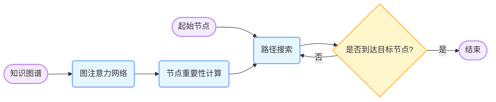

# 基于图注意力网络的动态知识推理路径规划

> 关键词：图注意力网络、动态知识推理、路径规划、知识图谱、深度学习

> 摘要：本文围绕基于图注意力网络的动态知识推理路径规划展开深入研究。首先介绍了相关背景知识，包括目的范围、预期读者等内容。接着详细阐述了核心概念及其联系，通过文本示意图和 Mermaid 流程图进行清晰展示。深入讲解了核心算法原理，并给出 Python 源代码示例。对数学模型和公式进行详细推导与举例说明。通过项目实战，展示了代码的实际案例并进行详细解释。探讨了该技术的实际应用场景，推荐了学习、开发工具和相关论文著作。最后总结了未来发展趋势与挑战，提供了常见问题解答和扩展阅读参考资料，旨在为相关领域的研究者和开发者提供全面而深入的技术指导。

## 1. 背景介绍 
### 1.1 目的和范围
在当今信息爆炸的时代，知识图谱作为一种强大的知识表示和管理工具，被广泛应用于各个领域，如智能问答、推荐系统、语义搜索等。然而，知识图谱往往存在不完整性，许多知识之间的关联并未明确表示出来。动态知识推理路径规划旨在通过推理和路径搜索，挖掘知识图谱中潜在的知识关联，以解决实际应用中的问题。本文的目的是研究如何利用图注意力网络（Graph Attention Network，GAT）进行动态知识推理路径规划，提高推理的准确性和效率。范围涵盖了从核心概念的介绍、算法原理的讲解、数学模型的分析，到实际项目的开发和应用场景的探讨。

### 1.2 预期读者
本文预期读者包括人工智能、机器学习、自然语言处理等领域的研究者、学生和开发者。对于希望深入了解图注意力网络和知识推理路径规划技术的人员，以及在实际项目中需要应用这些技术的工程师，本文将提供有价值的参考。

### 1.3 文档结构概述
本文将按照以下结构进行组织：首先介绍相关的背景知识，包括核心概念、术语等；然后详细阐述基于图注意力网络的动态知识推理路径规划的核心算法原理和具体操作步骤，并给出 Python 代码示例；接着分析相关的数学模型和公式，并进行举例说明；通过项目实战展示代码的实际应用和详细解释；探讨该技术的实际应用场景；推荐相关的学习资源、开发工具和论文著作；最后总结未来发展趋势与挑战，提供常见问题解答和扩展阅读参考资料。

### 1.4 术语表
#### 1.4.1 核心术语定义
- **知识图谱（Knowledge Graph）**：一种以图的形式表示知识的方法，由实体（节点）和关系（边）组成，用于描述现实世界中的各种概念及其之间的关系。
- **图注意力网络（Graph Attention Network，GAT）**：一种基于图结构的深度学习模型，通过注意力机制来学习节点之间的重要性，从而更好地捕捉图的局部和全局特征。
- **动态知识推理（Dynamic Knowledge Reasoning）**：在知识图谱中，根据已知的知识和当前的上下文信息，动态地推理出新的知识或关系。
- **路径规划（Path Planning）**：在知识图谱中，寻找从一个实体到另一个实体的最优路径，以实现知识推理和查询的目的。

#### 1.4.2 相关概念解释
- **注意力机制（Attention Mechanism）**：一种模仿人类注意力的机制，通过计算不同元素的重要性权重，将注意力集中在关键元素上，从而提高模型的性能。
- **图神经网络（Graph Neural Network，GNN）**：一类专门处理图结构数据的神经网络，通过消息传递机制来学习节点和边的特征表示。
- **嵌入表示（Embedding Representation）**：将实体和关系映射到低维向量空间中，以便于计算机进行处理和计算。

#### 1.4.3 缩略词列表
- **GAT**：Graph Attention Network（图注意力网络）
- **GNN**：Graph Neural Network（图神经网络）
- **KG**：Knowledge Graph（知识图谱）

## 2. 核心概念与联系 

### 2.1 知识图谱
知识图谱是一种语义网络，用于表示现实世界中的实体和它们之间的关系。它可以看作是一个有向图 $G=(V, E, R)$，其中 $V$ 是实体节点的集合，$E$ 是边的集合，$R$ 是关系的集合。每条边 $(u, v, r)$ 表示实体 $u$ 和 $v$ 之间存在关系 $r$。例如，在一个电影知识图谱中，实体可以是电影、演员、导演等，关系可以是“主演”、“执导”等。

### 2.2 图注意力网络
图注意力网络是一种基于图结构的深度学习模型，它通过注意力机制来学习节点之间的重要性。在 GAT 中，每个节点会根据其邻居节点的特征计算注意力权重，然后将邻居节点的特征进行加权求和，得到该节点的新特征表示。具体来说，对于节点 $i$ 和其邻居节点 $j$，注意力系数 $e_{ij}$ 可以通过以下公式计算：

$$e_{ij} = \text{LeakyReLU}(\mathbf{a}^T[\mathbf{W}\mathbf{h}_i || \mathbf{W}\mathbf{h}_j])$$

其中，$\mathbf{h}_i$ 和 $\mathbf{h}_j$ 分别是节点 $i$ 和 $j$ 的特征向量，$\mathbf{W}$ 是可学习的权重矩阵，$\mathbf{a}$ 是注意力机制的参数向量，$||$ 表示向量拼接操作，$\text{LeakyReLU}$ 是激活函数。然后，通过 softmax 函数将注意力系数进行归一化，得到注意力权重 $\alpha_{ij}$：

$$\alpha_{ij} = \frac{\exp(e_{ij})}{\sum_{k \in \mathcal{N}(i)} \exp(e_{ik})}$$

其中，$\mathcal{N}(i)$ 是节点 $i$ 的邻居节点集合。最后，节点 $i$ 的新特征表示 $\mathbf{h}_i'$ 可以通过以下公式计算：

$$\mathbf{h}_i' = \sigma\left(\sum_{j \in \mathcal{N}(i)} \alpha_{ij} \mathbf{W}\mathbf{h}_j\right)$$

其中，$\sigma$ 是激活函数。

### 2.3 动态知识推理路径规划
动态知识推理路径规划的目标是在知识图谱中寻找从一个实体到另一个实体的最优路径，以实现知识推理和查询的目的。在动态环境中，知识图谱可能会不断更新，因此需要能够实时地进行路径规划和推理。基于图注意力网络的动态知识推理路径规划方法，通过学习知识图谱的结构和语义信息，利用图注意力网络来计算节点之间的重要性，从而更好地引导路径搜索过程。

### 2.4 文本示意图
```plaintext
知识图谱
|
|-- 实体节点
|   |-- 节点1
|   |-- 节点2
|   |--...
|
|-- 关系边
|   |-- 边1
|   |-- 边2
|   |--...

图注意力网络
|
|-- 输入层
|   |-- 节点特征
|
|-- 注意力层
|   |-- 计算注意力权重
|   |-- 加权求和
|
|-- 输出层
|   |-- 新节点特征

动态知识推理路径规划
|
|-- 起始节点
|
|-- 路径搜索
|   |-- 利用图注意力网络计算重要性
|   |-- 选择最优路径
|
|-- 目标节点
```

### 2.5 Mermaid 流程图


## 3. 核心算法原理 & 具体操作步骤 

### 3.1 核心算法原理
基于图注意力网络的动态知识推理路径规划算法的核心思想是利用图注意力网络学习知识图谱中节点和边的特征表示，然后根据这些特征表示计算节点之间的重要性，从而引导路径搜索过程。具体来说，算法包括以下几个步骤：

1. **知识图谱嵌入**：将知识图谱中的实体和关系映射到低维向量空间中，得到它们的嵌入表示。可以使用现有的知识图谱嵌入方法，如 TransE、DistMult 等。
2. **图注意力网络构建**：构建图注意力网络，输入为知识图谱的节点和边的嵌入表示，输出为节点的新特征表示。
3. **路径搜索**：从起始节点开始，根据图注意力网络计算的节点重要性，选择下一个要访问的节点，直到到达目标节点或达到最大搜索步数。

### 3.2 具体操作步骤

#### 步骤 1：知识图谱嵌入
使用 TransE 方法进行知识图谱嵌入，Python 代码示例如下：

```python
import torch
import torch.nn as nn
import torch.optim as optim

# 定义 TransE 模型
class TransE(nn.Module):
    def __init__(self, entity_num, relation_num, embedding_dim):
        super(TransE, self).__init__()
        self.entity_embeddings = nn.Embedding(entity_num, embedding_dim)
        self.relation_embeddings = nn.Embedding(relation_num, embedding_dim)
        nn.init.xavier_uniform_(self.entity_embeddings.weight.data)
        nn.init.xavier_uniform_(self.relation_embeddings.weight.data)

    def forward(self, heads, relations, tails):
        head_embeds = self.entity_embeddings(heads)
        relation_embeds = self.relation_embeddings(relations)
        tail_embeds = self.entity_embeddings(tails)
        scores = torch.norm(head_embeds + relation_embeds - tail_embeds, p=1, dim=1)
        return scores

# 训练 TransE 模型
entity_num = 100
relation_num = 20
embedding_dim = 50
model = TransE(entity_num, relation_num, embedding_dim)
optimizer = optim.SGD(model.parameters(), lr=0.01)
criterion = nn.MarginRankingLoss(margin=1.0)

# 模拟训练数据
heads = torch.randint(0, entity_num, (100,))
relations = torch.randint(0, relation_num, (100,))
tails = torch.randint(0, entity_num, (100,))
neg_heads = torch.randint(0, entity_num, (100,))
neg_tails = torch.randint(0, entity_num, (100,))

for epoch in range(10):
    optimizer.zero_grad()
    pos_scores = model(heads, relations, tails)
    neg_scores = model(neg_heads, relations, neg_tails)
    target = torch.ones_like(pos_scores)
    loss = criterion(pos_scores, neg_scores, target)
    loss.backward()
    optimizer.step()
    print(f'Epoch {epoch+1}, Loss: {loss.item()}')

# 获取实体和关系的嵌入表示
entity_embeds = model.entity_embeddings.weight.data
relation_embeds = model.relation_embeddings.weight.data
```

#### 步骤 2：图注意力网络构建
使用 PyTorch 构建图注意力网络，代码示例如下：

```python
import torch
import torch.nn as nn
import torch.nn.functional as F

# 定义图注意力层
class GraphAttentionLayer(nn.Module):
    def __init__(self, in_features, out_features, dropout, alpha, concat=True):
        super(GraphAttentionLayer, self).__init__()
        self.dropout = dropout
        self.in_features = in_features
        self.out_features = out_features
        self.alpha = alpha
        self.concat = concat

        self.W = nn.Parameter(torch.zeros(size=(in_features, out_features)))
        nn.init.xavier_uniform_(self.W.data, gain=1.414)
        self.a = nn.Parameter(torch.zeros(size=(2*out_features, 1)))
        nn.init.xavier_uniform_(self.a.data, gain=1.414)

        self.leakyrelu = nn.LeakyReLU(self.alpha)

    def forward(self, input, adj):
        h = torch.mm(input, self.W)
        N = h.size()[0]

        a_input = torch.cat([h.repeat(1, N).view(N * N, -1), h.repeat(N, 1)], dim=1).view(N, -1, 2 * self.out_features)
        e = self.leakyrelu(torch.matmul(a_input, self.a).squeeze(2))

        zero_vec = -9e15*torch.ones_like(e)
        attention = torch.where(adj > 0, e, zero_vec)
        attention = F.softmax(attention, dim=1)
        attention = F.dropout(attention, self.dropout, training=self.training)
        h_prime = torch.matmul(attention, h)

        if self.concat:
            return F.elu(h_prime)
        else:
            return h_prime

# 定义图注意力网络
class GAT(nn.Module):
    def __init__(self, nfeat, nhid, nclass, dropout, alpha, nheads):
        super(GAT, self).__init__()
        self.dropout = dropout

        self.attentions = [GraphAttentionLayer(nfeat, nhid, dropout=dropout, alpha=alpha, concat=True) for _ in range(nheads)]
        for i, attention in enumerate(self.attentions):
            self.add_module('attention_{}'.format(i), attention)

        self.out_att = GraphAttentionLayer(nhid * nheads, nclass, dropout=dropout, alpha=alpha, concat=False)

    def forward(self, x, adj):
        x = F.dropout(x, self.dropout, training=self.training)
        x = torch.cat([att(x, adj) for att in self.attentions], dim=1)
        x = F.dropout(x, self.dropout, training=self.training)
        x = F.elu(self.out_att(x, adj))
        return x

# 初始化图注意力网络
nfeat = 50
nhid = 8
nclass = 16
dropout = 0.6
alpha = 0.2
nheads = 8
gat_model = GAT(nfeat, nhid, nclass, dropout, alpha, nheads)

# 输入数据
x = entity_embeds
adj = torch.randint(0, 2, (entity_num, entity_num))  # 模拟邻接矩阵

# 前向传播
output = gat_model(x, adj)
```

#### 步骤 3：路径搜索
使用贪心搜索算法进行路径搜索，代码示例如下：

```python
import numpy as np

def path_search(start_node, target_node, max_steps, gat_model, entity_embeds, adj):
    current_node = start_node
    path = [current_node]
    step = 0

    while current_node!= target_node and step < max_steps:
        node_features = entity_embeds[current_node].unsqueeze(0)
        neighbor_indices = np.where(adj[current_node].numpy() == 1)[0]
        neighbor_features = entity_embeds[neighbor_indices]

        input_features = torch.cat([node_features.repeat(len(neighbor_indices), 1), neighbor_features], dim=1)
        scores = gat_model(input_features, adj[neighbor_indices][:, neighbor_indices])
        scores = scores.squeeze().detach().numpy()

        next_node_index = np.argmax(scores)
        next_node = neighbor_indices[next_node_index]

        path.append(next_node)
        current_node = next_node
        step += 1

    return path

# 示例
start_node = 0
target_node = 10
max_steps = 5
path = path_search(start_node, target_node, max_steps, gat_model, entity_embeds, adj)
print('Path:', path)
```

## 4. 数学模型和公式 & 详细讲解 & 举例说明 

### 4.1 知识图谱嵌入模型：TransE
TransE 模型的核心思想是将实体和关系表示为低维向量，并且假设在向量空间中，头实体向量加上关系向量近似等于尾实体向量。具体来说，对于一个三元组 $(h, r, t)$，其中 $h$ 是头实体，$r$ 是关系，$t$ 是尾实体，TransE 模型的目标是最小化以下损失函数：

$$L = \sum_{(h, r, t) \in S} \sum_{(h', r, t') \in S'} \max(0, d(h + r, t) - d(h' + r, t') + \gamma)$$

其中，$S$ 是正样本三元组的集合，$S'$ 是负样本三元组的集合，$d$ 是距离函数，通常使用 $L_1$ 或 $L_2$ 距离，$\gamma$ 是一个正的边界值。

例如，假设我们有一个三元组 $(h, r, t)$ 表示“张三 - 居住在 - 北京”，在向量空间中，我们希望 $\mathbf{h} + \mathbf{r} \approx \mathbf{t}$，其中 $\mathbf{h}$、$\mathbf{r}$ 和 $\mathbf{t}$ 分别是“张三”、“居住在”和“北京”的向量表示。

### 4.2 图注意力网络模型
图注意力网络的核心是注意力机制，通过计算节点之间的注意力权重来学习节点的重要性。如前面所述，注意力系数 $e_{ij}$ 的计算公式为：

$$e_{ij} = \text{LeakyReLU}(\mathbf{a}^T[\mathbf{W}\mathbf{h}_i || \mathbf{W}\mathbf{h}_j])$$

注意力权重 $\alpha_{ij}$ 的计算公式为：

$$\alpha_{ij} = \frac{\exp(e_{ij})}{\sum_{k \in \mathcal{N}(i)} \exp(e_{ik})}$$

节点 $i$ 的新特征表示 $\mathbf{h}_i'$ 的计算公式为：

$$\mathbf{h}_i' = \sigma\left(\sum_{j \in \mathcal{N}(i)} \alpha_{ij} \mathbf{W}\mathbf{h}_j\right)$$

例如，假设我们有一个节点 $i$ 和其邻居节点 $j$、$k$，通过上述公式计算出注意力权重 $\alpha_{ij}$ 和 $\alpha_{ik}$，然后将邻居节点的特征进行加权求和，得到节点 $i$ 的新特征表示。

### 4.3 路径搜索算法
路径搜索算法的目标是在知识图谱中寻找从起始节点到目标节点的最优路径。在贪心搜索算法中，每次选择下一个节点时，根据图注意力网络计算的节点重要性进行选择。假设当前节点为 $i$，其邻居节点集合为 $\mathcal{N}(i)$，对于每个邻居节点 $j \in \mathcal{N}(i)$，计算其重要性得分 $s_j$，然后选择得分最高的节点作为下一个访问的节点。

例如，在一个电影知识图谱中，起始节点是“电影 A”，目标节点是“演员 B”，通过图注意力网络计算出“电影 A”的邻居节点（如“导演 C”、“演员 D”等）的重要性得分，选择得分最高的节点作为下一个访问的节点，逐步搜索直到到达“演员 B”或达到最大搜索步数。

## 5. 项目实战：代码实际案例和详细解释说明 

### 5.1  开发环境搭建
为了实现基于图注意力网络的动态知识推理路径规划项目，我们需要搭建以下开发环境：

- **操作系统**：推荐使用 Linux 或 macOS，也可以使用 Windows。
- **编程语言**：Python 3.x
- **深度学习框架**：PyTorch
- **其他库**：NumPy、SciPy 等

可以使用 Anaconda 来管理 Python 环境，具体步骤如下：

1. 下载并安装 Anaconda：https://www.anaconda.com/products/individual
2. 创建一个新的 Python 环境：
```bash
conda create -n gat_path_planning python=3.8
conda activate gat_path_planning
```
3. 安装 PyTorch 和其他必要的库：
```bash
conda install pytorch torchvision torchaudio cudatoolkit=11.3 -c pytorch
pip install numpy scipy
```

### 5.2  源代码详细实现和代码解读
#### 数据准备
首先，我们需要准备知识图谱的数据，包括实体、关系和三元组。可以使用以下代码生成模拟数据：

```python
import numpy as np

# 定义实体和关系的数量
entity_num = 100
relation_num = 20

# 生成实体和关系的 ID
entities = np.arange(entity_num)
relations = np.arange(relation_num)

# 生成三元组数据
num_triples = 200
triples = []
for _ in range(num_triples):
    head = np.random.choice(entities)
    relation = np.random.choice(relations)
    tail = np.random.choice(entities)
    triples.append((head, relation, tail))

# 生成邻接矩阵
adj = np.zeros((entity_num, entity_num))
for head, _, tail in triples:
    adj[head][tail] = 1

# 将数据转换为 PyTorch 张量
triples = torch.tensor(triples, dtype=torch.long)
adj = torch.tensor(adj, dtype=torch.float32)
```

#### 知识图谱嵌入
使用 TransE 模型进行知识图谱嵌入，代码如下：

```python
import torch
import torch.nn as nn
import torch.optim as optim

# 定义 TransE 模型
class TransE(nn.Module):
    def __init__(self, entity_num, relation_num, embedding_dim):
        super(TransE, self).__init__()
        self.entity_embeddings = nn.Embedding(entity_num, embedding_dim)
        self.relation_embeddings = nn.Embedding(relation_num, embedding_dim)
        nn.init.xavier_uniform_(self.entity_embeddings.weight.data)
        nn.init.xavier_uniform_(self.relation_embeddings.weight.data)

    def forward(self, heads, relations, tails):
        head_embeds = self.entity_embeddings(heads)
        relation_embeds = self.relation_embeddings(relations)
        tail_embeds = self.entity_embeddings(tails)
        scores = torch.norm(head_embeds + relation_embeds - tail_embeds, p=1, dim=1)
        return scores

# 训练 TransE 模型
embedding_dim = 50
model = TransE(entity_num, relation_num, embedding_dim)
optimizer = optim.SGD(model.parameters(), lr=0.01)
criterion = nn.MarginRankingLoss(margin=1.0)

num_epochs = 10
for epoch in range(num_epochs):
    optimizer.zero_grad()
    heads = triples[:, 0]
    relations = triples[:, 1]
    tails = triples[:, 2]
    neg_heads = torch.randint(0, entity_num, (num_triples,))
    neg_tails = torch.randint(0, entity_num, (num_triples,))

    pos_scores = model(heads, relations, tails)
    neg_scores = model(neg_heads, relations, neg_tails)
    target = torch.ones_like(pos_scores)
    loss = criterion(pos_scores, neg_scores, target)
    loss.backward()
    optimizer.step()
    print(f'Epoch {epoch+1}, Loss: {loss.item()}')

# 获取实体和关系的嵌入表示
entity_embeds = model.entity_embeddings.weight.data
relation_embeds = model.relation_embeddings.weight.data
```

#### 图注意力网络构建
使用 PyTorch 构建图注意力网络，代码如下：

```python
import torch
import torch.nn as nn
import torch.nn.functional as F

# 定义图注意力层
class GraphAttentionLayer(nn.Module):
    def __init__(self, in_features, out_features, dropout, alpha, concat=True):
        super(GraphAttentionLayer, self).__init__()
        self.dropout = dropout
        self.in_features = in_features
        self.out_features = out_features
        self.alpha = alpha
        self.concat = concat

        self.W = nn.Parameter(torch.zeros(size=(in_features, out_features)))
        nn.init.xavier_uniform_(self.W.data, gain=1.414)
        self.a = nn.Parameter(torch.zeros(size=(2*out_features, 1)))
        nn.init.xavier_uniform_(self.a.data, gain=1.414)

        self.leakyrelu = nn.LeakyReLU(self.alpha)

    def forward(self, input, adj):
        h = torch.mm(input, self.W)
        N = h.size()[0]

        a_input = torch.cat([h.repeat(1, N).view(N * N, -1), h.repeat(N, 1)], dim=1).view(N, -1, 2 * self.out_features)
        e = self.leakyrelu(torch.matmul(a_input, self.a).squeeze(2))

        zero_vec = -9e15*torch.ones_like(e)
        attention = torch.where(adj > 0, e, zero_vec)
        attention = F.softmax(attention, dim=1)
        attention = F.dropout(attention, self.dropout, training=self.training)
        h_prime = torch.matmul(attention, h)

        if self.concat:
            return F.elu(h_prime)
        else:
            return h_prime

# 定义图注意力网络
class GAT(nn.Module):
    def __init__(self, nfeat, nhid, nclass, dropout, alpha, nheads):
        super(GAT, self).__init__()
        self.dropout = dropout

        self.attentions = [GraphAttentionLayer(nfeat, nhid, dropout=dropout, alpha=alpha, concat=True) for _ in range(nheads)]
        for i, attention in enumerate(self.attentions):
            self.add_module('attention_{}'.format(i), attention)

        self.out_att = GraphAttentionLayer(nhid * nheads, nclass, dropout=dropout, alpha=alpha, concat=False)

    def forward(self, x, adj):
        x = F.dropout(x, self.dropout, training=self.training)
        x = torch.cat([att(x, adj) for att in self.attentions], dim=1)
        x = F.dropout(x, self.dropout, training=self.training)
        x = F.elu(self.out_att(x, adj))
        return x

# 初始化图注意力网络
nfeat = embedding_dim
nhid = 8
nclass = 16
dropout = 0.6
alpha = 0.2
nheads = 8
gat_model = GAT(nfeat, nhid, nclass, dropout, alpha, nheads)

# 前向传播
output = gat_model(entity_embeds, adj)
```

#### 路径搜索
使用贪心搜索算法进行路径搜索，代码如下：

```python
import numpy as np

def path_search(start_node, target_node, max_steps, gat_model, entity_embeds, adj):
    current_node = start_node
    path = [current_node]
    step = 0

    while current_node!= target_node and step < max_steps:
        node_features = entity_embeds[current_node].unsqueeze(0)
        neighbor_indices = np.where(adj[current_node].numpy() == 1)[0]
        neighbor_features = entity_embeds[neighbor_indices]

        input_features = torch.cat([node_features.repeat(len(neighbor_indices), 1), neighbor_features], dim=1)
        scores = gat_model(input_features, adj[neighbor_indices][:, neighbor_indices])
        scores = scores.squeeze().detach().numpy()

        next_node_index = np.argmax(scores)
        next_node = neighbor_indices[next_node_index]

        path.append(next_node)
        current_node = next_node
        step += 1

    return path

# 示例
start_node = 0
target_node = 10
max_steps = 5
path = path_search(start_node, target_node, max_steps, gat_model, entity_embeds, adj)
print('Path:', path)
```

### 5.3  代码解读与分析
#### 数据准备部分
通过生成模拟的实体、关系和三元组数据，构建了知识图谱的基本结构，并生成了邻接矩阵来表示节点之间的连接关系。

#### 知识图谱嵌入部分
使用 TransE 模型将实体和关系映射到低维向量空间中，通过训练模型最小化正样本和负样本之间的距离差异，得到实体和关系的嵌入表示。

#### 图注意力网络构建部分
定义了图注意力层和图注意力网络，通过注意力机制学习节点之间的重要性，将节点的特征进行更新。

#### 路径搜索部分
使用贪心搜索算法，根据图注意力网络计算的节点重要性，从起始节点开始逐步选择下一个访问的节点，直到到达目标节点或达到最大搜索步数。

## 6. 实际应用场景 
### 智能问答系统
在智能问答系统中，用户的问题可能需要在知识图谱中进行推理和路径搜索才能得到答案。基于图注意力网络的动态知识推理路径规划可以帮助系统更好地理解问题的语义，在知识图谱中寻找相关的知识路径，从而提供更准确和详细的答案。例如，用户询问“演员 A 出演过哪些由导演 B 执导的电影”，系统可以通过路径规划在知识图谱中找到从“演员 A”到“导演 B”的相关路径，筛选出符合条件的电影。

### 推荐系统
在推荐系统中，知识图谱可以用于表示用户、物品和它们之间的关系。基于图注意力网络的动态知识推理路径规划可以帮助系统挖掘用户和物品之间的潜在关系，从而提供更个性化的推荐。例如，根据用户的历史行为和偏好，在知识图谱中搜索相关的物品路径，推荐用户可能感兴趣的物品。

### 语义搜索
在语义搜索中，用户的查询可能需要在知识图谱中进行语义匹配和推理。基于图注意力网络的动态知识推理路径规划可以帮助系统理解查询的语义，在知识图谱中找到相关的知识路径，从而提供更准确的搜索结果。例如，用户搜索“与疾病 A 相关的药物”，系统可以通过路径规划在知识图谱中找到从“疾病 A”到“药物”的相关路径，返回相关的药物信息。

### 生物信息学
在生物信息学中，知识图谱可以用于表示生物分子、基因、疾病等之间的关系。基于图注意力网络的动态知识推理路径规划可以帮助研究人员挖掘生物分子之间的潜在相互作用，发现新的药物靶点和治疗方法。例如，在蛋白质相互作用网络中，通过路径规划寻找从疾病相关蛋白到潜在药物靶点蛋白的路径，为药物研发提供参考。

## 7. 工具和资源推荐
### 7.1 学习资源推荐
#### 7.1.1 书籍推荐
- 《深度学习》（Deep Learning）：由 Ian Goodfellow、Yoshua Bengio 和 Aaron Courville 所著，是深度学习领域的经典教材，涵盖了深度学习的基本原理、算法和应用。
- 《图神经网络：基础、前沿与应用》：系统介绍了图神经网络的基本概念、模型和算法，以及在不同领域的应用。
- 《知识图谱：方法、实践与应用》：全面介绍了知识图谱的构建、表示、推理和应用，对理解知识图谱和知识推理有很大帮助。

#### 7.1.2 在线课程
- Coursera 上的“Deep Learning Specialization”：由 Andrew Ng 教授授课，是深度学习领域的经典在线课程，涵盖了深度学习的各个方面。
- edX 上的“Graph Neural Networks”：介绍了图神经网络的基本原理、模型和应用，适合对图神经网络感兴趣的学习者。
- 哔哩哔哩上的一些关于知识图谱和图神经网络的视频教程，如“知识图谱入门与实践”、“图神经网络从入门到精通”等。

#### 7.1.3 技术博客和网站
- Medium 上的一些技术博客，如 Towards Data Science，经常发布关于深度学习、知识图谱和图神经网络的最新研究成果和实践经验。
- ArXiv.org 是一个预印本服务器，提供了大量关于人工智能、机器学习等领域的最新研究论文。
- 开源中国、InfoQ 等技术网站也会发布一些关于知识图谱和图神经网络的技术文章和案例分析。

### 7.2 开发工具框架推荐
#### 7.2.1 IDE和编辑器
- PyCharm：是一款专门为 Python 开发设计的集成开发环境，提供了丰富的代码编辑、调试和项目管理功能。
- Jupyter Notebook：是一个交互式的开发环境，适合进行数据分析、模型训练和实验验证。
- Visual Studio Code：是一款轻量级的代码编辑器，支持多种编程语言和插件扩展，适合快速开发和调试代码。

#### 7.2.2 调试和性能分析工具
- PyTorch Profiler：是 PyTorch 提供的性能分析工具，可以帮助开发者分析模型的性能瓶颈，优化代码。
- TensorBoard：是 TensorFlow 提供的可视化工具，也可以用于 PyTorch 模型的可视化和性能分析。
- cProfile：是 Python 内置的性能分析工具，可以帮助开发者分析代码的执行时间和调用关系。

#### 7.2.3 相关框架和库
- PyTorch：是一个开源的深度学习框架，提供了丰富的深度学习模型和工具，支持 GPU 加速。
- DGL（Deep Graph Library）：是一个专门用于图神经网络的深度学习框架，提供了高效的图数据处理和模型训练功能。
- NetworkX：是一个用于图论和复杂网络分析的 Python 库，提供了丰富的图算法和数据结构。

### 7.3 相关论文著作推荐
#### 7.3.1 经典论文
- “Graph Attention Networks”：提出了图注意力网络（GAT）模型，为图神经网络的发展做出了重要贡献。
- “Translating Embeddings for Modeling Multi-relational Data”：提出了 TransE 模型，是知识图谱嵌入领域的经典论文。
- “Knowledge Graph Embedding: A Survey of Approaches and Applications”：对知识图谱嵌入的方法和应用进行了全面的综述。

#### 7.3.2 最新研究成果
- 每年的顶级学术会议，如 NeurIPS、ICML、KDD 等，都会发表关于图神经网络、知识图谱和知识推理的最新研究成果。可以关注这些会议的论文集，了解最新的研究动态。
- 一些知名的学术期刊，如 Journal of Artificial Intelligence Research（JAIR）、Artificial Intelligence 等，也会发表相关领域的高质量研究论文。

#### 7.3.3 应用案例分析
- 一些实际应用案例的论文和报告，如在智能问答系统、推荐系统、语义搜索等领域的应用案例，可以帮助我们了解如何将基于图注意力网络的动态知识推理路径规划技术应用到实际项目中。可以通过 Google Scholar 等学术搜索引擎搜索相关的应用案例。

## 8. 总结：未来发展趋势与挑战
### 未来发展趋势
- **融合多模态信息**：未来的研究可能会将图注意力网络与多模态信息（如图像、文本、音频等）相结合，以更全面地表示知识图谱，提高知识推理和路径规划的准确性。
- **强化学习与路径规划**：将强化学习技术引入动态知识推理路径规划中，通过智能体与环境的交互，学习最优的路径规划策略，提高系统的适应性和效率。
- **可解释性研究**：随着深度学习模型在各个领域的广泛应用，模型的可解释性变得越来越重要。未来的研究可能会关注如何提高基于图注意力网络的动态知识推理路径规划模型的可解释性，让用户更好地理解模型的决策过程。
- **大规模知识图谱处理**：随着知识图谱的规模不断增大，如何高效地处理大规模知识图谱成为一个重要的挑战。未来的研究可能会发展更高效的算法和技术，以应对大规模知识图谱的动态知识推理和路径规划问题。

### 挑战
- **数据质量和完整性**：知识图谱的数据质量和完整性对动态知识推理路径规划的性能有很大影响。如何获取高质量、完整的知识图谱数据，以及如何处理数据中的噪声和缺失值，是一个需要解决的问题。
- **计算资源和效率**：图注意力网络和动态知识推理路径规划算法通常需要大量的计算资源和时间。如何优化算法，提高计算效率，以适应大规模知识图谱和实时应用的需求，是一个挑战。
- **模型的泛化能力**：在不同的知识图谱和应用场景中，模型的泛化能力是一个重要的问题。如何设计具有良好泛化能力的模型，使其能够在不同的数据集和任务中取得较好的性能，是未来研究的方向之一。
- **伦理和安全问题**：随着知识图谱和人工智能技术的广泛应用，伦理和安全问题也日益凸显。如何确保知识推理和路径规划的结果符合伦理和法律要求，以及如何保护用户的隐私和数据安全，是需要关注的问题。

## 9. 附录：常见问题与解答
### 问题 1：图注意力网络与传统图神经网络有什么区别？
答：图注意力网络通过注意力机制来学习节点之间的重要性，能够自适应地分配不同邻居节点的权重，从而更好地捕捉图的局部和全局特征。而传统图神经网络（如 GCN）通常采用固定的聚合方式，对所有邻居节点赋予相同的权重，可能无法很好地处理节点之间的异质性。

### 问题 2：如何选择合适的知识图谱嵌入方法？
答：选择合适的知识图谱嵌入方法需要考虑多个因素，如知识图谱的规模、关系的复杂性、应用场景等。对于简单的知识图谱，可以选择 TransE 等简单有效的方法；对于复杂的知识图谱，可以考虑使用更复杂的方法，如 RotatE、ComplEx 等。此外，还可以根据具体的应用需求进行实验和比较，选择性能最优的方法。

### 问题 3：路径搜索算法有哪些改进的空间？
答：路径搜索算法可以从以下几个方面进行改进：一是引入启发式信息，如节点的重要性、边的权重等，引导搜索过程更快地找到最优路径；二是采用多策略搜索，如广度优先搜索、深度优先搜索、A* 算法等相结合，提高搜索的效率和准确性；三是考虑动态环境，当知识图谱发生变化时，能够实时更新路径规划结果。

### 问题 4：如何评估基于图注意力网络的动态知识推理路径规划模型的性能？
答：可以从以下几个方面评估模型的性能：一是准确性，即模型找到的路径是否符合实际的知识关联；二是召回率，即模型能够找到的有效路径的比例；三是效率，即模型的推理和路径规划时间；四是可解释性，即模型的决策过程是否能够被用户理解。可以使用一些公开的数据集和评估指标，如准确率、召回率、F1 值等进行评估。

## 10. 扩展阅读 & 参考资料
### 扩展阅读
- 《人工智能：现代方法》（Artificial Intelligence: A Modern Approach）：全面介绍了人工智能的基本概念、算法和应用，对理解知识推理和路径规划有很大帮助。
- 《机器学习》（Machine Learning）：由 Tom M. Mitchell 所著，是机器学习领域的经典教材，涵盖了机器学习的基本原理、算法和应用。
- 《深度学习实战》（Deep Learning in Practice）：通过实际案例介绍了深度学习在不同领域的应用，对将基于图注意力网络的动态知识推理路径规划技术应用到实际项目中有一定的参考价值。

### 参考资料
- [Graph Attention Networks](https://arxiv.org/abs/1710.10903)
- [Translating Embeddings for Modeling Multi-relational Data](https://papers.nips.cc/paper/5071-translating-embeddings-for-modeling-multi-relational-data)
- [Knowledge Graph Embedding: A Survey of Approaches and Applications](https://arxiv.org/abs/1705.09550)
- [DGL官方文档](https://docs.dgl.ai/)
- [PyTorch官方文档](https://pytorch.org/docs/stable/index.html)

作者：AI天才研究院/AI Genius Institute & 禅与计算机程序设计艺术 /Zen And The Art of Computer Programming