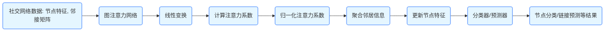

# 基于图注意力网络的复杂关系推理在社交网络分析中的能力增强

> 关键词：图注意力网络、复杂关系推理、社交网络分析、能力增强、深度学习

> 摘要：本文聚焦于基于图注意力网络的复杂关系推理在社交网络分析中的能力增强问题。首先介绍了相关背景，包括研究目的、预期读者、文档结构和术语表等。接着阐述了图注意力网络和复杂关系推理的核心概念及其联系，给出了原理和架构的文本示意图与 Mermaid 流程图。详细讲解了核心算法原理，并用 Python 代码进行了具体实现。深入探讨了相关数学模型和公式，并举例说明。通过项目实战，展示了代码实际案例及详细解释。分析了其在社交网络分析中的实际应用场景，推荐了学习资源、开发工具框架和相关论文著作。最后总结了未来发展趋势与挑战，还提供了常见问题与解答以及扩展阅读和参考资料，旨在为该领域的研究和实践提供全面而深入的指导。

## 1. 背景介绍 
### 1.1 目的和范围
社交网络已经成为人们日常生活中不可或缺的一部分，其中蕴含着大量的人际关系和信息。分析社交网络中的复杂关系，如朋友关系、兴趣关联、影响力传播等，对于理解用户行为、进行精准营销、发现潜在社交圈子等具有重要意义。然而，社交网络结构复杂，节点之间的关系具有多样性和动态性，传统的分析方法难以有效地处理这些复杂关系。

本文的目的是探讨如何利用图注意力网络（Graph Attention Network，GAT）增强在社交网络分析中进行复杂关系推理的能力。研究范围涵盖了图注意力网络的原理、算法实现，以及如何将其应用于社交网络的节点分类、链接预测、社区发现等任务中，以提高分析的准确性和效率。

### 1.2 预期读者
本文预期读者包括计算机科学、数据科学、人工智能等相关专业的研究人员和学生，对社交网络分析和图神经网络感兴趣的开发者，以及从事社交网络平台数据分析和挖掘的从业者。读者需要具备一定的机器学习和深度学习基础知识，了解图论的基本概念。

### 1.3 文档结构概述
本文的结构如下：
- 核心概念与联系：介绍图注意力网络和复杂关系推理的核心概念，以及它们之间的联系，并给出原理和架构的文本示意图与 Mermaid 流程图。
- 核心算法原理 & 具体操作步骤：详细讲解图注意力网络的核心算法原理，并用 Python 代码进行具体实现。
- 数学模型和公式 & 详细讲解 & 举例说明：阐述相关的数学模型和公式，并通过具体例子进行说明。
- 项目实战：代码实际案例和详细解释说明：通过一个具体的社交网络分析项目，展示代码的实际实现和详细解读。
- 实际应用场景：分析基于图注意力网络的复杂关系推理在社交网络分析中的实际应用场景。
- 工具和资源推荐：推荐相关的学习资源、开发工具框架和论文著作。
- 总结：未来发展趋势与挑战：总结该领域的未来发展趋势和面临的挑战。
- 附录：常见问题与解答：提供常见问题的解答。
- 扩展阅读 & 参考资料：列出扩展阅读的内容和参考资料。

### 1.4 术语表
#### 1.4.1 核心术语定义
- **图注意力网络（Graph Attention Network，GAT）**：一种基于图结构的神经网络，通过注意力机制来学习节点之间的重要性，从而更好地处理图数据。
- **复杂关系推理**：在社交网络中，根据节点之间的关系和属性，推断出隐藏的、复杂的关系，如潜在的朋友关系、信息传播路径等。
- **社交网络分析**：对社交网络中的节点（用户）和边（关系）进行分析，以了解网络的结构、用户行为和信息传播规律等。
- **节点分类**：根据节点的属性和邻居信息，将节点划分到不同的类别中。
- **链接预测**：预测社交网络中两个节点之间是否存在潜在的链接。
- **社区发现**：在社交网络中发现具有紧密连接的节点群体，即社区。

#### 1.4.2 相关概念解释
- **图（Graph）**：由节点（Vertex）和边（Edge）组成的一种数据结构，用于表示对象之间的关系。在社交网络中，节点可以表示用户，边可以表示用户之间的关系，如好友关系、关注关系等。
- **注意力机制（Attention Mechanism）**：一种能够自动地关注输入数据中重要部分的机制，通过计算不同部分的权重，将注意力集中在关键信息上。
- **深度学习（Deep Learning）**：一种基于人工神经网络的机器学习方法，通过构建多层神经网络来学习数据的复杂特征和模式。

#### 1.4.3 缩略词列表
- **GAT**：Graph Attention Network（图注意力网络）
- **DNN**：Deep Neural Network（深度神经网络）
- **MLP**：Multi - Layer Perceptron（多层感知机）

## 2. 核心概念与联系 

### 2.1 图注意力网络（GAT）原理
图注意力网络是一种专门用于处理图数据的神经网络。传统的图神经网络（如 GCN）在聚合邻居节点信息时，对所有邻居节点使用相同的权重，而 GAT 引入了注意力机制，能够为不同的邻居节点分配不同的权重，从而更灵活地捕捉节点之间的关系。

GAT 的核心思想是通过计算节点之间的注意力系数，来确定每个邻居节点对中心节点的重要性。具体来说，对于图中的每个节点 $i$，它的邻居节点集合为 $\mathcal{N}_i$，GAT 首先通过一个共享的线性变换将节点的特征向量 $h_i$ 和 $h_j$（$j\in\mathcal{N}_i$）映射到一个新的特征空间：

$$\mathbf{W}\mathbf{h}_i \quad \text{和} \quad \mathbf{W}\mathbf{h}_j$$

其中，$\mathbf{W}$ 是一个可学习的权重矩阵。然后，通过一个注意力函数计算节点 $i$ 和 $j$ 之间的注意力系数 $e_{ij}$：

$$e_{ij} = \text{LeakyReLU}(\mathbf{a}^T [\mathbf{W}\mathbf{h}_i || \mathbf{W}\mathbf{h}_j])$$

其中，$\mathbf{a}$ 是一个可学习的向量，$||$ 表示拼接操作，$\text{LeakyReLU}$ 是一个激活函数。为了使注意力系数具有可比性，对其进行归一化处理：

$$\alpha_{ij} = \frac{\exp(e_{ij})}{\sum_{k\in\mathcal{N}_i} \exp(e_{ik})}$$

最后，节点 $i$ 的新特征向量 $\mathbf{h}_i'$ 可以通过聚合邻居节点的信息得到：

$$\mathbf{h}_i' = \sigma\left(\sum_{j\in\mathcal{N}_i} \alpha_{ij} \mathbf{W}\mathbf{h}_j\right)$$

其中，$\sigma$ 是一个激活函数，如 $\text{ReLU}$ 或 $\text{Sigmoid}$。

### 2.2 复杂关系推理
在社交网络中，复杂关系推理是指根据已知的节点属性和关系，推断出隐藏的、复杂的关系。例如，通过分析用户的社交行为和兴趣爱好，推断出他们之间潜在的朋友关系；或者根据信息传播的路径，预测信息在网络中的扩散范围。

复杂关系推理的挑战在于社交网络的结构复杂，节点之间的关系具有多样性和动态性。传统的方法往往难以处理这些复杂的关系，而图注意力网络通过注意力机制能够更好地捕捉节点之间的重要性，从而增强复杂关系推理的能力。

### 2.3 核心概念联系
图注意力网络为复杂关系推理提供了一种有效的工具。通过注意力机制，GAT 能够自动地为不同的邻居节点分配不同的权重，从而更准确地捕捉节点之间的关系。在社交网络分析中，利用 GAT 可以更好地处理节点之间的复杂关系，提高复杂关系推理的准确性和效率。例如，在节点分类任务中，GAT 可以根据邻居节点的重要性来更新节点的特征，从而更准确地将节点划分到不同的类别中；在链接预测任务中，GAT 可以学习到节点之间的潜在关系，提高链接预测的准确率。

### 2.4 原理和架构的文本示意图
以下是图注意力网络在社交网络分析中进行复杂关系推理的原理和架构的文本示意图：

社交网络以图的形式表示，其中节点代表用户，边代表用户之间的关系。图注意力网络接收图的节点特征和邻接矩阵作为输入。在网络内部，首先对节点特征进行线性变换，然后计算节点之间的注意力系数，通过归一化处理得到最终的注意力权重。利用这些注意力权重，聚合邻居节点的信息，更新节点的特征。最后，将更新后的节点特征输入到分类器或预测器中，进行节点分类、链接预测等任务，从而实现复杂关系推理。

### 2.5 Mermaid 流程图


## 3. 核心算法原理 & 具体操作步骤 

### 3.1 核心算法原理
图注意力网络的核心算法可以分为以下几个步骤：

#### 3.1.1 线性变换
对于图中的每个节点 $i$，将其特征向量 $\mathbf{h}_i$ 通过一个共享的线性变换 $\mathbf{W}$ 映射到一个新的特征空间：

$$\mathbf{h}_i' = \mathbf{W}\mathbf{h}_i$$

其中，$\mathbf{W}$ 是一个可学习的权重矩阵，其维度为 $F' \times F$，$F$ 是输入特征的维度，$F'$ 是输出特征的维度。

#### 3.1.2 计算注意力系数
对于节点 $i$ 和其邻居节点 $j$，计算它们之间的注意力系数 $e_{ij}$：

$$e_{ij} = \text{LeakyReLU}(\mathbf{a}^T [\mathbf{W}\mathbf{h}_i || \mathbf{W}\mathbf{h}_j])$$

其中，$\mathbf{a}$ 是一个可学习的向量，维度为 $2F'$，$||$ 表示拼接操作，$\text{LeakyReLU}$ 是一个激活函数。

#### 3.1.3 归一化注意力系数
为了使注意力系数具有可比性，对其进行归一化处理：

$$\alpha_{ij} = \frac{\exp(e_{ij})}{\sum_{k\in\mathcal{N}_i} \exp(e_{ik})}$$

其中，$\mathcal{N}_i$ 是节点 $i$ 的邻居节点集合。

#### 3.1.4 聚合邻居信息
利用归一化后的注意力系数 $\alpha_{ij}$，聚合邻居节点的信息，更新节点 $i$ 的特征向量：

$$\mathbf{h}_i'' = \sigma\left(\sum_{j\in\mathcal{N}_i} \alpha_{ij} \mathbf{W}\mathbf{h}_j\right)$$

其中，$\sigma$ 是一个激活函数，如 $\text{ReLU}$ 或 $\text{Sigmoid}$。

### 3.2 具体操作步骤
以下是使用 Python 和 PyTorch 实现图注意力网络的具体操作步骤：

```python
import torch
import torch.nn as nn
import torch.nn.functional as F

class GraphAttentionLayer(nn.Module):
    def __init__(self, in_features, out_features, dropout, alpha, concat=True):
        super(GraphAttentionLayer, self).__init__()
        self.dropout = dropout
        self.in_features = in_features
        self.out_features = out_features
        self.alpha = alpha
        self.concat = concat

        self.W = nn.Parameter(torch.zeros(size=(in_features, out_features)))
        nn.init.xavier_uniform_(self.W.data, gain=1.414)
        self.a = nn.Parameter(torch.zeros(size=(2*out_features, 1)))
        nn.init.xavier_uniform_(self.a.data, gain=1.414)

        self.leakyrelu = nn.LeakyReLU(self.alpha)

    def forward(self, input, adj):
        h = torch.mm(input, self.W)
        N = h.size()[0]

        a_input = torch.cat([h.repeat(1, N).view(N * N, -1), h.repeat(N, 1)], dim=1).view(N, -1, 2 * self.out_features)
        e = self.leakyrelu(torch.matmul(a_input, self.a).squeeze(2))

        zero_vec = -9e15*torch.ones_like(e)
        attention = torch.where(adj > 0, e, zero_vec)
        attention = F.softmax(attention, dim=1)
        attention = F.dropout(attention, self.dropout, training=self.training)
        h_prime = torch.matmul(attention, h)

        if self.concat:
            return F.elu(h_prime)
        else:
            return h_prime


class GAT(nn.Module):
    def __init__(self, nfeat, nhid, nclass, dropout, alpha, nheads):
        super(GAT, self).__init__()
        self.dropout = dropout

        self.attentions = [GraphAttentionLayer(nfeat, nhid, dropout=dropout, alpha=alpha, concat=True) for _ in range(nheads)]
        for i, attention in enumerate(self.attentions):
            self.add_module('attention_{}'.format(i), attention)

        self.out_att = GraphAttentionLayer(nhid * nheads, nclass, dropout=dropout, alpha=alpha, concat=False)

    def forward(self, x, adj):
        x = F.dropout(x, self.dropout, training=self.training)
        x = torch.cat([att(x, adj) for att in self.attentions], dim=1)
        x = F.dropout(x, self.dropout, training=self.training)
        x = F.elu(self.out_att(x, adj))
        return F.log_softmax(x, dim=1)


```

### 3.3 代码解释
- `GraphAttentionLayer` 类实现了单个图注意力层的功能。在 `__init__` 方法中，初始化了权重矩阵 $\mathbf{W}$ 和注意力向量 $\mathbf{a}$，并使用 Xavier 初始化方法进行参数初始化。在 `forward` 方法中，首先进行线性变换，然后计算注意力系数，接着进行归一化处理，最后聚合邻居信息。
- `GAT` 类实现了整个图注意力网络的功能。它包含多个图注意力层，通过多头注意力机制来增强模型的表达能力。在 `forward` 方法中，将输入特征经过多个图注意力层处理后，再经过一个输出层，最后使用 `log_softmax` 函数进行分类。

## 4. 数学模型和公式 & 详细讲解 & 举例说明 

### 4.1 线性变换
线性变换的公式为：

$$\mathbf{h}_i' = \mathbf{W}\mathbf{h}_i$$

其中，$\mathbf{h}_i$ 是节点 $i$ 的输入特征向量，维度为 $F$；$\mathbf{W}$ 是一个可学习的权重矩阵，维度为 $F' \times F$；$\mathbf{h}_i'$ 是节点 $i$ 经过线性变换后的特征向量，维度为 $F'$。

线性变换的作用是将输入特征映射到一个新的特征空间，以便更好地捕捉节点之间的关系。例如，假设输入特征 $\mathbf{h}_i = [1, 2, 3]$，权重矩阵 $\mathbf{W} = \begin{bmatrix} 0.1 & 0.2 & 0.3 \\ 0.4 & 0.5 & 0.6 \end{bmatrix}$，则经过线性变换后：

$$\mathbf{h}_i' = \mathbf{W}\mathbf{h}_i = \begin{bmatrix} 0.1 & 0.2 & 0.3 \\ 0.4 & 0.5 & 0.6 \end{bmatrix} \begin{bmatrix} 1 \\ 2 \\ 3 \end{bmatrix} = \begin{bmatrix} 0.1\times1 + 0.2\times2 + 0.3\times3 \\ 0.4\times1 + 0.5\times2 + 0.6\times3 \end{bmatrix} = \begin{bmatrix} 1.4 \\ 3.2 \end{bmatrix}$$

### 4.2 计算注意力系数
注意力系数的计算公式为：

$$e_{ij} = \text{LeakyReLU}(\mathbf{a}^T [\mathbf{W}\mathbf{h}_i || \mathbf{W}\mathbf{h}_j])$$

其中，$\mathbf{a}$ 是一个可学习的向量，维度为 $2F'$；$[\mathbf{W}\mathbf{h}_i || \mathbf{W}\mathbf{h}_j]$ 表示将 $\mathbf{W}\mathbf{h}_i$ 和 $\mathbf{W}\mathbf{h}_j$ 拼接起来的向量，维度为 $2F'$；$\text{LeakyReLU}$ 是一个激活函数，定义为：

$$\text{LeakyReLU}(x) = \begin{cases} x, & \text{if } x \geq 0 \\ \alpha x, & \text{if } x < 0 \end{cases}$$

其中，$\alpha$ 是一个超参数，通常取 0.2。

注意力系数 $e_{ij}$ 表示节点 $j$ 对节点 $i$ 的重要性得分。例如，假设 $\mathbf{W}\mathbf{h}_i = [0.5, 0.6]$，$\mathbf{W}\mathbf{h}_j = [0.7, 0.8]$，$\mathbf{a} = [0.1, 0.2, 0.3, 0.4]$，则：

$$[\mathbf{W}\mathbf{h}_i || \mathbf{W}\mathbf{h}_j] = [0.5, 0.6, 0.7, 0.8]$$

$$\mathbf{a}^T [\mathbf{W}\mathbf{h}_i || \mathbf{W}\mathbf{h}_j] = 0.1\times0.5 + 0.2\times0.6 + 0.3\times0.7 + 0.4\times0.8 = 0.74$$

假设 $\alpha = 0.2$，则：

$$e_{ij} = \text{LeakyReLU}(0.74) = 0.74$$

### 4.3 归一化注意力系数
归一化注意力系数的公式为：

$$\alpha_{ij} = \frac{\exp(e_{ij})}{\sum_{k\in\mathcal{N}_i} \exp(e_{ik})}$$

其中，$\mathcal{N}_i$ 是节点 $i$ 的邻居节点集合。归一化的目的是使注意力系数具有可比性，并且满足 $\sum_{j\in\mathcal{N}_i} \alpha_{ij} = 1$。

例如，假设节点 $i$ 有两个邻居节点 $j_1$ 和 $j_2$，$e_{ij_1} = 0.74$，$e_{ij_2} = 0.85$，则：

$$\alpha_{ij_1} = \frac{\exp(0.74)}{\exp(0.74) + \exp(0.85)} \approx 0.47$$

$$\alpha_{ij_2} = \frac{\exp(0.85)}{\exp(0.74) + \exp(0.85)} \approx 0.53$$

### 4.4 聚合邻居信息
聚合邻居信息的公式为：

$$\mathbf{h}_i'' = \sigma\left(\sum_{j\in\mathcal{N}_i} \alpha_{ij} \mathbf{W}\mathbf{h}_j\right)$$

其中，$\sigma$ 是一个激活函数，如 $\text{ReLU}$ 或 $\text{Sigmoid}$。

假设节点 $i$ 有两个邻居节点 $j_1$ 和 $j_2$，$\alpha_{ij_1} = 0.47$，$\alpha_{ij_2} = 0.53$，$\mathbf{W}\mathbf{h}_{j_1} = [0.5, 0.6]$，$\mathbf{W}\mathbf{h}_{j_2} = [0.7, 0.8]$，$\sigma$ 为 $\text{ReLU}$ 函数，则：

$$\sum_{j\in\mathcal{N}_i} \alpha_{ij} \mathbf{W}\mathbf{h}_j = 0.47\times[0.5, 0.6] + 0.53\times[0.7, 0.8] = [0.614, 0.714]$$

$$\mathbf{h}_i'' = \text{ReLU}([0.614, 0.714]) = [0.614, 0.714]$$

## 5. 项目实战：代码实际案例和详细解释说明 

### 5.1  开发环境搭建
为了运行图注意力网络的代码，需要搭建以下开发环境：

- **Python**：建议使用 Python 3.7 及以上版本。
- **PyTorch**：深度学习框架，用于实现图注意力网络。可以根据自己的显卡情况选择合适的 PyTorch 版本，安装命令如下：
```sh
pip install torch torchvision
```
- **其他依赖库**：如 `numpy`、`scipy` 等，可以使用以下命令安装：
```sh
pip install numpy scipy
```

### 5.2  源代码详细实现和代码解读
以下是一个完整的社交网络节点分类项目的代码示例：

```python
import torch
import torch.nn.functional as F
from torch_geometric.datasets import Planetoid
import torch_geometric.transforms as T
from gat import GAT  # 假设 GAT 类定义在 gat.py 文件中

# 加载数据集
dataset = Planetoid(root='data/Planetoid', name='Cora', transform=T.NormalizeFeatures())
data = dataset[0]

# 定义模型、优化器和损失函数
model = GAT(nfeat=dataset.num_node_features,
            nhid=8,
            nclass=dataset.num_classes,
            dropout=0.6,
            alpha=0.2,
            nheads=8)
optimizer = torch.optim.Adam(model.parameters(), lr=0.005, weight_decay=5e-4)
criterion = torch.nn.NLLLoss()

# 训练模型
def train():
    model.train()
    optimizer.zero_grad()
    out = model(data.x, data.edge_index)
    loss = criterion(out[data.train_mask], data.y[data.train_mask])
    loss.backward()
    optimizer.step()
    return loss.item()

# 测试模型
def test():
    model.eval()
    out = model(data.x, data.edge_index)
    pred = out.argmax(dim=1)
    test_correct = pred[data.test_mask] == data.y[data.test_mask]
    test_acc = int(test_correct.sum()) / int(data.test_mask.sum())
    return test_acc

# 训练过程
for epoch in range(200):
    loss = train()
    if (epoch + 1) % 10 == 0:
        test_acc = test()
        print(f'Epoch: {epoch+1}, Loss: {loss:.4f}, Test Acc: {test_acc:.4f}')


```

### 5.3  代码解读与分析
- **数据加载**：使用 `torch_geometric.datasets.Planetoid` 加载 Cora 数据集，该数据集是一个常用的社交网络节点分类数据集。`transform=T.NormalizeFeatures()` 对节点特征进行归一化处理。
- **模型定义**：使用之前定义的 `GAT` 类定义图注意力网络模型，设置输入特征维度、隐藏层维度、输出类别数、丢弃率、注意力系数的负斜率和注意力头数等参数。
- **优化器和损失函数**：使用 Adam 优化器进行参数更新，使用负对数似然损失函数（`NLLLoss`）进行分类任务的损失计算。
- **训练函数**：`train` 函数用于训练模型，首先将模型设置为训练模式，然后清空优化器的梯度，前向传播计算输出，计算损失，反向传播更新参数。
- **测试函数**：`test` 函数用于测试模型，将模型设置为评估模式，前向传播计算输出，预测节点类别，计算测试准确率。
- **训练过程**：通过循环调用 `train` 函数进行模型训练，每 10 个 epoch 调用一次 `test` 函数进行测试，并打印损失和测试准确率。

## 6. 实际应用场景 
### 6.1 节点分类
在社交网络中，节点分类是指将用户划分到不同的类别中，如兴趣类别、职业类别等。基于图注意力网络的复杂关系推理可以利用节点的邻居信息和节点之间的关系，更准确地进行节点分类。例如，在一个社交媒体平台中，通过分析用户的好友关系、发布的内容等信息，将用户分为科技爱好者、体育爱好者、艺术爱好者等不同的类别，以便为用户提供个性化的推荐服务。

### 6.2 链接预测
链接预测是指预测社交网络中两个节点之间是否存在潜在的链接。在社交网络中，新的社交关系不断产生，通过链接预测可以发现潜在的朋友关系、合作关系等。图注意力网络可以学习到节点之间的潜在关系，从而提高链接预测的准确率。例如，在一个职场社交平台中，通过分析用户的工作经历、技能标签、社交圈子等信息，预测两个用户之间是否有可能建立合作关系。

### 6.3 社区发现
社区发现是指在社交网络中发现具有紧密连接的节点群体，即社区。基于图注意力网络的复杂关系推理可以更好地捕捉节点之间的关系，从而更准确地发现社区结构。例如，在一个在线游戏社区中，通过分析玩家之间的组队关系、互动频率等信息，发现不同的游戏公会、玩家群体等社区结构，以便进行针对性的社区管理和运营。

### 6.4 信息传播分析
在社交网络中，信息传播是一个重要的研究问题。通过分析信息传播的路径和范围，可以了解信息的影响力和传播规律。图注意力网络可以学习到节点在信息传播中的重要性，从而更好地分析信息传播过程。例如，在一个新闻传播平台中，通过分析用户的关注关系、分享行为等信息，预测新闻在网络中的传播范围和速度，以便进行新闻的推广和管理。

## 7. 工具和资源推荐
### 7.1 学习资源推荐
#### 7.1.1 书籍推荐
- 《深度学习》（Deep Learning）：由 Ian Goodfellow、Yoshua Bengio 和 Aaron Courville 所著，是深度学习领域的经典教材，涵盖了神经网络、优化算法、卷积神经网络等多个方面的内容。
- 《图神经网络：基础、前沿与应用》：系统介绍了图神经网络的基本原理、算法和应用，对于理解图注意力网络和社交网络分析具有重要的参考价值。
- 《社交网络分析：方法与应用》：全面介绍了社交网络分析的方法和技术，包括图论、中心性分析、社区发现等内容，适合作为社交网络分析的入门书籍。

#### 7.1.2 在线课程
- Coursera 上的 “Deep Learning Specialization”：由 Andrew Ng 教授的深度学习专项课程，包括神经网络和深度学习、改善深层神经网络、结构化机器学习项目等多个课程，对于学习深度学习的基础知识和实践技能非常有帮助。
- edX 上的 “Graph Neural Networks”：专门介绍图神经网络的课程，涵盖了图卷积网络、图注意力网络等多种图神经网络模型的原理和实现。
- 中国大学 MOOC 上的 “社交网络分析”：由国内高校教授的社交网络分析课程，介绍了社交网络的基本概念、分析方法和应用案例。

#### 7.1.3 技术博客和网站
- Medium：一个技术博客平台，上面有很多关于深度学习、图神经网络和社交网络分析的文章和教程。
- Towards Data Science：专注于数据科学和机器学习领域的博客网站，提供了大量的技术文章和案例分析。
- ArXiv：一个预印本论文平台，上面可以找到关于图注意力网络和社交网络分析的最新研究成果。

### 7.2 开发工具框架推荐
#### 7.2.1 IDE和编辑器
- PyCharm：一款专业的 Python 集成开发环境，提供了代码编辑、调试、版本控制等丰富的功能，适合开发图注意力网络相关的项目。
- Jupyter Notebook：一个交互式的开发环境，可以将代码、文本、图表等内容整合在一起，方便进行数据分析和模型实验。
- Visual Studio Code：一款轻量级的代码编辑器，支持多种编程语言和插件扩展，适合快速开发和调试代码。

#### 7.2.2 调试和性能分析工具
- PyTorch Profiler：PyTorch 提供的性能分析工具，可以帮助开发者分析模型的运行时间、内存使用情况等，找出性能瓶颈。
- TensorBoard：一个可视化工具，可以用于监控模型的训练过程，如损失曲线、准确率曲线等，还可以可视化模型的结构和参数分布。
- cProfile：Python 内置的性能分析工具，可以分析代码的运行时间和函数调用情况，帮助开发者优化代码性能。

#### 7.2.3 相关框架和库
- PyTorch Geometric：一个基于 PyTorch 的图神经网络库，提供了丰富的图数据处理和图神经网络模型的实现，方便开发者进行图注意力网络的开发和实验。
- DGL（Deep Graph Library）：另一个流行的图神经网络库，支持多种深度学习框架，如 PyTorch、TensorFlow 等，提供了高效的图数据处理和模型训练功能。
- NetworkX：一个用于创建、操作和研究复杂网络的 Python 库，提供了丰富的图算法和数据结构，适合进行社交网络分析和图数据处理。

### 7.3 相关论文著作推荐
#### 7.3.1 经典论文
- “Graph Attention Networks”：图注意力网络的原始论文，详细介绍了图注意力网络的原理和算法。
- “Semi - Supervised Classification with Graph Convolutional Networks”：图卷积网络的经典论文，为图神经网络的发展奠定了基础。
- “DeepWalk: Online Learning of Social Representations”：提出了一种基于随机游走的图嵌入方法，用于学习社交网络中节点的表示。

#### 7.3.2 最新研究成果
- 可以在 ArXiv、ACM SIGKDD、NeurIPS 等学术平台上搜索关于图注意力网络和社交网络分析的最新研究论文，了解该领域的最新发展动态。

#### 7.3.3 应用案例分析
- 一些学术会议和期刊上会发表关于图注意力网络在社交网络分析中的应用案例，如如何利用图注意力网络进行社交网络的异常检测、用户影响力分析等。可以通过阅读这些应用案例，学习如何将图注意力网络应用到实际问题中。

## 8. 总结：未来发展趋势与挑战
### 8.1 未来发展趋势
#### 8.1.1 模型融合与创新
未来，图注意力网络可能会与其他深度学习模型（如卷积神经网络、循环神经网络）进行融合，以充分发挥不同模型的优势，提高复杂关系推理的能力。同时，也会有更多创新的图神经网络模型出现，以更好地处理社交网络中的复杂关系。

#### 8.1.2 多模态数据融合
社交网络中包含了多种模态的数据，如文本、图像、视频等。未来的研究将注重如何将图注意力网络应用于多模态数据的分析，以更全面地理解用户的行为和关系。

#### 8.1.3 可解释性研究
随着图注意力网络在社交网络分析中的广泛应用，模型的可解释性变得越来越重要。未来的研究将致力于提高图注意力网络的可解释性，使模型的决策过程更加透明，便于用户理解和信任。

#### 8.1.4 应用领域拓展
除了社交网络分析，图注意力网络还将在其他领域得到更广泛的应用，如生物信息学、交通网络分析、知识图谱等。

### 8.2 挑战
#### 8.2.1 数据稀疏性和噪声
社交网络数据往往存在稀疏性和噪声的问题，这会影响图注意力网络的性能。如何有效地处理稀疏数据和噪声，提高模型的鲁棒性，是一个亟待解决的问题。

#### 8.2.2 计算资源需求
图注意力网络的训练和推理需要大量的计算资源，尤其是在处理大规模社交网络时。如何优化模型的计算效率，减少计算资源的需求，是一个重要的挑战。

#### 8.2.3 隐私保护
社交网络数据包含了用户的个人信息和隐私，如何在保证模型性能的前提下，保护用户的隐私，是一个需要关注的问题。

#### 8.2.4 动态网络处理
社交网络是动态变化的，节点和边会不断地增加、删除和更新。如何使图注意力网络能够有效地处理动态网络，及时捕捉网络的变化，是一个具有挑战性的问题。

## 9. 附录：常见问题与解答
### 9.1 图注意力网络和图卷积网络有什么区别？
图卷积网络（GCN）在聚合邻居节点信息时，对所有邻居节点使用相同的权重，而图注意力网络（GAT）引入了注意力机制，能够为不同的邻居节点分配不同的权重，从而更灵活地捕捉节点之间的关系。因此，GAT 通常能够在处理复杂关系时表现更好。

### 9.2 如何选择图注意力网络的超参数？
图注意力网络的超参数包括隐藏层维度、注意力头数、丢弃率、学习率等。可以通过网格搜索、随机搜索等方法进行超参数调优。一般来说，可以先在一个较小的数据集上进行初步的实验，确定一个大致的超参数范围，然后在更大的数据集上进行精细的调优。

### 9.3 图注意力网络在处理大规模社交网络时会遇到什么问题？
在处理大规模社交网络时，图注意力网络会遇到计算资源需求大、内存占用高的问题。可以采用图采样、分块计算等方法来缓解这些问题。另外，大规模社交网络的数据稀疏性和噪声也会影响模型的性能，需要进行适当的数据预处理。

### 9.4 如何评估图注意力网络在社交网络分析中的性能？
可以根据具体的任务选择合适的评估指标。例如，在节点分类任务中，可以使用准确率、召回率、F1 值等指标；在链接预测任务中，可以使用 AUC、AP 等指标。同时，还可以进行交叉验证，以确保评估结果的可靠性。

## 10. 扩展阅读 & 参考资料
### 10.1 扩展阅读
- “Representation Learning on Graphs: Methods and Applications”：介绍了图表示学习的方法和应用，对于深入理解图神经网络和社交网络分析具有重要的参考价值。
- “Graph Neural Networks in Recommender Systems: A Survey”：对图神经网络在推荐系统中的应用进行了全面的综述，涵盖了图卷积网络、图注意力网络等多种模型在推荐系统中的应用。
- “Deep Learning for Social Network Analysis”：探讨了深度学习在社交网络分析中的应用，包括节点分类、链接预测、社区发现等多个方面的内容。

### 10.2 参考资料
- Veličković, P., Cucurull, G., Casanova, A., Romero, A., Liò, P., & Bengio, Y. (2017). Graph attention networks. arXiv preprint arXiv:1710.10903.
- Kipf, T. N., & Welling, M. (2016). Semi - supervised classification with graph convolutional networks. arXiv preprint arXiv:1609.02907.
- Perozzi, B., Al-Rfou, R., & Skiena, S. (2014, August). DeepWalk: Online learning of social representations. In Proceedings of the 20th ACM SIGKDD international conference on Knowledge discovery and data mining (pp. 701 - 710).

作者：AI天才研究院/AI Genius Institute & 禅与计算机程序设计艺术 /Zen And The Art of Computer Programming