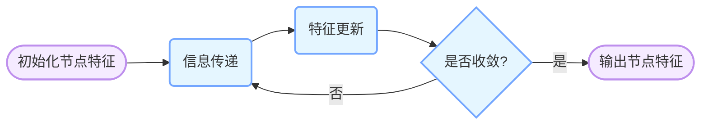

# 基于图神经网络的AI Agent动态知识表示

> 关键词：图神经网络、AI Agent、动态知识表示、知识图谱、深度学习

> 摘要：本文聚焦于基于图神经网络的AI Agent动态知识表示这一前沿领域。首先介绍了相关背景，包括研究目的、预期读者等内容。接着阐述了核心概念，分析了图神经网络、AI Agent和动态知识表示之间的联系。详细讲解了核心算法原理，结合Python代码进行说明。同时给出了相关的数学模型和公式，并举例解释。通过项目实战，展示了代码的实际应用和详细解读。探讨了该技术的实际应用场景，推荐了相关的学习资源、开发工具框架和论文著作。最后总结了未来发展趋势与挑战，并提供了常见问题的解答和扩展阅读参考资料，旨在全面深入地探讨基于图神经网络的AI Agent动态知识表示技术。

## 1. 背景介绍 
### 1.1 目的和范围
在人工智能领域，AI Agent需要对知识进行有效的表示和处理，以更好地完成各种任务。传统的知识表示方法在处理复杂、动态的知识时存在一定的局限性。图神经网络作为一种强大的深度学习模型，能够很好地处理图结构的数据。本研究的目的在于探索如何利用图神经网络来实现AI Agent的动态知识表示，提高AI Agent对知识的理解和利用能力。范围涵盖了图神经网络的原理、AI Agent的知识表示需求、动态知识的建模与处理等方面。

### 1.2 预期读者
本文预期读者包括人工智能领域的研究人员、开发者、学生等。对于希望深入了解图神经网络、AI Agent以及知识表示相关技术的人员具有一定的参考价值。对于从事相关领域研究和开发的专业人士，可以提供新的思路和方法；对于学生而言，可以作为学习和探索的资料。

### 1.3 文档结构概述
本文首先介绍背景信息，包括研究目的、预期读者和文档结构概述等。接着阐述核心概念与联系，分析图神经网络、AI Agent和动态知识表示的原理和相互关系。然后讲解核心算法原理和具体操作步骤，结合Python代码进行详细说明。给出相关的数学模型和公式，并举例解释。通过项目实战，展示代码的实际应用和详细解读。探讨该技术的实际应用场景，推荐相关的学习资源、开发工具框架和论文著作。最后总结未来发展趋势与挑战，提供常见问题的解答和扩展阅读参考资料。

### 1.4 术语表
#### 1.4.1 核心术语定义
- **图神经网络（Graph Neural Network，GNN）**：一种专门处理图结构数据的深度学习模型，通过节点和边的信息传递来学习图的特征表示。
- **AI Agent**：人工智能体，是能够感知环境、做出决策并采取行动的智能实体。
- **动态知识表示**：对随时间变化的知识进行有效的表示和处理，以便AI Agent能够及时更新和利用知识。
- **知识图谱（Knowledge Graph）**：一种用图结构表示知识的方法，节点表示实体，边表示实体之间的关系。

#### 1.4.2 相关概念解释
- **图结构数据**：由节点和边组成的数据结构，节点表示对象，边表示对象之间的关系。例如，社交网络可以用图结构数据表示，用户是节点，用户之间的好友关系是边。
- **信息传递**：在图神经网络中，节点通过边与相邻节点进行信息交换和聚合，从而更新自身的特征表示。
- **特征表示**：将对象的信息转换为向量形式，以便计算机能够处理和分析。

#### 1.4.3 缩略词列表
- **GNN**：Graph Neural Network（图神经网络）
- **AI**：Artificial Intelligence（人工智能）

## 2. 核心概念与联系 
### 2.1 图神经网络原理
图神经网络的核心思想是通过节点和边的信息传递来学习图的特征表示。其基本原理可以用以下步骤描述：
1. **初始化节点特征**：为图中的每个节点赋予一个初始的特征向量。
2. **信息传递**：节点通过边与相邻节点进行信息交换和聚合。例如，一个节点可以将自己的特征信息传递给相邻节点，同时接收相邻节点的特征信息。
3. **特征更新**：根据信息传递的结果，更新节点的特征向量。
4. **重复步骤2和3**：多次进行信息传递和特征更新，直到节点的特征向量收敛。

图神经网络的架构示意图如下：


### 2.2 AI Agent知识表示需求
AI Agent在执行任务时需要对知识进行有效的表示和处理。知识表示的质量直接影响AI Agent的决策和行动能力。AI Agent的知识表示需求包括：
- **表达能力**：能够准确地表示各种类型的知识，包括实体、关系、属性等。
- **可扩展性**：能够方便地添加和更新知识，以适应动态变化的环境。
- **推理能力**：能够根据已有的知识进行推理，得出新的结论。

### 2.3 动态知识表示
动态知识表示是对随时间变化的知识进行有效的表示和处理。在现实世界中，知识是不断变化的，例如，事件的发生、实体的状态变化等。动态知识表示需要解决以下问题：
- **知识更新**：及时更新知识，以反映现实世界的变化。
- **知识一致性**：保证更新后的知识与已有的知识保持一致。
- **知识推理**：在知识更新的情况下，仍然能够进行有效的推理。

### 2.4 三者之间的联系
图神经网络可以用于AI Agent的动态知识表示。通过将知识图谱表示为图结构数据，利用图神经网络对知识图谱进行学习和处理，AI Agent可以更好地理解和利用知识。动态知识的更新可以通过图神经网络的信息传递和特征更新来实现，从而保证AI Agent的知识表示能够及时反映现实世界的变化。

## 3. 核心算法原理 & 具体操作步骤 
### 3.1 图神经网络算法原理
图神经网络的一种常见算法是图卷积网络（Graph Convolutional Network，GCN）。GCN的核心思想是通过对节点的邻接节点进行聚合来更新节点的特征表示。

GCN的数学公式如下：
$$H^{(l+1)} = \sigma(\tilde{D}^{-\frac{1}{2}}\tilde{A}\tilde{D}^{-\frac{1}{2}}H^{(l)}W^{(l)})$$
其中：
- $H^{(l)}$ 是第 $l$ 层的节点特征矩阵。
- $\tilde{A} = A + I$ 是邻接矩阵 $A$ 加上自环的矩阵。
- $\tilde{D}$ 是 $\tilde{A}$ 的度矩阵。
- $W^{(l)}$ 是第 $l$ 层的可学习权重矩阵。
- $\sigma$ 是激活函数，例如ReLU函数。

### 3.2 具体操作步骤
以下是使用Python和PyTorch实现简单GCN的代码示例：
```python
import torch
import torch.nn as nn
import torch.nn.functional as F

class GraphConvolution(nn.Module):
    def __init__(self, in_features, out_features, bias=True):
        super(GraphConvolution, self).__init__()
        self.in_features = in_features
        self.out_features = out_features
        self.weight = nn.Parameter(torch.FloatTensor(in_features, out_features))
        if bias:
            self.bias = nn.Parameter(torch.FloatTensor(out_features))
        else:
            self.register_parameter('bias', None)
        self.reset_parameters()

    def reset_parameters(self):
        nn.init.xavier_uniform_(self.weight)
        if self.bias is not None:
            nn.init.zeros_(self.bias)

    def forward(self, input, adj):
        support = torch.mm(input, self.weight)
        output = torch.spmm(adj, support)
        if self.bias is not None:
            return output + self.bias
        else:
            return output

class GCN(nn.Module):
    def __init__(self, nfeat, nhid, nclass, dropout):
        super(GCN, self).__init__()
        self.gc1 = GraphConvolution(nfeat, nhid)
        self.gc2 = GraphConvolution(nhid, nclass)
        self.dropout = dropout

    def forward(self, x, adj):
        x = F.relu(self.gc1(x, adj))
        x = F.dropout(x, self.dropout, training=self.training)
        x = self.gc2(x, adj)
        return F.log_softmax(x, dim=1)
```
### 3.3 代码解释
1. **GraphConvolution类**：实现了图卷积层的前向传播。在`__init__`方法中，定义了可学习的权重矩阵和偏置项，并进行初始化。在`forward`方法中，首先计算输入特征与权重矩阵的乘积，然后与邻接矩阵进行稀疏矩阵乘法，最后加上偏置项（如果有）。
2. **GCN类**：定义了一个两层的GCN模型。在`__init__`方法中，初始化了两个图卷积层和一个Dropout层。在`forward`方法中，依次调用两个图卷积层，并在中间加入ReLU激活函数和Dropout层，最后输出经过log_softmax处理的结果。

## 4. 数学模型和公式 & 详细讲解 & 举例说明 
### 4.1 图神经网络的数学模型
图神经网络的数学模型可以用图的邻接矩阵和节点特征矩阵来描述。设图 $G=(V, E)$，其中 $V$ 是节点集合，$E$ 是边集合。邻接矩阵 $A$ 表示节点之间的连接关系，节点特征矩阵 $X$ 表示每个节点的特征。

图神经网络的目标是学习一个函数 $f$，将输入的图 $G$ 和节点特征矩阵 $X$ 映射到节点的特征表示 $H$：
$$H = f(G, X)$$

### 4.2 图卷积网络的公式推导
图卷积网络（GCN）的公式推导基于谱图理论。谱图理论将图的拉普拉斯矩阵进行特征分解，得到图的谱表示。GCN通过对节点的邻接节点进行聚合来更新节点的特征表示。

具体来说，GCN的第一层更新公式为：
$$H^{(1)} = \sigma(\tilde{D}^{-\frac{1}{2}}\tilde{A}\tilde{D}^{-\frac{1}{2}}XW^{(0)})$$
其中：
- $\tilde{A} = A + I$ 是邻接矩阵 $A$ 加上自环的矩阵。
- $\tilde{D}$ 是 $\tilde{A}$ 的度矩阵。
- $X$ 是输入的节点特征矩阵。
- $W^{(0)}$ 是第一层的可学习权重矩阵。
- $\sigma$ 是激活函数。

### 4.3 举例说明
假设有一个简单的图，包含3个节点，邻接矩阵 $A$ 为：
$$A = \begin{bmatrix}
0 & 1 & 1 \\
1 & 0 & 1 \\
1 & 1 & 0
\end{bmatrix}$$
节点特征矩阵 $X$ 为：
$$X = \begin{bmatrix}
1 & 0 \\
0 & 1 \\
1 & 1
\end{bmatrix}$$
首先计算 $\tilde{A} = A + I$：
$$\tilde{A} = \begin{bmatrix}
1 & 1 & 1 \\
1 & 1 & 1 \\
1 & 1 & 1
\end{bmatrix}$$
然后计算 $\tilde{D}$：
$$\tilde{D} = \begin{bmatrix}
3 & 0 & 0 \\
0 & 3 & 0 \\
0 & 0 & 3
\end{bmatrix}$$
$\tilde{D}^{-\frac{1}{2}}$ 为：
$$\tilde{D}^{-\frac{1}{2}} = \begin{bmatrix}
\frac{1}{\sqrt{3}} & 0 & 0 \\
0 & \frac{1}{\sqrt{3}} & 0 \\
0 & 0 & \frac{1}{\sqrt{3}}
\end{bmatrix}$$
假设 $W^{(0)}$ 为：
$$W^{(0)} = \begin{bmatrix}
1 & 0 \\
0 & 1
\end{bmatrix}$$
则 $\tilde{D}^{-\frac{1}{2}}\tilde{A}\tilde{D}^{-\frac{1}{2}}XW^{(0)}$ 为：
$$\tilde{D}^{-\frac{1}{2}}\tilde{A}\tilde{D}^{-\frac{1}{2}}XW^{(0)} = \begin{bmatrix}
\frac{2}{\sqrt{3}} & \frac{2}{\sqrt{3}} \\
\frac{2}{\sqrt{3}} & \frac{2}{\sqrt{3}} \\
\frac{2}{\sqrt{3}} & \frac{2}{\sqrt{3}}
\end{bmatrix}$$
如果激活函数 $\sigma$ 为ReLU函数，则 $H^{(1)}$ 为：
$$H^{(1)} = \begin{bmatrix}
\frac{2}{\sqrt{3}} & \frac{2}{\sqrt{3}} \\
\frac{2}{\sqrt{3}} & \frac{2}{\sqrt{3}} \\
\frac{2}{\sqrt{3}} & \frac{2}{\sqrt{3}}
\end{bmatrix}$$

## 5. 项目实战：代码实际案例和详细解释说明 
### 5.1  开发环境搭建
为了实现基于图神经网络的AI Agent动态知识表示，我们需要搭建相应的开发环境。以下是具体步骤：
1. **安装Python**：推荐使用Python 3.7及以上版本。可以从Python官方网站（https://www.python.org/downloads/）下载安装包进行安装。
2. **安装PyTorch**：PyTorch是一个深度学习框架，用于实现图神经网络。可以根据自己的需求选择合适的版本进行安装。例如，使用以下命令安装CPU版本的PyTorch：
```bash
pip install torch torchvision
```
3. **安装其他依赖库**：还需要安装一些其他的依赖库，如`numpy`、`scipy`等。可以使用以下命令进行安装：
```bash
pip install numpy scipy
```

### 5.2  源代码详细实现和代码解读
以下是一个完整的基于图神经网络的AI Agent动态知识表示的代码示例：
```python
import torch
import torch.nn as nn
import torch.nn.functional as F
import numpy as np
import scipy.sparse as sp

# 定义图卷积层
class GraphConvolution(nn.Module):
    def __init__(self, in_features, out_features, bias=True):
        super(GraphConvolution, self).__init__()
        self.in_features = in_features
        self.out_features = out_features
        self.weight = nn.Parameter(torch.FloatTensor(in_features, out_features))
        if bias:
            self.bias = nn.Parameter(torch.FloatTensor(out_features))
        else:
            self.register_parameter('bias', None)
        self.reset_parameters()

    def reset_parameters(self):
        nn.init.xavier_uniform_(self.weight)
        if self.bias is not None:
            nn.init.zeros_(self.bias)

    def forward(self, input, adj):
        support = torch.mm(input, self.weight)
        output = torch.spmm(adj, support)
        if self.bias is not None:
            return output + self.bias
        else:
            return output

# 定义GCN模型
class GCN(nn.Module):
    def __init__(self, nfeat, nhid, nclass, dropout):
        super(GCN, self).__init__()
        self.gc1 = GraphConvolution(nfeat, nhid)
        self.gc2 = GraphConvolution(nhid, nclass)
        self.dropout = dropout

    def forward(self, x, adj):
        x = F.relu(self.gc1(x, adj))
        x = F.dropout(x, self.dropout, training=self.training)
        x = self.gc2(x, adj)
        return F.log_softmax(x, dim=1)

# 数据预处理
def normalize_adj(adj):
    """Symmetrically normalize adjacency matrix."""
    adj = sp.coo_matrix(adj)
    rowsum = np.array(adj.sum(1))
    d_inv_sqrt = np.power(rowsum, -0.5).flatten()
    d_inv_sqrt[np.isinf(d_inv_sqrt)] = 0.
    d_mat_inv_sqrt = sp.diags(d_inv_sqrt)
    return adj.dot(d_mat_inv_sqrt).transpose().dot(d_mat_inv_sqrt).tocoo()

def sparse_mx_to_torch_sparse_tensor(sparse_mx):
    """Convert a scipy sparse matrix to a torch sparse tensor."""
    sparse_mx = sparse_mx.tocoo().astype(np.float32)
    indices = torch.from_numpy(
        np.vstack((sparse_mx.row, sparse_mx.col)).astype(np.int64))
    values = torch.from_numpy(sparse_mx.data)
    shape = torch.Size(sparse_mx.shape)
    return torch.sparse.FloatTensor(indices, values, shape)

# 主函数
def main():
    # 定义超参数
    nfeat = 1433
    nhid = 16
    nclass = 7
    dropout = 0.5
    lr = 0.01
    weight_decay = 5e-4
    epochs = 200

    # 加载数据
    adj = np.load('adj.npy')
    features = np.load('features.npy')
    labels = np.load('labels.npy')

    # 数据预处理
    adj = normalize_adj(adj + sp.eye(adj.shape[0]))
    adj = sparse_mx_to_torch_sparse_tensor(adj)
    features = torch.FloatTensor(features)
    labels = torch.LongTensor(labels)

    # 初始化模型、优化器和损失函数
    model = GCN(nfeat, nhid, nclass, dropout)
    optimizer = torch.optim.Adam(model.parameters(), lr=lr, weight_decay=weight_decay)
    criterion = nn.NLLLoss()

    # 训练模型
    for epoch in range(epochs):
        optimizer.zero_grad()
        output = model(features, adj)
        loss = criterion(output, labels)
        loss.backward()
        optimizer.step()
        print(f'Epoch {epoch + 1}/{epochs}, Loss: {loss.item()}')

if __name__ == '__main__':
    main()
```
### 5.3  代码解读与分析
1. **图卷积层（GraphConvolution类）**：实现了图卷积层的前向传播。在`__init__`方法中，定义了可学习的权重矩阵和偏置项，并进行初始化。在`forward`方法中，首先计算输入特征与权重矩阵的乘积，然后与邻接矩阵进行稀疏矩阵乘法，最后加上偏置项（如果有）。
2. **GCN模型（GCN类）**：定义了一个两层的GCN模型。在`__init__`方法中，初始化了两个图卷积层和一个Dropout层。在`forward`方法中，依次调用两个图卷积层，并在中间加入ReLU激活函数和Dropout层，最后输出经过log_softmax处理的结果。
3. **数据预处理函数**：`normalize_adj`函数用于对邻接矩阵进行对称归一化，`sparse_mx_to_torch_sparse_tensor`函数用于将稀疏矩阵转换为PyTorch的稀疏张量。
4. **主函数（main函数）**：定义了超参数，加载数据，进行数据预处理，初始化模型、优化器和损失函数，然后进行模型训练。

## 6. 实际应用场景 
### 6.1 智能推荐系统
在智能推荐系统中，用户和物品可以表示为图中的节点，用户与物品之间的交互（如购买、浏览等）可以表示为边。通过图神经网络对用户和物品的知识进行动态表示，能够更好地捕捉用户的兴趣和物品的特征，从而提高推荐的准确性和个性化程度。例如，电商平台可以根据用户的历史购买记录和浏览行为，利用图神经网络预测用户可能感兴趣的商品，并进行推荐。

### 6.2 医疗诊断
在医疗领域，患者、疾病、症状、药物等可以表示为图中的节点，它们之间的关系（如患者患有某种疾病、疾病有某些症状、药物可以治疗某种疾病等）可以表示为边。基于图神经网络的AI Agent动态知识表示可以帮助医生更好地理解患者的病情，进行准确的诊断和治疗方案的制定。例如，通过分析患者的病历、检查结果等信息，结合图神经网络学习到的知识，预测患者可能患有的疾病，并推荐合适的治疗方法。

### 6.3 金融风险评估
在金融领域，企业、投资者、金融产品等可以表示为图中的节点，它们之间的关系（如企业的股权结构、投资者的投资行为、金融产品的关联关系等）可以表示为边。通过图神经网络对金融知识进行动态表示，能够及时发现潜在的金融风险，进行风险评估和预警。例如，分析企业的财务数据、市场行情等信息，结合图神经网络学习到的知识，评估企业的信用风险，预测金融市场的波动。

### 6.4 自然语言处理
在自然语言处理中，文本中的单词、句子、实体等可以表示为图中的节点，它们之间的语义关系（如共现关系、语义相似关系等）可以表示为边。基于图神经网络的AI Agent动态知识表示可以帮助理解文本的语义，进行文本分类、情感分析、信息抽取等任务。例如，分析新闻文章中的实体和事件，利用图神经网络学习到的知识，进行事件的关联和推理，提取有价值的信息。

## 7. 工具和资源推荐
### 7.1 学习资源推荐
#### 7.1.1 书籍推荐
- 《深度学习》（Deep Learning）：由Ian Goodfellow、Yoshua Bengio和Aaron Courville合著，是深度学习领域的经典教材，涵盖了深度学习的基本原理、算法和应用。
- 《图神经网络入门》（Graph Neural Networks: Foundations, Frontiers, and Applications）：由Jiawei Han、Jiaheng Lu和Xifeng Yan合著，系统介绍了图神经网络的原理、算法和应用。
- 《人工智能：一种现代的方法》（Artificial Intelligence: A Modern Approach）：由Stuart Russell和Peter Norvig合著，是人工智能领域的经典教材，涵盖了人工智能的各个方面，包括知识表示、推理、学习等。

#### 7.1.2 在线课程
- Coursera上的“深度学习专项课程”（Deep Learning Specialization）：由Andrew Ng教授主讲，包括深度学习的基础、卷积神经网络、循环神经网络等内容。
- edX上的“图神经网络”（Graph Neural Networks）：由MIT的教授主讲，系统介绍了图神经网络的原理、算法和应用。
- 哔哩哔哩上的一些人工智能相关的视频教程，如李宏毅的机器学习课程、吴恩达的深度学习课程等。

#### 7.1.3 技术博客和网站
- Medium：上面有很多关于图神经网络、AI Agent和知识表示的技术博客文章，可以关注一些相关的作者和主题。
- arXiv：是一个预印本平台，上面有很多最新的图神经网络、人工智能等领域的研究论文。
- 机器之心、新智元等人工智能领域的资讯网站，会发布一些最新的技术动态和研究成果。

### 7.2 开发工具框架推荐
#### 7.2.1 IDE和编辑器
- PyCharm：是一款专门用于Python开发的集成开发环境，具有代码编辑、调试、自动补全、版本控制等功能，非常适合开发基于图神经网络的项目。
- Jupyter Notebook：是一个交互式的开发环境，支持Python、R等多种编程语言，非常适合进行数据探索、模型实验和代码演示。
- Visual Studio Code：是一款轻量级的代码编辑器，支持多种编程语言和插件，具有丰富的扩展功能，可以方便地进行Python开发。

#### 7.2.2 调试和性能分析工具
- PyTorch的调试工具：PyTorch提供了一些调试工具，如`torch.autograd`、`torch.utils.bottleneck`等，可以帮助调试和分析代码的性能。
- TensorBoard：是TensorFlow的可视化工具，也可以与PyTorch结合使用，用于可视化训练过程中的损失曲线、准确率曲线等指标，帮助分析模型的训练情况。
- NVIDIA的Nsight工具：可以用于分析GPU的性能，帮助优化基于GPU的深度学习模型。

#### 7.2.3 相关框架和库
- PyTorch Geometric：是一个基于PyTorch的图神经网络框架，提供了丰富的图神经网络层和数据集，方便进行图神经网络的开发和实验。
- DGL（Deep Graph Library）：是一个用于图神经网络的深度学习框架，支持多种深度学习后端，如PyTorch、TensorFlow等，具有高效的图数据处理和计算能力。
- NetworkX：是一个用于图分析和处理的Python库，提供了丰富的图算法和数据结构，可用于图数据的预处理和分析。

### 7.3 相关论文著作推荐
#### 7.3.1 经典论文
- “Semi-Supervised Classification with Graph Convolutional Networks”：介绍了图卷积网络（GCN）的基本原理和算法，是图神经网络领域的经典论文。
- “Graph Attention Networks”：提出了图注意力网络（GAT），通过引入注意力机制，提高了图神经网络的表达能力。
- “Inductive Representation Learning on Large Graphs”：提出了GraphSAGE算法，用于归纳式的图表示学习。

#### 7.3.2 最新研究成果
- 关注arXiv上的最新论文，了解图神经网络、AI Agent和动态知识表示领域的最新研究进展。
- 参加相关的学术会议，如NeurIPS、ICML、AAAI等，了解最新的研究成果和趋势。

#### 7.3.3 应用案例分析
- 一些知名企业和研究机构发布的关于图神经网络应用的案例分析报告，如阿里巴巴、谷歌等公司的相关技术博客文章，了解图神经网络在实际应用中的经验和方法。

## 8. 总结：未来发展趋势与挑战
### 8.1 未来发展趋势
- **多模态融合**：将图神经网络与其他模态的信息（如图像、文本、语音等）进行融合，实现更加全面和准确的知识表示和处理。例如，在智能推荐系统中，结合用户的图像、文本评论等信息，提高推荐的准确性和个性化程度。
- **强化学习与图神经网络的结合**：将图神经网络应用于强化学习中，帮助AI Agent更好地理解环境和任务，提高决策和行动能力。例如，在机器人控制、自动驾驶等领域，利用图神经网络对环境进行建模和分析，实现更加智能的决策和控制。
- **可解释性图神经网络**：提高图神经网络的可解释性，使得模型的决策过程和结果能够被人类理解和信任。这对于一些关键领域（如医疗、金融等）的应用尤为重要。例如，在医疗诊断中，解释图神经网络的决策依据，帮助医生更好地理解病情和制定治疗方案。
- **大规模图数据处理**：随着图数据的规模不断增大，如何高效地处理和分析大规模图数据是未来的一个重要发展方向。研究更加高效的图神经网络算法和数据结构，提高模型的训练和推理效率。

### 8.2 挑战
- **数据质量和标注**：图数据的质量和标注对于模型的性能至关重要。在实际应用中，图数据往往存在噪声、缺失值等问题，并且标注数据的成本较高。如何提高数据的质量和标注效率是一个挑战。
- **模型复杂度和计算资源**：图神经网络的模型复杂度较高，需要大量的计算资源进行训练和推理。在资源受限的情况下，如何优化模型结构和算法，提高模型的效率是一个挑战。
- **动态知识的处理**：动态知识的更新和处理是一个复杂的问题，需要解决知识一致性、知识推理等问题。如何在动态环境中及时、准确地更新和利用知识是一个挑战。
- **伦理和安全问题**：随着AI Agent的应用越来越广泛，伦理和安全问题也越来越受到关注。例如，AI Agent的决策可能会对人类产生影响，如何确保AI Agent的决策符合伦理和安全要求是一个挑战。

## 9. 附录：常见问题与解答
### 9.1 图神经网络与传统神经网络有什么区别？
图神经网络是专门处理图结构数据的深度学习模型，而传统神经网络主要处理欧几里得空间的数据（如图像、文本等）。图神经网络通过节点和边的信息传递来学习图的特征表示，能够更好地捕捉图中节点之间的关系和结构信息。

### 9.2 如何选择合适的图神经网络模型？
选择合适的图神经网络模型需要考虑多个因素，如数据的特点、任务的需求、计算资源等。如果数据的图结构比较简单，可以选择简单的图卷积网络（GCN）；如果需要考虑节点之间的注意力机制，可以选择图注意力网络（GAT）；如果需要处理大规模图数据，可以选择GraphSAGE等归纳式的图神经网络模型。

### 9.3 图神经网络的训练过程中需要注意什么？
在图神经网络的训练过程中，需要注意以下几点：
- **数据预处理**：对图数据进行预处理，如归一化、稀疏矩阵转换等，以提高模型的训练效率和性能。
- **超参数调整**：选择合适的超参数，如学习率、权重衰减、隐藏层维度等，以获得较好的训练效果。
- **过拟合问题**：图神经网络容易出现过拟合问题，可以采用Dropout、正则化等方法来缓解过拟合。
- **计算资源管理**：图神经网络的训练需要大量的计算资源，需要合理管理计算资源，如使用GPU加速、分布式训练等。

### 9.4 如何评估图神经网络模型的性能？
评估图神经网络模型的性能可以使用多种指标，如准确率、召回率、F1值、均方误差等。具体选择哪种指标需要根据任务的类型和需求来确定。例如，在分类任务中，可以使用准确率、召回率、F1值等指标；在回归任务中，可以使用均方误差等指标。

## 10. 扩展阅读 & 参考资料
- Goodfellow, I., Bengio, Y., & Courville, A. (2016). Deep Learning. MIT Press.
- Han, J., Lu, J., & Yan, X. (2020). Graph Neural Networks: Foundations, Frontiers, and Applications. Morgan Kaufmann.
- Russell, S. J., & Norvig, P. (2016). Artificial Intelligence: A Modern Approach. Pearson.
- Kipf, T. N., & Welling, M. (2016). Semi-Supervised Classification with Graph Convolutional Networks. arXiv preprint arXiv:1609.02907.
- Veličković, P., Cucurull, G., Casanova, A., Romero, A., Lio, P., & Bengio, Y. (2017). Graph Attention Networks. arXiv preprint arXiv:1710.10903.
- Hamilton, W. L., Ying, Z., & Leskovec, J. (2017). Inductive Representation Learning on Large Graphs. arXiv preprint arXiv:1706.02216.

作者：AI天才研究院/AI Genius Institute & 禅与计算机程序设计艺术 /Zen And The Art of Computer Programming