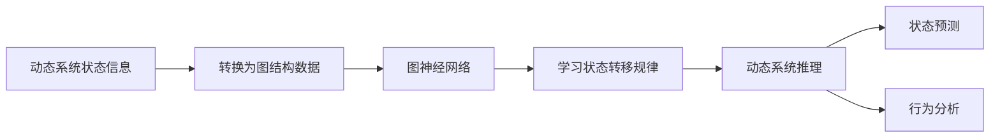

# 基于图神经网络的动态系统推理框架

> 关键词：图神经网络、动态系统推理、框架设计、算法原理、实际应用

> 摘要：本文聚焦于基于图神经网络的动态系统推理框架。首先介绍了该研究的背景、目的、预期读者以及文档结构等内容。接着深入阐述了核心概念、联系、算法原理和具体操作步骤，通过Python代码进行详细说明。同时给出了相关的数学模型和公式，并结合实例展开讲解。在项目实战部分，展示了开发环境搭建、源代码实现与解读。还探讨了该框架的实际应用场景，推荐了学习资源、开发工具框架以及相关论文著作。最后总结了未来发展趋势与挑战，提供了常见问题解答和扩展阅读参考资料，旨在为相关领域的研究和实践提供全面且深入的指导。

## 1. 背景介绍 
### 1.1 目的和范围
在当今复杂的现实世界中，许多系统都呈现出动态性和交互性的特点，如交通系统、电力网络、生物系统等。准确地对这些动态系统进行推理和建模具有重要的理论和实际意义。本研究的目的在于构建一个基于图神经网络的动态系统推理框架，利用图神经网络强大的表达能力和学习能力，对动态系统的状态和行为进行有效推理。

本框架的范围涵盖了多种类型的动态系统，包括但不限于离散时间动态系统和连续时间动态系统。可以处理不同规模和复杂度的图结构数据，能够适应不同的推理任务，如状态预测、行为分析等。

### 1.2 预期读者
本文预期读者包括计算机科学、控制理论、物理学、生物学等领域的研究人员和工程师。对于对图神经网络和动态系统推理感兴趣的研究生和高年级本科生，也具有一定的参考价值。同时，对于在实际应用中需要处理动态系统数据的从业人员，如交通规划师、电力系统工程师等，本框架的相关内容也可以为他们提供新的思路和方法。

### 1.3 文档结构概述
本文将按照以下结构进行组织：
- 核心概念与联系：介绍图神经网络和动态系统推理的核心概念，以及它们之间的联系，并通过文本示意图和Mermaid流程图进行直观展示。
- 核心算法原理 & 具体操作步骤：详细阐述基于图神经网络的动态系统推理的核心算法原理，并使用Python源代码进行说明。
- 数学模型和公式 & 详细讲解 & 举例说明：给出相关的数学模型和公式，进行详细讲解，并结合具体例子进行说明。
- 项目实战：代码实际案例和详细解释说明：通过一个实际的项目案例，展示如何搭建开发环境、实现源代码，并对代码进行解读和分析。
- 实际应用场景：探讨该框架在不同领域的实际应用场景。
- 工具和资源推荐：推荐相关的学习资源、开发工具框架和论文著作。
- 总结：未来发展趋势与挑战：总结该领域的未来发展趋势和面临的挑战。
- 附录：常见问题与解答：提供常见问题的解答。
- 扩展阅读 & 参考资料：列出扩展阅读的相关内容和参考资料。

### 1.4 术语表
#### 1.4.1 核心术语定义
- **图神经网络（Graph Neural Network, GNN）**：是一类专门用于处理图结构数据的神经网络，它通过节点之间的消息传递机制来学习节点和图的表示。
- **动态系统（Dynamic System）**：是指其状态随时间变化的系统，通常可以用一组差分方程或微分方程来描述。
- **推理框架（Inference Framework）**：是一个用于进行推理任务的系统或架构，它包含了数据处理、模型训练和推理等多个环节。

#### 1.4.2 相关概念解释
- **消息传递机制（Message Passing Mechanism）**：在图神经网络中，节点通过向其邻居节点发送和接收消息来更新自身的特征表示。
- **状态预测（State Prediction）**：根据动态系统的历史状态和当前输入，预测系统未来的状态。
- **行为分析（Behavior Analysis）**：对动态系统的行为模式进行分析，如稳定性分析、周期性分析等。

#### 1.4.3 缩略词列表
- **GNN**：Graph Neural Network
- **RNN**：Recurrent Neural Network
- **LSTM**：Long Short-Term Memory

## 2. 核心概念与联系 

### 图神经网络核心概念
图神经网络是一种专门处理图结构数据的神经网络。图 $G=(V, E)$ 由节点集合 $V$ 和边集合 $E$ 组成，每个节点 $v_i \in V$ 具有特征向量 $\mathbf{x}_i$，每条边 $(v_i, v_j) \in E$ 可能具有权重 $w_{ij}$。图神经网络的核心思想是通过节点之间的消息传递来更新节点的特征表示。

在每一层图神经网络中，节点 $v_i$ 会收集其邻居节点 $N(i)$ 的信息，并结合自身的信息进行更新。具体来说，节点 $v_i$ 的更新过程可以表示为：

$$
\mathbf{h}_i^{(l+1)} = f^{(l)}\left(\mathbf{h}_i^{(l)}, \left\{\mathbf{h}_j^{(l)}: j \in N(i)\right\}\right)
$$

其中，$\mathbf{h}_i^{(l)}$ 是节点 $v_i$ 在第 $l$ 层的隐藏状态，$f^{(l)}$ 是一个可学习的函数，通常由神经网络实现。

### 动态系统核心概念
动态系统描述了系统状态随时间的变化。离散时间动态系统可以用差分方程表示：

$$
\mathbf{x}_{t+1} = \mathbf{f}(\mathbf{x}_t, \mathbf{u}_t)
$$

其中，$\mathbf{x}_t$ 是系统在时刻 $t$ 的状态向量，$\mathbf{u}_t$ 是系统在时刻 $t$ 的输入向量，$\mathbf{f}$ 是系统的状态转移函数。

连续时间动态系统可以用微分方程表示：

$$
\frac{d\mathbf{x}(t)}{dt} = \mathbf{f}(\mathbf{x}(t), \mathbf{u}(t))
$$

### 两者联系
图神经网络可以用于动态系统推理的原因在于它能够有效地捕捉图结构中节点之间的交互关系，而动态系统中的节点（如物理系统中的粒子、交通系统中的车辆等）之间也存在着复杂的交互。通过将动态系统的状态和交互信息表示为图结构数据，利用图神经网络的消息传递机制，可以学习到动态系统的状态转移规律，从而实现对动态系统的推理。

### 文本示意图
```plaintext
动态系统状态信息 ---> 转换为图结构数据
图结构数据 ---> 输入图神经网络
图神经网络 ---> 学习状态转移规律
学习到的规律 ---> 用于动态系统推理（状态预测、行为分析等）
```

### Mermaid 流程图


## 3. 核心算法原理 & 具体操作步骤 

### 核心算法原理
基于图神经网络的动态系统推理框架的核心算法主要包括图构建、消息传递和状态更新三个步骤。

#### 图构建
将动态系统的状态信息转换为图结构数据。每个节点表示系统中的一个元素，节点的特征向量可以包含该元素的状态信息，边表示元素之间的交互关系，边的权重可以表示交互的强度。

#### 消息传递
在图神经网络的每一层中，节点通过向其邻居节点发送和接收消息来更新自身的特征表示。消息传递的过程可以表示为：

```python
import torch
import torch.nn as nn

class MessagePassing(nn.Module):
    def __init__(self, in_features, out_features):
        super(MessagePassing, self).__init__()
        self.linear = nn.Linear(in_features * 2, out_features)

    def forward(self, x, edge_index):
        num_nodes = x.size(0)
        row, col = edge_index
        # 收集邻居节点的特征
        neighbor_features = x[col]
        # 自身特征
        self_features = x[row]
        # 拼接自身特征和邻居特征
        combined_features = torch.cat([self_features, neighbor_features], dim=1)
        # 线性变换
        messages = self.linear(combined_features)
        # 聚合消息
        aggregated_messages = torch.zeros(num_nodes, messages.size(1)).to(x.device)
        aggregated_messages.scatter_add_(0, row.unsqueeze(-1).expand_as(messages), messages)
        return aggregated_messages
```

#### 状态更新
根据消息传递的结果，更新节点的隐藏状态。状态更新的过程可以表示为：

```python
class StateUpdate(nn.Module):
    def __init__(self, in_features, out_features):
        super(StateUpdate, self).__init__()
        self.linear = nn.Linear(in_features, out_features)
        self.activation = nn.ReLU()

    def forward(self, x, messages):
        # 拼接自身特征和聚合后的消息
        combined = torch.cat([x, messages], dim=1)
        # 线性变换
        updated_state = self.linear(combined)
        # 激活函数
        updated_state = self.activation(updated_state)
        return updated_state
```

### 具体操作步骤
1. **数据预处理**：收集动态系统的状态信息，将其转换为图结构数据，包括节点特征和边信息。
2. **图神经网络初始化**：初始化图神经网络的参数，包括消息传递层和状态更新层的权重。
3. **训练过程**：将图结构数据输入图神经网络，进行多次迭代训练，通过反向传播算法更新网络参数，使得网络能够学习到动态系统的状态转移规律。
4. **推理过程**：在训练完成后，将新的动态系统状态信息输入到训练好的图神经网络中，进行状态预测或行为分析等推理任务。

```python
# 完整的图神经网络模型
class GraphNeuralNetwork(nn.Module):
    def __init__(self, in_features, hidden_features, out_features):
        super(GraphNeuralNetwork, self).__init__()
        self.message_passing = MessagePassing(in_features, hidden_features)
        self.state_update = StateUpdate(in_features + hidden_features, out_features)

    def forward(self, x, edge_index):
        messages = self.message_passing(x, edge_index)
        updated_state = self.state_update(x, messages)
        return updated_state

# 示例使用
in_features = 10
hidden_features = 20
out_features = 5
model = GraphNeuralNetwork(in_features, hidden_features, out_features)
x = torch.randn(100, in_features)
edge_index = torch.tensor([[0, 1, 1, 2], [1, 0, 2, 1]], dtype=torch.long)
output = model(x, edge_index)
print(output.shape)
```

## 4. 数学模型和公式 & 详细讲解 & 举例说明 

### 数学模型和公式
#### 消息传递公式
在消息传递过程中，节点 $v_i$ 从其邻居节点 $N(i)$ 接收消息并进行聚合。假设节点 $v_i$ 和其邻居节点 $v_j$ 的特征向量分别为 $\mathbf{h}_i$ 和 $\mathbf{h}_j$，边 $(v_i, v_j)$ 的权重为 $w_{ij}$，则节点 $v_i$ 接收到的消息 $\mathbf{m}_i$ 可以表示为：

$$
\mathbf{m}_i = \sum_{j \in N(i)} w_{ij} \cdot \mathbf{\phi}(\mathbf{h}_i, \mathbf{h}_j)
$$

其中，$\mathbf{\phi}$ 是一个可学习的函数，通常由神经网络实现。

#### 状态更新公式
在状态更新过程中，节点 $v_i$ 根据接收到的消息 $\mathbf{m}_i$ 和自身的特征向量 $\mathbf{h}_i$ 更新其隐藏状态 $\mathbf{h}_i'$：

$$
\mathbf{h}_i' = \mathbf{\psi}(\mathbf{h}_i, \mathbf{m}_i)
$$

其中，$\mathbf{\psi}$ 是一个可学习的函数，通常由神经网络实现。

### 详细讲解
消息传递公式中的权重 $w_{ij}$ 表示节点 $v_i$ 和 $v_j$ 之间的交互强度。通过加权求和的方式，节点 $v_i$ 可以综合考虑其邻居节点的信息。可学习的函数 $\mathbf{\phi}$ 可以根据不同的任务和数据特点进行设计，例如可以使用多层感知机（MLP）来实现。

状态更新公式中的 $\mathbf{\psi}$ 函数用于将节点 $v_i$ 的当前特征和接收到的消息进行融合，得到更新后的特征表示。同样，$\mathbf{\psi}$ 也可以使用 MLP 来实现。

### 举例说明
假设我们有一个简单的图，包含 3 个节点，节点的特征向量维度为 2。节点之间的连接关系为 $(0, 1)$ 和 $(1, 2)$，边的权重都为 1。

```python
import torch
import torch.nn as nn

# 节点特征
x = torch.tensor([[1.0, 2.0], [3.0, 4.0], [5.0, 6.0]], dtype=torch.float32)
# 边信息
edge_index = torch.tensor([[0, 1], [1, 2]], dtype=torch.long)

# 定义消息传递函数
class MessagePassing(nn.Module):
    def __init__(self, in_features):
        super(MessagePassing, self).__init__()
        self.linear = nn.Linear(in_features * 2, in_features)

    def forward(self, x, edge_index):
        row, col = edge_index
        neighbor_features = x[col]
        self_features = x[row]
        combined_features = torch.cat([self_features, neighbor_features], dim=1)
        messages = self.linear(combined_features)
        num_nodes = x.size(0)
        aggregated_messages = torch.zeros(num_nodes, messages.size(1)).to(x.device)
        aggregated_messages.scatter_add_(0, row.unsqueeze(-1).expand_as(messages), messages)
        return aggregated_messages

# 定义状态更新函数
class StateUpdate(nn.Module):
    def __init__(self, in_features):
        super(StateUpdate, self).__init__()
        self.linear = nn.Linear(in_features * 2, in_features)
        self.activation = nn.ReLU()

    def forward(self, x, messages):
        combined = torch.cat([x, messages], dim=1)
        updated_state = self.linear(combined)
        updated_state = self.activation(updated_state)
        return updated_state

# 初始化消息传递和状态更新模块
message_passing = MessagePassing(2)
state_update = StateUpdate(2)

# 消息传递
messages = message_passing(x, edge_index)
# 状态更新
updated_state = state_update(x, messages)

print("Updated state:", updated_state)
```

在这个例子中，我们首先定义了节点特征和边信息，然后实现了消息传递和状态更新的函数。通过调用这些函数，我们可以得到节点更新后的特征表示。

## 5. 项目实战：代码实际案例和详细解释说明 

### 5.1  开发环境搭建
#### 安装Python
首先需要安装Python，建议使用Python 3.7及以上版本。可以从Python官方网站（https://www.python.org/downloads/）下载并安装。

#### 安装深度学习框架
我们使用PyTorch作为深度学习框架，可以根据自己的CUDA版本和操作系统选择合适的安装方式。在命令行中执行以下命令安装PyTorch：

```sh
pip install torch torchvision
```

#### 安装图神经网络库
使用PyTorch Geometric作为图神经网络库，它提供了丰富的图神经网络工具和数据集。在命令行中执行以下命令安装：

```sh
pip install torch-geometric
```

### 5.2  源代码详细实现和代码解读
#### 数据集准备
我们使用一个简单的动态系统数据集，假设系统包含 10 个节点，每个节点的状态维度为 5。我们生成 100 个时间步的系统状态数据，并将其转换为图结构数据。

```python
import torch
from torch_geometric.data import Data

# 生成动态系统状态数据
num_nodes = 10
state_dim = 5
num_timesteps = 100
states = torch.randn(num_timesteps, num_nodes, state_dim)

# 构建图结构
edge_index = torch.tensor([[i, (i + 1) % num_nodes] for i in range(num_nodes)], dtype=torch.long).t().contiguous()

# 转换为图数据
graph_data = []
for t in range(num_timesteps - 1):
    x = states[t]
    y = states[t + 1]
    data = Data(x=x, edge_index=edge_index, y=y)
    graph_data.append(data)
```

#### 定义图神经网络模型
```python
import torch.nn.functional as F
from torch_geometric.nn import GCNConv

class GNNModel(torch.nn.Module):
    def __init__(self, in_channels, hidden_channels, out_channels):
        super(GNNModel, self).__init__()
        self.conv1 = GCNConv(in_channels, hidden_channels)
        self.conv2 = GCNConv(hidden_channels, out_channels)

    def forward(self, x, edge_index):
        x = self.conv1(x, edge_index)
        x = F.relu(x)
        x = self.conv2(x, edge_index)
        return x
```

#### 训练模型
```python
# 初始化模型、优化器和损失函数
model = GNNModel(state_dim, 16, state_dim)
optimizer = torch.optim.Adam(model.parameters(), lr=0.01)
criterion = torch.nn.MSELoss()

# 训练模型
num_epochs = 100
for epoch in range(num_epochs):
    total_loss = 0
    for data in graph_data:
        optimizer.zero_grad()
        out = model(data.x, data.edge_index)
        loss = criterion(out, data.y)
        loss.backward()
        optimizer.step()
        total_loss += loss.item()
    print(f'Epoch {epoch + 1}/{num_epochs}, Loss: {total_loss / len(graph_data)}')
```

### 5.3  代码解读与分析
#### 数据集准备部分
- 首先生成了动态系统的状态数据，包含 100 个时间步，每个时间步有 10 个节点，每个节点的状态维度为 5。
- 构建了一个简单的图结构，每个节点与其相邻节点相连。
- 将每个时间步的状态数据转换为图数据对象，其中输入特征为当前时间步的状态，标签为下一个时间步的状态。

#### 模型定义部分
- 定义了一个简单的图卷积神经网络（GCN）模型，包含两个图卷积层和一个ReLU激活函数。
- 第一个图卷积层将输入特征维度从 `state_dim` 转换为 `hidden_channels`，第二个图卷积层将特征维度从 `hidden_channels` 转换为 `state_dim`。

#### 训练部分
- 初始化了模型、优化器和损失函数。使用Adam优化器进行参数更新，使用均方误差损失函数来衡量预测值和真实值之间的差异。
- 在每个训练周期中，遍历所有的图数据，计算预测值和损失，然后进行反向传播和参数更新。

通过这个项目实战，我们可以看到如何使用图神经网络对动态系统进行推理，包括数据集准备、模型定义和训练过程。

## 6. 实际应用场景 
### 交通系统
在交通系统中，道路交叉口、路段和车辆可以看作是图中的节点，它们之间的连接关系可以用边来表示。基于图神经网络的动态系统推理框架可以用于交通流量预测、交通拥堵分析和交通信号控制等任务。通过对历史交通数据的学习，框架可以预测未来的交通流量，帮助交通管理部门提前采取措施，缓解交通拥堵。

### 电力系统
电力系统中的发电机、变压器、输电线路等设备可以构成一个图结构。该框架可以用于电力系统的状态估计、故障诊断和负荷预测等任务。通过实时监测电力系统的运行状态，框架可以快速准确地检测出故障，并预测未来的电力负荷，为电力系统的安全稳定运行提供支持。

### 生物系统
在生物系统中，细胞、基因和蛋白质等生物分子可以看作是图中的节点，它们之间的相互作用可以用边来表示。该框架可以用于生物分子网络的分析、疾病预测和药物设计等任务。通过对生物分子网络的学习，框架可以揭示生物系统的内在机制，为疾病的诊断和治疗提供新的思路。

### 社交网络
社交网络中的用户可以看作是图中的节点，用户之间的关系可以用边来表示。该框架可以用于社交网络的用户行为预测、信息传播分析和社区发现等任务。通过对用户的历史行为和社交关系的学习，框架可以预测用户的未来行为，帮助社交平台提供个性化的服务。

## 7. 工具和资源推荐
### 7.1 学习资源推荐
#### 7.1.1 书籍推荐
- 《图神经网络：基础、前沿与应用》：全面介绍了图神经网络的基本概念、算法和应用，是学习图神经网络的经典书籍。
- 《深度学习》：由Ian Goodfellow、Yoshua Bengio和Aaron Courville所著，是深度学习领域的权威教材，其中也包含了图神经网络的相关内容。
- 《动态系统理论与应用》：介绍了动态系统的基本理论和分析方法，对于理解动态系统推理有很大的帮助。

#### 7.1.2 在线课程
- Coursera上的“Graph Neural Networks for Machine Learning”：由美国斯坦福大学的Jure Leskovec教授授课，系统地介绍了图神经网络的理论和实践。
- edX上的“Deep Learning for Dynamic Systems”：讲解了深度学习在动态系统中的应用，包括状态估计、控制和预测等方面。

#### 7.1.3 技术博客和网站
- Medium上的“Towards Data Science”：有很多关于图神经网络和动态系统推理的高质量文章，涵盖了最新的研究成果和应用案例。
- arXiv.org：是一个预印本平台，提供了大量关于图神经网络和动态系统推理的学术论文，可以及时了解该领域的最新研究动态。

### 7.2 开发工具框架推荐
#### 7.2.1 IDE和编辑器
- PyCharm：是一款专门为Python开发设计的集成开发环境，提供了丰富的代码编辑、调试和版本控制等功能，非常适合开发基于Python的图神经网络项目。
- Jupyter Notebook：是一个交互式的开发环境，可以方便地进行代码编写、数据可视化和结果展示，对于快速验证想法和进行实验非常有用。

#### 7.2.2 调试和性能分析工具
- TensorBoard：是TensorFlow提供的一个可视化工具，可以用于可视化模型的训练过程、损失曲线和模型结构等信息，帮助我们更好地理解和调试模型。
- PyTorch Profiler：是PyTorch提供的一个性能分析工具，可以帮助我们分析模型的性能瓶颈，优化代码的运行效率。

#### 7.2.3 相关框架和库
- PyTorch Geometric：是一个基于PyTorch的图神经网络库，提供了丰富的图神经网络层和数据集，方便我们快速实现图神经网络模型。
- DGL（Deep Graph Library）：是另一个流行的图神经网络库，支持多种深度学习框架，具有高效的图计算和分布式训练能力。

### 7.3 相关论文著作推荐
#### 7.3.1 经典论文
- “Semi-Supervised Classification with Graph Convolutional Networks”：提出了图卷积网络（GCN）的概念，是图神经网络领域的经典论文。
- “Neural Ordinary Differential Equations”：将神经网络与常微分方程相结合，为动态系统推理提供了新的思路。

#### 7.3.2 最新研究成果
- 关注NeurIPS、ICML、CVPR等顶级学术会议上关于图神经网络和动态系统推理的最新研究成果，了解该领域的前沿技术和发展趋势。

#### 7.3.3 应用案例分析
- 可以参考一些实际应用案例的论文，如交通流量预测、电力系统故障诊断等方面的论文，学习如何将图神经网络和动态系统推理应用到实际问题中。

## 8. 总结：未来发展趋势与挑战
### 未来发展趋势
#### 多模态融合
未来的基于图神经网络的动态系统推理框架将更加注重多模态数据的融合，如将图像、文本和传感器数据等多种类型的数据结合起来，以更全面地描述动态系统的状态和行为。

#### 可解释性增强
随着图神经网络在实际应用中的广泛使用，对模型的可解释性要求也越来越高。未来的研究将致力于提高图神经网络的可解释性，使得模型的决策过程更加透明和可理解。

#### 强化学习与图神经网络的结合
强化学习可以用于优化动态系统的控制策略，而图神经网络可以用于处理系统的复杂结构和交互关系。未来的研究将探索强化学习与图神经网络的结合，以实现更智能的动态系统控制。

### 挑战
#### 数据质量和数量
动态系统的数据往往具有噪声、缺失值和不平衡等问题，而且数据的收集和标注成本较高。如何处理低质量的数据和获取足够的训练数据是一个挑战。

#### 计算资源需求
图神经网络的训练和推理通常需要大量的计算资源，尤其是在处理大规模图数据时。如何优化模型的计算效率，减少计算资源的需求是一个亟待解决的问题。

#### 模型泛化能力
动态系统的环境和行为往往具有不确定性和变化性，如何提高图神经网络模型的泛化能力，使其能够在不同的环境和条件下都能取得良好的性能是一个挑战。

## 9. 附录：常见问题与解答
### 问题1：图神经网络与传统神经网络有什么区别？
图神经网络专门用于处理图结构数据，它通过节点之间的消息传递机制来学习节点和图的表示。而传统神经网络通常处理的是欧几里得空间的数据，如向量、矩阵等。图神经网络能够捕捉图结构中节点之间的复杂交互关系，而传统神经网络在处理这种非欧几里得空间的数据时存在一定的局限性。

### 问题2：如何选择合适的图神经网络模型？
选择合适的图神经网络模型需要考虑多个因素，如数据的特点、任务的需求和计算资源等。如果数据的图结构比较简单，可以选择一些简单的图卷积网络（GCN）；如果需要处理复杂的图结构和动态变化的数据，可以选择一些更复杂的图神经网络模型，如图注意力网络（GAT）、图循环网络（GRN）等。

### 问题3：如何评估基于图神经网络的动态系统推理框架的性能？
可以使用多种指标来评估框架的性能，如均方误差（MSE）、平均绝对误差（MAE）、准确率等。对于状态预测任务，可以使用MSE和MAE来衡量预测值和真实值之间的差异；对于分类任务，可以使用准确率来评估模型的分类性能。此外，还可以通过可视化和实际应用效果来综合评估框架的性能。

## 10. 扩展阅读 & 参考资料
### 扩展阅读
- 阅读一些关于图论、机器学习和动态系统理论的相关书籍和论文，深入了解这些领域的基础知识和前沿技术。
- 参与相关的学术社区和论坛，与其他研究者和开发者交流经验和想法，了解最新的研究动态和应用案例。

### 参考资料
- [1] Kipf, T. N., & Welling, M. (2016). Semi-Supervised Classification with Graph Convolutional Networks. arXiv preprint arXiv:1609.02907.
- [2] Chen, R. T., Rubanova, Y., Bettencourt, J., & Duvenaud, D. K. (2018). Neural Ordinary Differential Equations. Advances in Neural Information Processing Systems.
- [3] Zhou, J., Cui, G., Hu, S., Zhang, Z., Yang, C., Liu, Z.,... & Sun, M. (2020). Graph neural networks: A review of methods and applications. AI Open, 1, 57-81.

作者：AI天才研究院/AI Genius Institute & 禅与计算机程序设计艺术 /Zen And The Art of Computer Programming