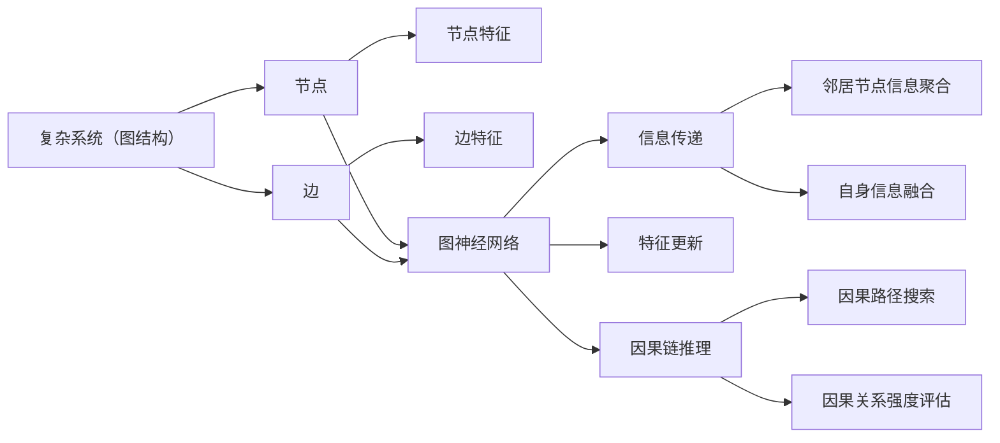

# 基于图神经网络的复杂系统因果链推理

> 关键词：图神经网络、复杂系统、因果链推理、深度学习、图结构数据

> 摘要：本文聚焦于基于图神经网络的复杂系统因果链推理这一前沿领域。首先介绍了相关背景知识，包括研究目的、预期读者和文档结构等。接着深入阐述了核心概念，通过文本示意图和 Mermaid 流程图展示了其原理和架构。详细讲解了核心算法原理，并给出 Python 源代码进行说明。同时，对涉及的数学模型和公式进行了深入分析并举例。通过项目实战，展示了代码的实际应用和详细解读。探讨了其在多个实际场景中的应用，推荐了相关的学习资源、开发工具框架和论文著作。最后总结了未来发展趋势与挑战，并对常见问题进行了解答。

## 1. 背景介绍 
### 1.1 目的和范围
在当今科技发展中，复杂系统无处不在，如生物网络、社交网络、电力网络等。这些系统中的元素之间存在着复杂的因果关系，理解和推理这些因果链对于解决许多实际问题至关重要。本研究的目的是利用图神经网络强大的图数据处理能力，实现对复杂系统中因果链的有效推理。研究范围涵盖了从图神经网络的基本原理到复杂系统因果链推理的具体实现，以及在不同实际场景中的应用。

### 1.2 预期读者
本文预期读者包括对图神经网络、因果推理、复杂系统分析等领域感兴趣的研究人员、工程师和学生。无论是从事学术研究，还是在工业界进行相关项目开发，都可以从本文中获得有价值的信息和思路。

### 1.3 文档结构概述
本文首先介绍背景知识，为读者建立起对研究主题的基本认知。接着详细阐述核心概念，包括图神经网络和因果链推理的原理和联系。然后讲解核心算法原理，并给出具体的 Python 代码实现。之后分析涉及的数学模型和公式，并举例说明。通过项目实战展示代码的实际应用和详细解读。探讨实际应用场景，为读者提供实践方向。推荐相关的学习资源、开发工具框架和论文著作，帮助读者进一步深入学习。最后总结未来发展趋势与挑战，解答常见问题，并提供扩展阅读和参考资料。

### 1.4 术语表
#### 1.4.1 核心术语定义
- **图神经网络（Graph Neural Network, GNN）**：是一类专门用于处理图结构数据的神经网络，它能够通过节点之间的连接信息学习节点和图的特征表示。
- **复杂系统**：由大量相互作用的组件组成，其行为和特性不能简单地从单个组件的特性推断得出的系统。
- **因果链推理**：在一个系统中，根据已知的因果关系和观测数据，推断出事件之间的因果链条，即找出事件之间的因果传递路径。

#### 1.4.2 相关概念解释
- **图结构数据**：由节点和边组成的数据结构，节点表示实体，边表示实体之间的关系。例如，社交网络中用户是节点，用户之间的好友关系是边。
- **深度学习**：是一类基于人工神经网络的机器学习技术，通过多层神经网络自动学习数据的特征和模式。

#### 1.4.3 缩略词列表
- **GNN**：Graph Neural Network（图神经网络）
- **MLP**：Multi - Layer Perceptron（多层感知机）

## 2. 核心概念与联系 

### 图神经网络的原理
图神经网络的核心思想是通过节点之间的信息传递来更新节点的特征表示。每个节点会聚合其邻居节点的信息，并结合自身的信息进行更新。以简单的图卷积网络（GCN）为例，节点 $i$ 在第 $l+1$ 层的特征表示 $h_i^{l + 1}$ 可以通过以下公式计算：

$$h_i^{l + 1} = \sigma\left(\sum_{j\in\mathcal{N}(i)}\frac{1}{\sqrt{d_id_j}}W^lh_j^l + b^l\right)$$

其中，$\mathcal{N}(i)$ 是节点 $i$ 的邻居节点集合，$d_i$ 和 $d_j$ 分别是节点 $i$ 和 $j$ 的度，$W^l$ 是第 $l$ 层的可学习权重矩阵，$b^l$ 是偏置项，$\sigma$ 是激活函数。

### 因果链推理的原理
因果链推理的目标是在复杂系统中找出事件之间的因果传递路径。通常基于因果关系的定义和一些假设，如因果马尔可夫条件、忠实性假设等。在实际推理中，需要结合观测数据和先验知识，通过一定的算法来推断因果关系。

### 图神经网络与因果链推理的联系
图神经网络可以很好地处理复杂系统中的图结构数据，而因果链推理可以看作是在图结构上寻找因果路径的问题。通过将复杂系统表示为图，节点表示事件或变量，边表示因果关系，图神经网络可以学习到节点和边的特征表示，从而辅助因果链推理。例如，图神经网络可以学习到节点之间的潜在因果关系强度，为因果链的推断提供依据。

### 文本示意图
```plaintext
复杂系统（图结构）
|
|-- 节点（事件/变量）
|   |
|   |-- 节点特征
|
|-- 边（因果关系）
|   |
|   |-- 边特征
|
|-- 图神经网络
|   |
|   |-- 信息传递
|   |   |
|   |   |-- 邻居节点信息聚合
|   |   |-- 自身信息融合
|   |
|   |-- 特征更新
|
|-- 因果链推理
|   |
|   |-- 因果路径搜索
|   |-- 因果关系强度评估
```

### Mermaid 流程图


## 3. 核心算法原理 & 具体操作步骤 

### 图神经网络的核心算法：图卷积网络（GCN）
图卷积网络（GCN）是一种简单而有效的图神经网络模型。其核心思想是通过邻居节点的信息聚合来更新节点的特征表示。

#### 算法原理
GCN 的前向传播过程可以分为以下几个步骤：
1. **邻接矩阵归一化**：为了避免信息传递过程中的数值不稳定问题，需要对邻接矩阵进行归一化。常用的归一化方法是对称归一化，公式如下：
$$\tilde{A} = D^{-\frac{1}{2}}(A + I)D^{-\frac{1}{2}}$$
其中，$A$ 是邻接矩阵，$I$ 是单位矩阵，$D$ 是度矩阵。

2. **信息传递和特征更新**：对于第 $l$ 层的节点特征矩阵 $H^l$，通过以下公式更新到第 $l+1$ 层：
$$H^{l + 1} = \sigma\left(\tilde{A}H^lW^l\right)$$
其中，$W^l$ 是第 $l$ 层的可学习权重矩阵，$\sigma$ 是激活函数。

#### Python 代码实现
```python
import torch
import torch.nn as nn
import torch.nn.functional as F

class GCNLayer(nn.Module):
    def __init__(self, in_features, out_features):
        super(GCNLayer, self).__init__()
        self.weight = nn.Parameter(torch.FloatTensor(in_features, out_features))
        nn.init.xavier_uniform_(self.weight)

    def forward(self, adj, features):
        # 邻接矩阵归一化
        adj_hat = adj + torch.eye(adj.size(0)).to(adj.device)
        d_hat = torch.diag(torch.pow(adj_hat.sum(dim=1), -0.5))
        adj_norm = torch.mm(torch.mm(d_hat, adj_hat), d_hat)

        # 信息传递和特征更新
        support = torch.mm(features, self.weight)
        output = torch.mm(adj_norm, support)
        return output

class GCN(nn.Module):
    def __init__(self, nfeat, nhid, nclass):
        super(GCN, self).__init__()
        self.gc1 = GCNLayer(nfeat, nhid)
        self.gc2 = GCNLayer(nhid, nclass)

    def forward(self, adj, features):
        x = F.relu(self.gc1(adj, features))
        x = self.gc2(adj, x)
        return F.log_softmax(x, dim=1)
```

### 基于图神经网络的因果链推理算法
#### 算法原理
基于图神经网络的因果链推理算法可以分为以下几个步骤：
1. **图构建**：将复杂系统表示为图，节点表示事件或变量，边表示因果关系。可以根据先验知识或观测数据来构建图。
2. **特征提取**：使用图神经网络对图进行特征提取，得到节点和边的特征表示。
3. **因果关系预测**：根据节点和边的特征表示，预测节点之间的因果关系强度。
4. **因果链搜索**：根据预测的因果关系强度，搜索可能的因果链。

#### 具体操作步骤
1. **数据准备**：收集复杂系统的观测数据，构建图的邻接矩阵和节点特征矩阵。
2. **模型训练**：使用图神经网络对图数据进行训练，优化模型参数。
3. **因果关系预测**：使用训练好的模型预测节点之间的因果关系强度。
4. **因果链搜索**：使用贪心算法或其他搜索算法，根据预测的因果关系强度搜索因果链。

#### Python 代码实现
```python
import networkx as nx
import numpy as np

# 构建图
def build_graph(adj_matrix):
    G = nx.from_numpy_array(adj_matrix)
    return G

# 因果链搜索
def search_causal_chain(G, source, target, max_length=5):
    paths = list(nx.all_simple_paths(G, source, target, cutoff=max_length))
    if len(paths) == 0:
        return None
    # 这里可以根据因果关系强度对路径进行排序
    return paths[0]

# 示例代码
adj_matrix = np.array([[0, 1, 0], [0, 0, 1], [0, 0, 0]])
G = build_graph(adj_matrix)
source = 0
target = 2
causal_chain = search_causal_chain(G, source, target)
print("Causal chain:", causal_chain)
```

## 4. 数学模型和公式 & 详细讲解 & 举例说明 

### 图卷积网络的数学模型
图卷积网络（GCN）的数学模型主要基于图信号处理和神经网络的思想。其核心公式如下：

#### 邻接矩阵归一化
$$\tilde{A} = D^{-\frac{1}{2}}(A + I)D^{-\frac{1}{2}}$$

详细讲解：邻接矩阵 $A$ 表示图中节点之间的连接关系，$I$ 是单位矩阵，用于将自环加入到图中。度矩阵 $D$ 是一个对角矩阵，其对角元素 $D_{ii}$ 表示节点 $i$ 的度。通过对称归一化，可以使得信息在节点之间的传递更加稳定。

举例说明：假设有一个简单的图，其邻接矩阵 $A$ 为：
$$A = \begin{bmatrix}
0 & 1 & 0 \\
1 & 0 & 1 \\
0 & 1 & 0
\end{bmatrix}$$
度矩阵 $D$ 为：
$$D = \begin{bmatrix}
1 & 0 & 0 \\
0 & 2 & 0 \\
0 & 0 & 1
\end{bmatrix}$$
则归一化后的邻接矩阵 $\tilde{A}$ 为：
$$\tilde{A} = D^{-\frac{1}{2}}(A + I)D^{-\frac{1}{2}} = \begin{bmatrix}
1 & \frac{1}{\sqrt{2}} & 0 \\
\frac{1}{\sqrt{2}} & 1 & \frac{1}{\sqrt{2}} \\
0 & \frac{1}{\sqrt{2}} & 1
\end{bmatrix}$$

#### 信息传递和特征更新
$$H^{l + 1} = \sigma\left(\tilde{A}H^lW^l\right)$$

详细讲解：$H^l$ 是第 $l$ 层的节点特征矩阵，$W^l$ 是第 $l$ 层的可学习权重矩阵，$\sigma$ 是激活函数。通过矩阵乘法 $\tilde{A}H^l$，节点可以聚合其邻居节点的信息，再乘以权重矩阵 $W^l$ 进行特征变换，最后通过激活函数引入非线性。

举例说明：假设第 $l$ 层的节点特征矩阵 $H^l$ 为：
$$H^l = \begin{bmatrix}
0.1 & 0.2 \\
0.3 & 0.4 \\
0.5 & 0.6
\end{bmatrix}$$
权重矩阵 $W^l$ 为：
$$W^l = \begin{bmatrix}
0.1 & 0.2 \\
0.3 & 0.4
\end{bmatrix}$$
则第 $l+1$ 层的节点特征矩阵 $H^{l + 1}$ 为：
$$H^{l + 1} = \sigma\left(\tilde{A}H^lW^l\right)$$

### 因果链推理的数学模型
因果链推理的数学模型主要基于因果关系的定义和概率图模型。常见的方法是使用结构因果模型（SCM）。

#### 结构因果模型（SCM）
一个结构因果模型由一组变量 $V = \{X_1, X_2, \cdots, X_n\}$ 和一组结构方程 $F = \{f_1, f_2, \cdots, f_n\}$ 组成。每个结构方程 $f_i$ 描述了变量 $X_i$ 如何由其直接原因和外生噪声变量 $U_i$ 决定：
$$X_i = f_i(PA_i, U_i)$$
其中，$PA_i$ 是变量 $X_i$ 的直接原因集合。

详细讲解：结构因果模型通过结构方程描述了变量之间的因果关系。外生噪声变量 $U_i$ 表示无法被其他变量解释的随机因素。通过观测数据和结构方程，可以推断出变量之间的因果关系。

举例说明：假设有三个变量 $X_1$、$X_2$ 和 $X_3$，其结构方程为：
$$X_1 = U_1$$
$$X_2 = aX_1 + U_2$$
$$X_3 = bX_2 + U_3$$
其中，$a$ 和 $b$ 是系数，$U_1$、$U_2$ 和 $U_3$ 是外生噪声变量。可以看出，$X_1$ 是 $X_2$ 的直接原因，$X_2$ 是 $X_3$ 的直接原因，从而形成了一条因果链 $X_1 \to X_2 \to X_3$。

## 5. 项目实战：代码实际案例和详细解释说明 

### 5.1  开发环境搭建
#### 操作系统
可以选择 Linux（如 Ubuntu）、Windows 或 macOS 作为开发操作系统。

#### 编程语言和库
- **Python**：选择 Python 3.7 及以上版本。
- **深度学习框架**：使用 PyTorch 作为深度学习框架，安装命令如下：
```bash
pip install torch torchvision
```
- **图处理库**：使用 NetworkX 进行图的构建和处理，安装命令如下：
```bash
pip install networkx
```

#### 开发工具
可以使用 PyCharm 或 Jupyter Notebook 作为开发工具。

### 5.2  源代码详细实现和代码解读
#### 数据准备
```python
import numpy as np
import torch

# 生成示例图的邻接矩阵
adj_matrix = np.array([[0, 1, 1, 0], [1, 0, 1, 0], [1, 1, 0, 1], [0, 0, 1, 0]])
adj = torch.FloatTensor(adj_matrix)

# 生成示例节点特征矩阵
features = np.random.rand(4, 16)
features = torch.FloatTensor(features)

# 生成示例标签
labels = torch.LongTensor([0, 1, 0, 1])
```
代码解读：首先，使用 `numpy` 生成一个示例图的邻接矩阵 `adj_matrix`，并将其转换为 PyTorch 的张量 `adj`。然后，生成一个随机的节点特征矩阵 `features` 并转换为张量。最后，生成示例标签 `labels`。

#### 模型定义
```python
from torch.nn import Linear
import torch.nn.functional as F

class GCN(torch.nn.Module):
    def __init__(self):
        super(GCN, self).__init__()
        self.conv1 = Linear(16, 16)
        self.conv2 = Linear(16, 2)

    def forward(self, adj, features):
        x = self.conv1(features)
        x = F.relu(x)
        x = torch.mm(adj, x)
        x = self.conv2(x)
        return F.log_softmax(x, dim=1)

model = GCN()
```
代码解读：定义了一个简单的图卷积网络模型 `GCN`，包含两个线性层 `conv1` 和 `conv2`。在 `forward` 方法中，首先通过 `conv1` 进行特征变换，然后使用 ReLU 激活函数引入非线性，接着通过矩阵乘法 `torch.mm(adj, x)` 进行信息传递，最后通过 `conv2` 进行分类。

#### 模型训练
```python
import torch.optim as optim

criterion = torch.nn.NLLLoss()
optimizer = optim.Adam(model.parameters(), lr=0.01)

for epoch in range(200):
    optimizer.zero_grad()
    out = model(adj, features)
    loss = criterion(out, labels)
    loss.backward()
    optimizer.step()
    if epoch % 10 == 0:
        print(f'Epoch: {epoch}, Loss: {loss.item()}')
```
代码解读：使用负对数似然损失函数 `NLLLoss` 和 Adam 优化器进行模型训练。在每个 epoch 中，首先将梯度清零，然后通过模型进行前向传播得到输出 `out`，计算损失 `loss`，接着进行反向传播更新模型参数。

#### 因果链推理
```python
import networkx as nx

# 构建图
G = nx.from_numpy_array(adj_matrix)

# 搜索因果链
source = 0
target = 3
causal_chain = list(nx.all_simple_paths(G, source, target, cutoff=3))
print("Causal chain:", causal_chain)
```
代码解读：使用 `NetworkX` 库将邻接矩阵转换为图 `G`，然后使用 `nx.all_simple_paths` 函数搜索从节点 `source` 到节点 `target` 的因果链。

### 5.3  代码解读与分析
#### 数据准备部分
数据准备部分主要是生成示例图的邻接矩阵、节点特征矩阵和标签。在实际应用中，这些数据需要根据具体的复杂系统进行收集和处理。邻接矩阵表示图中节点之间的连接关系，节点特征矩阵表示节点的属性，标签表示节点的类别。

#### 模型定义部分
模型定义部分定义了一个简单的图卷积网络模型。通过线性层和激活函数，模型可以学习到节点的特征表示。在信息传递过程中，使用矩阵乘法将邻居节点的信息聚合到当前节点。

#### 模型训练部分
模型训练部分使用负对数似然损失函数和 Adam 优化器进行模型训练。通过多次迭代，模型可以不断优化参数，提高分类性能。

#### 因果链推理部分
因果链推理部分使用 `NetworkX` 库进行图的构建和因果链搜索。在实际应用中，可以根据预测的因果关系强度对因果链进行排序，选择最优的因果链。

## 6. 实际应用场景 
### 生物网络分析
在生物网络中，如基因调控网络、蛋白质相互作用网络等，节点表示基因或蛋白质，边表示它们之间的相互作用关系。基于图神经网络的因果链推理可以帮助研究人员找出基因或蛋白质之间的因果调控路径，理解生物过程的机制。例如，在癌症研究中，可以通过分析基因调控网络的因果链，找出导致癌症发生和发展的关键基因和信号通路。

### 社交网络分析
在社交网络中，用户是节点，用户之间的关系是边。因果链推理可以用于分析信息传播的因果路径，预测社交事件的发展趋势。例如，在社交媒体上，通过分析用户之间的互动关系和信息传播情况，可以找出信息传播的源头和关键传播节点，为信息推广和舆情管理提供依据。

### 电力网络故障诊断
在电力网络中，节点表示电力设备，边表示设备之间的电气连接关系。因果链推理可以用于故障诊断，找出故障发生的原因和传播路径。例如，当电力网络中某个设备发生故障时，通过分析设备之间的因果关系，可以快速定位故障源，并预测故障可能影响的范围。

### 金融风险评估
在金融领域，不同的金融资产和市场因素之间存在着复杂的因果关系。基于图神经网络的因果链推理可以用于评估金融风险的传播路径，预测金融危机的发生。例如，通过分析股票市场、债券市场和外汇市场之间的因果关系，找出可能引发系统性金融风险的关键因素。

## 7. 工具和资源推荐
### 7.1 学习资源推荐
#### 7.1.1 书籍推荐
- 《图神经网络：基础、前沿与应用》：全面介绍了图神经网络的基本原理、算法和应用，适合初学者和研究人员阅读。
- 《因果推理：基础与学习算法》：深入讲解了因果推理的理论和方法，为因果链推理提供了坚实的理论基础。
- 《深度学习》：经典的深度学习教材，介绍了深度学习的基本概念、算法和应用，对于理解图神经网络的原理有很大帮助。

#### 7.1.2 在线课程
- Coursera 上的“Graph Neural Networks for Machine Learning”：由知名教授授课，详细介绍了图神经网络的理论和实践。
- edX 上的“Causal Inference in Data Science”：讲解了因果推理在数据科学中的应用，包括因果链推理的方法和技巧。
- 哔哩哔哩上的一些图神经网络和因果推理的视频教程，适合初学者快速入门。

#### 7.1.3 技术博客和网站
- Medium 上的“Towards Data Science”：有很多关于图神经网络和因果推理的技术文章，涵盖了最新的研究成果和应用案例。
- arXiv.org：是一个预印本平台，提供了大量关于图神经网络和因果推理的学术论文，可以及时了解最新的研究动态。
- Graph Neural Networks官方网站：提供了图神经网络的相关资源和工具，以及社区论坛，方便交流和学习。

### 7.2 开发工具框架推荐
#### 7.2.1 IDE和编辑器
- PyCharm：功能强大的 Python 集成开发环境，提供了代码编辑、调试、版本控制等功能，适合开发大规模的图神经网络项目。
- Jupyter Notebook：交互式的开发环境，适合进行数据探索、模型调试和代码演示，方便快速验证想法。
- Visual Studio Code：轻量级的代码编辑器，支持多种编程语言和插件，具有良好的扩展性和用户体验。

#### 7.2.2 调试和性能分析工具
- PyTorch Profiler：PyTorch 自带的性能分析工具，可以帮助用户分析模型的运行时间、内存使用情况等，找出性能瓶颈。
- TensorBoard：是一个可视化工具，可以用于监控模型的训练过程，如损失曲线、准确率曲线等，还可以可视化模型的结构和参数。
- NVIDIA Nsight Systems：用于 GPU 性能分析的工具，可以帮助用户优化 GPU 代码，提高模型的训练速度。

#### 7.2.3 相关框架和库
- PyTorch Geometric：是一个基于 PyTorch 的图神经网络库，提供了丰富的图神经网络模型和工具，方便用户快速实现图神经网络。
- DGL（Deep Graph Library）：是另一个流行的图神经网络库，支持多种深度学习框架，具有高效的图数据处理能力。
- Causalnex：是一个专门用于因果推理的 Python 库，提供了因果图构建、因果效应估计等功能，方便进行因果链推理。

### 7.3 相关论文著作推荐
#### 7.3.1 经典论文
- “Semi-Supervised Classification with Graph Convolutional Networks”：提出了图卷积网络（GCN）的经典论文，为图神经网络的发展奠定了基础。
- “Causal Inference in Statistics: A Primer”：系统介绍了因果推理的基本概念和方法，是因果推理领域的经典之作。
- “Graph Attention Networks”：提出了图注意力网络（GAT），通过引入注意力机制，提高了图神经网络的性能。

#### 7.3.2 最新研究成果
- 关注 NeurIPS、ICML、AAAI 等顶级人工智能会议上关于图神经网络和因果推理的最新论文，了解最新的研究动态和技术进展。
- 阅读 arXiv 上的预印本论文，及时获取最新的研究成果。

#### 7.3.3 应用案例分析
- 查看相关领域的学术期刊和会议论文，了解图神经网络和因果链推理在生物、社交、金融等领域的应用案例，学习实际应用中的技巧和方法。

## 8. 总结：未来发展趋势与挑战
### 未来发展趋势
#### 模型创新
未来，图神经网络模型将不断创新，如引入更复杂的注意力机制、图同构网络等，提高模型的表达能力和推理性能。同时，将图神经网络与其他深度学习模型相结合，如生成对抗网络（GAN）、变分自编码器（VAE）等，探索新的应用场景。

#### 多模态融合
复杂系统的数据往往具有多模态的特点，如生物网络中既有基因表达数据，又有蛋白质结构数据。未来的研究将注重图神经网络与多模态数据的融合，综合利用不同模态的数据进行因果链推理，提高推理的准确性和可靠性。

#### 可解释性增强
随着图神经网络在实际应用中的广泛使用，模型的可解释性变得越来越重要。未来的研究将致力于提高图神经网络的可解释性，通过可视化、因果效应分析等方法，让用户更好地理解模型的决策过程和因果链推理结果。

#### 应用拓展
图神经网络的因果链推理将在更多领域得到应用，如智能交通、医疗保健、环境科学等。通过解决这些领域中的实际问题，推动相关领域的发展和进步。

### 挑战
#### 数据质量和标注问题
复杂系统的数据往往存在噪声、缺失值等问题，影响因果链推理的准确性。同时，因果关系的标注是一个困难且昂贵的任务，需要大量的专业知识和人力成本。如何处理低质量的数据和获取准确的因果标注是一个亟待解决的问题。

#### 计算资源和效率问题
图神经网络的训练和推理通常需要大量的计算资源，尤其是在处理大规模图数据时。如何提高图神经网络的计算效率，减少计算资源的消耗，是一个重要的挑战。

#### 因果关系的复杂性
复杂系统中的因果关系往往非常复杂，存在间接因果、混杂因素等问题。如何准确地建模和推理这些复杂的因果关系，是因果链推理面临的一大挑战。

#### 模型的泛化能力
图神经网络模型在不同的数据集和应用场景中的泛化能力有待提高。如何设计具有良好泛化能力的模型，使其能够在不同的复杂系统中有效地进行因果链推理，是未来研究的一个重要方向。

## 9. 附录：常见问题与解答
### 问题 1：图神经网络和传统神经网络有什么区别？
解答：传统神经网络主要处理欧几里得空间的数据，如图像、文本等，数据具有规则的结构。而图神经网络专门处理图结构数据，图中的节点和边具有不规则的连接关系。图神经网络通过节点之间的信息传递来学习节点和图的特征表示，而传统神经网络通常采用全连接或卷积的方式进行信息处理。

### 问题 2：因果链推理为什么需要图神经网络？
解答：复杂系统中的因果关系可以用图结构来表示，节点表示事件或变量，边表示因果关系。图神经网络能够很好地处理图结构数据，通过学习节点和边的特征表示，可以挖掘出潜在的因果关系，辅助因果链推理。同时，图神经网络可以自动学习复杂系统中的非线性关系，提高因果链推理的准确性。

### 问题 3：如何评估因果链推理的结果？
解答：可以使用多种指标来评估因果链推理的结果，如准确率、召回率、F1 值等。在实际应用中，还可以结合领域知识和专家评估来判断因果链推理结果的合理性。例如，在生物网络分析中，可以通过实验验证因果链推理的结果。

### 问题 4：图神经网络的训练过程中容易出现哪些问题？
解答：图神经网络的训练过程中容易出现过拟合、梯度消失或爆炸等问题。过拟合是指模型在训练数据上表现良好，但在测试数据上表现不佳。可以通过正则化、增加训练数据等方法来缓解过拟合问题。梯度消失或爆炸是指在反向传播过程中，梯度变得非常小或非常大，导致模型无法收敛。可以通过使用合适的激活函数、优化器等方法来解决梯度消失或爆炸问题。

### 问题 5：如何选择合适的图神经网络模型进行因果链推理？
解答：选择合适的图神经网络模型需要考虑多个因素，如数据的特点、问题的复杂度、计算资源等。如果数据具有较强的局部特征，可以选择图卷积网络（GCN）；如果需要考虑节点之间的重要性差异，可以选择图注意力网络（GAT）。同时，还可以通过实验比较不同模型的性能，选择最优的模型。

## 10. 扩展阅读 & 参考资料
### 扩展阅读
- 《人工智能：现代方法》：全面介绍了人工智能的各个领域，包括机器学习、知识表示、推理等，对于理解图神经网络和因果链推理的背景知识有很大帮助。
- 《数据挖掘：概念与技术》：介绍了数据挖掘的基本概念、算法和应用，对于处理复杂系统的数据和进行因果链推理有一定的指导作用。
- 《复杂网络：结构与动力学》：深入讲解了复杂网络的结构和动力学特性，为理解复杂系统的图结构和因果关系提供了理论基础。

### 参考资料
- Kipf, T. N., & Welling, M. (2016). Semi-Supervised Classification with Graph Convolutional Networks. arXiv preprint arXiv:1609.02907.
- Pearl, J., Glymour, M., & Jewell, N. P. (2016). Causal Inference in Statistics: A Primer. John Wiley & Sons.
- Veličković, P., Cucurull, G., Casanova, A., Romero, A., Lio, P., & Bengio, Y. (2017). Graph Attention Networks. arXiv preprint arXiv:1710.10903.

作者：AI天才研究院/AI Genius Institute & 禅与计算机程序设计艺术 /Zen And The Art of Computer Programming