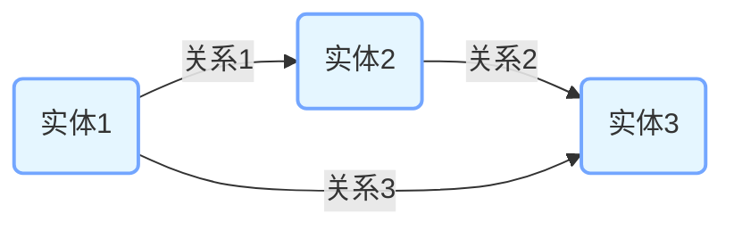

# 基于图谱的AI Agent知识推理引擎

> 关键词：知识图谱、AI Agent、知识推理引擎、图数据库、语义网络

> 摘要：本文聚焦于基于图谱的AI Agent知识推理引擎，旨在深入探讨其核心概念、算法原理、数学模型以及实际应用场景。通过详细的代码示例和项目实战，展示如何构建和应用这样的推理引擎。同时，对相关工具和资源进行推荐，分析未来发展趋势与挑战，为读者提供全面且深入的技术指引，助力其在该领域的学习和研究。

## 1. 背景介绍 
### 1.1 目的和范围
随着人工智能技术的飞速发展，AI Agent需要更加智能地处理和利用知识。基于图谱的知识推理引擎能够将结构化的知识图谱与AI Agent相结合，使Agent具备更强的知识理解和推理能力。本文的目的在于详细阐述基于图谱的AI Agent知识推理引擎的原理、实现方法以及应用场景，范围涵盖从核心概念的讲解到实际项目的开发，以及相关工具和资源的推荐。

### 1.2 预期读者
本文适合对人工智能、知识图谱、知识推理等领域感兴趣的研究人员、开发者以及相关专业的学生阅读。无论是想要深入了解技术原理，还是希望将其应用于实际项目的读者，都能从本文中获得有价值的信息。

### 1.3 文档结构概述
本文将按照以下结构进行阐述：首先介绍核心概念与联系，包括知识图谱、AI Agent和知识推理引擎的定义和相互关系；接着讲解核心算法原理和具体操作步骤，并用Python代码详细阐述；然后介绍数学模型和公式，并举例说明；之后通过项目实战展示代码的实际应用和详细解释；再探讨实际应用场景；推荐相关的工具和资源；最后总结未来发展趋势与挑战，并提供常见问题与解答以及扩展阅读和参考资料。

### 1.4 术语表
#### 1.4.1 核心术语定义
- **知识图谱（Knowledge Graph）**：一种以图的形式表示知识的结构化数据模型，由节点和边组成，节点表示实体，边表示实体之间的关系。
- **AI Agent**：能够感知环境、做出决策并采取行动的智能体，基于一定的规则或算法进行推理和交互。
- **知识推理引擎（Knowledge Reasoning Engine）**：利用知识图谱中的知识进行推理和推断的系统，能够从已知信息中推导出新的知识。
- **图数据库（Graph Database）**：专门用于存储和管理图数据的数据库，支持高效的图查询和遍历操作。
- **语义网络（Semantic Network）**：一种表示知识的网络结构，通过节点和边来表示概念和概念之间的语义关系。

#### 1.4.2 相关概念解释
- **实体（Entity）**：知识图谱中的节点，代表现实世界中的具体对象或抽象概念，如人、地点、事件等。
- **关系（Relation）**：知识图谱中连接实体的边，表示实体之间的某种联系，如“是...的父亲”、“位于”等。
- **三元组（Triple）**：知识图谱的基本组成单元，由主语（实体）、谓语（关系）和宾语（实体）组成，如（李白，是，诗人）。
- **推理规则（Reasoning Rule）**：用于指导知识推理引擎进行推理的规则，如基于逻辑关系的规则、基于语义的规则等。

#### 1.4.3 缩略词列表
- **KG**：Knowledge Graph（知识图谱）
- **AI**：Artificial Intelligence（人工智能）
- **RDF**：Resource Description Framework（资源描述框架）
- **OWL**：Web Ontology Language（网络本体语言）

## 2. 核心概念与联系 

### 知识图谱
知识图谱是一种语义网络，它将现实世界中的实体和实体之间的关系以图的形式表示出来。知识图谱的基本组成单元是三元组，通过大量的三元组可以构建出复杂的知识网络。例如，在一个人物关系的知识图谱中，“张三”和“李四”是实体，“是朋友”是关系，（张三，是朋友，李四）就是一个三元组。

知识图谱的架构可以用以下示意图表示：


### AI Agent
AI Agent是具有自主性、反应性、社会性和主动性的智能体。它能够感知环境中的信息，根据自身的目标和知识进行推理和决策，并采取相应的行动。AI Agent可以基于知识图谱进行推理，利用知识图谱中的知识来解决问题和完成任务。

### 知识推理引擎
知识推理引擎是基于知识图谱进行推理的核心组件。它根据给定的推理规则和知识图谱中的知识，推导出新的知识。推理引擎可以采用不同的推理算法，如基于规则的推理、基于机器学习的推理等。

### 三者之间的联系
知识图谱为AI Agent提供了丰富的知识资源，AI Agent通过知识推理引擎利用知识图谱中的知识进行推理和决策。知识推理引擎则是连接知识图谱和AI Agent的桥梁，它将知识图谱中的知识转化为AI Agent可以利用的信息。

## 3. 核心算法原理 & 具体操作步骤 

### 基于规则的推理算法原理
基于规则的推理算法是一种常见的知识推理算法，它通过定义一系列的推理规则，从已知的知识中推导出新的知识。例如，定义规则“如果A是B的父亲，B是C的父亲，那么A是C的祖父”，当知识图谱中存在（A，是父亲，B）和（B，是父亲，C）这两个三元组时，就可以根据规则推导出（A，是祖父，C）这个新的三元组。

以下是一个简单的基于规则的推理算法的Python实现：
```python
# 定义知识图谱
knowledge_graph = [
    ("A", "是父亲", "B"),
    ("B", "是父亲", "C")
]

# 定义推理规则
rules = [
    {
        "前提": [("?X", "是父亲", "?Y"), ("?Y", "是父亲", "?Z")],
        "结论": [("?X", "是祖父", "?Z")]
    }
]

# 推理函数
def reasoning(knowledge_graph, rules):
    new_triples = []
    for rule in rules:
        premises = rule["前提"]
        conclusion = rule["结论"]
        for triple1 in knowledge_graph:
            for triple2 in knowledge_graph:
                # 检查前提条件是否满足
                if all([
                    (triple1[0] if premise[0].startswith("?") else premise[0]) == triple1[0] and
                    (triple1[1] if premise[1].startswith("?") else premise[1]) == triple1[1] and
                    (triple2[0] if premise[2].startswith("?") else premise[2]) == triple2[0]
                    for premise in premises
                ]):
                    # 生成新的三元组
                    new_triple = (triple1[0], conclusion[0][1], triple2[2])
                    if new_triple not in knowledge_graph and new_triple not in new_triples:
                        new_triples.append(new_triple)
    return new_triples

# 进行推理
new_triples = reasoning(knowledge_graph, rules)
print("新推导出的三元组:", new_triples)
```

### 具体操作步骤
1. **定义知识图谱**：将已知的知识以三元组的形式存储在一个列表中。
2. **定义推理规则**：将推理规则以字典的形式存储，包含前提条件和结论。
3. **进行推理**：遍历知识图谱中的三元组，检查是否满足推理规则的前提条件，如果满足则生成新的三元组。
4. **更新知识图谱**：将新推导出的三元组添加到知识图谱中。

## 4. 数学模型和公式 & 详细讲解 & 举例说明 

### 逻辑推理的数学模型
在基于规则的推理中，可以使用一阶逻辑来表示推理规则和知识。一阶逻辑是一种形式化的逻辑系统，它允许使用变量、谓词和量词来表示命题。

例如，推理规则“如果A是B的父亲，B是C的父亲，那么A是C的祖父”可以用一阶逻辑表示为：
$$\forall x, y, z (Father(x, y) \land Father(y, z) \rightarrow Grandfather(x, z))$$
其中，$\forall$ 是全称量词，表示“对于所有的”；$Father(x, y)$ 表示 $x$ 是 $y$ 的父亲；$Grandfather(x, z)$ 表示 $x$ 是 $z$ 的祖父。

### 推理的数学公式
在基于规则的推理中，推理的过程可以看作是一个逻辑推导的过程。给定一组前提条件 $P_1, P_2, \cdots, P_n$ 和一个结论 $C$，推理的目标是判断是否可以从前提条件推导出结论。

如果推理规则可以表示为 $P_1 \land P_2 \land \cdots \land P_n \rightarrow C$，那么当 $P_1, P_2, \cdots, P_n$ 都为真时，$C$ 也为真。

### 举例说明
假设知识图谱中有以下三元组：
- （张三，是父亲，李四）
- （李四，是父亲，王五）

根据推理规则 $\forall x, y, z (Father(x, y) \land Father(y, z) \rightarrow Grandfather(x, z))$，可以进行如下推理：
- 令 $x$ 为张三，$y$ 为李四，$z$ 为王五。
- 前提条件 $Father(张三, 李四)$ 和 $Father(李四, 王五)$ 都为真。
- 根据推理规则，可以得出 $Grandfather(张三, 王五)$ 为真，即（张三，是祖父，王五）是一个新的三元组。

## 5. 项目实战：代码实际案例和详细解释说明 

### 5.1  开发环境搭建
- **Python环境**：建议使用Python 3.7及以上版本。
- **图数据库**：可以使用Neo4j作为图数据库，它支持高效的图查询和存储。
- **相关库**：安装`py2neo`库用于与Neo4j数据库进行交互，安装`rdflib`库用于处理RDF数据。

### 5.2  源代码详细实现和代码解读
以下是一个基于Neo4j和Python的知识推理项目的完整代码示例：
```python
from py2neo import Graph, Node, Relationship

# 连接到Neo4j数据库
graph = Graph("bolt://localhost:7687", auth=("neo4j", "password"))

# 定义知识图谱
def create_knowledge_graph():
    # 创建实体节点
    alice = Node("Person", name="Alice")
    bob = Node("Person", name="Bob")
    charlie = Node("Person", name="Charlie")

    # 创建关系
    alice_bob = Relationship(alice, "是父亲", bob)
    bob_charlie = Relationship(bob, "是父亲", charlie)

    # 将节点和关系添加到图数据库中
    graph.create(alice)
    graph.create(bob)
    graph.create(charlie)
    graph.create(alice_bob)
    graph.create(bob_charlie)

# 定义推理规则
def reasoning():
    query = """
    MATCH (x:Person)-[:是父亲]->(y:Person)-[:是父亲]->(z:Person)
    MERGE (x)-[:是祖父]->(z)
    """
    graph.run(query)

# 查询推理结果
def query_result():
    query = "MATCH (x:Person)-[:是祖父]->(z:Person) RETURN x.name, z.name"
    results = graph.run(query)
    for record in results:
        print(f"{record['x.name']} 是 {record['z.name']} 的祖父")

if __name__ == "__main__":
    # 创建知识图谱
    create_knowledge_graph()

    # 进行推理
    reasoning()

    # 查询推理结果
    query_result()
```

### 代码解读与分析
1. **连接到Neo4j数据库**：使用`py2neo`库的`Graph`类连接到Neo4j数据库。
2. **创建知识图谱**：定义`create_knowledge_graph`函数，创建实体节点和关系，并将它们添加到图数据库中。
3. **定义推理规则**：定义`reasoning`函数，使用Cypher查询语言编写推理规则。该规则匹配所有满足“x是y的父亲，y是z的父亲”的节点对，并创建“x是z的祖父”的关系。
4. **查询推理结果**：定义`query_result`函数，使用Cypher查询语言查询推理结果，并打印输出。
5. **主程序**：在主程序中，依次调用`create_knowledge_graph`、`reasoning`和`query_result`函数，完成知识图谱的创建、推理和结果查询。

## 6. 实际应用场景 
### 智能问答系统
在智能问答系统中，基于图谱的AI Agent知识推理引擎可以利用知识图谱中的知识进行推理，回答用户的问题。例如，当用户询问“张三的祖父是谁”时，推理引擎可以根据知识图谱中的人物关系进行推理，找出张三的祖父。

### 推荐系统
在推荐系统中，推理引擎可以根据用户的历史行为和知识图谱中的知识，为用户推荐相关的产品或服务。例如，根据用户的购买历史和产品之间的关联关系，推荐用户可能感兴趣的其他产品。

### 医疗诊断系统
在医疗诊断系统中，推理引擎可以利用医学知识图谱中的知识，结合患者的症状和检查结果，进行疾病的诊断和治疗建议。例如，根据患者的症状和疾病之间的关联关系，推理出可能的疾病，并提供相应的治疗方案。

### 金融风险评估
在金融风险评估中，推理引擎可以根据金融知识图谱中的知识，分析企业的财务状况、市场环境等因素，评估企业的信用风险和市场风险。例如，根据企业的财务报表和行业数据，推理出企业的信用等级和违约概率。

## 7. 工具和资源推荐
### 7.1 学习资源推荐
#### 7.1.1 书籍推荐
- 《知识图谱：方法、实践与应用》：全面介绍了知识图谱的理论、方法和应用，是学习知识图谱的经典书籍。
- 《人工智能：一种现代的方法》：涵盖了人工智能的各个领域，包括知识表示、推理和学习等，是人工智能领域的权威教材。
- 《Python数据分析实战》：介绍了Python在数据分析和处理方面的应用，对于处理知识图谱数据和实现推理算法有很大的帮助。

#### 7.1.2 在线课程
- Coursera上的“Knowledge Graphs”课程：由知名高校的教授授课，系统地介绍了知识图谱的基本概念、构建方法和应用场景。
- edX上的“Artificial Intelligence”课程：提供了人工智能的全面学习资源，包括知识推理、机器学习等方面的内容。
- 慕课网上的“Python实战之知识图谱构建与应用”课程：通过实际项目案例，讲解了如何使用Python构建知识图谱和实现知识推理。

#### 7.1.3 技术博客和网站
- 语义网研究组（W3C Semantic Web Activity）：提供了关于语义网和知识图谱的最新研究成果和技术标准。
- 知识图谱社区（Knowledge Graph Community）：一个专门讨论知识图谱技术和应用的社区，有很多专家和开发者分享经验和见解。
- 博客园（Cnblogs）和CSDN：国内知名的技术博客平台，有很多关于知识图谱和人工智能的技术文章。

### 7.2 开发工具框架推荐
#### 7.2.1 IDE和编辑器
- PyCharm：一款功能强大的Python集成开发环境，支持代码调试、自动补全、版本控制等功能，适合开发基于Python的知识推理项目。
- Visual Studio Code：一款轻量级的代码编辑器，支持多种编程语言和插件扩展，对于快速开发和调试代码非常方便。
- Jupyter Notebook：一种交互式的编程环境，适合进行数据探索、模型训练和代码演示，在知识图谱和机器学习领域广泛应用。

#### 7.2.2 调试和性能分析工具
- Neo4j Browser：Neo4j数据库自带的可视化查询工具，支持Cypher查询语言，可以方便地查看和调试图数据库中的数据。
- Profiler：Python的性能分析工具，可以帮助开发者找出代码中的性能瓶颈，优化代码性能。
- TensorBoard：TensorFlow的可视化工具，用于监控和分析深度学习模型的训练过程和性能。

#### 7.2.3 相关框架和库
- RDFlib：一个用于处理RDF数据的Python库，支持RDF数据的解析、序列化和查询等操作。
- OWLReady2：一个用于处理OWL本体的Python库，支持本体的加载、推理和修改等操作。
- PyKE：一个基于Python的规则引擎，支持基于规则的推理和知识管理。

### 7.3 相关论文著作推荐
#### 7.3.1 经典论文
- “Large-scale Knowledge Graph Embedding with Iterative Guidance from Soft Rules”：提出了一种基于软规则的大规模知识图谱嵌入方法，提高了知识图谱的推理能力。
- “TransE: Translating Embeddings for Modeling Multi-relational Data”：介绍了一种经典的知识图谱嵌入模型TransE，为后续的知识图谱表示学习研究奠定了基础。
- “Knowledge Graph Completion via Complex Tensor Factorization”：提出了一种基于复张量分解的知识图谱补全方法，取得了较好的实验效果。

#### 7.3.2 最新研究成果
- 在顶级学术会议如AAAI、IJCAI、KDD等上发表的关于知识图谱和知识推理的最新研究论文，反映了该领域的最新技术和发展趋势。
- 知名学术期刊如Journal of Artificial Intelligence Research（JAIR）、Artificial Intelligence等上发表的相关研究成果。

#### 7.3.3 应用案例分析
- 一些大型科技公司如Google、Microsoft等发表的关于知识图谱在搜索引擎、智能助手等领域的应用案例分析，为实际应用提供了参考和借鉴。
- 医疗、金融等行业的企业发表的关于知识图谱在行业应用中的案例研究，展示了知识图谱在不同领域的应用价值。

## 8. 总结：未来发展趋势与挑战
### 未来发展趋势
- **多模态知识图谱**：将文本、图像、音频等多模态数据融合到知识图谱中，构建更加丰富和全面的知识表示，提高知识推理的准确性和智能性。
- **深度学习与知识推理的融合**：将深度学习技术应用到知识推理中，如使用神经网络进行知识图谱嵌入和推理，提高推理的效率和性能。
- **知识图谱的自动化构建**：研究更加高效的知识图谱自动化构建方法，减少人工标注的工作量，提高知识图谱的构建速度和质量。
- **知识推理在边缘计算和物联网中的应用**：将知识推理引擎部署到边缘设备和物联网节点上，实现实时的知识推理和决策，提高系统的智能化水平。

### 挑战
- **知识图谱的质量和完整性**：知识图谱的质量和完整性直接影响知识推理的准确性和可靠性，如何保证知识图谱的质量和完整性是一个重要的挑战。
- **推理算法的效率和可扩展性**：随着知识图谱规模的不断增大，推理算法的效率和可扩展性成为一个关键问题，需要研究更加高效的推理算法。
- **多源异构数据的融合**：在实际应用中，知识图谱的数据来源往往是多源异构的，如何有效地融合这些数据是一个具有挑战性的问题。
- **隐私和安全问题**：知识图谱中包含大量的敏感信息，如何保证这些信息的隐私和安全是一个需要解决的问题。

## 9. 附录：常见问题与解答
### 问题1：知识图谱和传统数据库有什么区别？
解答：知识图谱是一种以图的形式表示知识的结构化数据模型，强调实体之间的关系和语义信息；而传统数据库主要以表格的形式存储数据，侧重于数据的存储和查询。知识图谱可以更自然地表示复杂的知识和关系，支持语义推理和知识发现。

### 问题2：如何选择合适的推理算法？
解答：选择合适的推理算法需要考虑多个因素，如知识图谱的规模、推理的复杂度、应用场景等。如果知识图谱规模较小，推理规则较为简单，可以选择基于规则的推理算法；如果知识图谱规模较大，需要处理复杂的语义信息，可以考虑使用基于机器学习的推理算法。

### 问题3：知识图谱的构建过程中需要注意哪些问题？
解答：在知识图谱的构建过程中，需要注意以下问题：数据的质量和准确性，确保数据的来源可靠；实体和关系的定义要清晰和一致，避免歧义；知识图谱的更新和维护要及时，保证知识的时效性。

### 问题4：如何评估知识推理引擎的性能？
解答：可以从以下几个方面评估知识推理引擎的性能：推理的准确性，即推理结果的正确性；推理的效率，即推理所需的时间和资源；推理的可扩展性，即推理引擎在处理大规模知识图谱时的性能表现。

## 10. 扩展阅读 & 参考资料
### 扩展阅读
- 《图神经网络：基础、前沿与应用》：介绍了图神经网络的基本原理和应用，对于理解知识图谱的表示学习和推理有很大的帮助。
- 《大数据与人工智能》：探讨了大数据和人工智能的结合应用，包括知识图谱在大数据处理中的作用。
- 《人工智能时代的知识工程》：从知识工程的角度介绍了人工智能的发展和应用，包括知识图谱的构建和推理。

### 参考资料
- W3C Semantic Web Activity：https://www.w3.org/2001/sw/
- Neo4j官方文档：https://neo4j.com/docs/
- RDFlib官方文档：https://rdflib.readthedocs.io/
- OWLReady2官方文档：https://owlready2.readthedocs.io/

作者：AI天才研究院/AI Genius Institute & 禅与计算机程序设计艺术 /Zen And The Art of Computer Programming