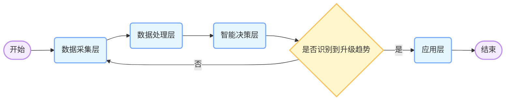

# 基于多智能体的自动化产业升级趋势识别

> 关键词：多智能体系统、自动化产业、升级趋势识别、人工智能、产业分析

> 摘要：本文聚焦于基于多智能体的自动化产业升级趋势识别这一前沿话题。首先介绍了研究的背景、目的、预期读者和文档结构等内容。详细阐述了多智能体系统、自动化产业升级等核心概念及其联系，给出了相关原理和架构的文本示意图与 Mermaid 流程图。深入探讨了用于趋势识别的核心算法原理，并使用 Python 源代码进行详细阐述，同时给出了对应的数学模型和公式，并举例说明。通过项目实战，展示了代码的实际案例及详细解释。分析了该技术在实际中的应用场景，推荐了学习资源、开发工具框架以及相关论文著作。最后总结了未来发展趋势与挑战，还提供了常见问题解答和扩展阅读参考资料，旨在为相关领域的研究者和从业者提供全面且深入的技术指导。

## 1. 背景介绍 
### 1.1 目的和范围
随着科技的飞速发展，自动化产业正经历着前所未有的变革。多智能体系统作为一种新兴的技术手段，为自动化产业升级趋势的识别提供了新的思路和方法。本研究的目的在于探索如何利用多智能体系统来准确、高效地识别自动化产业的升级趋势，为产业发展提供科学的决策依据。

研究范围涵盖了多智能体系统的基本原理、自动化产业的特点和发展趋势、用于趋势识别的算法和模型，以及实际应用案例等方面。通过对这些内容的深入研究，旨在构建一个完整的基于多智能体的自动化产业升级趋势识别体系。

### 1.2 预期读者
本文的预期读者主要包括自动化产业的从业者、人工智能领域的研究者、技术管理人员以及对产业升级趋势分析感兴趣的人员。对于自动化产业从业者来说，本文可以帮助他们更好地了解产业的发展方向，为企业的战略决策提供参考；对于人工智能研究者而言，文中关于多智能体系统在产业分析中的应用可以为其研究提供新的思路和方向；技术管理人员可以从本文中获取相关的技术和管理经验，提升企业的技术水平和竞争力；而对产业升级趋势分析感兴趣的人员则可以通过本文了解到该领域的最新研究成果和发展动态。

### 1.3 文档结构概述
本文将按照以下结构进行组织：首先介绍背景信息，包括研究目的、预期读者和文档结构等内容；接着阐述多智能体系统和自动化产业升级的核心概念及其联系，给出原理和架构的文本示意图与 Mermaid 流程图；然后详细讲解用于趋势识别的核心算法原理，使用 Python 源代码进行说明，并给出相应的数学模型和公式；通过项目实战展示代码的实际应用和详细解释；分析该技术在实际中的应用场景；推荐相关的学习资源、开发工具框架和论文著作；最后总结未来发展趋势与挑战，提供常见问题解答和扩展阅读参考资料。

### 1.4 术语表
#### 1.4.1 核心术语定义
- **多智能体系统（Multi - Agent System，MAS）**：由多个智能体组成的系统，这些智能体能够感知环境、自主决策并与其他智能体进行交互，以实现共同的或各自的目标。
- **自动化产业**：利用先进的技术和设备，实现生产、管理等过程自动化的产业领域，包括工业自动化、农业自动化、物流自动化等多个方面。
- **产业升级趋势识别**：通过对产业相关数据的分析和处理，确定产业在技术、市场、管理等方面的发展趋势，以便为产业发展提供决策支持。

#### 1.4.2 相关概念解释
- **智能体（Agent）**：具有自主性、反应性、社会性和主动性等特性的实体，能够在一定的环境中独立地完成特定的任务。
- **自动化**：指机器设备、系统或过程（生产、管理过程）在没有人或较少人的直接参与下，按照人的要求，经过自动检测、信息处理、分析判断、操纵控制，实现预期的目标的过程。

#### 1.4.3 缩略词列表
- MAS：Multi - Agent System（多智能体系统）

## 2. 核心概念与联系 
### 核心概念原理
#### 多智能体系统原理
多智能体系统的核心在于多个智能体之间的交互与协作。每个智能体都有自己的感知能力，能够获取周围环境的信息。例如，在一个自动化生产车间中，智能体可以是各种传感器、机器人等设备，它们能够感知温度、湿度、设备运行状态等信息。

智能体还具有决策能力，根据感知到的信息和自身的目标，做出相应的决策。例如，当温度超过设定的阈值时，智能体可以决定启动降温设备。多个智能体之间通过通信机制进行信息交换和协作，以实现整个系统的目标。例如，不同的机器人智能体可以根据生产任务的需求，相互配合完成产品的组装工作。

#### 自动化产业升级原理
自动化产业升级是一个不断优化和改进的过程，主要包括技术升级、管理升级和市场升级等方面。技术升级是指采用更先进的自动化技术和设备，提高生产效率和产品质量。例如，从传统的自动化生产线升级为智能化生产线，引入人工智能、大数据等技术。

管理升级是指优化企业的管理模式和流程，提高管理效率和决策的科学性。例如，采用数字化管理系统，实现生产过程的实时监控和调度。市场升级是指开拓新的市场领域，提高产品的市场竞争力。例如，将产品从国内市场拓展到国际市场，满足不同客户的需求。

### 架构的文本示意图
一个基于多智能体的自动化产业升级趋势识别系统可以分为以下几个层次：
- **数据采集层**：由各种智能体组成，如传感器、数据采集设备等，负责收集自动化产业相关的数据，包括生产数据、市场数据、技术数据等。
- **数据处理层**：对采集到的数据进行清洗、预处理和特征提取等操作，以便后续的分析和处理。
- **智能决策层**：利用多智能体系统的决策机制，对处理后的数据进行分析和判断，识别自动化产业的升级趋势。
- **应用层**：将识别结果应用于实际的产业决策中，如企业的战略规划、产品研发等。

### Mermaid 流程图


## 3. 核心算法原理 & 具体操作步骤 
### 核心算法原理
在基于多智能体的自动化产业升级趋势识别中，我们可以采用机器学习中的聚类算法和时间序列分析算法。

#### 聚类算法原理
聚类算法的目的是将相似的数据点归为一类。在自动化产业升级趋势识别中，我们可以将不同的企业或产业数据进行聚类，找出具有相似发展趋势的群体。例如，使用 K - Means 聚类算法，它的基本思想是通过迭代的方式，将数据点划分为 K 个簇，使得每个簇内的数据点之间的距离最小，而不同簇之间的数据点距离最大。

#### 时间序列分析算法原理
时间序列分析算法用于分析随时间变化的数据序列。在自动化产业中，很多数据都是按时间顺序记录的，如生产产量、市场销售额等。通过时间序列分析，我们可以预测这些数据的未来发展趋势。例如，使用 ARIMA（Autoregressive Integrated Moving Average）模型，它结合了自回归、差分和移动平均的思想，能够对具有季节性和趋势性的时间序列数据进行有效的建模和预测。

### 具体操作步骤
#### 数据准备
首先，收集自动化产业的相关数据，包括企业的财务数据、生产数据、市场数据等。对收集到的数据进行清洗，去除缺失值和异常值。

#### 特征提取
从清洗后的数据中提取有用的特征，如企业的增长率、利润率、市场份额等。这些特征将作为聚类和时间序列分析的输入。

#### 聚类分析
使用 K - Means 聚类算法对提取的特征进行聚类。具体步骤如下：
1. 随机选择 K 个初始聚类中心。
2. 计算每个数据点到各个聚类中心的距离，将数据点分配到距离最近的聚类中心所在的簇。
3. 重新计算每个簇的聚类中心。
4. 重复步骤 2 和 3，直到聚类中心不再发生变化或达到最大迭代次数。

#### 时间序列分析
对于每个聚类中的数据，使用 ARIMA 模型进行时间序列分析。具体步骤如下：
1. 对时间序列数据进行差分处理，使其变得平稳。
2. 确定 ARIMA 模型的参数（p, d, q），其中 p 是自回归阶数，d 是差分阶数，q 是移动平均阶数。
3. 使用确定的参数对平稳的时间序列数据进行建模和预测。

### Python 源代码实现
```python
import numpy as np
import pandas as pd
from sklearn.cluster import KMeans
from statsmodels.tsa.arima.model import ARIMA

# 数据准备
data = pd.read_csv('automation_industry_data.csv')
# 假设数据集中有缺失值，进行简单的填充
data = data.fillna(method='ffill')

# 特征提取
features = data[['growth_rate', 'profit_margin', 'market_share']]

# 聚类分析
kmeans = KMeans(n_clusters=3)
kmeans.fit(features)
labels = kmeans.labels_

# 时间序列分析
# 假设我们对每个聚类中的第一个企业的生产产量进行时间序列分析
for cluster in range(3):
    cluster_data = data[labels == cluster]
    time_series = cluster_data['production_volume']
    
    # 差分处理
    diff_series = time_series.diff().dropna()
    
    # 确定 ARIMA 模型参数
    model = ARIMA(diff_series, order=(1, 1, 1))
    model_fit = model.fit()
    
    # 预测未来 5 期的值
    forecast = model_fit.get_forecast(steps=5)
    print(f"Cluster {cluster} forecast: {forecast.predicted_mean}")
```

## 4. 数学模型和公式 & 详细讲解 & 举例说明 
### K - Means 聚类算法数学模型和公式
#### 数学模型
K - Means 聚类算法的目标是最小化所有数据点到其所属聚类中心的距离之和，其数学模型可以表示为：
$$\min_{C_1,C_2,\cdots,C_K}\sum_{i = 1}^{K}\sum_{x_j\in C_i}d(x_j,\mu_i)$$
其中，$C_1,C_2,\cdots,C_K$ 表示 K 个聚类，$x_j$ 表示第 j 个数据点，$\mu_i$ 表示第 i 个聚类的中心，$d(x_j,\mu_i)$ 表示数据点 $x_j$ 到聚类中心 $\mu_i$ 的距离，通常使用欧几里得距离：
$$d(x_j,\mu_i)=\sqrt{\sum_{k = 1}^{n}(x_{jk}-\mu_{ik})^2}$$
其中，$n$ 表示数据点的维度，$x_{jk}$ 表示数据点 $x_j$ 的第 k 个特征值，$\mu_{ik}$ 表示聚类中心 $\mu_i$ 的第 k 个特征值。

#### 详细讲解
K - Means 聚类算法通过迭代的方式不断更新聚类中心，直到满足停止条件。具体步骤如下：
1. 初始化：随机选择 K 个数据点作为初始聚类中心。
2. 分配数据点：对于每个数据点 $x_j$，计算它到 K 个聚类中心的距离，将其分配到距离最近的聚类中心所在的聚类。
3. 更新聚类中心：对于每个聚类，计算该聚类中所有数据点的均值，将其作为新的聚类中心。
4. 重复步骤 2 和 3，直到聚类中心不再发生变化或达到最大迭代次数。

#### 举例说明
假设我们有以下 5 个二维数据点：$x_1=(1, 2)$，$x_2=(2, 3)$，$x_3=(8, 9)$，$x_4=(9, 10)$，$x_5=(10, 11)$，我们要将它们分为 2 个聚类。

1. 初始化：随机选择 $x_1=(1, 2)$ 和 $x_3=(8, 9)$ 作为初始聚类中心 $\mu_1$ 和 $\mu_2$。
2. 分配数据点：
    - 计算 $x_2$ 到 $\mu_1$ 和 $\mu_2$ 的距离：
      - $d(x_2,\mu_1)=\sqrt{(2 - 1)^2+(3 - 2)^2}=\sqrt{2}$
      - $d(x_2,\mu_2)=\sqrt{(2 - 8)^2+(3 - 9)^2}=\sqrt{36 + 36}=\sqrt{72}$
      因为 $d(x_2,\mu_1)<d(x_2,\mu_2)$，所以 $x_2$ 属于 $\mu_1$ 所在的聚类。
    - 同理，计算 $x_4$ 和 $x_5$ 到 $\mu_1$ 和 $\mu_2$ 的距离，将它们分配到 $\mu_2$ 所在的聚类。
3. 更新聚类中心：
    - 对于 $\mu_1$ 所在的聚类 $\{x_1,x_2\}$，新的聚类中心为 $\mu_1'=(\frac{1 + 2}{2},\frac{2 + 3}{2})=(1.5, 2.5)$。
    - 对于 $\mu_2$ 所在的聚类 $\{x_3,x_4,x_5\}$，新的聚类中心为 $\mu_2'=(\frac{8 + 9 + 10}{3},\frac{9 + 10 + 11}{3})=(9, 10)$。
4. 重复步骤 2 和 3，直到聚类中心不再发生变化。

### ARIMA 模型数学模型和公式
#### 数学模型
ARIMA 模型的一般形式可以表示为：
$$\phi(B)(1 - B)^dX_t=\theta(B)\epsilon_t$$
其中，$X_t$ 表示时间序列数据，$B$ 是滞后算子，$(1 - B)^d$ 表示差分操作，$d$ 是差分阶数，$\phi(B)=1-\phi_1B-\cdots-\phi_pB^p$ 是自回归多项式，$\theta(B)=1+\theta_1B+\cdots+\theta_qB^q$ 是移动平均多项式，$\epsilon_t$ 是白噪声序列。

#### 详细讲解
ARIMA 模型结合了自回归（AR）、差分（I）和移动平均（MA）的思想。自回归部分表示当前值与过去值之间的线性关系，差分部分用于消除时间序列的非平稳性，移动平均部分表示当前值与过去白噪声之间的线性关系。

具体步骤如下：
1. 差分处理：对原始时间序列数据进行差分操作，使其变得平稳。差分阶数 $d$ 可以通过观察时间序列的自相关函数（ACF）和偏自相关函数（PACF）来确定。
2. 确定自回归阶数 $p$ 和移动平均阶数 $q$：同样可以通过观察 ACF 和 PACF 来确定。
3. 估计模型参数：使用最大似然估计等方法估计自回归系数 $\phi_1,\cdots,\phi_p$ 和移动平均系数 $\theta_1,\cdots,\theta_q$。
4. 进行预测：根据估计的模型参数对未来的时间序列值进行预测。

#### 举例说明
假设我们有一个简单的时间序列数据 $X_t=\{1, 2, 3, 4, 5\}$，我们要使用 ARIMA(1, 1, 1) 模型进行预测。

1. 差分处理：
    - 一阶差分后得到 $\Delta X_t=X_t - X_{t - 1}=\{1, 1, 1, 1\}$。
2. 确定模型参数：
    - 对于 ARIMA(1, 1, 1) 模型，$p = 1$，$d = 1$，$q = 1$。假设估计得到的自回归系数 $\phi_1 = 0.5$，移动平均系数 $\theta_1 = 0.3$。
3. 预测：
    - 假设当前时间为 $t = 5$，我们要预测 $t = 6$ 的值。根据 ARIMA 模型的公式，我们可以得到预测值。

## 5. 项目实战：代码实际案例和详细解释说明 
### 5.1  开发环境搭建
#### 安装 Python
首先，需要安装 Python 环境。可以从 Python 官方网站（https://www.python.org/downloads/）下载适合自己操作系统的 Python 安装包，按照安装向导进行安装。

#### 安装必要的库
在安装好 Python 后，需要安装一些必要的库，如 `numpy`、`pandas`、`scikit - learn`、`statsmodels` 等。可以使用 `pip` 命令进行安装：
```sh
pip install numpy pandas scikit - learn statsmodels
```

### 5.2  源代码详细实现和代码解读
```python
import numpy as np
import pandas as pd
from sklearn.cluster import KMeans
from statsmodels.tsa.arima.model import ARIMA

# 数据准备
data = pd.read_csv('automation_industry_data.csv')
# 假设数据集中有缺失值，进行简单的填充
data = data.fillna(method='ffill')

# 特征提取
features = data[['growth_rate', 'profit_margin', 'market_share']]

# 聚类分析
kmeans = KMeans(n_clusters=3)
kmeans.fit(features)
labels = kmeans.labels_

# 时间序列分析
# 假设我们对每个聚类中的第一个企业的生产产量进行时间序列分析
for cluster in range(3):
    cluster_data = data[labels == cluster]
    time_series = cluster_data['production_volume']
    
    # 差分处理
    diff_series = time_series.diff().dropna()
    
    # 确定 ARIMA 模型参数
    model = ARIMA(diff_series, order=(1, 1, 1))
    model_fit = model.fit()
    
    # 预测未来 5 期的值
    forecast = model_fit.get_forecast(steps=5)
    print(f"Cluster {cluster} forecast: {forecast.predicted_mean}")
```

#### 代码解读
1. **数据准备**：
    - 使用 `pandas` 的 `read_csv` 函数读取自动化产业的相关数据文件 `automation_industry_data.csv`。
    - 使用 `fillna` 函数对数据中的缺失值进行简单的前向填充。
2. **特征提取**：
    - 从数据中提取 `growth_rate`（增长率）、`profit_margin`（利润率）和 `market_share`（市场份额）作为特征。
3. **聚类分析**：
    - 创建一个 `KMeans` 对象，设置聚类数为 3。
    - 使用 `fit` 方法对特征数据进行聚类训练。
    - 使用 `labels_` 属性获取每个数据点所属的聚类标签。
4. **时间序列分析**：
    - 对于每个聚类，筛选出属于该聚类的数据。
    - 提取每个聚类中第一个企业的 `production_volume`（生产产量）作为时间序列数据。
    - 对时间序列数据进行差分处理，去除非平稳性。
    - 创建一个 `ARIMA` 模型，设置参数为 (1, 1, 1)。
    - 使用 `fit` 方法对模型进行训练。
    - 使用 `get_forecast` 方法预测未来 5 期的值，并打印输出。

### 5.3  代码解读与分析
#### 优点
- 代码结构清晰，将数据准备、特征提取、聚类分析和时间序列分析等步骤分开，易于理解和维护。
- 使用了常见的 Python 库，如 `pandas`、`scikit - learn` 和 `statsmodels`，这些库具有丰富的功能和良好的文档支持。
- 对缺失值进行了简单的处理，保证了数据的完整性。

#### 不足之处
- 对于聚类数的选择，只是简单地设置为 3，没有进行优化。可以使用肘部法则等方法来确定最优的聚类数。
- ARIMA 模型的参数 (1, 1, 1) 是手动设置的，没有进行自动调参。可以使用网格搜索等方法来确定最优的模型参数。
- 代码只对每个聚类中的第一个企业的生产产量进行了时间序列分析，没有考虑其他企业的数据。可以扩展代码，对每个聚类中的所有企业的数据进行分析。

## 6. 实际应用场景 
### 企业战略规划
企业可以利用基于多智能体的自动化产业升级趋势识别技术，了解行业的发展趋势，制定合理的战略规划。例如，通过识别产业升级趋势，企业可以确定是否要加大在新技术研发、市场拓展等方面的投入，以提高企业的竞争力。

### 政府政策制定
政府部门可以根据产业升级趋势识别结果，制定相关的产业政策。例如，如果识别出某个自动化产业领域具有较大的发展潜力，政府可以出台扶持政策，鼓励企业加大投入，促进该领域的发展。

### 投资决策
投资者可以利用该技术评估自动化产业中不同企业的发展前景，做出合理的投资决策。例如，通过分析企业的聚类结果和时间序列预测，投资者可以选择具有较好发展趋势的企业进行投资。

### 供应链管理
在供应链管理中，基于多智能体的自动化产业升级趋势识别可以帮助企业预测原材料需求和产品销售趋势，优化供应链的配置。例如，根据生产产量的时间序列预测，企业可以合理安排原材料的采购计划，避免库存积压或缺货现象的发生。

## 7. 工具和资源推荐
### 7.1 学习资源推荐
#### 7.1.1 书籍推荐
- 《多智能体系统导论》：本书全面介绍了多智能体系统的基本概念、理论和方法，包括智能体的建模、交互协议、协作机制等内容，是学习多智能体系统的经典教材。
- 《时间序列分析：预测与控制》：详细讲解了时间序列分析的理论和方法，包括 ARIMA 模型、季节性模型等，适合对时间序列分析感兴趣的读者。
- 《机器学习》：由周志华教授编写，系统地介绍了机器学习的基本概念、算法和应用，是机器学习领域的优秀教材。

#### 7.1.2 在线课程
- Coursera 上的 “机器学习” 课程：由斯坦福大学的 Andrew Ng 教授讲授，课程内容丰富，讲解深入浅出，是学习机器学习的经典在线课程。
- edX 上的 “多智能体系统” 课程：提供了多智能体系统的深入学习内容，包括理论知识和实践案例。
- 中国大学 MOOC 上的 “时间序列分析” 课程：由国内知名高校的教师授课，结合实际案例讲解时间序列分析的方法和应用。

#### 7.1.3 技术博客和网站
- Medium：上面有很多关于人工智能、机器学习和多智能体系统的技术文章，作者来自世界各地的技术专家和研究者。
- Towards Data Science：专注于数据科学和机器学习领域的技术博客，提供了丰富的实践经验和案例分析。
- 开源中国：国内知名的开源技术社区，有很多关于自动化产业和人工智能的技术文章和讨论。

### 7.2 开发工具框架推荐
#### 7.2.1 IDE和编辑器
- PyCharm：一款专门为 Python 开发设计的集成开发环境，具有代码自动补全、调试、版本控制等功能，适合开发 Python 项目。
- Jupyter Notebook：一个交互式的开发环境，支持 Python、R 等多种编程语言，适合进行数据探索和模型开发。
- Visual Studio Code：一款轻量级的代码编辑器，支持多种编程语言，具有丰富的插件扩展功能，可以满足不同的开发需求。

#### 7.2.2 调试和性能分析工具
- PDB：Python 自带的调试器，可以帮助开发者定位代码中的问题。
- cProfile：Python 标准库中的性能分析工具，可以分析代码的运行时间和函数调用情况。
- Py-Spy：一个用于分析 Python 程序性能的工具，可以实时监控程序的 CPU 使用率和函数调用情况。

#### 7.2.3 相关框架和库
- scikit - learn：一个用于机器学习的 Python 库，提供了丰富的机器学习算法和工具，如聚类算法、分类算法等。
- statsmodels：一个用于统计建模和时间序列分析的 Python 库，支持 ARIMA 模型、线性回归等多种统计模型。
- Mesa：一个用于构建多智能体系统的 Python 框架，提供了智能体建模、交互和可视化等功能。

### 7.3 相关论文著作推荐
#### 7.3.1 经典论文
- “Multi - Agent Systems: A Modern Approach to Distributed Artificial Intelligence”：该论文系统地介绍了多智能体系统的基本概念、理论和方法，是多智能体系统领域的经典论文。
- “Autoregressive Integrated Moving Average Models for Time Series Forecasting”：详细阐述了 ARIMA 模型的原理和应用，是时间序列分析领域的重要论文。
- “Clustering Algorithms for Data Mining”：对各种聚类算法进行了全面的介绍和比较，为聚类分析提供了理论基础。

#### 7.3.2 最新研究成果
- 可以关注国际顶级学术会议，如 AAAI（Association for the Advancement of Artificial Intelligence）、IJCAI（International Joint Conference on Artificial Intelligence）等，这些会议上会发布多智能体系统和自动化产业相关的最新研究成果。
- 查阅顶级学术期刊，如 Artificial Intelligence、Journal of Artificial Intelligence Research 等，获取最新的研究论文。

#### 7.3.3 应用案例分析
- 可以参考一些行业报告和案例分析文章，了解基于多智能体的自动化产业升级趋势识别技术在实际中的应用案例。例如，一些咨询公司会发布关于自动化产业发展的报告，其中包含了相关的应用案例和分析。

## 8. 总结：未来发展趋势与挑战
### 未来发展趋势
#### 智能化程度不断提高
随着人工智能技术的不断发展，多智能体系统将更加智能化。智能体将具备更强的学习能力和推理能力，能够更好地适应复杂多变的环境，提高自动化产业升级趋势识别的准确性和效率。

#### 与其他技术的融合
多智能体系统将与物联网、大数据、区块链等技术深度融合。例如，通过物联网技术可以获取更丰富的产业数据，为趋势识别提供更准确的依据；大数据技术可以对海量的数据进行处理和分析，挖掘出更多有价值的信息；区块链技术可以保证数据的安全性和可信度。

#### 应用领域不断拓展
基于多智能体的自动化产业升级趋势识别技术将不仅仅应用于工业自动化领域，还将拓展到农业、物流、医疗等多个领域。例如，在农业领域，可以通过识别农业自动化产业的升级趋势，优化农业生产流程，提高农产品的产量和质量。

### 挑战
#### 数据质量问题
数据质量是影响趋势识别准确性的关键因素之一。在实际应用中，可能会遇到数据缺失、数据错误、数据不一致等问题，需要对数据进行有效的清洗和预处理。

#### 算法复杂度问题
随着多智能体系统和机器学习算法的不断发展，算法的复杂度也在不断增加。这可能会导致计算资源的消耗过大，影响系统的运行效率。需要研究更加高效的算法和优化策略。

#### 安全和隐私问题
在多智能体系统中，智能体之间需要进行大量的信息交互，这可能会涉及到安全和隐私问题。例如，数据的泄露可能会导致企业的商业机密被泄露，需要采取有效的安全措施来保障数据的安全和隐私。

## 9. 附录：常见问题与解答
### 如何确定最优的聚类数？
可以使用肘部法则来确定最优的聚类数。肘部法则的基本思想是，随着聚类数的增加，每个数据点到其所属聚类中心的距离之和会逐渐减小。当聚类数达到一定值时，距离之和的减小速度会变得很慢，此时对应的聚类数就是最优的聚类数。可以通过绘制距离之和随聚类数变化的曲线，找到曲线的 “肘部” 点来确定最优聚类数。

### ARIMA 模型的参数如何确定？
可以通过观察时间序列的自相关函数（ACF）和偏自相关函数（PACF）来初步确定 ARIMA 模型的参数。一般来说，自相关函数的拖尾阶数可以作为移动平均阶数 $q$ 的参考，偏自相关函数的拖尾阶数可以作为自回归阶数 $p$ 的参考。差分阶数 $d$ 可以通过观察时间序列的平稳性来确定。也可以使用网格搜索等方法来自动调参，找到最优的模型参数。

### 多智能体系统中的智能体如何进行通信？
多智能体系统中的智能体可以通过多种方式进行通信，如消息传递、共享内存等。消息传递是最常见的通信方式，智能体可以通过发送和接收消息来交换信息。在 Python 中，可以使用一些库来实现智能体之间的消息传递，如 `zmq` 库。

## 10. 扩展阅读 & 参考资料
### 扩展阅读
- 《人工智能：一种现代的方法》：全面介绍了人工智能的基本概念、理论和方法，包括搜索算法、知识表示、机器学习等内容，适合对人工智能领域感兴趣的读者进一步深入学习。
- 《复杂网络》：探讨了复杂网络的结构、动力学和应用，对于理解多智能体系统中的智能体之间的交互关系有一定的帮助。

### 参考资料
- 周志华. 机器学习. 清华大学出版社, 2016.
- （美）Stuart Russell, Peter Norvig. 人工智能：一种现代的方法（第 3 版）. 人民邮电出版社, 2012.
- Box, G. E. P., Jenkins, G. M., & Reinsel, G. C. (2015). Time series analysis: forecasting and control. John Wiley & Sons.

作者：AI天才研究院/AI Genius Institute & 禅与计算机程序设计艺术 /Zen And The Art of Computer Programming