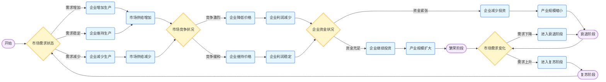

# 基于多智能体的自动化产业周期分析

> 关键词：多智能体系统、自动化产业、产业周期分析、人工智能、复杂系统建模

> 摘要：本文聚焦于基于多智能体的自动化产业周期分析。首先介绍了多智能体系统与自动化产业周期分析的背景知识，包括研究目的、预期读者、文档结构等。接着阐述了核心概念，如多智能体系统的原理和架构，并给出相应的文本示意图和Mermaid流程图。详细讲解了核心算法原理及具体操作步骤，通过Python代码进行了深入说明。探讨了相关的数学模型和公式，并举例进行了分析。通过项目实战展示了如何运用这些理论进行自动化产业周期分析，包括开发环境搭建、源代码实现与解读。分析了该方法在实际中的应用场景，推荐了学习资源、开发工具框架以及相关论文著作。最后总结了未来发展趋势与挑战，解答了常见问题并提供了扩展阅读和参考资料。旨在为相关领域的研究者和从业者提供全面且深入的技术指导。

## 1. 背景介绍 
### 1.1 目的和范围
自动化产业作为现代工业的核心驱动力之一，其发展呈现出明显的周期性特征。准确分析自动化产业周期对于企业制定战略、政府进行产业规划以及投资者做出决策都具有至关重要的意义。传统的产业周期分析方法往往基于宏观经济数据和统计模型，难以充分考虑到自动化产业中众多主体之间复杂的交互关系和动态变化。多智能体系统（Multi-Agent System，MAS）为解决这一问题提供了新的视角。它可以模拟自动化产业中不同主体（如企业、消费者、政府等）的行为和交互，从而更准确地分析产业周期的形成机制和发展趋势。

本文的目的在于深入探讨如何运用多智能体系统进行自动化产业周期分析，包括介绍相关的核心概念、算法原理、数学模型，通过项目实战展示具体的实现方法，并分析其在实际应用中的场景和效果。本文的范围涵盖了多智能体系统的基本理论、自动化产业周期分析的相关知识、Python代码实现以及实际应用案例等方面。

### 1.2 预期读者
本文预期读者包括自动化产业的从业者、企业战略规划人员、政府产业政策制定者、金融投资者以及对多智能体系统和产业周期分析感兴趣的研究人员和学生。对于自动化产业从业者，本文可以帮助他们更好地理解产业发展的规律，制定合理的企业发展战略；对于企业战略规划人员和政府产业政策制定者，本文提供的分析方法可以为产业规划和政策制定提供科学依据；对于金融投资者，本文有助于他们把握自动化产业的投资机会和风险；对于研究人员和学生，本文可以作为学习多智能体系统和产业周期分析的参考资料。

### 1.3 文档结构概述
本文将按照以下结构进行组织：
- 核心概念与联系：介绍多智能体系统和自动化产业周期的核心概念，阐述它们之间的联系，并给出相应的文本示意图和Mermaid流程图。
- 核心算法原理 & 具体操作步骤：详细讲解用于自动化产业周期分析的核心算法原理，通过Python代码展示具体的操作步骤。
- 数学模型和公式 & 详细讲解 & 举例说明：介绍相关的数学模型和公式，对其进行详细讲解，并通过具体例子说明其应用。
- 项目实战：代码实际案例和详细解释说明：通过一个实际的项目案例，展示如何运用多智能体系统进行自动化产业周期分析，包括开发环境搭建、源代码实现和代码解读。
- 实际应用场景：分析基于多智能体的自动化产业周期分析在实际中的应用场景。
- 工具和资源推荐：推荐相关的学习资源、开发工具框架和论文著作。
- 总结：未来发展趋势与挑战：总结基于多智能体的自动化产业周期分析的未来发展趋势和面临的挑战。
- 附录：常见问题与解答：解答读者在阅读本文过程中可能遇到的常见问题。
- 扩展阅读 & 参考资料：提供相关的扩展阅读材料和参考资料。

### 1.4 术语表
#### 1.4.1 核心术语定义
- **多智能体系统（Multi-Agent System，MAS）**：由多个智能体组成的系统，每个智能体具有自主决策和行动的能力，它们之间通过交互和协作来完成特定的任务。
- **智能体（Agent）**：具有感知、决策和行动能力的实体，可以是物理实体（如机器人）或虚拟实体（如软件程序）。
- **自动化产业**：利用自动化技术进行生产、服务和管理的产业，包括工业自动化、智能家居、智能交通等领域。
- **产业周期**：指产业从诞生、成长、成熟到衰退的整个过程，通常包括复苏、繁荣、衰退和萧条四个阶段。

#### 1.4.2 相关概念解释
- **复杂系统**：由大量相互作用的组成部分构成的系统，其行为和性质不能简单地通过各组成部分的性质来预测。自动化产业可以看作是一个复杂系统，其中的企业、消费者、政府等主体之间存在着复杂的交互关系。
- **涌现现象**：在复杂系统中，由于组成部分之间的相互作用而产生的新的行为和性质。在自动化产业中，产业周期的形成可以看作是一种涌现现象，它是由众多企业和其他主体的行为和交互共同作用的结果。

#### 1.4.3 缩略词列表
- **MAS**：Multi-Agent System（多智能体系统）

## 2. 核心概念与联系 
### 多智能体系统原理
多智能体系统的核心思想是将复杂的问题分解为多个相对简单的子问题，每个子问题由一个智能体来解决。智能体之间通过通信和协作来协调它们的行动，以实现整个系统的目标。智能体通常具有以下几个基本特征：
- **自主性**：智能体能够在没有外部干预的情况下自主地感知环境、做出决策和采取行动。
- **反应性**：智能体能够对环境的变化做出及时的反应。
- **社会性**：智能体能够与其他智能体进行通信和协作，以完成共同的任务。
- **学习性**：智能体能够通过学习不断提高自己的性能和适应能力。

### 自动化产业周期概述
自动化产业周期与宏观经济周期类似，也经历复苏、繁荣、衰退和萧条四个阶段。在复苏阶段，产业开始摆脱衰退的影响，市场需求逐渐增加，企业开始增加投资和生产；在繁荣阶段，市场需求旺盛，企业利润丰厚，产业规模不断扩大；在衰退阶段，市场需求开始下降，企业面临竞争压力，利润减少，部分企业开始减产或退出市场；在萧条阶段，市场需求低迷，企业经营困难，产业发展陷入停滞。

### 两者联系
多智能体系统可以用于模拟自动化产业中不同主体的行为和交互，从而更好地理解产业周期的形成机制。例如，企业智能体可以根据市场需求、竞争状况和自身资源等因素来决定生产规模、投资策略和产品价格；消费者智能体可以根据产品价格、质量和个人偏好等因素来决定购买行为；政府智能体可以通过制定产业政策来影响企业和消费者的行为。通过模拟这些主体之间的交互，可以观察到产业周期的涌现现象，从而更准确地分析产业周期的发展趋势。

### 文本示意图
```plaintext
自动化产业
|
|-- 企业智能体
|   |-- 生产决策
|   |-- 投资决策
|   |-- 价格决策
|
|-- 消费者智能体
|   |-- 购买决策
|
|-- 政府智能体
|   |-- 产业政策制定
|
|-- 交互关系
|   |-- 企业与消费者：供需关系
|   |-- 企业与企业：竞争关系
|   |-- 企业与政府：政策影响关系
|   |-- 消费者与政府：政策影响关系
```

### Mermaid流程图


## 3. 核心算法原理 & 具体操作步骤 
### 核心算法原理
在基于多智能体的自动化产业周期分析中，常用的算法包括基于规则的算法和基于机器学习的算法。

#### 基于规则的算法
基于规则的算法是根据预先定义的规则来模拟智能体的行为。例如，企业智能体可以根据市场需求和库存水平来决定生产规模：
- 如果市场需求大于库存水平，则增加生产；
- 如果市场需求等于库存水平，则维持生产；
- 如果市场需求小于库存水平，则减少生产。

这种算法的优点是简单易懂，易于实现，但缺点是缺乏灵活性，难以适应复杂多变的市场环境。

#### 基于机器学习的算法
基于机器学习的算法可以让智能体通过学习来优化自己的行为。例如，企业智能体可以使用强化学习算法来学习最优的生产和定价策略。强化学习是一种通过与环境进行交互来学习最优行为策略的方法，智能体在每个时间步根据当前的状态选择一个动作，环境会根据智能体的动作给予一个奖励信号，智能体的目标是最大化累积奖励。

### 具体操作步骤及Python代码实现
以下是一个简单的基于规则的多智能体系统的Python代码示例，用于模拟自动化产业中企业和消费者的行为：

```python
import random

# 定义企业智能体类
class EnterpriseAgent:
    def __init__(self, initial_production, initial_inventory):
        self.production = initial_production
        self.inventory = initial_inventory

    def update_production(self, market_demand):
        if market_demand > self.inventory:
            self.production += 1
        elif market_demand == self.inventory:
            pass
        else:
            self.production -= 1
        self.inventory += self.production - market_demand

# 定义消费者智能体类
class ConsumerAgent:
    def __init__(self):
        pass

    def generate_demand(self):
        return random.randint(1, 10)

# 模拟产业周期
def simulate_industry_cycle(num_steps):
    enterprise = EnterpriseAgent(5, 10)
    consumer = ConsumerAgent()
    for step in range(num_steps):
        market_demand = consumer.generate_demand()
        enterprise.update_production(market_demand)
        print(f"Step {step + 1}: Market demand = {market_demand}, Production = {enterprise.production}, Inventory = {enterprise.inventory}")

# 运行模拟
simulate_industry_cycle(10)
```

### 代码解释
- `EnterpriseAgent` 类表示企业智能体，它具有初始生产规模和库存水平。`update_production` 方法根据市场需求更新生产规模和库存水平。
- `ConsumerAgent` 类表示消费者智能体，`generate_demand` 方法随机生成市场需求。
- `simulate_industry_cycle` 函数模拟产业周期，在每个时间步，消费者生成市场需求，企业根据市场需求更新生产和库存，并打印相关信息。

## 4. 数学模型和公式 & 详细讲解 & 举例说明 
### 数学模型
在基于多智能体的自动化产业周期分析中，可以使用一些数学模型来描述智能体的行为和产业的动态变化。以下是一些常见的数学模型：

#### 需求模型
市场需求 $D$ 可以表示为时间 $t$、产品价格 $P$ 和消费者偏好 $C$ 的函数：
$$D(t) = f(P(t), C(t))$$

例如，一个简单的线性需求模型可以表示为：
$$D(t) = a - bP(t) + cC(t)$$
其中 $a$、$b$ 和 $c$ 是常数。

#### 生产模型
企业的生产规模 $Q$ 可以表示为市场需求 $D$、库存水平 $I$ 和企业资源 $R$ 的函数：
$$Q(t) = g(D(t), I(t), R(t))$$

例如，一个简单的生产模型可以表示为：
$$Q(t) = \begin{cases}
Q(t - 1) + k(D(t) - I(t)) & \text{if } D(t) > I(t) \\
Q(t - 1) & \text{if } D(t) = I(t) \\
Q(t - 1) - k(I(t) - D(t)) & \text{if } D(t) < I(t)
\end{cases}$$
其中 $k$ 是生产调整系数。

#### 库存模型
企业的库存水平 $I$ 可以表示为生产规模 $Q$ 和市场需求 $D$ 的函数：
$$I(t) = I(t - 1) + Q(t) - D(t)$$

### 详细讲解
- **需求模型**：需求模型描述了市场需求与产品价格和消费者偏好之间的关系。在实际应用中，消费者偏好可能受到多种因素的影响，如广告宣传、产品质量、社会潮流等。线性需求模型是一种简单的近似，它假设市场需求与产品价格呈线性负相关，与消费者偏好呈线性正相关。
- **生产模型**：生产模型描述了企业如何根据市场需求和库存水平来调整生产规模。当市场需求大于库存水平时，企业会增加生产；当市场需求等于库存水平时，企业会维持生产；当市场需求小于库存水平时，企业会减少生产。生产调整系数 $k$ 表示企业调整生产规模的速度。
- **库存模型**：库存模型描述了企业库存水平的变化情况。企业的库存水平等于上一期的库存水平加上本期的生产规模减去本期的市场需求。

### 举例说明
假设一个企业的初始库存水平 $I(0) = 100$，初始生产规模 $Q(0) = 50$，市场需求 $D(t)$ 服从均值为 60 的正态分布。生产调整系数 $k = 0.5$。

在第 1 期，市场需求 $D(1) = 65$，由于 $D(1) > I(0)$，根据生产模型，企业的生产规模调整为：
$$Q(1) = Q(0) + k(D(1) - I(0)) = 50 + 0.5(65 - 100) = 50 - 17.5 = 32.5$$

企业的库存水平调整为：
$$I(1) = I(0) + Q(1) - D(1) = 100 + 32.5 - 65 = 67.5$$

在第 2 期，假设市场需求 $D(2) = 55$，由于 $D(2) < I(1)$，企业的生产规模调整为：
$$Q(2) = Q(1) - k(I(1) - D(2)) = 32.5 - 0.5(67.5 - 55) = 32.5 - 6.25 = 26.25$$

企业的库存水平调整为：
$$I(2) = I(1) + Q(2) - D(2) = 67.5 + 26.25 - 55 = 38.75$$

通过不断地迭代计算，可以模拟出企业的生产和库存变化情况，从而分析产业周期的发展趋势。

## 5. 项目实战：代码实际案例和详细解释说明 
### 5.1  开发环境搭建
#### 操作系统
可以选择 Windows、Linux 或 macOS 操作系统，建议使用最新版本以获得更好的性能和兼容性。

#### Python 环境
安装 Python 3.7 或更高版本。可以从 Python 官方网站（https://www.python.org/downloads/）下载安装包，按照安装向导进行安装。

#### 开发工具
推荐使用 PyCharm 作为开发工具，它是一款功能强大的 Python 集成开发环境（IDE），可以提供代码编辑、调试、版本控制等功能。可以从 JetBrains 官方网站（https://www.jetbrains.com/pycharm/download/）下载 PyCharm Community Edition（免费版）或 PyCharm Professional Edition（付费版）。

#### 相关库安装
在命令行中使用以下命令安装所需的 Python 库：
```sh
pip install numpy pandas matplotlib
```
- `numpy`：用于进行数值计算和数组操作。
- `pandas`：用于数据处理和分析。
- `matplotlib`：用于数据可视化。

### 5.2  源代码详细实现和代码解读
以下是一个更复杂的基于多智能体的自动化产业周期分析的 Python 代码示例：

```python
import numpy as np
import pandas as pd
import matplotlib.pyplot as plt

# 定义企业智能体类
class EnterpriseAgent:
    def __init__(self, initial_production, initial_inventory, production_capacity, production_cost, price):
        self.production = initial_production
        self.inventory = initial_inventory
        self.production_capacity = production_capacity
        self.production_cost = production_cost
        self.price = price
        self.profit = 0

    def update_production(self, market_demand):
        if market_demand > self.inventory:
            new_production = min(self.production + 1, self.production_capacity)
        elif market_demand == self.inventory:
            new_production = self.production
        else:
            new_production = max(self.production - 1, 0)
        self.inventory += new_production - market_demand
        self.production = new_production

    def update_price(self, market_demand):
        if market_demand > self.inventory:
            self.price *= 1.1
        elif market_demand < self.inventory:
            self.price *= 0.9

    def calculate_profit(self, market_demand):
        revenue = min(market_demand, self.inventory) * self.price
        cost = self.production * self.production_cost
        self.profit = revenue - cost

# 定义消费者智能体类
class ConsumerAgent:
    def __init__(self, budget):
        self.budget = budget

    def generate_demand(self, price):
        if price <= self.budget:
            return 1
        else:
            return 0

# 模拟产业周期
def simulate_industry_cycle(num_steps, num_enterprises, num_consumers):
    enterprises = [EnterpriseAgent(5, 10, 20, 2, 5) for _ in range(num_enterprises)]
    consumers = [ConsumerAgent(10) for _ in range(num_consumers)]

    results = []
    for step in range(num_steps):
        total_demand = 0
        for consumer in consumers:
            for enterprise in enterprises:
                demand = consumer.generate_demand(enterprise.price)
                total_demand += demand
                enterprise.update_production(demand)
                enterprise.update_price(demand)
                enterprise.calculate_profit(demand)

        total_production = sum([enterprise.production for enterprise in enterprises])
        total_inventory = sum([enterprise.inventory for enterprise in enterprises])
        total_profit = sum([enterprise.profit for enterprise in enterprises])

        results.append({
            'step': step + 1,
            'total_demand': total_demand,
            'total_production': total_production,
            'total_inventory': total_inventory,
            'total_profit': total_profit
        })

    df = pd.DataFrame(results)
    return df

# 运行模拟
num_steps = 50
num_enterprises = 10
num_consumers = 50
df = simulate_industry_cycle(num_steps, num_enterprises, num_consumers)

# 数据可视化
plt.figure(figsize=(12, 8))
plt.subplot(2, 2, 1)
plt.plot(df['step'], df['total_demand'], label='Total Demand')
plt.xlabel('Step')
plt.ylabel('Total Demand')
plt.legend()

plt.subplot(2, 2, 2)
plt.plot(df['step'], df['total_production'], label='Total Production')
plt.xlabel('Step')
plt.ylabel('Total Production')
plt.legend()

plt.subplot(2, 2, 3)
plt.plot(df['step'], df['total_inventory'], label='Total Inventory')
plt.xlabel('Step')
plt.ylabel('Total Inventory')
plt.legend()

plt.subplot(2, 2, 4)
plt.plot(df['step'], df['total_profit'], label='Total Profit')
plt.xlabel('Step')
plt.ylabel('Total Profit')
plt.legend()

plt.tight_layout()
plt.show()
```

### 5.3  代码解读与分析
#### 企业智能体类（EnterpriseAgent）
- `__init__` 方法：初始化企业的生产规模、库存水平、生产能力、生产成本和产品价格，并将利润初始化为 0。
- `update_production` 方法：根据市场需求更新生产规模和库存水平。如果市场需求大于库存水平，则增加生产，但不超过生产能力；如果市场需求等于库存水平，则维持生产；如果市场需求小于库存水平，则减少生产，但不低于 0。
- `update_price` 方法：根据市场需求更新产品价格。如果市场需求大于库存水平，则提高价格；如果市场需求小于库存水平，则降低价格。
- `calculate_profit` 方法：计算企业的利润，利润等于销售收入减去生产成本。

#### 消费者智能体类（ConsumerAgent）
- `__init__` 方法：初始化消费者的预算。
- `generate_demand` 方法：根据产品价格生成市场需求。如果产品价格小于等于消费者的预算，则需求为 1；否则需求为 0。

#### 模拟产业周期函数（simulate_industry_cycle）
- 初始化企业和消费者智能体列表。
- 在每个时间步，计算总市场需求，每个企业根据市场需求更新生产、价格和利润。
- 记录每个时间步的总需求、总生产、总库存和总利润。
- 将记录结果存储在一个 DataFrame 中并返回。

#### 数据可视化
使用 `matplotlib` 库将模拟结果进行可视化，分别绘制总需求、总生产、总库存和总利润随时间的变化曲线。

通过分析这些曲线，可以观察到自动化产业的周期变化，例如需求的波动、生产的调整、库存的积累和利润的变化等。

## 6. 实际应用场景 
### 企业战略规划
企业可以利用基于多智能体的自动化产业周期分析方法来制定战略规划。通过模拟不同市场环境下企业的行为和产业的发展趋势，企业可以预测市场需求的变化、竞争对手的策略调整以及产业政策的影响，从而制定出更加合理的生产、投资和市场营销策略。例如，在产业复苏阶段，企业可以提前增加生产和投资，抢占市场份额；在产业衰退阶段，企业可以减少生产和库存，降低成本，提高抗风险能力。

### 政府产业政策制定
政府可以运用该方法来评估产业政策的效果和影响。通过模拟不同产业政策下企业和消费者的行为变化，政府可以预测产业的发展趋势，评估政策对产业结构调整、就业和经济增长的影响，从而制定出更加科学合理的产业政策。例如，政府可以通过税收优惠、财政补贴等政策来鼓励企业增加研发投入和技术创新，促进自动化产业的升级和发展。

### 金融投资决策
金融投资者可以利用该方法来评估自动化产业的投资价值和风险。通过分析产业周期的发展趋势，投资者可以选择在合适的时机进入或退出市场，选择具有潜力的企业进行投资。例如，在产业繁荣阶段，投资者可以增加对自动化产业的投资；在产业衰退阶段，投资者可以减少投资或选择防御性的投资策略。

### 产业预警和监测
可以建立基于多智能体的自动化产业监测系统，实时监测产业的运行状态和发展趋势。当监测到产业出现异常变化时，如市场需求急剧下降、企业库存大幅增加等，可以及时发出预警信号，提醒企业和政府采取相应的措施，避免产业危机的发生。

## 7. 工具和资源推荐
### 7.1 学习资源推荐
#### 7.1.1 书籍推荐
- 《多智能体系统：原理与编程》：本书系统地介绍了多智能体系统的基本概念、理论和方法，包括智能体的建模、通信、协作和学习等方面，是学习多智能体系统的经典教材。
- 《产业经济学》：本书全面阐述了产业经济学的基本理论和方法，包括产业组织、产业结构、产业政策等方面，对于理解自动化产业的发展规律和产业周期具有重要的参考价值。
- 《Python 数据分析实战》：本书介绍了如何使用 Python 进行数据分析，包括数据获取、数据清洗、数据分析和数据可视化等方面，对于进行基于多智能体的自动化产业周期分析的代码实现和数据处理具有重要的指导意义。

#### 7.1.2 在线课程
- Coursera 上的“Multi-Agent Systems”课程：该课程由知名高校的教授授课，系统地介绍了多智能体系统的理论和应用，通过在线视频、作业和讨论等方式进行教学，适合初学者和有一定基础的学习者。
- edX 上的“Industrial Economics”课程：该课程介绍了产业经济学的基本理论和方法，通过案例分析和实际应用来加深学习者对产业经济问题的理解，对于理解自动化产业周期分析的背景和意义具有重要的帮助。
- 中国大学 MOOC 上的“Python 数据分析与可视化”课程：该课程介绍了如何使用 Python 进行数据分析和可视化，包括 NumPy、Pandas 和 Matplotlib 等库的使用，对于进行基于多智能体的自动化产业周期分析的代码实现和结果展示具有重要的指导作用。

#### 7.1.3 技术博客和网站
- AgentLink 网站：该网站是多智能体系统领域的专业网站，提供了多智能体系统的最新研究成果、会议信息、学术论文等资源，是了解多智能体系统发展动态的重要平台。
- Towards Data Science 博客：该博客是数据科学领域的知名博客，提供了大量关于数据分析、机器学习和人工智能等方面的技术文章和案例分析，对于学习基于多智能体的自动化产业周期分析的相关技术具有重要的参考价值。
- 知乎上的“多智能体系统”和“产业经济学”话题：知乎是一个知识分享平台，上面有很多关于多智能体系统和产业经济学的讨论和分享，通过参与讨论和阅读相关内容，可以了解到最新的研究动态和实践经验。

### 7.2 开发工具框架推荐
#### 7.2.1 IDE和编辑器
- PyCharm：前面已经介绍过，它是一款功能强大的 Python 集成开发环境，提供了代码编辑、调试、版本控制等功能，适合进行基于 Python 的多智能体系统开发。
- Jupyter Notebook：它是一个交互式的开发环境，可以将代码、文本、图表等内容整合在一起，方便进行数据分析和可视化，适合进行基于多智能体的自动化产业周期分析的实验和结果展示。
- Visual Studio Code：它是一款轻量级的代码编辑器，支持多种编程语言和插件扩展，具有丰富的代码编辑和调试功能，适合进行快速开发和代码维护。

#### 7.2.2 调试和性能分析工具
- PDB：Python 自带的调试器，可以在代码中设置断点，逐步执行代码，查看变量的值和程序的执行流程，帮助开发者发现和解决代码中的问题。
- cProfile：Python 自带的性能分析工具，可以统计代码中各个函数的执行时间和调用次数，帮助开发者找出代码中的性能瓶颈，进行优化。
- Py-Spy：一个轻量级的 Python 性能分析工具，可以实时监控 Python 程序的 CPU 使用率和函数调用情况，帮助开发者快速定位性能问题。

#### 7.2.3 相关框架和库
- Mesa：一个基于 Python 的多智能体建模框架，提供了智能体建模、环境建模、仿真运行等功能，支持多种类型的智能体和交互规则，适合进行基于多智能体的自动化产业周期分析的建模和仿真。
- NumPy：Python 中用于进行数值计算和数组操作的基础库，提供了高效的多维数组对象和各种数学函数，对于进行多智能体系统的数值计算和数据分析具有重要的作用。
- Pandas：Python 中用于数据处理和分析的库，提供了数据结构和数据操作工具，如 DataFrame 和 Series，方便进行数据的读取、清洗、转换和分析。
- Matplotlib：Python 中用于数据可视化的库，提供了各种绘图函数和工具，如折线图、柱状图、散点图等，适合进行基于多智能体的自动化产业周期分析的结果展示和可视化。

### 7.3 相关论文著作推荐
#### 7.3.1 经典论文
- "Multi-Agent Systems: A Modern Approach to Distributed Artificial Intelligence"：该论文是多智能体系统领域的经典论文，系统地介绍了多智能体系统的基本概念、理论和方法，为后续的研究和应用奠定了基础。
- "The Theory of Industrial Organization"：该论文是产业经济学领域的经典论文，提出了产业组织理论的基本框架和方法，对于理解自动化产业的市场结构、企业行为和产业绩效具有重要的参考价值。
- "Agent-Based Computational Economics: A Constructive Approach to Economic Theory"：该论文介绍了基于智能体的计算经济学的基本概念和方法，强调了通过模拟智能体的行为来理解经济现象和规律，对于进行基于多智能体的自动化产业周期分析具有重要的启示作用。

#### 7.3.2 最新研究成果
- 可以关注国际顶级学术会议如 AAMAS（International Conference on Autonomous Agents and Multiagent Systems）、IJCAI（International Joint Conference on Artificial Intelligence）和产业经济学领域的学术期刊如《Journal of Industrial Economics》、《The Review of Industrial Organization》等，这些会议和期刊上发表的论文反映了多智能体系统和产业经济学领域的最新研究成果。
- 国内的学术期刊如《管理科学学报》、《系统工程理论与实践》等也会发表一些关于多智能体系统和产业经济分析的研究论文，可以关注这些期刊获取国内的最新研究动态。

#### 7.3.3 应用案例分析
- 可以参考一些实际的应用案例分析报告，如某些咨询公司发布的关于自动化产业发展趋势和产业周期分析的报告，这些报告通常会结合具体的案例和数据，分析多智能体系统在自动化产业周期分析中的应用效果和实际价值。
- 一些企业的内部研究报告也可能涉及到基于多智能体的产业分析和战略规划案例，可以通过与相关企业合作或参加行业研讨会等方式获取这些报告。

## 8. 总结：未来发展趋势与挑战
### 未来发展趋势
#### 与大数据和人工智能的深度融合
随着大数据和人工智能技术的不断发展，基于多智能体的自动化产业周期分析将与这些技术进行更深度的融合。通过收集和分析大量的产业数据，可以为多智能体系统提供更准确的输入信息，提高模拟的精度和可靠性。同时，利用人工智能算法可以对智能体的行为进行更优化的学习和决策，进一步提高系统的性能和适应性。

#### 跨学科研究的加强
自动化产业周期分析涉及到多智能体系统、产业经济学、计算机科学、数学等多个学科领域。未来，跨学科研究将得到进一步加强，不同学科的专家将共同合作，从不同的角度对自动化产业周期进行深入研究，提出更全面、更有效的分析方法和解决方案。

#### 应用领域的拓展
除了企业战略规划、政府产业政策制定和金融投资决策等传统应用领域，基于多智能体的自动化产业周期分析还将拓展到更多的领域。例如，在供应链管理中，可以通过模拟供应链中不同主体的行为，优化供应链的结构和运作效率；在能源管理中，可以通过模拟能源市场中不同参与者的行为，制定合理的能源政策和规划。

### 面临的挑战
#### 数据质量和获取难度
基于多智能体的自动化产业周期分析需要大量的产业数据作为输入，数据的质量和获取难度是一个重要的挑战。一方面，数据可能存在不准确、不完整、不一致等问题，影响模拟的精度和可靠性；另一方面，一些产业数据可能受到商业机密、隐私保护等因素的限制，难以获取。

#### 模型的复杂性和可解释性
多智能体系统模型通常比较复杂，包含多个智能体和复杂的交互规则，模型的复杂性增加了理解和解释模型结果的难度。同时，模型的可解释性对于决策者来说非常重要，他们需要了解模型的运行机制和结果的含义，以便做出合理的决策。如何在保证模型准确性的前提下，提高模型的可解释性是一个亟待解决的问题。

#### 计算资源和时间成本
基于多智能体的自动化产业周期分析通常需要进行大规模的模拟计算，对计算资源和时间成本有较高的要求。随着模型的复杂性和模拟规模的增加，计算资源和时间成本也会相应增加。如何优化算法和模型结构，减少计算资源和时间成本，是提高该方法实用性的关键。

## 9. 附录：常见问题与解答
### 问题 1：多智能体系统和传统的统计模型有什么区别？
传统的统计模型通常基于宏观数据和统计规律，通过建立数学模型来描述和预测产业的发展趋势。这些模型往往假设产业中的主体是同质的，忽略了主体之间的复杂交互关系和个体差异。而多智能体系统则强调主体的自主性、社会性和学习性，通过模拟不同主体的行为和交互来研究产业的动态变化。多智能体系统可以更好地反映产业中的复杂性和不确定性，提供更丰富的信息和更深入的理解。

### 问题 2：如何确定多智能体系统中的参数和规则？
确定多智能体系统中的参数和规则是一个关键问题，通常可以采用以下方法：
- **理论分析**：根据相关的理论和知识，如产业经济学、管理学等，确定参数和规则的取值范围和基本形式。
- **经验估计**：根据历史数据和实际经验，对参数和规则进行估计和调整。
- **实验优化**：通过多次实验和模拟，比较不同参数和规则下的模拟结果，选择最优的参数和规则。

### 问题 3：多智能体系统的模拟结果是否可靠？
多智能体系统的模拟结果的可靠性受到多种因素的影响，如模型的准确性、参数的合理性、数据的质量等。为了提高模拟结果的可靠性，可以采取以下措施：
- **模型验证**：将模拟结果与实际数据进行比较和验证，检查模型的准确性和合理性。
- **敏感性分析**：分析不同参数和规则对模拟结果的影响，评估模型的稳定性和可靠性。
- **多次模拟**：进行多次模拟，取平均值或统计结果，减少随机因素的影响。

### 问题 4：如何将基于多智能体的自动化产业周期分析应用到实际中？
将基于多智能体的自动化产业周期分析应用到实际中可以按照以下步骤进行：
- **问题定义**：明确分析的目标和问题，确定需要考虑的因素和变量。
- **模型构建**：根据问题的特点和需求，构建多智能体系统模型，确定智能体的类型、行为规则和交互方式。
- **数据收集和处理**：收集相关的产业数据，进行数据清洗和预处理，为模型提供准确的输入信息。
- **模拟运行**：运行多智能体系统模型，进行模拟实验，分析模拟结果。
- **决策制定**：根据模拟结果，制定相应的决策和策略，并在实际中进行应用和验证。

## 10. 扩展阅读 & 参考资料
### 扩展阅读
- 《复杂经济学：经济思想的新框架》：本书介绍了复杂经济学的基本概念和方法，强调了经济系统的复杂性和演化性，对于理解基于多智能体的自动化产业周期分析的理论基础具有重要的帮助。
- 《智能系统中的模糊逻辑理论与应用》：模糊逻辑是一种处理不确定性和模糊性的数学方法，可以应用于多智能体系统中智能体的决策和推理。本书介绍了模糊逻辑的基本理论和应用，对于进一步拓展基于多智能体的自动化产业周期分析的方法具有一定的参考价值。
- 《供应链管理：战略、规划与运营》：供应链管理是自动化产业中的一个重要环节，基于多智能体的方法可以用于优化供应链的结构和运作效率。本书介绍了供应链管理的基本理论和方法，对于将基于多智能体的自动化产业周期分析应用到供应链管理中具有一定的指导意义。

### 参考资料
- Wooldridge, M. (2009). An Introduction to MultiAgent Systems. John Wiley & Sons.
- Tirole, J. (1988). The Theory of Industrial Organization. MIT Press.
- Tesfatsion, L., & Judd, K. L. (Eds.). (2006). Handbook of Computational Economics, Volume 2: Agent-Based Computational Economics. Elsevier.

作者：AI天才研究院/AI Genius Institute & 禅与计算机程序设计艺术 /Zen And The Art of Computer Programming