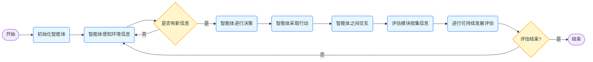

# 基于多智能体的自动化公司可持续发展评估

> 关键词：多智能体系统、自动化公司、可持续发展评估、智能算法、数学模型

> 摘要：本文聚焦于基于多智能体的自动化公司可持续发展评估这一主题。首先介绍了该研究的背景，包括目的、预期读者、文档结构和相关术语。详细阐述了多智能体系统、自动化公司可持续发展评估等核心概念及其联系，并给出了相应的文本示意图和 Mermaid 流程图。深入讲解了核心算法原理，结合 Python 代码进行具体操作步骤的说明。通过数学模型和公式进一步剖析评估方法，并举例说明其应用。以项目实战的方式，展示了开发环境搭建、源代码实现及代码解读。探讨了该评估方法在实际中的应用场景，推荐了学习资源、开发工具框架以及相关论文著作。最后总结了未来发展趋势与挑战，提供了常见问题解答和扩展阅读参考资料，旨在为自动化公司的可持续发展评估提供全面、深入的技术指导。

## 1. 背景介绍 
### 1.1 目的和范围
随着全球经济的发展和环境意识的提高，自动化公司的可持续发展成为了关注的焦点。可持续发展不仅涉及到公司的经济绩效，还包括环境和社会方面的影响。本研究的目的是利用多智能体系统构建一个全面、准确的自动化公司可持续发展评估模型，以帮助公司管理层更好地了解公司的可持续发展状况，制定合理的发展战略。

本研究的范围涵盖了自动化公司可持续发展的各个方面，包括经济、环境和社会维度。通过多智能体系统模拟公司内部不同部门和外部利益相关者的行为和交互，综合评估公司的可持续发展水平。

### 1.2 预期读者
本文的预期读者包括自动化公司的管理层、可持续发展专家、研究人员以及对多智能体系统和可持续发展评估感兴趣的技术人员。对于公司管理层来说，本文可以提供一种有效的评估工具，帮助他们制定可持续发展战略；对于研究人员和技术人员，本文可以为他们的研究和实践提供理论和技术支持。

### 1.3 文档结构概述
本文共分为十个部分。第一部分为背景介绍，阐述了研究的目的、范围、预期读者和文档结构。第二部分介绍了核心概念与联系，包括多智能体系统、自动化公司可持续发展评估等概念，并给出了相应的示意图和流程图。第三部分详细讲解了核心算法原理和具体操作步骤，结合 Python 代码进行说明。第四部分介绍了数学模型和公式，并举例说明其应用。第五部分通过项目实战展示了代码的实际案例和详细解释。第六部分探讨了该评估方法的实际应用场景。第七部分推荐了学习资源、开发工具框架和相关论文著作。第八部分总结了未来发展趋势与挑战。第九部分为附录，提供了常见问题与解答。第十部分为扩展阅读和参考资料。

### 1.4 术语表
#### 1.4.1 核心术语定义
- **多智能体系统（Multi - Agent System, MAS）**：由多个智能体组成的系统，每个智能体具有自主决策和交互的能力，通过智能体之间的协作和竞争实现系统的整体目标。
- **自动化公司**：采用自动化技术进行生产、管理和运营的公司，其特点是高度的信息化和智能化。
- **可持续发展评估**：对公司在经济、环境和社会三个维度的发展状况进行综合评价，以判断公司是否实现了可持续发展的目标。

#### 1.4.2 相关概念解释
- **智能体（Agent）**：具有感知、决策和行动能力的实体，可以是软件程序、机器人或人类。在多智能体系统中，智能体能够根据自身的目标和环境信息自主地做出决策，并与其他智能体进行交互。
- **经济维度**：主要涉及公司的财务状况、盈利能力、市场竞争力等方面，是公司可持续发展的基础。
- **环境维度**：关注公司的生产经营活动对环境的影响，如能源消耗、污染物排放等，要求公司采取措施减少对环境的破坏。
- **社会维度**：考虑公司对社会的贡献，包括员工福利、社会责任、社区发展等方面，体现公司的社会价值。

#### 1.4.3 缩略词列表
- MAS：Multi - Agent System（多智能体系统）
- GDP：Gross Domestic Product（国内生产总值）
- CO₂：Carbon Dioxide（二氧化碳）

## 2. 核心概念与联系 
### 核心概念原理
#### 多智能体系统原理
多智能体系统的核心思想是将复杂的系统分解为多个相对简单的智能体，每个智能体具有一定的自主性和智能性。智能体通过感知环境信息，根据自身的目标和规则进行决策，并采取相应的行动。智能体之间可以通过通信和协作来实现系统的整体目标。

例如，在自动化公司的可持续发展评估中，可以将公司的不同部门（如生产部门、销售部门、研发部门等）看作不同的智能体，每个部门根据自身的职责和目标进行决策和行动。同时，这些部门之间需要进行信息共享和协作，以实现公司的可持续发展目标。

#### 自动化公司可持续发展评估原理
自动化公司的可持续发展评估是一个综合的过程，需要考虑经济、环境和社会三个维度的因素。通过建立评估指标体系，对公司在各个维度的表现进行量化评估，然后综合各个维度的评估结果，得出公司的可持续发展水平。

例如，在经济维度，可以选取营业收入、净利润、资产负债率等指标；在环境维度，可以选取能源消耗强度、污染物排放达标率等指标；在社会维度，可以选取员工满意度、社会责任投入等指标。通过对这些指标的综合评估，可以全面了解公司的可持续发展状况。

### 架构的文本示意图
自动化公司可持续发展评估的多智能体系统架构可以描述如下：

整个系统由多个智能体组成，包括公司内部智能体（如生产智能体、销售智能体、财务智能体等）和外部智能体（如政府监管智能体、客户智能体、供应商智能体等）。公司内部智能体负责处理公司内部的业务流程和数据，外部智能体负责与公司进行交互，提供外部信息和反馈。

智能体之间通过通信网络进行信息传递和交互。每个智能体都有自己的知识库和决策规则，根据接收到的信息和自身的目标进行决策和行动。评估模块收集各个智能体的信息，根据预设的评估指标体系和算法对公司的可持续发展水平进行评估，并将评估结果反馈给相关智能体。

### Mermaid 流程图


该流程图展示了基于多智能体的自动化公司可持续发展评估的基本流程。首先，系统初始化各个智能体，然后智能体感知环境信息。如果有新信息，智能体进行决策并采取行动，智能体之间进行交互。评估模块收集信息并进行可持续发展评估。如果评估未结束，则继续循环，直到评估结束。

## 3. 核心算法原理 & 具体操作步骤 
### 核心算法原理
本研究采用的核心算法是基于多智能体的评估算法，其基本原理是通过智能体之间的交互和协作，模拟公司的实际运营情况，然后根据预设的评估指标体系对公司的可持续发展水平进行评估。

具体来说，每个智能体根据自身的目标和规则进行决策和行动，智能体之间通过通信网络进行信息传递和交互。评估模块收集各个智能体的信息，计算公司在经济、环境和社会三个维度的评估指标值，然后根据权重系数将各个维度的评估结果进行综合，得出公司的可持续发展水平。

### 具体操作步骤及 Python 代码实现
#### 步骤 1：初始化智能体
首先，需要定义智能体的类，并初始化各个智能体。以下是一个简单的 Python 代码示例：
```python
class Agent:
    def __init__(self, name):
        self.name = name
        self.knowledge = {}
        self.goals = []

    def update_knowledge(self, new_info):
        self.knowledge.update(new_info)

    def make_decision(self):
        # 简单示例：根据知识做出决策
        if 'profit' in self.knowledge and self.knowledge['profit'] < 0:
            return 'reduce_cost'
        else:
            return 'expand_business'


# 初始化智能体
production_agent = Agent('Production Agent')
sales_agent = Agent('Sales Agent')
finance_agent = Agent('Finance Agent')
```
在这个示例中，定义了一个 `Agent` 类，包含智能体的名称、知识库和目标。`update_knowledge` 方法用于更新智能体的知识库，`make_decision` 方法根据智能体的知识做出决策。然后初始化了生产智能体、销售智能体和财务智能体。

#### 步骤 2：智能体感知环境信息
智能体需要感知环境信息，并更新自己的知识库。以下是一个示例代码：
```python
# 模拟环境信息
environment_info = {
    'production_agent': {'production_cost': 10000, 'production_volume': 1000},
    'sales_agent': {'sales_volume': 800, 'sales_price': 20},
    'finance_agent': {'profit': -2000}
}

# 智能体感知环境信息并更新知识库
production_agent.update_knowledge(environment_info['production_agent'])
sales_agent.update_knowledge(environment_info['sales_agent'])
finance_agent.update_knowledge(environment_info['finance_agent'])
```
在这个示例中，定义了一个模拟的环境信息字典，然后各个智能体根据自己的名称从环境信息中获取相应的信息，并更新自己的知识库。

#### 步骤 3：智能体进行决策
智能体根据自己的知识库和目标进行决策。以下是一个示例代码：
```python
# 智能体进行决策
production_decision = production_agent.make_decision()
sales_decision = sales_agent.make_decision()
finance_decision = finance_agent.make_decision()

print(f"Production Agent Decision: {production_decision}")
print(f"Sales Agent Decision: {sales_decision}")
print(f"Finance Agent Decision: {finance_decision}")
```
在这个示例中，各个智能体调用 `make_decision` 方法进行决策，并打印出决策结果。

#### 步骤 4：智能体之间交互
智能体之间可以通过通信网络进行信息传递和交互。以下是一个简单的示例代码：
```python
# 智能体之间交互
production_agent.knowledge['sales_volume'] = sales_agent.knowledge['sales_volume']
sales_agent.knowledge['production_volume'] = production_agent.knowledge['production_volume']
```
在这个示例中，生产智能体获取销售智能体的销售数量信息，销售智能体获取生产智能体的生产数量信息，实现了智能体之间的信息交互。

#### 步骤 5：评估模块进行评估
评估模块收集各个智能体的信息，根据预设的评估指标体系和算法对公司的可持续发展水平进行评估。以下是一个简单的示例代码：
```python
# 评估模块
def evaluate_sustainability(production_agent, sales_agent, finance_agent):
    # 简单示例：计算经济维度评估指标
    profit = finance_agent.knowledge['profit']
    production_cost = production_agent.knowledge['production_cost']
    sales_volume = sales_agent.knowledge['sales_volume']
    economic_score = profit / production_cost * sales_volume

    # 这里可以添加环境和社会维度的评估指标计算

    # 综合评估
    overall_score = economic_score  # 简单示例，只考虑经济维度
    return overall_score


# 进行评估
sustainability_score = evaluate_sustainability(production_agent, sales_agent, finance_agent)
print(f"Sustainability Score: {sustainability_score}")
```
在这个示例中，定义了一个 `evaluate_sustainability` 函数，用于计算公司的可持续发展得分。在这个简单的示例中，只考虑了经济维度的评估指标，通过利润、生产成本和销售数量计算经济得分，并将其作为综合得分。

## 4. 数学模型和公式 & 详细讲解 & 举例说明 
### 数学模型
基于多智能体的自动化公司可持续发展评估的数学模型可以表示为：

设公司的可持续发展水平为 $S$，经济维度评估得分 $E$，环境维度评估得分 $E_n$，社会维度评估得分 $S_c$，各维度的权重系数分别为 $w_E$，$w_{E_n}$，$w_{S_c}$，且满足 $w_E + w_{E_n} + w_{S_c} = 1$。则公司的可持续发展水平可以表示为：

$$S = w_E \times E+w_{E_n} \times E_n + w_{S_c} \times S_c$$

### 详细讲解
- **经济维度评估得分 $E$**：经济维度的评估得分可以通过多个经济指标计算得到。例如，可以选取营业收入 $R$、净利润 $P$、资产负债率 $L$ 等指标。可以采用加权平均的方法计算经济维度评估得分：

设各经济指标的权重系数分别为 $w_{R}$，$w_{P}$，$w_{L}$，且满足 $w_{R}+w_{P}+w_{L} = 1$。则经济维度评估得分可以表示为：

$$E = w_{R} \times \frac{R}{R_{max}}+w_{P} \times \frac{P}{P_{max}}+w_{L} \times (1 - \frac{L}{L_{max}})$$

其中，$R_{max}$，$P_{max}$，$L_{max}$ 分别为营业收入、净利润、资产负债率的最大值。

- **环境维度评估得分 $E_n$**：环境维度的评估得分可以通过能源消耗强度 $E_c$、污染物排放达标率 $D$ 等指标计算得到。同样采用加权平均的方法：

设各环境指标的权重系数分别为 $w_{E_c}$，$w_{D}$，且满足 $w_{E_c}+w_{D} = 1$。则环境维度评估得分可以表示为：

$$E_n = w_{E_c} \times (1 - \frac{E_c}{E_{c_{max}}})+w_{D} \times D$$

其中，$E_{c_{max}}$ 为能源消耗强度的最大值。

- **社会维度评估得分 $S_c$**：社会维度的评估得分可以通过员工满意度 $S_e$、社会责任投入 $I$ 等指标计算得到。采用加权平均的方法：

设各社会指标的权重系数分别为 $w_{S_e}$，$w_{I}$，且满足 $w_{S_e}+w_{I} = 1$。则社会维度评估得分可以表示为：

$$S_c = w_{S_e} \times S_e+w_{I} \times \frac{I}{I_{max}}$$

其中，$I_{max}$ 为社会责任投入的最大值。

### 举例说明
假设某自动化公司的相关数据如下：

经济指标：营业收入 $R = 1000$ 万元，净利润 $P = 200$ 万元，资产负债率 $L = 0.3$。假设 $R_{max} = 2000$ 万元，$P_{max} = 500$ 万元，$L_{max} = 0.8$。各经济指标的权重系数分别为 $w_{R}=0.4$，$w_{P}=0.4$，$w_{L}=0.2$。

环境指标：能源消耗强度 $E_c = 0.5$ 吨标准煤/万元产值，污染物排放达标率 $D = 0.9$。假设 $E_{c_{max}} = 1$ 吨标准煤/万元产值。各环境指标的权重系数分别为 $w_{E_c}=0.6$，$w_{D}=0.4$。

社会指标：员工满意度 $S_e = 0.8$，社会责任投入 $I = 50$ 万元。假设 $I_{max} = 100$ 万元。各社会指标的权重系数分别为 $w_{S_e}=0.7$，$w_{I}=0.3$。

各维度的权重系数分别为 $w_E = 0.5$，$w_{E_n} = 0.3$，$w_{S_c} = 0.2$。

#### 计算经济维度评估得分 $E$
$$E = 0.4\times\frac{1000}{2000}+0.4\times\frac{200}{500}+0.2\times(1 - \frac{0.3}{0.8})$$
$$E = 0.4\times0.5 + 0.4\times0.4+0.2\times(1 - 0.375)$$
$$E = 0.2 + 0.16+0.2\times0.625$$
$$E = 0.2 + 0.16 + 0.125$$
$$E = 0.485$$

#### 计算环境维度评估得分 $E_n$
$$E_n = 0.6\times(1 - \frac{0.5}{1})+0.4\times0.9$$
$$E_n = 0.6\times0.5+0.4\times0.9$$
$$E_n = 0.3 + 0.36$$
$$E_n = 0.66$$

#### 计算社会维度评估得分 $S_c$
$$S_c = 0.7\times0.8+0.3\times\frac{50}{100}$$
$$S_c = 0.7\times0.8+0.3\times0.5$$
$$S_c = 0.56 + 0.15$$
$$S_c = 0.71$$

#### 计算公司的可持续发展水平 $S$
$$S = 0.5\times0.485+0.3\times0.66+0.2\times0.71$$
$$S = 0.2425+0.198+0.142$$
$$S = 0.5825$$

通过以上计算，可以得出该自动化公司的可持续发展水平得分为 0.5825。

## 5. 项目实战：代码实际案例和详细解释说明 
### 5.1  开发环境搭建
#### 操作系统
可以选择 Windows、Linux 或 macOS 操作系统。本项目推荐使用 Linux 系统，如 Ubuntu 18.04 及以上版本，因为 Linux 系统在开发和部署方面具有更好的稳定性和兼容性。

#### Python 环境
安装 Python 3.7 及以上版本。可以从 Python 官方网站（https://www.python.org/downloads/）下载安装包进行安装。安装完成后，使用以下命令验证 Python 版本：
```bash
python --version
```

#### 依赖库安装
本项目需要使用一些 Python 库，如 `numpy`、`pandas` 等。可以使用 `pip` 工具进行安装：
```bash
pip install numpy pandas
```

### 5.2  源代码详细实现和代码解读
以下是一个完整的基于多智能体的自动化公司可持续发展评估的 Python 代码示例：
```python
import numpy as np
import pandas as pd


# 定义智能体类
class Agent:
    def __init__(self, name):
        self.name = name
        self.knowledge = {}
        self.goals = []

    def update_knowledge(self, new_info):
        self.knowledge.update(new_info)

    def make_decision(self):
        # 简单示例：根据知识做出决策
        if 'profit' in self.knowledge and self.knowledge['profit'] < 0:
            return 'reduce_cost'
        else:
            return 'expand_business'


# 评估模块
def evaluate_sustainability(production_agent, sales_agent, finance_agent):
    # 经济维度评估
    profit = finance_agent.knowledge['profit']
    production_cost = production_agent.knowledge['production_cost']
    sales_volume = sales_agent.knowledge['sales_volume']
    economic_score = profit / production_cost * sales_volume

    # 这里可以添加环境和社会维度的评估指标计算

    # 综合评估
    overall_score = economic_score  # 简单示例，只考虑经济维度
    return overall_score


# 主函数
def main():
    # 初始化智能体
    production_agent = Agent('Production Agent')
    sales_agent = Agent('Sales Agent')
    finance_agent = Agent('Finance Agent')

    # 模拟环境信息
    environment_info = {
        'production_agent': {'production_cost': 10000, 'production_volume': 1000},
        'sales_agent': {'sales_volume': 800, 'sales_price': 20},
        'finance_agent': {'profit': -2000}
    }

    # 智能体感知环境信息并更新知识库
    production_agent.update_knowledge(environment_info['production_agent'])
    sales_agent.update_knowledge(environment_info['sales_agent'])
    finance_agent.update_knowledge(environment_info['finance_agent'])

    # 智能体进行决策
    production_decision = production_agent.make_decision()
    sales_decision = sales_agent.make_decision()
    finance_decision = finance_agent.make_decision()

    print(f"Production Agent Decision: {production_decision}")
    print(f"Sales Agent Decision: {sales_decision}")
    print(f"Finance Agent Decision: {finance_decision}")

    # 智能体之间交互
    production_agent.knowledge['sales_volume'] = sales_agent.knowledge['sales_volume']
    sales_agent.knowledge['production_volume'] = production_agent.knowledge['production_volume']

    # 进行评估
    sustainability_score = evaluate_sustainability(production_agent, sales_agent, finance_agent)
    print(f"Sustainability Score: {sustainability_score}")


if __name__ == "__main__":
    main()
```
### 代码解读与分析
#### 智能体类 `Agent`
- `__init__` 方法：初始化智能体的名称、知识库和目标。
- `update_knowledge` 方法：用于更新智能体的知识库，将新的信息添加到知识库中。
- `make_decision` 方法：根据智能体的知识库做出决策。在这个简单的示例中，如果智能体的知识库中包含利润信息且利润小于 0，则决策为降低成本；否则，决策为扩大业务。

#### 评估模块 `evaluate_sustainability`
该函数用于计算公司的可持续发展得分。在这个简单的示例中，只考虑了经济维度的评估指标，通过利润、生产成本和销售数量计算经济得分，并将其作为综合得分。

#### 主函数 `main`
- 初始化生产智能体、销售智能体和财务智能体。
- 模拟环境信息，包括生产成本、生产数量、销售数量、销售价格和利润等。
- 智能体感知环境信息并更新自己的知识库。
- 智能体进行决策，并打印决策结果。
- 智能体之间进行信息交互。
- 调用评估模块计算公司的可持续发展得分，并打印得分结果。

## 6. 实际应用场景 
### 公司战略规划
自动化公司的管理层可以利用基于多智能体的可持续发展评估结果制定公司的战略规划。通过了解公司在经济、环境和社会三个维度的发展状况，管理层可以确定公司的优势和劣势，制定针对性的发展战略。例如，如果评估结果显示公司在环境维度的得分较低，管理层可以制定减少能源消耗、降低污染物排放的战略，以提高公司的可持续发展水平。

### 投资决策
投资者在选择投资自动化公司时，可以参考公司的可持续发展评估结果。可持续发展水平较高的公司通常具有更好的长期发展潜力和抗风险能力，因此更受投资者的青睐。投资者可以通过分析公司在各个维度的评估指标，判断公司的投资价值，做出更明智的投资决策。

### 政府监管
政府部门可以利用基于多智能体的可持续发展评估方法对自动化公司进行监管。通过评估公司的可持续发展水平，政府可以了解公司的生产经营活动对环境和社会的影响，制定相应的政策和法规，引导公司实现可持续发展。例如，对于可持续发展水平较低的公司，政府可以采取限制生产、罚款等措施，促使其改进生产方式，提高可持续发展水平。

### 供应链管理
自动化公司在选择供应商和合作伙伴时，可以参考对方的可持续发展评估结果。选择可持续发展水平较高的供应商和合作伙伴，可以降低公司的供应链风险，提高公司的整体可持续发展水平。同时，公司也可以通过与供应商和合作伙伴的合作，共同推动整个供应链的可持续发展。

## 7. 工具和资源推荐
### 7.1 学习资源推荐
#### 7.1.1 书籍推荐
- 《多智能体系统：原理与编程》：本书系统地介绍了多智能体系统的基本概念、理论和编程方法，是学习多智能体系统的经典教材。
- 《可持续发展经济学》：该书从经济学的角度探讨了可持续发展的理论和实践，对于理解自动化公司可持续发展评估的经济维度具有重要的参考价值。
- 《环境科学概论》：帮助读者了解环境科学的基本概念、原理和方法，对于理解自动化公司可持续发展评估的环境维度非常有帮助。

#### 7.1.2 在线课程
- Coursera 平台上的“Multi - Agent Systems”课程：由知名高校的教授授课，详细讲解了多智能体系统的理论和应用。
- edX 平台上的“Introduction to Sustainable Development”课程：介绍了可持续发展的基本概念、原则和实践，适合初学者学习。

#### 7.1.3 技术博客和网站
- AI 社区（https://ai.com）：提供了大量关于人工智能和多智能体系统的技术文章和案例分析，是技术人员学习和交流的好平台。
- 可持续发展论坛（https://sustainabilityforum.org）：专注于可持续发展领域的研究和讨论，分享了许多关于企业可持续发展的经验和案例。

### 7.2 开发工具框架推荐
#### 7.2.1 IDE和编辑器
- PyCharm：一款功能强大的 Python 集成开发环境，提供了代码编辑、调试、版本控制等功能，适合 Python 项目的开发。
- Visual Studio Code：一款轻量级的代码编辑器，支持多种编程语言，具有丰富的插件生态系统，可以满足不同的开发需求。

#### 7.2.2 调试和性能分析工具
- PySnooper：一个简单易用的 Python 调试工具，可以自动记录函数的执行过程和变量的值，帮助开发者快速定位问题。
- cProfile：Python 自带的性能分析工具，可以分析代码的运行时间和函数调用情况，帮助开发者优化代码性能。

#### 7.2.3 相关框架和库
- Mesa：一个用于构建基于智能体的模拟模型的 Python 框架，提供了丰富的智能体类和交互机制，方便开发者快速搭建多智能体系统。
- scikit - learn：一个常用的机器学习库，提供了各种机器学习算法和工具，可用于自动化公司可持续发展评估中的数据处理和模型训练。

### 7.3 相关论文著作推荐
#### 7.3.1 经典论文
- “Multi - Agent Systems: A Modern Approach to Distributed Artificial Intelligence”：该论文系统地介绍了多智能体系统的基本概念、理论和应用，是多智能体系统领域的经典之作。
- “Sustainable Development and the Corporate Performance”：探讨了企业可持续发展与企业绩效之间的关系，为企业可持续发展评估提供了理论基础。

#### 7.3.2 最新研究成果
- 关注《Journal of Artificial Intelligence Research》、《Sustainable Development》等学术期刊，这些期刊发表了许多关于多智能体系统和可持续发展的最新研究成果。

#### 7.3.3 应用案例分析
- 一些国际知名企业（如西门子、ABB 等）的可持续发展报告，详细介绍了企业在可持续发展方面的实践和经验，是很好的应用案例分析资料。

## 8. 总结：未来发展趋势与挑战
### 未来发展趋势
#### 智能化和自动化程度不断提高
随着人工智能和自动化技术的不断发展，基于多智能体的自动化公司可持续发展评估系统将变得更加智能化和自动化。智能体将具备更强的学习和推理能力，能够自动感知环境变化，做出更准确的决策。评估过程将更加自动化，减少人工干预，提高评估效率和准确性。

#### 与其他技术的融合
多智能体系统将与物联网、大数据、区块链等技术深度融合。物联网技术可以为智能体提供更丰富的环境信息，大数据技术可以用于处理和分析海量的评估数据，区块链技术可以保证评估数据的安全性和可信度。通过与这些技术的融合，基于多智能体的可持续发展评估系统将更加完善和强大。

#### 跨领域应用拓展
基于多智能体的可持续发展评估方法将不仅仅应用于自动化公司，还将拓展到其他领域，如制造业、服务业、农业等。不同领域的企业可以根据自身的特点和需求，定制适合自己的可持续发展评估模型，推动整个社会的可持续发展。

### 挑战
#### 数据质量和获取问题
准确的评估需要大量高质量的数据支持。然而，在实际应用中，数据的质量和获取可能存在问题。例如，一些环境和社会数据可能难以准确测量和收集，数据的准确性和完整性可能受到影响。此外，不同来源的数据可能存在格式不统一、标准不一致等问题，给数据处理和分析带来困难。

#### 智能体建模和决策的复杂性
智能体的建模和决策是基于多智能体的可持续发展评估系统的核心。然而，智能体的行为和决策受到多种因素的影响，如环境信息、自身目标、其他智能体的行为等，使得智能体的建模和决策变得非常复杂。如何建立准确、有效的智能体模型，提高智能体的决策能力，是一个亟待解决的问题。

#### 伦理和法律问题
随着多智能体系统的广泛应用，伦理和法律问题也逐渐凸显。例如，智能体的决策可能会对人类的利益产生影响，如何确保智能体的决策符合伦理和法律要求是一个重要的问题。此外，多智能体系统的责任归属问题也需要进一步明确，当系统出现问题时，谁应该承担责任。

## 9. 附录：常见问题与解答
### 问题 1：多智能体系统与传统系统有什么区别？
多智能体系统与传统系统的主要区别在于智能体的自主性和交互性。在传统系统中，各个组件通常是按照预设的规则和程序运行，缺乏自主性和智能性。而在多智能体系统中，每个智能体具有自主决策和交互的能力，能够根据自身的目标和环境信息自主地做出决策，并与其他智能体进行协作和竞争。这种自主性和交互性使得多智能体系统能够更好地适应复杂多变的环境，解决传统系统难以解决的问题。

### 问题 2：如何确定各评估指标的权重系数？
确定各评估指标的权重系数是一个关键问题，直接影响评估结果的准确性和合理性。常用的方法有主观赋权法和客观赋权法。主观赋权法是根据专家的经验和判断来确定权重系数，如德尔菲法、层次分析法等。客观赋权法是根据数据的统计特征来确定权重系数，如主成分分析法、熵权法等。在实际应用中，可以结合主观赋权法和客观赋权法，综合考虑专家意见和数据特征，确定合理的权重系数。

### 问题 3：基于多智能体的可持续发展评估系统的计算复杂度如何？
基于多智能体的可持续发展评估系统的计算复杂度主要取决于智能体的数量、智能体之间的交互复杂度以及评估指标的数量和复杂度。一般来说，随着智能体数量和交互复杂度的增加，计算复杂度会呈指数级增长。为了降低计算复杂度，可以采用分布式计算、并行计算等技术，提高系统的计算效率。

### 问题 4：如何验证基于多智能体的可持续发展评估系统的有效性？
可以通过以下几种方法验证基于多智能体的可持续发展评估系统的有效性：
- 对比分析：将评估系统的结果与实际情况进行对比分析，验证评估结果的准确性和可靠性。
- 敏感性分析：对评估指标和权重系数进行敏感性分析，了解它们对评估结果的影响程度，验证评估系统的稳定性。
- 案例研究：通过实际案例研究，验证评估系统在不同场景下的适用性和有效性。

## 10. 扩展阅读 & 参考资料
### 扩展阅读
- 《人工智能：一种现代方法》：全面介绍了人工智能的基本概念、理论和方法，对于深入理解多智能体系统具有重要的参考价值。
- 《企业社会责任与可持续发展》：详细探讨了企业社会责任的内涵、实践和评估方法，为自动化公司的可持续发展评估提供了更多的思路和方法。

### 参考资料
- [1] Wooldridge, M. J. (2009). An introduction to multi - agent systems. John Wiley & Sons.
- [2] Elkington, J. (1997). Cannibals with forks: The triple bottom line of 21st century business. Capstone Publishing.
- [3] Kitchin, R. (2014). The data - driven city: Big data, open data, smart cities and civic analytics. Sage.

作者：AI天才研究院/AI Genius Institute & 禅与计算机程序设计艺术 /Zen And The Art of Computer Programming