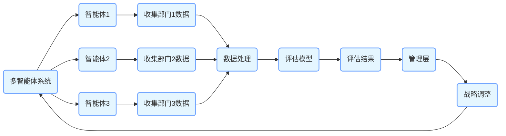

# 基于多智能体的自动化公司战略执行力评估

> 关键词：多智能体系统、自动化评估、公司战略执行力、智能决策、数据分析

> 摘要：本文聚焦于基于多智能体的自动化公司战略执行力评估这一主题。通过引入多智能体系统，旨在实现对公司战略执行力的高效、精准评估。详细阐述了多智能体系统的核心概念、相关算法原理、数学模型，结合实际案例展示了评估过程，并探讨了其在不同场景下的应用。同时，提供了丰富的学习资源、开发工具和相关论文推荐。最后，对未来发展趋势与挑战进行了总结，以期为企业提升战略执行力评估水平提供有力的技术支持和理论参考。

## 1. 背景介绍 
### 1.1 目的和范围
在当今竞争激烈的商业环境中，公司战略的有效执行对于企业的生存和发展至关重要。然而，准确评估公司战略执行力并非易事，传统的评估方法往往存在主观性强、效率低下等问题。本研究的目的是引入多智能体系统，开发一种自动化的公司战略执行力评估方法，以提高评估的准确性和效率。

本研究的范围涵盖了多智能体系统的基本原理、算法设计、数学模型构建，以及如何将其应用于公司战略执行力评估的具体实践中。同时，还将探讨该方法在不同行业和企业规模下的适用性和局限性。

### 1.2 预期读者
本文的预期读者包括企业管理人员、战略规划师、数据分析人员、人工智能研究者以及对公司战略管理和多智能体系统感兴趣的专业人士。对于企业管理人员和战略规划师，本文提供了一种新的评估公司战略执行力的方法和思路；对于数据分析人员和人工智能研究者，本文介绍了多智能体系统在实际应用中的具体案例和技术细节；对于对相关领域感兴趣的专业人士，本文可以作为进一步学习和研究的参考资料。

### 1.3 文档结构概述
本文将按照以下结构进行组织：
- 核心概念与联系：介绍多智能体系统和公司战略执行力的基本概念，以及它们之间的联系。
- 核心算法原理 & 具体操作步骤：详细阐述基于多智能体的自动化评估算法的原理和具体操作步骤，并使用Python代码进行示例。
- 数学模型和公式 & 详细讲解 & 举例说明：构建评估的数学模型，给出相关公式，并通过具体例子进行说明。
- 项目实战：代码实际案例和详细解释说明：通过一个实际项目案例，展示如何使用多智能体系统进行公司战略执行力评估。
- 实际应用场景：探讨该评估方法在不同行业和企业规模下的实际应用场景。
- 工具和资源推荐：推荐相关的学习资源、开发工具和论文著作。
- 总结：未来发展趋势与挑战：总结研究成果，分析未来发展趋势和面临的挑战。
- 附录：常见问题与解答：解答读者可能遇到的常见问题。
- 扩展阅读 & 参考资料：提供进一步学习和研究的参考资料。

### 1.4 术语表
#### 1.4.1 核心术语定义
- **多智能体系统（Multi - Agent System，MAS）**：由多个智能体组成的系统，这些智能体能够自主地感知环境、做出决策并与其他智能体进行交互，以实现共同或各自的目标。
- **公司战略执行力**：指企业将战略规划转化为实际行动和成果的能力，包括战略目标的分解、资源的配置、流程的优化和团队的协作等方面。
- **智能体（Agent）**：具有自主决策能力、能够感知环境并与其他智能体进行交互的实体。
- **自动化评估**：利用计算机技术和算法，自动对公司战略执行力进行评估，减少人工干预，提高评估的效率和准确性。

#### 1.4.2 相关概念解释
- **战略目标分解**：将公司的总体战略目标分解为具体的、可衡量的子目标，以便于各部门和员工理解和执行。
- **资源配置**：根据战略目标的要求，合理分配企业的人力、物力和财力等资源，确保战略的顺利实施。
- **流程优化**：对企业的业务流程进行分析和改进，提高流程的效率和质量，以支持战略的执行。
- **团队协作**：各部门和员工之间相互配合、协同工作，共同实现战略目标。

#### 1.4.3 缩略词列表
- MAS：Multi - Agent System（多智能体系统）
- AI：Artificial Intelligence（人工智能）
- ML：Machine Learning（机器学习）

## 2. 核心概念与联系 
### 2.1 多智能体系统原理
多智能体系统是一种分布式人工智能系统，由多个智能体组成。每个智能体具有以下特点：
- **自主性**：能够独立地感知环境、做出决策并执行行动，无需外部的直接控制。
- **社会性**：可以与其他智能体进行交互，通过通信和协作来实现共同或各自的目标。
- **反应性**：能够对环境的变化做出及时的反应，调整自己的行为。
- **预动性**：可以根据自身的目标和计划，主动地采取行动。

多智能体系统的架构通常包括以下几个部分：
- **智能体层**：由多个智能体组成，每个智能体负责完成特定的任务。
- **通信层**：提供智能体之间的通信机制，使它们能够交换信息和协调行动。
- **环境层**：代表智能体所处的外部环境，智能体通过感知环境来获取信息，并对环境产生影响。

### 2.2 公司战略执行力概念
公司战略执行力是企业成功实施战略的关键因素。它涉及到企业的各个层面，包括高层管理、中层管理和基层员工。一个具有较强战略执行力的企业，能够将战略规划转化为具体的行动和成果，实现以下目标：
- **目标一致性**：确保企业的各个部门和员工的行动与战略目标保持一致。
- **资源有效利用**：合理配置企业的资源，提高资源的利用效率。
- **流程高效运作**：优化企业的业务流程，减少浪费和延误。
- **团队协作顺畅**：促进各部门和员工之间的协作，形成强大的团队合力。

### 2.3 两者联系
多智能体系统与公司战略执行力评估之间存在着紧密的联系。可以将公司的各个部门和员工看作是智能体，每个智能体具有自己的目标和任务，通过相互协作来实现公司的战略目标。多智能体系统可以模拟公司的组织结构和运作过程，对公司战略执行力进行实时监测和评估。

具体来说，多智能体系统可以在以下方面为公司战略执行力评估提供支持：
- **数据收集**：智能体可以实时收集公司各个层面的数据，包括业务数据、财务数据、员工绩效数据等，为评估提供丰富的信息。
- **决策支持**：通过智能体之间的交互和协作，可以对收集到的数据进行分析和处理，为管理层提供决策支持，帮助他们及时调整战略和资源配置。
- **评估模型构建**：利用多智能体系统的学习和推理能力，可以构建更加准确和客观的战略执行力评估模型，提高评估的可靠性。

### 2.4 文本示意图和Mermaid流程图
#### 文本示意图
多智能体系统与公司战略执行力评估的关系可以用以下文本示意图表示：

多智能体系统包括多个智能体，这些智能体分布在公司的各个部门和层面。每个智能体负责收集和处理本部门的数据，并与其他智能体进行通信和协作。通过智能体之间的交互，形成一个动态的评估网络，对公司的战略执行力进行全面、实时的评估。评估结果反馈给管理层，管理层根据评估结果调整战略和资源配置，以提高公司的战略执行力。

#### Mermaid流程图


该流程图展示了多智能体系统在公司战略执行力评估中的工作流程。首先，各个智能体收集所在部门的数据，然后将数据进行处理并输入到评估模型中。评估模型生成评估结果，反馈给管理层。管理层根据评估结果进行战略调整，调整后的战略又影响多智能体系统的运作，形成一个闭环的反馈机制。

## 3. 核心算法原理 & 具体操作步骤 
### 3.1 核心算法原理
基于多智能体的自动化公司战略执行力评估算法主要基于以下几个核心原理：
- **智能体协作**：各个智能体通过协作来完成数据收集、处理和评估任务。每个智能体具有自己的专业知识和能力，通过与其他智能体的交互，可以充分发挥各自的优势，提高评估的效率和准确性。
- **数据融合**：将各个智能体收集到的数据进行融合，消除数据之间的冲突和冗余，形成统一的数据集。数据融合可以采用多种方法，如加权平均、贝叶斯融合等。
- **评估模型**：构建评估模型，根据融合后的数据对公司的战略执行力进行评估。评估模型可以采用机器学习算法，如决策树、神经网络等，也可以采用基于规则的方法。

### 3.2 具体操作步骤
以下是基于多智能体的自动化公司战略执行力评估的具体操作步骤：

#### 步骤1：智能体初始化
- 定义智能体的类型和数量，每个智能体对应公司的一个部门或层面。
- 为每个智能体分配初始的任务和目标，如数据收集、数据处理等。
- 建立智能体之间的通信机制，使它们能够相互交换信息。

#### 步骤2：数据收集
- 各个智能体根据自己的任务和目标，收集所在部门的数据。数据可以包括业务数据、财务数据、员工绩效数据等。
- 智能体将收集到的数据进行初步处理，如清洗、转换等，以提高数据的质量。

#### 步骤3：数据融合
- 各个智能体将处理后的数据发送到数据融合中心。
- 数据融合中心采用合适的数据融合方法，将各个智能体的数据进行融合，形成统一的数据集。

#### 步骤4：评估模型训练
- 根据融合后的数据集，选择合适的评估模型进行训练。评估模型可以是预先定义好的，也可以根据数据进行自适应调整。
- 在训练过程中，使用交叉验证等方法对模型进行评估和优化，以提高模型的准确性和泛化能力。

#### 步骤5：战略执行力评估
- 将新的数据输入到训练好的评估模型中，对公司的战略执行力进行评估。
- 评估结果可以以数值、等级等形式表示，直观地反映公司的战略执行情况。

#### 步骤6：结果反馈与调整
- 将评估结果反馈给管理层，管理层根据评估结果进行战略调整和资源配置优化。
- 调整后的战略和资源配置信息反馈给各个智能体，智能体根据新的信息调整自己的任务和目标，进入下一轮的评估过程。

### 3.3 Python源代码示例
以下是一个简单的Python代码示例，演示了基于多智能体的自动化公司战略执行力评估的部分过程：

```python
import numpy as np
from sklearn.tree import DecisionTreeClassifier
from sklearn.model_selection import train_test_split
from sklearn.metrics import accuracy_score

# 步骤1：智能体初始化
class Agent:
    def __init__(self, name):
        self.name = name
        self.data = []

    def collect_data(self):
        # 模拟数据收集过程
        self.data = np.random.rand(10, 5)  # 生成10个样本，每个样本有5个特征
        return self.data

# 步骤2：数据收集
agents = [Agent(f"Agent{i}") for i in range(3)]
all_data = []
for agent in agents:
    data = agent.collect_data()
    all_data.extend(data)

all_data = np.array(all_data)

# 步骤3：数据融合（这里简单假设数据已经融合）
# 生成对应的标签
labels = np.random.randint(0, 2, all_data.shape[0])

# 步骤4：评估模型训练
X_train, X_test, y_train, y_test = train_test_split(all_data, labels, test_size=0.2, random_state=42)
model = DecisionTreeClassifier()
model.fit(X_train, y_train)

# 步骤5：战略执行力评估
y_pred = model.predict(X_test)
accuracy = accuracy_score(y_test, y_pred)
print(f"评估准确率: {accuracy}")

# 步骤6：结果反馈与调整（这里简单打印信息）
if accuracy < 0.8:
    print("战略执行效果不佳，需要调整战略和资源配置。")
else:
    print("战略执行效果良好，继续保持。")
```

在这个示例中，我们首先定义了一个`Agent`类来模拟智能体。每个智能体可以收集数据，然后将所有智能体收集到的数据进行融合。接着，我们使用决策树分类器作为评估模型进行训练和评估。最后，根据评估结果给出相应的反馈信息。

## 4. 数学模型和公式 & 详细讲解 & 举例说明 
### 4.1 数学模型构建
基于多智能体的自动化公司战略执行力评估可以构建一个综合的数学模型。假设公司有 $n$ 个部门，每个部门可以看作一个智能体，第 $i$ 个智能体收集到的数据可以表示为一个向量 $\mathbf{x}_i=(x_{i1},x_{i2},\cdots,x_{im})$，其中 $m$ 是数据的特征维度。

#### 数据融合模型
数据融合的目的是将各个智能体收集到的数据进行整合，形成一个统一的数据集。一种简单的数据融合方法是加权平均法。设第 $i$ 个智能体的数据权重为 $w_i$，且 $\sum_{i = 1}^{n}w_i = 1$，则融合后的数据向量 $\mathbf{x}$ 可以表示为：

$$\mathbf{x}=\sum_{i = 1}^{n}w_i\mathbf{x}_i$$

#### 评估模型
评估模型可以采用机器学习中的分类或回归模型。以分类模型为例，假设我们使用逻辑回归模型，模型的输出可以表示为：

$$\hat{y}=\sigma(\mathbf{w}^T\mathbf{x}+b)$$

其中 $\mathbf{w}$ 是模型的权重向量，$b$ 是偏置项，$\sigma(z)=\frac{1}{1 + e^{-z}}$ 是逻辑函数。

### 4.2 详细讲解
#### 数据融合模型
加权平均法是一种简单而有效的数据融合方法。权重 $w_i$ 可以根据智能体的可靠性、数据的重要性等因素进行确定。例如，如果某个智能体的数据质量较高，其权重可以设置得较大。通过加权平均，可以综合考虑各个智能体的数据，减少数据的噪声和误差。

#### 评估模型
逻辑回归模型是一种常用的分类模型，适用于二分类问题。在公司战略执行力评估中，我们可以将战略执行效果分为“良好”和“不佳”两类。模型的输出 $\hat{y}$ 表示样本属于“良好”类别的概率。通过设置一个阈值（通常为 0.5），可以将概率转换为类别标签。

### 4.3 举例说明
假设公司有 3 个部门，每个部门收集到的数据向量分别为：

$\mathbf{x}_1=(1, 2, 3, 4, 5)$

$\mathbf{x}_2=(2, 3, 4, 5, 6)$

$\mathbf{x}_3=(3, 4, 5, 6, 7)$

假设三个部门的权重分别为 $w_1 = 0.2$，$w_2 = 0.3$，$w_3 = 0.5$。则融合后的数据向量为：

$$
\begin{align*}
\mathbf{x}&=0.2\times(1, 2, 3, 4, 5)+0.3\times(2, 3, 4, 5, 6)+0.5\times(3, 4, 5, 6, 7)\\
&=(0.2\times1 + 0.3\times2+0.5\times3, 0.2\times2 + 0.3\times3+0.5\times4, 0.2\times3 + 0.3\times4+0.5\times5, 0.2\times4 + 0.3\times5+0.5\times6, 0.2\times5 + 0.3\times6+0.5\times7)\\
&=(2.3, 3.3, 4.3, 5.3, 6.3)
\end{align*}
$$

假设逻辑回归模型的权重向量 $\mathbf{w}=(0.1, 0.2, 0.3, 0.4, 0.5)$，偏置项 $b = 0.1$。则模型的输入为 $\mathbf{x}$，输出为：

$$
\begin{align*}
z&=\mathbf{w}^T\mathbf{x}+b\\
&=(0.1\times2.3 + 0.2\times3.3+0.3\times4.3+0.4\times5.3+0.5\times6.3)+0.1\\
&=0.23+0.66 + 1.29+2.12+3.15+0.1\\
&=7.55
\end{align*}
$$

$$\hat{y}=\sigma(z)=\frac{1}{1 + e^{-7.55}}\approx0.999$$

由于 $\hat{y}>0.5$，可以判断该公司的战略执行效果良好。

## 5. 项目实战：代码实际案例和详细解释说明 
### 5.1  开发环境搭建
#### 安装Python
首先，确保你已经安装了Python。建议使用Python 3.7及以上版本。你可以从Python官方网站（https://www.python.org/downloads/）下载并安装Python。

#### 安装必要的库
在项目中，我们需要使用一些Python库，如`numpy`、`pandas`、`scikit-learn`等。可以使用以下命令进行安装：

```bash
pip install numpy pandas scikit-learn
```

### 5.2  源代码详细实现和代码解读
以下是一个更完整的基于多智能体的自动化公司战略执行力评估的Python代码示例：

```python
import numpy as np
import pandas as pd
from sklearn.ensemble import RandomForestClassifier
from sklearn.model_selection import train_test_split
from sklearn.metrics import classification_report

# 步骤1：智能体初始化
class Agent:
    def __init__(self, name, data_source):
        self.name = name
        self.data_source = data_source
        self.data = None

    def collect_data(self):
        # 模拟从数据源收集数据
        self.data = pd.read_csv(self.data_source)
        return self.data

# 步骤2：数据收集
agents = [
    Agent("Agent1", "data1.csv"),
    Agent("Agent2", "data2.csv"),
    Agent("Agent3", "data3.csv")
]

all_data = []
for agent in agents:
    data = agent.collect_data()
    all_data.append(data)

# 步骤3：数据融合
merged_data = pd.concat(all_data, axis=0)

# 步骤4：数据预处理
X = merged_data.drop('target', axis=1)
y = merged_data['target']

# 步骤5：评估模型训练
X_train, X_test, y_train, y_test = train_test_split(X, y, test_size=0.2, random_state=42)
model = RandomForestClassifier(n_estimators=100, random_state=42)
model.fit(X_train, y_train)

# 步骤6：战略执行力评估
y_pred = model.predict(X_test)
report = classification_report(y_test, y_pred)
print(report)

# 步骤7：结果反馈与调整（这里简单打印信息）
if report.split('\n')[3].split()[3] < '0.8':
    print("战略执行效果不佳，需要调整战略和资源配置。")
else:
    print("战略执行效果良好，继续保持。")
```

### 5.3  代码解读与分析
#### 智能体初始化
`Agent`类用于表示智能体，每个智能体有一个名称和一个数据源。`collect_data`方法用于从数据源收集数据。

#### 数据收集
创建多个智能体实例，每个智能体从自己的数据源收集数据。将所有智能体收集到的数据存储在一个列表中。

#### 数据融合
使用`pandas`的`concat`函数将所有数据合并成一个数据集。

#### 数据预处理
将数据集分为特征矩阵`X`和目标向量`y`。

#### 评估模型训练
使用随机森林分类器作为评估模型，将数据集分为训练集和测试集，然后对模型进行训练。

#### 战略执行力评估
使用训练好的模型对测试集进行预测，并生成分类报告，展示模型的评估指标。

#### 结果反馈与调整
根据分类报告中的准确率，如果准确率低于 0.8，则认为战略执行效果不佳，需要进行调整；否则，认为战略执行效果良好。

## 6. 实际应用场景 
### 6.1 制造业
在制造业中，公司的战略目标通常包括提高生产效率、降低成本、提高产品质量等。基于多智能体的自动化评估可以实时监测生产线上各个环节的执行情况，如设备运行状态、原材料供应、员工绩效等。通过对这些数据的分析，可以及时发现生产过程中的问题，调整生产计划和资源配置，提高战略执行力。

例如，某汽车制造企业通过在生产线上部署多个智能体，实时收集设备的运行数据、工人的操作数据等。智能体将这些数据进行处理和分析，评估生产环节的执行效果。如果发现某个设备的故障率较高，影响了生产效率，系统会及时发出警报，并建议对设备进行维修或更换。

### 6.2 服务业
服务业的战略目标往往侧重于提高客户满意度、增加市场份额等。多智能体系统可以用于收集客户反馈、员工服务质量等数据，评估公司在服务流程、营销策略等方面的执行情况。

以酒店行业为例，酒店可以在各个部门（如前台、客房、餐饮等）设置智能体，收集客户的评价、员工的服务评分等数据。通过对这些数据的分析，酒店可以了解客户的需求和满意度，发现服务过程中的不足之处，及时调整服务策略和员工培训计划，提高客户满意度和市场竞争力。

### 6.3 金融行业
金融行业的战略执行涉及到风险管理、投资决策、客户服务等多个方面。多智能体系统可以实时监测市场动态、客户信用状况、投资组合表现等数据，评估公司的战略执行效果。

例如，银行可以利用多智能体系统对贷款客户的信用风险进行实时评估。智能体收集客户的财务数据、信用记录等信息，通过与其他智能体的协作，对客户的信用状况进行综合评估。如果发现某个客户的信用风险增加，银行可以及时调整贷款策略，降低风险。

### 6.4 科技行业
科技行业的公司通常注重创新能力和产品研发效率。多智能体系统可以用于监测研发项目的进度、团队协作情况、技术创新成果等数据，评估公司在研发战略方面的执行情况。

比如，一家软件开发公司可以在各个项目团队中设置智能体，收集项目进度、代码质量、团队成员的工作效率等数据。通过对这些数据的分析，公司可以及时发现项目中的问题，调整研发计划和资源分配，提高产品研发效率和创新能力。

## 7. 工具和资源推荐
### 7.1 学习资源推荐
#### 7.1.1 书籍推荐
- 《多智能体系统：原理与编程》：这本书全面介绍了多智能体系统的基本原理、设计方法和编程技术，是学习多智能体系统的经典教材。
- 《公司战略管理》：系统阐述了公司战略管理的理论和方法，包括战略规划、战略执行和战略评估等方面的内容，对于理解公司战略执行力评估具有重要的参考价值。
- 《机器学习实战》：通过大量的实际案例，介绍了机器学习的基本算法和应用，有助于掌握评估模型的构建和训练方法。

#### 7.1.2 在线课程
- Coursera上的“多智能体系统”课程：由知名高校的教授授课，系统讲解多智能体系统的理论和实践。
- edX上的“公司战略管理”课程：提供了丰富的案例分析和互动讨论，帮助学员深入理解公司战略管理的知识。
- 网易云课堂上的“机器学习入门”课程：适合初学者学习机器学习的基础知识和算法实现。

#### 7.1.3 技术博客和网站
- AI Stack Exchange：一个关于人工智能的问答社区，你可以在这里提问、分享经验和获取最新的技术信息。
- Towards Data Science：提供了大量关于数据分析、机器学习和人工智能的技术文章和案例分析。
- 开源中国：国内知名的开源技术社区，有很多关于多智能体系统和公司战略管理的技术分享和讨论。

### 7.2 开发工具框架推荐
#### 7.2.1 IDE和编辑器
- PyCharm：一款专业的Python集成开发环境，提供了丰富的代码编辑、调试和分析功能，适合开发基于Python的多智能体系统。
- Jupyter Notebook：一种交互式的开发环境，方便进行数据探索、模型训练和结果展示，非常适合进行数据分析和机器学习实验。
- Visual Studio Code：一款轻量级的代码编辑器，支持多种编程语言和插件扩展，可用于快速开发和调试多智能体系统。

#### 7.2.2 调试和性能分析工具
- PDB：Python自带的调试工具，可以帮助你定位代码中的问题和错误。
- cProfile：Python的性能分析工具，可以分析代码的运行时间和资源消耗情况，帮助你优化代码性能。
- TensorBoard：用于可视化深度学习模型的训练过程和性能指标，对于评估模型的训练效果非常有帮助。

#### 7.2.3 相关框架和库
- Mesa：一个用于构建基于代理的模型的Python框架，提供了丰富的工具和接口，方便开发多智能体系统。
- PyMAS：一个Python实现的多智能体系统框架，支持智能体的创建、通信和协作，可用于开发复杂的多智能体应用。
- scikit-learn：一个常用的机器学习库，提供了丰富的机器学习算法和工具，可用于构建评估模型。

### 7.3 相关论文著作推荐
#### 7.3.1 经典论文
- “Multi - Agent Systems: A Modern Approach to Distributed Artificial Intelligence”：这篇论文系统介绍了多智能体系统的基本概念、理论和应用，是多智能体系统领域的经典之作。
- “The Balanced Scorecard: Measures That Drive Performance”：提出了平衡计分卡的概念，为公司战略执行力评估提供了一种全面的方法。
- “Machine Learning in Strategic Management”：探讨了机器学习在公司战略管理中的应用，对于将机器学习技术应用于战略执行力评估具有重要的指导意义。

#### 7.3.2 最新研究成果
- 关注ACM SIGART、IEEE Transactions on Systems, Man, and Cybernetics等学术期刊和会议，这些平台会发表多智能体系统和公司战略管理领域的最新研究成果。
- 定期查阅arXiv等预印本平台，获取相关领域的最新研究论文。

#### 7.3.3 应用案例分析
- 一些商业杂志和咨询公司的报告中会有关于公司战略执行力评估的应用案例分析，如哈佛商业评论、麦肯锡季刊等。通过分析这些案例，可以了解实际应用中遇到的问题和解决方案。

## 8. 总结：未来发展趋势与挑战
### 8.1 未来发展趋势
#### 智能化程度不断提高
随着人工智能技术的不断发展，多智能体系统将具备更强的自主决策和学习能力。智能体可以自动感知环境的变化，调整自己的行为和策略，实现更加智能化的战略执行力评估。

#### 与其他技术融合
多智能体系统将与物联网、大数据、区块链等技术深度融合。物联网技术可以提供更丰富的实时数据，大数据技术可以对海量数据进行高效处理和分析，区块链技术可以保证数据的安全性和可信度，从而提高评估的准确性和可靠性。

#### 应用领域不断拓展
基于多智能体的自动化公司战略执行力评估方法将在更多的行业和领域得到应用，如医疗、教育、农业等。不同行业的特点和需求将促使该方法不断创新和完善。

### 8.2 挑战
#### 数据质量和安全问题
数据是评估的基础，数据质量的好坏直接影响评估结果的准确性。同时，公司的战略数据往往涉及到商业机密，数据的安全和隐私保护也是一个重要的挑战。

#### 智能体协作和协调问题
在多智能体系统中，智能体之间的协作和协调是实现高效评估的关键。然而，由于智能体的自主性和多样性，如何保证智能体之间的有效协作和协调是一个难题。

#### 模型解释性问题
一些复杂的评估模型，如深度学习模型，往往具有较高的准确率，但缺乏解释性。在实际应用中，企业需要了解评估结果的依据和原因，因此如何提高模型的解释性是一个亟待解决的问题。

## 9. 附录：常见问题与解答
### 问题1：多智能体系统与传统评估方法相比有哪些优势？
解答：多智能体系统具有分布式、自主性和协作性等特点。与传统评估方法相比，它可以实时收集和处理大量的数据，提高评估的效率和准确性。同时，智能体之间的协作可以充分发挥各自的优势，更好地应对复杂多变的环境。

### 问题2：如何确定智能体的权重？
解答：智能体的权重可以根据多种因素进行确定，如智能体的数据质量、可靠性、重要性等。可以通过专家评估、历史数据统计等方法来确定权重。在实际应用中，也可以采用自适应的方法，根据智能体的表现动态调整权重。

### 问题3：评估模型的选择有哪些注意事项？
解答：选择评估模型时，需要考虑数据的特点、问题的类型和评估的目的等因素。对于简单的分类问题，可以选择逻辑回归、决策树等模型；对于复杂的问题，可以选择神经网络、随机森林等模型。同时，还需要对模型进行评估和优化，以提高模型的准确性和泛化能力。

### 问题4：如何保证数据的安全和隐私？
解答：可以采用多种技术手段来保证数据的安全和隐私，如数据加密、访问控制、匿名化处理等。同时，建立完善的数据管理制度和安全机制，加强对数据的管理和监督。

## 10. 扩展阅读 & 参考资料
### 扩展阅读
- 《复杂系统与复杂网络》：有助于深入理解多智能体系统的复杂性和动态性。
- 《大数据分析与应用》：了解大数据技术在公司战略执行力评估中的应用和发展。
- 《人工智能伦理与治理》：探讨人工智能技术在应用过程中涉及的伦理和治理问题。

### 参考资料
- 《多智能体系统：原理与编程》，作者：伍京华等
- 《公司战略管理》，作者：迈克尔·波特
- “Multi - Agent Systems: A Modern Approach to Distributed Artificial Intelligence”，作者：Gerhard Weiss
- “The Balanced Scorecard: Measures That Drive Performance”，作者：Robert S. Kaplan等

作者：AI天才研究院/AI Genius Institute & 禅与计算机程序设计艺术 /Zen And The Art of Computer Programming