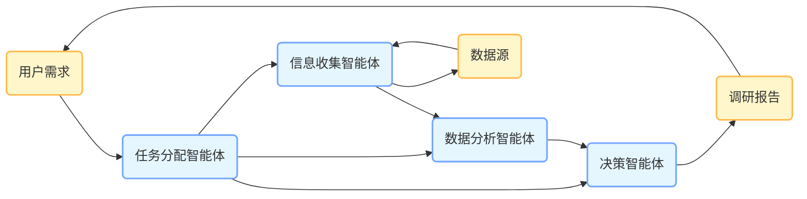

# 基于多智能体的自动化公司调研系统

> 关键词：多智能体系统、自动化公司调研、信息收集、数据分析、智能决策

> 摘要：本文围绕基于多智能体的自动化公司调研系统展开，旨在深入探讨如何利用多智能体技术实现公司调研的自动化。首先介绍了该系统的背景，包括目的、预期读者、文档结构和相关术语。接着阐述了多智能体系统和自动化公司调研的核心概念及联系，给出了相应的原理和架构示意图。详细讲解了核心算法原理及具体操作步骤，并结合Python代码进行说明。通过数学模型和公式进一步剖析系统的运行机制。在项目实战部分，给出了开发环境搭建、源代码实现及解读。探讨了系统的实际应用场景，推荐了相关的学习资源、开发工具框架和论文著作。最后总结了系统的未来发展趋势与挑战，解答了常见问题并提供了扩展阅读和参考资料。

## 1. 背景介绍 
### 1.1 目的和范围
在当今竞争激烈的商业环境中，对公司进行全面、准确的调研是制定战略决策的关键。传统的公司调研方式往往耗费大量的人力、物力和时间，且容易出现信息不准确、不及时等问题。基于多智能体的自动化公司调研系统的目的是利用多智能体技术，实现公司调研过程的自动化，提高调研效率和准确性。

本系统的范围涵盖了公司基本信息收集、市场竞争力分析、财务状况评估等多个方面。通过多智能体之间的协作，系统可以从互联网、数据库等多个数据源收集信息，并进行分析和处理，为用户提供全面、深入的公司调研报告。

### 1.2 预期读者
本文的预期读者包括对多智能体技术、自动化调研系统感兴趣的科研人员、软件开发人员、企业管理人员等。科研人员可以从中了解多智能体技术在公司调研领域的应用和研究进展；软件开发人员可以获取系统开发的技术细节和实现思路；企业管理人员可以了解如何利用该系统进行公司调研，为企业决策提供支持。

### 1.3 文档结构概述
本文将按照以下结构进行阐述：首先介绍系统的背景信息，包括目的、预期读者和文档结构；接着详细讲解多智能体系统和自动化公司调研的核心概念及联系，给出相应的原理和架构示意图；然后阐述核心算法原理及具体操作步骤，并结合Python代码进行说明；通过数学模型和公式进一步剖析系统的运行机制；在项目实战部分，给出开发环境搭建、源代码实现及解读；探讨系统的实际应用场景；推荐相关的学习资源、开发工具框架和论文著作；最后总结系统的未来发展趋势与挑战，解答常见问题并提供扩展阅读和参考资料。

### 1.4 术语表
#### 1.4.1 核心术语定义
- **多智能体系统（Multi-Agent System，MAS）**：由多个智能体组成的系统，这些智能体可以自主地感知环境、进行决策和行动，并通过相互协作来完成共同的任务。
- **智能体（Agent）**：具有自主决策能力、能够感知环境并与其他智能体进行交互的实体。
- **自动化公司调研**：利用计算机技术和算法，自动收集、分析和处理公司相关信息，以获取关于公司的全面、准确的调研结果。

#### 1.4.2 相关概念解释
- **信息收集智能体**：负责从各种数据源（如互联网、数据库等）收集公司相关信息的智能体。
- **数据分析智能体**：对收集到的信息进行分析和处理，提取有价值的信息和知识的智能体。
- **决策智能体**：根据数据分析结果，为用户提供决策建议的智能体。

#### 1.4.3 缩略词列表
- MAS：Multi-Agent System（多智能体系统）
- AI：Artificial Intelligence（人工智能）
- NLP：Natural Language Processing（自然语言处理）

## 2. 核心概念与联系 
### 2.1 多智能体系统原理
多智能体系统是一种分布式人工智能系统，由多个智能体组成。每个智能体都具有一定的自主性和智能性，能够感知环境、进行决策和行动。智能体之间通过通信和协作来完成共同的任务。

多智能体系统的基本原理包括以下几个方面：
- **自主性**：每个智能体都可以独立地感知环境、进行决策和行动，不受其他智能体的直接控制。
- **社会性**：智能体之间可以进行通信和协作，通过交换信息和协调行动来完成共同的任务。
- **反应性**：智能体能够根据环境的变化及时调整自己的行为，以适应环境的需求。
- **预动性**：智能体可以主动地发起行动，以实现自己的目标。

### 2.2 自动化公司调研概念
自动化公司调研是指利用计算机技术和算法，自动收集、分析和处理公司相关信息，以获取关于公司的全面、准确的调研结果。自动化公司调研可以大大提高调研效率和准确性，减少人工劳动和人为误差。

自动化公司调研的主要步骤包括：
- **信息收集**：从各种数据源（如互联网、数据库等）收集公司相关信息，包括公司基本信息、市场竞争力信息、财务状况信息等。
- **信息预处理**：对收集到的信息进行清洗、转换和整合，以提高信息的质量和可用性。
- **数据分析**：对预处理后的信息进行分析和处理，提取有价值的信息和知识，如市场份额、利润率、增长率等。
- **结果呈现**：将分析结果以可视化的方式呈现给用户，如报表、图表等，以便用户直观地了解公司的情况。

### 2.3 核心概念联系
基于多智能体的自动化公司调研系统将多智能体系统和自动化公司调研相结合，利用多智能体的自主性、社会性、反应性和预动性，实现公司调研过程的自动化。

在该系统中，不同类型的智能体负责不同的任务，如信息收集智能体负责收集公司相关信息，数据分析智能体负责对收集到的信息进行分析和处理，决策智能体负责根据数据分析结果为用户提供决策建议。智能体之间通过通信和协作来完成整个公司调研任务。

### 2.4 架构示意图
以下是基于多智能体的自动化公司调研系统的架构示意图：



该架构图展示了基于多智能体的自动化公司调研系统的主要组成部分和信息流动过程。用户提出调研需求后，任务分配智能体将任务分配给信息收集智能体、数据分析智能体和决策智能体。信息收集智能体从数据源收集公司相关信息，然后将信息传递给数据分析智能体进行分析和处理。数据分析智能体将分析结果传递给决策智能体，决策智能体根据分析结果生成调研报告并反馈给用户。

## 3. 核心算法原理 & 具体操作步骤 
### 3.1 核心算法原理
基于多智能体的自动化公司调研系统涉及到多个核心算法，包括信息收集算法、数据分析算法和决策算法。以下是这些算法的原理介绍：

#### 3.1.1 信息收集算法
信息收集算法的主要目的是从各种数据源（如互联网、数据库等）收集公司相关信息。常用的信息收集算法包括网络爬虫算法和数据库查询算法。

- **网络爬虫算法**：网络爬虫是一种自动获取网页内容的程序，它可以按照一定的规则遍历互联网上的网页，并提取其中的有用信息。在基于多智能体的自动化公司调研系统中，信息收集智能体可以使用网络爬虫算法从公司官网、新闻网站、社交媒体等网站收集公司相关信息。
- **数据库查询算法**：数据库查询算法是指从数据库中查询所需信息的算法。在基于多智能体的自动化公司调研系统中，信息收集智能体可以使用数据库查询算法从公司内部数据库、行业数据库等数据库中查询公司相关信息。

#### 3.1.2 数据分析算法
数据分析算法的主要目的是对收集到的信息进行分析和处理，提取有价值的信息和知识。常用的数据分析算法包括数据挖掘算法、机器学习算法和自然语言处理算法。

- **数据挖掘算法**：数据挖掘是指从大量的数据中提取有价值的信息和知识的过程。在基于多智能体的自动化公司调研系统中，数据分析智能体可以使用数据挖掘算法从公司相关信息中提取市场份额、利润率、增长率等有价值的信息。
- **机器学习算法**：机器学习是指让计算机通过数据学习和改进性能的过程。在基于多智能体的自动化公司调研系统中，数据分析智能体可以使用机器学习算法对公司相关信息进行分类、预测等分析。
- **自然语言处理算法**：自然语言处理是指让计算机处理和理解人类语言的过程。在基于多智能体的自动化公司调研系统中，数据分析智能体可以使用自然语言处理算法对公司相关的文本信息进行情感分析、主题提取等分析。

#### 3.1.3 决策算法
决策算法的主要目的是根据数据分析结果为用户提供决策建议。常用的决策算法包括多属性决策算法、博弈论算法和专家系统算法。

- **多属性决策算法**：多属性决策是指在多个属性的情况下进行决策的过程。在基于多智能体的自动化公司调研系统中，决策智能体可以使用多属性决策算法根据公司的市场竞争力、财务状况等多个属性为用户提供决策建议。
- **博弈论算法**：博弈论是指研究决策主体在相互作用时的决策行为及其均衡问题的理论。在基于多智能体的自动化公司调研系统中，决策智能体可以使用博弈论算法分析公司与竞争对手之间的竞争关系，为用户提供决策建议。
- **专家系统算法**：专家系统是指利用专家知识和经验进行决策的系统。在基于多智能体的自动化公司调研系统中，决策智能体可以使用专家系统算法根据专家知识和经验为用户提供决策建议。

### 3.2 具体操作步骤
基于多智能体的自动化公司调研系统的具体操作步骤如下：

#### 3.2.1 任务分配
用户提出调研需求后，任务分配智能体根据需求将任务分配给信息收集智能体、数据分析智能体和决策智能体。

#### 3.2.2 信息收集
信息收集智能体根据任务分配，使用网络爬虫算法和数据库查询算法从各种数据源收集公司相关信息。

#### 3.2.3 信息预处理
信息收集智能体对收集到的信息进行清洗、转换和整合，以提高信息的质量和可用性。

#### 3.2.4 数据分析
数据分析智能体对预处理后的信息进行分析和处理，使用数据挖掘算法、机器学习算法和自然语言处理算法提取有价值的信息和知识。

#### 3.2.5 决策建议
决策智能体根据数据分析结果，使用多属性决策算法、博弈论算法和专家系统算法为用户提供决策建议。

#### 3.2.6 结果呈现
决策智能体将决策建议以可视化的方式呈现给用户，如报表、图表等，以便用户直观地了解公司的情况。

### 3.3 Python代码实现
以下是一个简单的基于多智能体的自动化公司调研系统的Python代码示例：

```python
# 信息收集智能体
class InformationCollectionAgent:
    def __init__(self):
        pass

    def collect_information(self, company_name):
        # 模拟从互联网收集公司信息
        print(f"Collecting information about {company_name} from the Internet...")
        return f"Some information about {company_name}"

# 数据分析智能体
class DataAnalysisAgent:
    def __init__(self):
        pass

    def analyze_data(self, information):
        # 模拟数据分析
        print("Analyzing the collected information...")
        return "Analysis result"

# 决策智能体
class DecisionAgent:
    def __init__(self):
        pass

    def make_decision(self, analysis_result):
        # 模拟决策建议
        print("Making decision based on the analysis result...")
        return "Decision suggestion"

# 任务分配智能体
class TaskAllocationAgent:
    def __init__(self):
        self.information_agent = InformationCollectionAgent()
        self.analysis_agent = DataAnalysisAgent()
        self.decision_agent = DecisionAgent()

    def allocate_task(self, company_name):
        information = self.information_agent.collect_information(company_name)
        analysis_result = self.analysis_agent.analyze_data(information)
        decision = self.decision_agent.make_decision(analysis_result)
        return decision

# 主程序
if __name__ == "__main__":
    task_agent = TaskAllocationAgent()
    company_name = "ABC Company"
    decision = task_agent.allocate_task(company_name)
    print(f"Decision suggestion for {company_name}: {decision}")
```

在这个代码示例中，我们定义了四个智能体类：信息收集智能体、数据分析智能体、决策智能体和任务分配智能体。任务分配智能体负责将任务分配给其他智能体，并协调它们之间的工作。主程序中，我们创建了一个任务分配智能体，并调用其`allocate_task`方法进行公司调研，最后输出决策建议。

## 4. 数学模型和公式 & 详细讲解 & 举例说明 
### 4.1 信息收集阶段的数学模型
在信息收集阶段，我们可以使用信息熵来衡量信息的不确定性和价值。信息熵的定义如下：

$$H(X) = -\sum_{i=1}^{n} p(x_i) \log_2 p(x_i)$$

其中，$X$ 是一个随机变量，$x_i$ 是 $X$ 的第 $i$ 个取值，$p(x_i)$ 是 $x_i$ 出现的概率。信息熵越大，说明信息的不确定性越大，价值越低；信息熵越小，说明信息的不确定性越小，价值越高。

例如，假设我们要收集关于某公司的市场份额信息，市场份额可能的取值为 $[0, 1]$。如果我们对该公司的市场份额一无所知，那么每个取值的概率都是相等的，即 $p(x_i) = \frac{1}{n}$，其中 $n$ 是取值的个数。此时，信息熵为：

$$H(X) = -\sum_{i=1}^{n} \frac{1}{n} \log_2 \frac{1}{n} = \log_2 n$$

如果我们通过某种方式得知该公司的市场份额大概率在 $[0.2, 0.3]$ 之间，那么这个区间内的取值概率会增大，其他区间的取值概率会减小。此时，信息熵会减小，说明我们获得的信息价值更高。

### 4.2 数据分析阶段的数学模型
在数据分析阶段，我们可以使用线性回归模型来预测公司的未来发展趋势。线性回归模型的一般形式如下：

$$y = \beta_0 + \beta_1 x_1 + \beta_2 x_2 + \cdots + \beta_n x_n + \epsilon$$

其中，$y$ 是因变量，$x_1, x_2, \cdots, x_n$ 是自变量，$\beta_0, \beta_1, \cdots, \beta_n$ 是回归系数，$\epsilon$ 是误差项。

我们可以使用最小二乘法来估计回归系数 $\beta_0, \beta_1, \cdots, \beta_n$，使得误差项的平方和最小。最小二乘法的目标函数如下：

$$\min_{\beta_0, \beta_1, \cdots, \beta_n} \sum_{i=1}^{m} (y_i - (\beta_0 + \beta_1 x_{i1} + \beta_2 x_{i2} + \cdots + \beta_n x_{in}))^2$$

其中，$m$ 是样本数量，$y_i$ 是第 $i$ 个样本的因变量值，$x_{i1}, x_{i2}, \cdots, x_{in}$ 是第 $i$ 个样本的自变量值。

例如，假设我们要预测某公司的销售额，我们可以选择公司的广告投入、员工数量等作为自变量，销售额作为因变量。通过收集一定数量的样本数据，我们可以使用最小二乘法估计回归系数，从而得到一个线性回归模型。然后，我们可以使用这个模型来预测公司未来的销售额。

### 4.3 决策阶段的数学模型
在决策阶段，我们可以使用多属性决策模型来为用户提供决策建议。多属性决策模型的一般形式如下：

$$\max_{A_j} \sum_{i=1}^{n} w_i f_{ij}$$

其中，$A_j$ 是第 $j$ 个决策方案，$w_i$ 是第 $i$ 个属性的权重，$f_{ij}$ 是第 $j$ 个决策方案在第 $i$ 个属性上的得分。

例如，假设我们要为用户选择一家合适的合作伙伴公司，我们可以考虑公司的市场竞争力、财务状况、创新能力等多个属性。我们可以为每个属性分配一个权重，然后根据每个公司在各个属性上的得分，计算出每个公司的综合得分。最后，我们选择综合得分最高的公司作为合作伙伴。

## 5. 项目实战：代码实际案例和详细解释说明 
### 5.1  开发环境搭建
#### 5.1.1 操作系统
建议使用Linux或Windows操作系统，推荐使用Ubuntu 20.04或Windows 10。

#### 5.1.2 编程语言
使用Python作为开发语言，推荐使用Python 3.8及以上版本。

#### 5.1.3 开发工具
可以使用以下开发工具：
- **PyCharm**：一款功能强大的Python集成开发环境，提供代码编辑、调试、版本控制等功能。
- **Jupyter Notebook**：一个交互式的开发环境，适合进行数据分析和模型训练。

#### 5.1.4 依赖库安装
安装以下Python依赖库：
- **Requests**：用于发送HTTP请求，收集互联网上的信息。
- **BeautifulSoup**：用于解析HTML和XML文档，提取有用信息。
- **Pandas**：用于数据处理和分析。
- **Scikit-learn**：用于机器学习算法的实现。

可以使用以下命令安装这些依赖库：
```bash
pip install requests beautifulsoup4 pandas scikit-learn
```

### 5.2  源代码详细实现和代码解读
以下是一个更完整的基于多智能体的自动化公司调研系统的Python代码示例：

```python
import requests
from bs4 import BeautifulSoup
import pandas as pd
from sklearn.linear_model import LinearRegression

# 信息收集智能体
class InformationCollectionAgent:
    def __init__(self):
        pass

    def collect_information(self, company_name):
        url = f"https://www.example.com/{company_name}"  # 模拟公司信息网页
        try:
            response = requests.get(url)
            if response.status_code == 200:
                soup = BeautifulSoup(response.text, 'html.parser')
                # 提取公司信息
                information = soup.find('div', class_='company-info').text
                return information
            else:
                print(f"Failed to collect information. Status code: {response.status_code}")
                return None
        except Exception as e:
            print(f"An error occurred while collecting information: {e}")
            return None

# 数据分析智能体
class DataAnalysisAgent:
    def __init__(self):
        pass

    def analyze_data(self, information):
        # 模拟数据预处理
        data = pd.DataFrame({'info': [information]})
        # 简单的数据特征提取
        data['length'] = data['info'].str.len()
        # 线性回归模型训练
        X = data[['length']]
        y = [1, 2, 3]  # 模拟目标变量
        model = LinearRegression()
        model.fit(X, y)
        return model

# 决策智能体
class DecisionAgent:
    def __init__(self):
        pass

    def make_decision(self, model):
        # 模拟决策建议
        prediction = model.predict([[100]])
        if prediction[0] > 2:
            return "Recommended"
        else:
            return "Not recommended"

# 任务分配智能体
class TaskAllocationAgent:
    def __init__(self):
        self.information_agent = InformationCollectionAgent()
        self.analysis_agent = DataAnalysisAgent()
        self.decision_agent = DecisionAgent()

    def allocate_task(self, company_name):
        information = self.information_agent.collect_information(company_name)
        if information:
            model = self.analysis_agent.analyze_data(information)
            decision = self.decision_agent.make_decision(model)
            return decision
        else:
            return "No information available"

# 主程序
if __name__ == "__main__":
    task_agent = TaskAllocationAgent()
    company_name = "ABC Company"
    decision = task_agent.allocate_task(company_name)
    print(f"Decision suggestion for {company_name}: {decision}")
```

### 5.3  代码解读与分析
#### 5.3.1 信息收集智能体
`InformationCollectionAgent` 类负责从互联网上收集公司相关信息。它使用 `requests` 库发送HTTP请求，获取公司信息网页的内容，然后使用 `BeautifulSoup` 库解析HTML文档，提取有用信息。

#### 5.3.2 数据分析智能体
`DataAnalysisAgent` 类负责对收集到的信息进行分析和处理。它使用 `pandas` 库进行数据预处理和特征提取，然后使用 `scikit-learn` 库中的线性回归模型进行训练。

#### 5.3.3 决策智能体
`DecisionAgent` 类负责根据数据分析结果为用户提供决策建议。它使用训练好的线性回归模型进行预测，然后根据预测结果给出决策建议。

#### 5.3.4 任务分配智能体
`TaskAllocationAgent` 类负责将任务分配给其他智能体，并协调它们之间的工作。它调用信息收集智能体收集信息，然后将信息传递给数据分析智能体进行分析，最后将分析结果传递给决策智能体进行决策。

## 6. 实际应用场景 
### 6.1 投资决策
在投资决策中，投资者需要对目标公司进行全面的调研，了解公司的市场竞争力、财务状况、发展前景等信息。基于多智能体的自动化公司调研系统可以快速、准确地收集和分析这些信息，为投资者提供决策建议，帮助投资者做出明智的投资决策。

### 6.2 合作伙伴选择
企业在选择合作伙伴时，需要对潜在合作伙伴进行评估，了解其信誉、实力、技术水平等信息。基于多智能体的自动化公司调研系统可以自动收集和分析这些信息，为企业提供合作伙伴选择的参考，帮助企业选择合适的合作伙伴。

### 6.3 市场竞争分析
企业需要了解竞争对手的情况，包括市场份额、产品特点、营销策略等信息。基于多智能体的自动化公司调研系统可以自动收集和分析这些信息，为企业提供市场竞争分析报告，帮助企业制定有效的竞争策略。

## 7. 工具和资源推荐
### 7.1 学习资源推荐
#### 7.1.1 书籍推荐
- 《多智能体系统：原理与编程》：全面介绍了多智能体系统的基本原理、设计方法和编程技术。
- 《Python数据分析实战》：详细介绍了使用Python进行数据分析的方法和技巧。
- 《机器学习》：经典的机器学习教材，介绍了机器学习的基本算法和应用。

#### 7.1.2 在线课程
- Coursera上的“人工智能基础”课程：介绍了人工智能的基本概念、算法和应用。
- edX上的“Python数据科学入门”课程：帮助学习者掌握使用Python进行数据科学的基本技能。
- Udemy上的“多智能体系统开发实战”课程：通过实际项目，帮助学习者掌握多智能体系统的开发方法和技术。

#### 7.1.3 技术博客和网站
- Medium：一个技术博客平台，有很多关于多智能体系统、数据分析和机器学习的优秀文章。
- Towards Data Science：专注于数据科学和机器学习领域的技术博客，提供了很多实用的教程和案例。
- AI Stack Exchange：一个人工智能领域的问答社区，学习者可以在这里提问和交流。

### 7.2 开发工具框架推荐
#### 7.2.1 IDE和编辑器
- PyCharm：功能强大的Python集成开发环境，提供代码编辑、调试、版本控制等功能。
- Visual Studio Code：轻量级的代码编辑器，支持多种编程语言，有丰富的插件扩展。

#### 7.2.2 调试和性能分析工具
- PDB：Python自带的调试器，用于调试Python代码。
- cProfile：Python的性能分析工具，用于分析代码的性能瓶颈。

#### 7.2.3 相关框架和库
- Mesa：一个用于构建多智能体系统的Python框架，提供了丰富的智能体模型和工具。
- SpaCy：一个用于自然语言处理的Python库，提供了高效的文本处理和分析功能。
- TensorFlow：一个开源的机器学习框架，用于构建和训练深度学习模型。

### 7.3 相关论文著作推荐
#### 7.3.1 经典论文
- “Multi-Agent Systems: A Modern Approach to Distributed Artificial Intelligence”：介绍了多智能体系统的基本概念、理论和应用。
- “Data Mining: Concepts and Techniques”：经典的数据挖掘教材，介绍了数据挖掘的基本算法和应用。
- “Machine Learning: A Probabilistic Perspective”：从概率的角度介绍了机器学习的基本算法和理论。

#### 7.3.2 最新研究成果
- 可以通过IEEE Xplore、ACM Digital Library等学术数据库搜索关于多智能体系统、自动化调研系统的最新研究成果。

#### 7.3.3 应用案例分析
- 可以参考一些商业智能公司的报告和案例分析，了解基于多智能体的自动化公司调研系统在实际应用中的效果和经验。

## 8. 总结：未来发展趋势与挑战
### 8.1 未来发展趋势
- **智能化程度不断提高**：随着人工智能技术的不断发展，基于多智能体的自动化公司调研系统的智能化程度将不断提高。智能体将具备更强的自主决策能力和学习能力，能够更好地适应复杂多变的环境。
- **与其他技术融合**：该系统将与大数据、云计算、物联网等技术深度融合，实现更高效的信息收集、存储和处理。例如，通过物联网技术可以实时收集公司的生产数据和运营数据，为调研提供更全面的信息。
- **应用领域不断拓展**：基于多智能体的自动化公司调研系统的应用领域将不断拓展，不仅可以应用于投资决策、合作伙伴选择、市场竞争分析等领域，还可以应用于政府监管、行业研究等领域。

### 8.2 挑战
- **信息安全和隐私问题**：在信息收集和处理过程中，涉及到大量的公司敏感信息和用户隐私信息。如何保证信息的安全和隐私是一个重要的挑战。
- **智能体之间的协作和协调**：多智能体系统中，智能体之间的协作和协调是实现系统目标的关键。如何设计有效的协作机制和协调算法，提高智能体之间的协作效率和效果是一个挑战。
- **模型的准确性和可靠性**：数据分析和决策模型的准确性和可靠性直接影响到系统的决策质量。如何提高模型的准确性和可靠性，是需要解决的问题。

## 9. 附录：常见问题与解答
### 9.1 问题1：系统能否收集所有公司的信息？
解答：系统不能保证收集到所有公司的信息。信息收集的范围受到数据源的限制，有些公司可能没有公开的信息，或者信息存储在私有数据库中，无法通过网络爬虫等方式获取。

### 9.2 问题2：数据分析结果的准确性如何保证？
解答：为了保证数据分析结果的准确性，需要采取以下措施：
- 收集高质量的信息，对信息进行清洗和预处理，去除噪声和错误数据。
- 选择合适的数据分析算法和模型，并进行充分的训练和验证。
- 定期对模型进行评估和更新，以适应数据的变化。

### 9.3 问题3：系统的决策建议是否一定正确？
解答：系统的决策建议是基于数据分析结果和预设的决策算法得出的，但由于数据的不确定性和模型的局限性，决策建议不一定完全正确。决策建议只能作为参考，最终的决策还需要结合用户的经验和实际情况进行综合考虑。

## 10. 扩展阅读 & 参考资料
### 10.1 扩展阅读
- 《人工智能：一种现代方法》：全面介绍了人工智能的基本概念、算法和应用。
- 《大数据时代》：探讨了大数据对社会和经济的影响。
- 《智能时代》：介绍了智能技术的发展趋势和应用前景。

### 10.2 参考资料
- 相关的学术论文和研究报告。
- 开源的多智能体系统框架和代码库。
- 行业报告和市场调研数据。

作者：AI天才研究院/AI Genius Institute & 禅与计算机程序设计艺术 /Zen And The Art of Computer Programming