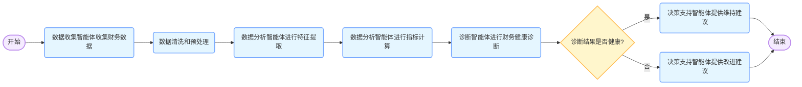

# 基于多智能体的自动化公司财务健康诊断系统

> 关键词：多智能体系统、自动化、公司财务健康诊断、财务指标分析、智能决策

> 摘要：本文围绕基于多智能体的自动化公司财务健康诊断系统展开，详细介绍了该系统的背景、核心概念、算法原理、数学模型、项目实战、实际应用场景等内容。通过多智能体技术实现对公司财务数据的自动化收集、分析和诊断，能够更高效、准确地评估公司的财务健康状况，为企业决策提供有力支持。同时，文章还推荐了相关的学习资源、开发工具和论文著作，最后对系统的未来发展趋势与挑战进行了总结，并提供了常见问题解答和扩展阅读参考资料。

## 1. 背景介绍 
### 1.1 目的和范围
公司财务健康状况是企业生存和发展的关键因素之一。准确、及时地诊断公司的财务健康状况，有助于企业管理者制定合理的决策，投资者做出明智的投资选择，债权人评估信用风险等。传统的财务健康诊断方法往往依赖于人工分析，存在效率低、主观性强等问题。基于多智能体的自动化公司财务健康诊断系统旨在利用多智能体技术实现财务数据的自动化处理和分析，提高诊断的效率和准确性。

本系统的范围涵盖了公司财务数据的收集、清洗、分析和诊断等多个环节。通过多智能体之间的协作，系统能够对各种财务指标进行综合分析，从而得出公司财务健康状况的评估结果。

### 1.2 预期读者
本文的预期读者包括企业管理者、财务分析师、投资者、债权人以及对多智能体技术和财务健康诊断感兴趣的研究人员和技术爱好者。

### 1.3 文档结构概述
本文将按照以下结构进行组织：
1. **背景介绍**：介绍系统的目的、范围、预期读者和文档结构概述。
2. **核心概念与联系**：阐述多智能体系统、公司财务健康诊断等核心概念，并展示它们之间的联系。
3. **核心算法原理 & 具体操作步骤**：详细讲解系统中使用的核心算法，并给出具体的操作步骤。
4. **数学模型和公式 & 详细讲解 & 举例说明**：介绍系统中使用的数学模型和公式，并通过具体例子进行说明。
5. **项目实战：代码实际案例和详细解释说明**：给出一个基于Python的项目实战案例，包括开发环境搭建、源代码实现和代码解读。
6. **实际应用场景**：介绍系统在不同场景下的实际应用。
7. **工具和资源推荐**：推荐相关的学习资源、开发工具和论文著作。
8. **总结：未来发展趋势与挑战**：总结系统的未来发展趋势和面临的挑战。
9. **附录：常见问题与解答**：解答一些常见的问题。
10. **扩展阅读 & 参考资料**：提供相关的扩展阅读和参考资料。

### 1.4 术语表
#### 1.4.1 核心术语定义
- **多智能体系统（Multi - Agent System, MAS）**：由多个智能体组成的系统，这些智能体能够通过交互和协作完成复杂的任务。
- **智能体（Agent）**：具有自主性、反应性、社会性和主动性的实体，能够感知环境并根据自身的目标和知识采取行动。
- **公司财务健康诊断**：通过对公司财务数据的分析和评估，判断公司的财务状况是否健康。
- **财务指标**：用于衡量公司财务状况的各种指标，如偿债能力指标、盈利能力指标、营运能力指标等。

#### 1.4.2 相关概念解释
- **数据清洗**：对收集到的财务数据进行预处理，去除噪声、缺失值和异常值等。
- **特征提取**：从财务数据中提取能够反映公司财务健康状况的特征。
- **分类算法**：用于将公司的财务健康状况分为不同的类别，如健康、亚健康、不健康等。

#### 1.4.3 缩略词列表
- **MAS**：Multi - Agent System（多智能体系统）
- **PCA**：Principal Component Analysis（主成分分析）
- **SVM**：Support Vector Machine（支持向量机）

## 2. 核心概念与联系 

### 核心概念原理
#### 多智能体系统
多智能体系统由多个智能体组成，每个智能体都有自己的目标、知识和能力。智能体之间通过通信和协作来完成复杂的任务。在基于多智能体的自动化公司财务健康诊断系统中，不同的智能体可以负责不同的任务，如数据收集智能体负责收集公司的财务数据，数据分析智能体负责对财务数据进行分析，诊断智能体负责根据分析结果给出诊断结论。

#### 公司财务健康诊断
公司财务健康诊断是通过对公司的财务数据进行分析和评估，判断公司的财务状况是否健康。常用的财务指标包括偿债能力指标（如资产负债率、流动比率等）、盈利能力指标（如净资产收益率、毛利率等）、营运能力指标（如存货周转率、应收账款周转率等）。通过对这些指标的综合分析，可以得出公司的财务健康状况。

### 架构的文本示意图
```plaintext
|-----------------------|
| 多智能体系统         |
|-----------------------|
| 数据收集智能体        |
| 数据分析智能体        |
| 诊断智能体            |
| 决策支持智能体        |
|-----------------------|
| 公司财务数据          |
|-----------------------|
```

### Mermaid 流程图


## 3. 核心算法原理 & 具体操作步骤 

### 核心算法原理
#### 主成分分析（PCA）
主成分分析是一种常用的数据降维方法，它可以将高维数据转换为低维数据，同时保留数据的主要信息。在公司财务健康诊断中，财务指标往往具有较高的维度，通过PCA可以减少数据的维度，降低计算复杂度。

PCA的基本思想是找到数据的主成分，即数据方差最大的方向。通过将数据投影到主成分上，可以实现数据的降维。

#### 支持向量机（SVM）
支持向量机是一种常用的分类算法，它可以将数据分为不同的类别。在公司财务健康诊断中，SVM可以用于将公司的财务健康状况分为健康、亚健康、不健康等不同的类别。

SVM的基本思想是找到一个最优的超平面，使得不同类别的数据点到该超平面的距离最大。

### 具体操作步骤
#### 数据收集
使用数据收集智能体收集公司的财务数据，包括资产负债表、利润表、现金流量表等。

#### 数据清洗和预处理
对收集到的财务数据进行清洗和预处理，去除噪声、缺失值和异常值等。可以使用均值填充、中位数填充等方法处理缺失值，使用Z - score方法处理异常值。

#### 特征提取
使用主成分分析（PCA）对财务数据进行特征提取，减少数据的维度。

```python
import numpy as np
from sklearn.decomposition import PCA

# 假设X是财务数据矩阵，每一行代表一个样本，每一列代表一个特征
X = np.array([[1, 2, 3], [4, 5, 6], [7, 8, 9]])

# 创建PCA对象，指定降维后的维度为2
pca = PCA(n_components=2)

# 对数据进行降维
X_pca = pca.fit_transform(X)

print("降维后的数据：", X_pca)
```

#### 指标计算
计算各种财务指标，如偿债能力指标、盈利能力指标、营运能力指标等。

#### 分类诊断
使用支持向量机（SVM）对公司的财务健康状况进行分类诊断。

```python
from sklearn import svm
from sklearn.model_selection import train_test_split
from sklearn.metrics import accuracy_score

# 假设X是特征矩阵，y是标签向量
X = np.array([[1, 2], [2, 3], [3, 4], [4, 5]])
y = np.array([0, 0, 1, 1])

# 划分训练集和测试集
X_train, X_test, y_train, y_test = train_test_split(X, y, test_size=0.2, random_state=42)

# 创建SVM分类器
clf = svm.SVC(kernel='linear')

# 训练模型
clf.fit(X_train, y_train)

# 预测
y_pred = clf.predict(X_test)

# 计算准确率
accuracy = accuracy_score(y_test, y_pred)
print("准确率：", accuracy)
```

## 4. 数学模型和公式 & 详细讲解 & 举例说明 

### 主成分分析（PCA）
#### 数学模型和公式
设原始数据矩阵为 $X \in \mathbb{R}^{n \times m}$，其中 $n$ 是样本数量，$m$ 是特征数量。PCA的目标是找到一组正交的单位向量 $w_1, w_2, \cdots, w_k$（$k \leq m$），使得数据在这些向量上的投影方差最大。

首先，计算数据的协方差矩阵 $S$：
$$S = \frac{1}{n - 1} X^T X$$

然后，求解协方差矩阵 $S$ 的特征值和特征向量：
$$S w_i = \lambda_i w_i$$
其中，$\lambda_i$ 是特征值，$w_i$ 是对应的特征向量。

将特征值从大到小排序，选择前 $k$ 个特征值对应的特征向量 $w_1, w_2, \cdots, w_k$，组成投影矩阵 $W = [w_1, w_2, \cdots, w_k]$。

最后，将原始数据 $X$ 投影到投影矩阵 $W$ 上，得到降维后的数据 $Z$：
$$Z = X W$$

#### 详细讲解
PCA的核心思想是通过找到数据的主成分，将数据投影到主成分上，从而实现数据的降维。主成分是数据方差最大的方向，通过保留数据的主要信息，可以在减少数据维度的同时，尽可能地保留数据的特征。

#### 举例说明
假设有一组二维数据 $X = \begin{bmatrix} 1 & 2 \\ 2 & 3 \\ 3 & 4 \\ 4 & 5 \end{bmatrix}$，我们要将其降维到一维。

首先，计算数据的协方差矩阵 $S$：
$$S = \frac{1}{4 - 1} \begin{bmatrix} 1 & 2 \\ 2 & 3 \\ 3 & 4 \\ 4 & 5 \end{bmatrix}^T \begin{bmatrix} 1 & 2 \\ 2 & 3 \\ 3 & 4 \\ 4 & 5 \end{bmatrix} = \frac{1}{3} \begin{bmatrix} 30 & 35 \\ 35 & 40 \end{bmatrix}$$

然后，求解协方差矩阵 $S$ 的特征值和特征向量：
特征值 $\lambda_1 \approx 23.33$，对应的特征向量 $w_1 = \begin{bmatrix} 0.707 \\ 0.707 \end{bmatrix}$；
特征值 $\lambda_2 \approx 0.00$，对应的特征向量 $w_2 = \begin{bmatrix} -0.707 \\ 0.707 \end{bmatrix}$。

选择特征值最大的特征向量 $w_1$ 作为投影矩阵 $W$，将原始数据 $X$ 投影到 $W$ 上，得到降维后的数据 $Z$：
$$Z = X W = \begin{bmatrix} 1 & 2 \\ 2 & 3 \\ 3 & 4 \\ 4 & 5 \end{bmatrix} \begin{bmatrix} 0.707 \\ 0.707 \end{bmatrix} = \begin{bmatrix} 2.121 \\ 3.535 \\ 4.949 \\ 6.363 \end{bmatrix}$$

### 支持向量机（SVM）
#### 数学模型和公式
对于二分类问题，假设训练数据集为 $\{(x_1, y_1), (x_2, y_2), \cdots, (x_n, y_n)\}$，其中 $x_i \in \mathbb{R}^m$ 是特征向量，$y_i \in \{-1, 1\}$ 是标签。

SVM的目标是找到一个最优的超平面 $w^T x + b = 0$，使得不同类别的数据点到该超平面的距离最大。

优化问题可以表示为：
$$\min_{w, b} \frac{1}{2} \|w\|^2$$
$$\text{s.t. } y_i (w^T x_i + b) \geq 1, i = 1, 2, \cdots, n$$

引入拉格朗日乘子 $\alpha_i \geq 0$，构造拉格朗日函数：
$$L(w, b, \alpha) = \frac{1}{2} \|w\|^2 - \sum_{i = 1}^{n} \alpha_i (y_i (w^T x_i + b) - 1)$$

对 $w$ 和 $b$ 求偏导数并令其为0，得到：
$$w = \sum_{i = 1}^{n} \alpha_i y_i x_i$$
$$\sum_{i = 1}^{n} \alpha_i y_i = 0$$

将上述结果代入拉格朗日函数，得到对偶问题：
$$\max_{\alpha} \sum_{i = 1}^{n} \alpha_i - \frac{1}{2} \sum_{i = 1}^{n} \sum_{j = 1}^{n} \alpha_i \alpha_j y_i y_j x_i^T x_j$$
$$\text{s.t. } \sum_{i = 1}^{n} \alpha_i y_i = 0$$
$$\alpha_i \geq 0, i = 1, 2, \cdots, n$$

求解对偶问题得到最优的拉格朗日乘子 $\alpha^*$，进而得到最优的 $w^*$ 和 $b^*$。

对于新的数据点 $x$，其分类结果为：
$$\text{sign}(w^{*T} x + b^*)$$

#### 详细讲解
SVM的核心思想是找到一个最优的超平面，使得不同类别的数据点到该超平面的距离最大。通过引入拉格朗日乘子，将原问题转化为对偶问题进行求解。在求解对偶问题时，只需要计算数据点之间的内积，因此可以使用核函数来处理非线性分类问题。

#### 举例说明
假设有一组二维数据 $\{(x_1, y_1), (x_2, y_2), (x_3, y_3), (x_4, y_4)\}$，其中 $x_1 = \begin{bmatrix} 1 \\ 2 \end{bmatrix}$，$y_1 = -1$；$x_2 = \begin{bmatrix} 2 \\ 3 \end{bmatrix}$，$y_2 = -1$；$x_3 = \begin{bmatrix} 3 \\ 4 \end{bmatrix}$，$y_3 = 1$；$x_4 = \begin{bmatrix} 4 \\ 5 \end{bmatrix}$，$y_4 = 1$。

我们可以使用Python的 `sklearn` 库来实现SVM分类：
```python
from sklearn import svm

# 训练数据
X = [[1, 2], [2, 3], [3, 4], [4, 5]]
y = [-1, -1, 1, 1]

# 创建SVM分类器
clf = svm.SVC(kernel='linear')

# 训练模型
clf.fit(X, y)

# 新的数据点
new_x = [[2.5, 3.5]]

# 预测
prediction = clf.predict(new_x)
print("预测结果：", prediction)
```

## 5. 项目实战：代码实际案例和详细解释说明 

### 5.1  开发环境搭建
#### 安装Python
首先，需要安装Python。可以从Python官方网站（https://www.python.org/downloads/） 下载适合自己操作系统的Python版本，并按照安装向导进行安装。

#### 安装必要的库
使用 `pip` 安装必要的库，包括 `numpy`、`pandas`、`sklearn` 等。
```bash
pip install numpy pandas sklearn
```

### 5.2  源代码详细实现和代码解读
```python
import numpy as np
import pandas as pd
from sklearn.decomposition import PCA
from sklearn.svm import SVC
from sklearn.model_selection import train_test_split
from sklearn.metrics import accuracy_score

# 步骤1：数据收集和预处理
# 假设我们有一个包含财务指标的CSV文件
data = pd.read_csv('financial_data.csv')

# 分离特征和标签
X = data.drop('label', axis=1).values
y = data['label'].values

# 步骤2：数据清洗和预处理
# 处理缺失值，这里使用均值填充
X = np.nan_to_num(X, nan=np.nanmean(X))

# 步骤3：特征提取
# 使用PCA进行特征提取
pca = PCA(n_components=2)
X_pca = pca.fit_transform(X)

# 步骤4：划分训练集和测试集
X_train, X_test, y_train, y_test = train_test_split(X_pca, y, test_size=0.2, random_state=42)

# 步骤5：创建SVM分类器并训练模型
clf = SVC(kernel='linear')
clf.fit(X_train, y_train)

# 步骤6：预测和评估
y_pred = clf.predict(X_test)
accuracy = accuracy_score(y_test, y_pred)
print("准确率：", accuracy)
```

### 5.3  代码解读与分析
#### 数据收集和预处理
使用 `pandas` 库读取包含财务指标的CSV文件，并分离特征和标签。

#### 数据清洗和预处理
使用 `np.nan_to_num` 函数处理缺失值，将缺失值填充为特征的均值。

#### 特征提取
使用 `PCA` 类进行特征提取，将特征维度降为2。

#### 划分训练集和测试集
使用 `train_test_split` 函数将数据集划分为训练集和测试集，测试集占比为20%。

#### 创建SVM分类器并训练模型
使用 `SVC` 类创建一个线性核的SVM分类器，并使用训练集进行训练。

#### 预测和评估
使用训练好的模型对测试集进行预测，并使用 `accuracy_score` 函数计算预测准确率。

## 6. 实际应用场景 
### 企业内部管理
企业管理者可以使用基于多智能体的自动化公司财务健康诊断系统实时监控公司的财务状况，及时发现潜在的财务风险，并采取相应的措施进行调整。例如，当系统诊断出公司的偿债能力指标下降时，管理者可以及时调整资金策略，优化债务结构。

### 投资者决策
投资者可以利用该系统对目标公司的财务健康状况进行评估，从而做出更明智的投资决策。通过分析公司的盈利能力、营运能力等指标，投资者可以判断公司的发展潜力和投资价值。

### 债权人评估
债权人在决定是否向公司提供贷款时，可以使用该系统评估公司的偿债能力和信用风险。系统可以提供客观的评估结果，帮助债权人降低贷款风险。

### 监管机构监管
监管机构可以使用该系统对企业的财务状况进行监管，及时发现企业的违规行为和财务风险。通过对多家企业的财务数据进行分析，监管机构可以更好地维护市场秩序。

## 7. 工具和资源推荐
### 7.1 学习资源推荐
#### 7.1.1 书籍推荐
- 《Python机器学习》：介绍了Python在机器学习领域的应用，包括数据预处理、模型选择、评估等内容。
- 《多智能体系统：原理与编程》：详细介绍了多智能体系统的基本原理和编程方法。
- 《财务管理学》：涵盖了公司财务管理的各个方面，包括财务分析、预算管理、投资决策等。

#### 7.1.2 在线课程
- Coursera上的“机器学习”课程：由斯坦福大学教授Andrew Ng主讲，是机器学习领域的经典课程。
- edX上的“人工智能基础”课程：介绍了人工智能的基本概念、算法和应用。
- 中国大学MOOC上的“财务管理”课程：由国内知名高校的教授授课，系统地介绍了财务管理的理论和方法。

#### 7.1.3 技术博客和网站
- Medium：有许多关于机器学习、多智能体系统和财务管理的技术文章。
- 知乎：可以在上面找到相关领域的专家和爱好者的分享和讨论。
- 开源中国：提供了大量的开源项目和技术文章。

### 7.2 开发工具框架推荐
#### 7.2.1 IDE和编辑器
- PyCharm：是一款专门为Python开发设计的集成开发环境，具有代码编辑、调试、版本控制等功能。
- Jupyter Notebook：是一个交互式的开发环境，适合进行数据分析和模型实验。
- Visual Studio Code：是一款轻量级的代码编辑器，支持多种编程语言和插件扩展。

#### 7.2.2 调试和性能分析工具
- PDB：Python自带的调试工具，可以帮助开发者定位和解决代码中的问题。
- cProfile：Python的性能分析工具，可以分析代码的运行时间和函数调用情况。
- TensorBoard：用于可视化深度学习模型的训练过程和性能指标。

#### 7.2.3 相关框架和库
- NumPy：是Python中用于科学计算的基础库，提供了高效的数组操作和数学函数。
- Pandas：用于数据处理和分析，提供了数据结构和数据操作工具。
- Scikit - learn：是Python中常用的机器学习库，提供了各种机器学习算法和工具。

### 7.3 相关论文著作推荐
#### 7.3.1 经典论文
- “Support - Vector Networks”：介绍了支持向量机的基本原理和算法。
- “Principal Component Analysis”：详细阐述了主成分分析的理论和方法。
- “Multi - Agent Systems: A Modern Approach to Distributed Artificial Intelligence”：是多智能体系统领域的经典著作。

#### 7.3.2 最新研究成果
- 可以通过IEEE Xplore、ACM Digital Library等学术数据库搜索关于多智能体系统和公司财务健康诊断的最新研究成果。

#### 7.3.3 应用案例分析
- 一些商业期刊和研究报告中会有关于公司财务健康诊断系统的应用案例分析，可以从中学习实际应用中的经验和方法。

## 8. 总结：未来发展趋势与挑战
### 未来发展趋势
#### 与大数据和人工智能技术的深度融合
随着大数据和人工智能技术的不断发展，基于多智能体的自动化公司财务健康诊断系统将与这些技术深度融合。通过收集更多的财务数据和非财务数据，系统可以更全面地评估公司的财务健康状况。同时，利用深度学习等人工智能技术，可以提高诊断的准确性和智能化水平。

#### 实时监测和预警功能的增强
未来的系统将具备更强的实时监测和预警功能。通过实时收集和分析公司的财务数据，系统可以及时发现潜在的财务风险，并向企业管理者和相关人员发出预警。这有助于企业及时采取措施，避免财务危机的发生。

#### 跨行业和跨领域的应用拓展
该系统不仅可以应用于传统的金融和企业领域，还可以拓展到其他行业和领域，如医疗、教育、政府等。通过对不同行业和领域的财务数据进行分析，系统可以为这些行业和领域的决策提供支持。

### 挑战
#### 数据质量和安全性问题
数据质量是影响系统诊断准确性的关键因素之一。在实际应用中，财务数据可能存在噪声、缺失值和异常值等问题，需要进行有效的数据清洗和预处理。同时，财务数据涉及企业的机密信息，数据安全性也是一个重要的挑战。

#### 多智能体协作和协调问题
多智能体系统中智能体之间的协作和协调是一个复杂的问题。不同的智能体可能有不同的目标和策略，如何保证智能体之间的有效协作和协调，是系统设计和实现的难点之一。

#### 模型的可解释性问题
一些人工智能模型，如深度学习模型，具有较高的预测准确性，但模型的可解释性较差。在公司财务健康诊断中，决策者往往需要了解模型的决策依据，因此如何提高模型的可解释性是一个需要解决的问题。

## 9. 附录：常见问题与解答
### 问题1：多智能体系统中的智能体是如何通信的？
智能体之间的通信可以通过消息传递机制实现。常见的消息传递方式包括基于网络协议的通信（如HTTP、TCP/IP等）和基于中间件的通信（如RabbitMQ、Kafka等）。智能体可以通过发送和接收消息来交换信息和协调行动。

### 问题2：如何选择合适的财务指标进行分析？
选择合适的财务指标需要考虑多个因素，如行业特点、公司规模、分析目的等。一般来说，可以选择偿债能力指标、盈利能力指标、营运能力指标等作为主要的分析指标。同时，还可以根据具体情况选择一些其他的指标进行补充分析。

### 问题3：系统的诊断结果是否准确可靠？
系统的诊断结果的准确性和可靠性取决于多个因素，如数据质量、算法选择、模型训练等。为了提高诊断结果的准确性和可靠性，需要保证数据的质量，选择合适的算法和模型，并进行充分的模型训练和评估。

### 问题4：如何对系统进行优化和改进？
可以从以下几个方面对系统进行优化和改进：
- 数据方面：收集更多高质量的数据，进行更有效的数据清洗和预处理。
- 算法方面：尝试不同的算法和模型，选择最优的算法和模型组合。
- 模型训练方面：调整模型的参数，进行更多的模型训练和评估。
- 系统架构方面：优化多智能体系统的架构，提高智能体之间的协作和协调效率。

## 10. 扩展阅读 & 参考资料
### 扩展阅读
- 《人工智能：一种现代的方法》：全面介绍了人工智能的基本概念、算法和应用。
- 《数据挖掘：概念与技术》：介绍了数据挖掘的基本原理和方法，包括数据预处理、分类、聚类等。
- 《金融数据分析与挖掘》：专门介绍了金融领域的数据分析和挖掘技术。

### 参考资料
- 《多智能体系统理论与应用》
- 《机器学习实战》
- 《Python数据分析实战》

作者：AI天才研究院/AI Genius Institute & 禅与计算机程序设计艺术 /Zen And The Art of Computer Programming