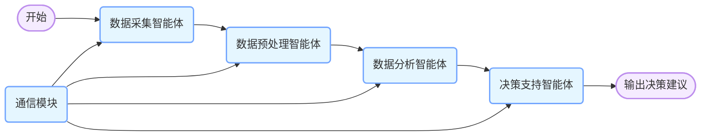

# 基于多智能体的自动化投资者关系分析系统

> 关键词：多智能体系统、自动化投资者关系分析、金融科技、数据挖掘、自然语言处理

> 摘要：本文围绕基于多智能体的自动化投资者关系分析系统展开深入探讨。首先介绍了该系统开发的背景、目的和预期读者，明确文档结构和相关术语。接着阐述了多智能体系统和投资者关系分析的核心概念及其联系，给出了相应的文本示意图和Mermaid流程图。详细讲解了系统所涉及的核心算法原理，并用Python代码进行了实现。同时，介绍了系统背后的数学模型和公式，并举例说明其应用。通过项目实战，展示了开发环境搭建、源代码实现和代码解读的全过程。探讨了系统在实际金融场景中的应用，推荐了学习该系统相关的工具和资源，包括书籍、在线课程、技术博客、开发工具、框架和相关论文等。最后总结了系统未来的发展趋势与挑战，还提供了常见问题解答和扩展阅读参考资料，旨在为金融科技领域的研究者和从业者提供全面且深入的技术指导。

## 1. 背景介绍 
### 1.1 目的和范围
在当今复杂多变的金融市场中，投资者关系管理对于企业的发展至关重要。企业需要及时、准确地了解投资者的需求和反馈，以便做出合理的决策，提升企业的市场形象和价值。传统的投资者关系分析主要依赖人工，效率低下且容易出现主观偏差。因此，开发基于多智能体的自动化投资者关系分析系统具有重要的现实意义。

本系统的目的是利用多智能体技术，实现对投资者关系数据的自动化收集、处理和分析，为企业提供全面、客观、及时的投资者关系信息。系统的范围涵盖了投资者关系的各个方面，包括投资者情绪分析、投资意向预测、投资者行为模式挖掘等。

### 1.2 预期读者
本文的预期读者主要包括金融科技领域的研究者、开发者、企业的投资者关系管理人员以及对人工智能在金融领域应用感兴趣的人员。对于研究者来说，可以从本文中获取系统的技术原理和研究思路；开发者可以参考系统的实现细节进行系统开发；投资者关系管理人员可以了解系统如何帮助他们更好地管理投资者关系；而对人工智能在金融领域应用感兴趣的人员则可以通过本文了解该领域的前沿技术和应用案例。

### 1.3 文档结构概述
本文将按照以下结构进行组织：首先介绍系统开发的背景信息，包括目的、预期读者和文档结构概述以及相关术语。接着阐述多智能体系统和投资者关系分析的核心概念及其联系，给出相应的示意图和流程图。然后详细讲解系统的核心算法原理，并使用Python代码进行实现。之后介绍系统背后的数学模型和公式，并举例说明其应用。通过项目实战，展示系统的开发环境搭建、源代码实现和代码解读。探讨系统在实际金融场景中的应用，推荐相关的学习工具和资源。最后总结系统的未来发展趋势与挑战，提供常见问题解答和扩展阅读参考资料。

### 1.4 术语表
#### 1.4.1 核心术语定义
- **多智能体系统（Multi - Agent System, MAS）**：由多个智能体组成的系统，每个智能体具有一定的自主性、交互性和智能性，能够在一定的环境中自主地完成任务，并与其他智能体进行协作。
- **投资者关系（Investor Relations, IR）**：企业与投资者之间的沟通和互动关系，包括信息披露、投资者咨询、投资者教育等方面。
- **自动化投资者关系分析系统**：利用信息技术和人工智能算法，自动收集、处理和分析投资者关系数据，为企业提供决策支持的系统。

#### 1.4.2 相关概念解释
- **智能体（Agent）**：具有感知、决策和行动能力的实体，能够根据环境的变化自主地做出决策并采取行动。
- **数据挖掘（Data Mining）**：从大量的数据中发现有价值的信息和知识的过程，包括分类、聚类、关联规则挖掘等技术。
- **自然语言处理（Natural Language Processing, NLP）**：研究如何让计算机理解和处理人类语言的技术，包括文本分类、情感分析、信息抽取等任务。

#### 1.4.3 缩略词列表
- MAS：Multi - Agent System（多智能体系统）
- IR：Investor Relations（投资者关系）
- NLP：Natural Language Processing（自然语言处理）

## 2. 核心概念与联系 

### 核心概念原理
#### 多智能体系统原理
多智能体系统由多个智能体组成，每个智能体都有自己的目标、知识和能力。智能体之间可以通过通信机制进行信息交换和协作，以实现共同的目标。智能体的基本结构包括感知器、决策器和执行器。感知器用于感知环境信息，决策器根据感知到的信息和自身的知识做出决策，执行器根据决策采取相应的行动。

#### 投资者关系分析原理
投资者关系分析主要是对投资者与企业之间的互动数据进行分析，包括投资者的言论、行为、投资决策等。通过对这些数据的分析，可以了解投资者的需求、情绪和意向，为企业提供决策支持。分析方法包括数据挖掘、自然语言处理等技术，例如通过文本分类技术对投资者的言论进行分类，通过情感分析技术了解投资者的情绪。

### 架构的文本示意图
基于多智能体的自动化投资者关系分析系统主要由以下几个部分组成：
- **数据采集智能体**：负责从各种渠道收集投资者关系数据，如新闻网站、社交媒体、企业公告等。
- **数据预处理智能体**：对采集到的数据进行清洗、转换和特征提取等预处理操作，以便后续分析。
- **数据分析智能体**：利用数据挖掘和自然语言处理等技术对预处理后的数据进行分析，如投资者情绪分析、投资意向预测等。
- **决策支持智能体**：根据分析结果为企业提供决策建议，如信息披露策略、投资者沟通策略等。
- **通信模块**：负责智能体之间的信息交换和协作。

### Mermaid流程图


## 3. 核心算法原理 & 具体操作步骤 

### 核心算法原理
#### 数据采集算法
数据采集主要使用网络爬虫技术，通过模拟浏览器行为访问网页，提取所需的数据。常见的网络爬虫框架有Scrapy和BeautifulSoup。Scrapy是一个强大的Python爬虫框架，它提供了高效的数据采集和处理功能；BeautifulSoup是一个用于解析HTML和XML文档的Python库，它可以方便地提取网页中的数据。

#### 情感分析算法
情感分析是投资者关系分析中的重要任务，用于判断投资者的情绪是积极、消极还是中性。常用的情感分析算法有基于词典的方法和基于机器学习的方法。基于词典的方法通过预先定义的情感词典，对文本中的词语进行情感打分，然后根据打分结果判断文本的情感倾向；基于机器学习的方法则是通过训练分类器，对文本进行情感分类。

#### 投资意向预测算法
投资意向预测可以使用机器学习中的分类算法，如逻辑回归、决策树、支持向量机等。通过对历史投资数据和投资者特征数据进行训练，建立投资意向预测模型，然后使用该模型对新的投资者数据进行预测。

### 具体操作步骤及Python源代码实现

#### 数据采集步骤及代码
```python
import scrapy

class InvestorNewsSpider(scrapy.Spider):
    name = "investor_news"
    start_urls = ['https://example.com/news']  # 替换为实际的新闻网站URL

    def parse(self, response):
        for news in response.css('div.news-item'):  # 根据实际网页结构修改选择器
            yield {
                'title': news.css('h2::text').get(),
                'content': news.css('p::text').getall()
            }

        next_page = response.css('a.next-page::attr(href)').get()
        if next_page is not None:
            yield response.follow(next_page, self.parse)


```
上述代码使用Scrapy框架实现了一个简单的网络爬虫，用于采集新闻网站上的投资者相关新闻。

#### 情感分析步骤及代码
```python
import nltk
from nltk.sentiment import SentimentIntensityAnalyzer
nltk.download('vader_lexicon')

sia = SentimentIntensityAnalyzer()

def sentiment_analysis(text):
    scores = sia.polarity_scores(text)
    if scores['compound'] >= 0.05:
        return 'positive'
    elif scores['compound'] <= -0.05:
        return 'negative'
    else:
        return 'neutral'

text = "The company's performance is excellent this year."
print(sentiment_analysis(text))


```
上述代码使用NLTK库中的VADER情感分析工具对文本进行情感分析。

#### 投资意向预测步骤及代码
```python
import pandas as pd
from sklearn.model_selection import train_test_split
from sklearn.linear_model import LogisticRegression

# 假设已经有了训练数据
data = pd.read_csv('investment_data.csv')
X = data.drop('investment_intention', axis=1)
y = data['investment_intention']

X_train, X_test, y_train, y_test = train_test_split(X, y, test_size=0.2, random_state=42)

model = LogisticRegression()
model.fit(X_train, y_train)

# 进行预测
new_data = pd.DataFrame({'feature1': [1], 'feature2': [2]})  # 替换为实际的特征数据
prediction = model.predict(new_data)
print(prediction)


```
上述代码使用逻辑回归算法进行投资意向预测。

## 4. 数学模型和公式 & 详细讲解 & 举例说明 

### 逻辑回归数学模型和公式
逻辑回归是一种常用的分类算法，用于解决二分类问题。其数学模型基于逻辑函数（也称为Sigmoid函数），公式如下：

$$
\sigma(z)=\frac{1}{1 + e^{-z}}
$$

其中，$z$ 是线性组合：

$$
z = \theta_0+\theta_1x_1+\theta_2x_2+\cdots+\theta_nx_n=\theta^T x
$$

$\theta$ 是模型的参数向量，$x$ 是输入特征向量。

逻辑回归的目标是找到一组参数 $\theta$，使得模型的预测结果尽可能接近真实标签。通常使用最大似然估计来求解参数，对数似然函数为：

$$
L(\theta)=\sum_{i = 1}^{m}[y^{(i)}\log(\sigma(\theta^T x^{(i)}))+(1 - y^{(i)})\log(1-\sigma(\theta^T x^{(i)}))]
$$

其中，$m$ 是样本数量，$y^{(i)}$ 是第 $i$ 个样本的真实标签。

### 详细讲解
逻辑回归的核心思想是将线性回归的输出通过Sigmoid函数映射到 $[0, 1]$ 区间，从而得到一个概率值。当概率值大于某个阈值（通常为0.5）时，预测为正类；否则预测为负类。

最大似然估计的目标是找到一组参数 $\theta$，使得在这组参数下，样本出现的概率最大。通过对对数似然函数求偏导数，并使用梯度下降等优化算法更新参数，最终得到最优的参数估计。

### 举例说明
假设我们有一个投资意向预测的数据集，包含两个特征：投资者的年龄和年收入。我们使用逻辑回归模型来预测投资者是否有投资意向。

首先，我们需要对数据进行预处理，将特征和标签分离。然后，使用训练数据训练逻辑回归模型，得到最优的参数 $\theta$。

假设我们得到的参数为 $\theta = [\theta_0, \theta_1, \theta_2]=[0.1, 0.2, 0.3]$，对于一个新的投资者，其年龄为30岁，年收入为50万元，将其特征向量 $x = [1, 30, 50]$ 代入 $z = \theta^T x$ 中，得到：

$$
z = 0.1+0.2\times30 + 0.3\times50=0.1 + 6+15 = 21.1
$$

再将 $z$ 代入Sigmoid函数中，得到：

$$
\sigma(z)=\frac{1}{1 + e^{-21.1}}\approx1
$$

由于概率值接近1，我们预测该投资者有投资意向。

## 5. 项目实战：代码实际案例和详细解释说明 

### 5.1  开发环境搭建
#### 操作系统
推荐使用Linux或Windows操作系统，建议使用Ubuntu 18.04及以上版本或Windows 10及以上版本。

#### Python环境
安装Python 3.7及以上版本，可以从Python官方网站（https://www.python.org/downloads/）下载安装包进行安装。

#### 依赖库安装
使用pip工具安装所需的依赖库，命令如下：
```bash
pip install scrapy nltk pandas scikit-learn
```

### 5.2  源代码详细实现和代码解读
#### 完整代码实现
```python
import scrapy
import nltk
from nltk.sentiment import SentimentIntensityAnalyzer
import pandas as pd
from sklearn.model_selection import train_test_split
from sklearn.linear_model import LogisticRegression

# 数据采集部分
class InvestorNewsSpider(scrapy.Spider):
    name = "investor_news"
    start_urls = ['https://example.com/news']  # 替换为实际的新闻网站URL

    def parse(self, response):
        for news in response.css('div.news-item'):  # 根据实际网页结构修改选择器
            yield {
                'title': news.css('h2::text').get(),
                'content': news.css('p::text').getall()
            }

        next_page = response.css('a.next-page::attr(href)').get()
        if next_page is not None:
            yield response.follow(next_page, self.parse)

# 情感分析部分
nltk.download('vader_lexicon')
sia = SentimentIntensityAnalyzer()

def sentiment_analysis(text):
    scores = sia.polarity_scores(text)
    if scores['compound'] >= 0.05:
        return 'positive'
    elif scores['compound'] <= -0.05:
        return 'negative'
    else:
        return 'neutral'

# 投资意向预测部分
def investment_intention_prediction():
    # 假设已经有了训练数据
    data = pd.read_csv('investment_data.csv')
    X = data.drop('investment_intention', axis=1)
    y = data['investment_intention']

    X_train, X_test, y_train, y_test = train_test_split(X, y, test_size=0.2, random_state=42)

    model = LogisticRegression()
    model.fit(X_train, y_train)

    # 进行预测
    new_data = pd.DataFrame({'feature1': [1], 'feature2': [2]})  # 替换为实际的特征数据
    prediction = model.predict(new_data)
    return prediction


if __name__ == "__main__":
    # 数据采集
    # 在命令行中运行 scrapy runspider filename.py 来启动爬虫
    # 情感分析
    text = "The company's performance is excellent this year."
    print("Sentiment analysis result:", sentiment_analysis(text))
    # 投资意向预测
    print("Investment intention prediction result:", investment_intention_prediction())


```

#### 代码解读
- **数据采集部分**：使用Scrapy框架实现了一个简单的网络爬虫，用于采集新闻网站上的投资者相关新闻。通过定义一个Spider类，指定起始URL和解析函数，实现数据的采集和提取。
- **情感分析部分**：使用NLTK库中的VADER情感分析工具对文本进行情感分析。通过调用`SentimentIntensityAnalyzer`类的`polarity_scores`方法，得到文本的情感得分，然后根据得分判断文本的情感倾向。
- **投资意向预测部分**：使用逻辑回归算法进行投资意向预测。首先读取训练数据，将特征和标签分离，然后使用`train_test_split`函数将数据分为训练集和测试集。使用`LogisticRegression`类训练模型，并使用训练好的模型对新的数据进行预测。

### 5.3  代码解读与分析
#### 优点
- **模块化设计**：代码采用模块化设计，将数据采集、情感分析和投资意向预测分为三个独立的部分，提高了代码的可维护性和可扩展性。
- **使用成熟的库**：使用了Scrapy、NLTK和Scikit - learn等成熟的Python库，减少了开发工作量，提高了代码的可靠性。

#### 缺点
- **数据质量依赖**：数据采集部分依赖于网页的结构，如果网页结构发生变化，需要修改选择器。情感分析和投资意向预测的准确性也依赖于数据的质量和数量。
- **模型简单**：投资意向预测使用的逻辑回归模型是一个简单的线性模型，对于复杂的数据集可能效果不佳。

## 6. 实际应用场景 
### 企业投资者关系管理
企业可以使用基于多智能体的自动化投资者关系分析系统来管理与投资者的关系。通过对投资者的言论和行为进行分析，了解投资者的需求和情绪，及时调整信息披露策略和投资者沟通策略，提高投资者的满意度和忠诚度。

### 金融机构投资决策支持
金融机构可以利用该系统对投资者的投资意向进行预测，为投资决策提供支持。通过分析投资者的特征和市场趋势，制定个性化的投资策略，提高投资回报率。

### 监管机构市场监测
监管机构可以使用该系统对金融市场进行监测，及时发现异常的投资者行为和市场波动。通过对投资者关系数据的分析，预警潜在的金融风险，维护金融市场的稳定。

## 7. 工具和资源推荐
### 7.1 学习资源推荐
#### 7.1.1 书籍推荐
- 《Python网络爬虫从入门到实践》：详细介绍了Python网络爬虫的原理和实现方法，适合初学者学习。
- 《自然语言处理入门》：全面介绍了自然语言处理的基本概念、算法和应用，对于学习情感分析等任务有很大帮助。
- 《机器学习》：由周志华教授编写，是机器学习领域的经典教材，系统地介绍了机器学习的基本理论和算法。

#### 7.1.2 在线课程
- Coursera上的“机器学习”课程：由斯坦福大学的Andrew Ng教授授课，是机器学习领域的经典在线课程，内容涵盖了机器学习的各个方面。
- edX上的“自然语言处理”课程：由哥伦比亚大学的教授授课，深入介绍了自然语言处理的前沿技术和应用。

#### 7.1.3 技术博客和网站
- 博客园：是一个技术交流平台，有很多关于Python、机器学习和自然语言处理的技术文章。
- 掘金：专注于技术领域的社区，提供了丰富的技术文章和教程。
- Kaggle：是一个数据科学竞赛平台，上面有很多关于金融数据分析和机器学习的案例和代码。

### 7.2 开发工具框架推荐
#### 7.2.1 IDE和编辑器
- PyCharm：是一款专业的Python集成开发环境，提供了代码编辑、调试、版本控制等功能，适合开发大型Python项目。
- Visual Studio Code：是一款轻量级的代码编辑器，支持多种编程语言，通过安装插件可以实现Python开发的各种功能。

#### 7.2.2 调试和性能分析工具
- PDB：是Python自带的调试器，可以帮助开发者定位代码中的错误。
- cProfile：是Python的性能分析工具，可以分析代码的运行时间和函数调用情况，帮助开发者优化代码性能。

#### 7.2.3 相关框架和库
- Scrapy：是一个强大的Python爬虫框架，用于数据采集。
- NLTK：是一个自然语言处理工具包，提供了丰富的文本处理功能。
- Scikit - learn：是一个机器学习库，提供了各种机器学习算法和工具，方便开发者进行模型训练和评估。

### 7.3 相关论文著作推荐
#### 7.3.1 经典论文
- 《A Mathematical Theory of Communication》：由Claude E. Shannon发表，奠定了信息论的基础，对于理解数据处理和分析有重要意义。
- 《Support - vector networks》：介绍了支持向量机算法，是机器学习领域的经典论文。

#### 7.3.2 最新研究成果
- 《Deep Learning for Sentiment Analysis: A Survey》：综述了深度学习在情感分析领域的最新研究成果。
- 《Multi - Agent Systems for Financial Market Simulation》：探讨了多智能体系统在金融市场模拟中的应用。

#### 7.3.3 应用案例分析
- 《Application of Data Mining in Investor Relations Management》：分析了数据挖掘技术在投资者关系管理中的应用案例。
- 《Using Natural Language Processing to Analyze Investor Sentiment》：介绍了如何使用自然语言处理技术分析投资者情绪的应用案例。

## 8. 总结：未来发展趋势与挑战
### 未来发展趋势
#### 智能化程度不断提高
随着人工智能技术的不断发展，基于多智能体的自动化投资者关系分析系统的智能化程度将不断提高。智能体将具有更强的自主学习和决策能力，能够更好地适应复杂多变的金融市场环境。

#### 与其他技术融合
该系统将与区块链、物联网等技术进行融合。例如，利用区块链技术实现投资者关系数据的安全存储和共享，利用物联网技术获取更多的投资者行为数据，为分析提供更全面的信息。

#### 个性化服务
系统将为企业和投资者提供更加个性化的服务。根据企业的特点和投资者的需求，定制化分析方案和决策建议，提高服务的针对性和有效性。

### 挑战
#### 数据安全和隐私问题
投资者关系数据包含大量的敏感信息，如投资者的个人信息、投资策略等。如何保证数据的安全和隐私是系统面临的重要挑战。需要采用先进的加密技术和访问控制机制，防止数据泄露和滥用。

#### 模型的准确性和可解释性
虽然机器学习和深度学习模型在投资者关系分析中取得了一定的成果，但模型的准确性和可解释性仍然是一个问题。特别是对于一些复杂的模型，如深度学习模型，很难解释其决策过程和结果。需要研究更加准确和可解释的模型，提高分析结果的可信度。

#### 技术更新换代快
人工智能技术发展迅速，新的算法和模型不断涌现。系统需要不断更新和升级，以跟上技术的发展步伐。这对开发者的技术水平和系统的维护能力提出了更高的要求。

## 9. 附录：常见问题与解答
### 问题1：如何提高数据采集的效率？
解答：可以采用分布式爬虫技术，使用多个节点同时进行数据采集，提高采集效率。同时，合理设置爬取间隔时间，避免对目标网站造成过大的压力。

### 问题2：情感分析的准确性如何提高？
解答：可以使用更丰富的情感词典，结合深度学习模型进行训练。同时，对训练数据进行标注和清洗，提高数据的质量。

### 问题3：投资意向预测模型的性能如何评估？
解答：可以使用准确率、召回率、F1值等指标来评估模型的性能。同时，进行交叉验证和模型调优，提高模型的泛化能力。

## 10. 扩展阅读 & 参考资料
### 扩展阅读
- 《人工智能：现代方法》：全面介绍了人工智能的基本概念、算法和应用，是人工智能领域的经典著作。
- 《金融科技：应用与创新》：探讨了金融科技在各个领域的应用和创新，对于了解金融科技的发展趋势有很大帮助。

### 参考资料
- Scrapy官方文档：https://docs.scrapy.org/en/latest/
- NLTK官方文档：https://www.nltk.org/
- Scikit - learn官方文档：https://scikit - learn.org/stable/

作者：AI天才研究院/AI Genius Institute & 禅与计算机程序设计艺术 /Zen And The Art of Computer Programming