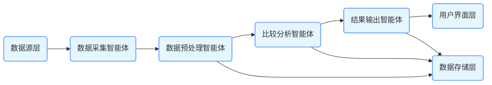

# 基于多智能体的自动化财务报表比较分析系统

> 关键词：多智能体系统、自动化、财务报表、比较分析、人工智能

> 摘要：本文围绕基于多智能体的自动化财务报表比较分析系统展开深入研究。首先介绍了该系统提出的背景，明确其目的、范围、预期读者等内容。详细阐述了多智能体系统的核心概念、与财务报表比较分析的联系，给出了相关原理和架构的文本示意图与 Mermaid 流程图。深入讲解了系统所涉及的核心算法原理，并用 Python 源代码进行详细阐述，同时介绍了相关数学模型和公式。通过项目实战，展示了开发环境搭建、源代码实现与解读。探讨了该系统的实际应用场景，推荐了学习、开发相关的工具和资源，包括书籍、在线课程、技术博客、IDE 等。最后对系统未来发展趋势与挑战进行总结，还包含常见问题解答及扩展阅读参考资料。旨在为财务报表的比较分析提供一种智能化、自动化的解决方案，提高分析效率和准确性。

## 1. 背景介绍 
### 1.1 目的和范围
在当今数字化和全球化的商业环境中，企业面临着海量的财务数据。财务报表作为企业财务状况和经营成果的重要体现，对其进行准确、高效的比较分析至关重要。传统的财务报表比较分析方法往往依赖人工操作，不仅效率低下，而且容易出现人为误差。基于多智能体的自动化财务报表比较分析系统的目的在于利用多智能体技术实现财务报表比较分析的自动化，提高分析的效率和准确性，为企业决策提供更可靠的依据。

本系统的范围涵盖了对不同企业、不同时期的财务报表进行自动化的读取、预处理、比较和分析。可以处理资产负债表、利润表、现金流量表等常见的财务报表，支持多种格式的文件输入，如 Excel、CSV 等。同时，系统还能够生成详细的分析报告，包括财务指标的比较、趋势分析、异常值检测等。

### 1.2 预期读者
本系统的预期读者包括企业的财务管理人员、财务分析师、审计人员等专业人士，他们需要对财务报表进行深入分析以辅助决策。同时，也适合对多智能体技术和财务数据分析感兴趣的研究人员和学生，他们可以通过本系统了解多智能体技术在实际应用中的具体实现方式。

### 1.3 文档结构概述
本文首先介绍系统的背景信息，包括目的、范围、预期读者等。接着阐述多智能体系统的核心概念及其与财务报表比较分析的联系，给出相应的原理和架构示意图。然后详细讲解系统的核心算法原理和具体操作步骤，并用 Python 代码进行实现。之后介绍系统涉及的数学模型和公式，并举例说明。通过项目实战展示系统的开发环境搭建、源代码实现和代码解读。探讨系统的实际应用场景，推荐相关的学习、开发工具和资源。最后对系统的未来发展趋势与挑战进行总结，包含常见问题解答及扩展阅读参考资料。

### 1.4 术语表
#### 1.4.1 核心术语定义
- **多智能体系统（Multi - Agent System，MAS）**：由多个智能体组成的系统，每个智能体具有一定的自主性、智能性和交互能力，它们通过协作完成复杂的任务。
- **财务报表**：企业对外提供的反映企业某一特定日期的财务状况和某一会计期间的经营成果、现金流量等会计信息的文件，主要包括资产负债表、利润表、现金流量表等。
- **比较分析**：对不同对象或同一对象在不同时期的相关数据进行对比，以发现差异、趋势和规律的分析方法。
- **自动化**：在较少人工干预的情况下，系统自动完成一系列任务的过程。

#### 1.4.2 相关概念解释
- **智能体（Agent）**：是一个能够感知环境、自主决策并采取行动的实体。在多智能体系统中，智能体可以是软件程序、机器人等。智能体具有一定的知识和能力，能够根据环境的变化调整自己的行为。
- **财务指标**：用于衡量企业财务状况和经营成果的一系列数值，如资产负债率、毛利率、净利润率等。通过对财务指标的分析，可以全面了解企业的财务状况和经营绩效。

#### 1.4.3 缩略词列表
- **MAS**：Multi - Agent System（多智能体系统）
- **CSV**：Comma - Separated Values（逗号分隔值）

## 2. 核心概念与联系 
### 核心概念原理
多智能体系统是一种分布式人工智能系统，由多个智能体组成。每个智能体具有自己的知识、目标和能力，能够感知环境并自主地做出决策和行动。智能体之间通过通信和协作来完成复杂的任务。

在基于多智能体的自动化财务报表比较分析系统中，不同的智能体可以承担不同的任务。例如，数据采集智能体负责从各种数据源中获取财务报表数据；数据预处理智能体对采集到的数据进行清洗、转换和标准化；比较分析智能体对预处理后的数据进行比较和分析；结果输出智能体将分析结果以可视化的方式呈现给用户。

### 架构的文本示意图
本系统主要由以下几个部分组成：
1. **数据源层**：包含各种财务报表数据的来源，如企业内部的财务系统、外部的数据库、Excel 文件等。
2. **智能体层**：由多个智能体组成，包括数据采集智能体、数据预处理智能体、比较分析智能体、结果输出智能体等。这些智能体通过通信机制进行协作，完成财务报表的比较分析任务。
3. **数据存储层**：用于存储采集到的财务报表数据、预处理后的数据以及分析结果等。可以使用关系型数据库或非关系型数据库。
4. **用户界面层**：为用户提供与系统交互的界面，用户可以通过该界面输入查询条件、查看分析结果等。

### Mermaid 流程图


## 3. 核心算法原理 & 具体操作步骤 
### 核心算法原理
本系统主要涉及以下几个核心算法：
1. **数据清洗算法**：用于去除财务报表数据中的噪声、缺失值和异常值。可以使用统计方法，如均值填充、中位数填充等处理缺失值；使用基于规则的方法或机器学习算法检测和处理异常值。
2. **数据标准化算法**：将不同企业或不同时期的财务报表数据进行标准化处理，使其具有可比性。常用的标准化方法包括 z - score 标准化、min - max 标准化等。
3. **比较分析算法**：对标准化后的财务报表数据进行比较和分析。可以使用差值比较、比率比较等方法计算财务指标的差异；使用趋势分析方法分析财务指标的变化趋势。

### 具体操作步骤
1. **数据采集**：数据采集智能体从数据源层获取财务报表数据。可以通过网络爬虫、数据库接口等方式获取数据。
2. **数据预处理**：数据预处理智能体对采集到的数据进行清洗和标准化处理。具体步骤如下：
    - 检测和处理缺失值：使用均值填充法处理缺失值。
    - 检测和处理异常值：使用基于规则的方法检测异常值，如设定阈值范围，超出范围的值视为异常值，然后进行修正或删除。
    - 数据标准化：使用 z - score 标准化方法对数据进行标准化处理。
3. **比较分析**：比较分析智能体对预处理后的数据进行比较和分析。具体步骤如下：
    - 计算财务指标：根据财务报表数据计算各种财务指标，如资产负债率、毛利率等。
    - 比较财务指标：使用差值比较和比率比较方法比较不同企业或不同时期的财务指标。
    - 趋势分析：使用线性回归等方法分析财务指标的变化趋势。
4. **结果输出**：结果输出智能体将分析结果以可视化的方式呈现给用户。可以使用图表、报表等形式展示分析结果。

### Python 源代码实现
```python
import pandas as pd
import numpy as np
from scipy.stats import zscore

# 数据采集
def data_collection(file_path):
    try:
        data = pd.read_excel(file_path)
        return data
    except Exception as e:
        print(f"数据采集失败: {e}")
        return None

# 数据预处理
def data_preprocessing(data):
    # 处理缺失值
    data.fillna(data.mean(), inplace=True)
    
    # 处理异常值
    for column in data.columns:
        q1 = data[column].quantile(0.25)
        q3 = data[column].quantile(0.75)
        iqr = q3 - q1
        lower_bound = q1 - 1.5 * iqr
        upper_bound = q3 + 1.5 * iqr
        data[column] = np.where((data[column] < lower_bound) | (data[column] > upper_bound), data[column].median(), data[column])
    
    # 数据标准化
    data = data.apply(zscore)
    return data

# 比较分析
def comparison_analysis(data1, data2):
    # 计算财务指标（这里以简单的均值为例）
    mean1 = data1.mean()
    mean2 = data2.mean()
    
    # 差值比较
    diff = mean2 - mean1
    
    # 比率比较
    ratio = mean2 / mean1
    
    return diff, ratio

# 结果输出
def result_output(diff, ratio):
    print("差值比较结果:")
    print(diff)
    print("比率比较结果:")
    print(ratio)

# 主函数
if __name__ == "__main__":
    file_path1 = "financial_statement1.xlsx"
    file_path2 = "financial_statement2.xlsx"
    
    data1 = data_collection(file_path1)
    data2 = data_collection(file_path2)
    
    if data1 is not None and data2 is not None:
        preprocessed_data1 = data_preprocessing(data1)
        preprocessed_data2 = data_preprocessing(data2)
        
        diff, ratio = comparison_analysis(preprocessed_data1, preprocessed_data2)
        
        result_output(diff, ratio)
```

## 4. 数学模型和公式 & 详细讲解 & 举例说明 
### 数据标准化数学模型和公式
#### z - score 标准化
z - score 标准化是一种常用的数据标准化方法，其公式为：
$$z = \frac{x - \mu}{\sigma}$$
其中，$x$ 是原始数据，$\mu$ 是数据的均值，$\sigma$ 是数据的标准差。

详细讲解：z - score 标准化将数据转换为均值为 0，标准差为 1 的标准正态分布。通过这种方式，可以消除数据的量纲影响，使不同特征的数据具有可比性。

举例说明：假设有一组数据 $[1, 2, 3, 4, 5]$，其均值 $\mu = \frac{1 + 2 + 3 + 4 + 5}{5} = 3$，标准差 $\sigma = \sqrt{\frac{(1 - 3)^2 + (2 - 3)^2 + (3 - 3)^2 + (4 - 3)^2 + (5 - 3)^2}{5}} \approx 1.414$。对于数据点 $x = 4$，其标准化后的值 $z = \frac{4 - 3}{1.414} \approx 0.707$。

### 比较分析数学模型和公式
#### 差值比较
差值比较是计算两个数据之间的差值，公式为：
$$\Delta x = x_2 - x_1$$
其中，$x_1$ 和 $x_2$ 是两个待比较的数据。

详细讲解：差值比较可以直观地反映两个数据之间的差异大小。如果差值为正，说明 $x_2$ 大于 $x_1$；如果差值为负，说明 $x_2$ 小于 $x_1$。

举例说明：假设 $x_1 = 10$，$x_2 = 15$，则差值 $\Delta x = 15 - 10 = 5$。

#### 比率比较
比率比较是计算两个数据之间的比率，公式为：
$$r = \frac{x_2}{x_1}$$
其中，$x_1$ 和 $x_2$ 是两个待比较的数据。

详细讲解：比率比较可以反映两个数据之间的相对大小关系。如果比率大于 1，说明 $x_2$ 大于 $x_1$；如果比率小于 1，说明 $x_2$ 小于 $x_1$。

举例说明：假设 $x_1 = 10$，$x_2 = 15$，则比率 $r = \frac{15}{10} = 1.5$。

## 5. 项目实战：代码实际案例和详细解释说明 
### 5.1  开发环境搭建
#### 操作系统
可以选择 Windows、Linux 或 macOS 等主流操作系统。

#### Python 环境
安装 Python 3.x 版本，可以从 Python 官方网站（https://www.python.org/downloads/） 下载并安装。

#### 依赖库安装
使用以下命令安装所需的依赖库：
```sh
pip install pandas numpy scipy
```

### 5.2  源代码详细实现和代码解读
```python
import pandas as pd
import numpy as np
from scipy.stats import zscore

# 数据采集
def data_collection(file_path):
    try:
        data = pd.read_excel(file_path)
        return data
    except Exception as e:
        print(f"数据采集失败: {e}")
        return None

# 数据预处理
def data_preprocessing(data):
    # 处理缺失值
    data.fillna(data.mean(), inplace=True)
    
    # 处理异常值
    for column in data.columns:
        q1 = data[column].quantile(0.25)
        q3 = data[column].quantile(0.75)
        iqr = q3 - q1
        lower_bound = q1 - 1.5 * iqr
        upper_bound = q3 + 1.5 * iqr
        data[column] = np.where((data[column] < lower_bound) | (data[column] > upper_bound), data[column].median(), data[column])
    
    # 数据标准化
    data = data.apply(zscore)
    return data

# 比较分析
def comparison_analysis(data1, data2):
    # 计算财务指标（这里以简单的均值为例）
    mean1 = data1.mean()
    mean2 = data2.mean()
    
    # 差值比较
    diff = mean2 - mean1
    
    # 比率比较
    ratio = mean2 / mean1
    
    return diff, ratio

# 结果输出
def result_output(diff, ratio):
    print("差值比较结果:")
    print(diff)
    print("比率比较结果:")
    print(ratio)

# 主函数
if __name__ == "__main__":
    file_path1 = "financial_statement1.xlsx"
    file_path2 = "financial_statement2.xlsx"
    
    data1 = data_collection(file_path1)
    data2 = data_collection(file_path2)
    
    if data1 is not None and data2 is not None:
        preprocessed_data1 = data_preprocessing(data1)
        preprocessed_data2 = data_preprocessing(data2)
        
        diff, ratio = comparison_analysis(preprocessed_data1, preprocessed_data2)
        
        result_output(diff, ratio)
```

代码解读：
1. **数据采集**：`data_collection` 函数使用 `pandas` 库的 `read_excel` 方法从 Excel 文件中读取财务报表数据。如果读取失败，会捕获异常并输出错误信息。
2. **数据预处理**：`data_preprocessing` 函数首先使用均值填充法处理缺失值，然后使用基于四分位数间距（IQR）的方法检测和处理异常值，最后使用 z - score 标准化方法对数据进行标准化处理。
3. **比较分析**：`comparison_analysis` 函数计算两个数据的均值，然后进行差值比较和比率比较。
4. **结果输出**：`result_output` 函数将差值比较和比率比较的结果输出到控制台。
5. **主函数**：在主函数中，指定两个 Excel 文件的路径，调用上述函数完成数据采集、预处理、比较分析和结果输出的整个流程。

### 5.3  代码解读与分析
#### 优点
- **模块化设计**：代码采用模块化设计，将不同的功能封装在不同的函数中，提高了代码的可读性和可维护性。
- **数据预处理**：对缺失值和异常值进行了处理，并进行了数据标准化，保证了数据的质量和可比性。
- **比较分析方法**：使用差值比较和比率比较两种方法，能够从不同角度分析财务报表数据。

#### 缺点
- **财务指标计算简单**：目前仅以均值作为财务指标进行比较，实际应用中可能需要计算更多复杂的财务指标。
- **缺乏可视化**：结果仅输出到控制台，没有进行可视化展示，不利于用户直观地理解分析结果。

## 6. 实际应用场景 
### 企业财务分析
企业内部的财务管理人员可以使用本系统对不同时期的财务报表进行比较分析，了解企业的财务状况和经营成果的变化趋势。例如，