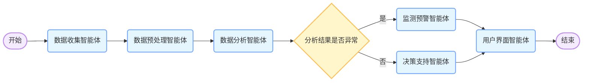

# 基于多智能体的自动化财报分析系统

> 关键词：多智能体系统、自动化财报分析、财务数据处理、智能决策、数据分析

> 摘要：本文围绕基于多智能体的自动化财报分析系统展开深入探讨。首先介绍了该系统的背景，包括目的、预期读者、文档结构等内容。详细阐述了多智能体系统和财报分析的核心概念及其联系，并给出了相应的文本示意图和 Mermaid 流程图。深入讲解了系统所涉及的核心算法原理，通过 Python 代码进行具体说明。同时给出了相关的数学模型和公式，并举例分析。通过项目实战展示了系统的开发环境搭建、源代码实现与解读。列举了系统的实际应用场景，推荐了学习、开发工具以及相关论文著作。最后对系统的未来发展趋势与挑战进行总结，并提供了常见问题解答和扩展阅读的参考资料，旨在为相关领域的研究和实践提供全面而深入的指导。

## 1. 背景介绍 
### 1.1 目的和范围
在当今复杂多变的商业环境中，企业的财务状况是其生存和发展的关键指标。财报分析作为评估企业财务健康状况、盈利能力、偿债能力等的重要手段，对于投资者、管理者、监管机构等利益相关者都具有至关重要的意义。然而，传统的财报分析方法往往依赖于人工处理和分析大量的财务数据，不仅效率低下，而且容易出现人为错误。同时，随着企业规模的不断扩大和业务的日益复杂，财务数据的量和复杂度也在急剧增加，传统方法已经难以满足实际需求。

基于多智能体的自动化财报分析系统的目的在于利用多智能体技术的优势，实现财报分析的自动化、智能化和高效化。该系统的范围涵盖了从财务数据的收集、预处理、分析到最终生成分析报告的整个流程，旨在为用户提供准确、全面、及时的财报分析结果，帮助他们做出更加科学合理的决策。

### 1.2 预期读者
本文的预期读者主要包括以下几类人群：
- **金融从业者**：如投资者、分析师、基金经理等，他们需要对企业的财报进行深入分析，以评估投资价值和风险。该系统可以为他们提供更加高效、准确的分析工具，帮助他们更好地做出投资决策。
- **企业管理者**：企业管理者需要了解企业的财务状况，以便制定合理的战略和决策。该系统可以帮助他们快速掌握企业的财务动态，及时发现问题并采取相应的措施。
- **科研人员**：对多智能体技术、数据分析、人工智能等领域感兴趣的科研人员，可以从本文中了解到多智能体技术在财报分析领域的应用，为他们的研究提供参考和启示。
- **软件开发人员**：希望开发类似系统的软件开发人员，可以借鉴本文中的技术和方法，实现自己的系统。

### 1.3 文档结构概述
本文将按照以下结构进行组织：
- **背景介绍**：介绍基于多智能体的自动化财报分析系统的目的、预期读者和文档结构。
- **核心概念与联系**：阐述多智能体系统和财报分析的核心概念，以及它们之间的联系，并给出相应的文本示意图和 Mermaid 流程图。
- **核心算法原理 & 具体操作步骤**：详细讲解系统所涉及的核心算法原理，并通过 Python 代码进行具体说明。
- **数学模型和公式 & 详细讲解 & 举例说明**：给出系统所涉及的数学模型和公式，并进行详细讲解和举例分析。
- **项目实战：代码实际案例和详细解释说明**：通过项目实战展示系统的开发环境搭建、源代码实现与解读。
- **实际应用场景**：列举系统的实际应用场景。
- **工具和资源推荐**：推荐学习、开发工具以及相关论文著作。
- **总结：未来发展趋势与挑战**：对系统的未来发展趋势与挑战进行总结。
- **附录：常见问题与解答**：提供常见问题的解答。
- **扩展阅读 & 参考资料**：提供扩展阅读的参考资料。

### 1.4 术语表
#### 1.4.1 核心术语定义
- **多智能体系统（Multi-Agent System，MAS）**：由多个智能体组成的系统，这些智能体可以自主地进行交互、协作和决策，以实现共同的目标。
- **智能体（Agent）**：具有自主能力、社交能力、反应能力和预动能力的实体，能够感知环境并根据环境变化做出相应的决策和行动。
- **财报分析（Financial Statement Analysis）**：对企业的财务报表进行分析和评估，以了解企业的财务状况、经营成果和现金流量等情况。
- **财务数据预处理（Financial Data Preprocessing）**：对原始财务数据进行清洗、转换、集成等操作，以提高数据的质量和可用性。
- **数据分析算法（Data Analysis Algorithm）**：用于对财务数据进行分析和挖掘的算法，如聚类分析、回归分析、决策树等。

#### 1.4.2 相关概念解释
- **自主能力**：智能体能够独立地感知环境、做出决策和采取行动，而不需要外部的直接干预。
- **社交能力**：智能体能够与其他智能体进行交互和协作，以实现共同的目标。
- **反应能力**：智能体能够对环境的变化做出及时的反应和调整。
- **预动能力**：智能体能够根据自身的目标和环境的预测，提前做出决策和行动。

#### 1.4.3 缩略词列表
- MAS：Multi-Agent System，多智能体系统
- AI：Artificial Intelligence，人工智能
- ML：Machine Learning，机器学习
- NLP：Natural Language Processing，自然语言处理

## 2. 核心概念与联系 
### 2.1 多智能体系统概念
多智能体系统是一种分布式人工智能系统，它由多个智能体组成，每个智能体都具有一定的自主能力、社交能力、反应能力和预动能力。这些智能体可以在不同的环境中独立地运行，也可以通过相互协作来完成复杂的任务。

多智能体系统的核心思想是将一个复杂的问题分解为多个子问题，每个子问题由一个或多个智能体来解决。智能体之间通过通信和协作来协调各自的行动，以实现整个系统的目标。多智能体系统具有以下优点：
- **分布性**：智能体可以分布在不同的地理位置，通过网络进行通信和协作，提高系统的灵活性和可扩展性。
- **自主性**：每个智能体都具有一定的自主能力，可以独立地感知环境、做出决策和采取行动，减少对中央控制的依赖。
- **协作性**：智能体之间可以通过协作来完成复杂的任务，提高系统的整体性能和效率。
- **适应性**：智能体可以根据环境的变化做出及时的反应和调整，提高系统的适应性和鲁棒性。

### 2.2 财报分析概念
财报分析是对企业的财务报表进行分析和评估，以了解企业的财务状况、经营成果和现金流量等情况。财务报表主要包括资产负债表、利润表和现金流量表，它们反映了企业在一定时期内的财务状况和经营成果。

财报分析的主要目的包括：
- **评估企业的财务健康状况**：通过分析企业的资产负债表，了解企业的资产、负债和所有者权益的结构和比例，评估企业的偿债能力和财务风险。
- **评价企业的盈利能力**：通过分析企业的利润表，了解企业的收入、成本和利润的情况，评价企业的盈利能力和经营效率。
- **分析企业的现金流量状况**：通过分析企业的现金流量表，了解企业的现金流入和流出情况，评估企业的现金创造能力和资金运营效率。
- **发现企业的潜在问题和机会**：通过对财务数据的深入分析，发现企业存在的潜在问题和机会，为企业的决策提供参考依据。

### 2.3 多智能体系统与财报分析的联系
将多智能体系统应用于财报分析中，可以充分发挥多智能体系统的优势，实现财报分析的自动化、智能化和高效化。具体来说，多智能体系统可以在以下几个方面为财报分析提供支持：
- **数据收集与预处理**：可以设计多个智能体分别负责从不同的数据源收集财务数据，并对数据进行清洗、转换和集成等预处理操作，提高数据的质量和可用性。
- **数据分析与挖掘**：每个智能体可以负责使用不同的数据分析算法对财务数据进行分析和挖掘，如聚类分析、回归分析、决策树等。智能体之间可以通过协作来共享分析结果，提高分析的准确性和效率。
- **智能决策支持**：根据数据分析的结果，智能体可以为用户提供智能决策支持，如投资建议、风险评估等。智能体可以根据用户的需求和偏好，提供个性化的决策方案。
- **动态监测与预警**：智能体可以实时监测企业的财务数据，当发现异常情况时，及时发出预警信号，帮助用户及时采取措施。

### 2.4 文本示意图
以下是基于多智能体的自动化财报分析系统的文本示意图：

- **数据收集智能体**：从企业财务系统、证券交易所网站、新闻媒体等数据源收集财务数据。
- **数据预处理智能体**：对收集到的财务数据进行清洗、转换和集成等预处理操作，去除噪声和错误数据，统一数据格式。
- **数据分析智能体**：使用不同的数据分析算法对预处理后的财务数据进行分析和挖掘，如盈利能力分析、偿债能力分析、运营能力分析等。
- **决策支持智能体**：根据数据分析的结果，为用户提供智能决策支持，如投资建议、风险评估等。
- **监测预警智能体**：实时监测企业的财务数据，当发现异常情况时，及时发出预警信号。
- **用户界面智能体**：为用户提供友好的交互界面，方便用户输入需求和查看分析结果。

### 2.5 Mermaid 流程图


## 3. 核心算法原理 & 具体操作步骤 
### 3.1 数据收集算法原理及 Python 实现
#### 3.1.1 算法原理
数据收集是财报分析的第一步，需要从不同的数据源收集财务数据。常见的数据源包括企业财务系统、证券交易所网站、新闻媒体等。在本系统中，我们可以使用网络爬虫技术从证券交易所网站收集上市公司的财务报表数据。

网络爬虫是一种自动获取网页内容的程序，它通过向网页服务器发送 HTTP 请求，获取网页的 HTML 代码，然后解析 HTML 代码，提取所需的数据。在 Python 中，我们可以使用`requests`库发送 HTTP 请求，使用`BeautifulSoup`库解析 HTML 代码。

#### 3.1.2 Python 代码实现
```python
import requests
from bs4 import BeautifulSoup

def get_financial_statement(url):
    try:
        # 发送 HTTP 请求
        response = requests.get(url)
        # 检查响应状态码
        if response.status_code == 200:
            # 解析 HTML 代码
            soup = BeautifulSoup(response.text, 'html.parser')
            # 提取财务报表数据
            financial_statement = soup.find_all('table')
            return financial_statement
        else:
            print(f"请求失败，状态码：{response.status_code}")
            return None
    except Exception as e:
        print(f"发生异常：{e}")
        return None

# 示例 URL
url = 'https://example.com/financial_statement'
financial_statement = get_financial_statement(url)
if financial_statement:
    print(financial_statement)
```

### 3.2 数据预处理算法原理及 Python 实现
#### 3.2.1 算法原理
数据预处理是财报分析的关键步骤，它可以提高数据的质量和可用性。常见的数据预处理操作包括数据清洗、数据转换和数据集成等。

- **数据清洗**：去除噪声和错误数据，如缺失值、重复值、异常值等。
- **数据转换**：将数据转换为适合分析的格式，如将文本数据转换为数值数据，对数据进行归一化处理等。
- **数据集成**：将来自不同数据源的数据集成到一起，形成一个统一的数据集。

#### 3.2.2 Python 代码实现
```python
import pandas as pd

def preprocess_financial_data(data):
    # 转换为 DataFrame
    df = pd.DataFrame(data)
    # 数据清洗：去除缺失值
    df = df.dropna()
    # 数据清洗：去除重复值
    df = df.drop_duplicates()
    # 数据转换：将文本数据转换为数值数据
    for column in df.columns:
        try:
            df[column] = pd.to_numeric(df[column])
        except ValueError:
            pass
    # 数据归一化处理
    df = (df - df.min()) / (df.max() - df.min())
    return df

# 示例数据
data = [
    [1, '200', 3],
    [4, 'NaN', 6],
    [7, '300', 9]
]
preprocessed_data = preprocess_financial_data(data)
print(preprocessed_data)
```

### 3.3 数据分析算法原理及 Python 实现
#### 3.3.1 算法原理
数据分析是财报分析的核心步骤，它可以帮助我们了解企业的财务状况、经营成果和现金流量等情况。常见的数据分析算法包括聚类分析、回归分析、决策树等。

在本系统中，我们以盈利能力分析为例，使用净资产收益率（ROE）作为衡量企业盈利能力的指标。净资产收益率是指企业净利润与平均净资产的比率，它反映了企业运用自有资本的效率。

#### 3.3.2 Python 代码实现
```python
import pandas as pd

def calculate_roe(net_income, average_equity):
    # 计算净资产收益率
    roe = net_income / average_equity
    return roe

# 示例数据
data = {
    'Net Income': [100, 200, 300],
    'Average Equity': [500, 600, 700]
}
df = pd.DataFrame(data)

# 计算净资产收益率
df['ROE'] = calculate_roe(df['Net Income'], df['Average Equity'])
print(df)
```

## 4. 数学模型和公式 & 详细讲解 & 举例说明 
### 4.1 净资产收益率（ROE）模型
#### 4.1.1 数学公式
净资产收益率（ROE）的计算公式为：
$$ROE = \frac{Net Income}{Average Equity}$$
其中，$Net Income$ 表示企业的净利润，$Average Equity$ 表示企业的平均净资产。

#### 4.1.2 详细讲解
净资产收益率是衡量企业盈利能力的重要指标之一，它反映了企业运用自有资本的效率。ROE 越高，说明企业运用自有资本的效率越高，盈利能力越强；反之，ROE 越低，说明企业运用自有资本的效率越低，盈利能力越弱。

#### 4.1.3 举例说明
假设某企业在某一年度的净利润为 100 万元，年初净资产为 500 万元，年末净资产为 600 万元。则该企业的平均净资产为：
$$Average Equity = \frac{500 + 600}{2} = 550（万元）$$
该企业的净资产收益率为：
$$ROE = \frac{100}{550} \approx 0.1818 = 18.18\%$$

### 4.2 偿债能力分析模型
#### 4.2.1 数学公式
偿债能力分析主要包括短期偿债能力分析和长期偿债能力分析。常见的短期偿债能力指标有流动比率和速动比率，长期偿债能力指标有资产负债率。

- **流动比率（Current Ratio）**：计算公式为：
$$Current Ratio = \frac{Current Assets}{Current Liabilities}$$
其中，$Current Assets$ 表示企业的流动资产，$Current Liabilities$ 表示企业的流动负债。

- **速动比率（Quick Ratio）**：计算公式为：
$$Quick Ratio = \frac{Current Assets - Inventory}{Current Liabilities}$$
其中，$Inventory$ 表示企业的存货。

- **资产负债率（Debt-to-Asset Ratio）**：计算公式为：
$$Debt-to-Asset Ratio = \frac{Total Liabilities}{Total Assets}$$
其中，$Total Liabilities$ 表示企业的总负债，$Total Assets$ 表示企业的总资产。

#### 4.2.2 详细讲解
- **流动比率**：反映了企业流动资产对流动负债的覆盖程度，流动比率越高，说明企业的短期偿债能力越强。一般来说，流动比率在 2 左右比较合适。
- **速动比率**：是对流动比率的补充，它剔除了存货等变现能力较差的资产，更能准确地反映企业的短期偿债能力。一般来说，速动比率在 1 左右比较合适。
- **资产负债率**：反映了企业负债总额与资产总额的比例关系，资产负债率越高，说明企业的负债程度越高，长期偿债能力越弱。一般来说，资产负债率在 50% 左右比较合适。

#### 4.2.3 举例说明
假设某企业的流动资产为 1000 万元，流动负债为 500 万元，存货为 200 万元，总负债为 800 万元，总资产为 2000 万元。则该企业的流动比率、速动比率和资产负债率分别为：
- **流动比率**：
$$Current Ratio = \frac{1000}{500} = 2$$
- **速动比率**：
$$Quick Ratio = \frac{1000 - 200}{500} = 1.6$$
- **资产负债率**：
$$Debt-to-Asset Ratio = \frac{800}{2000} = 0.4 = 40\%$$

## 5. 项目实战：代码实际案例和详细解释说明 
### 5.1  开发环境搭建
#### 5.1.1 操作系统
本项目可以在 Windows、Linux 或 macOS 等操作系统上进行开发。建议使用最新版本的操作系统，以确保系统的稳定性和安全性。

#### 5.1.2 Python 环境
本项目使用 Python 进行开发，建议使用 Python 3.7 及以上版本。可以从 Python 官方网站（https://www.python.org/downloads/）下载并安装 Python。

#### 5.1.3 依赖库安装
本项目需要安装一些 Python 依赖库，如`requests`、`BeautifulSoup`、`pandas`等。可以使用`pip`命令进行安装：
```sh
pip install requests beautifulsoup4 pandas
```

### 5.2  源代码详细实现和代码解读
#### 5.2.1 数据收集模块
```python
import requests
from bs4 import BeautifulSoup

def get_financial_statement(url):
    try:
        # 发送 HTTP 请求
        response = requests.get(url)
        # 检查响应状态码
        if response.status_code == 200:
            # 解析 HTML 代码
            soup = BeautifulSoup(response.text, 'html.parser')
            # 提取财务报表数据
            financial_statement = soup.find_all('table')
            return financial_statement
        else:
            print(f"请求失败，状态码：{response.status_code}")
            return None
    except Exception as e:
        print(f"发生异常：{e}")
        return None
```
**代码解读**：
- 该函数接受一个 URL 作为参数，用于获取指定网页上的财务报表数据。
- 使用`requests.get()`方法发送 HTTP 请求，获取网页的 HTML 代码。
- 使用`BeautifulSoup`库解析 HTML 代码，提取所有的表格数据。
- 如果请求成功，返回提取到的财务报表数据；否则，打印错误信息并返回`None`。

#### 5.2.2 数据预处理模块
```python
import pandas as pd

def preprocess_financial_data(data):
    # 转换为 DataFrame
    df = pd.DataFrame(data)
    # 数据清洗：去除缺失值
    df = df.dropna()
    # 数据清洗：去除重复值
    df = df.drop_duplicates()
    # 数据转换：将文本数据转换为数值数据
    for column in df.columns:
        try:
            df[column] = pd.to_numeric(df[column])
        except ValueError:
            pass
    # 数据归一化处理
    df = (df - df.min()) / (df.max() - df.min())
    return df
```
**代码解读**：
- 该函数接受一个二维列表作为参数，将其转换为`pandas`的`DataFrame`对象。
- 使用`dropna()`方法去除缺失值，使用`drop_duplicates()`方法去除重复值。
- 遍历`DataFrame`的每一列，尝试将其转换为数值数据。
- 使用归一化公式将数据进行归一化处理，以消除不同特征之间的量纲影响。
- 返回预处理后的`DataFrame`对象。

#### 5.2.3 数据分析模块
```python
import pandas as pd

def calculate_roe(net_income, average_equity):
    # 计算净资产收益率
    roe = net_income / average_equity
    return roe

# 示例数据
data = {
    'Net Income': [100, 200, 300],
    'Average Equity': [500, 600, 700]
}
df = pd.DataFrame(data)

# 计算净资产收益率
df['ROE'] = calculate_roe(df['Net Income'], df['Average Equity'])
print(df)
```
**代码解读**：
- 定义了一个`calculate_roe()`函数，用于计算净资产收益率。
- 创建一个包含净利润和平均净资产的`DataFrame`对象。
- 调用`calculate_roe()`函数计算净资产收益率，并将结果添加到`DataFrame`中。
- 打印包含净资产收益率的`DataFrame`对象。

### 5.3  代码解读与分析
#### 5.3.1 数据收集模块分析
数据收集模块使用`requests`和`BeautifulSoup`库实现了从网页上获取财务报表数据的功能。该模块的优点是简单易用，可以快速获取网页上的表格数据。但是，该模块也存在一些局限性，如无法处理动态加载的网页内容，需要手动解析 HTML 代码等。

#### 5.3.2 数据预处理模块分析
数据预处理模块使用`pandas`库实现了数据清洗、数据转换和数据归一化等功能。该模块的优点是功能强大，可以处理各种类型的数据，并且可以方便地进行数据操作和分析。但是，该模块也需要注意数据的准确性和完整性，避免在预处理过程中丢失重要信息。

#### 5.3.3 数据分析模块分析
数据分析模块使用`pandas`库实现了净资产收益率的计算功能。该模块的优点是简单直观，可以快速计算出企业的盈利能力指标。但是，该模块也需要结合其他指标进行综合分析，以更全面地了解企业的财务状况。

## 6. 实际应用场景 
### 6.1 投资决策
投资者在进行投资决策时，需要对企业的财务状况进行深入分析，以评估投资价值和风险。基于多智能体的自动化财报分析系统可以帮助投资者快速获取企业的财务数据，并进行全面、深入的分析。系统可以计算各种财务指标，如净资产收益率、流动比率、资产负债率等，为投资者提供投资建议和风险评估。投资者可以根据系统提供的分析结果，做出更加科学合理的投资决策。

### 6.2 企业内部管理
企业管理者需要了解企业的财务状况，以便制定合理的战略和决策。基于多智能体的自动化财报分析系统可以帮助企业管理者实时监测企业的财务数据，及时发现问题并采取相应的措施。系统可以对企业的盈利能力、偿债能力、运营能力等进行分析，为企业管理者提供决策支持。企业管理者可以根据系统提供的分析结果，优化企业的资源配置，提高企业的经营效率和竞争力。

### 6.3 监管机构监管
监管机构需要对企业的财务状况进行监管，以维护市场秩序和投资者权益。基于多智能体的自动化财报分析系统可以帮助监管机构快速获取企业的财务数据，并进行实时监测和分析。系统可以发现企业的财务异常情况，如财务造假、违规操作等，并及时发出预警信号。监管机构可以根据系统提供的预警信息，对企业进行调查和处理，保障市场的健康稳定发展。

### 6.4 金融机构信贷评估
金融机构在进行信贷评估时，需要对企业的还款能力进行评估。基于多智能体的自动化财报分析系统可以帮助金融机构快速获取企业的财务数据，并进行全面、深入的分析。系统可以计算各种财务指标，如偿债能力指标、盈利能力指标等，为金融机构提供信贷评估建议和风险评估。金融机构可以根据系统提供的分析结果，决定是否给予企业贷款以及贷款的额度和利率等。

## 7. 工具和资源推荐
### 7.1 学习资源推荐
#### 7.1.1 书籍推荐
- 《Python 数据分析实战》：本书介绍了使用 Python 进行数据分析的基本方法和技巧，包括数据收集、数据清洗、数据分析和数据可视化等方面的内容。
- 《多智能体系统：原理与编程》：本书系统地介绍了多智能体系统的基本概念、理论和方法，以及如何使用 Python 进行多智能体系统的编程和开发。
- 《财务报表分析》：本书详细介绍了财务报表分析的基本方法和技巧，包括资产负债表分析、利润表分析、现金流量表分析等方面的内容。

#### 7.1.2 在线课程
- Coursera 上的“Python for Data Science”课程：该课程由密歇根大学提供，介绍了使用 Python 进行数据分析的基本方法和技巧。
- edX 上的“Multi-Agent Systems”课程：该课程由麻省理工学院提供，系统地介绍了多智能体系统的基本概念、理论和方法。
- 网易云课堂上的“财务报表分析实战”课程：该课程介绍了财务报表分析的基本方法和技巧，并通过实际案例进行讲解和分析。

#### 7.1.3 技术博客和网站
- Python 官方文档（https://docs.python.org/3/）：提供了 Python 语言的详细文档和教程。
- BeautifulSoup 官方文档（https://www.crummy.com/software/BeautifulSoup/bs4/doc/）：提供了 BeautifulSoup 库的详细文档和教程。
- pandas 官方文档（https://pandas.pydata.org/docs/）：提供了 pandas 库的详细文档和教程。
- Towards Data Science（https://towardsdatascience.com/）：一个专注于数据分析和机器学习的技术博客，提供了大量的优质文章和教程。

### 7.2 开发工具框架推荐
#### 7.2.1 IDE和编辑器
- PyCharm：一款功能强大的 Python 集成开发环境，提供了代码编辑、调试、版本控制等功能。
- Jupyter Notebook：一个基于 Web 的交互式计算环境，适合进行数据分析和实验。
- Visual Studio Code：一款轻量级的代码编辑器，支持多种编程语言和插件扩展。

#### 7.2.2 调试和性能分析工具
- pdb：Python 自带的调试工具，可以帮助开发者进行代码调试。
- cProfile：Python 自带的性能分析工具，可以帮助开发者分析代码的性能瓶颈。
- Py-Spy：一个轻量级的 Python 性能分析工具，可以实时监测 Python 程序的性能。

#### 7.2.3 相关框架和库
- requests：一个简单易用的 HTTP 请求库，用于发送 HTTP 请求和获取网页内容。
- BeautifulSoup：一个强大的 HTML 和 XML 解析库，用于解析网页内容和提取数据。
- pandas：一个功能强大的数据处理和分析库，用于数据清洗、转换、分析和可视化等。
- scikit-learn：一个常用的机器学习库，提供了各种机器学习算法和工具。

### 7.3 相关论文著作推荐
#### 7.3.1 经典论文
- “Multiagent Systems: A Modern Approach to Distributed Artificial Intelligence”：该论文系统地介绍了多智能体系统的基本概念、理论和方法，是多智能体系统领域的经典论文之一。
- “Financial Statement Analysis: A Valuation Approach”：该论文介绍了财务报表分析的基本方法和技巧，以及如何将财务报表分析与企业估值相结合。

#### 7.3.2 最新研究成果
- 可以通过学术搜索引擎（如 Google Scholar、IEEE Xplore、ACM Digital Library 等）搜索多智能体系统和财报分析领域的最新研究成果。
- 关注相关学术会议和期刊，如 International Conference on Autonomous Agents and Multiagent Systems (AAMAS)、Journal of Financial Economics 等。

#### 7.3.3 应用案例分析
- 可以通过查阅相关的商业案例和研究报告，了解基于多智能体的自动化财报分析系统在实际应用中的案例和效果。
- 关注金融机构、企业和监管机构的官方网站，获取他们在财报分析方面的应用案例和经验分享。

## 8. 总结：未来发展趋势与挑战
### 8.1 未来发展趋势
#### 8.1.1 智能化程度不断提高
随着人工智能技术的不断发展，基于多智能体的自动化财报分析系统的智能化程度将不断提高。系统将能够自动学习和适应不同的财务数据和分析需求，提供更加准确、智能的分析结果和决策建议。

#### 8.1.2 与其他技术的融合
基于多智能体的自动化财报分析系统将与其他技术（如大数据、云计算、区块链等）进行深度融合。大数据技术可以提供更丰富的财务数据和信息，云计算技术可以提供强大的计算能力和存储能力，区块链技术可以保证财务数据的安全性和可靠性。

#### 8.1.3 应用领域不断拓展
基于多智能体的自动化财报分析系统的应用领域将不断拓展，不仅可以应用于金融投资、企业管理、监管机构等领域，还可以应用于其他领域，如医疗、教育、能源等。系统将为不同领域的用户提供更加个性化、专业化的财报分析服务。

### 8.2 挑战
#### 8.2.1 数据质量和安全问题
财务数据的质量和安全是基于多智能体的自动化财报分析系统面临的重要挑战之一。系统需要处理大量的财务数据，这些数据的准确性、完整性和及时性直接影响到分析结果的可靠性。同时，财务数据涉及到企业的商业机密和个人隐私，系统需要采取有效的措施保证数据的安全性。

#### 8.2.2 智能体协作和协调问题
多智能体系统中的智能体需要进行协作和协调，以实现共同的目标。然而，智能体之间的协作和协调是一个复杂的问题，需要解决智能体之间的通信、信任、冲突解决等问题。

#### 8.2.3 法律法规和伦理问题
基于多智能体的自动化财报分析系统的应用涉及到法律法规和伦理问题。例如，系统的分析结果可能会影响到投资者的决策和企业的利益，需要遵守相关的法律法规和道德规范。同时，系统的应用也可能会带来一些伦理问题，如数据隐私、算法偏见等。

## 9. 附录：常见问题与解答
### 9.1 数据收集模块无法获取网页数据怎么办？
- **检查 URL 是否正确**：确保输入的 URL 是有效的，并且可以正常访问。
- **检查网络连接**：确保网络连接正常，没有被防火墙或代理服务器阻止。
- **检查网页结构是否变化**：有些网页的结构可能会发生变化，导致数据收集模块无法正常提取数据。可以使用浏览器的开发者工具检查网页的 HTML 结构，对数据收集模块进行相应的修改。

### 9.2 数据预处理模块出现错误怎么办？
- **检查数据格式**：确保输入的数据格式符合要求，如是否包含缺失值、重复值等。
- **检查代码逻辑**：仔细检查数据预处理模块的代码逻辑，确保代码没有错误。
- **调试代码**：可以使用调试工具（如 pdb）对代码进行调试，找出错误的原因。

### 9.3 数据分析模块的结果不准确怎么办？
- **检查数据质量**：确保输入的数据质量良好，没有错误或异常值。
- **检查算法选择**：确保选择的数据分析算法适合当前的问题和数据。
- **调整参数**：有些数据分析算法需要调整参数才能得到更好的结果。可以尝试调整参数，观察结果的变化。

## 10. 扩展阅读 & 参考资料
### 10.1 扩展阅读
- 《人工智能：一种现代的方法》：本书全面介绍了人工智能的基本概念、理论和方法，是人工智能领域的经典教材之一。
- 《大数据时代：生活、工作与思维的大变革》：本书介绍了大数据的基本概念、技术和应用，以及大数据对社会和经济的影响。
- 《区块链技术指南》：本书系统地介绍了区块链的基本概念、原理和应用，是区块链领域的权威著作之一。

### 10.2 参考资料
- Python 官方文档（https://docs.python.org/3/）
- BeautifulSoup 官方文档（https://www.crummy.com/software/BeautifulSoup/bs4/doc/）
- pandas 官方文档（https://pandas.pydata.org/docs/）
- requests 官方文档（https://docs.python-requests.org/en/latest/）
- scikit-learn 官方文档（https://scikit-learn.org/stable/）

作者：AI天才研究院/AI Genius Institute & 禅与计算机程序设计艺术 /Zen And The Art of Computer Programming