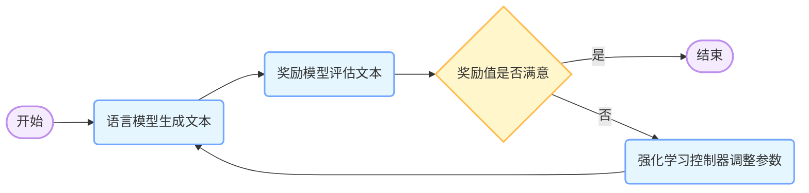

# 基于奖励模型的语言模型训练技术进展

> 关键词：奖励模型、语言模型训练、强化学习、技术进展、自然语言处理

> 摘要：本文围绕基于奖励模型的语言模型训练技术展开，深入探讨了该技术的核心概念、算法原理、数学模型等方面。详细分析了技术的发展背景，阐述了奖励模型与语言模型训练之间的联系和架构。通过Python代码对核心算法进行了原理性讲解，并给出了数学公式的详细推导和举例说明。同时结合实际项目，展示了代码的实现和解读。还探讨了该技术的实际应用场景，推荐了相关的学习资源、开发工具和论文著作。最后对该技术的未来发展趋势与挑战进行了总结，并给出常见问题解答和扩展阅读参考资料。

## 1. 背景介绍 
### 1.1 目的和范围
随着自然语言处理（NLP）技术的不断发展，语言模型在诸多领域展现出了强大的应用潜力。然而，传统的语言模型训练方法往往难以满足复杂场景下对模型输出质量和多样性的要求。基于奖励模型的语言模型训练技术应运而生，旨在通过引入奖励机制，引导语言模型生成更符合用户期望和特定任务需求的文本。本文的目的在于全面介绍这一技术的发展现状、核心原理和实际应用，范围涵盖技术的基本概念、算法实现、数学模型、项目实战以及未来发展趋势等方面。

### 1.2 预期读者
本文预期读者包括自然语言处理领域的研究人员、开发者、对人工智能技术感兴趣的学生以及相关行业的从业者。对于希望深入了解基于奖励模型的语言模型训练技术的读者，本文将提供系统而全面的知识体系和实践指导。

### 1.3 文档结构概述
本文将按照以下结构进行组织：首先介绍核心概念与联系，包括奖励模型和语言模型训练的基本原理以及它们之间的架构关系；接着阐述核心算法原理和具体操作步骤，并通过Python代码进行详细说明；然后介绍数学模型和公式，给出详细的推导和举例；再通过项目实战展示代码的实际应用和解读；之后探讨该技术的实际应用场景；随后推荐相关的工具和资源；最后对技术的未来发展趋势与挑战进行总结，并给出常见问题解答和扩展阅读参考资料。

### 1.4 术语表
#### 1.4.1 核心术语定义
- **奖励模型（Reward Model）**：一种用于评估语言模型生成文本质量的模型，它根据特定的标准为生成的文本分配一个奖励值，以指导语言模型的训练。
- **语言模型（Language Model）**：一种对自然语言文本进行建模的模型，用于预测下一个可能出现的词或字符，在自然语言处理中广泛应用于文本生成、机器翻译等任务。
- **强化学习（Reinforcement Learning）**：一种机器学习范式，智能体通过与环境进行交互，根据环境反馈的奖励信号来学习最优的行为策略。
- **策略梯度（Policy Gradient）**：强化学习中的一种算法，通过估计策略的梯度来更新策略参数，以最大化长期累积奖励。

#### 1.4.2 相关概念解释
- **预训练语言模型（Pretrained Language Model）**：在大规模无监督文本数据上进行预训练的语言模型，具有丰富的语言知识和强大的特征表示能力，是许多自然语言处理任务的基础。
- **微调（Fine-tuning）**：在预训练语言模型的基础上，使用特定任务的有监督数据对模型进行进一步训练，以适应具体任务的需求。

#### 1.4.3 缩略词列表
- **NLP**：Natural Language Processing，自然语言处理
- **RL**：Reinforcement Learning，强化学习
- **PG**：Policy Gradient，策略梯度
- **GPT**：Generative Pretrained Transformer，生成式预训练变换器

## 2. 核心概念与联系 

### 核心概念原理
#### 奖励模型原理
奖励模型的核心目标是为语言模型生成的文本提供一个量化的评价指标。它通常基于一组预定义的标准，如文本的流畅性、相关性、准确性等，对生成的文本进行打分。奖励模型可以通过监督学习的方式进行训练，使用人工标注的数据集来学习如何准确地评估文本质量。例如，在一个问答系统中，奖励模型可以根据答案的准确性和完整性为每个生成的答案分配一个奖励值。

#### 语言模型训练原理
语言模型的训练通常基于大量的文本数据，通过学习文本中的语言模式和统计规律来预测下一个词或字符的概率分布。传统的语言模型训练方法主要基于最大似然估计，即最大化训练数据的似然概率。而基于奖励模型的语言模型训练则引入了强化学习的思想，通过奖励信号来引导模型生成更优的文本。

### 架构的文本示意图
基于奖励模型的语言模型训练架构主要包括语言模型、奖励模型和强化学习控制器三个部分。语言模型负责生成文本，奖励模型对生成的文本进行评估并给出奖励值，强化学习控制器根据奖励值调整语言模型的参数，以最大化长期累积奖励。

### Mermaid 流程图


## 3. 核心算法原理 & 具体操作步骤 

### 核心算法原理
基于奖励模型的语言模型训练通常采用策略梯度算法。策略梯度算法的核心思想是通过估计策略的梯度来更新策略参数，以最大化长期累积奖励。在语言模型训练中，策略就是语言模型生成文本的概率分布，奖励就是奖励模型给出的评价分数。

### 具体操作步骤
1. **初始化语言模型和奖励模型**：使用预训练的语言模型和随机初始化的奖励模型。
2. **生成文本**：语言模型根据当前的策略生成文本。
3. **评估文本**：奖励模型对生成的文本进行评估，给出奖励值。
4. **计算梯度**：根据奖励值和策略梯度算法计算语言模型参数的梯度。
5. **更新参数**：使用计算得到的梯度更新语言模型的参数。
6. **重复步骤2 - 5**：直到达到预定的训练步数或满足收敛条件。

### Python源代码详细阐述
```python
import torch
import torch.nn as nn
import torch.optim as optim

# 定义语言模型
class LanguageModel(nn.Module):
    def __init__(self, vocab_size, hidden_size):
        super(LanguageModel, self).__init__()
        self.embedding = nn.Embedding(vocab_size, hidden_size)
        self.rnn = nn.LSTM(hidden_size, hidden_size)
        self.fc = nn.Linear(hidden_size, vocab_size)

    def forward(self, input):
        embedded = self.embedding(input)
        output, _ = self.rnn(embedded)
        logits = self.fc(output)
        return logits

# 定义奖励模型
class RewardModel(nn.Module):
    def __init__(self, input_size):
        super(RewardModel, self).__init__()
        self.fc = nn.Linear(input_size, 1)

    def forward(self, input):
        reward = self.fc(input)
        return reward

# 初始化模型
vocab_size = 1000
hidden_size = 128
language_model = LanguageModel(vocab_size, hidden_size)
reward_model = RewardModel(hidden_size)

# 定义优化器
language_optimizer = optim.Adam(language_model.parameters(), lr=0.001)
reward_optimizer = optim.Adam(reward_model.parameters(), lr=0.001)

# 训练循环
num_steps = 1000
for step in range(num_steps):
    # 生成文本
    input = torch.randint(0, vocab_size, (1, 10))
    logits = language_model(input)
    probs = torch.softmax(logits, dim=-1)
    action = torch.multinomial(probs.squeeze(), 1)

    # 评估文本
    hidden_state = language_model.rnn(language_model.embedding(input))[0][:, -1, :]
    reward = reward_model(hidden_state)

    # 计算梯度
    log_prob = torch.log(probs.squeeze()[action])
    loss = -log_prob * reward
    language_optimizer.zero_grad()
    loss.backward()
    language_optimizer.step()

    # 更新奖励模型
    reward_optimizer.zero_grad()
    # 这里可以添加奖励模型的训练逻辑
    reward_optimizer.step()
```

## 4. 数学模型和公式 & 详细讲解 & 举例说明 

### 策略梯度公式
策略梯度算法的核心公式为：
$$
\nabla_{\theta} J(\theta) = \mathbb{E}_{\tau \sim \pi_{\theta}(\tau)} \left[ \sum_{t=0}^{T} \nabla_{\theta} \log \pi_{\theta}(a_t|s_t) R(\tau) \right]
$$
其中，$\theta$ 是策略参数，$J(\theta)$ 是策略的期望累积奖励，$\tau$ 是一个轨迹，$\pi_{\theta}(\tau)$ 是在策略 $\pi_{\theta}$ 下生成轨迹 $\tau$ 的概率，$a_t$ 是时刻 $t$ 的动作，$s_t$ 是时刻 $t$ 的状态，$R(\tau)$ 是轨迹 $\tau$ 的累积奖励。

### 详细讲解
策略梯度公式的核心思想是通过估计策略的梯度来更新策略参数，以最大化期望累积奖励。具体来说，对于每个时刻 $t$，我们计算在状态 $s_t$ 下采取动作 $a_t$ 的对数概率的梯度 $\nabla_{\theta} \log \pi_{\theta}(a_t|s_t)$，并乘以该轨迹的累积奖励 $R(\tau)$。然后对所有可能的轨迹进行期望运算，得到策略的梯度。

### 举例说明
假设我们有一个简单的语言生成任务，状态 $s_t$ 是当前的输入文本，动作 $a_t$ 是选择下一个词。策略 $\pi_{\theta}(a_t|s_t)$ 是在状态 $s_t$ 下选择动作 $a_t$ 的概率。累积奖励 $R(\tau)$ 是奖励模型对生成的整个文本的评价分数。通过策略梯度公式，我们可以计算出策略参数 $\theta$ 的梯度，并使用梯度上升法更新参数，以提高策略的性能。

## 5. 项目实战：代码实际案例和详细解释说明 

### 5.1  开发环境搭建
#### 安装Python和必要的库
首先，确保你已经安装了Python 3.6及以上版本。然后，使用以下命令安装必要的库：
```sh
pip install torch numpy
```

#### 数据集准备
选择一个合适的文本数据集，如WikiText-2。将数据集下载并处理成适合训练的格式。

### 5.2  源代码详细实现和代码解读
```python
import torch
import torch.nn as nn
import torch.optim as optim
import numpy as np

# 定义语言模型
class LanguageModel(nn.Module):
    def __init__(self, vocab_size, hidden_size):
        super(LanguageModel, self).__init__()
        self.embedding = nn.Embedding(vocab_size, hidden_size)
        self.rnn = nn.LSTM(hidden_size, hidden_size)
        self.fc = nn.Linear(hidden_size, vocab_size)

    def forward(self, input):
        embedded = self.embedding(input)
        output, _ = self.rnn(embedded)
        logits = self.fc(output)
        return logits

# 定义奖励模型
class RewardModel(nn.Module):
    def __init__(self, input_size):
        super(RewardModel, self).__init__()
        self.fc = nn.Linear(input_size, 1)

    def forward(self, input):
        reward = self.fc(input)
        return reward

# 加载数据集
def load_data():
    # 这里需要实现具体的数据加载逻辑
    data = np.random.randint(0, 1000, (1000, 10))
    return torch.tensor(data, dtype=torch.long)

# 训练函数
def train():
    vocab_size = 1000
    hidden_size = 128
    language_model = LanguageModel(vocab_size, hidden_size)
    reward_model = RewardModel(hidden_size)

    language_optimizer = optim.Adam(language_model.parameters(), lr=0.001)
    reward_optimizer = optim.Adam(reward_model.parameters(), lr=0.001)

    data = load_data()
    num_epochs = 10
    for epoch in range(num_epochs):
        for i in range(len(data)):
            input = data[i].unsqueeze(0)
            logits = language_model(input)
            probs = torch.softmax(logits, dim=-1)
            action = torch.multinomial(probs.squeeze(), 1)

            hidden_state = language_model.rnn(language_model.embedding(input))[0][:, -1, :]
            reward = reward_model(hidden_state)

            log_prob = torch.log(probs.squeeze()[action])
            loss = -log_prob * reward
            language_optimizer.zero_grad()
            loss.backward()
            language_optimizer.step()

            reward_optimizer.zero_grad()
            # 这里可以添加奖励模型的训练逻辑
            reward_optimizer.step()

        print(f'Epoch {epoch + 1}/{num_epochs} completed')

if __name__ == '__main__':
    train()
```

### 5.3  代码解读与分析
- **语言模型定义**：`LanguageModel` 类使用 `nn.Embedding` 层将输入的词索引转换为词向量，然后通过 `nn.LSTM` 层进行序列建模，最后使用全连接层输出每个词的概率分布。
- **奖励模型定义**：`RewardModel` 类是一个简单的全连接层，用于对输入的隐藏状态进行评估，输出一个奖励值。
- **数据加载**：`load_data` 函数用于加载数据集，这里使用随机生成的数据作为示例，实际应用中需要根据具体情况实现数据加载逻辑。
- **训练循环**：在训练循环中，语言模型生成文本，奖励模型评估文本并给出奖励值，然后根据策略梯度算法计算语言模型参数的梯度并更新参数。同时，奖励模型也可以根据需要进行训练。

## 6. 实际应用场景 
### 智能对话系统
在智能对话系统中，基于奖励模型的语言模型训练可以使系统生成更自然、更符合用户意图的回复。奖励模型可以根据对话的连贯性、相关性和有用性等标准对生成的回复进行评估，引导语言模型不断优化回复策略。

### 机器翻译
在机器翻译任务中，奖励模型可以考虑翻译的准确性、流畅性和可读性等因素，为不同的翻译结果分配奖励值。通过基于奖励模型的训练，语言模型可以学习到更优的翻译策略，提高翻译质量。

### 文本摘要
在文本摘要任务中，奖励模型可以根据摘要的信息完整性、简洁性和连贯性等指标对生成的摘要进行评价。语言模型通过学习奖励信号，能够生成更优质的文本摘要。

## 7. 工具和资源推荐
### 7.1 学习资源推荐
#### 7.1.1 书籍推荐
- 《深度学习》（Deep Learning）：由Ian Goodfellow、Yoshua Bengio和Aaron Courville撰写，是深度学习领域的经典教材，涵盖了神经网络、优化算法等方面的知识。
- 《自然语言处理入门》：介绍了自然语言处理的基本概念、算法和应用，适合初学者入门。

#### 7.1.2 在线课程
- Coursera上的“Natural Language Processing Specialization”：由顶尖高校的教授授课，全面介绍了自然语言处理的各个方面。
- edX上的“Deep Learning for Natural Language Processing”：专注于深度学习在自然语言处理中的应用，包括语言模型、机器翻译等内容。

#### 7.1.3 技术博客和网站
- Hugging Face Blog：提供了关于自然语言处理和深度学习的最新研究成果和技术分享。
- Medium上的Towards Data Science：有许多关于自然语言处理和机器学习的优质文章。

### 7.2 开发工具框架推荐
#### 7.2.1 IDE和编辑器
- PyCharm：功能强大的Python集成开发环境，提供了代码编辑、调试、版本控制等功能。
- Jupyter Notebook：交互式的开发环境，适合进行数据探索和模型实验。

#### 7.2.2 调试和性能分析工具
- TensorBoard：用于可视化深度学习模型的训练过程和性能指标。
- PyTorch Profiler：可以帮助分析模型的性能瓶颈，优化代码。

#### 7.2.3 相关框架和库
- PyTorch：一个开源的深度学习框架，提供了丰富的神经网络模块和优化算法。
- Hugging Face Transformers：提供了预训练的语言模型和工具，方便进行自然语言处理任务的开发。

### 7.3 相关论文著作推荐
#### 7.3.1 经典论文
- “Attention Is All You Need”：提出了Transformer架构，是现代自然语言处理的重要基础。
- “Fine-Tuning Language Models from Human Preferences”：介绍了基于人类偏好的语言模型微调方法，与基于奖励模型的训练密切相关。

#### 7.3.2 最新研究成果
- 关注顶级学术会议如ACL、EMNLP等的最新论文，了解基于奖励模型的语言模型训练技术的最新进展。

#### 7.3.3 应用案例分析
- 一些实际应用案例的论文可以帮助我们了解该技术在不同场景下的应用效果和挑战。

## 8. 总结：未来发展趋势与挑战
### 未来发展趋势
- **多模态融合**：将基于奖励模型的语言模型训练与图像、音频等多模态数据相结合，实现更丰富的自然语言交互。
- **强化学习算法改进**：不断探索更高效、更稳定的强化学习算法，提高语言模型的训练效果和性能。
- **个性化定制**：根据用户的个性化需求和偏好，定制奖励模型，使语言模型生成更符合用户期望的文本。

### 挑战
- **奖励模型设计**：设计合理、准确的奖励模型是基于奖励模型的语言模型训练的关键，但目前奖励模型的设计还面临许多挑战，如难以量化一些抽象的评价标准。
- **数据稀缺性**：在一些特定领域，可能缺乏足够的标注数据来训练奖励模型，导致模型的泛化能力受限。
- **计算资源需求**：基于奖励模型的语言模型训练通常需要大量的计算资源，如何在有限的资源下提高训练效率是一个重要的问题。

## 9. 附录：常见问题与解答
### 问题1：奖励模型的训练数据从哪里获取？
解答：奖励模型的训练数据可以通过人工标注、众包等方式获取。也可以使用一些现有的标注数据集，或者通过模拟生成数据来训练奖励模型。

### 问题2：基于奖励模型的语言模型训练会导致过拟合吗？
解答：和其他训练方法一样，基于奖励模型的语言模型训练也可能会导致过拟合。可以通过使用正则化方法、增加训练数据等方式来缓解过拟合问题。

### 问题3：如何选择合适的强化学习算法？
解答：选择合适的强化学习算法需要考虑任务的特点、数据的规模和计算资源等因素。可以通过实验比较不同算法的性能，选择最适合的算法。

## 10. 扩展阅读 & 参考资料
- 《强化学习：原理与Python实现》
- OpenAI官方文档和研究报告
- GitHub上相关的开源项目

作者：AI天才研究院/AI Genius Institute & 禅与计算机程序设计艺术 /Zen And The Art of Computer Programming