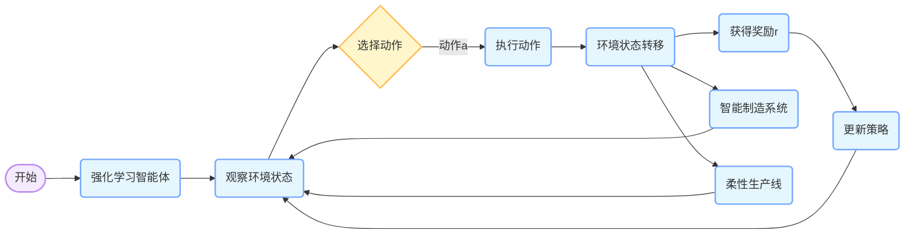

# 基于强化学习的AI智能制造柔性生产线实时优化

> 关键词：强化学习、AI智能制造、柔性生产线、实时优化、马尔可夫决策过程

> 摘要：本文聚焦于基于强化学习的AI智能制造柔性生产线实时优化这一前沿课题。首先介绍了研究背景、目的、预期读者、文档结构和相关术语。详细阐述了强化学习、智能制造和柔性生产线的核心概念及其联系，并给出了相应的原理和架构示意图以及Mermaid流程图。深入分析了强化学习的核心算法原理，通过Python源代码进行详细讲解。介绍了相关的数学模型和公式，并举例说明。通过项目实战，从开发环境搭建、源代码实现与解读等方面展示了如何将理论应用于实际。探讨了该技术在实际生产中的应用场景，推荐了学习资源、开发工具框架和相关论文著作。最后总结了未来发展趋势与挑战，并给出常见问题解答和扩展阅读参考资料，旨在为该领域的研究和实践提供全面且深入的指导。

## 1. 背景介绍 
### 1.1 目的和范围
在当今制造业快速发展的背景下，智能制造成为了提升生产效率、降低成本、提高产品质量的关键方向。柔性生产线作为智能制造的重要组成部分，能够根据不同的生产需求快速调整生产流程和工艺参数，实现多品种、小批量的生产模式。然而，柔性生产线的实时优化面临着诸多挑战，如生产环境的不确定性、任务的动态变化等。

本文的目的是探讨如何利用强化学习技术实现AI智能制造柔性生产线的实时优化。具体范围包括强化学习的基本原理、在柔性生产线实时优化中的应用算法、相关的数学模型和公式，以及通过实际案例展示如何搭建开发环境、实现源代码并进行分析。同时，还将讨论该技术在实际生产中的应用场景、相关的学习资源、开发工具和研究论文等。

### 1.2 预期读者
本文预期读者主要包括以下几类人群：
- 智能制造领域的研究人员和工程师，希望了解强化学习在柔性生产线实时优化中的应用，为其研究和实践提供新思路和方法。
- 计算机科学和人工智能专业的学生和学者，对强化学习在实际工业场景中的应用感兴趣，通过本文深入学习相关理论和实践经验。
- 制造业企业的管理人员和技术决策者，了解基于强化学习的实时优化技术对柔性生产线的潜在价值，为企业的智能化升级提供参考。

### 1.3 文档结构概述
本文的文档结构如下：
- 核心概念与联系：介绍强化学习、智能制造和柔性生产线的核心概念，以及它们之间的联系，并给出原理和架构示意图及Mermaid流程图。
- 核心算法原理 & 具体操作步骤：详细讲解强化学习的核心算法原理，通过Python源代码进行具体操作步骤的阐述。
- 数学模型和公式 & 详细讲解 & 举例说明：介绍相关的数学模型和公式，并通过具体例子进行详细讲解。
- 项目实战：代码实际案例和详细解释说明：包括开发环境搭建、源代码详细实现和代码解读。
- 实际应用场景：探讨基于强化学习的AI智能制造柔性生产线实时优化技术在实际生产中的应用场景。
- 工具和资源推荐：推荐相关的学习资源、开发工具框架和研究论文。
- 总结：未来发展趋势与挑战：总结该技术的未来发展趋势和面临的挑战。
- 附录：常见问题与解答：解答读者在阅读和实践过程中可能遇到的常见问题。
- 扩展阅读 & 参考资料：提供进一步深入学习的扩展阅读资料和参考文献。

### 1.4 术语表
#### 1.4.1 核心术语定义
- **强化学习（Reinforcement Learning）**：一种机器学习范式，智能体通过与环境进行交互，根据环境反馈的奖励信号来学习最优的行为策略，以最大化长期累积奖励。
- **智能制造（Intelligent Manufacturing）**：将人工智能技术与制造技术深度融合，实现生产过程的自动化、智能化和柔性化，提高生产效率和产品质量。
- **柔性生产线（Flexible Production Line）**：一种能够快速适应不同产品生产需求的生产线，通过调整设备参数、工艺流程等方式，实现多品种、小批量的生产。
- **智能体（Agent）**：在强化学习中，智能体是与环境进行交互的实体，它根据当前的状态选择合适的动作，并根据环境反馈的奖励来更新自己的策略。
- **状态（State）**：描述环境在某一时刻的特征信息，智能体根据状态来选择动作。
- **动作（Action）**：智能体在某一状态下可以采取的操作，不同的动作会导致环境状态的变化。
- **奖励（Reward）**：环境根据智能体采取的动作给予的反馈信号，用于指导智能体学习最优策略。

#### 1.4.2 相关概念解释
- **马尔可夫决策过程（Markov Decision Process, MDP）**：是强化学习的数学基础，它描述了一个具有马尔可夫性质的决策过程，即未来的状态只取决于当前的状态和动作，而与过去的历史无关。MDP由状态集合、动作集合、状态转移概率、奖励函数和折扣因子组成。
- **策略（Policy）**：智能体在不同状态下选择动作的规则，通常用 $\pi(s,a)$ 表示在状态 $s$ 下选择动作 $a$ 的概率。
- **价值函数（Value Function）**：用于评估状态或状态 - 动作对的价值，包括状态价值函数 $V(s)$ 和动作价值函数 $Q(s,a)$。状态价值函数表示从状态 $s$ 开始，遵循某一策略所能获得的长期累积奖励的期望值；动作价值函数表示在状态 $s$ 下采取动作 $a$ 后，遵循某一策略所能获得的长期累积奖励的期望值。

#### 1.4.3 缩略词列表
- **MDP**：Markov Decision Process（马尔可夫决策过程）
- **Q - learning**：Q学习算法
- **SARSA**：State - Action - Reward - State - Action算法
- **DQN**：Deep Q - Network（深度Q网络）

## 2. 核心概念与联系 

### 核心概念原理
#### 强化学习原理
强化学习的基本原理是智能体与环境进行交互，在每个时间步 $t$，智能体观察到环境的当前状态 $s_t$，根据策略 $\pi$ 选择一个动作 $a_t$ 执行，环境根据动作 $a_t$ 转移到下一个状态 $s_{t + 1}$，并给予智能体一个奖励 $r_t$。智能体的目标是学习一个最优策略 $\pi^*$，使得长期累积奖励最大化。

强化学习可以用马尔可夫决策过程（MDP）来描述，一个MDP可以表示为一个五元组 $(S, A, P, R, \gamma)$，其中：
- $S$ 是状态集合，表示环境所有可能的状态。
- $A$ 是动作集合，表示智能体在每个状态下可以采取的动作。
- $P(s_{t + 1}|s_t, a_t)$ 是状态转移概率，表示在状态 $s_t$ 下采取动作 $a_t$ 后转移到状态 $s_{t + 1}$ 的概率。
- $R(s_t, a_t, s_{t + 1})$ 是奖励函数，表示在状态 $s_t$ 下采取动作 $a_t$ 转移到状态 $s_{t + 1}$ 时获得的奖励。
- $\gamma \in [0, 1]$ 是折扣因子，用于权衡当前奖励和未来奖励的重要性。

#### 智能制造原理
智能制造是将人工智能技术、信息技术与制造技术深度融合的先进制造模式。它通过物联网、大数据、云计算等技术实现生产设备的互联互通和数据的实时采集与分析，利用人工智能算法对生产过程进行优化和决策，实现生产过程的自动化、智能化和柔性化。智能制造的核心在于实现生产系统的自感知、自决策和自执行，能够根据生产环境的变化实时调整生产策略，提高生产效率和产品质量。

#### 柔性生产线原理
柔性生产线是一种具有高度灵活性和适应性的生产线，它能够根据不同的产品需求快速调整生产流程和工艺参数。柔性生产线通常由多个可重构的生产单元组成，这些生产单元可以通过自动化设备和控制系统进行快速重组和配置。在柔性生产线中，生产任务可以动态分配，设备可以根据任务需求进行自适应调整，从而实现多品种、小批量的高效生产。

### 架构的文本示意图
```plaintext
+-----------------+           +-----------------+           +-----------------+
|    强化学习     |           |    智能制造     |           |  柔性生产线    |
+-----------------+           +-----------------+           +-----------------+
| - 智能体        |           | - 物联网设备    |           | - 生产设备     |
| - 策略学习      |           | - 大数据分析    |           | - 自动化控制   |
| - 奖励机制      |           | - 人工智能算法  |           | - 可重构单元   |
+-----------------+           +-----------------+           +-----------------+
           |                         |                         |
           |                         |                         |
           +-------------------------+-------------------------+
                                     |
                                     |
                          +-----------------+
                          | 实时优化系统    |
                          +-----------------+
                          | - 状态感知      |
                          | - 决策制定      |
                          | - 动作执行      |
                          +-----------------+
```

### Mermaid流程图


## 3. 核心算法原理 & 具体操作步骤 

### Q - learning算法原理
Q - learning是一种经典的无模型强化学习算法，它通过学习动作价值函数 $Q(s,a)$ 来找到最优策略。动作价值函数 $Q(s,a)$ 表示在状态 $s$ 下采取动作 $a$ 后，遵循最优策略所能获得的长期累积奖励的期望值。

Q - learning的更新公式为：
$$Q(s_t, a_t) \leftarrow Q(s_t, a_t) + \alpha [r_t + \gamma \max_{a} Q(s_{t + 1}, a) - Q(s_t, a_t)]$$
其中：
- $\alpha \in [0, 1]$ 是学习率，控制每次更新的步长。
- $\gamma \in [0, 1]$ 是折扣因子，用于权衡当前奖励和未来奖励的重要性。
- $r_t$ 是在时间步 $t$ 获得的奖励。
- $s_t$ 是时间步 $t$ 的状态。
- $a_t$ 是时间步 $t$ 采取的动作。
- $s_{t + 1}$ 是时间步 $t + 1$ 的状态。

### Python源代码实现
```python
import numpy as np

# 定义环境参数
num_states = 10
num_actions = 4
alpha = 0.1  # 学习率
gamma = 0.9  # 折扣因子
epsilon = 0.1  # 探索率

# 初始化Q表
Q = np.zeros((num_states, num_actions))

# 定义epsilon - greedy策略
def epsilon_greedy(state):
    if np.random.uniform(0, 1) < epsilon:
        # 探索：随机选择动作
        action = np.random.choice(num_actions)
    else:
        # 利用：选择Q值最大的动作
        action = np.argmax(Q[state, :])
    return action

# 模拟环境交互
def interact(state, action):
    # 这里简单模拟状态转移和奖励
    next_state = np.random.choice(num_states)
    reward = np.random.randint(-1, 2)
    return next_state, reward

# 训练Q - learning算法
num_episodes = 1000
for episode in range(num_episodes):
    state = np.random.choice(num_states)
    done = False
    while not done:
        action = epsilon_greedy(state)
        next_state, reward = interact(state, action)
        # 更新Q表
        Q[state, action] = Q[state, action] + alpha * (reward + gamma * np.max(Q[next_state, :]) - Q[state, action])
        state = next_state
        # 简单设置终止条件
        if np.random.uniform(0, 1) < 0.1:
            done = True

# 输出最终的Q表
print("Final Q table:")
print(Q)
```

### 具体操作步骤
1. **初始化**：初始化Q表 $Q(s,a)$ 为全零矩阵，设置学习率 $\alpha$、折扣因子 $\gamma$ 和探索率 $\epsilon$。
2. **选择动作**：在每个时间步 $t$，根据当前状态 $s_t$，使用 $\epsilon$ - greedy策略选择动作 $a_t$。
3. **执行动作**：执行选择的动作 $a_t$，环境根据动作转移到下一个状态 $s_{t + 1}$，并给予奖励 $r_t$。
4. **更新Q表**：根据Q - learning更新公式更新Q表 $Q(s_t, a_t)$。
5. **终止条件判断**：判断是否满足终止条件，如果满足则结束当前回合，否则继续下一个时间步。
6. **重复训练**：重复步骤2 - 5，进行多个回合的训练，直到Q表收敛或达到最大训练回合数。

## 4. 数学模型和公式 & 详细讲解 & 举例说明 

### 马尔可夫决策过程（MDP）
马尔可夫决策过程（MDP）是强化学习的数学基础，它可以用五元组 $(S, A, P, R, \gamma)$ 来描述。

#### 状态转移概率 $P(s_{t + 1}|s_t, a_t)$
状态转移概率表示在状态 $s_t$ 下采取动作 $a_t$ 后转移到状态 $s_{t + 1}$ 的概率。例如，在一个简单的网格世界环境中，智能体可以在网格中上下左右移动，每个状态表示智能体在网格中的位置，动作表示移动方向。如果智能体在状态 $s_t$ （网格中的某个位置）采取向右移动的动作 $a_t$，那么状态转移概率 $P(s_{t + 1}|s_t, a_t)$ 表示智能体移动到下一个位置 $s_{t + 1}$ 的概率。

#### 奖励函数 $R(s_t, a_t, s_{t + 1})$
奖励函数表示在状态 $s_t$ 下采取动作 $a_t$ 转移到状态 $s_{t + 1}$ 时获得的奖励。奖励函数的设计非常重要，它直接影响智能体学习的目标。例如，在网格世界环境中，如果智能体移动到目标位置，奖励函数可以设置为一个正的奖励值（如 +10）；如果智能体撞到障碍物，奖励函数可以设置为一个负的奖励值（如 -5）；如果智能体正常移动，奖励函数可以设置为一个小的负奖励值（如 -1），以鼓励智能体尽快到达目标位置。

#### 折扣因子 $\gamma$
折扣因子 $\gamma \in [0, 1]$ 用于权衡当前奖励和未来奖励的重要性。如果 $\gamma$ 接近1，表示智能体更注重未来的长期奖励；如果 $\gamma$ 接近0，表示智能体更注重当前的即时奖励。例如，在一个投资决策问题中，如果 $\gamma$ 较大，智能体可能会选择长期收益较高但短期收益较低的投资策略；如果 $\gamma$ 较小，智能体可能会选择短期收益较高但长期收益不稳定的投资策略。

### 价值函数
#### 状态价值函数 $V(s)$
状态价值函数 $V(s)$ 表示从状态 $s$ 开始，遵循某一策略 $\pi$ 所能获得的长期累积奖励的期望值，定义为：
$$V^{\pi}(s) = \mathbb{E}_{\pi} \left[ \sum_{t = 0}^{\infty} \gamma^t r_t \big| s_0 = s \right]$$
其中，$\mathbb{E}_{\pi}$ 表示在策略 $\pi$ 下的期望，$r_t$ 是时间步 $t$ 获得的奖励。

#### 动作价值函数 $Q(s,a)$
动作价值函数 $Q(s,a)$ 表示在状态 $s$ 下采取动作 $a$ 后，遵循某一策略 $\pi$ 所能获得的长期累积奖励的期望值，定义为：
$$Q^{\pi}(s,a) = \mathbb{E}_{\pi} \left[ \sum_{t = 0}^{\infty} \gamma^t r_t \big| s_0 = s, a_0 = a \right]$$

### 贝尔曼方程
#### 状态价值函数的贝尔曼方程
状态价值函数的贝尔曼方程表示状态价值函数可以通过其后续状态的价值函数来表示，即：
$$V^{\pi}(s) = \sum_{a \in A} \pi(s,a) \sum_{s' \in S} P(s'|s,a) [R(s,a,s') + \gamma V^{\pi}(s')]$$
其中，$\pi(s,a)$ 是策略 $\pi$ 在状态 $s$ 下选择动作 $a$ 的概率。

#### 动作价值函数的贝尔曼方程
动作价值函数的贝尔曼方程表示动作价值函数可以通过其后续状态 - 动作对的价值函数来表示，即：
$$Q^{\pi}(s,a) = \sum_{s' \in S} P(s'|s,a) [R(s,a,s') + \gamma \sum_{a' \in A} \pi(s',a') Q^{\pi}(s',a')]$$

### 举例说明
考虑一个简单的两状态、两动作的MDP，状态集合 $S = \{s_1, s_2\}$，动作集合 $A = \{a_1, a_2\}$，状态转移概率和奖励函数如下：

| $s$ | $a$ | $s'$ | $P(s'|s,a)$ | $R(s,a,s')$ |
| --- | --- | --- | --- | --- |
| $s_1$ | $a_1$ | $s_1$ | 0.8 | 1 |
| $s_1$ | $a_1$ | $s_2$ | 0.2 | -1 |
| $s_1$ | $a_2$ | $s_1$ | 0.3 | 2 |
| $s_1$ | $a_2$ | $s_2$ | 0.7 | -2 |
| $s_2$ | $a_1$ | $s_1$ | 0.6 | 3 |
| $s_2$ | $a_1$ | $s_2$ | 0.4 | -3 |
| $s_2$ | $a_2$ | $s_1$ | 0.1 | 4 |
| $s_2$ | $a_2$ | $s_2$ | 0.9 | -4 |

假设折扣因子 $\gamma = 0.9$，策略 $\pi$ 是随机策略，即 $\pi(s,a) = 0.5$ 对于所有的 $s \in S$ 和 $a \in A$。

首先计算状态 $s_1$ 的状态价值函数 $V^{\pi}(s_1)$：
$$
\begin{align*}
V^{\pi}(s_1) &= \sum_{a \in A} \pi(s_1,a) \sum_{s' \in S} P(s'|s_1,a) [R(s_1,a,s') + \gamma V^{\pi}(s')] \\
&= 0.5 \left( \sum_{s' \in S} P(s'|s_1,a_1) [R(s_1,a_1,s') + \gamma V^{\pi}(s')] + \sum_{s' \in S} P(s'|s_1,a_2) [R(s_1,a_2,s') + \gamma V^{\pi}(s')] \right) \\
&= 0.5 \left( 0.8 \times (1 + 0.9 V^{\pi}(s_1)) + 0.2 \times (-1 + 0.9 V^{\pi}(s_2)) + 0.3 \times (2 + 0.9 V^{\pi}(s_1)) + 0.7 \times (-2 + 0.9 V^{\pi}(s_2)) \right)
\end{align*}
$$

同理，可以计算状态 $s_2$ 的状态价值函数 $V^{\pi}(s_2)$：
$$
\begin{align*}
V^{\pi}(s_2) &= \sum_{a \in A} \pi(s_2,a) \sum_{s' \in S} P(s'|s_2,a) [R(s_2,a,s') + \gamma V^{\pi}(s')] \\
&= 0.5 \left( \sum_{s' \in S} P(s'|s_2,a_1) [R(s_2,a_1,s') + \gamma V^{\pi}(s')] + \sum_{s' \in S} P(s'|s_2,a_2) [R(s_2,a_2,s') + \gamma V^{\pi}(s')] \right) \\
&= 0.5 \left( 0.6 \times (3 + 0.9 V^{\pi}(s_1)) + 0.4 \times (-3 + 0.9 V^{\pi}(s_2)) + 0.1 \times (4 + 0.9 V^{\pi}(s_1)) + 0.9 \times (-4 + 0.9 V^{\pi}(s_2)) \right)
\end{align*}
$$

通过联立上述两个方程，可以求解出 $V^{\pi}(s_1)$ 和 $V^{\pi}(s_2)$ 的值。

## 5. 项目实战：代码实际案例和详细解释说明 

### 5.1  开发环境搭建
#### 安装Python
首先需要安装Python，建议使用Python 3.6及以上版本。可以从Python官方网站（https://www.python.org/downloads/） 下载并安装适合自己操作系统的Python版本。

#### 安装必要的库
在基于强化学习的AI智能制造柔性生产线实时优化项目中，需要安装以下几个常用的Python库：
- **NumPy**：用于数值计算和数组操作。可以使用以下命令进行安装：
```sh
pip install numpy
```
- **OpenAI Gym**：一个用于开发和比较强化学习算法的工具包，提供了各种模拟环境。可以使用以下命令进行安装：
```sh
pip install gym
```
- **TensorFlow或PyTorch**：用于深度学习模型的构建和训练。如果选择TensorFlow，可以使用以下命令进行安装：
```sh
pip install tensorflow
```
如果选择PyTorch，可以根据自己的CUDA版本和操作系统从PyTorch官方网站（https://pytorch.org/get-started/locally/） 选择合适的安装命令进行安装。

### 5.2  源代码详细实现和代码解读
以下是一个使用OpenAI Gym的`CartPole-v1`环境，结合Q - learning算法进行训练的示例代码：
```python
import gym
import numpy as np

# 初始化环境
env = gym.make('CartPole-v1')

# 定义参数
num_states = 4  # 状态维度
num_actions = env.action_space.n  # 动作数量
alpha = 0.1  # 学习率
gamma = 0.9  # 折扣因子
epsilon = 0.1  # 探索率
num_episodes = 1000  # 训练回合数

# 初始化Q表
Q = np.zeros((num_states, num_actions))

# 定义epsilon - greedy策略
def epsilon_greedy(state):
    if np.random.uniform(0, 1) < epsilon:
        # 探索：随机选择动作
        action = env.action_space.sample()
    else:
        # 利用：选择Q值最大的动作
        action = np.argmax(Q[state, :])
    return action

# 训练Q - learning算法
for episode in range(num_episodes):
    state = env.reset()
    done = False
    total_reward = 0
    while not done:
        # 选择动作
        action = epsilon_greedy(state)
        # 执行动作
        next_state, reward, done, _ = env.step(action)
        # 更新Q表
        Q[state, action] = Q[state, action] + alpha * (reward + gamma * np.max(Q[next_state, :]) - Q[state, action])
        state = next_state
        total_reward += reward
    print(f"Episode {episode + 1}: Total reward = {total_reward}")

# 关闭环境
env.close()
```

### 代码解读与分析
#### 环境初始化
```python
env = gym.make('CartPole-v1')
```
使用`gym.make`函数创建一个`CartPole-v1`环境，该环境是一个经典的强化学习环境，智能体需要控制一个小车左右移动，以保持杆的平衡。

#### 参数定义
```python
num_states = 4
num_actions = env.action_space.n
alpha = 0.1
gamma = 0.9
epsilon = 0.1
num_episodes = 1000
```
- `num_states`：状态维度，`CartPole-v1`环境的状态是一个四维向量，包括小车的位置、速度、杆的角度和角速度。
- `num_actions`：动作数量，`CartPole-v1`环境中智能体可以采取两个动作，即向左移动或向右移动。
- `alpha`：学习率，控制每次更新Q表的步长。
- `gamma`：折扣因子，用于权衡当前奖励和未来奖励的重要性。
- `epsilon`：探索率，控制智能体的探索和利用行为。
- `num_episodes`：训练回合数，即智能体与环境进行交互的次数。

#### Q表初始化
```python
Q = np.zeros((num_states, num_actions))
```
使用`np.zeros`函数初始化Q表为全零矩阵，形状为`(num_states, num_actions)`。

#### epsilon - greedy策略
```python
def epsilon_greedy(state):
    if np.random.uniform(0, 1) < epsilon:
        action = env.action_space.sample()
    else:
        action = np.argmax(Q[state, :])
    return action
```
定义`epsilon - greedy`策略，根据探索率 $\epsilon$ 决定是进行探索（随机选择动作）还是利用（选择Q值最大的动作）。

#### 训练过程
```python
for episode in range(num_episodes):
    state = env.reset()
    done = False
    total_reward = 0
    while not done:
        action = epsilon_greedy(state)
        next_state, reward, done, _ = env.step(action)
        Q[state, action] = Q[state, action] + alpha * (reward + gamma * np.max(Q[next_state, :]) - Q[state, action])
        state = next_state
        total_reward += reward
    print(f"Episode {episode + 1}: Total reward = {total_reward}")
```
在每个训练回合中，首先使用`env.reset()`函数重置环境状态，然后在每个时间步中，根据`epsilon - greedy`策略选择动作，执行动作并获取下一个状态、奖励和终止标志，使用Q - learning更新公式更新Q表，最后累加总奖励。当回合结束时，打印该回合的总奖励。

#### 环境关闭
```python
env.close()
```
使用`env.close()`函数关闭环境，释放资源。

## 6. 实际应用场景 
### 生产任务调度
在柔性生产线中，生产任务的调度是一个关键问题。基于强化学习的实时优化技术可以根据生产线的实时状态（如设备可用性、任务优先级、物料库存等），动态地分配生产任务，以最大化生产效率和最小化生产周期。例如，在一个汽车制造工厂中，强化学习智能体可以根据不同车型的生产需求、各个生产线的负载情况，实时调整生产任务的分配，避免生产线的拥堵和闲置。

### 设备参数优化
柔性生产线中的设备参数（如加工速度、温度、压力等）对产品质量和生产效率有着重要影响。强化学习可以通过与设备进行交互，根据实时的生产数据和质量反馈，实时调整设备参数，以达到最优的生产效果。例如，在一个注塑生产过程中，强化学习智能体可以根据产品的尺寸精度、表面质量等指标，实时调整注塑机的注射速度、保压时间等参数，提高产品质量和生产效率。

### 质量控制
在智能制造中，质量控制是确保产品符合标准的重要环节。强化学习可以用于实时监测生产过程中的质量数据，根据质量波动情况及时调整生产策略，以减少次品率。例如，在一个电子芯片制造过程中，强化学习智能体可以通过监测芯片的电学性能、外观缺陷等质量指标，实时调整光刻、蚀刻等工艺参数，提高芯片的良品率。

### 物流配送优化
柔性生产线中的物流配送系统需要根据生产任务的需求，实时调度运输设备（如AGV、叉车等），确保物料的及时供应和成品的及时运输。强化学习可以根据生产线的实时状态和物流信息，优化运输路径和任务分配，提高物流配送效率。例如，在一个仓库物流系统中，强化学习智能体可以根据货物的存储位置、订单需求和运输设备的状态，实时规划AGV的行驶路径，减少货物的搬运时间和成本。

## 7. 工具和资源推荐
### 7.1 学习资源推荐
#### 7.1.1 书籍推荐
- 《Reinforcement Learning: An Introduction》（《强化学习：原理与Python实现》）：由Richard S. Sutton和Andrew G. Barto所著，是强化学习领域的经典教材，全面介绍了强化学习的基本概念、算法和应用。
- 《Deep Reinforcement Learning Hands-On》（《深度强化学习实战》）：由Max Lapan所著，通过实际案例和代码实现，详细介绍了深度强化学习的各种算法和应用。
- 《Artificial Intelligence: A Modern Approach》（《人工智能：一种现代的方法》）：由Stuart Russell和Peter Norvig所著，是人工智能领域的经典教材，涵盖了强化学习、机器学习、自然语言处理等多个方面的内容。

#### 7.1.2 在线课程
- **Coursera - Reinforcement Learning Specialization**：由University of Alberta提供的强化学习专项课程，包括四门课程，从基础的强化学习概念到高级的深度强化学习算法，适合不同水平的学习者。
- **Udemy - Reinforcement Learning A-Z™: Learn How To Build Intelligent Agents**：该课程通过实际案例和代码实现，介绍了强化学习的基本概念和算法，以及如何使用Python和TensorFlow构建智能体。
- **edX - Introduction to Artificial Intelligence**：由UC Berkeley提供的人工智能入门课程，其中包括强化学习的相关内容，适合初学者了解人工智能和强化学习的基本概念。

#### 7.1.3 技术博客和网站
- **OpenAI Blog**：OpenAI官方博客，发布了许多关于强化学习、人工智能的最新研究成果和应用案例。
- **Medium - Towards Data Science**：一个数据科学和人工智能领域的技术博客平台，有许多关于强化学习的高质量文章和教程。
- **RL - Gym**：OpenAI开发的强化学习工具包Gym的官方文档和教程网站，提供了丰富的强化学习环境和示例代码。

### 7.2 开发工具框架推荐
#### 7.2.1 IDE和编辑器
- **PyCharm**：一款专门为Python开发设计的集成开发环境（IDE），具有强大的代码编辑、调试和项目管理功能，适合开发基于Python的强化学习项目。
- **Jupyter Notebook**：一个交互式的开发环境，支持Python、R等多种编程语言，适合进行数据分析、模型训练和可视化展示，常用于强化学习算法的实验和验证。
- **VS Code**：一款轻量级的代码编辑器，支持多种编程语言和插件扩展，具有丰富的代码编辑和调试功能，适合快速开发和调试强化学习代码。

#### 7.2.2 调试和性能分析工具
- **TensorBoard**：TensorFlow提供的可视化工具，用于监控和分析深度学习模型的训练过程，包括损失函数、准确率、梯度等指标的变化情况，也可以用于强化学习模型的调试和性能分析。
- **Py-Spy**：一个用于Python代码性能分析的工具，可以实时监控Python程序的CPU使用率、函数调用时间等信息，帮助开发者找出代码中的性能瓶颈。
- **Profiling in PyCharm**：PyCharm自带的性能分析工具，可以对Python代码进行详细的性能分析，包括函数调用时间、内存使用情况等，帮助开发者优化代码性能。

#### 7.2.3 相关框架和库
- **OpenAI Gym**：一个用于开发和比较强化学习算法的工具包，提供了各种模拟环境，如经典控制问题、机器人控制、游戏等，方便开发者进行强化学习算法的实验和验证。
- **Stable Baselines3**：一个基于PyTorch的强化学习库，提供了多种经典的强化学习算法的实现，如A2C、PPO、DQN等，具有易于使用、高效稳定的特点。
- **Ray RLlib**：一个可扩展的强化学习库，支持多种深度学习框架（如TensorFlow、PyTorch），提供了分布式训练和并行计算的功能，适合大规模强化学习实验和应用。

### 7.3 相关论文著作推荐
#### 7.3.1 经典论文
- **Q - learning**：Watkins, C. J. C. H., & Dayan, P. (1992). Q - learning. Machine learning, 8(3 - 4), 279 - 292. 该论文首次提出了Q - learning算法，是强化学习领域的经典之作。
- **Deep Q - Networks (DQN)**：Mnih, V., Kavukcuoglu, K., Silver, D., Rusu, A. A., Veness, J., Bellemare, M. G.,... & Petersen, S. (2015). Human - level control through deep reinforcement learning. Nature, 518(7540), 529 - 533. 该论文提出了深度Q网络（DQN）算法，将深度学习与强化学习相结合，在Atari游戏中取得了人类水平的表现。
- **Policy Gradient Methods**：Sutton, R. S., McAllester, D. A., Singh, S. P., & Mansour, Y. (2000). Policy gradient methods for reinforcement learning with function approximation. In Advances in neural information processing systems (pp. 1057 - 1063). 该论文提出了策略梯度方法，为基于策略的强化学习算法奠定了基础。

#### 7.3.2 最新研究成果
- **Proximal Policy Optimization (PPO)**：Schulman, J., Wolski, F., Dhariwal, P., Radford, A., & Klimov, O. (2017). Proximal policy optimization algorithms. arXiv preprint arXiv:1707.06347. 该论文提出了近端策略优化（PPO）算法，是一种高效的基于策略的强化学习算法，在许多领域取得了良好的效果。
- **Soft Actor - Critic (SAC)**：Haarnoja, T., Zhou, A., Abbeel, P., & Levine, S. (2018). Soft actor - critic: Off - policy maximum entropy deep reinforcement learning with a stochastic actor. In International conference on machine learning (pp. 1861 - 1870). 该论文提出了软演员 - 评论家（SAC）算法，是一种基于最大熵原理的离线策略强化学习算法，具有良好的稳定性和样本效率。

#### 7.3.3 应用案例分析
- **Reinforcement Learning for Industrial Automation**：该类论文主要研究强化学习在工业自动化领域的应用，如生产调度、设备控制、质量检测等，通过实际案例展示了强化学习在提高生产效率、降低成本和提高产品质量方面的潜力。
- **Autonomous Vehicle Navigation using Reinforcement Learning**：该类论文主要研究强化学习在自动驾驶领域的应用，如车辆路径规划、避障、决策等，通过仿真和实验验证了强化学习在自动驾驶中的有效性和可行性。

## 8. 总结：未来发展趋势与挑战
### 未来发展趋势
#### 与深度学习的深度融合
随着深度学习技术的不断发展，强化学习与深度学习的融合将更加深入。深度强化学习算法将不断涌现，能够处理更加复杂的环境和任务。例如，结合卷积神经网络（CNN）和循环神经网络（RNN）的深度强化学习模型，可以更好地处理图像、视频和序列数据，在机器人视觉、自然语言处理等领域具有广阔的应用前景。

#### 多智能体强化学习
在实际生产中，往往存在多个智能体协同工作的情况。多智能体强化学习将成为未来的研究热点，通过智能体之间的协作和竞争，实现更加高效的生产调度和资源分配。例如，在一个智能制造工厂中，多个机器人可以通过多智能体强化学习算法实现协同搬运、装配等任务，提高生产效率和灵活性。

#### 基于模型的强化学习
基于模型的强化学习可以利用环境的先验知识和模型，减少智能体与环境的交互次数，提高学习效率。未来，基于模型的强化学习算法将得到进一步发展，结合深度学习和贝叶斯方法，构建更加准确和高效的环境模型，实现更加智能的决策和控制。

#### 实际工业应用的拓展
基于强化学习的AI智能制造柔性生产线实时优化技术将在更多的工业领域得到应用，如航空航天、电子制造、食品加工等。随着技术的不断成熟和成本的不断降低，该技术将成为工业企业提高竞争力的重要手段。

### 挑战
#### 数据获取和标注
在实际工业生产中，获取高质量的数据是一个挑战。生产环境复杂多变，数据采集设备可能存在误差和噪声，同时数据标注也需要大量的人力和时间。如何有效地获取和处理工业数据，是强化学习在工业应用中面临的一个重要问题。

#### 算法的可解释性
深度强化学习算法通常是基于神经网络的黑盒模型，其决策过程难以解释。在工业应用中，可解释性是非常重要的，因为工程师和管理人员需要理解智能体的决策依据，以便进行调整和优化。如何提高强化学习算法的可解释性，是当前研究的一个热点问题。

#### 环境的不确定性和动态性
工业生产环境具有高度的不确定性和动态性，如设备故障、原材料质量波动、市场需求变化等。强化学习算法需要能够快速适应环境的变化，及时调整策略。如何设计具有鲁棒性和适应性的强化学习算法，是该领域面临的一个挑战。

#### 计算资源和时间成本
深度强化学习算法通常需要大量的计算资源和时间进行训练。在实际工业应用中，实时性是一个重要的要求。如何优化算法的计算效率，减少训练时间和计算资源的消耗，是实现强化学习在工业实时优化中的关键问题。

## 9. 附录：常见问题与解答
### 问题1：强化学习与监督学习、无监督学习有什么区别？
- **监督学习**：是一种有标签的学习方式，通过给定输入数据和对应的标签，模型学习输入与输出之间的映射关系。例如，图像分类任务中，模型通过学习大量的图像和对应的类别标签，来预测新图像的类别。
- **无监督学习**：是一种无标签的学习方式，模型通过对输入数据的特征进行挖掘和分析，发现数据中的潜在结构和模式。例如，聚类算法将相似的数据点归为一类，以发现数据的分布规律。
- **强化学习**：智能体通过与环境进行交互，根据环境反馈的奖励信号来学习最优的行为策略。强化学习没有明确的标签，而是通过不断尝试和探索，以最大化长期累积奖励为目标。

### 问题2：如何选择合适的强化学习算法？
选择合适的强化学习算法需要考虑以下几个因素：
- **环境的复杂度**：如果环境状态和动作空间较小，可以选择传统的基于表格的强化学习算法，如Q - learning、SARSA等；如果环境状态和动作空间较大，需要使用基于函数逼近的深度强化学习算法，如DQN、A2C、PPO等。
- **是否有模型信息**：如果已知环境的状态转移概率和奖励函数，可以使用基于模型的强化学习算法；如果不知道环境的模型信息，可以使用无模型的强化学习算法。
- **任务的性质**：如果任务是连续动作空间的问题，需要选择适合连续动作的强化学习算法，如DDPG、SAC等；如果任务是离散动作空间的问题，可以选择适合离散动作的强化学习算法，如DQN、A2C等。

### 问题3：如何设计合适的奖励函数？
设计合适的奖励函数需要考虑以下几个原则：
- **明确目标**：奖励函数应该与任务的目标相一致，能够引导智能体朝着目标前进。例如，在生产任务调度问题中，奖励函数可以设置为生产效率的提高、生产周期的缩短等。
- **及时性**：奖励函数应该及时反馈智能体的行为效果，让智能体能够快速学习到正确的策略。例如，在机器人控制问题中，当机器人完成一个动作后，应该立即给予相应的奖励或惩罚。
- **稀疏性和密度**：奖励函数的稀疏性和密度需要根据任务的特点进行调整。如果奖励过于稀疏，智能体可能需要很长时间才能学习到有效的策略；如果奖励过于密集，智能体可能会陷入局部最优解。
- **避免奖励欺骗**：奖励函数应该避免出现奖励欺骗的情况，即智能体通过不正当的手段获得高奖励，但并没有真正完成任务。例如，在游戏中，智能体可能通过作弊的方式获得高分，但这并不是我们期望的结果。

### 问题4：强化学习在实际工业应用中面临哪些困难？
强化学习在实际工业应用中面临以下几个困难：
- **数据获取和标注**：工业生产环境复杂，数据采集设备可能存在误差和噪声，同时数据标注也需要大量的人力和时间。
- **算法的可解释性**：深度强化学习算法通常是黑盒模型，其决策过程难以解释，在工业应用中需要提高算法的可解释性。
- **环境的不确定性和动态性**：工业生产环境具有高度的不确定性和动态性，强化学习算法需要能够快速适应环境的变化。
- **计算资源和时间成本**：深度强化学习算法需要大量的计算资源和时间进行训练，在实际工业应用中需要优化算法的计算效率。

## 10. 扩展阅读 & 参考资料
### 扩展阅读
- **《机器人学中的状态估计》**：本书介绍了机器人学中的状态估计方法，包括卡尔曼滤波、扩展卡尔曼滤波、粒子滤波等，对于理解强化学习在机器人控制中的应用有很大帮助。
- **《深度学习》**：由Ian Goodfellow、Yoshua Bengio和Aaron Courville所著，全面介绍了深度学习的基本概念、算法和应用，是深度学习领域的经典教材。
- **《人工智能中的不确定性》**：本书介绍了人工智能中的不确定性处理方法，包括概率图模型、贝叶斯网络等，对于理解强化学习中的不确定性建模有一定的帮助。

### 参考资料
- Sutton, R. S., & Barto, A. G. (2018). Reinforcement Learning: An Introduction. The MIT Press.
- Mnih, V., Kavukcuoglu, K., Silver, D., Rusu, A. A., Veness, J