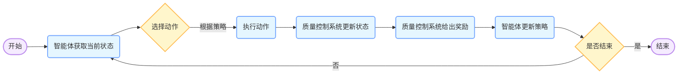

# 基于强化学习的AI智能制造质量控制系统优化

> 关键词：强化学习、AI智能制造、质量控制系统、系统优化、智能制造

> 摘要：本文聚焦于基于强化学习的AI智能制造质量控制系统优化。首先介绍了该研究的背景、目的、预期读者和文档结构等内容。接着阐述了强化学习、智能制造质量控制系统等核心概念及其联系，并给出了相应的原理和架构示意图与流程图。详细讲解了核心算法原理，通过Python代码进行示例，同时介绍了相关数学模型和公式。在项目实战部分，给出了开发环境搭建步骤、源代码实现和解读。探讨了该技术的实际应用场景，推荐了学习资源、开发工具框架和相关论文著作。最后总结了未来发展趋势与挑战，解答了常见问题并提供了扩展阅读和参考资料，旨在为智能制造质量控制系统的优化提供全面且深入的技术指导。

## 1. 背景介绍 
### 1.1 目的和范围
在智能制造领域，产品质量的稳定控制至关重要。传统的质量控制方法往往依赖于预设的规则和模型，难以适应复杂多变的生产环境和动态的生产过程。强化学习作为一种强大的机器学习方法，能够通过智能体与环境的交互不断学习最优策略，为智能制造质量控制系统的优化提供了新的思路和方法。

本文的目的是深入探讨如何利用强化学习来优化AI智能制造质量控制系统，包括核心概念的介绍、算法原理的讲解、实际案例的分析以及相关工具和资源的推荐等。范围涵盖了从理论基础到实际应用的各个方面，旨在为相关领域的研究人员和工程师提供全面而深入的技术指导。

### 1.2 预期读者
本文的预期读者包括但不限于以下几类人群：
- 智能制造领域的研究人员，希望通过强化学习技术来提升质量控制系统的性能和效率。
- 工业工程师和技术人员，负责实际生产过程中的质量控制和优化工作。
- 机器学习和人工智能领域的从业者，对强化学习在工业领域的应用感兴趣。
- 高校相关专业的学生，希望了解智能制造和强化学习的结合应用。

### 1.3 文档结构概述
本文将按照以下结构进行组织：
- 核心概念与联系：介绍强化学习、智能制造质量控制系统等核心概念，并阐述它们之间的联系。
- 核心算法原理 & 具体操作步骤：详细讲解强化学习的核心算法原理，并给出具体的操作步骤和Python代码示例。
- 数学模型和公式 & 详细讲解 & 举例说明：介绍相关的数学模型和公式，并通过具体例子进行详细讲解。
- 项目实战：通过实际案例展示如何使用强化学习优化智能制造质量控制系统，包括开发环境搭建、源代码实现和代码解读。
- 实际应用场景：探讨基于强化学习的AI智能制造质量控制系统在不同行业的实际应用场景。
- 工具和资源推荐：推荐相关的学习资源、开发工具框架和论文著作。
- 总结：总结未来发展趋势与挑战。
- 附录：解答常见问题。
- 扩展阅读 & 参考资料：提供相关的扩展阅读和参考资料。

### 1.4 术语表
#### 1.4.1 核心术语定义
- **强化学习（Reinforcement Learning）**：一种机器学习范式，智能体通过与环境进行交互，根据环境反馈的奖励信号来学习最优策略，以最大化长期累积奖励。
- **智能制造（Intelligent Manufacturing）**：将先进的信息技术、自动化技术、人工智能技术等与制造技术相结合，实现生产过程的智能化、自动化和柔性化。
- **质量控制系统（Quality Control System）**：用于监控、评估和控制产品质量的系统，通过对生产过程中的各种参数进行监测和分析，及时发现质量问题并采取相应的措施进行调整。
- **智能体（Agent）**：在强化学习中，智能体是与环境进行交互的主体，它根据当前的状态选择动作，并根据环境反馈的奖励来更新自己的策略。
- **环境（Environment）**：智能体所处的外部世界，它接收智能体的动作并返回下一个状态和奖励信号。

#### 1.4.2 相关概念解释
- **状态（State）**：描述环境当前情况的一组变量，智能体根据状态来选择动作。
- **动作（Action）**：智能体在某个状态下可以采取的操作，不同的动作会导致环境状态的不同变化。
- **奖励（Reward）**：环境对智能体采取的动作的评价，正奖励表示该动作是有益的，负奖励表示该动作是有害的。
- **策略（Policy）**：智能体根据当前状态选择动作的规则，通常用一个函数来表示。
- **价值函数（Value Function）**：用于评估某个状态或状态 - 动作对的价值，即从该状态或状态 - 动作对出发，按照当前策略所能获得的长期累积奖励的期望。

#### 1.4.3 缩略词列表
- **RL**：Reinforcement Learning（强化学习）
- **Q - learning**：一种经典的强化学习算法
- **DQN**：Deep Q - Network（深度Q网络），结合了深度学习和Q - learning的算法
- **MDP**：Markov Decision Process（马尔可夫决策过程）

## 2. 核心概念与联系 

### 强化学习原理
强化学习的核心思想是智能体通过与环境进行交互，不断尝试不同的动作，并根据环境反馈的奖励信号来学习最优策略。智能体的目标是最大化长期累积奖励。

在强化学习中，通常使用马尔可夫决策过程（MDP）来描述智能体与环境的交互过程。一个MDP可以用一个五元组 $(S, A, P, R, \gamma)$ 来表示，其中：
- $S$ 是状态空间，表示环境所有可能的状态。
- $A$ 是动作空间，表示智能体在每个状态下可以采取的所有动作。
- $P$ 是状态转移概率函数，$P(s'|s, a)$ 表示在状态 $s$ 下采取动作 $a$ 后转移到状态 $s'$ 的概率。
- $R$ 是奖励函数，$R(s, a, s')$ 表示在状态 $s$ 下采取动作 $a$ 转移到状态 $s'$ 时获得的奖励。
- $\gamma$ 是折扣因子，用于平衡短期奖励和长期奖励，取值范围为 $[0, 1]$。

智能体的策略 $\pi$ 定义了在每个状态下选择动作的概率分布，即 $\pi(a|s)$ 表示在状态 $s$ 下选择动作 $a$ 的概率。智能体的目标是找到一个最优策略 $\pi^*$，使得从任意初始状态出发，长期累积奖励的期望最大。

### 智能制造质量控制系统原理
智能制造质量控制系统的主要功能是实时监测生产过程中的各种参数，如温度、压力、速度等，并根据这些参数判断产品质量是否符合要求。当发现质量问题时，系统会及时调整生产过程中的相关参数，以保证产品质量的稳定性。

该系统通常由传感器、数据采集模块、数据分析模块和控制执行模块组成。传感器负责采集生产过程中的各种数据，数据采集模块将采集到的数据传输到数据分析模块，数据分析模块对数据进行处理和分析，判断产品质量状况，并生成相应的控制指令，控制执行模块根据控制指令对生产过程进行调整。

### 核心概念联系
将强化学习应用于智能制造质量控制系统的核心思想是将质量控制系统看作一个环境，将调整生产参数的操作看作智能体的动作。智能体通过与质量控制系统进行交互，不断尝试不同的参数调整策略，并根据产品质量的反馈（奖励信号）来学习最优的参数调整策略，从而实现对产品质量的优化控制。

例如，在一个注塑生产过程中，智能体可以根据当前的注塑温度、压力等状态信息选择合适的调整动作（如增加或减少温度、压力等），然后根据生产出的产品质量（如尺寸精度、表面光洁度等）获得相应的奖励。通过不断地学习和优化，智能体可以找到在不同生产状态下的最优参数调整策略，提高产品质量的稳定性和一致性。

### 文本示意图
```plaintext
强化学习智能体 <-- 动作 --> 智能制造质量控制系统
                    <-- 状态、奖励 -->
```

### Mermaid 流程图


## 3. 核心算法原理 & 具体操作步骤 

### Q - learning 算法原理
Q - learning 是一种无模型的强化学习算法，它通过学习一个动作价值函数 $Q(s, a)$ 来找到最优策略。$Q(s, a)$ 表示在状态 $s$ 下采取动作 $a$ 后，按照最优策略继续行动所能获得的长期累积奖励的期望。

Q - learning 的更新公式如下：
$$Q(s_t, a_t) \leftarrow Q(s_t, a_t) + \alpha [r_{t+1} + \gamma \max_{a} Q(s_{t+1}, a) - Q(s_t, a_t)]$$
其中：
- $s_t$ 是当前状态。
- $a_t$ 是当前动作。
- $r_{t+1}$ 是执行动作 $a_t$ 后获得的奖励。
- $s_{t+1}$ 是执行动作 $a_t$ 后转移到的下一个状态。
- $\alpha$ 是学习率，控制每次更新的步长。
- $\gamma$ 是折扣因子，平衡短期奖励和长期奖励。

### 具体操作步骤
1. **初始化**：初始化动作价值函数 $Q(s, a)$ 为任意值，通常初始化为 0。
2. **循环迭代**：
    - 在每个时间步 $t$：
        - 智能体根据当前状态 $s_t$ 和当前的 $Q$ 函数，使用某种策略（如 $\epsilon$ - 贪心策略）选择一个动作 $a_t$。
        - 执行动作 $a_t$，环境返回下一个状态 $s_{t+1}$ 和奖励 $r_{t+1}$。
        - 根据 Q - learning 更新公式更新 $Q(s_t, a_t)$。
    - 重复上述步骤，直到达到终止条件（如达到最大迭代次数或满足某个性能指标）。

### Python 代码示例
```python
import numpy as np

# 定义状态空间和动作空间
num_states = 10
num_actions = 3

# 初始化 Q 表
Q = np.zeros((num_states, num_actions))

# 定义参数
alpha = 0.1  # 学习率
gamma = 0.9  # 折扣因子
epsilon = 0.1  # epsilon - 贪心策略的参数
num_episodes = 1000

# 定义环境的状态转移和奖励函数（这里简单模拟）
def get_next_state_and_reward(state, action):
    next_state = (state + action) % num_states
    reward = 1 if next_state == 0 else 0
    return next_state, reward

# Q - learning 算法
for episode in range(num_episodes):
    state = np.random.randint(0, num_states)  # 随机初始化状态
    done = False
    while not done:
        # 使用 epsilon - 贪心策略选择动作
        if np.random.uniform(0, 1) < epsilon:
            action = np.random.randint(0, num_actions)
        else:
            action = np.argmax(Q[state, :])
        
        # 执行动作，获取下一个状态和奖励
        next_state, reward = get_next_state_and_reward(state, action)
        
        # 更新 Q 表
        Q[state, action] = Q[state, action] + alpha * (reward + gamma * np.max(Q[next_state, :]) - Q[state, action])
        
        state = next_state
        
        # 判断是否结束
        if state == 0:
            done = True

print("最终的 Q 表：")
print(Q)
```

### 代码解释
1. **初始化部分**：定义了状态空间和动作空间的大小，初始化了 Q 表为全零矩阵，并设置了学习率、折扣因子、epsilon 参数和迭代次数。
2. **环境模拟部分**：`get_next_state_and_reward` 函数模拟了环境的状态转移和奖励反馈。
3. **Q - learning 循环部分**：在每个回合中，随机初始化状态，然后使用 $\epsilon$ - 贪心策略选择动作，执行动作并获取下一个状态和奖励，根据 Q - learning 更新公式更新 Q 表，直到达到终止条件。
4. **输出部分**：打印最终的 Q 表。

## 4. 数学模型和公式 & 详细讲解 & 举例说明 

### 马尔可夫决策过程（MDP）
如前面所述，一个 MDP 可以用五元组 $(S, A, P, R, \gamma)$ 来表示。

#### 状态转移概率
状态转移概率 $P(s'|s, a)$ 描述了在状态 $s$ 下采取动作 $a$ 后转移到状态 $s'$ 的概率。例如，在一个简单的机器人导航问题中，状态 $s$ 可以表示机器人的位置，动作 $a$ 可以表示机器人的移动方向（上、下、左、右），$P(s'|s, a)$ 表示机器人在位置 $s$ 朝方向 $a$ 移动后到达位置 $s'$ 的概率。

#### 奖励函数
奖励函数 $R(s, a, s')$ 表示在状态 $s$ 下采取动作 $a$ 转移到状态 $s'$ 时获得的奖励。在机器人导航问题中，如果机器人到达目标位置，奖励可以设为一个较大的正数；如果机器人撞到障碍物，奖励可以设为一个较大的负数；如果机器人正常移动，奖励可以设为一个较小的正数或零。

#### 长期累积奖励
智能体的目标是最大化长期累积奖励，长期累积奖励可以定义为：
$$G_t = \sum_{k=0}^{\infty} \gamma^k r_{t+k+1}$$
其中 $r_{t+k+1}$ 是在时间步 $t + k + 1$ 获得的奖励，$\gamma$ 是折扣因子。折扣因子的作用是使得未来的奖励相对于当前的奖励有一定的折扣，以平衡短期奖励和长期奖励。

### 动作价值函数和状态价值函数
#### 动作价值函数
动作价值函数 $Q(s, a)$ 表示在状态 $s$ 下采取动作 $a$ 后，按照最优策略继续行动所能获得的长期累积奖励的期望。可以用贝尔曼方程来表示：
$$Q(s, a) = \mathbb{E}[r_{t+1} + \gamma \max_{a'} Q(s_{t+1}, a') | s_t = s, a_t = a]$$

#### 状态价值函数
状态价值函数 $V(s)$ 表示在状态 $s$ 下，按照最优策略行动所能获得的长期累积奖励的期望。可以用动作价值函数来表示：
$$V(s) = \max_{a} Q(s, a)$$

### 举例说明
考虑一个简单的网格世界问题，如下图所示：

```plaintext
+---+---+---+
| S |   | G |
+---+---+---+
|   | X |   |
+---+---+---+
|   |   |   |
+---+---+---+
```

其中 $S$ 是起始状态，$G$ 是目标状态，$X$ 是障碍物。智能体可以在网格中上下左右移动。

#### 定义 MDP
- **状态空间 $S$**：网格中的每个格子都是一个状态，共有 9 个状态。
- **动作空间 $A$**：智能体可以采取 4 个动作，分别是上、下、左、右。
- **状态转移概率 $P$**：如果智能体的动作不会撞到障碍物或超出网格边界，状态转移概率为 1；否则，状态保持不变，转移概率为 1。
- **奖励函数 $R$**：如果智能体到达目标状态 $G$，奖励为 10；如果智能体撞到障碍物，奖励为 - 5；其他情况下奖励为 - 1。
- **折扣因子 $\gamma$**：设为 0.9。

#### 计算动作价值函数和状态价值函数
假设智能体使用 Q - learning 算法进行学习，经过一定的迭代后，得到了动作价值函数 $Q(s, a)$。例如，在起始状态 $S$ 下，$Q(S, \text{右}) = 5$，$Q(S, \text{下}) = 3$，则状态价值函数 $V(S) = \max\{Q(S, \text{右}), Q(S, \text{下})\} = 5$。

这意味着在起始状态 $S$ 下，按照最优策略行动，智能体向右移动所能获得的长期累积奖励的期望最大。

## 5. 项目实战：代码实际案例和详细解释说明 

### 5.1  开发环境搭建
#### 安装 Python
首先需要安装 Python 环境，建议使用 Python 3.7 及以上版本。可以从 Python 官方网站（https://www.python.org/downloads/）下载并安装。

#### 安装必要的库
本项目需要使用以下库：
- `numpy`：用于数值计算。
- `matplotlib`：用于可视化结果。

可以使用以下命令进行安装：
```sh
pip install numpy matplotlib
```

### 5.2  源代码详细实现和代码解读
以下是一个基于 Q - learning 算法的智能制造质量控制系统优化的实际案例代码：

```python
import numpy as np
import matplotlib.pyplot as plt

# 定义状态空间和动作空间
num_states = 5  # 假设有 5 种不同的生产状态
num_actions = 3  # 假设有 3 种不同的参数调整动作

# 初始化 Q 表
Q = np.zeros((num_states, num_actions))

# 定义参数
alpha = 0.1  # 学习率
gamma = 0.9  # 折扣因子
epsilon = 0.1  # epsilon - 贪心策略的参数
num_episodes = 1000  # 训练回合数

# 定义环境的状态转移和奖励函数
def get_next_state_and_reward(state, action):
    # 简单模拟状态转移和奖励反馈
    if action == 0:  # 动作 0：增加参数
        next_state = (state + 1) % num_states
    elif action == 1:  # 动作 1：减少参数
        next_state = (state - 1) % num_states
    else:  # 动作 2：保持参数不变
        next_state = state
    
    # 假设状态 2 是最优生产状态，奖励为 10，其他状态奖励为 - 1
    reward = 10 if next_state == 2 else -1
    
    return next_state, reward

# Q - learning 算法
rewards = []  # 记录每个回合的总奖励
for episode in range(num_episodes):
    state = np.random.randint(0, num_states)  # 随机初始化状态
    total_reward = 0
    done = False
    while not done:
        # 使用 epsilon - 贪心策略选择动作
        if np.random.uniform(0, 1) < epsilon:
            action = np.random.randint(0, num_actions)
        else:
            action = np.argmax(Q[state, :])
        
        # 执行动作，获取下一个状态和奖励
        next_state, reward = get_next_state_and_reward(state, action)
        
        # 更新 Q 表
        Q[state, action] = Q[state, action] + alpha * (reward + gamma * np.max(Q[next_state, :]) - Q[state, action])
        
        state = next_state
        total_reward += reward
        
        # 判断是否结束（这里简单假设达到最大步数就结束）
        if episode > 1000:
            done = True
    
    rewards.append(total_reward)

# 可视化训练过程中的总奖励变化
plt.plot(rewards)
plt.xlabel('Episode')
plt.ylabel('Total Reward')
plt.title('Training Progress')
plt.show()

# 输出最终的 Q 表
print("最终的 Q 表：")
print(Q)
```

### 5.3  代码解读与分析
#### 初始化部分
- 定义了状态空间和动作空间的大小，并初始化了 Q 表为全零矩阵。
- 设置了学习率、折扣因子、epsilon 参数和训练回合数。

#### 环境模拟部分
- `get_next_state_and_reward` 函数模拟了智能制造质量控制系统的状态转移和奖励反馈。根据不同的动作，更新状态，并根据状态是否为最优状态给出相应的奖励。

#### Q - learning 循环部分
- 在每个回合中，随机初始化状态，使用 $\epsilon$ - 贪心策略选择动作，执行动作并获取下一个状态和奖励，根据 Q - learning 更新公式更新 Q 表。
- 记录每个回合的总奖励，并判断是否达到终止条件。

#### 可视化部分
- 使用 `matplotlib` 库绘制训练过程中每个回合的总奖励变化曲线，以便观察训练效果。

#### 输出部分
- 打印最终的 Q 表，展示智能体学习到的动作价值函数。

通过观察总奖励变化曲线，可以判断智能体是否在学习过程中逐渐找到最优策略。如果总奖励逐渐增加并趋于稳定，说明智能体学习到了有效的策略。

## 6. 实际应用场景 
### 汽车制造
在汽车制造过程中，强化学习可以应用于质量控制系统的多个环节。例如，在焊接工艺中，通过实时监测焊接参数（如电流、电压、焊接速度等）和焊接质量（如焊缝强度、外观质量等），使用强化学习智能体不断调整焊接参数，以提高焊接质量的稳定性和一致性。在汽车装配过程中，强化学习可以用于优化装配顺序和机器人操作策略，减少装配误差和提高装配效率。

### 电子产品制造
在电子产品制造中，如芯片制造、电路板组装等，质量控制至关重要。强化学习可以用于优化生产过程中的参数设置，如光刻工艺中的曝光时间、显影时间等，以提高芯片的良品率。在电路板组装过程中，强化学习可以根据元器件的焊接质量和组装精度，实时调整焊接机器人的操作参数，确保电路板的质量。

### 食品加工
在食品加工行业，强化学习可以应用于质量控制系统，以确保食品的安全和质量。例如，在烘焙过程中，通过监测烤箱的温度、湿度、烘焙时间等参数和面包的口感、色泽等质量指标，使用强化学习智能体调整烘焙参数，以生产出符合质量标准的面包。在食品包装过程中，强化学习可以优化包装机械的操作策略，提高包装效率和包装质量。

### 化工生产
在化工生产中，强化学习可以用于优化反应过程的参数控制，提高产品的质量和产量。例如，在化学反应中，通过监测反应温度、压力、反应物浓度等参数和产品的纯度、收率等质量指标，使用强化学习智能体实时调整反应参数，以实现最优的反应效果。同时，强化学习还可以用于化工生产过程中的故障诊断和预警，及时发现和处理生产过程中的异常情况，保证生产的安全和稳定。

## 7. 工具和资源推荐
### 7.1 学习资源推荐
#### 7.1.1 书籍推荐
- 《Reinforcement Learning: An Introduction》（《强化学习：原理与Python实现》）：这是强化学习领域的经典教材，由 Richard S. Sutton 和 Andrew G. Barto 所著，全面介绍了强化学习的基本概念、算法和应用。
- 《Deep Reinforcement Learning Hands-On》（《深度强化学习实战》）：该书结合了深度学习和强化学习的知识，通过实际案例和代码示例，帮助读者深入理解和应用深度强化学习算法。

#### 7.1.2 在线课程
- Coursera 上的 “Reinforcement Learning Specialization”：由 University of Alberta 提供，包含多门关于强化学习的课程，从基础概念到高级算法都有详细讲解。
- edX 上的 “Introduction to Artificial Intelligence”：该课程涵盖了人工智能的多个领域，其中包括强化学习的相关内容，适合初学者入门。

#### 7.1.3 技术博客和网站
- OpenAI Blog（https://openai.com/blog/）：OpenAI 发布的最新研究成果和技术文章，涵盖了强化学习、人工智能等多个领域。
- Medium 上的 “Towards Data Science”：该博客上有许多关于强化学习的技术文章和案例分析，适合学习和参考。

### 7.2 开发工具框架推荐
#### 7.2.1 IDE和编辑器
- PyCharm：一款专业的 Python 集成开发环境，提供了丰富的代码编辑、调试和分析功能，适合开发强化学习项目。
- Jupyter Notebook：一种交互式的开发环境，支持 Python 代码的编写、运行和可视化，非常适合进行算法实验和数据分析。

#### 7.2.2 调试和性能分析工具
- TensorBoard：TensorFlow 提供的可视化工具，可以用于监控强化学习训练过程中的各种指标，如损失函数、奖励曲线等，帮助调试和优化模型。
- cProfile：Python 内置的性能分析工具，可以分析代码的运行时间和函数调用情况，找出性能瓶颈。

#### 7.2.3 相关框架和库
- OpenAI Gym：一个开源的强化学习环境库，提供了多种不同类型的模拟环境，方便开发者进行强化学习算法的测试和验证。
- Stable Baselines：一个基于 TensorFlow 的强化学习库，提供了多种常用的强化学习算法的实现，如 A2C、PPO 等，易于使用和扩展。

### 7.3 相关论文著作推荐
#### 7.3.1 经典论文
- “Q - learning”：由 Christopher J. C. H. Watkins 和 Peter Dayan 发表的论文，首次提出了 Q - learning 算法，是强化学习领域的经典之作。
- “Human - Level Control through Deep Reinforcement Learning”：由 DeepMind 团队发表的论文，介绍了深度 Q 网络（DQN）算法，并在 Atari 游戏中取得了人类水平的表现，开启了深度强化学习的时代。

#### 7.3.2 最新研究成果
- 关注 NeurIPS、ICML、AAAI 等顶级人工智能会议的论文，这些会议上会发布强化学习领域的最新研究成果和技术进展。
- 关注 ArXiv 预印本平台上的相关论文，及时了解最新的研究动态。

#### 7.3.3 应用案例分析
- 查阅工业界的技术报告和案例分析，了解强化学习在智能制造、自动驾驶、金融等领域的实际应用情况和效果。
- 关注相关行业的学术期刊和会议，如 IEEE Transactions on Automation Science and Engineering、IEEE Transactions on Cybernetics 等，这些期刊上会发表强化学习在工业应用方面的研究成果。

## 8. 总结：未来发展趋势与挑战
### 未来发展趋势
#### 与深度学习的深度融合
随着深度学习技术的不断发展，强化学习与深度学习的结合将更加紧密。深度强化学习算法将在更复杂的环境和任务中取得更好的性能，例如在自动驾驶、机器人控制等领域。通过深度学习的强大特征提取能力，强化学习智能体可以更好地理解环境和状态信息，从而做出更准确的决策。

#### 多智能体强化学习
在实际应用中，往往需要多个智能体协同工作来完成复杂的任务。多智能体强化学习将成为未来的一个重要研究方向。例如，在智能制造中，多个机器人可以通过多智能体强化学习算法实现协同作业，提高生产效率和质量。多智能体强化学习面临着通信、合作、竞争等多个方面的挑战，需要进一步的研究和探索。

#### 可解释性强化学习
随着强化学习在关键领域的应用越来越广泛，其可解释性问题变得越来越重要。可解释性强化学习旨在让人们理解智能体的决策过程和行为逻辑，从而提高系统的可信度和安全性。未来的研究将致力于开发可解释性强的强化学习算法和模型，为实际应用提供更好的支持。

#### 强化学习在边缘计算和物联网中的应用
随着边缘计算和物联网技术的发展，强化学习将在这些领域得到更广泛的应用。在边缘设备上运行强化学习算法可以实现实时决策和优化，减少数据传输和处理的延迟。例如，在智能家居、工业物联网等领域，强化学习可以用于智能设备的自主控制和优化管理。

### 挑战
#### 样本效率问题
强化学习通常需要大量的样本进行训练，才能学习到有效的策略。在实际应用中，获取大量的样本往往是困难和昂贵的。因此，提高强化学习的样本效率是一个亟待解决的问题。目前，一些方法如基于模型的强化学习、迁移学习等可以在一定程度上提高样本效率，但仍需要进一步的研究和改进。

#### 环境建模和不确定性处理
在实际应用中，环境往往是复杂和不确定的，准确地建模环境和处理不确定性是强化学习面临的一个挑战。例如，在智能制造中，生产过程可能受到多种因素的影响，如原材料质量、设备故障等，这些因素会导致环境的不确定性。如何在不确定的环境中学习到鲁棒的策略是一个重要的研究方向。

#### 伦理和安全问题
随着强化学习在关键领域的应用越来越广泛，伦理和安全问题也变得越来越突出。例如，在自动驾驶中，智能体的决策可能会影响到人类的生命安全；在金融领域，强化学习算法的应用可能会导致市场的不稳定。因此，需要建立相应的伦理和安全规范，确保强化学习系统的可靠和安全。

## 9. 附录：常见问题与解答
### Q1：强化学习和监督学习有什么区别？
A1：监督学习是基于有标签的数据进行学习，通过学习输入和输出之间的映射关系来进行预测。而强化学习是通过智能体与环境的交互，根据环境反馈的奖励信号来学习最优策略，没有明确的标签数据。监督学习更侧重于预测，而强化学习更侧重于决策。

### Q2：如何选择合适的强化学习算法？
A2：选择合适的强化学习算法需要考虑多个因素，如问题的复杂度、环境的特性、样本效率等。对于简单的问题，可以选择经典的算法如 Q - learning；对于复杂的问题，深度强化学习算法如 DQN、PPO 等可能更合适。此外，还可以根据问题的特点选择基于模型的强化学习算法或无模型的强化学习算法。

### Q3：强化学习在实际应用中面临哪些困难？
A3：强化学习在实际应用中面临的困难包括样本效率问题、环境建模和不确定性处理、伦理和安全问题等。样本效率问题导致训练需要大量的时间和资源；环境建模和不确定性处理需要准确地描述环境的动态和不确定性；伦理和安全问题需要确保强化学习系统的决策符合伦理和安全规范。

### Q4：如何评估强化学习模型的性能？
A4：评估强化学习模型的性能可以使用多种指标，如累积奖励、成功率、平均步数等。累积奖励是最常用的指标，它反映了智能体在一个回合或多个回合中获得的总奖励。成功率表示智能体在多次试验中成功完成任务的比例。平均步数表示智能体完成任务所需的平均步数。

## 10. 扩展阅读 & 参考资料
### 扩展阅读
- 《Artificial Intelligence: A Modern Approach》（《人工智能：一种现代的方法》）：该书全面介绍了人工智能的各个领域，包括强化学习、机器学习、自然语言处理等，适合对人工智能有更深入了解的读者。
- 《Deep Learning》（《深度学习》）：由 Ian Goodfellow、Yoshua Bengio 和 Aaron Courville 所著，是深度学习领域的经典教材，对理解深度强化学习的理论基础有很大帮助。

### 参考资料
- Sutton, R. S., & Barto, A. G. (2018). Reinforcement Learning: An Introduction. The MIT Press.
- Mnih, V., Kavukcuoglu, K., Silver, D., Rusu, A. A., Veness, J., Bellemare, M. G.,... & Petersen, S. (2015). Human - level control through deep reinforcement learning. Nature, 518(7540), 529 - 533.
- Watkins, C. J. C. H., & Dayan, P. (1992). Q - learning. Machine learning, 8(3 - 4), 279 - 292.

作者：AI天才研究院/AI Genius Institute & 禅与计算机程序设计艺术 /Zen And The Art of Computer Programming