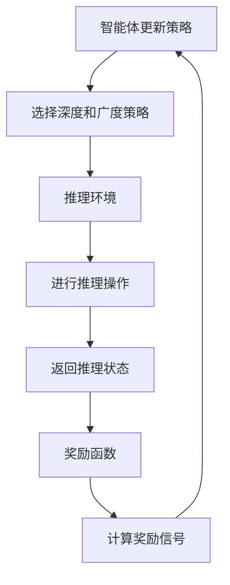

# 基于强化学习的动态推理深度与广度控制机制

> 关键词：强化学习、动态推理、深度控制、广度控制、推理机制

> 摘要：本文聚焦于基于强化学习的动态推理深度与广度控制机制，深入探讨其核心概念、算法原理、数学模型等方面。通过详细的Python代码实现和项目实战案例，展示了该机制在实际应用中的效果。同时，分析了其实际应用场景，推荐了相关的学习资源、开发工具和论文著作。最后对该领域的未来发展趋势与挑战进行了总结，旨在为相关研究和实践提供全面而深入的参考。

## 1. 背景介绍 
### 1.1 目的和范围
在当今复杂的人工智能和机器学习应用中，推理过程的效率和准确性至关重要。传统的推理机制往往采用固定的深度和广度策略，难以适应不同的任务需求和动态变化的环境。基于强化学习的动态推理深度与广度控制机制旨在解决这一问题，通过智能地调整推理的深度和广度，提高推理的效率和准确性。本文章的范围涵盖了该机制的核心概念、算法原理、数学模型、项目实战以及实际应用场景等方面。

### 1.2 预期读者
本文预期读者包括人工智能、机器学习领域的研究人员、工程师、开发者，以及对智能推理机制感兴趣的学生和爱好者。具备一定的编程基础和机器学习知识将有助于更好地理解本文内容。

### 1.3 文档结构概述
本文首先介绍基于强化学习的动态推理深度与广度控制机制的背景信息，包括目的、预期读者和文档结构。接着阐述核心概念与联系，给出相关的原理和架构示意图及流程图。然后详细讲解核心算法原理和具体操作步骤，通过Python源代码进行说明。之后介绍数学模型和公式，并举例说明。再通过项目实战展示代码实际案例和详细解释。随后分析实际应用场景，推荐相关的工具和资源。最后总结未来发展趋势与挑战，提供常见问题与解答和扩展阅读及参考资料。

### 1.4 术语表
#### 1.4.1 核心术语定义
- **强化学习**：一种机器学习范式，智能体通过与环境进行交互，根据环境反馈的奖励信号来学习最优行为策略。
- **动态推理**：在推理过程中根据不同的情况和需求动态调整推理策略的过程。
- **推理深度**：指推理过程中深入探索问题的程度，例如在搜索树中搜索的层数。
- **推理广度**：指推理过程中同时考虑的分支数量，例如在搜索树中每层扩展的节点数量。

#### 1.4.2 相关概念解释
- **智能体**：在强化学习中，智能体是执行动作并与环境进行交互的实体。
- **环境**：智能体所处的外部世界，智能体的动作会影响环境的状态，环境会返回奖励信号给智能体。
- **策略**：智能体选择动作的规则，强化学习的目标就是学习到最优策略。

#### 1.4.3 缩略词列表
- **RL**：Reinforcement Learning，强化学习
- **MDP**：Markov Decision Process，马尔可夫决策过程

## 2. 核心概念与联系 
### 核心概念原理
基于强化学习的动态推理深度与广度控制机制的核心思想是将推理过程视为一个强化学习问题。智能体在推理环境中不断尝试不同的推理深度和广度策略，根据环境反馈的奖励信号来学习最优的策略。

在传统的推理过程中，深度和广度往往是固定的，这可能导致在某些情况下推理效率低下或准确性不足。而动态推理深度与广度控制机制通过强化学习的方法，能够根据当前的推理状态和任务需求，实时调整推理的深度和广度，从而提高推理的效率和准确性。

### 架构的文本示意图
该机制的架构主要包括智能体、推理环境和奖励函数三个部分。智能体负责选择推理的深度和广度策略，推理环境根据智能体的策略进行推理操作，并返回当前的推理状态。奖励函数根据推理的结果和任务需求，计算智能体的奖励信号，智能体根据奖励信号更新自己的策略。

### Mermaid 流程图


## 3. 核心算法原理 & 具体操作步骤 
### 算法原理
基于强化学习的动态推理深度与广度控制机制通常基于马尔可夫决策过程（MDP）。MDP 是一个五元组 $(S, A, P, R, \gamma)$，其中：
- $S$ 是状态空间，表示推理过程中所有可能的状态。
- $A$ 是动作空间，表示智能体可以选择的所有动作，这里的动作是不同的推理深度和广度策略。
- $P$ 是状态转移概率，表示在当前状态下执行某个动作后转移到下一个状态的概率。
- $R$ 是奖励函数，表示在当前状态下执行某个动作后获得的奖励。
- $\gamma$ 是折扣因子，用于平衡即时奖励和未来奖励。

智能体的目标是学习一个最优策略 $\pi: S \to A$，使得在每个状态下选择的动作能够最大化长期累积奖励。

### 具体操作步骤
1. **初始化**：初始化智能体的策略、状态价值函数等。
2. **环境交互**：智能体根据当前策略选择一个动作（推理深度和广度策略），并将其应用到推理环境中。
3. **状态转移**：推理环境根据智能体的动作进行推理操作，返回新的状态和奖励信号。
4. **策略更新**：智能体根据新的状态和奖励信号，使用强化学习算法（如 Q-learning、深度 Q 网络（DQN）等）更新自己的策略和状态价值函数。
5. **终止条件判断**：判断是否满足终止条件（如达到最大推理步数、推理结果满足要求等），如果满足则结束推理过程，否则返回步骤 2。

### Python 源代码实现
```python
import numpy as np

# 定义状态空间和动作空间
state_space = [i for i in range(10)]  # 简单示例，10 个状态
action_space = [(i, j) for i in range(1, 4) for j in range(1, 4)]  # 深度和广度的组合，每个范围 1 到 3

# 初始化 Q 表
Q_table = np.zeros((len(state_space), len(action_space)))

# 定义超参数
alpha = 0.1  # 学习率
gamma = 0.9  # 折扣因子
epsilon = 0.1  # 探索率

# 定义奖励函数（简单示例）
def reward_function(state, action):
    depth, breadth = action
    if state % 2 == 0:
        return depth + breadth
    else:
        return -depth - breadth

# 定义选择动作的函数
def choose_action(state):
    if np.random.uniform(0, 1) < epsilon:
        # 探索：随机选择动作
        action_index = np.random.choice(len(action_space))
    else:
        # 利用：选择 Q 值最大的动作
        action_index = np.argmax(Q_table[state])
    return action_index

# 强化学习训练过程
num_episodes = 1000
for episode in range(num_episodes):
    state = np.random.choice(state_space)  # 随机初始化状态
    done = False
    while not done:
        action_index = choose_action(state)
        action = action_space[action_index]
        reward = reward_function(state, action)
        # 简单模拟状态转移（实际中根据推理环境确定）
        next_state = (state + 1) % len(state_space)
        # 更新 Q 表
        Q_table[state, action_index] = (1 - alpha) * Q_table[state, action_index] + alpha * (reward + gamma * np.max(Q_table[next_state]))
        state = next_state
        if state == 0:  # 简单终止条件
            done = True
```

## 4. 数学模型和公式 & 详细讲解 & 举例说明 
### 数学模型
基于强化学习的动态推理深度与广度控制机制的数学模型主要基于马尔可夫决策过程（MDP）。MDP 的核心是贝尔曼方程，它描述了状态价值函数 $V(s)$ 和动作价值函数 $Q(s, a)$ 之间的关系。

状态价值函数 $V(s)$ 表示在状态 $s$ 下，遵循策略 $\pi$ 所能获得的长期累积奖励的期望：
$$V^{\pi}(s) = \mathbb{E}_{\pi}\left[\sum_{t=0}^{\infty} \gamma^t R_{t+1} \mid S_0 = s\right]$$

动作价值函数 $Q(s, a)$ 表示在状态 $s$ 下执行动作 $a$，然后遵循策略 $\pi$ 所能获得的长期累积奖励的期望：
$$Q^{\pi}(s, a) = \mathbb{E}_{\pi}\left[\sum_{t=0}^{\infty} \gamma^t R_{t+1} \mid S_0 = s, A_0 = a\right]$$

贝尔曼方程将状态价值函数和动作价值函数联系起来：
$$V^{\pi}(s) = \sum_{a \in A} \pi(a \mid s) Q^{\pi}(s, a)$$
$$Q^{\pi}(s, a) = R(s, a) + \gamma \sum_{s' \in S} P(s' \mid s, a) V^{\pi}(s')$$

其中，$R(s, a)$ 是在状态 $s$ 下执行动作 $a$ 获得的即时奖励，$P(s' \mid s, a)$ 是在状态 $s$ 下执行动作 $a$ 转移到状态 $s'$ 的概率。

### 详细讲解
贝尔曼方程的核心思想是将长期累积奖励分解为即时奖励和未来奖励的组合。通过不断迭代求解贝尔曼方程，可以得到最优的状态价值函数和动作价值函数，从而得到最优策略。

在基于强化学习的动态推理深度与广度控制机制中，我们可以使用 Q-learning 算法来求解最优动作价值函数 $Q^*(s, a)$。Q-learning 算法的更新公式为：
$$Q(s, a) \leftarrow Q(s, a) + \alpha \left[R(s, a) + \gamma \max_{a'} Q(s', a') - Q(s, a)\right]$$

其中，$\alpha$ 是学习率，$\gamma$ 是折扣因子。

### 举例说明
假设我们有一个简单的推理任务，状态空间 $S = \{0, 1, 2\}$，动作空间 $A = \{(1, 1), (1, 2), (2, 1), (2, 2)\}$（深度和广度的组合）。奖励函数定义如下：
$$R(s, a) = \begin{cases}
10, & s = 0 \text{ and } a = (2, 2) \\
-5, & s = 1 \text{ and } a = (1, 1) \\
0, & \text{otherwise}
\end{cases}$$

初始时，$Q$ 表中的所有值都为 0。在训练过程中，智能体根据探索率 $\epsilon$ 选择动作，根据奖励函数获得奖励，并使用 Q-learning 更新公式更新 $Q$ 表。经过多次迭代，$Q$ 表会逐渐收敛到最优值，智能体就可以根据最优的 $Q$ 表选择动作。

## 5. 项目实战：代码实际案例和详细解释说明 
### 5.1  开发环境搭建
- **Python 环境**：建议使用 Python 3.6 及以上版本。可以从 Python 官方网站（https://www.python.org/downloads/） 下载并安装。
- **依赖库**：需要安装 `numpy` 库，用于数值计算。可以使用以下命令安装：
```sh
pip install numpy
```

### 5.2  源代码详细实现和代码解读
```python
import numpy as np

# 定义状态空间和动作空间
state_space = [i for i in range(5)]  # 5 个状态
action_space = [(i, j) for i in range(1, 3) for j in range(1, 3)]  # 深度和广度的组合，每个范围 1 到 2

# 初始化 Q 表
Q_table = np.zeros((len(state_space), len(action_space)))

# 定义超参数
alpha = 0.1  # 学习率
gamma = 0.9  # 折扣因子
epsilon = 0.1  # 探索率

# 定义奖励函数
def reward_function(state, action):
    depth, breadth = action
    if state == 0 and depth == 2 and breadth == 2:
        return 10
    elif state == 1 and depth == 1 and breadth == 1:
        return -5
    else:
        return 0

# 定义选择动作的函数
def choose_action(state):
    if np.random.uniform(0, 1) < epsilon:
        # 探索：随机选择动作
        action_index = np.random.choice(len(action_space))
    else:
        # 利用：选择 Q 值最大的动作
        action_index = np.argmax(Q_table[state])
    return action_index

# 强化学习训练过程
num_episodes = 1000
for episode in range(num_episodes):
    state = np.random.choice(state_space)  # 随机初始化状态
    done = False
    while not done:
        action_index = choose_action(state)
        action = action_space[action_index]
        reward = reward_function(state, action)
        # 简单模拟状态转移（实际中根据推理环境确定）
        next_state = (state + 1) % len(state_space)
        # 更新 Q 表
        Q_table[state, action_index] = (1 - alpha) * Q_table[state, action_index] + alpha * (reward + gamma * np.max(Q_table[next_state]))
        state = next_state
        if state == 0:  # 简单终止条件
            done = True

# 打印最终的 Q 表
print("Final Q-table:")
print(Q_table)
```

### 代码解读与分析
1. **状态空间和动作空间定义**：`state_space` 定义了推理过程中的所有可能状态，`action_space` 定义了智能体可以选择的所有推理深度和广度策略。
2. **Q 表初始化**：`Q_table` 用于存储每个状态和动作的 Q 值，初始时所有值都为 0。
3. **超参数设置**：`alpha` 是学习率，控制 Q 值更新的步长；`gamma` 是折扣因子，平衡即时奖励和未来奖励；`epsilon` 是探索率，控制智能体的探索和利用行为。
4. **奖励函数**：`reward_function` 根据当前状态和动作计算奖励，不同的状态和动作组合可能有不同的奖励值。
5. **选择动作**：`choose_action` 函数根据探索率选择动作，以一定的概率进行探索（随机选择动作），以一定的概率进行利用（选择 Q 值最大的动作）。
6. **训练过程**：通过多次迭代，智能体不断与环境交互，根据奖励信号更新 Q 表，直到达到终止条件。
7. **最终结果**：训练结束后，打印最终的 Q 表，智能体可以根据 Q 表选择最优的推理深度和广度策略。

## 6. 实际应用场景 
### 智能搜索系统
在智能搜索系统中，基于强化学习的动态推理深度与广度控制机制可以根据搜索任务的特点和用户需求，动态调整搜索的深度和广度。例如，在搜索一个复杂的知识图谱时，如果用户对搜索结果的准确性要求较高，可以适当增加推理深度；如果用户对搜索速度要求较高，可以适当增加推理广度。

### 机器人决策
在机器人决策中，该机制可以帮助机器人根据当前的环境状态和任务目标，动态选择合适的行动策略。例如，在机器人导航中，机器人可以根据地图信息和障碍物分布，动态调整搜索路径的深度和广度，以提高导航效率和安全性。

### 游戏 AI
在游戏 AI 中，该机制可以使游戏 AI 更加智能地进行决策。例如，在棋类游戏中，AI 可以根据当前的棋局状态，动态调整搜索的深度和广度，以寻找最优的落子策略。

## 7. 工具和资源推荐
### 7.1 学习资源推荐
#### 7.1.1 书籍推荐
- 《强化学习：原理与Python实现》：全面介绍了强化学习的基本原理和算法，并通过 Python 代码进行实现，适合初学者入门。
- 《Deep Reinforcement Learning Hands-On》：深入探讨了深度强化学习的相关技术和应用，包含大量的实战案例。

#### 7.1.2 在线课程
- Coursera 上的《Reinforcement Learning Specialization》：由知名学者授课，系统地介绍了强化学习的理论和实践。
- 吴恩达的《Machine Learning》课程中也有关于强化学习的部分内容，对于理解机器学习的整体框架很有帮助。

#### 7.1.3 技术博客和网站
- OpenAI Blog（https://openai.com/blog/）：提供了很多关于强化学习和人工智能的最新研究成果和技术文章。
- Towards Data Science（https://towardsdatascience.com/）：有大量的机器学习和强化学习相关的技术博客和教程。

### 7.2 开发工具框架推荐
#### 7.