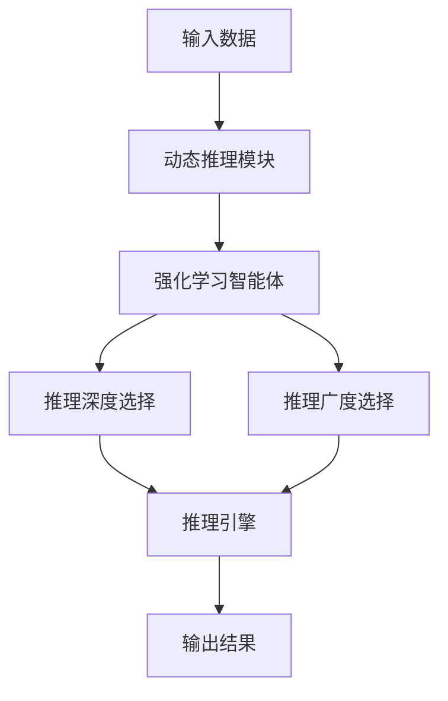

# 基于强化学习的动态推理深度与广度联合优化

> 关键词：强化学习、动态推理、深度与广度联合优化、推理效率、智能决策

> 摘要：本文聚焦于基于强化学习的动态推理深度与广度联合优化这一前沿技术。随着人工智能和深度学习的快速发展，推理过程的效率和准确性变得愈发重要。传统的推理方式往往采用固定的深度和广度，难以适应复杂多变的实际场景。本文详细阐述了强化学习在动态推理中深度与广度联合优化的核心概念、算法原理、数学模型，通过项目实战展示了具体实现过程，并探讨了其实际应用场景、推荐了相关工具和资源，最后对该技术的未来发展趋势与挑战进行了总结，旨在为相关领域的研究和应用提供全面且深入的参考。

## 1. 背景介绍 
### 1.1 目的和范围
在当今的人工智能和深度学习领域，模型的推理过程是一个关键环节。推理的效率和准确性直接影响着系统的性能和用户体验。传统的推理策略通常采用固定的深度和广度，这在面对复杂多变的输入数据和实际应用场景时，可能会导致推理效率低下、资源浪费等问题。本研究的目的是利用强化学习的方法，实现动态推理过程中深度与广度的联合优化，以提高推理效率和准确性，适应不同的应用需求。

本研究的范围涵盖了强化学习的基本原理、动态推理的概念、深度与广度联合优化的算法设计、数学模型的建立、实际项目的实现以及相关应用场景的探讨。通过理论分析和实验验证，全面深入地研究基于强化学习的动态推理深度与广度联合优化技术。

### 1.2 预期读者
本文的预期读者包括人工智能、机器学习、深度学习领域的研究人员、工程师和学生。对于希望了解强化学习在推理优化方面应用的专业人士，以及对提高模型推理效率和性能感兴趣的开发者，本文将提供有价值的技术参考和实践指导。同时，对于正在从事相关领域研究的学生，本文也可以作为学习和研究的重要资料。

### 1.3 文档结构概述
本文将按照以下结构进行组织：
- 核心概念与联系：介绍动态推理、强化学习以及深度与广度联合优化的核心概念，并通过文本示意图和 Mermaid 流程图展示它们之间的联系。
- 核心算法原理 & 具体操作步骤：详细讲解基于强化学习的动态推理深度与广度联合优化的算法原理，并使用 Python 源代码进行具体阐述。
- 数学模型和公式 & 详细讲解 & 举例说明：建立相关的数学模型，给出具体的公式，并通过实例进行详细讲解。
- 项目实战：代码实际案例和详细解释说明：通过一个实际项目，展示如何搭建开发环境、实现源代码，并对代码进行详细解读和分析。
- 实际应用场景：探讨基于强化学习的动态推理深度与广度联合优化技术在不同领域的实际应用场景。
- 工具和资源推荐：推荐相关的学习资源、开发工具框架和论文著作。
- 总结：未来发展趋势与挑战：总结该技术的发展现状，分析未来的发展趋势和面临的挑战。
- 附录：常见问题与解答：解答读者在学习和应用过程中可能遇到的常见问题。
- 扩展阅读 & 参考资料：提供相关的扩展阅读材料和参考资料，方便读者进一步深入研究。

### 1.4 术语表
#### 1.4.1 核心术语定义
- **强化学习（Reinforcement Learning）**：一种机器学习范式，智能体通过与环境进行交互，根据环境反馈的奖励信号来学习最优的行为策略，以最大化长期累积奖励。
- **动态推理（Dynamic Inference）**：在推理过程中，根据输入数据的特点和当前的推理状态，动态地调整推理的深度和广度，以提高推理效率和准确性。
- **推理深度（Inference Depth）**：指推理过程中所涉及的层次或步骤的数量。例如，在神经网络中，推理深度可以表示网络的层数。
- **推理广度（Inference Breadth）**：指在每个推理步骤中所考虑的分支或选项的数量。例如，在搜索算法中，推理广度可以表示每个节点的子节点数量。
- **联合优化（Joint Optimization）**：同时对多个目标或变量进行优化，以达到整体最优的效果。在本文中，指同时优化推理的深度和广度。

#### 1.4.2 相关概念解释
- **智能体（Agent）**：在强化学习中，智能体是执行决策和与环境进行交互的实体。在动态推理中，智能体负责根据当前的推理状态选择合适的推理深度和广度。
- **环境（Environment）**：智能体所处的外部世界，智能体的行为会对环境产生影响，同时环境会反馈奖励信号给智能体。在动态推理中，环境可以表示输入数据、推理任务和系统资源等因素。
- **奖励信号（Reward Signal）**：环境反馈给智能体的数值信号，用于评估智能体的行为效果。智能体的目标是通过学习最优的行为策略，最大化长期累积奖励。
- **策略（Policy）**：智能体根据当前状态选择行为的规则。在强化学习中，策略可以表示为一个函数，输入为当前状态，输出为选择的行为。

#### 1.4.3 缩略词列表
- **RL**：Reinforcement Learning，强化学习
- **DQN**：Deep Q-Network，深度 Q 网络
- **PPO**：Proximal Policy Optimization，近端策略优化

## 2. 核心概念与联系 

### 核心概念原理
#### 动态推理
动态推理的核心思想是根据输入数据的具体情况和当前的推理状态，实时地调整推理的深度和广度。在传统的推理过程中，推理的深度和广度通常是固定的，这可能会导致在处理简单数据时进行了过多的计算，而在处理复杂数据时又无法提供足够的推理能力。动态推理通过动态调整推理参数，可以在保证推理准确性的前提下，提高推理效率，节省计算资源。

#### 强化学习
强化学习是一种通过智能体与环境进行交互来学习最优行为策略的机器学习方法。智能体在环境中执行一系列的动作，并根据环境反馈的奖励信号来评估这些动作的好坏。智能体的目标是通过不断地尝试和学习，找到一种能够最大化长期累积奖励的行为策略。在动态推理中，强化学习可以用于智能地选择推理的深度和广度，以获得最佳的推理效果。

#### 深度与广度联合优化
深度与广度联合优化的目标是同时考虑推理的深度和广度，找到一种最优的组合方式，以提高推理的效率和准确性。推理深度和广度是相互关联的，增加推理深度可能会提高推理的准确性，但同时也会增加计算复杂度；增加推理广度可以扩大搜索范围，但也会消耗更多的资源。因此，需要通过联合优化的方法，在两者之间找到一个平衡点。

### 架构的文本示意图
```plaintext
+-------------------+
|    输入数据       |
+-------------------+
        |
        v
+-------------------+
|  动态推理模块     |
|  - 强化学习智能体 |
|  - 推理深度选择   |
|  - 推理广度选择   |
+-------------------+
        |
        v
+-------------------+
|  推理引擎         |
|  - 根据深度和广度 |
|    进行推理       |
+-------------------+
        |
        v
+-------------------+
|  输出结果         |
+-------------------+
```

### Mermaid 流程图


## 3. 核心算法原理 & 具体操作步骤 

### 算法原理
基于强化学习的动态推理深度与广度联合优化算法的核心思想是使用强化学习智能体来动态地选择推理的深度和广度。智能体将当前的推理状态作为输入，通过策略网络输出选择的推理深度和广度，然后将这些参数传递给推理引擎进行推理。推理完成后，环境会根据推理结果反馈一个奖励信号给智能体，智能体根据奖励信号更新策略网络，以学习更优的行为策略。

### 具体操作步骤
1. **初始化**：初始化强化学习智能体的策略网络和环境。
2. **获取当前状态**：从环境中获取当前的推理状态，包括输入数据的特征、当前的推理进度等。
3. **选择动作**：智能体根据当前状态，通过策略网络选择推理的深度和广度。
4. **执行推理**：将选择的深度和广度参数传递给推理引擎，进行推理操作。
5. **获取奖励**：环境根据推理结果反馈一个奖励信号给智能体，奖励信号可以根据推理的准确性、效率等因素进行设计。
6. **更新策略**：智能体根据奖励信号和当前状态，使用强化学习算法更新策略网络，以提高未来的决策能力。
7. **重复步骤 2 - 6**：不断循环执行上述步骤，直到达到终止条件。

### Python 源代码阐述
```python
import numpy as np
import torch
import torch.nn as nn
import torch.optim as optim

# 定义策略网络
class PolicyNetwork(nn.Module):
    def __init__(self, input_dim, output_dim):
        super(PolicyNetwork, self).__init__()
        self.fc1 = nn.Linear(input_dim, 128)
        self.fc2 = nn.Linear(128, output_dim)

    def forward(self, x):
        x = torch.relu(self.fc1(x))
        x = self.fc2(x)
        return x

# 定义强化学习智能体
class Agent:
    def __init__(self, input_dim, output_dim, learning_rate):
        self.policy_network = PolicyNetwork(input_dim, output_dim)
        self.optimizer = optim.Adam(self.policy_network.parameters(), lr=learning_rate)

    def choose_action(self, state):
        state = torch.FloatTensor(state).unsqueeze(0)
        action_probs = torch.softmax(self.policy_network(state), dim=1)
        action = torch.multinomial(action_probs, 1).item()
        return action

    def update_policy(self, states, actions, rewards):
        states = torch.FloatTensor(states)
        actions = torch.LongTensor(actions)
        rewards = torch.FloatTensor(rewards)

        action_probs = torch.softmax(self.policy_network(states), dim=1)
        log_probs = torch.log(action_probs.gather(1, actions.unsqueeze(1)).squeeze(1))
        loss = -(log_probs * rewards).mean()

        self.optimizer.zero_grad()
        loss.backward()
        self.optimizer.step()

# 定义环境
class Environment:
    def __init__(self):
        # 初始化环境参数
        pass

    def get_state(self):
        # 获取当前推理状态
        state = np.random.rand(10)  # 示例状态
        return state

    def step(self, action):
        # 执行动作并返回奖励和下一个状态
        reward = np.random.rand()  # 示例奖励
        next_state = self.get_state()
        return next_state, reward

# 主训练循环
def train():
    input_dim = 10
    output_dim = 5
    learning_rate = 0.001
    num_episodes = 100

    agent = Agent(input_dim, output_dim, learning_rate)
    env = Environment()

    for episode in range(num_episodes):
        states = []
        actions = []
        rewards = []

        state = env.get_state()
        done = False

        while not done:
            action = agent.choose_action(state)
            next_state, reward = env.step(action)

            states.append(state)
            actions.append(action)
            rewards.append(reward)

            state = next_state

        agent.update_policy(states, actions, rewards)

        if episode % 10 == 0:
            print(f"Episode {episode}: Total Reward = {sum(rewards)}")

if __name__ == "__main__":
    train()
```

## 4. 数学模型和公式 & 详细讲解 & 举例说明 

### 数学模型
设 $S$ 为推理状态的集合，$A$ 为动作的集合，其中动作 $a \in A$ 表示选择的推理深度和广度的组合。智能体的策略 $\pi(a|s)$ 表示在状态 $s \in S$ 下选择动作 $a$ 的概率。环境的奖励函数 $r(s, a)$ 表示在状态 $s$ 下执行动作 $a$ 所获得的即时奖励。

智能体的目标是最大化长期累积奖励，定义为：
$$G_t = \sum_{k=0}^{\infty} \gamma^k r_{t+k+1}$$
其中，$\gamma \in [0, 1]$ 是折扣因子，用于权衡即时奖励和未来奖励的重要性。

### 策略梯度算法
策略梯度算法通过直接优化策略网络的参数 $\theta$ 来最大化长期累积奖励的期望。策略网络的输出是动作的概率分布，即 $\pi(a|s; \theta)$。策略梯度的计算公式为：
$$\nabla_{\theta} J(\theta) = \mathbb{E}_{\pi_{\theta}}[\nabla_{\theta} \log \pi_{\theta}(a|s) G_t]$$
其中，$J(\theta)$ 是策略网络的目标函数，表示长期累积奖励的期望。

### 详细讲解
在实际应用中，我们使用蒙特卡罗方法来估计策略梯度。具体来说，我们通过与环境进行交互，收集一系列的状态、动作和奖励序列 $\{(s_0, a_0, r_0), (s_1, a_1, r_1), \cdots\}$，然后使用这些数据来计算策略梯度的估计值。

在更新策略网络时，我们使用随机梯度上升算法，即：
$$\theta \leftarrow \theta + \alpha \nabla_{\theta} J(\theta)$$
其中，$\alpha$ 是学习率。

### 举例说明
假设我们有一个简单的推理任务，推理状态 $s$ 是一个二维向量，表示输入数据的特征，动作 $a$ 有 3 种选择，分别对应不同的推理深度和广度组合。环境的奖励函数根据推理的准确性和效率来计算。

在一个训练周期中，智能体从环境中获取初始状态 $s_0$，然后根据策略网络选择动作 $a_0$。执行动作后，环境返回下一个状态 $s_1$ 和奖励 $r_0$。智能体继续在新的状态下选择动作，直到达到终止条件。

收集完一个训练周期的数据后，我们计算每个时间步的长期累积奖励 $G_t$，然后使用策略梯度算法更新策略网络的参数。通过不断地重复这个过程，智能体逐渐学习到最优的行为策略。

## 5. 项目实战：代码实际案例和详细解释说明 

### 5.1  开发环境搭建
#### 操作系统
本项目可以在 Windows、Linux 或 macOS 操作系统上进行开发。建议使用 Linux 系统，因为它在深度学习开发中具有更好的稳定性和性能。

#### Python 环境
安装 Python 3.7 或更高版本。可以使用 Anaconda 来管理 Python 环境，创建一个新的虚拟环境：
```bash
conda create -n dynamic_inference python=3.8
conda activate dynamic_inference
```

#### 深度学习框架
安装 PyTorch 深度学习框架，根据自己的 CUDA 版本选择合适的安装命令：
```bash
# CPU 版本
pip install torch torchvision

# GPU 版本（假设 CUDA 11.3）
pip install torch torchvision torchaudio --extra-index-url https://download.pytorch.org/whl/cu113
```

#### 其他依赖库
安装其他必要的依赖库：
```bash
pip install numpy matplotlib
```

### 5.2  源代码详细实现和代码解读
```python
import numpy as np
import torch
import torch.nn as nn
import torch.optim as optim
import matplotlib.pyplot as plt

# 定义策略网络
class PolicyNetwork(nn.Module):
    def __init__(self, input_dim, output_dim):
        super(PolicyNetwork, self).__init__()
        self.fc1 = nn.Linear(input_dim, 128)
        self.fc2 = nn.Linear(128, output_dim)

    def forward(self, x):
        x = torch.relu(self.fc1(x))
        x = self.fc2(x)
        return x

# 定义强化学习智能体
class Agent:
    def __init__(self, input_dim, output_dim, learning_rate):
        self.policy_network = PolicyNetwork(input_dim, output_dim)
        self.optimizer = optim.Adam(self.policy_network.parameters(), lr=learning_rate)

    def choose_action(self, state):
        state = torch.FloatTensor(state).unsqueeze(0)
        action_probs = torch.softmax(self.policy_network(state), dim=1)
        action = torch.multinomial(action_probs, 1).item()
        return action

    def update_policy(self, states, actions, rewards):
        states = torch.FloatTensor(states)
        actions = torch.LongTensor(actions)
        rewards = torch.FloatTensor(rewards)

        action_probs = torch.softmax(self.policy_network(states), dim=1)
        log_probs = torch.log(action_probs.gather(1, actions.unsqueeze(1)).squeeze(1))
        loss = -(log_probs * rewards).mean()

        self.optimizer.zero_grad()
        loss.backward()
        self.optimizer.step()

# 定义环境
class Environment:
    def __init__(self):
        self.state_dim = 10
        self.action_dim = 5
        self.max_steps = 100

    def reset(self):
        self.step_count = 0
        self.state = np.random.rand(self.state_dim)
        return self.state

    def step(self, action):
        self.step_count += 1
        # 简单的奖励函数示例
        reward = np.random.rand()
        done = self.step_count >= self.max_steps
        self.state = np.random.rand(self.state_dim)
        return self.state, reward, done

# 主训练循环
def train():
    input_dim = 10
    output_dim = 5
    learning_rate = 0.001
    num_episodes = 200
    rewards_history = []

    agent = Agent(input_dim, output_dim, learning_rate)
    env = Environment()

    for episode in range(num_episodes):
        states = []
        actions = []
        rewards = []

        state = env.reset()
        done = False

        while not done:
            action = agent.choose_action(state)
            next_state, reward, done = env.step(action)

            states.append(state)
            actions.append(action)
            rewards.append(reward)

            state = next_state

        agent.update_policy(states, actions, rewards)
        total_reward = sum(rewards)
        rewards_history.append(total_reward)

        if episode % 10 == 0:
            print(f"Episode {episode}: Total Reward = {total_reward}")

    # 绘制奖励曲线
    plt.plot(rewards_history)
    plt.xlabel('Episode')
    plt.ylabel('Total Reward')
    plt.title('Training Rewards')
    plt.show()

if __name__ == "__main__":
    train()
```

### 5.3  代码解读与分析
#### 策略网络
`PolicyNetwork` 类定义了一个简单的两层全连接神经网络，用于学习智能体的策略。输入层的维度为 `input_dim`，输出层的维度为 `output_dim`，表示动作的数量。

#### 强化学习智能体
`Agent` 类封装了智能体的行为和学习过程。`choose_action` 方法根据当前状态选择一个动作，`update_policy` 方法根据收集到的状态、动作和奖励数据更新策略网络的参数。

#### 环境
`Environment` 类模拟了推理环境，包括状态的初始化、动作的执行和奖励的反馈。`reset` 方法用于重置环境状态，`step` 方法用于执行动作并返回下一个状态、奖励和终止标志。

#### 主训练循环
`train` 函数是主训练循环，通过与环境进行交互，收集数据并更新策略网络。在每个训练周期结束后，打印总奖励并记录到 `rewards_history` 列表中。最后，绘制奖励曲线以直观地观察训练效果。

## 6. 实际应用场景 
### 自然语言处理
在自然语言处理任务中，如文本生成、机器翻译等，动态推理深度与广度联合优化可以根据输入文本的长度、复杂度和语义信息，动态地调整推理的深度和广度。例如，对于简单的文本输入，可以选择较小的推理深度和广度，以提高推理速度；对于复杂的文本输入，可以增加推理深度和广度，以提高生成文本的质量。

### 计算机视觉
在计算机视觉任务中，如图像分类、目标检测等，动态推理可以根据图像的分辨率、内容复杂度和目标的分布情况，动态地调整推理的深度和广度。例如，对于低分辨率的图像或简单的场景，可以选择较小的推理深度和广度；对于高分辨率的图像或复杂的场景，可以增加推理深度和广度，以提高检测的准确性。

### 智能推荐系统
在智能推荐系统中，动态推理可以根据用户的历史行为、兴趣偏好和当前的上下文信息，动态地调整推荐的深度和广度。例如，对于新用户或兴趣不明确的用户，可以选择较广的推荐范围，以扩大用户的选择空间；对于老用户或兴趣明确的用户，可以增加推荐的深度，提供更精准的推荐结果。

### 机器人导航
在机器人导航任务中，动态推理可以根据机器人当前的位置、环境信息和目标位置，动态地调整路径规划的深度和广度。例如，在简单的环境中，可以选择较短的搜索路径和较小的搜索范围；在复杂的环境中，可以增加搜索的深度和广度，以找到更优的路径。

## 7. 工具和资源推荐
### 7.1 学习资源推荐
#### 7.1.1 书籍推荐
- 《强化学习：原理与Python实现》：本书系统地介绍了强化学习的基本原理、算法和应用，并通过Python代码实现了各种强化学习算法，适合初学者入门。
- 《深度学习》：由 Ian Goodfellow、Yoshua Bengio 和 Aaron Courville 合著，是深度学习领域的经典教材，涵盖了深度学习的各个方面，包括神经网络、卷积神经网络、循环神经网络等。
- 《人工智能：一种现代的方法》：全面介绍了人工智能的基本概念、算法和应用，是人工智能领域的权威教材。

#### 7.1.2 在线课程
- Coursera 上的 “Reinforcement Learning Specialization”：由 University of Alberta 提供，包括四门课程，系统地介绍了强化学习的理论和实践。
- edX 上的 “Introduction to Artificial Intelligence”：由 Massachusetts Institute of Technology 提供，介绍了人工智能的基本概念、算法和应用。
- 吴恩达的 “Deep Learning Specialization”：在 Coursera 上提供，包括五门课程，深入介绍了深度学习的各个方面。

#### 7.1.3 技术博客和网站
- OpenAI Blog：OpenAI 官方博客，发布了许多关于人工智能和强化学习的最新研究成果和应用案例。
- DeepMind Blog：DeepMind 官方博客，分享了他们在人工智能领域的研究进展和技术创新。
- Towards Data Science：一个专注于数据科学和机器学习的技术博客，有许多关于强化学习和深度学习的高质量文章。

### 7.2 开发工具框架推荐
#### 7.2.1 IDE和编辑器
- PyCharm：一款功能强大的 Python IDE，提供了代码编辑、调试、版本控制等功能，适合开发 Python 项目。
- Jupyter Notebook：一个交互式的开发环境，支持 Python、R 等多种编程语言，适合进行数据分析和模型实验。
- Visual Studio Code：一款轻量级的代码编辑器，支持多种编程语言和插件，具有丰富的扩展功能。

#### 7.2.2 调试和性能分析工具
- TensorBoard：TensorFlow 提供的可视化工具，可以用于监控模型的训练过程、可视化模型结构和分析性能指标。
- PyTorch Profiler：PyTorch 提供的性能分析工具，可以帮助用户分析模型的运行时间、内存使用情况等。
- cProfile：Python 内置的性能分析工具，可以用于分析 Python 代码的性能瓶颈。

#### 7.2.3 相关框架和库
- PyTorch：一个开源的深度学习框架，提供了丰富的神经网络层、优化器和损失函数，支持 GPU 加速。
- TensorFlow：另一个广泛使用的深度学习框架，具有强大的分布式训练和部署能力。
- Stable Baselines3：一个基于 PyTorch 的强化学习库，提供了多种经典的强化学习算法的实现，方便用户进行强化学习实验。

### 7.3 相关论文著作推荐
#### 7.3.1 经典论文
- “Playing Atari with Deep Reinforcement Learning”：这篇论文提出了深度 Q 网络（DQN）算法，首次将深度学习与强化学习相结合，在 Atari 游戏上取得了很好的效果。
- “Asynchronous Methods for Deep Reinforcement Learning”：提出了异步优势演员 - 评论家（A3C）算法，通过异步更新的方式提高了强化学习的训练效率。
- “Proximal Policy Optimization Algorithms”：介绍了近端策略优化（PPO）算法，是一种高效的策略梯度算法，在许多强化学习任务中取得了很好的效果。

#### 7.3.2 最新研究成果
- 关注 NeurIPS、ICML、CVPR、ACL 等顶级学术会议的论文，这些会议收录了人工智能和强化学习领域的最新研究成果。
- 可以通过 arXiv 预印本平台获取最新的研究论文。

#### 7.3.3 应用案例分析
- 许多科技公司和研究机构会发布他们在实际项目中应用强化学习的案例分析，可以通过他们的官方网站或技术博客获取相关信息。
- 一些开源项目也提供了基于强化学习的应用案例，可以参考学习。

## 8. 总结：未来发展趋势与挑战
### 未来发展趋势
- **与其他技术的融合**：强化学习与深度学习、计算机视觉、自然语言处理等技术的融合将更加深入，产生更多创新的应用。例如，将强化学习应用于图像生成、视频理解等领域，提高模型的性能和灵活性。
- **多智能体强化学习**：多智能体强化学习将成为未来的研究热点，多个智能体之间的协作和竞争可以解决更复杂的问题，如机器人协作、交通流量控制等。
- **可解释性和安全性**：随着强化学习在越来越多的关键领域得到应用，模型的可解释性和安全性将变得越来越重要。未来的研究将致力于开发可解释的强化学习算法，提高模型的安全性和可靠性。
- **应用领域的拓展**：强化学习将在更多的领域得到应用，如医疗保健、金融、能源等。通过优化决策过程，提高这些领域的效率和效益。

### 挑战
- **样本效率问题**：强化学习通常需要大量的样本进行训练，样本效率较低。如何提高强化学习的样本效率，减少训练时间和资源消耗，是一个亟待解决的问题。
- **环境建模和奖励设计**：在实际应用中，准确地建模环境和设计合理的奖励函数是非常困难的。不合理的环境建模和奖励设计可能导致智能体学习到错误的行为策略，影响系统的性能。
- **模型的泛化能力**：强化学习模型在训练环境中表现良好，但在新的环境中可能会出现性能下降的问题。如何提高模型的泛化能力，使其能够适应不同的环境和任务，是一个重要的挑战。
- **计算资源需求**：随着模型规模的不断增大和训练数据的增加，强化学习对计算资源的需求也越来越高。如何在有限的计算资源下实现高效的训练和推理，是一个需要解决的问题。

## 9. 附录：常见问题与解答
### Q1：强化学习和监督学习有什么区别？
A1：强化学习和监督学习是两种不同的机器学习范式。监督学习是基于给定的输入 - 输出对进行学习，目标是学习一个映射函数，将输入映射到正确的输出。而强化学习是通过智能体与环境进行交互，根据环境反馈的奖励信号来学习最优的行为策略，目标是最大化长期累积奖励。

### Q2：如何设计合理的奖励函数？
A2：设计合理的奖励函数需要考虑任务的目标和要求。奖励函数应该能够准确地反映智能体的行为效果，激励智能体朝着目标前进。一般来说，可以从以下几个方面考虑：
- **任务目标**：奖励函数应该与任务的最终目标相关，例如在游戏中，奖励可以与得分相关。
- **中间步骤**：可以为智能体的中间步骤设置适当的奖励，以引导智能体朝着目标前进。
- **避免局部最优**：奖励函数应该避免智能体陷入局部最优解，可以设置一些惩罚项来避免不良行为。

### Q3：如何提高强化学习的样本效率？
A3：提高强化学习的样本效率可以从以下几个方面入手：
- **经验回放**：使用经验回放机制，将智能体的历史经验存储在回放缓冲区中，随机从中采样进行训练，提高样本的利用率。
- **探索策略优化**：采用更有效的探索策略，如 $\epsilon$-贪心策略、玻尔兹曼探索等，在探索和利用之间找到平衡。
- **模型复用**：利用预训练模型或迁移学习的方法，将在一个任务中学习到的知识迁移到另一个任务中，减少训练时间和样本需求。

### Q4：强化学习模型在实际应用中容易出现哪些问题？
A4：强化学习模型在实际应用中可能会出现以下问题：
- **不稳定性**：强化学习算法在训练过程中可能会出现不稳定的情况，导致模型的性能波动较大。
- **过拟合**：如果训练数据有限，模型可能会过拟合训练数据，在新的环境中表现不佳。
- **安全性问题**：在一些关键领域，如自动驾驶、医疗保健等，强化学习模型的决策可能会影响到人的生命安全，需要确保模型的安全性和可靠性。

## 10. 扩展阅读 & 参考资料
### 扩展阅读
- 《强化学习精要：核心算法与TensorFlow实现》
- 《动手学深度学习》
- 《深度强化学习实战》

### 参考资料
- Sutton, R. S., & Barto, A. G. (2018). Reinforcement learning: An introduction. MIT press.
- Mnih, V., Kavukcuoglu, K., Silver, D., Rusu, A. A., Veness, J., Bellemare, M. G.,... & Petersen, S. (2015). Human-level control through deep reinforcement learning. Nature, 518(7540), 529-533.
- Schulman, J., Wolski, F., Dhariwal, P., Radford, A., & Klimov, O. (2017). Proximal policy optimization algorithms. arXiv preprint arXiv:1707.06347.

作者：AI天才研究院/AI Genius Institute & 禅与计算机程序设计艺术 /Zen And The Art of Computer Programming