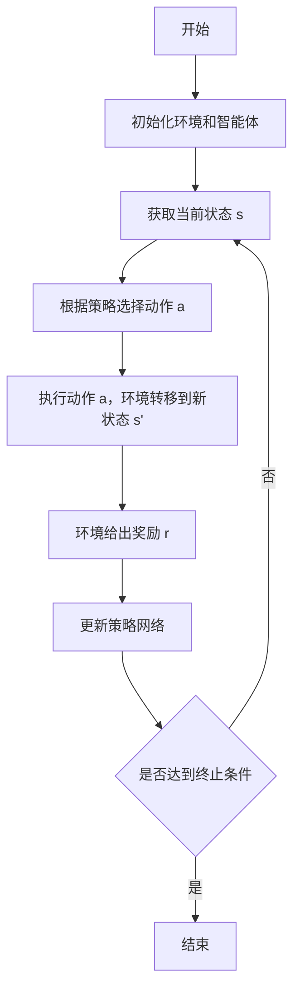

# 基于强化学习的多目标推理任务协同优化

> 关键词：强化学习、多目标推理任务、协同优化、马尔可夫决策过程、策略网络

> 摘要：本文聚焦于基于强化学习的多目标推理任务协同优化问题。首先介绍了该研究的背景、目的、预期读者和文档结构，明确相关术语。接着阐述了核心概念及其联系，包括强化学习、多目标推理任务等原理与架构，并给出相应的示意图和流程图。详细讲解了核心算法原理，用 Python 代码进行具体操作步骤的阐述，同时给出了相关的数学模型和公式，并举例说明。通过项目实战，展示了开发环境搭建、源代码实现与解读。探讨了实际应用场景，推荐了学习资源、开发工具框架以及相关论文著作。最后总结了未来发展趋势与挑战，解答常见问题，并提供扩展阅读与参考资料，旨在为该领域的研究和实践提供全面且深入的指导。

## 1. 背景介绍 
### 1.1 目的和范围
在当今复杂的计算环境中，多目标推理任务普遍存在。例如，在智能交通系统中，需要同时考虑车辆的行驶效率、安全性和能源消耗等多个目标；在医疗诊断中，要兼顾诊断的准确性、速度和成本等。传统的优化方法往往难以有效地处理这些具有多个相互冲突目标的推理任务。

强化学习作为一种强大的机器学习范式，通过智能体与环境的交互来学习最优策略，为解决多目标推理任务协同优化问题提供了新的途径。本文的目的在于深入研究如何利用强化学习技术实现多目标推理任务的协同优化，涵盖了从理论原理到实际应用的多个方面，包括核心概念的解释、算法原理的推导、代码实现以及实际场景的应用等。

### 1.2 预期读者
本文预期读者包括计算机科学、人工智能、控制科学等领域的研究人员和学生，对强化学习和多目标优化问题感兴趣的开发者，以及从事相关领域实际项目开发的工程师。无论是初学者希望了解该领域的基础知识，还是有一定经验的专业人士寻求深入的技术细节和实践指导，都能从本文中获得有价值的信息。

### 1.3 文档结构概述
本文将按照以下结构进行组织：
- 核心概念与联系：介绍强化学习、多目标推理任务等核心概念，阐述它们之间的联系，并给出原理和架构的示意图及流程图。
- 核心算法原理 & 具体操作步骤：详细讲解基于强化学习的多目标推理任务协同优化的核心算法原理，并用 Python 代码展示具体操作步骤。
- 数学模型和公式 & 详细讲解 & 举例说明：给出相关的数学模型和公式，进行详细讲解，并通过具体例子说明其应用。
- 项目实战：通过一个实际项目，介绍开发环境搭建、源代码实现和代码解读。
- 实际应用场景：探讨基于强化学习的多目标推理任务协同优化在不同领域的实际应用场景。
- 工具和资源推荐：推荐学习资源、开发工具框架以及相关论文著作。
- 总结：总结未来发展趋势与挑战。
- 附录：解答常见问题。
- 扩展阅读 & 参考资料：提供扩展阅读材料和参考资料。

### 1.4 术语表
#### 1.4.1 核心术语定义
- **强化学习（Reinforcement Learning）**：一种机器学习范式，智能体通过与环境进行交互，根据环境反馈的奖励信号来学习最优策略，以最大化长期累积奖励。
- **多目标推理任务（Multi - objective Inference Tasks）**：包含多个相互关联且可能相互冲突目标的推理任务，例如在图像识别中同时考虑识别准确率和识别速度。
- **协同优化（Collaborative Optimization）**：在多目标问题中，通过合理分配资源和协调各目标之间的关系，使多个目标同时得到优化的过程。
- **智能体（Agent）**：在强化学习中，能够感知环境状态、采取行动并与环境进行交互的实体。
- **环境（Environment）**：智能体所处的外部世界，智能体的行动会影响环境状态，环境会根据智能体的行动反馈奖励信号。

#### 1.4.2 相关概念解释
- **马尔可夫决策过程（Markov Decision Process, MDP）**：是强化学习的数学基础，描述了智能体在环境中的决策过程。一个 MDP 由状态集合 $S$、动作集合 $A$、状态转移概率 $P(s'|s,a)$、奖励函数 $R(s,a,s')$ 和折扣因子 $\gamma$ 组成。
- **策略（Policy）**：智能体在每个状态下选择动作的规则，通常用 $\pi(a|s)$ 表示在状态 $s$ 下选择动作 $a$ 的概率。
- **价值函数（Value Function）**：用于评估智能体在某个状态或状态 - 动作对下的长期价值，包括状态价值函数 $V(s)$ 和动作价值函数 $Q(s,a)$。

#### 1.4.3 缩略词列表
- **MDP**：Markov Decision Process（马尔可夫决策过程）
- **DQN**：Deep Q - Network（深度 Q 网络）
- **A2C**：Advantage Actor - Critic（优势演员 - 评论家算法）
- **PPO**：Proximal Policy Optimization（近端策略优化算法）

## 2. 核心概念与联系 

### 核心概念原理
#### 强化学习原理
强化学习的基本原理是智能体在环境中不断地进行探索和利用。智能体在每个时间步 $t$ 感知环境的状态 $s_t$，根据当前策略 $\pi$ 选择一个动作 $a_t$ 执行，环境根据智能体的动作转移到新的状态 $s_{t + 1}$，并给予智能体一个奖励 $r_{t+1}$。智能体的目标是学习一个最优策略 $\pi^*$，使得长期累积奖励 $G_t=\sum_{k = 0}^{\infty}\gamma^k r_{t + k+1}$ 最大化，其中 $\gamma\in[0,1]$ 是折扣因子，用于平衡即时奖励和未来奖励。

#### 多目标推理任务原理
多目标推理任务通常具有多个目标函数 $f_1(s,a),f_2(s,a),\cdots,f_n(s,a)$，这些目标函数可能相互冲突。例如，在资源分配问题中，一个目标可能是最大化系统的吞吐量，另一个目标可能是最小化资源的消耗。多目标推理任务的目标是找到一组最优的动作序列，使得所有目标函数在一定程度上都能得到优化。

#### 协同优化原理
协同优化的核心思想是通过合理的方法协调多个目标之间的关系。一种常见的方法是将多个目标函数组合成一个综合的目标函数，例如使用加权和的方法 $F(s,a)=\sum_{i = 1}^{n}w_i f_i(s,a)$，其中 $w_i$ 是每个目标函数的权重，满足 $\sum_{i = 1}^{n}w_i = 1$ 且 $w_i\geq0$。另一种方法是采用 Pareto 最优的概念，即找到一组非支配解，在这些解中，不存在一个解可以在不损害其他目标的情况下改进某个目标。

### 架构的文本示意图
```plaintext
+-------------------+       +-------------------+
|   多目标推理任务  |       |       环境        |
+-------------------+       +-------------------+
         |                          |
         v                          v
+-------------------+       +-------------------+
|  强化学习智能体   |       |  奖励生成器       |
+-------------------+       +-------------------+
         |                          |
         v                          v
+-------------------+       +-------------------+
|  策略网络          |       |  目标函数组合器  |
+-------------------+       +-------------------+
```
在这个架构中，多目标推理任务作为输入提供给强化学习智能体，智能体根据当前的策略网络选择动作。环境根据智能体的动作更新状态，并通过奖励生成器生成奖励信号。目标函数组合器将多个目标函数组合成一个综合的目标函数，用于指导智能体的学习。

### Mermaid 流程图

这个流程图展示了基于强化学习的多目标推理任务协同优化的基本流程。从初始化环境和智能体开始，智能体不断地感知状态、选择动作、执行动作并根据奖励信号更新策略网络，直到达到终止条件。

## 3. 核心算法原理 & 具体操作步骤 

### 核心算法原理
在基于强化学习的多目标推理任务协同优化中，我们可以采用 Actor - Critic 算法框架。Actor - Critic 算法结合了策略梯度算法和价值函数逼近的思想，其中 Actor 负责生成动作，Critic 负责评估动作的价值。

#### 策略网络（Actor）
策略网络 $\pi_{\theta}(a|s)$ 是一个参数为 $\theta$ 的神经网络，用于在状态 $s$ 下生成动作 $a$ 的概率分布。策略网络的目标是最大化长期累积奖励，我们可以使用策略梯度算法来更新策略网络的参数。策略梯度的基本思想是通过计算策略网络的梯度，使得策略朝着获得更高奖励的方向更新。策略梯度的计算公式为：
$$\nabla_{\theta}J(\theta)=\mathbb{E}_{s\sim\rho^{\pi},a\sim\pi_{\theta}(a|s)}[\nabla_{\theta}\log\pi_{\theta}(a|s)A^{\pi}(s,a)]$$
其中 $J(\theta)$ 是策略网络的目标函数，$\rho^{\pi}$ 是策略 $\pi$ 下的状态分布，$A^{\pi}(s,a)=Q^{\pi}(s,a)-V^{\pi}(s)$ 是优势函数，表示在状态 $s$ 下选择动作 $a$ 相对于平均动作的优势。

#### 价值网络（Critic）
价值网络 $V_{\phi}(s)$ 是一个参数为 $\phi$ 的神经网络，用于估计状态 $s$ 的价值。价值网络的目标是最小化估计值与真实值之间的误差，通常使用均方误差损失函数：
$$L(\phi)=\mathbb{E}_{s\sim\rho^{\pi}}[(V_{\phi}(s)-\hat{V}(s))^2]$$
其中 $\hat{V}(s)$ 是状态 $s$ 的真实价值估计，例如可以使用时序差分（TD）方法进行估计。

### 具体操作步骤
以下是使用 Python 和 PyTorch 实现基于 Actor - Critic 算法的多目标推理任务协同优化的具体步骤：

```python
import torch
import torch.nn as nn
import torch.optim as optim
import numpy as np

# 定义策略网络（Actor）
class Actor(nn.Module):
    def __init__(self, state_dim, action_dim):
        super(Actor, self).__init__()
        self.fc1 = nn.Linear(state_dim, 64)
        self.fc2 = nn.Linear(64, 64)
        self.fc3 = nn.Linear(64, action_dim)
        self.softmax = nn.Softmax(dim=-1)

    def forward(self, state):
        x = torch.relu(self.fc1(state))
        x = torch.relu(self.fc2(x))
        action_probs = self.softmax(self.fc3(x))
        return action_probs

# 定义价值网络（Critic）
class Critic(nn.Module):
    def __init__(self, state_dim):
        super(Critic, self).__init__()
        self.fc1 = nn.Linear(state_dim, 64)
        self.fc2 = nn.Linear(64, 64)
        self.fc3 = nn.Linear(64, 1)

    def forward(self, state):
        x = torch.relu(self.fc1(state))
        x = torch.relu(self.fc2(x))
        value = self.fc3(x)
        return value

# 定义训练函数
def train(state_dim, action_dim, num_episodes, gamma=0.99, lr_actor=0.001, lr_critic=0.001):
    actor = Actor(state_dim, action_dim)
    critic = Critic(state_dim)
    optimizer_actor = optim.Adam(actor.parameters(), lr=lr_actor)
    optimizer_critic = optim.Adam(critic.parameters(), lr=lr_critic)

    for episode in range(num_episodes):
        state = np.random.rand(state_dim)  # 初始化状态
        state = torch.FloatTensor(state)
        done = False
        while not done:
            # 选择动作
            action_probs = actor(state)
            action_dist = torch.distributions.Categorical(action_probs)
            action = action_dist.sample()

            # 执行动作，获取奖励和新状态
            # 这里简单模拟，实际应用中需要根据具体任务实现
            next_state = np.random.rand(state_dim)
            next_state = torch.FloatTensor(next_state)
            reward = np.random.rand()

            # 计算优势函数
            value = critic(state)
            next_value = critic(next_state)
            advantage = reward + gamma * next_value - value

            # 更新策略网络（Actor）
            log_prob = action_dist.log_prob(action)
            actor_loss = -log_prob * advantage.detach()
            optimizer_actor.zero_grad()
            actor_loss.backward()
            optimizer_actor.step()

            # 更新价值网络（Critic）
            critic_loss = advantage.pow(2).mean()
            optimizer_critic.zero_grad()
            critic_loss.backward()
            optimizer_critic.step()

            state = next_state

            # 判断是否结束
            if np.random.rand() < 0.1:  # 简单模拟终止条件
                done = True

        if episode % 100 == 0:
            print(f"Episode {episode}: Training...")

    return actor

# 示例使用
state_dim = 10
action_dim = 5
num_episodes = 1000
trained_actor = train(state_dim, action_dim, num_episodes)
```

### 代码解释
1. **策略网络（Actor）**：定义了一个三层全连接神经网络，最后一层使用 Softmax 函数输出动作的概率分布。
2. **价值网络（Critic）**：同样是一个三层全连接神经网络，输出状态的价值估计。
3. **训练函数**：在每个回合中，智能体根据策略网络选择动作，执行动作后获取奖励和新状态。计算优势函数，分别更新策略网络和价值网络的参数。
4. **示例使用**：设置状态维度、动作维度和训练回合数，调用训练函数进行训练。

## 4. 数学模型和公式 & 详细讲解 & 举例说明 

### 马尔可夫决策过程（MDP）
一个马尔可夫决策过程可以用一个五元组 $(S,A,P,R,\gamma)$ 表示：
- $S$ 是状态集合，智能体在每个时间步所处的状态 $s\in S$。
- $A$ 是动作集合，智能体在状态 $s$ 下可以选择的动作 $a\in A$。
- $P(s'|s,a)$ 是状态转移概率，表示在状态 $s$ 下执行动作 $a$ 后转移到状态 $s'$ 的概率。
- $R(s,a,s')$ 是奖励函数，表示在状态 $s$ 下执行动作 $a$ 并转移到状态 $s'$ 时获得的奖励。
- $\gamma\in[0,1]$ 是折扣因子，用于平衡即时奖励和未来奖励。

### 价值函数
#### 状态价值函数
状态价值函数 $V^{\pi}(s)$ 表示在策略 $\pi$ 下，从状态 $s$ 开始的长期累积奖励的期望：
$$V^{\pi}(s)=\mathbb{E}_{\pi}\left[\sum_{k = 0}^{\infty}\gamma^k r_{t + k+1}|s_t = s\right]$$

#### 动作价值函数
动作价值函数 $Q^{\pi}(s,a)$ 表示在策略 $\pi$ 下，从状态 $s$ 执行动作 $a$ 后，再继续按照策略 $\pi$ 执行的长期累积奖励的期望：
$$Q^{\pi}(s,a)=\mathbb{E}_{\pi}\left[\sum_{k = 0}^{\infty}\gamma^k r_{t + k+1}|s_t = s,a_t = a\right]$$

### 策略梯度公式
如前面所述，策略梯度的计算公式为：
$$\nabla_{\theta}J(\theta)=\mathbb{E}_{s\sim\rho^{\pi},a\sim\pi_{\theta}(a|s)}[\nabla_{\theta}\log\pi_{\theta}(a|s)A^{\pi}(s,a)]$$
其中 $\nabla_{\theta}\log\pi_{\theta}(a|s)$ 是策略网络的对数概率梯度，$A^{\pi}(s,a)$ 是优势函数。

### 举例说明
假设我们有一个简单的 MDP，状态集合 $S=\{s_1,s_2\}$，动作集合 $A=\{a_1,a_2\}$，状态转移概率如下：
$$P(s_1|s_1,a_1)=0.8, P(s_2|s_1,a_1)=0.2$$
$$P(s_1|s_1,a_2)=0.3, P(s_2|s_1,a_2)=0.7$$
奖励函数为：
$$R(s_1,a_1,s_1)=1, R(s_1,a_1,s_2)= - 1$$
$$R(s_1,a_2,s_1)= - 2, R(s_1,a_2,s_2)=3$$
折扣因子 $\gamma = 0.9$。

假设当前策略 $\pi$ 下，在状态 $s_1$ 选择动作 $a_1$ 的概率为 $0.6$，选择动作 $a_2$ 的概率为 $0.4$。我们可以计算状态 $s_1$ 的动作价值函数：
$$Q^{\pi}(s_1,a_1)=0.8\times(1 + 0.9\times V^{\pi}(s_1))+0.2\times(-1 + 0.9\times V^{\pi}(s_2))$$
$$Q^{\pi}(s_1,a_2)=0.3\times(-2 + 0.9\times V^{\pi}(s_1))+0.7\times(3 + 0.9\times V^{\pi}(s_2))$$
要计算 $V^{\pi}(s_1)$，可以使用公式 $V^{\pi}(s_1)=0.6\times Q^{\pi}(s_1,a_1)+0.4\times Q^{\pi}(s_1,a_2)$。

通过不断迭代更新策略和价值函数，我们可以找到最优策略，使得长期累积奖励最大化。

## 5. 项目实战：代码实际案例和详细解释说明 

### 5.1  开发环境搭建
#### 安装 Python
首先需要安装 Python 3.6 或更高版本。可以从 Python 官方网站（https://www.python.org/downloads/）下载并安装适合你操作系统的 Python 版本。

#### 安装 PyTorch
PyTorch 是一个常用的深度学习框架，用于实现强化学习算法。可以根据自己的 CUDA 版本（如果有 GPU）选择合适的安装命令，例如：
```sh
pip install torch torchvision torchaudio
```

#### 安装其他依赖库
还需要安装一些其他的依赖库，如 NumPy、Matplotlib 等：
```sh
pip install numpy matplotlib
```

### 5.2  源代码详细实现和代码解读
我们以一个简单的多目标资源分配问题为例，假设我们有 $n$ 个任务和 $m$ 个资源，每个任务有不同的优先级和资源需求，目标是同时最大化任务的完成数量和最小化资源的消耗。

```python
import torch
import torch.nn as nn
import torch.optim as optim
import numpy as np
import matplotlib.pyplot as plt

# 定义环境类
class ResourceAllocationEnv:
    def __init__(self, num_tasks, num_resources):
        self.num_tasks = num_tasks
        self.num_resources = num_resources
        self.task_demands = np.random.randint(1, 5, size=(num_tasks, num_resources))
        self.task_priorities = np.random.rand(num_tasks)
        self.resource_capacity = np.random.randint(10, 20, size=num_resources)
        self.reset()

    def reset(self):
        self.current_resources = self.resource_capacity.copy()
        self.unassigned_tasks = list(range(self.num_tasks))
        return self._get_state()

    def _get_state(self):
        state = np.concatenate([self.current_resources, self.task_priorities])
        return state

    def step(self, action):
        task_index = self.unassigned_tasks[action]
        task_demand = self.task_demands[task_index]
        if np.all(self.current_resources >= task_demand):
            self.current_resources -= task_demand
            self.unassigned_tasks.pop(action)
            reward1 = self.task_priorities[task_index]  # 任务优先级作为奖励 1
            reward2 = -np.sum(task_demand)  # 负资源消耗作为奖励 2
            reward = reward1 + reward2  # 综合奖励
            done = len(self.unassigned_tasks) == 0
        else:
            reward = -1  # 资源不足的惩罚
            done = False
        next_state = self._get_state()
        return next_state, reward, done

# 定义策略网络（Actor）
class Actor(nn.Module):
    def __init__(self, state_dim, action_dim):
        super(Actor, self).__init__()
        self.fc1 = nn.Linear(state_dim, 64)
        self.fc2 = nn.Linear(64, 64)
        self.fc3 = nn.Linear(64, action_dim)
        self.softmax = nn.Softmax(dim=-1)

    def forward(self, state):
        x = torch.relu(self.fc1(state))
        x = torch.relu(self.fc2(x))
        action_probs = self.softmax(self.fc3(x))
        return action_probs

# 定义价值网络（Critic）
class Critic(nn.Module):
    def __init__(self, state_dim):
        super(Critic, self).__init__()
        self.fc1 = nn.Linear(state_dim, 64)
        self.fc2 = nn.Linear(64, 64)
        self.fc3 = nn.Linear(64, 1)

    def forward(self, state):
        x = torch.relu(self.fc1(state))
        x = torch.relu(self.fc2(x))
        value = self.fc3(x)
        return value

# 定义训练函数
def train(env, num_episodes, gamma=0.99, lr_actor=0.001, lr_critic=0.001):
    state_dim = env.num_resources + env.num_tasks
    action_dim = env.num_tasks
    actor = Actor(state_dim, action_dim)
    critic = Critic(state_dim)
    optimizer_actor = optim.Adam(actor.parameters(), lr=lr_actor)
    optimizer_critic = optim.Adam(critic.parameters(), lr=lr_critic)

    rewards = []
    for episode in range(num_episodes):
        state = env.reset()
        state = torch.FloatTensor(state)
        episode_reward = 0
        done = False
        while not done:
            # 选择动作
            action_probs = actor(state)
            action_dist = torch.distributions.Categorical(action_probs)
            action = action_dist.sample()

            # 执行动作
            next_state, reward, done = env.step(action.item())
            next_state = torch.FloatTensor(next_state)
            episode_reward += reward

            # 计算优势函数
            value = critic(state)
            next_value = critic(next_state)
            advantage = reward + gamma * next_value - value

            # 更新策略网络（Actor）
            log_prob = action_dist.log_prob(action)
            actor_loss = -log_prob * advantage.detach()
            optimizer_actor.zero_grad()
            actor_loss.backward()
            optimizer_actor.step()

            # 更新价值网络（Critic）
            critic_loss = advantage.pow(2).mean()
            optimizer_critic.zero_grad()
            critic_loss.backward()
            optimizer_critic.step()

            state = next_state

        rewards.append(episode_reward)
        if episode % 100 == 0:
            print(f"Episode {episode}: Reward = {episode_reward}")

    plt.plot(rewards)
    plt.xlabel('Episode')
    plt.ylabel('Reward')
    plt.show()
    return actor

# 示例使用
num_tasks = 5
num_resources = 3
env = ResourceAllocationEnv(num_tasks, num_resources)
num_episodes = 1000
trained_actor = train(env, num_episodes)
```

### 5.3  代码解读与分析
#### 环境类（ResourceAllocationEnv）
- `__init__` 方法：初始化任务的资源需求、优先级和资源容量。
- `reset` 方法：重置环境状态，返回初始状态。
- `_get_state` 方法：获取当前环境状态，将当前资源和任务优先级拼接成一个向量。
- `step` 方法：执行动作，根据任务的资源需求判断是否可以分配资源，计算奖励并返回下一个状态和是否结束的标志。

#### 策略网络（Actor）和价值网络（Critic）
与前面的代码类似，分别用于生成动作和评估状态价值。

#### 训练函数（train）
- 初始化环境、策略网络和价值网络。
- 在每个回合中，智能体根据策略网络选择动作，执行动作后获取奖励和新状态。
- 计算优势函数，分别更新策略网络和价值网络的参数。
- 记录每个回合的奖励，并绘制奖励曲线。

通过这个项目实战，我们可以看到如何使用强化学习算法解决多目标推理任务协同优化问题，并且可以观察到智能体在训练过程中的学习效果。

## 6. 实际应用场景 
### 智能交通系统
在智能交通系统中，需要同时考虑多个目标，如车辆的行驶效率、安全性和能源消耗。基于强化学习的多目标推理任务协同优化可以用于交通信号控制、车辆路径规划等方面。例如，通过智能体学习最优的交通信号控制策略，使得车辆的平均等待时间最短，同时减少尾气排放。在车辆路径规划中，智能体可以根据实时交通状况和车辆的能源消耗情况，为车辆选择最优的行驶路径。

### 医疗诊断
医疗诊断中，医生需要在诊断的准确性、速度和成本之间进行权衡。强化学习可以用于辅助医疗诊断，智能体可以根据患者的症状、检查结果等信息，选择最优的诊断方案。例如，在选择检查项目时，智能体可以考虑检查的准确性和成本，同时尽量缩短诊断时间。

### 机器人控制
在机器人控制中，机器人需要完成多个任务，如导航、抓取物体等。每个任务可能有不同的目标，如导航任务需要尽快到达目的地，抓取任务需要准确地抓取物体。基于强化学习的多目标推理任务协同优化可以用于机器人的任务规划和动作控制，使得机器人能够在多个目标之间进行平衡，提高整体性能。

### 资源管理
在云计算、数据中心等领域，需要对资源进行合理的分配和管理。多个用户或任务可能同时竞争资源，每个用户或任务有不同的需求和优先级。强化学习可以用于资源分配问题，智能体可以根据用户的需求、任务的优先级和资源的使用情况，动态地分配资源，以最大化系统的吞吐量和资源利用率。

## 7. 工具和资源推荐
### 7.1 学习资源推荐
#### 7.1.1 书籍推荐
- 《Reinforcement Learning: An Introduction》（《强化学习：原理与Python实现》）：由 Richard S. Sutton 和 Andrew G. Barto 所著，是强化学习领域的经典教材，全面介绍了强化学习的基本概念、算法和应用。
- 《Deep Reinforcement Learning Hands-On》（《深度强化学习实战》）：由 Maxim Lapan 所著，通过实际案例介绍了深度强化学习的算法和实现，适合有一定编程基础的读者。

#### 7.1.2 在线课程
- Coursera 上的 “Reinforcement Learning Specialization”：由 University of Alberta 提供，包含多个强化学习相关的课程，从基础概念到高级算法都有涉及。
- Udemy 上的 “Complete Reinforcement Learning Course with Python”：通过实际项目介绍强化学习的应用，适合初学者快速入门。

#### 7.1.3 技术博客和网站
- OpenAI Blog（https://openai.com/blog/）：OpenAI 发布的最新研究成果和技术文章，涵盖了强化学习、人工智能等多个领域。
- Medium 上的 Towards Data Science（https://towardsdatascience.com/）：有很多关于强化学习的教程和实践经验分享。

### 7.2 开发工具框架推荐
#### 7.2.1 IDE和编辑器
- PyCharm：一款专业的 Python IDE，提供了丰富的代码编辑、调试和项目管理功能，适合开发强化学习项目。
- Jupyter Notebook：一种交互式的开发环境，可以方便地进行代码编写、实验和结果展示，非常适合初学者和研究人员。

#### 7.2.2 调试和性能分析工具
- TensorBoard：一个可视化工具，可用于监控训练过程中的损失函数、奖励曲线等指标，帮助调试和优化模型。
- Py-Spy：一个性能分析工具，可以分析 Python 代码的性能瓶颈，找出耗时较长的代码段。

#### 7.2.3 相关框架和库
- PyTorch：一个开源的深度学习框架，提供了丰富的神经网络层和优化算法，方便实现强化学习算法。
- Stable Baselines3：一个基于 PyTorch 的强化学习库，实现了多种经典的强化学习算法，如 A2C、PPO 等，可以快速搭建和训练强化学习模型。

### 7.3 相关论文著作推荐
#### 7.3.1 经典论文
- “Policy Gradient Methods for Reinforcement Learning with Function Approximation”：由 Richard S. Sutton 等人发表，介绍了策略梯度算法的基本原理和应用。
- “Human - Level Control through Deep Reinforcement Learning”：由 DeepMind 团队发表，提出了深度 Q 网络（DQN）算法，在 Atari 游戏中取得了人类水平的表现。

#### 7.3.2 最新研究成果
- 关注顶级学术会议如 NeurIPS、ICML、AAAI 等，这些会议上发表了很多关于强化学习和多目标优化的最新研究成果。
- 阅读相关学术期刊如 Journal of Artificial Intelligence Research（JAIR）、Artificial Intelligence 等，获取最新的理论和应用进展。

#### 7.3.3 应用案例分析
- 可以参考一些实际应用案例的论文，如在智能交通、医疗诊断等领域的应用，了解如何将强化学习技术应用到实际问题中，以及如何解决实际问题中遇到的挑战。

## 8. 总结：未来发展趋势与挑战
### 未来发展趋势
#### 多智能体强化学习
随着实际应用场景的复杂化，多智能体系统越来越受到关注。在多智能体强化学习中，多个智能体需要协同工作，共同完成多目标推理任务。未来的研究将集中在如何设计有效的多智能体协作策略，提高多智能体系统的整体性能。

#### 结合其他技术
强化学习可以与其他技术如深度学习、进化算法、迁移学习等相结合，进一步提高多目标推理任务协同优化的效果。例如，结合深度学习可以处理更复杂的状态和动作空间，结合迁移学习可以加速智能体的学习过程。

#### 实际应用拓展
强化学习在更多领域的实际应用将得到拓展，如金融、教育、农业等。通过解决这些领域中的多目标推理任务协同优化问题，可以为这些领域带来新的发展机遇。

### 挑战
#### 计算资源需求
强化学习算法通常需要大量的计算资源和时间进行训练，特别是在处理复杂的多目标推理任务时。如何降低计算资源需求，提高训练效率是一个亟待解决的问题。

#### 可解释性
强化学习模型往往是黑盒模型，其决策过程难以解释。在一些对可解释性要求较高的应用场景中，如医疗诊断、金融决策等，如何提高强化学习模型的可解释性是一个挑战。

#### 环境不确定性
实际应用场景中存在很多不确定性因素，如环境的动态变化、传感器噪声等。如何使强化学习智能体能够适应这些不确定性，提高在不确定环境下的性能是一个重要的研究方向。

## 9. 附录：常见问题与解答
### 问题 1：强化学习中的折扣因子 $\gamma$ 有什么作用？
折扣因子 $\gamma$ 用于平衡即时奖励和未来奖励。当 $\gamma$ 接近 1 时，智能体更关注未来的长期奖励；当 $\gamma$ 接近 0 时，智能体更关注即时奖励。合适的 $\gamma$ 值需要根据具体问题进行调整。

### 问题 2：如何选择策略网络和价值网络的结构？
策略网络和价值网络的结构通常根据问题的复杂度和状态、动作空间的维度来选择。一般来说，可以从简单的全连接神经网络开始，逐步增加网络的层数和神经元数量，直到达到满意的性能。也可以使用卷积神经网络（CNN）处理图像数据，使用循环神经网络（RNN）处理序列数据。

### 问题 3：在多目标推理任务中，如何确定目标函数的权重？
确定目标函数的权重是一个关键问题，通常需要根据具体问题和实际需求来确定。一种方法是通过专家经验或领域知识来手动设置权重；另一种方法是使用多目标优化算法，如 Pareto 优化，找到一组非支配解，让决策者根据实际情况选择合适的解。

### 问题 4：强化学习算法容易陷入局部最优解吗？
强化学习算法在一定程度上容易陷入局部最优解，特别是在复杂的环境中。为了避免陷入局部最优解，可以采用一些策略，如增加探索率、使用随机初始化、结合进化算法等。

## 10. 扩展阅读 & 参考资料
### 扩展阅读
- 《Multi - Objective Optimization Using Evolutionary Algorithms》：介绍了多目标优化的进化算法，可作为强化学习多目标优化的补充知识。
- 《Probabilistic Robotics》：涉及机器人领域的概率模型和算法，对于理解强化学习在机器人控制中的应用有帮助。

### 参考资料
- Sutton, R. S., & Barto, A. G. (2018). Reinforcement Learning: An Introduction. MIT press.
- Lapan, M. (2018). Deep Reinforcement Learning Hands - On. Packt Publishing Ltd.

作者：AI天才研究院/AI Genius Institute & 禅与计算机程序设计艺术 /Zen And The Art of Computer Programming