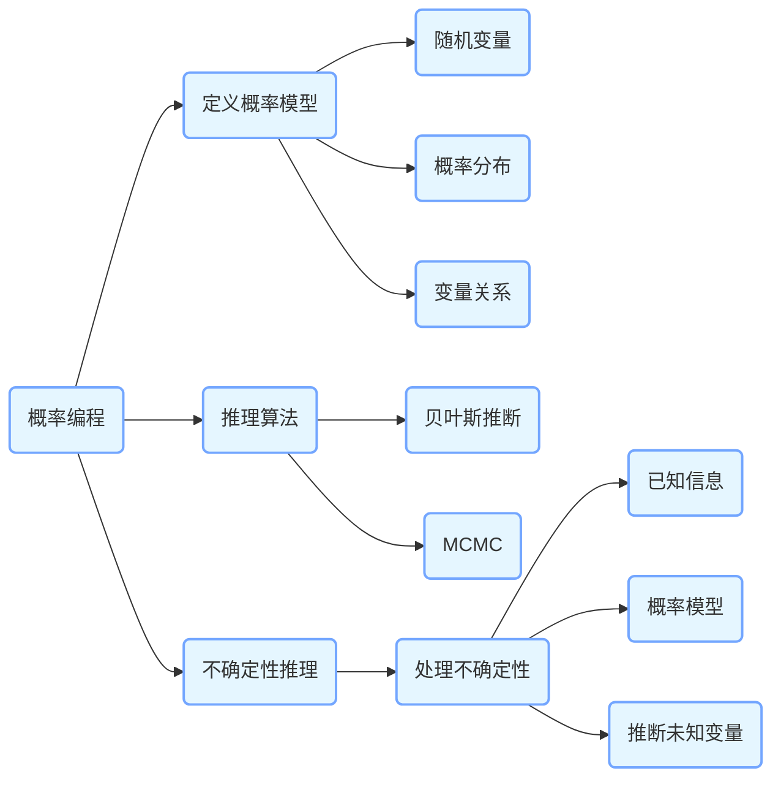

# 基于概率编程的不确定性推理模型设计

> 关键词：概率编程、不确定性推理、概率模型、贝叶斯推断、马尔可夫链蒙特卡罗

> 摘要：本文聚焦于基于概率编程的不确定性推理模型设计。首先介绍了概率编程和不确定性推理的背景知识，阐述了核心概念及其联系，包括概率模型、推理算法等。详细讲解了核心算法原理，并用 Python 代码进行了示例。探讨了相关的数学模型和公式，通过具体例子加深理解。给出了项目实战的详细步骤，从开发环境搭建到代码实现与解读。分析了该模型在多个领域的实际应用场景，推荐了学习资源、开发工具框架和相关论文著作。最后总结了未来发展趋势与挑战，并对常见问题进行了解答，为相关领域的研究和实践提供了全面的参考。

## 1. 背景介绍 
### 1.1 目的和范围
在现实世界中，许多问题都存在不确定性，例如天气预测、金融市场波动、医疗诊断等。传统的确定性模型难以准确描述这些具有不确定性的问题。概率编程为处理不确定性提供了一种强大的工具，它允许我们以编程的方式构建概率模型，并进行不确定性推理。本文的目的是深入探讨基于概率编程的不确定性推理模型的设计，包括核心概念、算法原理、数学模型以及实际应用等方面。范围涵盖了从基础理论到实际项目的实现，旨在为读者提供一个全面的关于概率编程和不确定性推理的知识体系。

### 1.2 预期读者
本文预期读者包括对概率编程、机器学习、人工智能等领域感兴趣的研究人员、开发者和学生。具有一定的编程基础（如 Python）和概率论知识的读者将更容易理解本文的内容。对于希望将概率编程应用于实际项目，解决不确定性问题的专业人士，本文也具有一定的参考价值。

### 1.3 文档结构概述
本文将按照以下结构进行组织：首先介绍相关的核心概念及其联系，包括概率编程和不确定性推理的基本原理和架构；接着详细讲解核心算法原理，并给出 Python 代码示例；然后探讨相关的数学模型和公式，并通过具体例子进行说明；之后进行项目实战，包括开发环境搭建、源代码实现和代码解读；分析该模型在实际中的应用场景；推荐学习资源、开发工具框架和相关论文著作；最后总结未来发展趋势与挑战，解答常见问题，并提供扩展阅读和参考资料。

### 1.4 术语表
#### 1.4.1 核心术语定义
- **概率编程**：一种编程范式，允许用户通过编写程序来定义概率模型，并使用自动化的推理算法对这些模型进行分析。
- **不确定性推理**：在存在不确定性的情况下，根据已知信息推断未知信息的过程。
- **概率模型**：对随机现象的数学描述，通常用概率分布来表示。
- **贝叶斯推断**：一种基于贝叶斯定理的统计推断方法，用于更新对未知参数的信念。
- **马尔可夫链蒙特卡罗（MCMC）**：一类用于从复杂概率分布中采样的算法。

#### 1.4.2 相关概念解释
- **先验分布**：在进行观测之前，对未知参数的概率分布的初始假设。
- **后验分布**：在考虑了观测数据之后，对未知参数的概率分布的更新。
- **似然函数**：描述了在给定未知参数的情况下，观测数据出现的概率。
- **采样**：从概率分布中生成随机样本的过程。

#### 1.4.3 缩略词列表
- **MCMC**：马尔可夫链蒙特卡罗（Markov Chain Monte Carlo）
- **HMC**：哈密顿蒙特卡罗（Hamiltonian Monte Carlo）
- **NUTS**：无回旋采样器（No-U-Turn Sampler）

## 2. 核心概念与联系 

### 2.1 概率编程的基本原理
概率编程的核心思想是将概率模型表示为程序。在概率编程中，我们可以使用编程语言来定义随机变量、概率分布和它们之间的关系。例如，我们可以定义一个随机变量 $X$ 服从正态分布 $N(\mu, \sigma^2)$，并通过程序来描述 $X$ 与其他随机变量的交互。

概率编程的优势在于它提供了一种灵活的方式来构建复杂的概率模型，并且可以使用自动化的推理算法来对这些模型进行分析。推理算法可以帮助我们计算后验分布、预测未知变量的值等。

### 2.2 不确定性推理的概念
不确定性推理是在存在不确定性的情况下进行推理的过程。在现实世界中，我们往往无法获得完全准确的信息，因此需要处理不确定性。不确定性推理的目标是根据已知的信息和概率模型，推断未知变量的可能取值和相应的概率。

例如，在医疗诊断中，医生可能只知道患者的一些症状，但无法确定患者具体患有哪种疾病。通过构建一个概率模型，考虑不同疾病的先验概率和症状与疾病之间的关联，医生可以使用不确定性推理来计算患者患有每种疾病的后验概率，从而做出更合理的诊断决策。

### 2.3 概率编程与不确定性推理的联系
概率编程为不确定性推理提供了一种有效的实现方式。通过概率编程，我们可以方便地定义复杂的概率模型，并且使用内置的推理算法来进行不确定性推理。例如，在 PyMC3 这样的概率编程库中，我们可以使用简单的 Python 代码来定义一个概率模型，然后调用相应的推理函数来计算后验分布。

概率编程的自动化推理算法可以处理高维、复杂的概率模型，大大提高了不确定性推理的效率和准确性。同时，概率编程的灵活性使得我们可以根据具体问题的特点来设计合适的概率模型，从而更好地处理不确定性。

### 2.4 核心概念的架构示意图



这个示意图展示了概率编程和不确定性推理的核心概念及其联系。概率编程主要包括定义概率模型和使用推理算法两个部分，而不确定性推理则是基于已知信息和概率模型来推断未知变量。概率编程为不确定性推理提供了实现的手段。

## 3. 核心算法原理 & 具体操作步骤 

### 3.1 贝叶斯推断原理
贝叶斯推断是概率编程中最常用的推理方法之一，它基于贝叶斯定理。贝叶斯定理的公式为：

$$P(\theta|D) = \frac{P(D|\theta)P(\theta)}{P(D)}$$

其中，$P(\theta|D)$ 是后验分布，表示在观测到数据 $D$ 之后，参数 $\theta$ 的概率分布；$P(D|\theta)$ 是似然函数，表示在给定参数 $\theta$ 的情况下，观测到数据 $D$ 的概率；$P(\theta)$ 是先验分布，表示在观测数据之前，对参数 $\theta$ 的概率分布的初始假设；$P(D)$ 是证据，是一个归一化常数，可以通过对分子在所有可能的 $\theta$ 值上进行积分得到。

贝叶斯推断的步骤如下：
1. **定义先验分布**：根据领域知识或经验，选择合适的先验分布来描述参数 $\theta$ 的初始不确定性。
2. **定义似然函数**：根据数据生成过程，确定似然函数 $P(D|\theta)$。
3. **计算后验分布**：使用贝叶斯定理计算后验分布 $P(\theta|D)$。

### 3.2 马尔可夫链蒙特卡罗（MCMC）算法原理
MCMC 是一类用于从复杂概率分布中采样的算法，在贝叶斯推断中非常常用。MCMC 算法的基本思想是构建一个马尔可夫链，使得该链的平稳分布就是我们要采样的目标分布（即后验分布）。

常见的 MCMC 算法包括 Metropolis-Hastings 算法和哈密顿蒙特卡罗（HMC）算法。下面以 Metropolis-Hastings 算法为例，介绍 MCMC 算法的步骤：

1. **初始化**：选择一个初始状态 $\theta_0$。
2. **迭代采样**：在每一步 $t$，从提议分布 $q(\theta'|\theta_t)$ 中生成一个候选状态 $\theta'$。
3. **计算接受概率**：计算接受概率 $\alpha = \min\left(1, \frac{P(\theta'|D)q(\theta_t|\theta')}{P(\theta_t|D)q(\theta'|\theta_t)}\right)$。
4. **决定是否接受**：以概率 $\alpha$ 接受候选状态 $\theta'$，即 $\theta_{t+1} = \theta'$；否则，保持当前状态不变，即 $\theta_{t+1} = \theta_t$。
5. **重复步骤 2 - 4**：直到达到足够的采样次数。

### 3.3 Python 代码示例
下面是一个使用 PyMC3 库进行贝叶斯推断的简单示例。假设我们有一组观测数据 $x$ 服从正态分布 $N(\mu, \sigma^2)$，我们想要推断参数 $\mu$ 和 $\sigma$ 的后验分布。

```python
import numpy as np
import pymc3 as pm
import matplotlib.pyplot as plt

# 生成观测数据
np.random.seed(123)
true_mu = 5
true_sigma = 2
n_samples = 100
x = np.random.normal(true_mu, true_sigma, n_samples)

# 构建概率模型
with pm.Model() as model:
    # 定义先验分布
    mu = pm.Normal('mu', mu=0, sd=10)
    sigma = pm.HalfNormal('sigma', sd=10)
    
    # 定义似然函数
    likelihood = pm.Normal('likelihood', mu=mu, sd=sigma, observed=x)
    
    # 进行采样
    trace = pm.sample(2000, tune=1000, cores=2)

# 绘制后验分布
pm.plot_trace(trace)
plt.show()
```

### 3.4 代码解释
1. **数据生成**：使用 `np.random.normal` 函数生成一组服从正态分布的观测数据。
2. **模型构建**：使用 `pm.Model()` 创建一个概率模型，在模型内部定义先验分布和似然函数。
3. **采样**：使用 `pm.sample` 函数进行采样，`tune` 参数表示预热期的采样次数，`cores` 参数表示使用的 CPU 核心数。
4. **结果可视化**：使用 `pm.plot_trace` 函数绘制后验分布的轨迹图。

## 4. 数学模型和公式 & 详细讲解 & 举例说明 

### 4.1 贝叶斯定理的详细讲解
贝叶斯定理 $P(\theta|D) = \frac{P(D|\theta)P(\theta)}{P(D)}$ 是贝叶斯推断的核心公式。下面对公式中的各个部分进行详细讲解：

- **先验分布 $P(\theta)$**：先验分布表示在观测数据之前，我们对参数 $\theta$ 的概率分布的初始假设。先验分布可以基于领域知识、经验或主观判断来选择。例如，在估计硬币正面朝上的概率 $p$ 时，如果我们没有任何先验信息，可以选择一个均匀分布 $U(0, 1)$ 作为先验分布。

- **似然函数 $P(D|\theta)$**：似然函数描述了在给定参数 $\theta$ 的情况下，观测数据 $D$ 出现的概率。似然函数的形式取决于数据生成过程。例如，如果观测数据 $x_1, x_2, \cdots, x_n$ 是独立同分布的，且服从正态分布 $N(\mu, \sigma^2)$，则似然函数为：

$$P(D|\mu, \sigma^2) = \prod_{i=1}^{n} \frac{1}{\sqrt{2\pi\sigma^2}} \exp\left(-\frac{(x_i - \mu)^2}{2\sigma^2}\right)$$

- **证据 $P(D)$**：证据是一个归一化常数，确保后验分布是一个有效的概率分布。证据可以通过对分子在所有可能的 $\theta$ 值上进行积分得到：

$$P(D) = \int P(D|\theta)P(\theta) d\theta$$

在实际应用中，由于证据的计算通常比较困难，我们可以使用 MCMC 等算法来直接采样后验分布，而不需要显式地计算证据。

### 4.2 举例说明
假设我们有一个硬币，我们想要估计硬币正面朝上的概率 $p$。我们进行了 $n$ 次独立的抛硬币实验，观测到正面朝上的次数为 $k$。

- **先验分布**：假设我们没有任何先验信息，选择一个均匀分布 $U(0, 1)$ 作为先验分布，即 $P(p) = 1$，其中 $0 \leq p \leq 1$。

- **似然函数**：由于抛硬币实验是一个二项分布，似然函数为：

$$P(D|p) = \binom{n}{k} p^k (1 - p)^{n - k}$$

- **后验分布**：根据贝叶斯定理，后验分布为：

$$P(p|D) = \frac{P(D|p)P(p)}{P(D)} = \frac{\binom{n}{k} p^k (1 - p)^{n - k} \times 1}{P(D)}$$

由于 $P(D)$ 是一个常数，我们可以忽略它，得到后验分布的形式为：

$$P(p|D) \propto p^k (1 - p)^{n - k}$$

可以证明，这个后验分布是一个 Beta 分布 $Beta(k + 1, n - k + 1)$。

### 4.3 马尔可夫链蒙特卡罗（MCMC）的数学原理
MCMC 算法的核心是构建一个马尔可夫链，使得该链的平稳分布就是我们要采样的目标分布。马尔可夫链是一个随机过程，它的下一个状态只依赖于当前状态。

设 $\pi(\theta)$ 是我们要采样的目标分布，$P(\theta'|\theta)$ 是马尔可夫链的转移概率。为了使马尔可夫链的平稳分布为 $\pi(\theta)$，需要满足细致平衡条件：

$$\pi(\theta)P(\theta'|\theta) = \pi(\theta')P(\theta|\theta')$$

Metropolis-Hastings 算法通过接受 - 拒绝机制来满足细致平衡条件。接受概率 $\alpha$ 的设计就是为了确保细致平衡条件成立。

## 5. 项目实战：代码实际案例和详细解释说明 

### 5.1  开发环境搭建
为了进行基于概率编程的不确定性推理模型的开发，我们需要搭建相应的开发环境。以下是具体步骤：

1. **安装 Python**：确保你已经安装了 Python 3.x 版本。可以从 Python 官方网站（https://www.python.org/downloads/）下载并安装。
2. **安装必要的库**：我们需要安装 PyMC3、NumPy、Matplotlib 等库。可以使用以下命令进行安装：

```bash
pip install pymc3 numpy matplotlib
```

### 5.2  源代码详细实现和代码解读
下面我们以一个简单的线性回归问题为例，展示如何使用 PyMC3 进行不确定性推理。

```python
import numpy as np
import pymc3 as pm
import matplotlib.pyplot as plt

# 生成模拟数据
np.random.seed(123)
true_slope = 2
true_intercept = 1
n_samples = 100
x = np.linspace(0, 1, n_samples)
y_true = true_slope * x + true_intercept
y = y_true + np.random.normal(0, 0.5, n_samples)

# 构建概率模型
with pm.Model() as linear_regression:
    # 定义先验分布
    slope = pm.Normal('slope', mu=0, sd=10)
    intercept = pm.Normal('intercept', mu=0, sd=10)
    sigma = pm.HalfNormal('sigma', sd=10)
    
    # 定义线性回归模型
    mu = slope * x + intercept
    
    # 定义似然函数
    likelihood = pm.Normal('likelihood', mu=mu, sd=sigma, observed=y)
    
    # 进行采样
    trace = pm.sample(2000, tune=1000, cores=2)

# 绘制后验分布
pm.plot_trace(trace)
plt.show()

# 绘制回归直线
plt.scatter(x, y, label='Data')
for i in range(100):
    slope_sample = trace['slope'][i]
    intercept_sample = trace['intercept'][i]
    y_pred = slope_sample * x + intercept_sample
    plt.plot(x, y_pred, color='red', alpha=0.1)
plt.xlabel('x')
plt.ylabel('y')
plt.title('Linear Regression with Uncertainty')
plt.legend()
plt.show()
```

### 5.3  代码解读与分析
1. **数据生成**：首先，我们生成了一组模拟数据，包括自变量 $x$ 和因变量 $y$。$y$ 是由一个线性函数加上高斯噪声生成的。
2. **模型构建**：在 `pm.Model()` 上下文管理器中，我们定义了先验分布、线性回归模型和似然函数。
    - **先验分布**：`slope` 和 `intercept` 分别表示斜率和截距，它们都服从正态分布；`sigma` 表示噪声的标准差，服从半正态分布。
    - **线性回归模型**：`mu = slope * x + intercept` 定义了线性回归的预测值。
    - **似然函数**：`likelihood` 表示观测数据 $y$ 的似然函数，服从正态分布。
3. **采样**：使用 `pm.sample` 函数进行采样，得到后验分布的样本。
4. **结果可视化**：
    - `pm.plot_trace` 函数绘制了后验分布的轨迹图，用于检查采样的收敛性。
    - 绘制了 100 条回归直线，每条直线对应一个后验样本，展示了回归直线的不确定性。

## 6. 实际应用场景 
### 6.1 医疗诊断
在医疗诊断中，医生通常只能获得患者的部分症状信息，而无法确定患者具体患有哪种疾病。基于概率编程的不确定性推理模型可以帮助医生综合考虑各种疾病的先验概率、症状与疾病之间的关联以及患者的具体症状，计算患者患有每种疾病的后验概率。例如，在诊断心脏病时，可以考虑患者的年龄、性别、家族病史、血压、血脂等因素，构建一个概率模型，使用不确定性推理来辅助诊断。

### 6.2 金融风险评估
金融市场充满了不确定性，投资者需要评估各种投资的风险。概率编程可以用于构建金融风险评估模型，考虑市场波动、利率变化、宏观经济因素等不确定性因素。例如，在评估股票投资的风险时，可以使用概率模型来预测股票价格的未来走势，并计算投资组合的风险价值（VaR）。

### 6.3 气象预测
气象系统非常复杂，存在许多不确定性因素。概率编程可以用于构建气象预测模型，考虑大气环流、海洋温度、地形等因素，对天气情况进行不确定性推理。例如，预测降雨概率、气温变化等。

### 6.4 自动驾驶
在自动驾驶中，车辆需要对周围环境进行感知和决策。由于传感器数据存在噪声和不确定性，基于概率编程的不确定性推理模型可以帮助车辆更好地处理这些不确定性。例如，通过对传感器数据进行概率建模，推断其他车辆和行人的位置、速度和运动意图，从而做出更安全的决策。

## 7. 工具和资源推荐
### 7.1 学习资源推荐
#### 7.1.1 书籍推荐
- 《Probabilistic Programming and Bayesian Methods for Hackers》：这本书以通俗易懂的方式介绍了概率编程和贝叶斯方法，通过大量的实例帮助读者理解和应用这些技术。
- 《Bayesian Data Analysis》：这是一本经典的贝叶斯数据分析教材，详细介绍了贝叶斯推断的理论和方法，包括先验分布的选择、后验分布的计算、MCMC 算法等。

#### 7.1.2 在线课程
- Coursera 上的“Probabilistic Graphical Models”：该课程介绍了概率图模型的基本概念和算法，包括贝叶斯网络、马尔可夫随机场等，是学习概率编程的重要基础。
- edX 上的“Introduction to Probability-The Science of Uncertainty and Data”：这门课程系统地介绍了概率论的基础知识，对于理解概率编程和不确定性推理非常有帮助。

#### 7.1.3 技术博客和网站
- PyMC3 官方文档（https://docs.pymc.io/）：提供了 PyMC3 库的详细文档和示例代码，是学习 PyMC3 的重要资源。
- Towards Data Science（https://towardsdatascience.com/）：这是一个数据科学领域的技术博客平台，上面有很多关于概率编程和不确定性推理的文章。

### 7.2 开发工具框架推荐
#### 7.2.1 IDE和编辑器
- Jupyter Notebook：是一个交互式的开发环境，非常适合进行数据探索和模型实验。可以方便地编写代码、运行代码和展示结果。
- PyCharm：是一款专业的 Python 集成开发环境，提供了丰富的代码编辑、调试和项目管理功能。

#### 7.2.2 调试和性能分析工具
- `arviz`：是一个用于可视化和诊断贝叶斯模型的 Python 库，可以帮助我们检查 MCMC 采样的收敛性、绘制后验分布等。
- `line_profiler`：可以对 Python 代码进行逐行性能分析，帮助我们找出代码中的性能瓶颈。

#### 7.2.3 相关框架和库
- PyMC3：是一个用于概率编程的 Python 库，提供了丰富的概率分布和推理算法，支持贝叶斯推断和 MCMC 采样。
- TensorFlow Probability：是 TensorFlow 的一个扩展库，用于构建和训练概率模型。它提供了自动微分和分布式训练等功能，适用于大规模的概率编程任务。

### 7.3 相关论文著作推荐
#### 7.3.1 经典论文
- “Markov Chain Monte Carlo in Practice”：这篇论文介绍了 MCMC 算法的基本原理和应用，是 MCMC 领域的经典文献。
- “Bayesian Inference in Statistical Analysis”：这篇论文系统地介绍了贝叶斯推断的理论和方法，对贝叶斯统计学的发展产生了重要影响。

#### 7.3.2 最新研究成果
- 在 arXiv（https://arxiv.org/）上搜索“probabilistic programming”和“uncertainty reasoning”可以找到很多关于概率编程和不确定性推理的最新研究成果。
- 顶级学术会议如 NeurIPS、ICML、UAI 等也会发表相关的研究论文。

#### 7.3.3 应用案例分析
- 《Probabilistic Programming: Practical Applications》：这本书收集了概率编程在各个领域的应用案例，包括医疗、金融、气象等，对于了解概率编程的实际应用非常有帮助。

## 8. 总结：未来发展趋势与挑战
### 8.1 未来发展趋势
- **深度学习与概率编程的融合**：深度学习在图像识别、自然语言处理等领域取得了巨大的成功，但缺乏对不确定性的有效处理。概率编程可以为深度学习提供一种处理不确定性的方法，两者的融合将有望在更复杂的任务中取得更好的效果。
- **大规模概率编程**：随着数据量的不断增加，需要开发能够处理大规模数据的概率编程算法和工具。分布式计算和并行计算技术将在大规模概率编程中发挥重要作用。
- **概率编程在新兴领域的应用**：概率编程将在更多的新兴领域得到应用，如量子计算、生物信息学、自动驾驶等。这些领域的问题通常具有高度的不确定性，概率编程可以为解决这些问题提供有效的方法。

### 8.2 挑战
- **计算效率**：概率编程中的推理算法通常计算复杂度较高，尤其是在处理高维、复杂的概率模型时。提高计算效率是概率编程面临的一个重要挑战。
- **模型可解释性**：虽然概率编程可以提供不确定性的量化，但模型的可解释性仍然是一个问题。如何让用户更好地理解概率模型的结果和不确定性是需要解决的问题。
- **先验分布的选择**：先验分布的选择对贝叶斯推断的结果有重要影响，但在实际应用中，先验分布的选择往往比较困难。如何选择合适的先验分布是概率编程中的一个挑战。

## 9. 附录：常见问题与解答
### 9.1 概率编程和传统编程有什么区别？
概率编程和传统编程的主要区别在于，概率编程允许我们在程序中引入不确定性。在传统编程中，程序的执行结果是确定的，而在概率编程中，我们可以定义随机变量和概率分布，程序的执行结果是一个概率分布。概率编程主要用于处理不确定性问题，如贝叶斯推断、机器学习中的概率模型等。

### 9.2 如何选择合适的先验分布？
选择合适的先验分布需要考虑以下几个因素：
- **领域知识**：根据领域知识和经验，选择能够反映我们对参数的初始信念的先验分布。
- **数据量**：如果数据量较大，先验分布的影响会相对较小，可以选择较为宽泛的先验分布；如果数据量较小，先验分布的影响会相对较大，需要选择较为合理的先验分布。
- **计算复杂度**：一些先验分布可能会导致计算复杂度较高，需要选择计算复杂度较低的先验分布。

### 9.3 MCMC 算法的收敛性如何判断？
可以使用以下方法来判断 MCMC 算法的收敛性：
- **轨迹图**：绘制 MCMC 采样的轨迹图，如果轨迹图在一段时间后趋于平稳，说明采样可能已经收敛。
- **自相关函数**：计算 MCMC 采样的自相关函数，如果自相关函数在较短的滞后阶数内迅速衰减，说明采样的独立性较好，可能已经收敛。
- **R-hat 统计量**：R-hat 统计量是一种常用的收敛诊断工具，如果 R-hat 值接近 1，说明采样已经收敛。

## 10. 扩展阅读 & 参考资料
- 《Machine Learning: A Probabilistic Perspective》，作者：Kevin P. Murphy
- 《Probabilistic Robotics》，作者：Sebastian Thrun, Wolfram Burgard, Dieter Fox
- PyMC3 官方文档：https://docs.pymc.io/
- TensorFlow Probability 官方文档：https://www.tensorflow.org/probability

作者：AI天才研究院/AI Genius Institute & 禅与计算机程序设计艺术 /Zen And The Art of Computer Programming