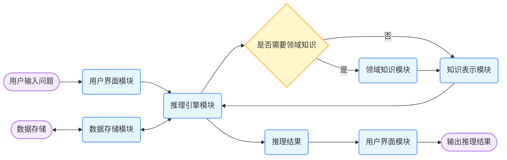

# 基于模块化设计的可定制多领域推理系统

> 关键词：模块化设计、可定制、多领域推理系统、知识表示、推理算法

> 摘要：本文围绕基于模块化设计的可定制多领域推理系统展开深入研究。首先介绍了该系统提出的背景、目的和适用读者，对相关术语进行了详细定义。接着阐述了核心概念及其联系，给出了原理和架构的文本示意图与 Mermaid 流程图。通过 Python 代码详细讲解了核心算法原理和具体操作步骤，并结合数学模型和公式进行理论分析。在项目实战部分，介绍了开发环境搭建，给出源代码实现及详细解读。探讨了该系统的实际应用场景，推荐了相关的学习资源、开发工具框架和论文著作。最后总结了系统的未来发展趋势与挑战，并提供了常见问题解答和扩展阅读参考资料，旨在为构建高效、灵活的多领域推理系统提供全面的技术指导。

## 1. 背景介绍 
### 1.1 目的和范围
在当今复杂多变的信息时代，不同领域对于知识推理有着多样化且独特的需求。例如，医疗领域需要根据患者的症状、病史等信息进行疾病诊断推理；金融领域需要依据市场数据、风险指标等进行投资决策推理。传统的推理系统往往是针对特定领域进行设计和开发的，缺乏灵活性和可扩展性，难以适应多个领域的不同需求。因此，开发一个基于模块化设计的可定制多领域推理系统具有重要的现实意义。

本系统的目的在于构建一个通用的推理平台，该平台可以通过模块化的方式进行灵活组合和定制，以满足不同领域的推理需求。系统的范围涵盖了知识表示、推理算法、领域知识集成等多个方面，旨在提供一个完整的解决方案，帮助用户快速搭建适合自己领域的推理系统。

### 1.2 预期读者
本文预期的读者主要包括以下几类人群：
- 人工智能领域的研究人员：对推理系统的设计和实现感兴趣，希望通过模块化的方式探索多领域推理的新方法和技术。
- 软件开发工程师：负责开发各种应用系统，需要集成推理功能，希望借助本系统的设计思路实现可定制的推理模块。
- 各领域的专业人士：如医疗、金融、教育等领域的专家，希望利用推理系统来辅助决策、诊断等工作，对系统的定制性和易用性有较高要求。
- 学生和爱好者：对人工智能和推理技术有浓厚兴趣，希望通过学习本文了解多领域推理系统的基本原理和实现方法。

### 1.3 文档结构概述
本文将按照以下结构进行详细阐述：
- 核心概念与联系：介绍系统的核心概念，包括模块化设计、可定制性、多领域推理等，并给出这些概念之间的联系和架构示意图。
- 核心算法原理 & 具体操作步骤：详细讲解系统所采用的核心推理算法，通过 Python 代码展示具体的实现步骤。
- 数学模型和公式 & 详细讲解 & 举例说明：运用数学模型和公式对推理过程进行理论分析，并结合实际例子进行说明。
- 项目实战：提供一个完整的项目实战案例，包括开发环境搭建、源代码实现和详细的代码解读。
- 实际应用场景：探讨系统在不同领域的实际应用场景和效果。
- 工具和资源推荐：推荐相关的学习资源、开发工具框架和论文著作，帮助读者进一步深入学习和研究。
- 总结：未来发展趋势与挑战：总结系统的优势和不足，展望未来的发展趋势，并分析可能面临的挑战。
- 附录：常见问题与解答：对读者可能遇到的常见问题进行解答。
- 扩展阅读 & 参考资料：提供相关的扩展阅读材料和参考资料，方便读者进一步探索。

### 1.4 术语表
#### 1.4.1 核心术语定义
- 模块化设计：将系统分解为多个独立的模块，每个模块具有特定的功能和接口，模块之间可以通过接口进行交互和组合。
- 可定制：系统允许用户根据自己的需求对模块进行选择、配置和扩展，以满足不同的应用场景。
- 多领域推理：系统能够处理多个不同领域的知识和推理任务，如医疗、金融、教育等领域。
- 知识表示：将领域知识以某种形式进行表示，以便计算机能够理解和处理，常见的知识表示方法包括规则表示、语义网络、本体等。
- 推理算法：根据已知的知识和事实，通过一定的规则和方法推导出新的结论的算法，如正向推理、反向推理、模糊推理等。

#### 1.4.2 相关概念解释
- 知识图谱：一种基于图的数据结构，用于表示实体之间的关系和知识，是知识表示的一种重要方式。
- 本体：对领域内概念、关系和规则的形式化描述，是一种更严格、更规范的知识表示方法。
- 专家系统：一种基于知识的智能系统，利用专家的知识和经验进行推理和决策，是推理系统的一种典型应用。

#### 1.4.3 缩略词列表
- AI：Artificial Intelligence，人工智能
- KB：Knowledge Base，知识库
- RDF：Resource Description Framework，资源描述框架
- OWL：Web Ontology Language，网络本体语言

## 2. 核心概念与联系 
### 核心概念原理
#### 模块化设计原理
模块化设计是本系统的核心思想之一。其原理是将系统按照功能划分为多个独立的模块，每个模块负责完成特定的任务。例如，可以将系统划分为知识表示模块、推理引擎模块、领域知识模块等。每个模块具有清晰的接口，模块之间通过接口进行交互和通信。这种设计方式使得系统具有高度的灵活性和可扩展性，用户可以根据自己的需求选择不同的模块进行组合，实现定制化的推理系统。

#### 可定制原理
可定制性是本系统的另一个重要特性。系统允许用户根据自己的需求对模块进行配置和扩展。例如，用户可以选择不同的知识表示方法、推理算法，还可以添加自己的领域知识。系统提供了一系列的配置接口和扩展机制，用户可以通过这些接口和机制来实现定制化的需求。

#### 多领域推理原理
多领域推理是指系统能够处理多个不同领域的知识和推理任务。其原理是通过采用通用的知识表示方法和推理算法，将不同领域的知识进行统一表示和处理。同时，系统为每个领域提供了独立的领域知识模块，用户可以根据需要加载不同的领域知识模块，实现多领域的推理功能。

### 架构的文本示意图
本系统的架构主要由以下几个部分组成：
- 用户界面模块：提供用户与系统交互的界面，用户可以通过该界面输入问题、查看推理结果等。
- 知识表示模块：负责将领域知识以某种形式进行表示，如规则表示、语义网络、本体等。
- 推理引擎模块：根据已知的知识和事实，运用推理算法进行推理，得出新的结论。
- 领域知识模块：存储不同领域的知识，每个领域的知识可以独立管理和加载。
- 数据存储模块：用于存储系统运行过程中的数据，如知识图谱、推理结果等。

用户通过用户界面模块输入问题，系统将问题传递给推理引擎模块。推理引擎模块根据知识表示模块中表示的知识和领域知识模块中存储的领域知识，运用推理算法进行推理，得出推理结果。推理结果通过用户界面模块反馈给用户。同时，系统将推理过程中的数据存储在数据存储模块中，以便后续的查询和分析。

### Mermaid 流程图


## 3. 核心算法原理 & 具体操作步骤 
### 核心算法原理
本系统采用正向推理算法作为核心推理算法。正向推理是一种从已知事实出发，按照一定的推理规则，逐步推导出新的结论的推理方法。其基本原理如下：
- 初始化：将已知的事实和规则存储在知识库中。
- 匹配：从知识库中选择一条规则，检查该规则的前提条件是否与已知事实匹配。
- 推理：如果规则的前提条件与已知事实匹配，则根据规则的结论部分得出新的结论，并将新的结论添加到已知事实中。
- 重复：重复步骤 2 和 3，直到无法得出新的结论为止。

### 具体操作步骤（Python 源代码实现）
以下是一个简单的正向推理算法的 Python 实现：
```python
# 定义规则类
class Rule:
    def __init__(self, premises, conclusion):
        self.premises = premises  # 规则的前提条件
        self.conclusion = conclusion  # 规则的结论

    def is_matched(self, facts):
        # 检查规则的前提条件是否与已知事实匹配
        for premise in self.premises:
            if premise not in facts:
                return False
        return True

# 定义正向推理函数
def forward_inference(rules, facts):
    new_facts = set(facts)  # 初始化新事实集合
    while True:
        added = False
        for rule in rules:
            if rule.is_matched(new_facts) and rule.conclusion not in new_facts:
                new_facts.add(rule.conclusion)  # 添加新结论到新事实集合
                added = True
        if not added:
            break
    return new_facts

# 示例规则和事实
rules = [
    Rule(['A', 'B'], 'C'),
    Rule(['C', 'D'], 'E'),
    Rule(['E'], 'F')
]
facts = {'A', 'B', 'D'}

# 进行正向推理
result = forward_inference(rules, facts)
print("推理结果:", result)
```
### 代码解释
- `Rule` 类：用于表示规则，包含规则的前提条件和结论。`is_matched` 方法用于检查规则的前提条件是否与已知事实匹配。
- `forward_inference` 函数：实现正向推理的核心逻辑。该函数接受规则列表和已知事实集合作为输入，返回推理得出的新事实集合。
- 示例规则和事实：定义了一些示例规则和已知事实，调用 `forward_inference` 函数进行推理，并输出推理结果。

## 4. 数学模型和公式 & 详细讲解 & 举例说明 
### 数学模型
正向推理可以用逻辑推理的数学模型来描述。设 $R$ 是规则集合，$F$ 是已知事实集合，$r \in R$ 表示一条规则，$r$ 可以表示为 $P(r) \to C(r)$，其中 $P(r)$ 是规则 $r$ 的前提条件集合，$C(r)$ 是规则 $r$ 的结论。

正向推理的过程可以表示为一个迭代的过程：
- 初始化：$F_0 = F$
- 迭代：对于 $i = 0, 1, 2, \cdots$，如果存在规则 $r \in R$，使得 $P(r) \subseteq F_i$ 且 $C(r) \notin F_i$，则 $F_{i+1} = F_i \cup \{C(r)\}$；否则，推理结束，$F_{final} = F_i$。

### 公式详细讲解
- $P(r) \subseteq F_i$：表示规则 $r$ 的前提条件集合是当前已知事实集合 $F_i$ 的子集，即规则的前提条件都在已知事实中。
- $C(r) \notin F_i$：表示规则 $r$ 的结论不在当前已知事实集合 $F_i$ 中，避免重复添加相同的结论。
- $F_{i+1} = F_i \cup \{C(r)\}$：将规则 $r$ 的结论添加到当前已知事实集合 $F_i$ 中，得到新的已知事实集合 $F_{i+1}$。

### 举例说明
假设有以下规则和已知事实：
- 规则 $R$：
  - $r_1$: $A \land B \to C$
  - $r_2$: $C \land D \to E$
  - $r_3$: $E \to F$
- 已知事实 $F$: $\{A, B, D\}$

- 初始化：$F_0 = \{A, B, D\}$
- 第一次迭代：
  - 对于规则 $r_1$，$P(r_1) = \{A, B\}$，$P(r_1) \subseteq F_0$，且 $C(r_1) = C \notin F_0$，则 $F_1 = F_0 \cup \{C\} = \{A, B, C, D\}$。
- 第二次迭代：
  - 对于规则 $r_2$，$P(r_2) = \{C, D\}$，$P(r_2) \subseteq F_1$，且 $C(r_2) = E \notin F_1$，则 $F_2 = F_1 \cup \{E\} = \{A, B, C, D, E\}$。
- 第三次迭代：
  - 对于规则 $r_3$，$P(r_3) = \{E\}$，$P(r_3) \subseteq F_2$，且 $C(r_3) = F \notin F_2$，则 $F_3 = F_2 \cup \{F\} = \{A, B, C, D, E, F\}$。
- 第四次迭代：
  - 没有规则的前提条件满足条件，推理结束，$F_{final} = \{A, B, C, D, E, F\}$。

## 5. 项目实战：代码实际案例和详细解释说明 
### 5.1  开发环境搭建
#### 开发语言和版本
本项目使用 Python 作为开发语言，建议使用 Python 3.7 及以上版本。

#### 开发工具
可以使用以下开发工具：
- PyCharm：一款专业的 Python 集成开发环境（IDE），提供了丰富的功能，如代码编辑、调试、版本控制等。
- Visual Studio Code：一款轻量级的代码编辑器，支持 Python 开发，并且有大量的扩展插件可供选择。

#### 依赖库安装
本项目需要安装以下依赖库：
```bash
pip install rdflib  # 用于处理 RDF 数据
pip install owlready2  # 用于处理 OWL 本体
```

### 5.2  源代码详细实现和代码解读
以下是一个简单的基于模块化设计的可定制多领域推理系统的源代码实现：
```python
from rdflib import Graph, Namespace, Literal
from owlready2 import get_ontology, sync_reasoner

# 知识表示模块
class KnowledgeRepresentation:
    def __init__(self):
        self.graph = Graph()
        self.ns = Namespace("http://example.org/")

    def add_triple(self, subject, predicate, object):
        # 添加三元组到知识图谱中
        s = self.ns[subject]
        p = self.ns[predicate]
        o = Literal(object) if isinstance(object, str) else self.ns[object]
        self.graph.add((s, p, o))

    def save_graph(self, filename):
        # 保存知识图谱到文件
        self.graph.serialize(destination=filename, format='turtle')

# 推理引擎模块
class ReasoningEngine:
    def __init__(self, ontology_file):
        self.ontology = get_ontology(ontology_file).load()

    def perform_reasoning(self):
        # 执行推理
        with self.ontology:
            sync_reasoner()

    def get_inferred_triples(self):
        # 获取推理得出的三元组
        inferred_triples = []
        for s, p, o in self.ontology.world.as_rdflib_graph():
            inferred_triples.append((str(s), str(p), str(o)))
        return inferred_triples

# 主程序
if __name__ == "__main__":
    # 知识表示模块示例
    kr = KnowledgeRepresentation()
    kr.add_triple("John", "hasAge", "30")
    kr.add_triple("John", "hasOccupation", "Engineer")
    kr.save_graph("knowledge_graph.ttl")

    # 推理引擎模块示例
    re = ReasoningEngine("ontology.owl")
    re.perform_reasoning()
    inferred_triples = re.get_inferred_triples()
    print("推理得出的三元组:", inferred_triples)
```
### 代码解读
- `KnowledgeRepresentation` 类：实现了知识表示模块的功能。`add_triple` 方法用于向知识图谱中添加三元组，`save_graph` 方法用于将知识图谱保存到文件中。
- `ReasoningEngine` 类：实现了推理引擎模块的功能。`perform_reasoning` 方法用于执行推理，`get_inferred_triples` 方法用于获取推理得出的三元组。
- 主程序：首先创建了一个 `KnowledgeRepresentation` 对象，添加了一些三元组到知识图谱中，并保存到文件。然后创建了一个 `ReasoningEngine` 对象，执行推理并获取推理得出的三元组。

### 5.3  代码解读与分析
#### 知识表示模块
知识表示模块使用 `rdflib` 库来处理 RDF 数据。RDF 是一种常用的知识表示方法，通过三元组（主语、谓语、宾语）来表示知识。`KnowledgeRepresentation` 类封装了 RDF 图的操作，方便用户添加和保存知识。

#### 推理引擎模块
推理引擎模块使用 `owlready2` 库来处理 OWL 本体。OWL 是一种用于表示本体的语言，支持更复杂的知识表示和推理。`ReasoningEngine` 类封装了本体的加载、推理和结果获取等操作，用户可以方便地进行推理。

#### 模块化设计
通过将知识表示和推理引擎分别封装到不同的类中，实现了模块化设计。用户可以根据需要选择不同的知识表示方法和推理算法，也可以对模块进行扩展和定制。

## 6. 实际应用场景 
### 医疗领域
在医疗领域，基于模块化设计的可定制多领域推理系统可以用于疾病诊断、治疗方案推荐等方面。例如，系统可以根据患者的症状、病史、检查结果等信息，运用医学知识和推理算法进行疾病诊断。同时，系统可以根据诊断结果和患者的个体情况，推荐合适的治疗方案。通过模块化设计，系统可以方便地集成不同的医学知识模块，如疾病知识库、药物知识库等，以满足不同的诊断和治疗需求。

### 金融领域
在金融领域，该系统可以用于风险评估、投资决策等方面。例如，系统可以根据市场数据、企业财务报表、宏观经济指标等信息，运用金融知识和推理算法进行风险评估。同时，系统可以根据风险评估结果和投资者的风险偏好，推荐合适的投资组合。通过模块化设计，系统可以灵活地集成不同的金融知识模块，如市场分析模型、风险评估模型等，以适应不同的金融业务需求。

### 教育领域
在教育领域，系统可以用于智能辅导、学习路径规划等方面。例如，系统可以根据学生的学习成绩、学习习惯、兴趣爱好等信息，运用教育知识和推理算法进行智能辅导。同时，系统可以根据学生的学习目标和当前学习状态，规划合适的学习路径。通过模块化设计，系统可以方便地集成不同的教育知识模块，如课程知识库、学习策略知识库等，以提高教育教学的效果和质量。

## 7. 工具和资源推荐
### 7.1 学习资源推荐
#### 7.1.1 书籍推荐
- 《人工智能：一种现代的方法》：这是一本经典的人工智能教材，涵盖了人工智能的各个方面，包括知识表示、推理算法等内容。
- 《知识图谱：方法、实践与应用》：详细介绍了知识图谱的基本概念、构建方法和应用场景，对于理解知识表示和推理有很大的帮助。
- 《Python 人工智能实战》：通过实际案例介绍了 Python 在人工智能领域的应用，包括推理系统的开发。

#### 7.1.2 在线课程
- Coursera 上的“人工智能基础”课程：由知名高校的教授授课，系统地介绍了人工智能的基础知识和技术。
- edX 上的“知识图谱与语义网”课程：深入讲解了知识图谱的构建和应用，以及语义网的相关技术。
- 网易云课堂上的“Python 数据分析与机器学习实战”课程：通过实际项目介绍了 Python 在数据分析和机器学习领域的应用，对于开发推理系统有一定的参考价值。

#### 7.1.3 技术博客和网站
- AI 科技评论：提供人工智能领域的最新技术动态和深度分析文章。
- 机器之心：专注于人工智能技术的报道和解读，有很多关于推理系统和知识图谱的文章。
- 开源中国：一个开源技术社区，有很多开发者分享的关于人工智能和推理系统的代码和经验。

### 7.2 开发工具框架推荐
#### 7.2.1 IDE和编辑器
- PyCharm：专业的 Python 集成开发环境，提供了丰富的功能和插件，方便开发和调试 Python 代码。
- Visual Studio Code：轻量级的代码编辑器，支持多种编程语言和插件，适合快速开发和调试。
- Jupyter Notebook：一种交互式的开发环境，适合进行数据分析和模型开发，方便展示代码和结果。

#### 7.2.2 调试和性能分析工具
- PDB：Python 自带的调试器，可以帮助开发者定位和解决代码中的问题。
- cProfile：Python 自带的性能分析工具，可以分析代码的运行时间和内存使用情况。
- Py-Spy：一个轻量级的 Python 性能分析工具，可以实时监控 Python 程序的性能。

#### 7.2.3 相关框架和库
- rdflib：用于处理 RDF 数据的 Python 库，支持 RDF 图的创建、查询和推理。
- owlready2：用于处理 OWL 本体的 Python 库，支持本体的加载、推理和查询。
- NetworkX：用于处理复杂网络的 Python 库，可以用于构建和分析知识图谱。

### 7.3 相关论文著作推荐
#### 7.3.1 经典论文
- “A Mathematical Theory of Communication”：香农的经典论文，奠定了信息论的基础，对于理解知识表示和推理中的信息处理有重要意义。
- “Cyc: A Large-Scale Investment in Knowledge Infrastructure”：介绍了 Cyc 项目，这是一个大规模的常识知识库项目，对于知识表示和推理的研究有很大的启发。
- “Semantic Web”：Tim Berners-Lee 等人发表的论文，提出了语义网的概念，为知识图谱和推理系统的发展奠定了基础。

#### 7.3.2 最新研究成果
- “Knowledge Graph Embedding: A Survey of Approaches and Applications”：一篇关于知识图谱嵌入的综述论文，介绍了知识图谱嵌入的最新方法和应用。
- “Neural-Symbolic Learning and Reasoning: Contributions and Challenges”：探讨了神经符号学习和推理的最新进展和挑战。
- “Probabilistic Logic Programming: A Survey”：对概率逻辑编程的研究进行了综述，介绍了概率逻辑编程在推理系统中的应用。

#### 7.3.3 应用案例分析
- “Applying Knowledge Graphs in Healthcare: A Systematic Review”：分析了知识图谱在医疗领域的应用案例和研究现状。
- “Knowledge Graph-Based Financial Risk Assessment”：介绍了基于知识图谱的金融风险评估方法和应用案例。
- “Intelligent Tutoring Systems Based on Knowledge Graphs”：探讨了基于知识图谱的智能辅导系统的设计和应用。

## 8. 总结：未来发展趋势与挑战
### 未来发展趋势
- 与深度学习的融合：将模块化推理系统与深度学习技术相结合，利用深度学习的强大特征提取能力和推理系统的逻辑推理能力，实现更强大的智能推理。
- 多模态推理：支持多模态数据的推理，如文本、图像、语音等，以满足更复杂的应用场景需求。
- 分布式推理：采用分布式计算技术，实现大规模知识的高效推理，提高系统的性能和可扩展性。
- 自适应推理：系统能够根据不同的应用场景和用户需求，自适应地选择合适的推理算法和知识表示方法。

### 挑战
- 知识获取和更新：如何高效地获取和更新领域知识，是推理系统面临的一个重要挑战。
- 知识表示的一致性和兼容性：不同的知识表示方法可能存在一致性和兼容性问题，需要研究有效的解决方法。
- 推理效率和可扩展性：随着知识规模的不断增大，推理效率和可扩展性成为了系统设计的关键问题。
- 隐私和安全：在处理敏感领域的知识和数据时，需要保证系统的隐私和安全。

## 9. 附录：常见问题与解答
### 问题 1：如何选择合适的知识表示方法？
答：选择合适的知识表示方法需要考虑以下几个因素：
- 领域特点：不同的领域有不同的知识结构和特点，需要选择适合该领域的知识表示方法。例如，对于规则性较强的领域，可以选择规则表示；对于关系复杂的领域，可以选择语义网络或本体表示。
- 推理需求：不同的推理算法对知识表示方法有不同的要求，需要选择与推理算法相匹配的知识表示方法。例如，正向推理算法适合使用规则表示，而语义推理算法适合使用本体表示。
- 可扩展性：知识表示方法应该具有良好的可扩展性，以便在需要时能够方便地添加和修改知识。

### 问题 2：如何提高推理系统的性能？
答：可以从以下几个方面提高推理系统的性能：
- 优化推理算法：选择高效的推理算法，并对算法进行优化，以减少推理时间和空间复杂度。
- 知识压缩和索引：对知识进行压缩和索引，以减少知识的存储空间和查询时间。
- 并行计算：采用并行计算技术，利用多核处理器或分布式计算平台，提高推理的并行度和效率。
- 缓存机制：使用缓存机制，将常用的推理结果缓存起来，避免重复推理。

### 问题 3：如何保证推理系统的可靠性和准确性？
答：可以从以下几个方面保证推理系统的可靠性和准确性：
- 知识质量控制：对知识进行严格的质量控制，确保知识的准确性和一致性。
- 推理规则验证：对推理规则进行验证和测试，确保规则的正确性和有效性。
- 结果验证和反馈：对推理结果进行验证和反馈，及时发现和纠正推理中的错误。
- 不确定性处理：在处理不确定的知识和数据时，采用合适的不确定性处理方法，如概率推理、模糊推理等。

## 10. 扩展阅读 & 参考资料
### 扩展阅读
- 《人工智能中的不确定性推理》：深入介绍了人工智能中不确定性推理的方法和技术。
- 《知识工程与专家系统》：系统地介绍了知识工程和专家系统的基本概念、方法和应用。
- 《数据挖掘：概念与技术》：介绍了数据挖掘的基本概念、算法和应用，对于理解推理系统中的数据处理有帮助。

### 参考资料
- 《Python 官方文档》：Python 编程语言的官方文档，提供了详细的语言参考和库文档。
- 《rdflib 官方文档》：rdflib 库的官方文档，介绍了该库的使用方法和 API。
- 《owlready2 官方文档》：owlready2 库的官方文档，提供了该库的详细使用说明和示例。

作者：AI天才研究院/AI Genius Institute & 禅与计算机程序设计艺术 /Zen And The Art of Computer Programming