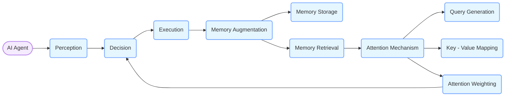

# 基于注意力机制的AI Agent记忆增强

> 关键词：注意力机制、AI Agent、记忆增强、深度学习、Transformer

> 摘要：本文围绕基于注意力机制的AI Agent记忆增强展开深入探讨。首先介绍了相关背景，包括研究目的、预期读者等。接着详细阐述了核心概念，如注意力机制、AI Agent和记忆增强的原理及其联系，并给出了相应的文本示意图和Mermaid流程图。然后对核心算法原理进行了讲解，使用Python代码详细说明了操作步骤。同时介绍了相关的数学模型和公式，并举例说明。通过项目实战，给出了开发环境搭建、源代码实现与解读。分析了实际应用场景，推荐了学习资源、开发工具框架和相关论文著作。最后总结了未来发展趋势与挑战，还提供了常见问题解答和扩展阅读参考资料，旨在为读者全面呈现基于注意力机制的AI Agent记忆增强的技术全貌。

## 1. 背景介绍 
### 1.1 目的和范围
随着人工智能技术的不断发展，AI Agent在各种复杂环境中执行任务的需求日益增长。然而，传统的AI Agent在处理长序列信息、上下文理解和记忆方面存在一定的局限性。基于注意力机制的AI Agent记忆增强技术旨在解决这些问题，通过引入注意力机制，让AI Agent能够更加有效地关注重要信息，增强其记忆能力，从而提高在复杂任务中的表现。

本文的范围涵盖了基于注意力机制的AI Agent记忆增强的核心概念、算法原理、数学模型、项目实战、应用场景以及相关的工具和资源推荐等方面，旨在为读者提供一个全面深入的技术指南。

### 1.2 预期读者
本文预期读者包括人工智能领域的研究人员、开发者、学生以及对AI Agent和注意力机制感兴趣的技术爱好者。无论是希望深入了解相关理论知识，还是想要将其应用到实际项目中的读者，都能从本文中获得有价值的信息。

### 1.3 文档结构概述
本文将按照以下结构进行组织：首先介绍背景信息，包括目的、预期读者和文档结构概述；接着阐述核心概念，如注意力机制、AI Agent和记忆增强的原理及其联系；然后讲解核心算法原理，并使用Python代码详细说明具体操作步骤；之后介绍相关的数学模型和公式，并举例说明；通过项目实战，展示开发环境搭建、源代码实现与解读；分析实际应用场景；推荐学习资源、开发工具框架和相关论文著作；最后总结未来发展趋势与挑战，提供常见问题解答和扩展阅读参考资料。

### 1.4 术语表
#### 1.4.1 核心术语定义
- **注意力机制（Attention Mechanism）**：一种模拟人类注意力的机制，通过计算输入序列中不同元素的重要性权重，让模型能够有选择地关注关键信息。
- **AI Agent**：能够感知环境、做出决策并执行行动的智能实体，可在各种领域中执行任务。
- **记忆增强（Memory Augmentation）**：通过引入额外的记忆模块或机制，增强AI Agent对历史信息的存储和利用能力。
- **Transformer**：一种基于注意力机制的深度学习模型架构，广泛应用于自然语言处理等领域。

#### 1.4.2 相关概念解释
- **多头注意力（Multi - Head Attention）**：将注意力机制扩展为多个独立的注意力头，每个头关注输入序列的不同方面，从而捕捉更丰富的信息。
- **键（Key）、值（Value）和查询（Query）**：在注意力机制中，输入序列被映射为键、值和查询三个向量，通过计算查询与键之间的相似度来确定值的权重。

#### 1.4.3 缩略词列表
- **NLP**：自然语言处理（Natural Language Processing）
- **RNN**：循环神经网络（Recurrent Neural Network）
- **LSTM**：长短期记忆网络（Long Short - Term Memory）

## 2. 核心概念与联系 
### 2.1 注意力机制原理
注意力机制的核心思想是根据输入序列中不同元素与当前任务的相关性，为每个元素分配一个权重，从而让模型能够有选择地关注重要信息。具体来说，给定一个查询向量 $Q$ 和一组键值对 $(K, V)$，注意力机制通过计算查询与键之间的相似度，得到每个键值对的权重，然后根据这些权重对值进行加权求和，得到注意力输出。

常见的注意力计算方式是缩放点积注意力（Scaled Dot - Product Attention），其公式为：

$$Attention(Q, K, V) = softmax(\frac{QK^T}{\sqrt{d_k}})V$$

其中，$Q$ 是查询矩阵，$K$ 是键矩阵，$V$ 是值矩阵，$d_k$ 是键向量的维度。$\frac{QK^T}{\sqrt{d_k}}$ 计算了查询与键之间的相似度，通过除以 $\sqrt{d_k}$ 进行缩放，以避免点积结果过大导致梯度消失或爆炸。最后使用 softmax 函数将相似度转换为概率分布，作为每个值的权重。

### 2.2 AI Agent概念
AI Agent是一个能够感知环境、做出决策并执行行动的智能实体。它可以是一个虚拟的软件程序，也可以是一个物理机器人。AI Agent通常由感知模块、决策模块和执行模块组成。感知模块用于收集环境信息，决策模块根据感知到的信息和自身的目标做出决策，执行模块则将决策转化为实际行动。

在复杂环境中，AI Agent需要处理大量的信息，并且需要根据历史信息进行决策。因此，如何有效地存储和利用历史信息成为提高AI Agent性能的关键。

### 2.3 记忆增强原理
记忆增强旨在解决AI Agent在处理长序列信息和上下文理解方面的局限性。通过引入额外的记忆模块，AI Agent可以将历史信息存储在记忆中，并在需要时进行检索和利用。记忆模块可以是一个外部存储设备，也可以是一个内部的神经网络层。

常见的记忆增强方法包括使用记忆网络（Memory Networks）、神经图灵机（Neural Turing Machines）等。这些方法通过引入可微分的记忆读写操作，让模型能够动态地存储和检索信息。

### 2.4 核心概念联系
注意力机制和记忆增强在AI Agent中是相互关联的。注意力机制可以帮助AI Agent在记忆中选择重要的信息，提高信息检索的效率。而记忆增强则为注意力机制提供了更多的历史信息，让模型能够更好地理解上下文。

例如，在一个自然语言处理任务中，AI Agent需要根据当前的输入句子和之前的对话历史做出回应。注意力机制可以帮助AI Agent在对话历史中选择与当前输入相关的信息，而记忆增强则可以存储对话历史，为注意力机制提供更多的候选信息。

### 2.5 文本示意图
```plaintext
              +------------------+
              |    AI Agent      |
              +------------------+
              |  Perception      |
              |  Module          |
              +------------------+
              |  Decision        |
              |  Module          |
              +------------------+
              |  Execution       |
              |  Module          |
              +------------------+
                      |
                      v
              +------------------+
              | Memory Augmentation |
              +------------------+
              | Memory Storage     |
              +------------------+
              | Memory Retrieval   |
              +------------------+
                      |
                      v
              +------------------+
              | Attention Mechanism |
              +------------------+
              | Query Generation    |
              +------------------+
              | Key - Value Mapping |
              +------------------+
              | Attention Weighting |
              +------------------+
```

### 2.6 Mermaid流程图


## 3. 核心算法原理 & 具体操作步骤 
### 3.1 缩放点积注意力算法原理
缩放点积注意力是注意力机制中最常用的计算方式。其基本思想是通过计算查询与键之间的点积相似度，然后进行缩放和归一化，得到每个值的权重，最后根据这些权重对值进行加权求和。

以下是缩放点积注意力的Python代码实现：

```python
import torch
import torch.nn.functional as F

def scaled_dot_product_attention(Q, K, V, mask=None):
    d_k = Q.size(-1)
    scores = torch.matmul(Q, K.transpose(-2, -1)) / torch.sqrt(torch.tensor(d_k, dtype=torch.float32))
    
    if mask is not None:
        scores = scores.masked_fill(mask == 0, -1e9)
    
    attention_weights = F.softmax(scores, dim=-1)
    output = torch.matmul(attention_weights, V)
    return output, attention_weights
```

### 3.2 多头注意力算法原理
多头注意力将注意力机制扩展为多个独立的注意力头，每个头关注输入序列的不同方面，从而捕捉更丰富的信息。多头注意力的输出是所有注意力头输出的拼接，然后通过一个线性变换得到最终的输出。

以下是多头注意力的Python代码实现：

```python
import torch
import torch.nn as nn

class MultiHeadAttention(nn.Module):
    def __init__(self, d_model, num_heads):
        super(MultiHeadAttention, self).__init__()
        assert d_model % num_heads == 0, "d_model must be divisible by num_heads"
        
        self.d_model = d_model
        self.num_heads = num_heads
        self.d_k = d_model // num_heads
        
        self.W_q = nn.Linear(d_model, d_model)
        self.W_k = nn.Linear(d_model, d_model)
        self.W_v = nn.Linear(d_model, d_model)
        self.W_o = nn.Linear(d_model, d_model)
    
    def split_heads(self, x):
        batch_size, seq_length, d_model = x.size()
        return x.view(batch_size, seq_length, self.num_heads, self.d_k).transpose(1, 2)
    
    def combine_heads(self, x):
        batch_size, num_heads, seq_length, d_k = x.size()
        return x.transpose(1, 2).contiguous().view(batch_size, seq_length, self.d_model)
    
    def forward(self, Q, K, V, mask=None):
        Q = self.split_heads(self.W_q(Q))
        K = self.split_heads(self.W_k(K))
        V = self.split_heads(self.W_v(V))
        
        if mask is not None:
            mask = mask.unsqueeze(1)
        
        output, attention_weights = scaled_dot_product_attention(Q, K, V, mask)
        output = self.combine_heads(output)
        output = self.W_o(output)
        return output, attention_weights
```

### 3.3 具体操作步骤
1. **输入处理**：将输入序列通过线性变换得到查询、键和值矩阵。
2. **多头注意力计算**：将查询、键和值矩阵分别拆分为多个头，然后对每个头进行缩放点积注意力计算。
3. **拼接和线性变换**：将所有头的输出拼接起来，然后通过一个线性变换得到最终的输出。

## 4. 数学模型和公式 & 详细讲解 & 举例说明 
### 4.1 缩放点积注意力公式
缩放点积注意力的公式为：

$$Attention(Q, K, V) = softmax(\frac{QK^T}{\sqrt{d_k}})V$$

其中，$Q$ 是查询矩阵，$K$ 是键矩阵，$V$ 是值矩阵，$d_k$ 是键向量的维度。

详细讲解：
- $QK^T$ 计算了查询与键之间的点积相似度，得到一个相似度矩阵。
- $\frac{QK^T}{\sqrt{d_k}}$ 对相似度矩阵进行缩放，以避免点积结果过大导致梯度消失或爆炸。
- $softmax$ 函数将相似度矩阵转换为概率分布，作为每个值的权重。
- 最后将权重与值矩阵相乘，得到注意力输出。

举例说明：
假设我们有一个查询向量 $Q = [1, 2, 3]$，键矩阵 $K = \begin{bmatrix}1 & 0 & 0\\0 & 1 & 0\\0 & 0 & 1\end{bmatrix}$，值矩阵 $V = \begin{bmatrix}4 & 5 & 6\\7 & 8 & 9\\10 & 11 & 12\end{bmatrix}$，$d_k = 3$。

首先计算 $QK^T$：

$$QK^T = [1, 2, 3]\begin{bmatrix}1 & 0 & 0\\0 & 1 & 0\\0 & 0 & 1\end{bmatrix} = [1, 2, 3]$$

然后进行缩放：

$$\frac{QK^T}{\sqrt{d_k}} = \frac{[1, 2, 3]}{\sqrt{3}} = [\frac{1}{\sqrt{3}}, \frac{2}{\sqrt{3}}, \frac{3}{\sqrt{3}}]$$

接着计算 softmax：

$$softmax(\frac{QK^T}{\sqrt{d_k}}) = [softmax(\frac{1}{\sqrt{3}}), softmax(\frac{2}{\sqrt{3}}), softmax(\frac{3}{\sqrt{3}})]$$

最后计算注意力输出：

$$Attention(Q, K, V) = softmax(\frac{QK^T}{\sqrt{d_k}})V$$

### 4.2 多头注意力公式
多头注意力的公式为：

$$MultiHead(Q, K, V) = Concat(head_1, head_2, \cdots, head_h)W^O$$

其中，$head_i = Attention(QW_i^Q, KW_i^K, VW_i^V)$，$W_i^Q$、$W_i^K$ 和 $W_i^V$ 是第 $i$ 个头的投影矩阵，$W^O$ 是输出投影矩阵。

详细讲解：
- 首先将查询、键和值矩阵分别通过投影矩阵 $W_i^Q$、$W_i^K$ 和 $W_i^V$ 投影到 $h$ 个低维子空间中。
- 对每个子空间中的查询、键和值进行缩放点积注意力计算，得到 $h$ 个头的输出。
- 将所有头的输出拼接起来，然后通过输出投影矩阵 $W^O$ 进行线性变换，得到最终的输出。

举例说明：
假设 $h = 2$，$d_model = 6$，$d_k = d_v = 3$。查询矩阵 $Q$、键矩阵 $K$ 和值矩阵 $V$ 的维度都是 $[batch_size, seq_length, 6]$。

首先将 $Q$、$K$ 和 $V$ 分别通过投影矩阵 $W_1^Q$、$W_1^K$、$W_1^V$ 和 $W_2^Q$、$W_2^K$、$W_2^V$ 投影到两个低维子空间中，得到 $Q_1$、$K_1$、$V_1$ 和 $Q_2$、$K_2$、$V_2$，它们的维度都是 $[batch_size, seq_length, 3]$。

然后对每个子空间进行缩放点积注意力计算，得到 $head_1$ 和 $head_2$，它们的维度都是 $[batch_size, seq_length, 3]$。

最后将 $head_1$ 和 $head_2$ 拼接起来，得到一个维度为 $[batch_size, seq_length, 6]$ 的矩阵，再通过输出投影矩阵 $W^O$ 进行线性变换，得到最终的输出。

## 5. 项目实战：代码实际案例和详细解释说明 
### 5.1  开发环境搭建
#### 5.1.1 安装Python
首先需要安装Python，建议使用Python 3.7及以上版本。可以从Python官方网站（https://www.python.org/downloads/）下载安装包进行安装。

#### 5.1.2 安装深度学习框架
本文使用PyTorch作为深度学习框架，可以使用以下命令进行安装：

```bash
pip install torch torchvision
```

#### 5.1.3 安装其他依赖库
还需要安装一些其他的依赖库，如NumPy、Matplotlib等，可以使用以下命令进行安装：

```bash
pip install numpy matplotlib
```

### 5.2  源代码详细实现和代码解读
以下是一个基于注意力机制的AI Agent记忆增强的简单示例代码：

```python
import torch
import torch.nn as nn
import torch.optim as optim

# 定义多头注意力模块
class MultiHeadAttention(nn.Module):
    def __init__(self, d_model, num_heads):
        super(MultiHeadAttention, self).__init__()
        assert d_model % num_heads == 0, "d_model must be divisible by num_heads"
        
        self.d_model = d_model
        self.num_heads = num_heads
        self.d_k = d_model // num_heads
        
        self.W_q = nn.Linear(d_model, d_model)
        self.W_k = nn.Linear(d_model, d_model)
        self.W_v = nn.Linear(d_model, d_model)
        self.W_o = nn.Linear(d_model, d_model)
    
    def split_heads(self, x):
        batch_size, seq_length, d_model = x.size()
        return x.view(batch_size, seq_length, self.num_heads, self.d_k).transpose(1, 2)
    
    def combine_heads(self, x):
        batch_size, num_heads, seq_length, d_k = x.size()
        return x.transpose(1, 2).contiguous().view(batch_size, seq_length, self.d_model)
    
    def forward(self, Q, K, V, mask=None):
        Q = self.split_heads(self.W_q(Q))
        K = self.split_heads(self.W_k(K))
        V = self.split_heads(self.W_v(V))
        
        if mask is not None:
            mask = mask.unsqueeze(1)
        
        scores = torch.matmul(Q, K.transpose(-2, -1)) / torch.sqrt(torch.tensor(self.d_k, dtype=torch.float32))
        if mask is not None:
            scores = scores.masked_fill(mask == 0, -1e9)
        attention_weights = torch.softmax(scores, dim=-1)
        output = torch.matmul(attention_weights, V)
        output = self.combine_heads(output)
        output = self.W_o(output)
        return output, attention_weights

# 定义AI Agent模型
class AIAgent(nn.Module):
    def __init__(self, d_model, num_heads):
        super(AIAgent, self).__init__()
        self.attention = MultiHeadAttention(d_model, num_heads)
        self.fc = nn.Linear(d_model, 1)
    
    def forward(self, x, memory):
        output, _ = self.attention(x, memory, memory)
        output = self.fc(output)
        return output

# 初始化模型、损失函数和优化器
d_model = 64
num_heads = 4
model = AIAgent(d_model, num_heads)
criterion = nn.MSELoss()
optimizer = optim.Adam(model.parameters(), lr=0.001)

# 生成示例数据
batch_size = 16
seq_length = 10
x = torch.randn(batch_size, seq_length, d_model)
memory = torch.randn(batch_size, seq_length, d_model)
target = torch.randn(batch_size, seq_length, 1)

# 训练模型
num_epochs = 100
for epoch in range(num_epochs):
    optimizer.zero_grad()
    output = model(x, memory)
    loss = criterion(output, target)
    loss.backward()
    optimizer.step()
    
    if (epoch + 1) % 10 == 0:
        print(f'Epoch [{epoch+1}/{num_epochs}], Loss: {loss.item():.4f}')
```

### 5.3  代码解读与分析
#### 5.3.1 多头注意力模块
`MultiHeadAttention` 类实现了多头注意力机制。在 `__init__` 方法中，初始化了投影矩阵和相关参数。`split_heads` 方法将输入矩阵拆分为多个头，`combine_heads` 方法将多个头的输出拼接起来。`forward` 方法实现了多头注意力的前向传播过程，包括查询、键和值的投影、缩放点积注意力计算和输出投影。

#### 5.3.2 AI Agent模型
`AIAgent` 类定义了一个简单的AI Agent模型。在 `__init__` 方法中，初始化了多头注意力模块和一个全连接层。`forward` 方法将输入和记忆作为多头注意力的输入，得到注意力输出，然后通过全连接层得到最终的输出。

#### 5.3.3 训练过程
在训练过程中，首先初始化模型、损失函数和优化器。然后生成示例数据，包括输入、记忆和目标值。在每个epoch中，进行前向传播计算输出，计算损失，进行反向传播更新模型参数。每10个epoch打印一次损失值。

## 6. 实际应用场景 
### 6.1 自然语言处理
在自然语言处理中，基于注意力机制的AI Agent记忆增强可以用于机器翻译、文本生成、问答系统等任务。例如，在机器翻译中，AI Agent可以通过注意力机制关注源语言句子中的重要信息，并结合历史翻译信息进行更准确的翻译。在文本生成任务中，AI Agent可以利用记忆模块存储之前生成的文本，从而生成更连贯、有逻辑的文本。

### 6.2 计算机视觉
在计算机视觉中，注意力机制和记忆增强可以用于图像分类、目标检测、图像生成等任务。例如，在目标检测中，AI Agent可以通过注意力机制关注图像中的重要区域，并结合历史检测信息进行更准确的目标定位。在图像生成任务中，AI Agent可以利用记忆模块存储之前生成的图像特征，从而生成更逼真的图像。

### 6.3 强化学习
在强化学习中，AI Agent需要在动态环境中进行决策。基于注意力机制的记忆增强可以帮助AI Agent更好地理解环境的历史信息，从而做出更明智的决策。例如，在游戏AI中，AI Agent可以通过注意力机制关注游戏中的重要元素，并结合历史游戏状态进行策略调整。

## 7. 工具和资源推荐
### 7.1 学习资源推荐
#### 7.1.1 书籍推荐
- 《深度学习》（Deep Learning）：由Ian Goodfellow、Yoshua Bengio和Aaron Courville所著，是深度学习领域的经典教材，涵盖了神经网络、优化算法、卷积神经网络等方面的知识。
- 《Attention Is All You Need》论文解读相关书籍：可以帮助读者深入理解注意力机制和Transformer模型。

#### 7.1.2 在线课程
- Coursera上的“深度学习专项课程”（Deep Learning Specialization）：由Andrew Ng教授授课，包括神经网络、卷积神经网络、循环神经网络等多个方面的内容。
- edX上的“人工智能基础”（Introduction to Artificial Intelligence）：介绍了人工智能的基本概念、算法和应用。

#### 7.1.3 技术博客和网站
- Medium：上面有很多关于人工智能和深度学习的技术博客文章，涵盖了最新的研究成果和实践经验。
- arXiv：是一个预印本服务器，提供了大量的学术论文，包括人工智能领域的最新研究。

### 7.2 开发工具框架推荐
#### 7.2.1 IDE和编辑器
- PyCharm：是一款专门为Python开发设计的集成开发环境，提供了代码编辑、调试、版本控制等功能。
- Jupyter Notebook：是一个交互式的开发环境，适合进行数据分析、模型训练和可视化等任务。

#### 7.2.2 调试和性能分析工具
- TensorBoard：是TensorFlow提供的可视化工具，可以用于可视化模型的训练过程、损失曲线、参数分布等。
- PyTorch Profiler：是PyTorch提供的性能分析工具，可以帮助开发者分析模型的性能瓶颈。

#### 7.2.3 相关框架和库
- PyTorch：是一个开源的深度学习框架，提供了丰富的神经网络层、优化算法和数据处理工具。
- Hugging Face Transformers：是一个用于自然语言处理的开源库，提供了预训练的Transformer模型和相关工具。

### 7.3 相关论文著作推荐
#### 7.3.1 经典论文
- 《Attention Is All You Need》：提出了Transformer模型，是注意力机制在深度学习领域的经典论文。
- 《Memory Networks》：介绍了记忆网络的概念和方法，为AI Agent的记忆增强提供了重要的理论基础。

#### 7.3.2 最新研究成果
可以关注arXiv上的最新论文，了解基于注意力机制的AI Agent记忆增强领域的最新研究进展。

#### 7.3.3 应用案例分析
可以参考一些学术会议和期刊上的应用案例分析，了解基于注意力机制的AI Agent记忆增强在实际项目中的应用效果和经验教训。

## 8. 总结：未来发展趋势与挑战
### 8.1 未来发展趋势
- **多模态融合**：将注意力机制和记忆增强应用于多模态数据，如文本、图像、音频等，实现更强大的AI Agent。
- **可解释性研究**：提高基于注意力机制的AI Agent的可解释性，让人们更好地理解模型的决策过程。
- **强化学习与注意力机制的深度融合**：在强化学习中更深入地应用注意力机制和记忆增强，提高AI Agent在动态环境中的决策能力。

### 8.2 挑战
- **计算资源需求**：基于注意力机制的模型通常需要大量的计算资源，如何在有限的资源下提高模型的效率是一个挑战。
- **数据隐私和安全**：AI Agent在处理大量数据时，需要保护数据的隐私和安全，避免数据泄露和滥用。
- **模型泛化能力**：如何提高基于注意力机制的AI Agent的泛化能力，使其在不同的环境和任务中都能表现良好，是一个亟待解决的问题。

## 9. 附录：常见问题与解答
### 9.1 注意力机制和记忆增强有什么区别？
注意力机制主要用于选择输入序列中的重要信息，而记忆增强则侧重于存储和利用历史信息。注意力机制可以帮助AI Agent在当前输入中找到关键信息，而记忆增强可以让AI Agent利用过去的经验来做出更好的决策。

### 9.2 如何选择合适的注意力机制和记忆增强方法？
选择合适的注意力机制和记忆增强方法需要考虑任务的特点、数据的规模和复杂度等因素。例如，在处理长序列数据时，可以选择Transformer模型中的多头注意力机制；在需要存储大量历史信息时，可以考虑使用记忆网络或神经图灵机。

### 9.3 基于注意力机制的AI Agent模型训练时间长怎么办？
可以尝试以下方法来缩短训练时间：
- 减少模型的参数数量，例如减少注意力头的数量或降低模型的维度。
- 使用更高效的优化算法，如AdamW。
- 并行计算，使用多个GPU或分布式训练。

## 10. 扩展阅读 & 参考资料
### 10.1 扩展阅读
- 《Neural Machine Translation by Jointly Learning to Align and Translate》
- 《Show, Attend and Tell: Neural Image Caption Generation with Visual Attention》

### 10.2 参考资料
- Vaswani, A., Shazeer, N., Parmar, N., Uszkoreit, J., Jones, L., Gomez, A. N.,... & Polosukhin, I. (2017). Attention is all you need. Advances in neural information processing systems.
- Weston, J., Chopra, S., & Bordes, A. (2014). Memory networks. arXiv preprint arXiv:1410.3916.

作者：AI天才研究院/AI Genius Institute & 禅与计算机程序设计艺术 /Zen And The Art of Computer Programming