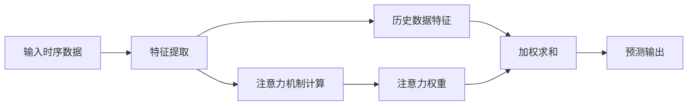

# 基于注意力机制的AI时序数据分析系统

> 关键词：注意力机制、AI时序数据分析、深度学习、时间序列预测、系统架构

> 摘要：本文围绕基于注意力机制的AI时序数据分析系统展开深入探讨。首先介绍了该系统研究的背景、目的和适用范围，明确预期读者和文档结构。详细阐述了核心概念，包括注意力机制和时序数据的原理与联系，并给出了相应的文本示意图和Mermaid流程图。深入讲解了核心算法原理，用Python代码进行详细展示，同时给出了相关数学模型和公式，并举例说明。通过项目实战，介绍了开发环境搭建、源代码实现与解读。探讨了该系统在多个领域的实际应用场景，推荐了学习资源、开发工具框架以及相关论文著作。最后总结了未来发展趋势与挑战，还设置了常见问题解答和扩展阅读参考资料，旨在为读者全面呈现基于注意力机制的AI时序数据分析系统的全貌。

## 1. 背景介绍 
### 1.1 目的和范围
在当今数字化时代，时序数据无处不在，如金融市场的交易数据、气象观测的时间序列、工业设备的运行状态数据等。对这些时序数据进行有效分析，能够挖掘出潜在的规律和趋势，为决策提供有力支持。传统的时序数据分析方法在处理复杂的时序模式和长序列依赖时存在一定的局限性。而基于注意力机制的AI时序数据分析系统旨在利用注意力机制的优势，自动地聚焦于时序数据中的关键部分，提高时序数据预测和分析的准确性和效率。

本系统的范围涵盖了从数据预处理、特征提取到模型构建、预测分析等整个时序数据分析流程。不仅适用于单一时间序列的分析，也可扩展到多元时间序列的研究。同时，系统的设计具有一定的通用性，可应用于不同领域的时序数据分析任务。

### 1.2 预期读者
本文预期读者主要包括从事数据分析、机器学习、深度学习等领域的研究人员和工程师，他们希望深入了解基于注意力机制的时序数据分析方法，并将其应用到实际项目中。此外，对人工智能技术在时序数据处理方面感兴趣的学生和爱好者也可以从本文中获取有价值的信息。

### 1.3 文档结构概述
本文将按照以下结构进行组织：首先介绍核心概念，包括注意力机制和时序数据的基本原理及其联系；接着详细讲解核心算法原理和具体操作步骤，并用Python代码进行实现；然后给出相关的数学模型和公式，并举例说明；通过项目实战，展示系统的开发环境搭建、源代码实现和代码解读；探讨系统的实际应用场景；推荐学习资源、开发工具框架和相关论文著作；最后总结未来发展趋势与挑战，提供常见问题解答和扩展阅读参考资料。

### 1.4 术语表
#### 1.4.1 核心术语定义
- **注意力机制（Attention Mechanism）**：一种模仿人类注意力的机制，在处理数据时，能够自动地聚焦于数据中的重要部分，为不同部分分配不同的权重。
- **时序数据（Time Series Data）**：按时间顺序排列的一系列数据点，通常用于描述某个变量随时间的变化情况。
- **深度学习（Deep Learning）**：一类基于人工神经网络的机器学习方法，通过构建多层神经网络来学习数据的复杂模式。
- **时间序列预测（Time Series Forecasting）**：根据历史时序数据，预测未来时间点上的数据值。

#### 1.4.2 相关概念解释
- **长短期记忆网络（LSTM）**：一种特殊的循环神经网络（RNN），能够有效处理长序列依赖问题，通过门控机制控制信息的流动。
- **门控循环单元（GRU）**：也是一种改进的循环神经网络，与LSTM类似，但结构更简单，计算效率更高。
- **自注意力机制（Self-Attention）**：注意力机制的一种特殊形式，用于计算序列中元素之间的相互关联，能够捕捉序列的全局信息。

#### 1.4.3 缩略词列表
- **RNN（Recurrent Neural Network）**：循环神经网络
- **LSTM（Long Short-Term Memory）**：长短期记忆网络
- **GRU（Gated Recurrent Unit）**：门控循环单元
- **MLP（Multi-Layer Perceptron）**：多层感知机

## 2. 核心概念与联系 
### 2.1 注意力机制原理
注意力机制的核心思想是在处理数据时，根据数据的重要性为不同部分分配不同的权重。在时序数据分析中，注意力机制可以帮助模型自动地聚焦于历史数据中的关键时间步，从而更好地捕捉数据的动态变化。

假设有一个输入序列 $\mathbf{X} = [\mathbf{x}_1, \mathbf{x}_2, \cdots, \mathbf{x}_T]$，其中 $\mathbf{x}_t$ 是第 $t$ 个时间步的输入向量。注意力机制的计算过程如下：

1. **计算注意力分数**：首先，通过一个打分函数 $s(\cdot)$ 计算每个时间步的输入向量与查询向量 $\mathbf{q}$ 之间的相似度，得到注意力分数 $e_t$：
   $$e_t = s(\mathbf{q}, \mathbf{x}_t)$$
常见的打分函数有点积打分函数、缩放点积打分函数等。以点积打分函数为例：
   $$e_t = \mathbf{q}^T \mathbf{x}_t$$

2. **计算注意力权重**：将注意力分数 $e_t$ 通过 softmax 函数进行归一化，得到注意力权重 $\alpha_t$：
   $$\alpha_t = \frac{\exp(e_t)}{\sum_{i=1}^{T} \exp(e_i)}$$

3. **计算加权和**：将输入序列中的每个向量 $\mathbf{x}_t$ 乘以对应的注意力权重 $\alpha_t$，然后求和得到注意力输出 $\mathbf{c}$：
   $$\mathbf{c} = \sum_{t=1}^{T} \alpha_t \mathbf{x}_t$$

### 2.2 时序数据特点
时序数据具有以下特点：
- **时间相关性**：数据点之间存在时间上的先后顺序，后面的数据点往往受到前面数据点的影响。
- **趋势性**：数据可能呈现出上升、下降或平稳的趋势。
- **季节性**：数据可能存在周期性的变化，如每天、每周、每年的周期性波动。
- **噪声**：数据中可能包含随机噪声，影响数据的分析和预测。

### 2.3 核心概念联系
在基于注意力机制的AI时序数据分析系统中，注意力机制与时序数据紧密结合。通过注意力机制，模型可以自动地关注时序数据中的重要时间步，从而更好地捕捉数据的时间相关性和趋势性。例如，在时间序列预测任务中，模型可以根据历史数据的重要性分配不同的注意力权重，从而提高预测的准确性。

### 2.4 文本示意图
```plaintext
输入时序数据 -> 特征提取 -> 注意力机制计算
                     |           |
                     v           v
             历史数据特征    注意力权重
                     |           |
                     v           v
                 加权求和 -> 预测输出
```

### 2.5 Mermaid流程图


## 3. 核心算法原理 & 具体操作步骤 
### 3.1 基于注意力机制的时序预测模型架构
本文采用的基于注意力机制的时序预测模型主要由以下几个部分组成：
- **输入层**：接收时序数据作为输入。
- **特征提取层**：使用循环神经网络（如LSTM或GRU）提取时序数据的特征。
- **注意力层**：计算注意力权重，对特征进行加权求和。
- **输出层**：通过全连接层输出预测结果。

### 3.2 核心算法原理
以下是基于注意力机制的时序预测模型的详细算法原理：

1. **数据输入**：假设输入的时序数据为 $\mathbf{X} = [\mathbf{x}_1, \mathbf{x}_2, \cdots, \mathbf{x}_T]$，其中 $\mathbf{x}_t \in \mathbb{R}^d$ 是第 $t$ 个时间步的输入向量，$d$ 是输入向量的维度。

2. **特征提取**：使用LSTM或GRU对输入数据进行特征提取，得到隐藏状态序列 $\mathbf{H} = [\mathbf{h}_1, \mathbf{h}_2, \cdots, \mathbf{h}_T]$，其中 $\mathbf{h}_t \in \mathbb{R}^h$ 是第 $t$ 个时间步的隐藏状态向量，$h$ 是隐藏状态的维度。

以下是使用Python和PyTorch实现的LSTM特征提取代码：
```python
import torch
import torch.nn as nn

class LSTMFeatureExtractor(nn.Module):
    def __init__(self, input_size, hidden_size, num_layers):
        super(LSTMFeatureExtractor, self).__init__()
        self.lstm = nn.LSTM(input_size, hidden_size, num_layers, batch_first=True)

    def forward(self, x):
        output, _ = self.lstm(x)
        return output

# 示例
input_size = 10
hidden_size = 20
num_layers = 2
lstm_extractor = LSTMFeatureExtractor(input_size, hidden_size, num_layers)
x = torch.randn(32, 5, input_size)  # 批量大小为32，序列长度为5
h = lstm_extractor(x)
print(h.shape)  # 输出形状应为 (32, 5, 20)
```

3. **注意力计算**：计算注意力权重，对隐藏状态序列进行加权求和。

以下是使用Python和PyTorch实现的注意力层代码：
```python
class AttentionLayer(nn.Module):
    def __init__(self, hidden_size):
        super(AttentionLayer, self).__init__()
        self.W = nn.Linear(hidden_size, hidden_size)
        self.v = nn.Parameter(torch.randn(hidden_size))
        stdv = 1. / torch.sqrt(self.v.size(0))
        self.v.data.uniform_(-stdv, stdv)

    def forward(self, hidden_states):
        # 计算注意力分数
        e = torch.tanh(self.W(hidden_states))
        e = torch.matmul(e, self.v)
        # 计算注意力权重
        alpha = torch.softmax(e, dim=1).unsqueeze(-1)
        # 加权求和
        context = torch.sum(alpha * hidden_states, dim=1)
        return context

# 示例
attention_layer = AttentionLayer(hidden_size)
context = attention_layer(h)
print(context.shape)  # 输出形状应为 (32, 20)
```

4. **预测输出**：将注意力输出通过全连接层输出预测结果。

以下是使用Python和PyTorch实现的输出层代码：
```python
class OutputLayer(nn.Module):
    def __init__(self, hidden_size, output_size):
        super(OutputLayer, self).__init__()
        self.fc = nn.Linear(hidden_size, output_size)

    def forward(self, context):
        output = self.fc(context)
        return output

# 示例
output_size = 1
output_layer = OutputLayer(hidden_size, output_size)
y_pred = output_layer(context)
print(y_pred.shape)  # 输出形状应为 (32, 1)
```

### 3.3 具体操作步骤
1. **数据预处理**：对输入的时序数据进行归一化、缺失值处理等操作。
2. **模型构建**：按照上述架构构建基于注意力机制的时序预测模型。
3. **模型训练**：使用训练数据对模型进行训练，选择合适的损失函数（如均方误差损失函数）和优化器（如Adam优化器）。
4. **模型评估**：使用测试数据对训练好的模型进行评估，计算评估指标（如均方误差、平均绝对误差等）。
5. **预测应用**：使用训练好的模型对未来的时序数据进行预测。

## 4. 数学模型和公式 & 详细讲解 & 举例说明 
### 4.1 LSTM数学模型
LSTM的核心是三个门控单元：输入门 $i_t$、遗忘门 $f_t$ 和输出门 $o_t$，以及细胞状态 $C_t$。其数学公式如下：

- **输入门**：
  $$i_t = \sigma(W_{ii} x_t + W_{hi} h_{t-1} + b_i)$$
- **遗忘门**：
  $$f_t = \sigma(W_{if} x_t + W_{hf} h_{t-1} + b_f)$$
- **细胞状态更新**：
  $$\tilde{C}_t = \tanh(W_{ic} x_t + W_{hc} h_{t-1} + b_c)$$
  $$C_t = f_t \odot C_{t-1} + i_t \odot \tilde{C}_t$$
- **输出门**：
  $$o_t = \sigma(W_{io} x_t + W_{ho} h_{t-1} + b_o)$$
  $$h_t = o_t \odot \tanh(C_t)$$

其中，$x_t$ 是第 $t$ 个时间步的输入向量，$h_{t-1}$ 是上一个时间步的隐藏状态向量，$W$ 是权重矩阵，$b$ 是偏置向量，$\sigma$ 是 sigmoid 函数，$\odot$ 是逐元素相乘。

### 4.2 注意力机制数学模型
注意力机制的数学模型在前面已经介绍过，这里再次总结一下：

- **注意力分数计算**：
  $$e_t = \mathbf{q}^T \mathbf{h}_t$$
- **注意力权重计算**：
  $$\alpha_t = \frac{\exp(e_t)}{\sum_{i=1}^{T} \exp(e_i)}$$
- **加权求和**：
  $$\mathbf{c} = \sum_{t=1}^{T} \alpha_t \mathbf{h}_t$$

### 4.3 举例说明
假设我们有一个简单的时序数据集，包含5个时间步的输入向量，每个向量的维度为2：
$$\mathbf{X} = \begin{bmatrix}
[1, 2] \\
[3, 4] \\
[5, 6] \\
[7, 8] \\
[9, 10]
\end{bmatrix}$$

我们使用LSTM对其进行特征提取，假设隐藏状态的维度为3。经过LSTM处理后，得到隐藏状态序列 $\mathbf{H}$：
$$\mathbf{H} = \begin{bmatrix}
[0.1, 0.2, 0.3] \\
[0.4, 0.5, 0.6] \\
[0.7, 0.8, 0.9] \\
[1.0, 1.1, 1.2] \\
[1.3, 1.4, 1.5]
\end{bmatrix}$$

假设查询向量 $\mathbf{q} = [0.1, 0.2, 0.3]$，我们可以计算注意力分数 $e_t$：
$$e_1 = \mathbf{q}^T \mathbf{h}_1 = 0.1\times0.1 + 0.2\times0.2 + 0.3\times0.3 = 0.14$$
$$e_2 = \mathbf{q}^T \mathbf{h}_2 = 0.1\times0.4 + 0.2\times0.5 + 0.3\times0.6 = 0.32$$
$$e_3 = \mathbf{q}^T \mathbf{h}_3 = 0.1\times0.7 + 0.2\times0.8 + 0.3\times0.9 = 0.5$$
$$e_4 = \mathbf{q}^T \mathbf{h}_4 = 0.1\times1.0 + 0.2\times1.1 + 0.3\times1.2 = 0.68$$
$$e_5 = \mathbf{q}^T \mathbf{h}_5 = 0.1\times1.3 + 0.2\times1.4 + 0.3\times1.5 = 0.86$$

然后计算注意力权重 $\alpha_t$：
$$\alpha_1 = \frac{\exp(0.14)}{\exp(0.14) + \exp(0.32) + \exp(0.5) + \exp(0.68) + \exp(0.86)} \approx 0.1$$
$$\alpha_2 = \frac{\exp(0.32)}{\exp(0.14) + \exp(0.32) + \exp(0.5) + \exp(0.68) + \exp(0.86)} \approx 0.13$$
$$\alpha_3 = \frac{\exp(0.5)}{\exp(0.14) + \exp(0.32) + \exp(0.5) + \exp(0.68) + \exp(0.86)} \approx 0.17$$
$$\alpha_4 = \frac{\exp(0.68)}{\exp(0.14) + \exp(0.32) + \exp(0.5) + \exp(0.68) + \exp(0.86)} \approx 0.22$$
$$\alpha_5 = \frac{\exp(0.86)}{\exp(0.14) + \exp(0.32) + \exp(0.5) + \exp(0.68) + \exp(0.86)} \approx 0.38$$

最后计算注意力输出 $\mathbf{c}$：
$$\mathbf{c} = \alpha_1 \mathbf{h}_1 + \alpha_2 \mathbf{h}_2 + \alpha_3 \mathbf{h}_3 + \alpha_4 \mathbf{h}_4 + \alpha_5 \mathbf{h}_5$$
$$\approx 0.1\times[0.1, 0.2, 0.3] + 0.13\times[0.4, 0.5, 0.6] + 0.17\times[0.7, 0.8, 0.9] + 0.22\times[1.0, 1.1, 1.2] + 0.38\times[1.3, 1.4, 1.5]$$
$$\approx [0.93, 1.07, 1.21]$$

## 5. 项目实战：代码实际案例和详细解释说明 
### 5.1  开发环境搭建
本项目使用Python 3.8作为开发语言，主要依赖的库有：
- **PyTorch**：用于构建和训练深度学习模型。
- **NumPy**：用于数值计算。
- **Pandas**：用于数据处理和分析。
- **Matplotlib**：用于数据可视化。

可以使用以下命令安装这些库：
```bash
pip install torch numpy pandas matplotlib
```

### 5.2  源代码详细实现和代码解读
以下是一个完整的基于注意力机制的时序预测模型的实现代码：
```python
import torch
import torch.nn as nn
import numpy as np
import pandas as pd
import matplotlib.pyplot as plt

# 定义LSTM特征提取层
class LSTMFeatureExtractor(nn.Module):
    def __init__(self, input_size, hidden_size, num_layers):
        super(LSTMFeatureExtractor, self).__init__()
        self.lstm = nn.LSTM(input_size, hidden_size, num_layers, batch_first=True)

    def forward(self, x):
        output, _ = self.lstm(x)
        return output

# 定义注意力层
class AttentionLayer(nn.Module):
    def __init__(self, hidden_size):
        super(AttentionLayer, self).__init__()
        self.W = nn.Linear(hidden_size, hidden_size)
        self.v = nn.Parameter(torch.randn(hidden_size))
        stdv = 1. / torch.sqrt(self.v.size(0))
        self.v.data.uniform_(-stdv, stdv)

    def forward(self, hidden_states):
        # 计算注意力分数
        e = torch.tanh(self.W(hidden_states))
        e = torch.matmul(e, self.v)
        # 计算注意力权重
        alpha = torch.softmax(e, dim=1).unsqueeze(-1)
        # 加权求和
        context = torch.sum(alpha * hidden_states, dim=1)
        return context

# 定义输出层
class OutputLayer(nn.Module):
    def __init__(self, hidden_size, output_size):
        super(OutputLayer, self).__init__()
        self.fc = nn.Linear(hidden_size, output_size)

    def forward(self, context):
        output = self.fc(context)
        return output

# 定义基于注意力机制的时序预测模型
class AttentionBasedTimeSeriesModel(nn.Module):
    def __init__(self, input_size, hidden_size, num_layers, output_size):
        super(AttentionBasedTimeSeriesModel, self).__init__()
        self.feature_extractor = LSTMFeatureExtractor(input_size, hidden_size, num_layers)
        self.attention_layer = AttentionLayer(hidden_size)
        self.output_layer = OutputLayer(hidden_size, output_size)

    def forward(self, x):
        h = self.feature_extractor(x)
        context = self.attention_layer(h)
        y_pred = self.output_layer(context)
        return y_pred

# 数据预处理
def preprocess_data(data, seq_length):
    X = []
    y = []
    for i in range(len(data) - seq_length):
        X.append(data[i:i+seq_length])
        y.append(data[i+seq_length])
    X = np.array(X)
    y = np.array(y)
    return X, y

# 训练模型
def train_model(model, X_train, y_train, num_epochs, learning_rate):
    criterion = nn.MSELoss()
    optimizer = torch.optim.Adam(model.parameters(), lr=learning_rate)

    for epoch in range(num_epochs):
        inputs = torch.tensor(X_train, dtype=torch.float32)
        labels = torch.tensor(y_train, dtype=torch.float32)

        optimizer.zero_grad()
        outputs = model(inputs)
        loss = criterion(outputs, labels)
        loss.backward()
        optimizer.step()

        if (epoch+1) % 100 == 0:
            print(f'Epoch [{epoch+1}/{num_epochs}], Loss: {loss.item():.4f}')

# 主函数
if __name__ == '__main__':
    # 生成示例数据
    data = np.sin(np.arange(0, 100, 0.1))
    seq_length = 10
    X, y = preprocess_data(data, seq_length)

    # 划分训练集和测试集
    train_size = int(len(X) * 0.8)
    X_train, X_test = X[:train_size], X[train_size:]
    y_train, y_test = y[:train_size], y[train_size:]

    # 初始化模型
    input_size = 1
    hidden_size = 20
    num_layers = 2
    output_size = 1
    model = AttentionBasedTimeSeriesModel(input_size, hidden_size, num_layers, output_size)

    # 训练模型
    num_epochs = 1000
    learning_rate = 0.001
    train_model(model, X_train, y_train, num_epochs, learning_rate)

    # 预测
    model.eval()
    inputs = torch.tensor(X_test, dtype=torch.float32)
    y_pred = model(inputs).detach().numpy()

    # 可视化结果
    plt.plot(y_test, label='True Values')
    plt.plot(y_pred, label='Predicted Values')
    plt.legend()
    plt.show()
```

### 5.3  代码解读与分析
- **LSTMFeatureExtractor类**：用于提取时序数据的特征，使用LSTM网络。
- **AttentionLayer类**：计算注意力权重，对LSTM的输出进行加权求和。
- **OutputLayer类**：通过全连接层输出预测结果。
- **AttentionBasedTimeSeriesModel类**：将特征提取层、注意力层和输出层组合成一个完整的模型。
- **preprocess_data函数**：对原始数据进行预处理，将其转换为适合模型输入的格式。
- **train_model函数**：使用均方误差损失函数和Adam优化器对模型进行训练。
- **主函数**：生成示例数据，划分训练集和测试集，初始化模型，训练模型，进行预测，并可视化预测结果。

## 6. 实际应用场景 
### 6.1 金融领域
在金融领域，基于注意力机制的AI时序数据分析系统可以用于股票价格预测、汇率预测、风险评估等。通过分析历史金融数据，模型可以捕捉到市场的趋势和波动，为投资者提供决策支持。例如，在股票价格预测中，模型可以关注历史数据中的关键时间点和重要特征，提高预测的准确性。

### 6.2 气象领域
在气象领域，该系统可以用于气象数据的分析和预测，如气温预测、降水预测等。气象数据具有明显的时间相关性和季节性，注意力机制可以帮助模型更好地捕捉这些特征，从而提高气象预测的精度。例如，在气温预测中，模型可以关注历史气温数据中的季节性变化和异常天气事件，提高预测的可靠性。

### 6.3 工业领域
在工业领域，该系统可以用于工业设备的故障预测和健康管理。通过分析工业设备的运行状态数据，如温度、压力、振动等，模型可以提前预测设备的故障，为设备的维护和维修提供依据。例如，在电机故障预测中，模型可以关注电机运行数据中的异常波动和趋势变化，及时发现潜在的故障隐患。

### 6.4 医疗领域
在医疗领域，该系统可以用于疾病预测和健康监测。通过分析患者的医疗数据，如生命体征、疾病史等，模型可以预测患者的疾病发生风险和病情发展趋势，为医生的诊断和治疗提供参考。例如，在糖尿病预测中，模型可以关注患者的血糖数据、饮食习惯等，预测患者患糖尿病的概率。

## 7. 工具和资源推荐
### 7.1 学习资源推荐
#### 7.1.1 书籍推荐
- 《深度学习》（Deep Learning）：由Ian Goodfellow、Yoshua Bengio和Aaron Courville所著，是深度学习领域的经典教材，涵盖了深度学习的基本原理、算法和应用。
- 《Python深度学习》（Deep Learning with Python）：由Francois Chollet所著，介绍了如何使用Python和Keras库进行深度学习的开发，适合初学者入门。
- 《时间序列分析与预测》（Time Series Analysis and Forecasting）：介绍了时间序列分析的基本方法和技术，包括ARIMA模型、指数平滑法等。

#### 7.1.2 在线课程
- Coursera上的“深度学习专项课程”（Deep Learning Specialization）：由Andrew Ng教授授课，涵盖了深度学习的多个方面，包括神经网络、卷积神经网络、循环神经网络等。
- edX上的“时间序列预测与深度学习”（Time Series Forecasting with Deep Learning）：介绍了如何使用深度学习方法进行时间序列预测。
- 哔哩哔哩上的一些机器学习和深度学习相关的视频教程，如“李宏毅机器学习”等。

#### 7.1.3 技术博客和网站
- Medium：上面有很多关于机器学习和深度学习的技术文章和教程。
- arXiv：提供了大量的学术论文，包括最新的研究成果。
- Kaggle：一个数据科学竞赛平台，上面有很多关于时间序列分析和预测的数据集和解决方案。

### 7.2 开发工具框架推荐
#### 7.2.1 IDE和编辑器
- PyCharm：一款专业的Python集成开发环境，提供了丰富的代码编辑、调试和项目管理功能。
- Jupyter Notebook：一个交互式的开发环境，适合进行数据分析和模型实验。
- Visual Studio Code：一款轻量级的代码编辑器，支持多种编程语言，并且有丰富的扩展插件。

#### 7.2.2 调试和性能分析工具
- PyTorch Profiler：用于分析PyTorch模型的性能，找出性能瓶颈。
- TensorBoard：一个可视化工具，用于监控模型的训练过程和性能指标。
- cProfile：Python自带的性能分析工具，用于分析Python代码的运行时间和函数调用情况。

#### 7.2.3 相关框架和库
- PyTorch：一个开源的深度学习框架，提供了丰富的神经网络层和优化算法。
- TensorFlow：另一个流行的深度学习框架，具有强大的分布式训练和部署能力。
- Scikit-learn：一个机器学习库，提供了多种机器学习算法和工具，如数据预处理、模型选择和评估等。

### 7.3 相关论文著作推荐
#### 7.3.1 经典论文
- “Attention Is All You Need”：提出了Transformer模型，引入了自注意力机制，在自然语言处理领域取得了巨大成功。
- “Long Short-Term Memory”：介绍了LSTM网络的原理和应用，解决了传统RNN的梯度消失问题。
- “Gated Recurrent Unit”：提出了GRU网络，是一种简化的LSTM网络，计算效率更高。

#### 7.3.2 最新研究成果
- 关注顶级学术会议，如NeurIPS、ICML、CVPR等，上面有很多关于注意力机制和时序数据分析的最新研究成果。
- 在arXiv上搜索相关关键词，如“Attention Mechanism in Time Series Analysis”，可以找到最新的预印本论文。

#### 7.3.3 应用案例分析
- 可以在Kaggle上找到很多关于时间序列分析和预测的应用案例，学习他人的解决方案和经验。
- 一些公司和研究机构的官方博客也会分享他们在时序数据分析方面的应用案例，如Google、Facebook等。

## 8. 总结：未来发展趋势与挑战
### 8.1 未来发展趋势
- **多模态融合**：将时序数据与其他模态的数据（如图像、文本等）进行融合，提高分析和预测的准确性。例如，在医疗领域，可以将患者的生命体征数据与时序医学影像数据相结合，进行更准确的疾病诊断。
- **可解释性增强**：提高基于注意力机制的时序分析模型的可解释性，让用户更好地理解模型的决策过程。例如，通过可视化注意力权重，解释模型关注的关键时间步和特征。
- **实时分析**：实现对时序数据的实时分析和预测，满足一些对实时性要求较高的应用场景，如金融交易、工业监控等。

### 8.2 挑战
- **数据质量**：时序数据往往存在噪声、缺失值等问题，需要进行有效的数据预处理。同时，数据的标注成本较高，如何利用少量标注数据进行有效的模型训练是一个挑战。
- **计算资源**：基于注意力机制的深度学习模型通常需要大量的计算资源，尤其是在处理大规模时序数据时。如何优化模型结构和算法，降低计算成本是一个需要解决的问题。
- **模型泛化能力**：不同领域的时序数据具有不同的特点和规律，如何提高模型的泛化能力，使其能够适应不同领域的应用场景是一个挑战。

## 9. 附录：常见问题与解答
### 9.1 注意力机制在时序数据分析中的作用是什么？
注意力机制可以帮助模型自动地聚焦于时序数据中的关键时间步和重要特征，从而更好地捕捉数据的时间相关性和趋势性，提高时序数据预测和分析的准确性。

### 9.2 如何选择合适的注意力机制？
选择合适的注意力机制需要考虑数据的特点和任务的需求。例如，对于长序列数据，可以选择自注意力机制来捕捉全局信息；对于简单的时序数据，可以选择普通的注意力机制。

### 9.3 如何评估基于注意力机制的时序预测模型的性能？
可以使用一些常见的评估指标，如均方误差（MSE）、平均绝对误差（MAE）、均方根误差（RMSE）等。同时，还可以通过可视化预测结果和实际值的对比来直观地评估模型的性能。

### 9.4 如何处理时序数据中的缺失值？
可以使用插值方法（如线性插值、样条插值等）来填充缺失值，也可以使用基于机器学习的方法（如随机森林、K近邻等）来预测缺失值。

## 10. 扩展阅读 & 参考资料
- [Attention Is All You Need](https://arxiv.org/abs/1706.03762)
- [Long Short-Term Memory](https://www.bioinf.jku.at/publications/older/2604.pdf)
- [Gated Recurrent Unit](https://arxiv.org/abs/1406.1078)
- 《深度学习》（Deep Learning），Ian Goodfellow、Yoshua Bengio和Aaron Courville著
- 《Python深度学习》（Deep Learning with Python），Francois Chollet著
- 《时间序列分析与预测》（Time Series Analysis and Forecasting）

作者：AI天才研究院/AI Genius Institute & 禅与计算机程序设计艺术 /Zen And The Art of Computer Programming