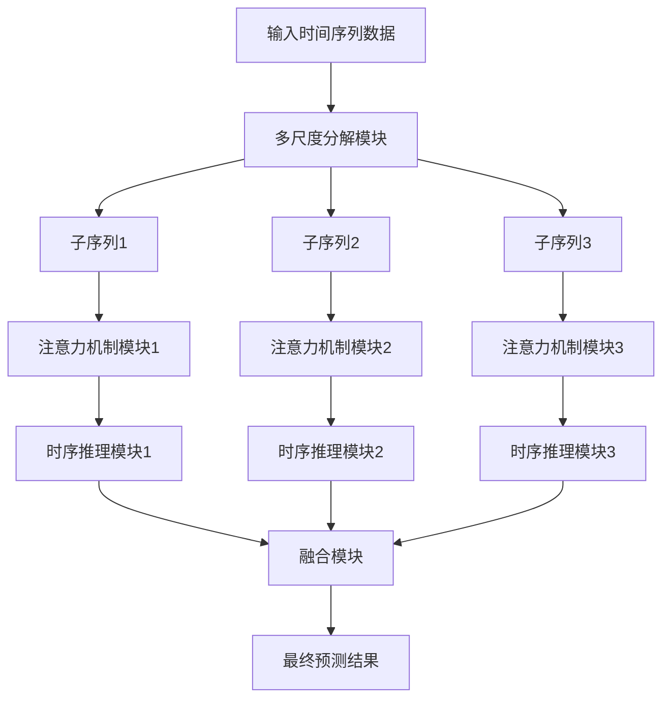

# 基于注意力机制的多尺度时序推理融合

> 关键词：注意力机制、多尺度时序推理、融合算法、深度学习、时间序列分析

> 摘要：本文围绕基于注意力机制的多尺度时序推理融合展开深入探讨。在众多实际应用场景中，时间序列数据往往具有多尺度特征和复杂的时序关系。传统方法难以有效捕捉这些特性，而注意力机制为解决这一问题提供了新的思路。文章首先介绍了相关背景知识，包括研究目的、预期读者等内容；接着详细阐述了核心概念，通过文本示意图和 Mermaid 流程图清晰展示原理和架构；然后深入分析核心算法原理，使用 Python 代码进行详细说明；同时给出数学模型和公式，并举例解释；通过项目实战展示代码的实际应用和解读；探讨了实际应用场景；推荐了相关的学习资源、开发工具和论文著作；最后总结了未来发展趋势与挑战，并给出常见问题解答和扩展阅读参考资料，旨在为读者全面深入地理解和应用该技术提供帮助。

## 1. 背景介绍 
### 1.1 目的和范围
在当今的信息技术时代，时间序列数据无处不在，如金融市场的股票价格波动、气象数据的变化、工业生产中的传感器数据等。这些数据蕴含着丰富的信息，但由于其具有多尺度和复杂的时序依赖关系，如何从这些数据中提取有价值的信息并进行准确的推理和预测成为了一个具有挑战性的问题。

本文的目的在于研究基于注意力机制的多尺度时序推理融合方法，探索如何利用注意力机制来有效地捕捉时间序列数据中的多尺度特征和时序关系，实现更准确的推理和预测。研究范围涵盖了相关核心概念的介绍、算法原理的分析、数学模型的建立、实际项目的应用以及未来发展趋势的探讨等方面。

### 1.2 预期读者
本文的预期读者包括但不限于以下几类人群：
- **科研人员**：对时间序列分析、深度学习等领域的研究感兴趣，希望深入了解基于注意力机制的多尺度时序推理融合技术，为其科研工作提供新的思路和方法。
- **数据科学家**：在实际工作中需要处理时间序列数据，期望通过学习该技术来提高数据处理和分析的能力，从而更准确地进行预测和决策。
- **软件开发人员**：对深度学习算法的实现和应用有兴趣，想要掌握相关技术并将其应用到实际的软件开发项目中。
- **高校学生**：学习计算机科学、统计学、数学等相关专业，希望通过阅读本文来拓宽知识面，了解前沿技术的发展动态。

### 1.3 文档结构概述
本文将按照以下结构进行组织：
- **核心概念与联系**：介绍基于注意力机制的多尺度时序推理融合的核心概念，包括注意力机制、多尺度时序推理等，并通过文本示意图和 Mermaid 流程图展示其原理和架构。
- **核心算法原理 & 具体操作步骤**：详细阐述核心算法的原理，并使用 Python 源代码进行说明，包括算法的具体实现步骤。
- **数学模型和公式 & 详细讲解 & 举例说明**：建立相关的数学模型，给出相应的公式，并通过具体的例子进行详细解释。
- **项目实战：代码实际案例和详细解释说明**：通过一个实际的项目案例，展示如何使用基于注意力机制的多尺度时序推理融合技术进行时间序列数据的处理和分析，包括开发环境的搭建、源代码的实现和解读。
- **实际应用场景**：探讨该技术在不同领域的实际应用场景，如金融、气象、工业等。
- **工具和资源推荐**：推荐相关的学习资源、开发工具和论文著作，帮助读者进一步深入学习和研究该技术。
- **总结：未来发展趋势与挑战**：总结基于注意力机制的多尺度时序推理融合技术的发展趋势，并分析其面临的挑战。
- **附录：常见问题与解答**：对读者可能遇到的常见问题进行解答。
- **扩展阅读 & 参考资料**：提供相关的扩展阅读材料和参考资料，方便读者进一步深入研究。

### 1.4 术语表
#### 1.4.1 核心术语定义
- **注意力机制（Attention Mechanism）**：一种模拟人类注意力的机制，通过计算不同输入元素的重要性权重，将注意力集中在关键信息上，从而提高模型的性能。
- **多尺度时序推理（Multi-scale Temporal Reasoning）**：对时间序列数据在不同时间尺度上进行分析和推理，以捕捉数据中的多尺度特征和时序关系。
- **融合（Fusion）**：将不同来源或不同尺度的信息进行整合，以获得更全面、准确的信息。
- **时间序列（Time Series）**：按照时间顺序排列的一系列数据点，如股票价格、气温变化等。

#### 1.4.2 相关概念解释
- **深度学习（Deep Learning）**：一种基于人工神经网络的机器学习方法，通过构建多层神经网络来自动学习数据中的特征和模式。
- **循环神经网络（Recurrent Neural Network, RNN）**：一种专门用于处理序列数据的神经网络，能够捕捉序列数据中的时序信息。
- **长短时记忆网络（Long Short-Term Memory, LSTM）**：一种改进的循环神经网络，能够有效地解决传统 RNN 中的梯度消失和梯度爆炸问题，更好地捕捉长序列数据中的时序信息。

#### 1.4.3 缩略词列表
- **RNN**：Recurrent Neural Network（循环神经网络）
- **LSTM**：Long Short-Term Memory（长短时记忆网络）
- **GRU**：Gated Recurrent Unit（门控循环单元）
- **Transformer**：一种基于注意力机制的深度学习模型

## 2. 核心概念与联系 
### 核心概念原理
#### 注意力机制
注意力机制的核心思想是通过计算输入序列中每个元素的重要性权重，将注意力集中在关键信息上。在时间序列数据处理中，注意力机制可以帮助模型自动地关注不同时间步的重要性，从而更好地捕捉时序信息。

具体来说，注意力机制通过计算一个注意力分数来衡量输入序列中每个元素的重要性，然后将这些分数进行归一化处理，得到注意力权重。最后，将注意力权重与输入序列进行加权求和，得到经过注意力机制处理后的输出。

#### 多尺度时序推理
多尺度时序推理是指对时间序列数据在不同时间尺度上进行分析和推理。时间序列数据通常具有不同的时间尺度特征，如短期波动、中期趋势和长期周期性等。传统的时序分析方法往往只关注单一时间尺度，难以全面捕捉数据中的信息。

多尺度时序推理通过将时间序列数据分解为不同时间尺度的子序列，然后对每个子序列进行单独的分析和推理，最后将各个子序列的结果进行融合，以获得更全面、准确的信息。

#### 融合
融合是指将不同来源或不同尺度的信息进行整合。在基于注意力机制的多尺度时序推理融合中，融合的目的是将不同时间尺度的推理结果进行整合，以获得更准确的预测结果。融合的方法可以有多种，如加权平均、拼接等。

### 架构的文本示意图
基于注意力机制的多尺度时序推理融合架构主要包括以下几个部分：
1. **多尺度分解模块**：将输入的时间序列数据分解为不同时间尺度的子序列。
2. **注意力机制模块**：对每个子序列应用注意力机制，计算每个时间步的重要性权重。
3. **时序推理模块**：对经过注意力机制处理后的子序列进行时序推理，得到每个子序列的推理结果。
4. **融合模块**：将各个子序列的推理结果进行融合，得到最终的预测结果。

### Mermaid 流程图


## 3. 核心算法原理 & 具体操作步骤 
### 核心算法原理
基于注意力机制的多尺度时序推理融合算法主要包括以下几个步骤：
1. **多尺度分解**：使用小波变换等方法将输入的时间序列数据分解为不同时间尺度的子序列。
2. **注意力机制计算**：对每个子序列应用注意力机制，计算每个时间步的重要性权重。
3. **时序推理**：使用循环神经网络（如 LSTM、GRU）等模型对经过注意力机制处理后的子序列进行时序推理，得到每个子序列的推理结果。
4. **融合**：将各个子序列的推理结果进行融合，得到最终的预测结果。

### 具体操作步骤及 Python 代码实现
```python
import numpy as np
import torch
import torch.nn as nn

# 多尺度分解模块（这里简单使用滑动窗口模拟）
def multi_scale_decomposition(data, window_sizes):
    sub_sequences = []
    for window_size in window_sizes:
        sub_seq = []
        for i in range(len(data) - window_size + 1):
            sub_seq.append(data[i:i+window_size])
        sub_sequences.append(np.array(sub_seq))
    return sub_sequences

# 注意力机制模块
class Attention(nn.Module):
    def __init__(self, input_size):
        super(Attention, self).__init__()
        self.linear = nn.Linear(input_size, 1)
        self.softmax = nn.Softmax(dim=1)

    def forward(self, x):
        scores = self.linear(x)
        weights = self.softmax(scores)
        weighted_sum = torch.sum(weights * x, dim=1)
        return weighted_sum

# 时序推理模块（使用 LSTM）
class LSTMModel(nn.Module):
    def __init__(self, input_size, hidden_size, output_size):
        super(LSTMModel, self).__init__()
        self.lstm = nn.LSTM(input_size, hidden_size, batch_first=True)
        self.fc = nn.Linear(hidden_size, output_size)

    def forward(self, x):
        out, _ = self.lstm(x)
        out = self.fc(out[:, -1, :])
        return out

# 融合模块（简单使用加权平均）
def fusion(results, weights):
    weighted_results = [w * r for w, r in zip(weights, results)]
    final_result = sum(weighted_results)
    return final_result

# 主函数
def main():
    # 生成示例数据
    data = np.random.randn(100, 1)
    window_sizes = [5, 10, 15]
    # 多尺度分解
    sub_sequences = multi_scale_decomposition(data, window_sizes)
    input_size = 1
    hidden_size = 16
    output_size = 1
    attention_models = [Attention(input_size) for _ in window_sizes]
    lstm_models = [LSTMModel(input_size, hidden_size, output_size) for _ in window_sizes]
    results = []
    for i in range(len(window_sizes)):
        sub_seq = torch.tensor(sub_sequences[i], dtype=torch.float32)
        # 注意力机制计算
        attn_output = attention_models[i](sub_seq)
        # 时序推理
        lstm_output = lstm_models[i](attn_output.unsqueeze(1))
        results.append(lstm_output)
    # 融合
    weights = [0.3, 0.4, 0.3]
    final_result = fusion(results, weights)
    print("Final prediction result:", final_result)

if __name__ == "__main__":
    main()
```

### 代码解释
1. **多尺度分解模块**：`multi_scale_decomposition` 函数使用滑动窗口的方法将输入的时间序列数据分解为不同时间尺度的子序列。
2. **注意力机制模块**：`Attention` 类实现了注意力机制，通过线性层计算注意力分数，然后使用 softmax 函数进行归一化处理，最后得到经过注意力机制处理后的输出。
3. **时序推理模块**：`LSTMModel` 类使用 LSTM 模型对经过注意力机制处理后的子序列进行时序推理，得到每个子序列的推理结果。
4. **融合模块**：`fusion` 函数使用加权平均的方法将各个子序列的推理结果进行融合，得到最终的预测结果。
5. **主函数**：`main` 函数将上述各个模块组合起来，完成基于注意力机制的多尺度时序推理融合的整个过程。

## 4. 数学模型和公式 & 详细讲解 & 举例说明 
### 多尺度分解
多尺度分解可以使用小波变换等方法将输入的时间序列数据 $x = [x_1, x_2, \cdots, x_T]$ 分解为不同时间尺度的子序列。假设使用小波变换将数据分解为 $L$ 个不同尺度的子序列 $x^{(l)} = [x_1^{(l)}, x_2^{(l)}, \cdots, x_{T_l}^{(l)}]$，其中 $l = 1, 2, \cdots, L$。

### 注意力机制
对于每个子序列 $x^{(l)}$，注意力机制的计算过程如下：
1. 计算注意力分数：
   $$e_{t}^{(l)} = \mathbf{W}_a \mathbf{h}_{t}^{(l)} + b_a$$
   其中，$\mathbf{h}_{t}^{(l)}$ 是子序列 $x^{(l)}$ 在时间步 $t$ 的隐藏状态，$\mathbf{W}_a$ 是注意力权重矩阵，$b_a$ 是偏置项。
2. 归一化注意力分数：
   $$\alpha_{t}^{(l)} = \frac{\exp(e_{t}^{(l)})}{\sum_{j=1}^{T_l} \exp(e_{j}^{(l)})}$$
   其中，$\alpha_{t}^{(l)}$ 是子序列 $x^{(l)}$ 在时间步 $t$ 的注意力权重。
3. 计算经过注意力机制处理后的输出：
   $$\mathbf{c}^{(l)} = \sum_{t=1}^{T_l} \alpha_{t}^{(l)} \mathbf{h}_{t}^{(l)}$$

### 时序推理
使用循环神经网络（如 LSTM）对经过注意力机制处理后的输出 $\mathbf{c}^{(l)}$ 进行时序推理，得到每个子序列的推理结果 $\hat{y}^{(l)}$。

### 融合
将各个子序列的推理结果 $\hat{y}^{(l)}$ 进行融合，得到最终的预测结果 $\hat{y}$。融合的方法可以使用加权平均：
$$\hat{y} = \sum_{l=1}^{L} w_l \hat{y}^{(l)}$$
其中，$w_l$ 是第 $l$ 个子序列的融合权重，且 $\sum_{l=1}^{L} w_l = 1$。

### 举例说明
假设输入的时间序列数据为 $x = [1, 2, 3, 4, 5, 6, 7, 8, 9, 10]$，使用滑动窗口的方法将其分解为两个不同时间尺度的子序列：
- 尺度 1：窗口大小为 3，子序列为 $x^{(1)} = [[1, 2, 3], [2, 3, 4], [3, 4, 5], [4, 5, 6], [5, 6, 7], [6, 7, 8], [7, 8, 9], [8, 9, 10]]$
- 尺度 2：窗口大小为 5，子序列为 $x^{(2)} = [[1, 2, 3, 4, 5], [2, 3, 4, 5, 6], [3, 4, 5, 6, 7], [4, 5, 6, 7, 8], [5, 6, 7, 8, 9], [6, 7, 8, 9, 10]]$

对每个子序列应用注意力机制，计算注意力权重，然后使用 LSTM 模型进行时序推理，得到每个子序列的推理结果 $\hat{y}^{(1)}$ 和 $\hat{y}^{(2)}$。最后，使用加权平均的方法将两个子序列的推理结果进行融合，得到最终的预测结果 $\hat{y}$。

## 5. 项目实战：代码实际案例和详细解释说明 
### 5.1  开发环境搭建
#### 安装 Python
首先需要安装 Python 环境，建议使用 Python 3.7 及以上版本。可以从 Python 官方网站（https://www.python.org/downloads/）下载并安装。

#### 安装深度学习框架
本文使用 PyTorch 作为深度学习框架，可以使用以下命令进行安装：
```sh
pip install torch torchvision
```

#### 安装其他依赖库
还需要安装一些其他的依赖库，如 NumPy、Matplotlib 等，可以使用以下命令进行安装：
```sh
pip install numpy matplotlib
```

### 5.2  源代码详细实现和代码解读
```python
import numpy as np
import torch
import torch.nn as nn
import matplotlib.pyplot as plt

# 多尺度分解模块（这里简单使用滑动窗口模拟）
def multi_scale_decomposition(data, window_sizes):
    sub_sequences = []
    for window_size in window_sizes:
        sub_seq = []
        for i in range(len(data) - window_size + 1):
            sub_seq.append(data[i:i+window_size])
        sub_sequences.append(np.array(sub_seq))
    return sub_sequences

# 注意力机制模块
class Attention(nn.Module):
    def __init__(self, input_size):
        super(Attention, self).__init__()
        self.linear = nn.Linear(input_size, 1)
        self.softmax = nn.Softmax(dim=1)

    def forward(self, x):
        scores = self.linear(x)
        weights = self.softmax(scores)
        weighted_sum = torch.sum(weights * x, dim=1)
        return weighted_sum

# 时序推理模块（使用 LSTM）
class LSTMModel(nn.Module):
    def __init__(self, input_size, hidden_size, output_size):
        super(LSTMModel, self).__init__()
        self.lstm = nn.LSTM(input_size, hidden_size, batch_first=True)
        self.fc = nn.Linear(hidden_size, output_size)

    def forward(self, x):
        out, _ = self.lstm(x)
        out = self.fc(out[:, -1, :])
        return out

# 融合模块（简单使用加权平均）
def fusion(results, weights):
    weighted_results = [w * r for w, r in zip(weights, results)]
    final_result = sum(weighted_results)
    return final_result

# 主函数
def main():
    # 生成示例数据
    data = np.sin(np.linspace(0, 10 * np.pi, 200))
    window_sizes = [5, 10, 15]
    # 多尺度分解
    sub_sequences = multi_scale_decomposition(data, window_sizes)
    input_size = 1
    hidden_size = 16
    output_size = 1
    attention_models = [Attention(input_size) for _ in window_sizes]
    lstm_models = [LSTMModel(input_size, hidden_size, output_size) for _ in window_sizes]
    results = []
    for i in range(len(window_sizes)):
        sub_seq = torch.tensor(sub_sequences[i], dtype=torch.float32).unsqueeze(-1)
        # 注意力机制计算
        attn_output = attention_models[i](sub_seq)
        # 时序推理
        lstm_output = lstm_models[i](attn_output.unsqueeze(1))
        results.append(lstm_output)
    # 融合
    weights = [0.3, 0.4, 0.3]
    final_result = fusion(results, weights)
    # 可视化结果
    plt.plot(data, label='Original Data')
    plt.plot(final_result.detach().numpy(), label='Predicted Data')
    plt.legend()
    plt.show()

if __name__ == "__main__":
    main()
```

### 5.3  代码解读与分析
#### 多尺度分解模块
`multi_scale_decomposition` 函数使用滑动窗口的方法将输入的时间序列数据分解为不同时间尺度的子序列。对于每个窗口大小，函数会遍历数据，提取相应的子序列并存储在列表中。

#### 注意力机制模块
`Attention` 类实现了注意力机制。在 `forward` 方法中，首先使用线性层计算注意力分数，然后使用 softmax 函数将分数归一化得到注意力权重，最后将注意力权重与输入进行加权求和得到经过注意力机制处理后的输出。

#### 时序推理模块
`LSTMModel` 类使用 LSTM 模型进行时序推理。在 `forward` 方法中，首先将输入数据输入到 LSTM 层中，得到输出序列，然后取最后一个时间步的输出并通过全连接层得到最终的推理结果。

#### 融合模块
`fusion` 函数使用加权平均的方法将各个子序列的推理结果进行融合。函数会将每个推理结果乘以相应的权重，然后将它们相加得到最终的预测结果。

#### 主函数
`main` 函数是整个程序的入口。首先生成示例数据，然后调用多尺度分解模块将数据分解为不同时间尺度的子序列。接着，为每个子序列创建注意力机制模型和 LSTM 模型，并进行注意力机制计算和时序推理。最后，调用融合模块将各个子序列的推理结果进行融合，并使用 Matplotlib 库将原始数据和预测数据进行可视化。

## 6. 实际应用场景 
### 金融领域
在金融领域，时间序列数据如股票价格、汇率等具有多尺度和复杂的时序关系。基于注意力机制的多尺度时序推理融合技术可以用于股票价格预测、风险评估等方面。通过捕捉不同时间尺度的市场变化信息，模型可以更准确地预测股票价格的走势，帮助投资者做出更明智的决策。

### 气象领域
气象数据如气温、降水等也是典型的时间序列数据，具有明显的多尺度特征。该技术可以用于气象预测，通过分析不同时间尺度的气象数据，如短期的天气变化和长期的气候变化趋势，提高气象预测的准确性，为农业、航空等行业提供更可靠的气象信息。

### 工业领域
在工业生产中，传感器会产生大量的时间序列数据，如设备的温度、压力、振动等。基于注意力机制的多尺度时序推理融合技术可以用于设备故障预测和健康管理。通过对不同时间尺度的传感器数据进行分析，模型可以及时发现设备的异常行为，提前预测设备故障，减少生产停机时间，提高生产效率。

### 医疗领域
医疗数据如心电图、脑电图等也是时间序列数据，具有多尺度和复杂的特征。该技术可以用于疾病诊断和预测，通过分析不同时间尺度的医疗数据，帮助医生更准确地诊断疾病，预测疾病的发展趋势，制定更个性化的治疗方案。

## 7. 工具和资源推荐
### 7.1 学习资源推荐
#### 7.1.1 书籍推荐
- 《深度学习》（Deep Learning）：由 Ian Goodfellow、Yoshua Bengio 和 Aaron Courville 合著，是深度学习领域的经典教材，涵盖了深度学习的基本概念、算法和应用。
- 《Python 深度学习》（Deep Learning with Python）：由 Francois Chollet 所著，以 Keras 框架为例，介绍了深度学习的基本原理和实践方法。
- 《时间序列分析：预测与控制》（Time Series Analysis: Forecasting and Control）：由 George E. P. Box、Gwilym M. Jenkins 和 Gregory C. Reinsel 合著，是时间序列分析领域的经典教材，详细介绍了时间序列分析的方法和应用。

#### 7.1.2 在线课程
- Coursera 上的“深度学习专项课程”（Deep Learning Specialization）：由 Andrew Ng 教授授课，涵盖了深度学习的各个方面，包括神经网络、卷积神经网络、循环神经网络等。
- edX 上的“时间序列预测与分析”（Time Series Forecasting and Analysis）：介绍了时间序列分析的基本概念、方法和工具，适合初学者学习。
- Udemy 上的“基于 PyTorch 的深度学习实战课程”（Deep Learning with PyTorch）：通过实际项目案例，介绍了如何使用 PyTorch 框架进行深度学习模型的开发和训练。

#### 7.1.3 技术博客和网站
- Medium：一个技术博客平台，上面有很多关于深度学习、时间序列分析等领域的优质文章。
- arXiv：一个预印本平台，上面可以找到很多最新的学术研究论文，了解该领域的最新发展动态。
- Towards Data Science：一个专注于数据科学和机器学习的博客网站，上面有很多实用的技术文章和案例分析。

### 7.2 开发工具框架推荐
#### 7.2.1 IDE和编辑器
- PyCharm：一款专业的 Python 集成开发环境，具有代码编辑、调试、版本控制等功能，适合开发 Python 项目。
- Jupyter Notebook：一个交互式的开发环境，可以在浏览器中编写和运行代码，适合进行数据探索和模型实验。
- Visual Studio Code：一款轻量级的代码编辑器，支持多种编程语言，具有丰富的插件扩展功能。

#### 7.2.2 调试和性能分析工具
- PyTorch Profiler：PyTorch 提供的性能分析工具，可以帮助开发者分析模型的运行时间、内存使用等情况，优化模型性能。
- TensorBoard：一个可视化工具，可以用于可视化模型的训练过程、损失曲线、参数分布等信息，方便开发者进行调试和分析。
- cProfile：Python 内置的性能分析工具，可以帮助开发者分析代码的运行时间和函数调用情况。

#### 7.2.3 相关框架和库
- PyTorch：一个开源的深度学习框架，具有动态图计算、自动求导等功能，适合快速开发和实验深度学习模型。
- NumPy：一个用于科学计算的 Python 库，提供了高效的数组操作和数学函数，是深度学习开发的基础库之一。
- Pandas：一个用于数据处理和分析的 Python 库，提供了数据结构和数据操作工具，方便处理时间序列数据。

### 7.3 相关论文著作推荐
#### 7.3.1 经典论文
- 《Attention Is All You Need》：提出了 Transformer 模型，引入了自注意力机制，是注意力机制领域的经典论文。
- 《Long Short-Term Memory》：介绍了长短时记忆网络（LSTM）的原理和应用，解决了传统循环神经网络中的梯度消失和梯度爆炸问题。
- 《Wavelet Transforms and Their Applications in Signal Processing》：介绍了小波变换的基本原理和在信号处理中的应用，是多尺度分析领域的经典论文。

#### 7.3.2 最新研究成果
- 可以通过 arXiv、IEEE Xplore、ACM Digital Library 等学术数据库搜索最新的关于基于注意力机制的多尺度时序推理融合的研究论文，了解该领域的最新发展动态。

#### 7.3.3 应用案例分析
- 《Deep Learning for Time Series Forecasting: A Survey》：对深度学习在时间序列预测中的应用进行了综述，介绍了多种深度学习模型在时间序列预测中的应用案例和实验结果。
- 《Time Series Analysis with Deep Learning: A Survey》：对深度学习在时间序列分析中的应用进行了全面的综述，包括模型架构、训练方法、应用场景等方面的内容。

## 8. 总结：未来发展趋势与挑战
### 未来发展趋势
#### 模型架构的创新
未来可能会出现更多基于注意力机制的新型模型架构，这些架构将更好地捕捉时间序列数据中的多尺度特征和复杂的时序关系。例如，将注意力机制与其他深度学习模型（如卷积神经网络、生成对抗网络等）相结合，构建更加高效和强大的模型。

#### 多模态融合
随着数据来源的多样化，未来的研究可能会更加注重多模态数据的融合。除了时间序列数据，还可以结合图像、文本等其他模态的数据，进行更全面、准确的推理和预测。例如，在金融领域，可以将股票价格的时间序列数据与新闻文本数据相结合，提高股票价格预测的准确性。

#### 可解释性研究
深度学习模型通常被认为是“黑盒”模型，缺乏可解释性。未来的研究将更加关注基于注意力机制的多尺度时序推理融合模型的可解释性，开发出能够解释模型决策过程的方法和技术，使模型的预测结果更具可信度和说服力。

### 挑战
#### 数据质量和数量
时间序列数据的质量和数量对模型的性能有很大的影响。在实际应用中，数据可能存在噪声、缺失值等问题，需要进行数据预处理和清洗。此外，获取大量高质量的时间序列数据也可能面临困难，需要探索有效的数据增强和迁移学习方法。

#### 计算资源和效率
基于注意力机制的多尺度时序推理融合模型通常需要大量的计算资源和时间进行训练。在处理大规模时间序列数据时，模型的训练和推理效率可能会成为瓶颈。需要研究高效的算法和优化策略，提高模型的计算效率。

#### 模型的泛化能力
模型的泛化能力是衡量模型性能的重要指标之一。在实际应用中，模型可能会面临不同的数据集和场景，需要具备良好的泛化能力。如何提高基于注意力机制的多尺度时序推理融合模型的泛化能力，是未来需要解决的一个重要问题。

## 9. 附录：常见问题与解答
### 问题 1：注意力机制的作用是什么？
注意力机制的作用是通过计算输入序列中每个元素的重要性权重，将注意力集中在关键信息上，从而提高模型的性能。在时间序列数据处理中，注意力机制可以帮助模型自动地关注不同时间步的重要性，更好地捕捉时序信息。

### 问题 2：多尺度时序推理的意义是什么？
时间序列数据通常具有不同的时间尺度特征，如短期波动、中期趋势和长期周期性等。多尺度时序推理的意义在于对时间序列数据在不同时间尺度上进行分析和推理，以全面捕捉数据中的信息，提高预测的准确性。

### 问题 3：如何选择合适的融合方法？
选择合适的融合方法需要考虑具体的应用场景和数据特点。常见的融合方法包括加权平均、拼接等。加权平均方法简单易懂，适用于不同子序列的重要性可以通过权重来表示的情况；拼接方法可以将不同子序列的信息进行整合，适用于需要保留更多信息的情况。

### 问题 4：如何评估基于注意力机制的多尺度时序推理融合模型的性能？
可以使用一些常见的评估指标来评估模型的性能，如均方误差（Mean Squared Error, MSE）、平均绝对误差（Mean Absolute Error, MAE）、均方根误差（Root Mean Squared Error, RMSE）等。此外，还可以通过可视化模型的预测结果，直观地观察模型的性能。

## 10. 扩展阅读 & 参考资料
### 扩展阅读
- 《深度学习进阶：自然语言处理》（Deep Learning Advanced: Natural Language Processing）：介绍了深度学习在自然语言处理领域的应用，包括注意力机制、Transformer 模型等内容。
- 《时间序列分析与预测》（Time Series Analysis and Forecasting）：详细介绍了时间序列分析的方法和技术，包括传统方法和深度学习方法。
- 《人工智能：一种现代的方法》（Artificial Intelligence: A Modern Approach）：是人工智能领域的经典教材，涵盖了人工智能的各个方面，包括机器学习、深度学习等内容。

### 参考资料
- Goodfellow, I., Bengio, Y., & Courville, A. (2016). Deep Learning. MIT Press.
- Chollet, F. (2017). Deep Learning with Python. Manning Publications.
- Box, G. E. P., Jenkins, G. M., & Reinsel, G. C. (2015). Time Series Analysis: Forecasting and Control. John Wiley & Sons.
- Vaswani, A., Shazeer, N., Parmar, N., Uszkoreit, J., Jones, L., Gomez, A. N.,... & Polosukhin, I. (2017). Attention is all you need. Advances in neural information processing systems, 5998-6008.
- Hochreiter, S., & Schmidhuber, J. (1997). Long short-term memory. Neural computation, 9(8), 1735-1780.
- Mallat, S. G. (1999). A wavelet tour of signal processing: The sparse way. Academic press.

作者：AI天才研究院/AI Genius Institute & 禅与计算机程序设计艺术 /Zen And The Art of Computer Programming