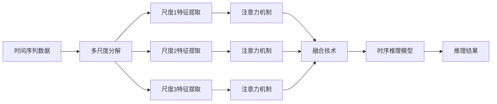

# 基于注意力机制的多尺度时序推理融合技术优化

> 关键词：注意力机制、多尺度时序推理、融合技术优化、深度学习、时间序列分析

> 摘要：本文聚焦于基于注意力机制的多尺度时序推理融合技术优化。首先介绍了相关技术的背景和重要性，阐述了核心概念及其联系，包括注意力机制、多尺度时序推理等原理和架构。详细讲解了核心算法原理，并给出Python源代码示例，同时介绍了相关的数学模型和公式。通过项目实战展示了代码的实际应用和详细解释。分析了该技术在多个领域的实际应用场景，推荐了学习资源、开发工具框架以及相关论文著作。最后总结了该技术的未来发展趋势与挑战，并给出常见问题解答和扩展阅读参考资料，旨在为研究和应用该技术的人员提供全面深入的指导。

## 1. 背景介绍 
### 1.1 目的和范围
在当今的信息时代，时间序列数据广泛存在于各个领域，如金融市场的股票价格走势、气象领域的气象数据变化、工业生产中的设备运行状态监测等。多尺度时序推理融合技术旨在从不同尺度上对时间序列数据进行分析和推理，以更全面、准确地捕捉数据中的信息和模式。然而，传统的多尺度时序推理方法往往难以有效地处理数据中的重要信息和复杂的时间依赖关系。注意力机制的引入为解决这一问题提供了新的思路，它能够自动地关注时间序列中不同位置的重要性，从而提高推理的准确性和效率。

本文的范围主要涵盖基于注意力机制的多尺度时序推理融合技术的原理、算法、应用以及优化方法。我们将详细探讨如何利用注意力机制对多尺度时序数据进行处理和融合，通过理论分析和实际案例展示该技术的优势和应用前景。

### 1.2 预期读者
本文的预期读者包括对深度学习、时间序列分析、人工智能等领域感兴趣的研究人员、工程师和学生。对于正在从事相关领域研究的学者，本文可以提供新的研究思路和方法；对于工程师来说，能够帮助他们将该技术应用到实际项目中；而对于学生，本文可以作为学习时间序列分析和注意力机制的参考资料。

### 1.3 文档结构概述
本文将按照以下结构进行组织：
1. 背景介绍：介绍技术的目的、范围、预期读者和文档结构。
2. 核心概念与联系：阐述注意力机制、多尺度时序推理等核心概念的原理和架构，并给出示意图和流程图。
3. 核心算法原理 & 具体操作步骤：详细讲解核心算法原理，并用Python源代码进行说明。
4. 数学模型和公式 & 详细讲解 & 举例说明：介绍相关的数学模型和公式，并通过具体例子进行解释。
5. 项目实战：代码实际案例和详细解释说明，包括开发环境搭建、源代码实现和代码解读。
6. 实际应用场景：分析该技术在不同领域的实际应用。
7. 工具和资源推荐：推荐学习资源、开发工具框架和相关论文著作。
8. 总结：未来发展趋势与挑战：总结技术的发展趋势和面临的挑战。
9. 附录：常见问题与解答：解答读者可能遇到的常见问题。
10. 扩展阅读 & 参考资料：提供扩展阅读的建议和参考资料。

### 1.4 术语表
#### 1.4.1 核心术语定义
- **注意力机制（Attention Mechanism）**：一种模仿人类注意力的机制，能够自动地聚焦于输入数据中的重要部分，提高模型对关键信息的处理能力。
- **多尺度时序推理（Multi-scale Temporal Reasoning）**：在不同的时间尺度上对时间序列数据进行分析和推理，以捕捉数据中的不同层次的信息和模式。
- **融合技术（Fusion Technology）**：将多个不同来源或不同尺度的信息进行整合和处理，以得到更全面、准确的结果。
- **时间序列（Time Series）**：按时间顺序排列的一系列数据点，通常用于描述随时间变化的现象。

#### 1.4.2 相关概念解释
- **自注意力机制（Self-attention Mechanism）**：一种特殊的注意力机制，用于处理序列数据，能够在序列内部自动计算每个位置与其他位置的相关性。
- **多尺度特征（Multi-scale Features）**：在不同尺度上提取的特征，能够反映数据的不同层次的信息。
- **时序推理模型（Temporal Reasoning Model）**：用于对时间序列数据进行分析和预测的模型，如循环神经网络（RNN）、长短时记忆网络（LSTM）等。

#### 1.4.3 缩略词列表
- **RNN**：Recurrent Neural Network，循环神经网络
- **LSTM**：Long Short-Term Memory，长短时记忆网络
- **GRU**：Gated Recurrent Unit，门控循环单元
- **Transformer**：一种基于注意力机制的深度学习模型

## 2. 核心概念与联系 
### 2.1 注意力机制原理
注意力机制的核心思想是根据输入数据的重要性分配不同的权重，从而使模型能够更加关注重要的信息。在时间序列分析中，注意力机制可以帮助模型自动地聚焦于不同时间步的重要信息，从而提高模型的性能。

注意力机制的基本公式如下：
$$Attention(Q, K, V) = softmax(\frac{QK^T}{\sqrt{d_k}})V$$
其中，$Q$ 是查询矩阵，$K$ 是键矩阵，$V$ 是值矩阵，$d_k$ 是键的维度。通过计算查询和键之间的相似度，得到注意力权重，然后将权重应用到值矩阵上，得到注意力输出。

### 2.2 多尺度时序推理原理
多尺度时序推理的目的是在不同的时间尺度上对时间序列数据进行分析和推理。不同的时间尺度可以反映数据的不同层次的信息，如短期波动、中期趋势和长期模式等。通过在多个尺度上进行推理，可以更全面地捕捉数据中的信息和模式。

常见的多尺度时序推理方法包括金字塔结构、小波变换等。金字塔结构通过对时间序列进行下采样，得到不同尺度的子序列，然后对每个子序列进行独立的分析和推理。小波变换则是一种时频分析方法，能够将时间序列分解为不同频率的分量，从而实现多尺度分析。

### 2.3 融合技术原理
融合技术用于将多个不同来源或不同尺度的信息进行整合和处理。在多尺度时序推理中，融合技术可以将不同尺度的推理结果进行融合，得到更全面、准确的结果。

常见的融合方法包括加权平均、拼接等。加权平均方法根据不同尺度的重要性分配不同的权重，然后将不同尺度的推理结果进行加权求和。拼接方法则是将不同尺度的推理结果直接拼接在一起，形成一个更高维度的特征向量。

### 2.4 核心概念架构示意图


### 2.5 核心概念联系解释
注意力机制、多尺度时序推理和融合技术之间相互关联，共同构成了基于注意力机制的多尺度时序推理融合技术。多尺度时序推理为注意力机制提供了不同尺度的信息，使注意力机制能够在多个尺度上聚焦于重要信息。融合技术则将不同尺度的注意力输出进行整合，得到更全面、准确的特征表示，为时序推理模型提供更好的输入。

## 3. 核心算法原理 & 具体操作步骤 
### 3.1 核心算法原理
基于注意力机制的多尺度时序推理融合技术的核心算法可以分为以下几个步骤：
1. **多尺度分解**：将输入的时间序列数据进行多尺度分解，得到不同尺度的子序列。
2. **特征提取**：对每个尺度的子序列进行特征提取，得到不同尺度的特征表示。
3. **注意力机制**：对每个尺度的特征表示应用注意力机制，计算每个时间步的重要性权重。
4. **融合技术**：将不同尺度的注意力输出进行融合，得到统一的特征表示。
5. **时序推理**：将融合后的特征表示输入到时序推理模型中，进行推理和预测。

### 3.2 具体操作步骤及Python代码实现
```python
import numpy as np
import torch
import torch.nn as nn

# 多尺度分解（简单示例：下采样）
def multi_scale_decomposition(data, scales):
    multi_scale_data = []
    for scale in scales:
        downsampled_data = data[::scale]
        multi_scale_data.append(downsampled_data)
    return multi_scale_data

# 特征提取（简单示例：使用全连接层）
class FeatureExtractor(nn.Module):
    def __init__(self, input_size, hidden_size):
        super(FeatureExtractor, self).__init__()
        self.fc = nn.Linear(input_size, hidden_size)

    def forward(self, x):
        return self.fc(x)

# 注意力机制
class Attention(nn.Module):
    def __init__(self, input_size):
        super(Attention, self).__init__()
        self.fc = nn.Linear(input_size, 1)

    def forward(self, x):
        scores = self.fc(x)
        attention_weights = torch.softmax(scores, dim=0)
        weighted_x = x * attention_weights
        return weighted_x.sum(dim=0)

# 融合技术（简单示例：加权平均）
def fusion(features, weights):
    weighted_features = [w * f for w, f in zip(weights, features)]
    fused_feature = sum(weighted_features)
    return fused_feature

# 时序推理模型（简单示例：全连接层）
class TemporalReasoningModel(nn.Module):
    def __init__(self, input_size, output_size):
        super(TemporalReasoningModel, self).__init__()
        self.fc = nn.Linear(input_size, output_size)

    def forward(self, x):
        return self.fc(x)

# 主函数
def main():
    # 生成示例数据
    data = np.random.randn(100, 10)
    scales = [1, 2, 5]

    # 多尺度分解
    multi_scale_data = multi_scale_decomposition(data, scales)

    # 特征提取
    input_size = data.shape[1]
    hidden_size = 20
    feature_extractors = [FeatureExtractor(input_size, hidden_size) for _ in scales]
    multi_scale_features = []
    for i, scale_data in enumerate(multi_scale_data):
        scale_data = torch.tensor(scale_data, dtype=torch.float32)
        features = feature_extractors[i](scale_data)
        multi_scale_features.append(features)

    # 注意力机制
    attention_models = [Attention(hidden_size) for _ in scales]
    attention_outputs = []
    for i, features in enumerate(multi_scale_features):
        attention_output = attention_models[i](features)
        attention_outputs.append(attention_output)

    # 融合技术
    weights = [0.3, 0.3, 0.4]
    fused_feature = fusion(attention_outputs, weights)

    # 时序推理
    output_size = 1
    reasoning_model = TemporalReasoningModel(hidden_size, output_size)
    result = reasoning_model(fused_feature)

    print("推理结果:", result)

if __name__ == "__main__":
    main()
```

### 3.3 代码解释
- **多尺度分解**：通过下采样的方式将输入的时间序列数据分解为不同尺度的子序列。
- **特征提取**：使用全连接层对每个尺度的子序列进行特征提取。
- **注意力机制**：计算每个时间步的重要性权重，并对特征进行加权求和。
- **融合技术**：使用加权平均的方法将不同尺度的注意力输出进行融合。
- **时序推理**：使用全连接层对融合后的特征进行推理和预测。

## 4. 数学模型和公式 & 详细讲解 & 举例说明 
### 4.1 多尺度分解数学模型
假设输入的时间序列数据为 $X = [x_1, x_2, \cdots, x_T]$，其中 $T$ 是时间序列的长度。多尺度分解可以通过下采样的方式实现，对于尺度 $s$，下采样后的子序列为 $X_s = [x_{s}, x_{2s}, \cdots, x_{\lfloor T/s \rfloor s}]$。

### 4.2 特征提取数学模型
特征提取可以使用线性变换来实现，假设输入的特征向量为 $x \in \mathbb{R}^n$，特征提取函数为 $f(x) = Wx + b$，其中 $W \in \mathbb{R}^{m \times n}$ 是权重矩阵，$b \in \mathbb{R}^m$ 是偏置向量，$m$ 是输出特征的维度。

### 4.3 注意力机制数学模型
注意力机制的数学模型如前文所述：
$$Attention(Q, K, V) = softmax(\frac{QK^T}{\sqrt{d_k}})V$$
在实际应用中，通常使用自注意力机制，即 $Q = K = V$。假设输入的特征序列为 $X = [x_1, x_2, \cdots, x_T]$，其中 $x_i \in \mathbb{R}^n$，则自注意力机制的输出为：
$$A = Attention(X, X, X)$$

### 4.4 融合技术数学模型
加权平均融合方法的数学模型为：
$$F = \sum_{i=1}^{S} w_i A_i$$
其中，$S$ 是尺度的数量，$A_i$ 是第 $i$ 个尺度的注意力输出，$w_i$ 是第 $i$ 个尺度的权重，且 $\sum_{i=1}^{S} w_i = 1$。

### 4.5 举例说明
假设输入的时间序列数据为 $X = [1, 2, 3, 4, 5, 6, 7, 8, 9, 10]$，尺度为 $s_1 = 1$，$s_2 = 2$，$s_3 = 5$。
- **多尺度分解**：
  - $X_{s_1} = [1, 2, 3, 4, 5, 6, 7, 8, 9, 10]$
  - $X_{s_2} = [1, 3, 5, 7, 9]$
  - $X_{s_3} = [1, 6]$
- **特征提取**：假设特征提取函数为 $f(x) = 2x$，则对于 $X_{s_1}$，特征表示为 $[2, 4, 6, 8, 10, 12, 14, 16, 18, 20]$。
- **注意力机制**：假设注意力权重为 $[0.1, 0.2, 0.3, 0.2, 0.1]$，则注意力输出为 $0.1 \times 2 + 0.2 \times 4 + 0.3 \times 6 + 0.2 \times 8 + 0.1 \times 10 = 5.6$。
- **融合技术**：假设权重为 $[0.3, 0.3, 0.4]$，三个尺度的注意力输出分别为 $5.6$，$3.2$，$2.0$，则融合后的特征为 $0.3 \times 5.6 + 0.3 \times 3.2 + 0.4 \times 2.0 = 3.44$。

## 5. 项目实战：代码实际案例和详细解释说明 
### 5.1  开发环境搭建
#### 5.1.1 安装Python
首先需要安装Python，建议使用Python 3.7及以上版本。可以从Python官方网站（https://www.python.org/downloads/）下载并安装。

#### 5.1.2 安装必要的库
使用以下命令安装必要的库：
```sh
pip install numpy torch
```

### 5.2  源代码详细实现和代码解读
```python
import numpy as np
import torch
import torch.nn as nn

# 多尺度分解（简单示例：下采样）
def multi_scale_decomposition(data, scales):
    multi_scale_data = []
    for scale in scales:
        downsampled_data = data[::scale]
        multi_scale_data.append(downsampled_data)
    return multi_scale_data

# 特征提取（简单示例：使用全连接层）
class FeatureExtractor(nn.Module):
    def __init__(self, input_size, hidden_size):
        super(FeatureExtractor, self).__init__()
        self.fc = nn.Linear(input_size, hidden_size)

    def forward(self, x):
        return self.fc(x)

# 注意力机制
class Attention(nn.Module):
    def __init__(self, input_size):
        super(Attention, self).__init__()
        self.fc = nn.Linear(input_size, 1)

    def forward(self, x):
        scores = self.fc(x)
        attention_weights = torch.softmax(scores, dim=0)
        weighted_x = x * attention_weights
        return weighted_x.sum(dim=0)

# 融合技术（简单示例：加权平均）
def fusion(features, weights):
    weighted_features = [w * f for w, f in zip(weights, features)]
    fused_feature = sum(weighted_features)
    return fused_feature

# 时序推理模型（简单示例：全连接层）
class TemporalReasoningModel(nn.Module):
    def __init__(self, input_size, output_size):
        super(TemporalReasoningModel, self).__init__()
        self.fc = nn.Linear(input_size, output_size)

    def forward(self, x):
        return self.fc(x)

# 主函数
def main():
    # 生成示例数据
    data = np.random.randn(100, 10)
    scales = [1, 2, 5]

    # 多尺度分解
    multi_scale_data = multi_scale_decomposition(data, scales)

    # 特征提取
    input_size = data.shape[1]
    hidden_size = 20
    feature_extractors = [FeatureExtractor(input_size, hidden_size) for _ in scales]
    multi_scale_features = []
    for i, scale_data in enumerate(multi_scale_data):
        scale_data = torch.tensor(scale_data, dtype=torch.float32)
        features = feature_extractors[i](scale_data)
        multi_scale_features.append(features)

    # 注意力机制
    attention_models = [Attention(hidden_size) for _ in scales]
    attention_outputs = []
    for i, features in enumerate(multi_scale_features):
        attention_output = attention_models[i](features)
        attention_outputs.append(attention_output)

    # 融合技术
    weights = [0.3, 0.3, 0.4]
    fused_feature = fusion(attention_outputs, weights)

    # 时序推理
    output_size = 1
    reasoning_model = TemporalReasoningModel(hidden_size, output_size)
    result = reasoning_model(fused_feature)

    print("推理结果:", result)

if __name__ == "__main__":
    main()
```

#### 代码解读
1. **多尺度分解**：`multi_scale_decomposition` 函数通过下采样的方式将输入的时间序列数据分解为不同尺度的子序列。
2. **特征提取**：`FeatureExtractor` 类使用全连接层对每个尺度的子序列进行特征提取。
3. **注意力机制**：`Attention` 类计算每个时间步的重要性权重，并对特征进行加权求和。
4. **融合技术**：`fusion` 函数使用加权平均的方法将不同尺度的注意力输出进行融合。
5. **时序推理**：`TemporalReasoningModel` 类使用全连接层对融合后的特征进行推理和预测。

### 5.3  代码解读与分析
#### 优点
- **灵活性**：代码结构清晰，各个模块可以独立修改和扩展，方便进行不同的实验和优化。
- **可解释性**：每个步骤都有明确的数学模型和代码实现，易于理解和解释。

#### 缺点
- **简单性**：代码中的多尺度分解、特征提取、注意力机制和融合技术都采用了简单的实现方式，可能无法处理复杂的时间序列数据。
- **可扩展性**：在处理大规模数据时，代码的性能可能会受到影响，需要进一步优化。

#### 改进方向
- **多尺度分解**：可以使用更复杂的方法，如小波变换，来实现多尺度分解。
- **特征提取**：可以使用更强大的神经网络模型，如卷积神经网络（CNN），来进行特征提取。
- **注意力机制**：可以使用更复杂的注意力机制，如多头注意力机制，来提高模型的性能。
- **融合技术**：可以使用更灵活的融合方法，如自适应加权融合，来根据数据的特点自动调整权重。

## 6. 实际应用场景 
### 6.1 金融领域
在金融领域，时间序列数据如股票价格、汇率等具有重要的价值。基于注意力机制的多尺度时序推理融合技术可以用于股票价格预测、风险评估等任务。通过在不同尺度上分析股票价格的变化趋势，模型可以更准确地捕捉市场的动态，从而做出更合理的投资决策。

### 6.2 气象领域
气象数据如气温、降水等也是典型的时间序列数据。该技术可以用于气象预测，通过对不同尺度的气象数据进行分析和推理，模型可以更准确地预测天气变化，为农业、交通等领域提供重要的决策支持。

### 6.3 工业领域
在工业生产中，设备的运行状态监测是非常重要的。通过对设备的传感器数据进行多尺度时序分析和推理，可以及时发现设备的故障隐患，提前进行维护和维修，从而提高设备的可靠性和生产效率。

### 6.4 医疗领域
医疗数据如心电图、脑电图等也是时间序列数据。该技术可以用于疾病诊断和预测，通过对不同尺度的医疗数据进行分析和推理，模型可以更准确地识别疾病的特征和模式，为医生提供更准确的诊断和治疗建议。

## 7. 工具和资源推荐
### 7.1 学习资源推荐
#### 7.1.1 书籍推荐
- 《深度学习》（Deep Learning）：由Ian Goodfellow、Yoshua Bengio和Aaron Courville撰写，是深度学习领域的经典教材，涵盖了深度学习的基本原理、算法和应用。
- 《时间序列分析：预测与控制》（Time Series Analysis: Forecasting and Control）：由George E. P. Box、Gwilym M. Jenkins和Gregory C. Reinsel撰写，是时间序列分析领域的权威书籍，介绍了时间序列分析的基本方法和模型。

#### 7.1.2 在线课程
- Coursera上的“深度学习专项课程”（Deep Learning Specialization）：由Andrew Ng教授授课，涵盖了深度学习的各个方面，包括神经网络、卷积神经网络、循环神经网络等。
- edX上的“时间序列分析与预测”（Time Series Analysis and Forecasting）：介绍了时间序列分析的基本方法和模型，以及如何使用Python进行时间序列分析和预测。

#### 7.1.3 技术博客和网站
- Medium：是一个技术博客平台，有很多关于深度学习、时间序列分析等领域的优秀文章。
- arXiv：是一个预印本平台，提供了大量的学术论文，包括深度学习、时间序列分析等领域的最新研究成果。

### 7.2 开发工具框架推荐
#### 7.2.1 IDE和编辑器
- PyCharm：是一款专门为Python开发设计的集成开发环境（IDE），具有强大的代码编辑、调试和分析功能。
- Jupyter Notebook：是一个交互式的开发环境，适合进行数据探索和模型实验。

#### 7.2.2 调试和性能分析工具
- TensorBoard：是TensorFlow提供的一个可视化工具，可以用于可视化模型的训练过程、性能指标等。
- PyTorch Profiler：是PyTorch提供的一个性能分析工具，可以用于分析模型的性能瓶颈和资源使用情况。

#### 7.2.3 相关框架和库
- PyTorch：是一个开源的深度学习框架，具有简洁易用、灵活高效等特点，广泛应用于深度学习研究和开发。
- TensorFlow：是另一个开源的深度学习框架，具有强大的分布式训练和部署能力，广泛应用于工业界。
- NumPy：是Python的一个科学计算库，提供了高效的数组操作和数学函数，是深度学习和时间序列分析的基础库。

### 7.3 相关论文著作推荐
#### 7.3.1 经典论文
- 《Attention Is All You Need》：提出了Transformer模型，是基于注意力机制的深度学习模型的经典论文。
- 《Long Short-Term Memory》：介绍了长短时记忆网络（LSTM），是循环神经网络领域的经典论文。

#### 7.3.2 最新研究成果
- 可以关注arXiv上关于深度学习、时间序列分析等领域的最新研究成果，了解该领域的最新发展动态。

#### 7.3.3 应用案例分析
- 可以参考相关的学术论文和技术博客，了解基于注意力机制的多尺度时序推理融合技术在不同领域的应用案例和实践经验。

## 8. 总结：未来发展趋势与挑战
### 8.1 未来发展趋势
- **模型融合**：将基于注意力机制的多尺度时序推理融合技术与其他深度学习模型，如卷积神经网络、图神经网络等进行融合，以提高模型的性能和表达能力。
- **跨领域应用**：将该技术应用到更多的领域，如智能家居、智能交通等，以解决实际问题。
- **可解释性研究**：加强对基于注意力机制的多尺度时序推理融合技术的可解释性研究，提高模型的可信度和实用性。

### 8.2 挑战
- **数据质量**：时间序列数据往往存在噪声、缺失值等问题，如何处理这些问题，提高数据质量，是该技术面临的一个挑战。
- **计算资源**：基于注意力机制的多尺度时序推理融合技术通常需要大量的计算资源，如何优化模型结构和算法，降低计算成本，是一个亟待解决的问题。
- **模型可解释性**：深度学习模型通常具有较高的复杂度，如何解释模型的决策过程和结果，是该技术面临的一个重要挑战。

## 9. 附录：常见问题与解答
### 9.1 如何选择合适的尺度进行多尺度分解？
选择合适的尺度需要根据具体的应用场景和数据特点来决定。一般来说，可以通过实验的方法，尝试不同的尺度组合，选择能够取得最佳性能的尺度。

### 9.2 如何确定注意力机制的权重？
注意力机制的权重可以通过训练的方式来确定。在训练过程中，模型会自动学习每个时间步的重要性权重，以提高模型的性能。

### 9.3 如何评估基于注意力机制的多尺度时序推理融合技术的性能？
可以使用常见的评估指标，如均方误差（MSE）、平均绝对误差（MAE）等，来评估模型的性能。同时，也可以通过可视化的方法，观察模型的预测结果和真实值之间的差异，来直观地评估模型的性能。

## 10. 扩展阅读 & 参考资料
### 10.1 扩展阅读
- 《深度学习实战》（Deep Learning in Practice）：介绍了深度学习在不同领域的实际应用案例和实践经验。
- 《时间序列分析与预测实践》（Time Series Analysis and Forecasting in Practice）：提供了时间序列分析和预测的实际案例和代码实现。

### 10.2 参考资料
- Goodfellow, I., Bengio, Y., & Courville, A. (2016). Deep Learning. MIT Press.
- Box, G. E. P., Jenkins, G. M., & Reinsel, G. C. (2015). Time Series Analysis: Forecasting and Control. Wiley.
- Vaswani, A., Shazeer, N., Parmar, N., Uszkoreit, J., Jones, L., Gomez, A. N.,... & Polosukhin, I. (2017). Attention is all you need. In Advances in neural information processing systems (pp. 5998-6008).

作者：AI天才研究院/AI Genius Institute & 禅与计算机程序设计艺术 /Zen And The Art of Computer Programming