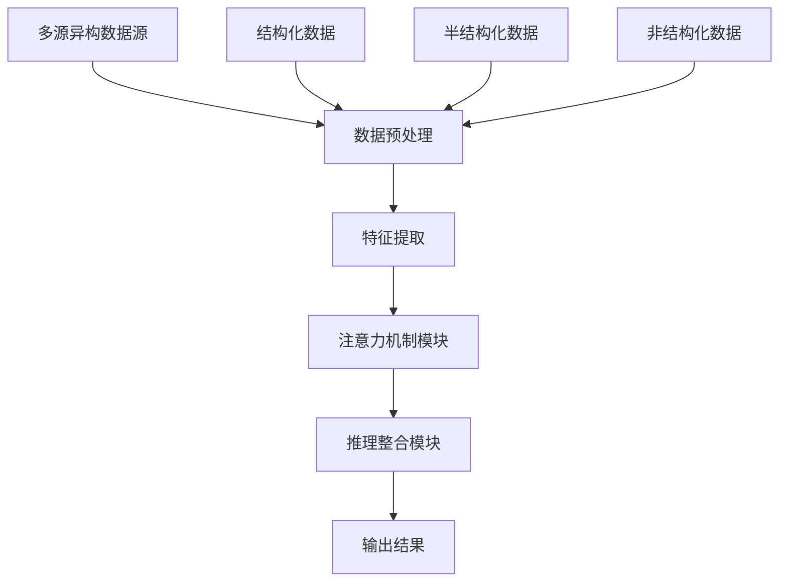

# 基于注意力机制的多源异构数据推理整合

> 关键词：注意力机制、多源异构数据、数据推理、数据整合、深度学习

> 摘要：本文聚焦于基于注意力机制的多源异构数据推理整合技术。随着信息技术的飞速发展，多源异构数据大量涌现，如何有效地对这些数据进行推理和整合成为关键问题。注意力机制能够自动地关注数据中的重要部分，为多源异构数据的处理提供了有力手段。文章首先介绍了相关背景，包括目的、预期读者等内容；接着阐述了核心概念与联系，给出了原理和架构的示意图及流程图；详细讲解了核心算法原理和具体操作步骤，并使用 Python 代码进行了说明；对数学模型和公式进行了推导和举例；通过项目实战展示了代码实现和分析；探讨了实际应用场景；推荐了相关的工具和资源；最后总结了未来发展趋势与挑战，并提供了常见问题解答和扩展阅读参考资料。

## 1. 背景介绍 
### 1.1 目的和范围
在当今数字化时代，数据呈现出多源异构的特点。多源意味着数据来自不同的数据源，如传感器网络、社交媒体、数据库等；异构则表示数据的类型、格式、语义等存在差异，包括结构化数据（如关系数据库中的表格数据）、半结构化数据（如 XML、JSON 格式的数据）和非结构化数据（如文本、图像、音频等）。

基于注意力机制的多源异构数据推理整合的目的在于，通过融合来自不同数据源的异构数据，挖掘数据之间的潜在关系，实现更准确、更全面的数据分析和决策支持。具体范围涵盖了从数据的预处理、特征提取，到使用注意力机制进行推理和整合的全过程，以及相关技术在各个领域的应用。

### 1.2 预期读者
本文的预期读者包括计算机科学、数据科学、人工智能等领域的研究人员和开发者，他们对多源异构数据处理和注意力机制感兴趣，希望深入了解相关技术的原理和实现方法。同时，也适合企业中从事数据分析、决策支持等工作的专业人士，他们可以借鉴本文的方法解决实际业务中的数据处理问题。

### 1.3 文档结构概述
本文将按照以下结构进行组织：
- 核心概念与联系：介绍注意力机制、多源异构数据等核心概念，以及它们之间的联系，并给出相应的示意图和流程图。
- 核心算法原理 & 具体操作步骤：详细讲解基于注意力机制的多源异构数据推理整合的算法原理，并使用 Python 代码进行实现。
- 数学模型和公式 & 详细讲解 & 举例说明：推导相关的数学模型和公式，并通过具体例子进行说明。
- 项目实战：代码实际案例和详细解释说明：通过一个实际项目展示如何使用注意力机制进行多源异构数据的推理和整合，包括开发环境搭建、源代码实现和代码解读。
- 实际应用场景：探讨基于注意力机制的多源异构数据推理整合技术在不同领域的实际应用场景。
- 工具和资源推荐：推荐相关的学习资源、开发工具框架和论文著作。
- 总结：未来发展趋势与挑战：总结该技术的未来发展趋势和面临的挑战。
- 附录：常见问题与解答：提供常见问题的解答。
- 扩展阅读 & 参考资料：列出扩展阅读的相关资料和参考文献。

### 1.4 术语表
#### 1.4.1 核心术语定义
- **注意力机制（Attention Mechanism）**：是一种模拟人类注意力的机制，它能够根据输入的信息自动地分配注意力权重，使得模型能够更加关注重要的信息。
- **多源异构数据（Multi - source Heterogeneous Data）**：指来自不同数据源，具有不同类型、格式和语义的数据。
- **数据推理（Data Reasoning）**：根据已有的数据信息，通过一定的逻辑规则和算法，推导出新的知识或结论的过程。
- **数据整合（Data Integration）**：将来自不同数据源的异构数据进行合并、转换和统一，以形成一个一致的数据集的过程。

#### 1.4.2 相关概念解释
- **深度学习（Deep Learning）**：是一类基于人工神经网络的机器学习方法，通过构建多层神经网络来自动学习数据的特征和模式。注意力机制是深度学习中的一种重要技术。
- **特征提取（Feature Extraction）**：从原始数据中提取出能够代表数据特征的信息，以便后续的分析和处理。在多源异构数据处理中，不同类型的数据需要采用不同的特征提取方法。

#### 1.4.3 缩略词列表
- **DNN（Deep Neural Network）**：深度神经网络
- **RNN（Recurrent Neural Network）**：循环神经网络
- **LSTM（Long Short - Term Memory）**：长短期记忆网络
- **GRU（Gated Recurrent Unit）**：门控循环单元
- **CNN（Convolutional Neural Network）**：卷积神经网络

## 2. 核心概念与联系 
### 核心概念原理
#### 注意力机制原理
注意力机制的核心思想是通过计算输入信息的注意力权重，来确定每个信息的重要程度。在深度学习中，注意力机制通常可以分为软注意力（Soft Attention）和硬注意力（Hard Attention）。

软注意力机制会为每个输入信息分配一个连续的注意力权重，这些权重之和为 1。以序列数据为例，设输入序列为 $\mathbf{X} = [\mathbf{x}_1, \mathbf{x}_2, \cdots, \mathbf{x}_T]$，其中 $\mathbf{x}_t$ 是第 $t$ 个时间步的输入向量。注意力机制首先通过一个打分函数 $e_{t}$ 计算每个输入向量的得分：

$$e_{t} = f(\mathbf{x}_t, \mathbf{h})$$

其中 $\mathbf{h}$ 是上下文向量，$f$ 是打分函数，常见的打分函数有内积、拼接等。然后，通过 softmax 函数将得分转换为注意力权重：

$$\alpha_{t} = \frac{\exp(e_{t})}{\sum_{i = 1}^{T}\exp(e_{i})}$$

最后，通过加权求和得到上下文向量 $\mathbf{c}$：

$$\mathbf{c} = \sum_{t = 1}^{T}\alpha_{t}\mathbf{x}_t$$

硬注意力机制则是从输入信息中选择一个或几个信息进行关注，选择过程是离散的。

#### 多源异构数据原理
多源异构数据由于其来源和类型的不同，具有不同的特征和语义。例如，结构化数据通常以表格形式存储，具有明确的字段和数据类型；非结构化数据如文本、图像等则需要通过特定的方法进行处理和特征提取。在进行数据推理和整合时，需要考虑不同数据源之间的兼容性和互补性。

### 架构的文本示意图
```plaintext
多源异构数据源
|-- 数据源 1（结构化数据）
|   |-- 数据预处理（清洗、转换）
|   |-- 特征提取（如数值特征提取）
|-- 数据源 2（半结构化数据）
|   |-- 数据预处理（解析、标准化）
|   |-- 特征提取（如标签特征提取）
|-- 数据源 3（非结构化数据）
|   |-- 数据预处理（分词、图像预处理）
|   |-- 特征提取（如文本词向量、图像特征向量）
|
|-- 注意力机制模块
|   |-- 计算注意力权重
|   |-- 加权求和
|
|-- 推理整合模块
|   |-- 模型训练（如深度学习模型）
|   |-- 推理预测
|
|-- 输出结果
```

### Mermaid 流程图


## 3. 核心算法原理 & 具体操作步骤 
### 算法原理
基于注意力机制的多源异构数据推理整合算法主要包括以下几个步骤：
1. **数据预处理**：对不同数据源的异构数据进行清洗、转换和标准化处理，以消除数据中的噪声和不一致性。
2. **特征提取**：根据数据的类型，采用不同的特征提取方法，将原始数据转换为特征向量。
3. **注意力机制计算**：计算每个数据源特征向量的注意力权重，以确定每个数据源的重要程度。
4. **数据整合**：根据注意力权重，对不同数据源的特征向量进行加权求和，得到整合后的特征向量。
5. **推理预测**：使用整合后的特征向量进行模型训练和推理预测。

### 具体操作步骤及 Python 代码实现
以下是一个简单的示例代码，假设我们有两个数据源，一个是结构化数据，另一个是文本数据。

```python
import numpy as np
from sklearn.preprocessing import StandardScaler
from sklearn.feature_extraction.text import TfidfVectorizer
import torch
import torch.nn as nn

# 数据预处理和特征提取
# 结构化数据
structured_data = np.array([[1, 2, 3], [4, 5, 6], [7, 8, 9]])
scaler = StandardScaler()
structured_features = scaler.fit_transform(structured_data)

# 文本数据
text_data = ["This is a sample sentence.", "Another sample sentence.", "One more sentence."]
vectorizer = TfidfVectorizer()
text_features = vectorizer.fit_transform(text_data).toarray()

# 注意力机制模块
class Attention(nn.Module):
    def __init__(self, input_size):
        super(Attention, self).__init__()
        self.linear = nn.Linear(input_size, 1)

    def forward(self, x):
        scores = self.linear(x)
        weights = torch.softmax(scores, dim=0)
        context = torch.sum(weights * x, dim=0)
        return context

# 整合特征
all_features = [torch.tensor(structured_features, dtype=torch.float32),
                torch.tensor(text_features, dtype=torch.float32)]
input_size = all_features[0].shape[1] + all_features[1].shape[1]
attention = Attention(input_size)

# 拼接特征
concatenated_features = torch.cat(all_features, dim=1)

# 计算注意力上下文
context = attention(concatenated_features)

print("整合后的特征向量:", context)
```

### 代码解释
1. **数据预处理和特征提取**：
    - 对于结构化数据，使用 `StandardScaler` 进行标准化处理。
    - 对于文本数据，使用 `TfidfVectorizer` 进行特征提取，将文本转换为 TF - IDF 特征向量。
2. **注意力机制模块**：
    - 定义了一个 `Attention` 类，继承自 `nn.Module`。
    - 在 `forward` 方法中，通过线性层计算得分，然后使用 softmax 函数计算注意力权重，最后进行加权求和得到上下文向量。
3. **整合特征**：
    - 将结构化数据和文本数据的特征向量拼接在一起。
    - 调用注意力机制模块计算整合后的特征向量。

## 4. 数学模型和公式 & 详细讲解 & 举例说明 
### 注意力机制数学模型
设我们有 $n$ 个数据源，第 $i$ 个数据源的特征向量为 $\mathbf{x}_i \in \mathbb{R}^{d_i}$，其中 $d_i$ 是第 $i$ 个数据源特征向量的维度。我们首先将所有特征向量拼接在一起，得到一个总的特征向量 $\mathbf{X} = [\mathbf{x}_1^T, \mathbf{x}_2^T, \cdots, \mathbf{x}_n^T]^T \in \mathbb{R}^{D}$，其中 $D=\sum_{i = 1}^{n}d_i$。

注意力机制的打分函数可以表示为：

$$e_i = \mathbf{w}^T \tanh(\mathbf{W}\mathbf{x}_i + \mathbf{b})$$

其中 $\mathbf{w} \in \mathbb{R}^{h}$，$\mathbf{W} \in \mathbb{R}^{h \times D}$，$\mathbf{b} \in \mathbb{R}^{h}$ 是可学习的参数，$h$ 是隐藏层的维度。

然后，通过 softmax 函数计算注意力权重：

$$\alpha_i = \frac{\exp(e_i)}{\sum_{j = 1}^{n}\exp(e_j)}$$

最后，得到整合后的特征向量 $\mathbf{c}$：

$$\mathbf{c} = \sum_{i = 1}^{n}\alpha_i\mathbf{x}_i$$

### 详细讲解
- **打分函数**：打分函数的作用是计算每个数据源特征向量的重要性得分。通过非线性变换 $\tanh$ 和线性变换，将特征向量映射到一个隐藏空间，然后与权重向量 $\mathbf{w}$ 进行内积得到得分。
- **注意力权重**：softmax 函数将得分转换为概率分布，使得所有注意力权重之和为 1。这样，每个数据源的特征向量都会根据其重要性得到相应的权重。
- **整合特征向量**：通过加权求和的方式，将不同数据源的特征向量整合为一个向量，这个向量综合了各个数据源的信息。

### 举例说明
假设我们有两个数据源，第一个数据源的特征向量为 $\mathbf{x}_1 = [1, 2]^T$，第二个数据源的特征向量为 $\mathbf{x}_2 = [3, 4]^T$。设 $\mathbf{W} = \begin{bmatrix}1 & 0 \\ 0 & 1\end{bmatrix}$，$\mathbf{b} = [0, 0]^T$，$\mathbf{w} = [1, 1]^T$。

首先计算得分：

$$\mathbf{W}\mathbf{x}_1+\mathbf{b}=\begin{bmatrix}1 & 0 \\ 0 & 1\end{bmatrix}\begin{bmatrix}1 \\ 2\end{bmatrix}+\begin{bmatrix}0 \\ 0\end{bmatrix}=\begin{bmatrix}1 \\ 2\end{bmatrix}$$

$$e_1=\mathbf{w}^T \tanh(\mathbf{W}\mathbf{x}_1 + \mathbf{b})=[1, 1]^T\begin{bmatrix}\tanh(1) \\ \tanh(2)\end{bmatrix}\approx 1\times0.7616 + 1\times0.9640 = 1.7256$$

同理，

$$\mathbf{W}\mathbf{x}_2+\mathbf{b}=\begin{bmatrix}1 & 0 \\ 0 & 1\end{bmatrix}\begin{bmatrix}3 \\ 4\end{bmatrix}+\begin{bmatrix}0 \\ 0\end{bmatrix}=\begin{bmatrix}3 \\ 4\end{bmatrix}$$

$$e_2=\mathbf{w}^T \tanh(\mathbf{W}\mathbf{x}_2 + \mathbf{b})=[1, 1]^T\begin{bmatrix}\tanh(3) \\ \tanh(4)\end{bmatrix}\approx 1\times0.9951 + 1\times0.9993 = 1.9944$$

然后计算注意力权重：

$$\alpha_1=\frac{\exp(e_1)}{\exp(e_1)+\exp(e_2)}=\frac{\exp(1.7256)}{\exp(1.7256)+\exp(1.9944)}\approx 0.34$$

$$\alpha_2=\frac{\exp(e_2)}{\exp(e_1)+\exp(e_2)}=\frac{\exp(1.9944)}{\exp(1.7256)+\exp(1.9944)}\approx 0.66$$

最后得到整合后的特征向量：

$$\mathbf{c}=\alpha_1\mathbf{x}_1+\alpha_2\mathbf{x}_2 = 0.34\begin{bmatrix}1 \\ 2\end{bmatrix}+0.66\begin{bmatrix}3 \\ 4\end{bmatrix}=\begin{bmatrix}0.34\times1 + 0.66\times3 \\ 0.34\times2+0.66\times4\end{bmatrix}=\begin{bmatrix}2.32 \\ 3.32\end{bmatrix}$$

## 5. 项目实战：代码实际案例和详细解释说明 
### 5.1 开发环境搭建
#### 操作系统
可以选择 Windows、Linux 或 macOS 操作系统。这里以 Ubuntu 18.04 为例进行说明。

#### 编程语言和环境
- **Python**：建议使用 Python 3.7 及以上版本。可以通过以下命令安装 Python：
```bash
sudo apt update
sudo apt install python3 python3-pip
```
- **虚拟环境**：为了避免不同项目之间的依赖冲突，建议使用虚拟环境。可以使用 `virtualenv` 或 `conda` 来创建虚拟环境。以下是使用 `virtualenv` 的示例：
```bash
pip3 install virtualenv
virtualenv -p python3 myenv
source myenv/bin/activate
```

#### 依赖库安装
在虚拟环境中安装所需的依赖库：
```bash
pip install numpy scikit-learn torch torchvision
```

### 5.2 源代码详细实现和代码解读
以下是一个更完整的项目实战代码示例，假设我们要对图像数据和文本数据进行推理整合，以预测图像和文本的关联类别。

```python
import torch
import torch.nn as nn
import torch.optim as optim
from torchvision import datasets, transforms
from sklearn.feature_extraction.text import TfidfVectorizer
import numpy as np

# 图像数据预处理
transform = transforms.Compose([
    transforms.ToTensor(),
    transforms.Normalize((0.5,), (0.5,))
])

# 加载图像数据集
train_dataset = datasets.MNIST(root='./data', train=True,
                               download=True, transform=transform)
train_loader = torch.utils.data.DataLoader(train_dataset, batch_size=64, shuffle=True)

# 模拟文本数据
text_data = ["This is a digit", "Another digit sample", "Yet another digit"]
vectorizer = TfidfVectorizer()
text_features = vectorizer.fit_transform(text_data).toarray()
text_features = torch.tensor(text_features, dtype=torch.float32)

# 定义图像特征提取模型
class ImageFeatureExtractor(nn.Module):
    def __init__(self):
        super(ImageFeatureExtractor, self).__init__()
        self.conv1 = nn.Conv2d(1, 10, kernel_size=5)
        self.conv2 = nn.Conv2d(10, 20, kernel_size=5)
        self.fc1 = nn.Linear(320, 50)

    def forward(self, x):
        x = nn.functional.relu(nn.functional.max_pool2d(self.conv1(x), 2))
        x = nn.functional.relu(nn.functional.max_pool2d(self.conv2(x), 2))
        x = x.view(-1, 320)
        x = nn.functional.relu(self.fc1(x))
        return x

# 定义注意力机制模块
class Attention(nn.Module):
    def __init__(self, input_size):
        super(Attention, self).__init__()
        self.linear = nn.Linear(input_size, 1)

    def forward(self, x):
        scores = self.linear(x)
        weights = torch.softmax(scores, dim=0)
        context = torch.sum(weights * x, dim=0)
        return context

# 定义整合模型
class IntegrationModel(nn.Module):
    def __init__(self, image_feature_size, text_feature_size):
        super(IntegrationModel, self).__init__()
        self.image_extractor = ImageFeatureExtractor()
        self.attention = Attention(image_feature_size + text_feature_size)
        self.fc = nn.Linear(image_feature_size + text_feature_size, 10)

    def forward(self, image, text):
        image_features = self.image_extractor(image)
        combined_features = torch.cat([image_features, text.repeat(image_features.size(0), 1)], dim=1)
        context = self.attention(combined_features)
        output = self.fc(context)
        return output

# 初始化模型、损失函数和优化器
image_feature_size = 50
text_feature_size = text_features.size(1)
model = IntegrationModel(image_feature_size, text_feature_size)
criterion = nn.CrossEntropyLoss()
optimizer = optim.SGD(model.parameters(), lr=0.01, momentum=0.5)

# 训练模型
for epoch in range(10):
    running_loss = 0.0
    for i, (images, labels) in enumerate(train_loader):
        optimizer.zero_grad()
        outputs = model(images, text_features)
        loss = criterion(outputs, labels)
        loss.backward()
        optimizer.step()
        running_loss += loss.item()
    print(f'Epoch {epoch + 1}, Loss: {running_loss / len(train_loader)}')
```

### 5.3 代码解读与分析
#### 图像数据预处理
使用 `torchvision.transforms` 对图像数据进行预处理，包括转换为张量和归一化处理。

#### 加载图像数据集
使用 `torchvision.datasets.MNIST` 加载 MNIST 手写数字数据集，并使用 `torch.utils.data.DataLoader` 创建数据加载器。

#### 模拟文本数据
使用 `TfidfVectorizer` 对文本数据进行特征提取，将文本转换为 TF - IDF 特征向量。

#### 图像特征提取模型
定义了一个简单的卷积神经网络 `ImageFeatureExtractor`，用于提取图像的特征。

#### 注意力机制模块
定义了 `Attention` 类，用于计算注意力权重和整合特征。

#### 整合模型
定义了 `IntegrationModel` 类，将图像特征提取、注意力机制和分类器组合在一起。

#### 训练模型
使用交叉熵损失函数和随机梯度下降优化器进行模型训练，训练过程中不断更新模型的参数。

## 6. 实际应用场景 
### 医疗领域
在医疗领域，多源异构数据包括患者的病历信息（结构化数据）、医学影像（非结构化数据）、基因测序数据等。基于注意力机制的多源异构数据推理整合可以帮助医生更准确地诊断疾病。例如，通过整合患者的病历信息和医学影像，模型可以关注到影像中与疾病相关的关键特征，同时结合病历中的症状描述和病史，提高诊断的准确性。

### 金融领域
金融领域的多源异构数据包括市场交易数据（结构化数据）、新闻资讯（文本数据）、社交媒体情绪数据等。通过注意力机制对这些数据进行推理整合，可以预测股票价格走势、评估信用风险等。例如，在预测股票价格时，模型可以根据新闻资讯和社交媒体情绪数据的重要性分配注意力权重，结合市场交易数据进行更准确的预测。

### 交通领域
在交通领域，多源异构数据包括车辆传感器数据（结构化数据）、交通摄像头图像（非结构化数据）、地图信息等。基于注意力机制的多源异构数据推理整合可以实现智能交通管理，如交通流量预测、交通事故预警等。例如，通过整合车辆传感器数据和交通摄像头图像，模型可以关注到道路上的异常情况，提前发出交通事故预警。

### 工业制造领域
工业制造领域的多源异构数据包括设备运行数据（结构化数据）、生产工艺文件（文本数据）、工业视频监控数据等。通过对这些数据的推理整合，可以实现设备故障预测、生产质量控制等。例如，通过注意力机制关注设备运行数据中的关键参数和工业视频监控中的异常现象，提前预测设备故障，减少停机时间。

## 7. 工具和资源推荐
### 7.1 学习资源推荐
#### 7.1.1 书籍推荐
- 《深度学习》（Deep Learning）：由 Ian Goodfellow、Yoshua Bengio 和 Aaron Courville 所著，是深度学习领域的经典教材，涵盖了深度学习的基本原理、算法和应用。
- 《Python 深度学习》（Deep Learning with Python）：由 Francois Chollet 所著，以 Python 和 Keras 为工具，介绍了深度学习的实践方法。
- 《数据挖掘：概念与技术》（Data Mining: Concepts and Techniques）：由 Jiawei Han、Jian Pei 和 Micheline Kamber 所著，介绍了数据挖掘的基本概念、算法和应用，对多源异构数据处理有一定的指导作用。

#### 7.1.2 在线课程
- Coursera 上的 “深度学习专项课程”（Deep Learning Specialization）：由 Andrew Ng 教授授课，包括神经网络和深度学习、改善深层神经网络、结构化机器学习项目等多个课程，全面介绍了深度学习的理论和实践。
- edX 上的 “数据科学原理”（Principles of Data Science）：介绍了数据科学的基本概念、方法和工具，包括数据预处理、特征提取、机器学习等内容。
- 哔哩哔哩上有许多关于深度学习和注意力机制的教学视频，可以根据自己的需求选择学习。

#### 7.1.3 技术博客和网站
- Medium：上面有很多关于深度学习、人工智能的技术文章，作者来自不同的领域，可以从中获取最新的研究成果和实践经验。
- arXiv：是一个预印本平台，提供了大量的学术论文，包括注意力机制、多源异构数据处理等方面的研究。
- 机器之心：专注于人工智能领域的技术资讯和深度报道，提供了很多有价值的技术文章和案例分析。

### 7.2 开发工具框架推荐
#### 7.2.1 IDE和编辑器
- PyCharm：是一款专业的 Python 集成开发环境，提供了代码编辑、调试、版本控制等功能，适合开发大型的 Python 项目。
- Jupyter Notebook：是一个交互式的开发环境，可以将代码、文本、图像等内容整合在一起，方便进行数据分析和模型训练。
- Visual Studio Code：是一款轻量级的代码编辑器，支持多种编程语言，具有丰富的插件生态系统，可以方便地进行 Python 开发。

#### 7.2.2 调试和性能分析工具
- PyTorch Profiler：是 PyTorch 提供的性能分析工具，可以帮助开发者分析模型的运行时间、内存使用等情况，优化模型性能。
- TensorBoard：是 TensorFlow 提供的可视化工具，也可以与 PyTorch 结合使用，用于可视化模型的训练过程、损失曲线等信息。
- cProfile：是 Python 内置的性能分析工具，可以分析 Python 代码的运行时间和函数调用情况。

#### 7.2.3 相关框架和库
- PyTorch：是一个开源的深度学习框架，提供了丰富的神经网络层和优化器，支持 GPU 加速，易于使用和扩展。
- TensorFlow：是另一个广泛使用的深度学习框架，具有强大的分布式训练能力和可视化工具。
- Scikit - learn：是一个用于机器学习的 Python 库，提供了多种机器学习算法和工具，如数据预处理、特征提取、模型评估等。

### 7.3 相关论文著作推荐
#### 7.3.1 经典论文
- “Attention Is All You Need”：提出了 Transformer 模型，引入了自注意力机制，在自然语言处理领域取得了巨大的成功。
- “Neural Machine Translation by Jointly Learning to Align and Translate”：首次将注意力机制应用于神经机器翻译任务，为后续的研究奠定了基础。

#### 7.3.2 最新研究成果
可以通过 arXiv、ACM Digital Library、IEEE Xplore 等学术平台搜索关于基于注意力机制的多源异构数据推理整合的最新研究成果。

#### 7.3.3 应用案例分析
一些顶级会议如 KDD（Knowledge Discovery and Data Mining）、ICDM（International Conference on Data Mining）等会发表关于多源异构数据处理的应用案例，可以从中学习到实际应用中的经验和方法。

## 8. 总结：未来发展趋势与挑战
### 未来发展趋势
#### 跨领域融合
基于注意力机制的多源异构数据推理整合技术将在更多的领域得到应用，并且不同领域之间的融合会更加深入。例如，医疗与金融领域的融合，通过整合患者的医疗数据和金融数据，可以为患者提供更个性化的保险方案。

#### 与新兴技术结合
该技术将与区块链、物联网、边缘计算等新兴技术相结合。例如，物联网产生的大量多源异构数据可以通过边缘计算进行初步处理，然后使用注意力机制进行推理整合，最后将结果存储在区块链上，保证数据的安全性和可追溯性。

#### 模型的可解释性增强
随着深度学习模型的复杂度不断增加，模型的可解释性变得越来越重要。未来的研究将致力于提高基于注意力机制的多源异构数据推理整合模型的可解释性，使得模型的决策过程更加透明，便于用户理解和信任。

### 挑战
#### 数据隐私和安全
多源异构数据涉及到大量的敏感信息，如个人隐私、商业机密等。在数据推理和整合过程中，如何保证数据的隐私和安全是一个重要的挑战。需要采用加密技术、访问控制等手段来保护数据的安全。

#### 数据质量和一致性
多源异构数据的质量和一致性往往较差，存在噪声、缺失值、重复数据等问题。如何对这些数据进行有效的预处理和清洗，提高数据的质量和一致性，是实现准确推理和整合的关键。

#### 计算资源和效率
基于注意力机制的深度学习模型通常需要大量的计算资源和时间进行训练和推理。在处理大规模多源异构数据时，如何提高计算效率，降低计算成本，是一个亟待解决的问题。

## 9. 附录：常见问题与解答
### 问题 1：注意力机制在多源异构数据处理中有什么优势？
注意力机制能够自动地关注数据中的重要部分，对于多源异构数据，不同数据源的重要性可能不同，注意力机制可以根据数据的特征自动分配注意力权重，从而更有效地整合不同数据源的信息，提高推理的准确性。

### 问题 2：如何处理不同数据源特征向量维度不一致的问题？
可以采用以下方法处理维度不一致的问题：
- **特征降维**：使用主成分分析（PCA）、线性判别分析（LDA）等方法对高维特征向量进行降维。
- **特征填充**：对于低维特征向量，可以通过填充零向量等方式使其维度与高维特征向量一致。
- **使用不同的注意力机制**：针对不同维度的特征向量，设计不同的注意力机制进行处理。

### 问题 3：注意力机制的计算复杂度高吗？
注意力机制的计算复杂度与输入数据的规模和特征向量的维度有关。一般来说，传统的注意力机制的计算复杂度较高，尤其是在处理大规模数据时。为了降低计算复杂度，可以采用一些优化方法，如稀疏注意力机制、局部注意力机制等。

### 问题 4：如何评估基于注意力机制的多源异构数据推理整合模型的性能？
可以使用以下指标评估模型的性能：
- **准确率（Accuracy）**：预测正确的样本数占总样本数的比例。
- **精确率（Precision）**：预测为正类的样本中实际为正类的比例。
- **召回率（Recall）**：实际为正类的样本中被预测为正类的比例。
- **F1 值**：精确率和召回率的调和平均值。
- **均方误差（MSE）**：用于回归任务，衡量预测值与真实值之间的平均误差。

## 10. 扩展阅读 & 参考资料
### 扩展阅读
- 《人工智能：现代方法》（Artificial Intelligence: A Modern Approach）：全面介绍了人工智能的基本概念、算法和应用，对理解多源异构数据推理整合的相关技术有帮助。
- 《自然语言处理入门》（Natural Language Processing Primer）：介绍了自然语言处理的基本方法和技术，包括文本特征提取、注意力机制在自然语言处理中的应用等。

### 参考资料
- Goodfellow, I., Bengio, Y., & Courville, A. (2016). Deep Learning. MIT Press.
- Chollet, F. (2017). Deep Learning with Python. Manning Publications.
- Han, J., Pei, J., & Kamber, M. (2011). Data Mining: Concepts and Techniques. Elsevier.
- Vaswani, A., Shazeer, N., Parmar, N., Uszkoreit, J., Jones, L., Gomez, A. N.,... & Polosukhin, I. (2017). Attention is all you need. In Advances in neural information processing systems (pp. 5998 - 6008).
- Bahdanau, D., Cho, K., & Bengio, Y. (2014). Neural machine translation by jointly learning to align and translate. arXiv preprint arXiv:1409.0473.

作者：AI天才研究院/AI Genius Institute & 禅与计算机程序设计艺术 /Zen And The Art of Computer Programming