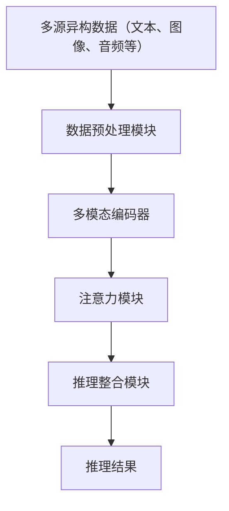

# 基于注意力机制的多源异构数据推理整合技术

> 关键词：注意力机制、多源异构数据、数据推理、数据整合、深度学习

> 摘要：本文聚焦于基于注意力机制的多源异构数据推理整合技术。多源异构数据在当今信息时代广泛存在，如何有效整合并进行推理是一个关键问题。注意力机制能够帮助模型聚焦于数据中的重要部分，提高推理和整合的效率与准确性。文章详细介绍了该技术的背景、核心概念、算法原理、数学模型，通过项目实战展示了其具体应用，探讨了实际应用场景，推荐了相关的工具和资源，最后总结了未来发展趋势与挑战，并提供了常见问题解答和扩展阅读参考资料。

## 1. 背景介绍 
### 1.1 目的和范围
在当今数字化的时代，数据来源广泛且具有异构性，例如文本、图像、音频、视频等不同类型的数据，以及来自不同系统、不同平台的数据。这些多源异构数据蕴含着丰富的信息，但由于其格式、结构和语义的差异，难以直接进行有效的分析和利用。基于注意力机制的多源异构数据推理整合技术旨在解决这一问题，通过引入注意力机制，使模型能够自动关注数据中的关键信息，实现对多源异构数据的高效推理和整合，从而挖掘出更有价值的信息。

本文的范围涵盖了该技术的核心概念、算法原理、数学模型、项目实战、实际应用场景以及相关的工具和资源推荐等方面，旨在为读者提供一个全面、深入的了解。

### 1.2 预期读者
本文的预期读者包括计算机科学、人工智能、数据科学等领域的研究人员、工程师和学生。对于对多源异构数据处理、注意力机制感兴趣的技术爱好者，本文也具有一定的参考价值。

### 1.3 文档结构概述
本文共分为十个部分。第一部分为背景介绍，阐述了技术的目的和范围、预期读者以及文档结构概述。第二部分介绍核心概念与联系，包括注意力机制、多源异构数据等核心概念的原理和架构，并提供文本示意图和 Mermaid 流程图。第三部分讲解核心算法原理及具体操作步骤，使用 Python 源代码详细阐述。第四部分介绍数学模型和公式，并进行详细讲解和举例说明。第五部分通过项目实战展示代码实际案例，并进行详细解释说明。第六部分探讨实际应用场景。第七部分推荐相关的工具和资源，包括学习资源、开发工具框架和相关论文著作。第八部分总结未来发展趋势与挑战。第九部分为附录，提供常见问题与解答。第十部分列出扩展阅读和参考资料。

### 1.4 术语表
#### 1.4.1 核心术语定义
- **注意力机制**：一种模仿人类注意力的机制，能够使模型在处理数据时自动关注重要部分，忽略不重要部分。
- **多源异构数据**：来自不同数据源、具有不同格式、结构和语义的数据。
- **数据推理**：根据已知数据和规则，推断出未知信息的过程。
- **数据整合**：将来自不同数据源的数据进行合并、清洗和转换，使其成为一个统一的、可用的数据集合的过程。

#### 1.4.2 相关概念解释
- **深度学习**：一种基于人工神经网络的机器学习方法，能够自动从大量数据中学习特征和模式。
- **神经网络**：由大量神经元组成的计算模型，能够模拟人类神经系统的工作方式。

#### 1.4.3 缩略词列表
- **CNN**：Convolutional Neural Network，卷积神经网络
- **RNN**：Recurrent Neural Network，循环神经网络
- **LSTM**：Long Short-Term Memory，长短期记忆网络
- **Transformer**：一种基于注意力机制的深度学习模型

## 2. 核心概念与联系 
### 2.1 注意力机制原理
注意力机制的核心思想是模仿人类的注意力系统，在处理大量信息时，能够自动聚焦于重要的部分，忽略不重要的部分。在深度学习中，注意力机制通常通过计算输入数据的注意力权重来实现。具体来说，给定输入序列 $X = [x_1, x_2, \cdots, x_n]$，注意力机制会为每个输入元素 $x_i$ 计算一个注意力权重 $\alpha_i$，然后根据这些权重对输入元素进行加权求和，得到一个加权表示 $c$：

$$c = \sum_{i=1}^{n} \alpha_i x_i$$

其中，注意力权重 $\alpha_i$ 通常通过一个注意力函数计算得到，常见的注意力函数有点积注意力、缩放点积注意力等。

### 2.2 多源异构数据
多源异构数据是指来自不同数据源、具有不同格式、结构和语义的数据。例如，文本数据通常是由字符序列组成，图像数据是由像素矩阵组成，音频数据是由声音信号序列组成。这些数据的异构性给数据的处理和分析带来了很大的挑战。

### 2.3 基于注意力机制的多源异构数据推理整合架构
基于注意力机制的多源异构数据推理整合架构通常包括以下几个部分：
1. **数据预处理模块**：对多源异构数据进行清洗、转换和特征提取，将其转换为适合模型处理的格式。
2. **多模态编码器**：对不同类型的数据进行编码，将其转换为低维向量表示。
3. **注意力模块**：计算不同模态数据之间的注意力权重，实现对重要信息的聚焦。
4. **推理整合模块**：根据注意力权重对不同模态的数据进行加权求和，得到整合后的表示，并进行推理和预测。

### 2.4 文本示意图
```plaintext
多源异构数据（文本、图像、音频等）
        |
        v
    数据预处理模块
        |
        v
    多模态编码器
        |
        v
    注意力模块
        |
        v
    推理整合模块
        |
        v
    推理结果
```

### 2.5 Mermaid 流程图


## 3. 核心算法原理 & 具体操作步骤 
### 3.1 注意力机制算法原理
这里以缩放点积注意力为例，介绍注意力机制的算法原理。缩放点积注意力的计算公式如下：

$$Attention(Q, K, V) = softmax(\frac{QK^T}{\sqrt{d_k}})V$$

其中，$Q$ 是查询矩阵，$K$ 是键矩阵，$V$ 是值矩阵，$d_k$ 是键的维度。具体步骤如下：
1. 计算查询矩阵 $Q$ 和键矩阵 $K$ 的转置的点积 $QK^T$。
2. 将点积结果除以 $\sqrt{d_k}$，进行缩放操作。
3. 对缩放后的结果应用 softmax 函数，得到注意力权重矩阵。
4. 将注意力权重矩阵与值矩阵 $V$ 相乘，得到注意力输出。

### 3.2 Python 代码实现
```python
import torch
import torch.nn.functional as F

def scaled_dot_product_attention(Q, K, V, mask=None):
    d_k = Q.size(-1)
    scores = torch.matmul(Q, K.transpose(-2, -1)) / torch.sqrt(torch.tensor(d_k, dtype=torch.float32))
    
    if mask is not None:
        scores = scores.masked_fill(mask == 0, -1e9)
    
    attention_weights = F.softmax(scores, dim=-1)
    output = torch.matmul(attention_weights, V)
    
    return output, attention_weights
```

### 3.3 基于注意力机制的多源异构数据推理整合具体操作步骤
1. **数据预处理**：
    - 对于文本数据，进行分词、词嵌入等操作。
    - 对于图像数据，进行图像缩放、归一化等操作。
    - 对于音频数据，进行特征提取、归一化等操作。
2. **多模态编码**：
    - 使用不同的编码器对不同类型的数据进行编码，例如使用 CNN 对图像数据进行编码，使用 RNN 或 Transformer 对文本数据进行编码。
3. **注意力计算**：
    - 将不同模态的编码结果作为输入，计算它们之间的注意力权重。
4. **推理整合**：
    - 根据注意力权重对不同模态的编码结果进行加权求和，得到整合后的表示。
    - 使用整合后的表示进行推理和预测。

## 4. 数学模型和公式 & 详细讲解 & 举例说明 
### 4.1 注意力机制数学模型
如前面所述，缩放点积注意力的数学模型为：

$$Attention(Q, K, V) = softmax(\frac{QK^T}{\sqrt{d_k}})V$$

其中，$Q \in \mathbb{R}^{n \times d_k}$，$K \in \mathbb{R}^{m \times d_k}$，$V \in \mathbb{R}^{m \times d_v}$，$n$ 是查询的数量，$m$ 是键和值的数量，$d_k$ 是键的维度，$d_v$ 是值的维度。

### 4.2 详细讲解
- **点积操作**：$QK^T$ 计算了查询和键之间的相似度，相似度越高，对应的注意力权重越大。
- **缩放操作**：除以 $\sqrt{d_k}$ 是为了防止点积结果过大，导致 softmax 函数的梯度消失。
- **softmax 函数**：将缩放后的点积结果转换为概率分布，即注意力权重。
- **加权求和**：将注意力权重与值矩阵相乘，得到注意力输出。

### 4.3 举例说明
假设我们有以下输入：
- 查询矩阵 $Q = \begin{bmatrix} 1 & 2 \\ 3 & 4 \end{bmatrix}$
- 键矩阵 $K = \begin{bmatrix} 5 & 6 \\ 7 & 8 \end{bmatrix}$
- 值矩阵 $V = \begin{bmatrix} 9 & 10 \\ 11 & 12 \end{bmatrix}$
- 键的维度 $d_k = 2$

首先计算点积 $QK^T$：

$$QK^T = \begin{bmatrix} 1 & 2 \\ 3 & 4 \end{bmatrix} \begin{bmatrix} 5 & 7 \\ 6 & 8 \end{bmatrix} = \begin{bmatrix} 1\times5 + 2\times6 & 1\times7 + 2\times8 \\ 3\times5 + 4\times6 & 3\times7 + 4\times8 \end{bmatrix} = \begin{bmatrix} 17 & 23 \\ 39 & 53 \end{bmatrix}$$

然后进行缩放操作：

$$\frac{QK^T}{\sqrt{d_k}} = \frac{1}{\sqrt{2}} \begin{bmatrix} 17 & 23 \\ 39 & 53 \end{bmatrix} \approx \begin{bmatrix} 12.02 & 16.26 \\ 27.58 & 37.43 \end{bmatrix}$$

接着应用 softmax 函数：

$$softmax(\frac{QK^T}{\sqrt{d_k}}) = \begin{bmatrix} \frac{e^{12.02}}{e^{12.02} + e^{27.58}} & \frac{e^{16.26}}{e^{16.26} + e^{37.43}} \\ \frac{e^{27.58}}{e^{12.02} + e^{27.58}} & \frac{e^{37.43}}{e^{16.26} + e^{37.43}} \end{bmatrix} \approx \begin{bmatrix} 0 & 0 \\ 1 & 1 \end{bmatrix}$$

最后计算注意力输出：

$$Attention(Q, K, V) = softmax(\frac{QK^T}{\sqrt{d_k}})V = \begin{bmatrix} 0 & 0 \\ 1 & 1 \end{bmatrix} \begin{bmatrix} 9 & 10 \\ 11 & 12 \end{bmatrix} = \begin{bmatrix} 0 & 0 \\ 20 & 22 \end{bmatrix}$$

## 5. 项目实战：代码实际案例和详细解释说明 
### 5.1 开发环境搭建
- **操作系统**：Windows、Linux 或 macOS
- **编程语言**：Python 3.7 及以上
- **深度学习框架**：PyTorch 1.7 及以上
- **其他库**：NumPy、Pandas、Scikit-learn 等

可以使用以下命令安装所需的库：

```bash
pip install torch numpy pandas scikit-learn
```

### 5.2 源代码详细实现和代码解读
下面是一个基于注意力机制的多源异构数据推理整合的简单示例，假设我们有文本数据和图像数据，我们将使用 Transformer 模型对文本数据进行编码，使用 CNN 模型对图像数据进行编码，然后使用注意力机制对两种数据进行整合和推理。

```python
import torch
import torch.nn as nn
import torch.nn.functional as F

# 文本编码器（Transformer）
class TextEncoder(nn.Module):
    def __init__(self, vocab_size, embedding_dim, hidden_dim, num_layers):
        super(TextEncoder, self).__init__()
        self.embedding = nn.Embedding(vocab_size, embedding_dim)
        self.transformer_encoder = nn.TransformerEncoder(
            nn.TransformerEncoderLayer(embedding_dim, nhead=4),
            num_layers=num_layers
        )
    
    def forward(self, text):
        embedded = self.embedding(text)
        encoded = self.transformer_encoder(embedded)
        return encoded

# 图像编码器（CNN）
class ImageEncoder(nn.Module):
    def __init__(self, in_channels, hidden_dim):
        super(ImageEncoder, self).__init__()
        self.conv1 = nn.Conv2d(in_channels, 64, kernel_size=3, padding=1)
        self.conv2 = nn.Conv2d(64, 128, kernel_size=3, padding=1)
        self.fc = nn.Linear(128 * 8 * 8, hidden_dim)
    
    def forward(self, image):
        x = F.relu(self.conv1(image))
        x = F.max_pool2d(x, 2)
        x = F.relu(self.conv2(x))
        x = F.max_pool2d(x, 2)
        x = x.view(x.size(0), -1)
        encoded = self.fc(x)
        return encoded

# 注意力模块
class AttentionModule(nn.Module):
    def __init__(self, hidden_dim):
        super(AttentionModule, self).__init__()
        self.W_q = nn.Linear(hidden_dim, hidden_dim)
        self.W_k = nn.Linear(hidden_dim, hidden_dim)
        self.W_v = nn.Linear(hidden_dim, hidden_dim)
    
    def forward(self, text_encoded, image_encoded):
        Q = self.W_q(text_encoded)
        K = self.W_k(image_encoded)
        V = self.W_v(image_encoded)
        
        scores = torch.matmul(Q, K.transpose(-2, -1))
        attention_weights = F.softmax(scores, dim=-1)
        output = torch.matmul(attention_weights, V)
        
        return output

# 推理整合模块
class InferenceModule(nn.Module):
    def __init__(self, hidden_dim, num_classes):
        super(InferenceModule, self).__init__()
        self.fc1 = nn.Linear(hidden_dim, 128)
        self.fc2 = nn.Linear(128, num_classes)
    
    def forward(self, integrated):
        x = F.relu(self.fc1(integrated))
        output = self.fc2(x)
        return output

# 整体模型
class MultiModalModel(nn.Module):
    def __init__(self, vocab_size, embedding_dim, hidden_dim, num_layers, in_channels, num_classes):
        super(MultiModalModel, self).__init__()
        self.text_encoder = TextEncoder(vocab_size, embedding_dim, hidden_dim, num_layers)
        self.image_encoder = ImageEncoder(in_channels, hidden_dim)
        self.attention_module = AttentionModule(hidden_dim)
        self.inference_module = InferenceModule(hidden_dim, num_classes)
    
    def forward(self, text, image):
        text_encoded = self.text_encoder(text)
        image_encoded = self.image_encoder(image)
        
        integrated = self.attention_module(text_encoded, image_encoded)
        output = self.inference_module(integrated)
        
        return output

# 示例使用
vocab_size = 1000
embedding_dim = 128
hidden_dim = 256
num_layers = 2
in_channels = 3
num_classes = 10

model = MultiModalModel(vocab_size, embedding_dim, hidden_dim, num_layers, in_channels, num_classes)

text_input = torch.randint(0, vocab_size, (1, 10))
image_input = torch.randn(1, in_channels, 32, 32)

output = model(text_input, image_input)
print(output.shape)
```

### 5.3 代码解读与分析
- **TextEncoder**：使用 Transformer 对文本数据进行编码，将输入的文本转换为低维向量表示。
- **ImageEncoder**：使用 CNN 对图像数据进行编码，将输入的图像转换为低维向量表示。
- **AttentionModule**：计算文本编码和图像编码之间的注意力权重，并根据权重对图像编码进行加权求和，得到整合后的表示。
- **InferenceModule**：使用全连接层对整合后的表示进行推理和预测。
- **MultiModalModel**：将文本编码器、图像编码器、注意力模块和推理整合模块组合在一起，形成一个完整的多模态模型。

## 6. 实际应用场景 
### 6.1 智能医疗
在智能医疗领域，多源异构数据包括患者的病历文本、医学影像（如 X 光、CT 等）、生命体征数据（如心率、血压等）。基于注意力机制的多源异构数据推理整合技术可以将这些不同类型的数据进行整合，辅助医生进行疾病诊断和治疗方案制定。例如，通过对病历文本中的症状描述和医学影像中的病变特征进行综合分析，提高疾病诊断的准确性。

### 6.2 智能交通
在智能交通领域，多源异构数据包括交通摄像头的图像和视频、传感器采集的交通流量数据、车辆的 GPS 定位数据等。该技术可以对这些数据进行整合和推理，实现交通流量预测、交通事故预警等功能。例如，通过分析交通摄像头的图像和交通流量数据，预测特定路段的拥堵情况，为驾驶员提供最佳的行驶路线。

### 6.3 金融风控
在金融风控领域，多源异构数据包括客户的信用报告文本、交易记录、社交网络数据等。基于注意力机制的多源异构数据推理整合技术可以对这些数据进行综合分析，评估客户的信用风险。例如，通过分析客户的交易记录和社交网络数据，发现潜在的欺诈行为，提高金融机构的风控能力。

### 6.4 智能教育
在智能教育领域，多源异构数据包括学生的学习记录文本、在线学习视频、考试成绩等。该技术可以对这些数据进行整合和分析，了解学生的学习状态和需求，为学生提供个性化的学习建议和辅导。例如，通过分析学生的学习记录和在线学习视频，发现学生的薄弱知识点，为学生推荐针对性的学习资源。

## 7. 工具和资源推荐
### 7.1 学习资源推荐
#### 7.1.1 书籍推荐
- 《深度学习》（Deep Learning）：由 Ian Goodfellow、Yoshua Bengio 和 Aaron Courville 所著，是深度学习领域的经典教材，涵盖了深度学习的基本概念、算法和应用。
- 《动手学深度学习》（Dive into Deep Learning）：由 Aston Zhang、Zachary C. Lipton、Mu Li 和 Alexander J. Smola 所著，提供了丰富的代码示例和实践项目，适合初学者学习。
- 《自然语言处理入门》（Natural Language Processing with Python）：由 Steven Bird、Ewan Klein 和 Edward Loper 所著，介绍了自然语言处理的基本技术和方法。

#### 7.1.2 在线课程
- Coursera 上的“深度学习专项课程”（Deep Learning Specialization）：由 Andrew Ng 教授授课，涵盖了深度学习的各个方面，包括神经网络、卷积神经网络、循环神经网络等。
- edX 上的“人工智能导论”（Introduction to Artificial Intelligence）：由 MIT 教授授课，介绍了人工智能的基本概念、算法和应用。
- 哔哩哔哩上的“李宏毅机器学习课程”：由台湾大学李宏毅教授授课，课程内容生动有趣，适合初学者学习。

#### 7.1.3 技术博客和网站
- Medium：一个技术博客平台，上面有很多关于深度学习、人工智能的优秀文章。
- arXiv：一个预印本服务器，提供了大量的学术论文，涵盖了计算机科学、数学、物理学等多个领域。
- Kaggle：一个数据科学竞赛平台，上面有很多关于数据挖掘、机器学习的数据集和代码示例。

### 7.2 开发工具框架推荐
#### 7.2.1 IDE和编辑器
- PyCharm：一款专业的 Python 集成开发环境，提供了丰富的代码编辑、调试和分析功能。
- Jupyter Notebook：一个交互式的笔记本环境，适合进行数据分析和模型训练。
- Visual Studio Code：一款轻量级的代码编辑器，支持多种编程语言，并且有丰富的插件扩展。

#### 7.2.2 调试和性能分析工具
- PyTorch Profiler：PyTorch 自带的性能分析工具，可以帮助用户分析模型的性能瓶颈。
- TensorBoard：一个可视化工具，可以帮助用户可视化模型的训练过程和性能指标。
- cProfile：Python 自带的性能分析工具，可以帮助用户分析代码的性能瓶颈。

#### 7.2.3 相关框架和库
- PyTorch：一个开源的深度学习框架，提供了丰富的神经网络层和优化算法，易于使用和扩展。
- TensorFlow：一个广泛使用的深度学习框架，提供了分布式训练和部署的支持。
- Scikit-learn：一个开源的机器学习库，提供了丰富的机器学习算法和工具，适合进行数据预处理和模型评估。

### 7.3 相关论文著作推荐
#### 7.3.1 经典论文
- “Attention Is All You Need”：介绍了 Transformer 模型，提出了基于注意力机制的序列到序列模型。
- “Neural Machine Translation by Jointly Learning to Align and Translate”：提出了基于注意力机制的神经机器翻译模型。
- “Show, Attend and Tell: Neural Image Caption Generation with Visual Attention”：提出了基于注意力机制的图像描述生成模型。

#### 7.3.2 最新研究成果
- 关注 arXiv 上的最新论文，特别是关于多源异构数据处理、注意力机制的研究。
- 参加相关的学术会议，如 NeurIPS、ICML、CVPR 等，了解最新的研究动态。

#### 7.3.3 应用案例分析
- 查看 Kaggle 上的相关竞赛和解决方案，了解基于注意力机制的多源异构数据推理整合技术在实际应用中的案例。
- 阅读相关的技术博客和论文，了解该技术在不同领域的应用案例。

## 8. 总结：未来发展趋势与挑战
### 8.1 未来发展趋势
- **多模态融合的深度和广度不断拓展**：未来，基于注意力机制的多源异构数据推理整合技术将不仅仅局限于文本、图像和音频等常见模态，还将涉及更多的模态，如触觉、嗅觉等，实现更加全面和深入的多模态融合。
- **与其他技术的融合**：该技术将与强化学习、迁移学习、元学习等其他机器学习技术相结合，提高模型的学习能力和泛化能力。
- **应用领域的不断扩大**：随着技术的不断发展，该技术将在更多的领域得到应用，如智能家居、智能农业、智能工业等，为各个领域的发展带来新的机遇。

### 8.2 挑战
- **数据处理和融合的难度**：多源异构数据的格式、结构和语义差异很大，数据处理和融合的难度较高。如何有效地对多源异构数据进行清洗、转换和特征提取，是一个亟待解决的问题。
- **注意力机制的可解释性**：注意力机制虽然能够提高模型的性能，但它的可解释性较差。如何理解注意力机制的决策过程，是一个重要的研究方向。
- **计算资源的需求**：基于注意力机制的多源异构数据推理整合模型通常比较复杂，计算资源的需求较高。如何在有限的计算资源下提高模型的训练和推理效率，是一个需要解决的问题。

## 9. 附录：常见问题与解答
### 9.1 什么是注意力机制？
注意力机制是一种模仿人类注意力的机制，能够使模型在处理数据时自动关注重要部分，忽略不重要部分。在深度学习中，注意力机制通常通过计算输入数据的注意力权重来实现。

### 9.2 多源异构数据有哪些特点？
多源异构数据具有以下特点：
- **来源不同**：来自不同的数据源，如传感器、数据库、网络等。
- **格式不同**：具有不同的格式，如文本、图像、音频、视频等。
- **结构不同**：具有不同的结构，如表格、树状结构、图结构等。
- **语义不同**：具有不同的语义，如不同的领域、不同的主题等。

### 9.3 如何选择合适的编码器对多源异构数据进行编码？
选择合适的编码器需要考虑以下因素：
- **数据类型**：不同类型的数据需要使用不同的编码器，如文本数据可以使用 RNN 或 Transformer 进行编码，图像数据可以使用 CNN 进行编码。
- **数据特点**：数据的特点也会影响编码器的选择，如数据的长度、复杂度等。
- **任务需求**：不同的任务对编码器的要求也不同，如分类任务和生成任务对编码器的要求可能不同。

### 9.4 注意力机制在多源异构数据推理整合中有什么作用？
注意力机制在多源异构数据推理整合中具有以下作用：
- **聚焦重要信息**：能够使模型自动关注不同模态数据中的重要部分，忽略不重要部分，提高推理和整合的效率和准确性。
- **融合多模态信息**：通过计算不同模态数据之间的注意力权重，实现对多模态信息的有效融合。
- **提高模型的泛化能力**：能够帮助模型更好地理解不同模态数据之间的关系，提高模型的泛化能力。

## 10. 扩展阅读 & 参考资料
- Vaswani, A., Shazeer, N., Parmar, N., Uszkoreit, J., Jones, L., Gomez, A. N.,... & Polosukhin, I. (2017). Attention is all you need. Advances in neural information processing systems, 5998-6008.
- Bahdanau, D., Cho, K., & Bengio, Y. (2014). Neural machine translation by jointly learning to align and translate. arXiv preprint arXiv:1409.0473.
- Xu, K., Ba, J., Kiros, R., Cho, K., Courville, A., Salakhudinov, R.,... & Bengio, Y. (2015). Show, attend and tell: Neural image caption generation with visual attention. arXiv preprint arXiv:1502.03044.

作者：AI天才研究院/AI Genius Institute & 禅与计算机程序设计艺术 /Zen And The Art of Computer Programming