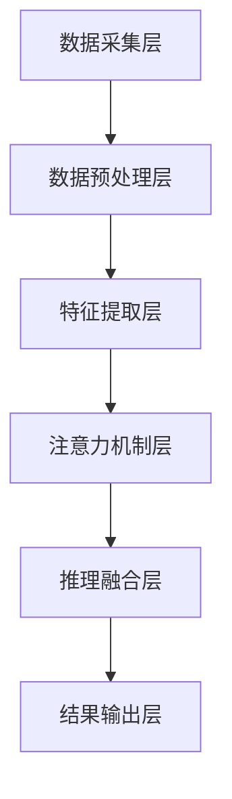

# 基于注意力机制的多源异构数据推理融合技术

> 关键词：注意力机制、多源异构数据、推理融合、数据处理、深度学习

> 摘要：本文聚焦于基于注意力机制的多源异构数据推理融合技术，深入探讨该技术的核心概念、算法原理、数学模型等内容。多源异构数据在现实场景中广泛存在，如何高效地对其进行推理融合是当前研究的重点。注意力机制能够自适应地聚焦于数据中的关键信息，为多源异构数据的处理提供了有效手段。通过理论分析与项目实战相结合，详细阐述该技术的实现过程和应用场景，旨在为相关领域的研究和实践提供全面且深入的参考。

## 1. 背景介绍 
### 1.1 目的和范围
在当今数字化时代，数据呈现出爆炸式增长的态势，并且来源广泛、类型多样，即多源异构数据。这些数据蕴含着丰富的信息，但由于其复杂性，直接利用存在诸多困难。基于注意力机制的多源异构数据推理融合技术的目的在于解决多源异构数据的有效整合和利用问题，挖掘数据背后的潜在价值。本技术的范围涵盖了从数据的预处理、特征提取到推理融合的整个过程，涉及计算机科学、信息科学、统计学等多个领域。

### 1.2 预期读者
本文预期读者包括从事数据处理、机器学习、人工智能等领域的研究人员和开发人员，以及对多源异构数据处理感兴趣的学生和专业人士。对于希望深入了解基于注意力机制的多源异构数据推理融合技术的原理、实现和应用的人群，本文将提供有价值的参考。

### 1.3 文档结构概述
本文首先介绍相关的背景知识，包括目的、预期读者和文档结构。接着阐述核心概念与联系，通过文本示意图和 Mermaid 流程图展示技术的基本架构。然后详细讲解核心算法原理和具体操作步骤，结合 Python 源代码进行说明。之后介绍数学模型和公式，并举例说明。再通过项目实战，展示代码实际案例和详细解释。随后探讨实际应用场景，推荐相关的工具和资源。最后总结未来发展趋势与挑战，提供常见问题与解答以及扩展阅读和参考资料。

### 1.4 术语表
#### 1.4.1 核心术语定义
- **多源异构数据**：指来自不同数据源（如传感器、数据库、网络等），具有不同的数据格式（如文本、图像、音频、视频等）、语义和结构的数据。
- **注意力机制**：一种在处理数据时能够自适应地分配注意力权重的机制，使得模型能够聚焦于数据中的关键部分。
- **推理融合**：将多个数据源的信息进行整合和推理，以得到更全面、准确的结论或结果的过程。

#### 1.4.2 相关概念解释
- **特征提取**：从原始数据中提取出能够代表数据特征的信息，以便后续的处理和分析。
- **数据预处理**：对原始数据进行清洗、转换、归一化等操作，以提高数据的质量和可用性。
- **深度学习模型**：一类基于人工神经网络的机器学习模型，具有强大的特征学习和表达能力。

#### 1.4.3 缩略词列表
- **CNN**：Convolutional Neural Network，卷积神经网络
- **RNN**：Recurrent Neural Network，循环神经网络
- **LSTM**：Long Short - Term Memory，长短期记忆网络
- **Transformer**：一种基于注意力机制的深度学习模型架构

## 2. 核心概念与联系 

### 核心概念原理
多源异构数据推理融合技术的核心在于处理来自不同源头、不同类型的数据，并将其融合以获取更有价值的信息。注意力机制则是为了在处理多源异构数据时，能够自动地关注到数据中重要的部分，提高融合的效率和准确性。

在多源异构数据中，不同数据源的数据具有不同的特征和语义。例如，图像数据包含视觉信息，文本数据包含语义信息，音频数据包含声音信息等。为了将这些不同类型的数据进行融合，需要先对其进行特征提取，将不同格式的数据转换为统一的特征表示。

注意力机制的原理是通过计算数据中各个部分的重要性权重，然后根据这些权重对数据进行加权求和。在多源异构数据处理中，注意力机制可以帮助模型自适应地选择不同数据源中对当前任务最有用的信息。

### 架构的文本示意图
多源异构数据推理融合系统的基本架构可以分为以下几个部分：
1. **数据采集层**：负责从不同的数据源收集多源异构数据，包括传感器、数据库、网络等。
2. **数据预处理层**：对采集到的原始数据进行清洗、转换、归一化等操作，以提高数据的质量。
3. **特征提取层**：针对不同类型的数据，采用相应的特征提取方法，将数据转换为统一的特征表示。
4. **注意力机制层**：计算各个数据源和数据部分的注意力权重，突出关键信息。
5. **推理融合层**：将经过注意力加权的特征进行融合，并进行推理，得到最终的结果。
6. **结果输出层**：将推理融合的结果进行可视化或输出到相关的应用系统中。

### Mermaid 流程图


## 3. 核心算法原理 & 具体操作步骤 

### 注意力机制算法原理
注意力机制的核心思想是计算查询（query）、键（key）和值（value）之间的相关性，从而得到注意力权重。具体步骤如下：
1. **计算相关性分数**：给定查询 $q$ 和键 $k_i$，计算它们之间的相关性分数 $e_i$，常用的计算方法有点积、缩放点积等。以缩放点积为例，$e_i=\frac{q^Tk_i}{\sqrt{d_k}}$，其中 $d_k$ 是键的维度。
2. **计算注意力权重**：将相关性分数 $e_i$ 通过 softmax 函数进行归一化，得到注意力权重 $\alpha_i$，$\alpha_i=\frac{\exp(e_i)}{\sum_{j=1}^{n}\exp(e_j)}$，其中 $n$ 是键的数量。
3. **加权求和**：根据注意力权重 $\alpha_i$ 对值 $v_i$ 进行加权求和，得到注意力输出 $o=\sum_{i = 1}^{n}\alpha_iv_i$。

### Python 代码实现
```python
import torch
import torch.nn as nn
import torch.nn.functional as F

class Attention(nn.Module):
    def __init__(self, input_dim, hidden_dim):
        super(Attention, self).__init__()
        self.query = nn.Linear(input_dim, hidden_dim)
        self.key = nn.Linear(input_dim, hidden_dim)
        self.value = nn.Linear(input_dim, input_dim)

    def forward(self, x):
        q = self.query(x)
        k = self.key(x)
        v = self.value(x)

        # 计算相关性分数
        scores = torch.matmul(q, k.transpose(-2, -1)) / torch.sqrt(torch.tensor(q.size(-1)).float())

        # 计算注意力权重
        attention_weights = F.softmax(scores, dim=-1)

        # 加权求和
        output = torch.matmul(attention_weights, v)

        return output, attention_weights
```

### 多源异构数据推理融合具体操作步骤
1. **数据采集**：从不同的数据源收集多源异构数据。
2. **数据预处理**：
    - 清洗数据，去除噪声、缺失值等。
    - 对不同类型的数据进行转换，如文本数据进行分词、图像数据进行归一化等。
3. **特征提取**：
    - 对于文本数据，可以使用词嵌入、BERT 等方法提取特征。
    - 对于图像数据，可以使用 CNN 提取特征。
    - 对于音频数据，可以使用 MFCC 等方法提取特征。
4. **注意力机制应用**：将不同数据源的特征输入到注意力机制模块中，计算注意力权重并进行加权求和。
5. **推理融合**：将经过注意力加权的特征输入到融合模型中，如全连接层、RNN 等，进行推理融合，得到最终的结果。

## 4. 数学模型和公式 & 详细讲解 & 举例说明 

### 注意力机制数学模型
如前面所述，注意力机制的核心公式包括相关性分数计算、注意力权重计算和加权求和。

#### 相关性分数计算
$e_i=\frac{q^Tk_i}{\sqrt{d_k}}$，其中 $q$ 是查询向量，$k_i$ 是第 $i$ 个键向量，$d_k$ 是键向量的维度。这个公式通过点积计算查询和键之间的相似度，并进行缩放以防止梯度消失或爆炸。

#### 注意力权重计算
$\alpha_i=\frac{\exp(e_i)}{\sum_{j=1}^{n}\exp(e_j)}$，其中 $n$ 是键的数量。softmax 函数将相关性分数转换为概率分布，使得所有注意力权重之和为 1。

#### 加权求和
$o=\sum_{i = 1}^{n}\alpha_iv_i$，其中 $v_i$ 是第 $i$ 个值向量。通过加权求和，将值向量根据注意力权重进行组合，得到最终的注意力输出。

### 多源异构数据推理融合数学模型
假设我们有 $m$ 个数据源，第 $j$ 个数据源的特征表示为 $x_j\in\mathbb{R}^{d_j}$，经过注意力机制处理后得到加权特征 $\tilde{x}_j$。

将所有加权特征拼接起来，得到融合特征 $X=[\tilde{x}_1;\tilde{x}_2;\cdots;\tilde{x}_m]\in\mathbb{R}^{\sum_{j = 1}^{m}d_j}$。

然后将融合特征输入到融合模型 $f(X)$ 中，得到最终的推理结果 $y = f(X)$。

### 举例说明
假设我们有两个数据源，一个是文本数据，一个是图像数据。文本数据的特征维度为 $d_1 = 100$，图像数据的特征维度为 $d_2 = 200$。

首先，对文本数据和图像数据分别进行特征提取，得到特征向量 $x_1\in\mathbb{R}^{100}$ 和 $x_2\in\mathbb{R}^{200}$。

然后，将这两个特征向量输入到注意力机制模块中，计算注意力权重 $\alpha_1$ 和 $\alpha_2$。

经过加权求和后，得到加权特征 $\tilde{x}_1=\alpha_1x_1$ 和 $\tilde{x}_2=\alpha_2x_2$。

将 $\tilde{x}_1$ 和 $\tilde{x}_2$ 拼接起来，得到融合特征 $X=[\tilde{x}_1;\tilde{x}_2]\in\mathbb{R}^{300}$。

最后，将融合特征 $X$ 输入到一个全连接层 $y = WX + b$ 中，得到最终的推理结果 $y$，其中 $W\in\mathbb{R}^{1\times300}$ 是权重矩阵，$b\in\mathbb{R}$ 是偏置。

## 5. 项目实战：代码实际案例和详细解释说明 

### 5.1  开发环境搭建
1. **安装 Python**：建议使用 Python 3.7 及以上版本。
2. **安装深度学习框架**：本文使用 PyTorch 作为深度学习框架，可以通过以下命令安装：
```sh
pip install torch torchvision
```
3. **安装其他依赖库**：如 numpy、pandas 等，可以通过以下命令安装：
```sh
pip install numpy pandas
```

### 5.2  源代码详细实现和代码解读
以下是一个简单的基于注意力机制的多源异构数据推理融合的代码示例，假设我们有文本数据和图像数据。

```python
import torch
import torch.nn as nn
import torch.nn.functional as F

# 定义文本特征提取器
class TextFeatureExtractor(nn.Module):
    def __init__(self, input_dim, hidden_dim):
        super(TextFeatureExtractor, self).__init__()
        self.fc1 = nn.Linear(input_dim, hidden_dim)
        self.relu = nn.ReLU()

    def forward(self, x):
        x = self.fc1(x)
        x = self.relu(x)
        return x

# 定义图像特征提取器
class ImageFeatureExtractor(nn.Module):
    def __init__(self, input_dim, hidden_dim):
        super(ImageFeatureExtractor, self).__init__()
        self.fc1 = nn.Linear(input_dim, hidden_dim)
        self.relu = nn.ReLU()

    def forward(self, x):
        x = self.fc1(x)
        x = self.relu(x)
        return x

# 定义注意力机制模块
class Attention(nn.Module):
    def __init__(self, input_dim, hidden_dim):
        super(Attention, self).__init__()
        self.query = nn.Linear(input_dim, hidden_dim)
        self.key = nn.Linear(input_dim, hidden_dim)
        self.value = nn.Linear(input_dim, input_dim)

    def forward(self, x):
        q = self.query(x)
        k = self.key(x)
        v = self.value(x)

        scores = torch.matmul(q, k.transpose(-2, -1)) / torch.sqrt(torch.tensor(q.size(-1)).float())
        attention_weights = F.softmax(scores, dim=-1)
        output = torch.matmul(attention_weights, v)

        return output, attention_weights

# 定义推理融合模型
class FusionModel(nn.Module):
    def __init__(self, text_input_dim, image_input_dim, hidden_dim, output_dim):
        super(FusionModel, self).__init__()
        self.text_extractor = TextFeatureExtractor(text_input_dim, hidden_dim)
        self.image_extractor = ImageFeatureExtractor(image_input_dim, hidden_dim)
        self.attention = Attention(hidden_dim * 2, hidden_dim)
        self.fc = nn.Linear(hidden_dim * 2, output_dim)

    def forward(self, text_data, image_data):
        text_features = self.text_extractor(text_data)
        image_features = self.image_extractor(image_data)

        combined_features = torch.cat((text_features, image_features), dim=-1)
        attention_output, _ = self.attention(combined_features)

        output = self.fc(attention_output)
        return output

# 示例使用
text_input_dim = 100
image_input_dim = 200
hidden_dim = 50
output_dim = 10

model = FusionModel(text_input_dim, image_input_dim, hidden_dim, output_dim)

text_data = torch.randn(16, text_input_dim)
image_data = torch.randn(16, image_input_dim)

output = model(text_data, image_data)
print(output.shape)
```

### 5.3  代码解读与分析
1. **文本特征提取器**：`TextFeatureExtractor` 类通过一个全连接层和 ReLU 激活函数对文本数据进行特征提取。
2. **图像特征提取器**：`ImageFeatureExtractor` 类同样通过一个全连接层和 ReLU 激活函数对图像数据进行特征提取。
3. **注意力机制模块**：`Attention` 类实现了注意力机制的核心功能，包括相关性分数计算、注意力权重计算和加权求和。
4. **推理融合模型**：`FusionModel` 类将文本特征提取器、图像特征提取器和注意力机制模块组合在一起，将提取的特征进行拼接，经过注意力机制处理后，再通过一个全连接层得到最终的推理结果。

## 6. 实际应用场景 
### 智能医疗
在智能医疗领域，多源异构数据包括患者的病历文本、医学影像（如 X 光、CT 等）、生理信号（如心电图、血压等）。基于注意力机制的多源异构数据推理融合技术可以将这些不同类型的数据进行融合，辅助医生进行疾病诊断和治疗方案制定。例如，通过分析病历文本中的症状描述、医学影像中的病变特征和生理信号的异常情况，提高疾病诊断的准确性。

### 智能交通
在智能交通领域，多源异构数据包括交通摄像头的图像、车辆传感器的数据、地图信息等。利用该技术可以将这些数据进行融合，实现交通流量预测、交通事故预警等功能。例如，通过分析交通摄像头图像中的车辆密度、车辆传感器的数据（如速度、加速度等）和地图信息，准确预测交通流量的变化趋势。

### 金融风控
在金融风控领域，多源异构数据包括客户的交易记录、信用报告、社交媒体数据等。基于注意力机制的多源异构数据推理融合技术可以对这些数据进行融合分析，评估客户的信用风险和欺诈风险。例如，通过分析客户的交易记录中的异常行为、信用报告中的信用评分和社交媒体数据中的社交关系，提高风险评估的准确性。

## 7. 工具和资源推荐
### 7.1 学习资源推荐
#### 7.1.1 书籍推荐
- 《深度学习》（Deep Learning）：由 Ian Goodfellow、Yoshua Bengio 和 Aaron Courville 所著，是深度学习领域的经典教材，涵盖了深度学习的基本概念、算法和应用。
- 《Python 深度学习》（Deep Learning with Python）：由 Francois Chollet 所著，通过实际案例介绍了如何使用 Python 和 Keras 进行深度学习开发。
- 《动手学深度学习》（Dive into Deep Learning）：由 Aston Zhang、Zack C. Lipton、Mu Li 和 Alexander J. Smola 所著，提供了丰富的代码示例和详细的解释，适合初学者学习。

#### 7.1.2 在线课程
- Coursera 上的《深度学习专项课程》（Deep Learning Specialization）：由 Andrew Ng 教授授课，包括神经网络和深度学习、改善深层神经网络、结构化机器学习项目、卷积神经网络和序列模型等课程。
- edX 上的《使用 PyTorch 进行深度学习》（Introduction to Deep Learning with PyTorch）：介绍了如何使用 PyTorch 进行深度学习开发。
- 哔哩哔哩上的《李宏毅机器学习》：李宏毅教授的机器学习课程，生动有趣，易于理解。

#### 7.1.3 技术博客和网站
- Medium：一个技术博客平台，有很多关于深度学习、人工智能的优秀文章。
- arXiv：一个预印本平台，提供了大量的学术论文，涵盖了人工智能、机器学习等领域的最新研究成果。
- Kaggle：一个数据科学竞赛平台，有很多关于数据处理、机器学习的案例和代码分享。

### 7.2 开发工具框架推荐
#### 7.2.1 IDE和编辑器
- PyCharm：一款专门为 Python 开发设计的集成开发环境，提供了丰富的代码编辑、调试和项目管理功能。
- Jupyter Notebook：一个交互式的开发环境，适合进行数据分析和模型训练的实验和演示。
- Visual Studio Code：一款轻量级的代码编辑器，支持多种编程语言，有丰富的插件可以扩展功能。

#### 7.2.2 调试和性能分析工具
- PyTorch Profiler：PyTorch 自带的性能分析工具，可以帮助用户分析模型的运行时间、内存使用等情况。
- TensorBoard：一个可视化工具，可以用于可视化模型的训练过程、损失曲线、准确率等指标。
- cProfile：Python 标准库中的性能分析工具，可以分析 Python 代码的运行时间和函数调用情况。

#### 7.2.3 相关框架和库
- PyTorch：一个开源的深度学习框架，提供了丰富的神经网络模块和优化算法，易于使用和扩展。
- TensorFlow：另一个广泛使用的深度学习框架，具有强大的分布式训练和部署能力。
- Scikit - learn：一个机器学习库，提供了多种机器学习算法和工具，如分类、回归、聚类等。

### 7.3 相关论文著作推荐
#### 7.3.1 经典论文
- 《Attention Is All You Need》：介绍了 Transformer 模型，提出了基于注意力机制的序列处理方法，对自然语言处理和其他领域产生了深远影响。
- 《Deep Residual Learning for Image Recognition》：提出了残差网络（ResNet），解决了深度神经网络训练中的梯度消失问题，提高了模型的训练效率和性能。
- 《Long Short - Term Memory》：介绍了长短期记忆网络（LSTM），解决了循环神经网络中的长期依赖问题，在序列数据处理中得到了广泛应用。

#### 7.3.2 最新研究成果
- 关注顶级学术会议如 NeurIPS、ICML、CVPR、ACL 等的最新论文，了解基于注意力机制的多源异构数据推理融合技术的最新研究进展。
- 关注相关领域的知名期刊如 Journal of Artificial Intelligence Research、IEEE Transactions on Pattern Analysis and Machine Intelligence 等的最新文章。

#### 7.3.3 应用案例分析
- 可以在学术数据库如 IEEE Xplore、ACM Digital Library 等中搜索基于注意力机制的多源异构数据推理融合技术在不同领域的应用案例，学习其实现方法和应用效果。

## 8. 总结：未来发展趋势与挑战
### 未来发展趋势
1. **更强大的注意力机制**：未来可能会出现更复杂、更高效的注意力机制，能够更好地处理多源异构数据中的复杂关系和信息。
2. **跨领域融合**：基于注意力机制的多源异构数据推理融合技术将在更多领域得到应用，如工业互联网、智能家居等，实现不同领域数据的深度融合和协同。
3. **与其他技术的结合**：与区块链、物联网等技术相结合，提高数据的安全性和可靠性，拓展多源异构数据推理融合技术的应用场景。
4. **自动化和智能化**：实现多源异构数据处理的自动化和智能化，减少人工干预，提高处理效率和准确性。

### 挑战
1. **数据质量问题**：多源异构数据的质量参差不齐，存在噪声、缺失值等问题，如何有效地处理这些数据质量问题是一个挑战。
2. **计算资源需求**：基于注意力机制的深度学习模型通常需要大量的计算资源，如何在有限的计算资源下提高模型的训练和推理效率是一个挑战。
3. **数据隐私和安全**：多源异构数据包含大量的敏感信息，如何在数据融合过程中保护数据的隐私和安全是一个重要的问题。
4. **模型可解释性**：深度学习模型通常是黑盒模型，难以解释其决策过程和结果，如何提高基于注意力机制的多源异构数据推理融合模型的可解释性是一个挑战。

## 9. 附录：常见问题与解答
### 问题 1：如何选择合适的注意力机制？
解答：选择合适的注意力机制需要考虑数据的特点和任务的需求。如果数据具有序列结构，可以选择基于序列的注意力机制，如多头注意力机制；如果数据是图像或其他非序列数据，可以选择空间注意力机制或通道注意力机制。此外，还可以根据实验结果进行选择和调整。

### 问题 2：多源异构数据预处理的步骤有哪些？
解答：多源异构数据预处理的步骤包括数据清洗、数据转换、数据归一化等。数据清洗主要是去除噪声、缺失值等；数据转换是将不同类型的数据转换为统一的格式，如文本数据进行分词、图像数据进行缩放等；数据归一化是将数据的取值范围缩放到一定的区间，如 [0, 1] 或 [-1, 1]。

### 问题 3：如何评估基于注意力机制的多源异构数据推理融合模型的性能？
解答：可以使用多种指标来评估模型的性能，如准确率、召回率、F1 值、均方误差等。具体选择哪种指标取决于任务的类型，如分类任务可以使用准确率、召回率、F1 值等，回归任务可以使用均方误差等。此外，还可以进行交叉验证和可视化分析，以更全面地评估模型的性能。

## 10. 扩展阅读 & 参考资料
1. Goodfellow, I., Bengio, Y., & Courville, A. (2016). Deep Learning. MIT Press.
2. Chollet, F. (2017). Deep Learning with Python. Manning Publications.
3. Vaswani, A., Shazeer, N., Parmar, N., Uszkoreit, J., Jones, L., Gomez, A. N., ... & Polosukhin, I. (2017). Attention is all you need. Advances in neural information processing systems, 5998 - 6008.
4. He, K., Zhang, X., Ren, S., & Sun, J. (2016). Deep residual learning for image recognition. In Proceedings of the IEEE conference on computer vision and pattern recognition (pp. 770 - 778).
5. Hochreiter, S., & Schmidhuber, J. (1997). Long short - term memory. Neural computation, 9(8), 1735 - 1780.

作者：AI天才研究院/AI Genius Institute & 禅与计算机程序设计艺术 /Zen And The Art of Computer Programming