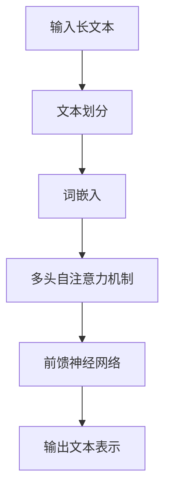

# 基于注意力机制的长文本理解在跨时代文献解析中的创新应用

> 关键词：注意力机制、长文本理解、跨时代文献解析、深度学习、自然语言处理

> 摘要：本文聚焦于基于注意力机制的长文本理解技术在跨时代文献解析中的创新应用。首先介绍了该研究的背景，包括目的、预期读者、文档结构和相关术语。接着阐述了核心概念与联系，详细说明了注意力机制和长文本理解的原理，并给出了架构示意图和Mermaid流程图。然后深入讲解了核心算法原理，通过Python源代码进行了详细阐述，同时给出了相关的数学模型和公式，并举例说明。在项目实战部分，提供了开发环境搭建步骤、源代码实现及解读。探讨了该技术在跨时代文献解析中的实际应用场景，推荐了学习资源、开发工具框架和相关论文著作。最后总结了未来发展趋势与挑战，提供了常见问题解答和扩展阅读参考资料。

## 1. 背景介绍 
### 1.1 目的和范围
在当今信息爆炸的时代，跨时代的文献资料数量庞大且内容复杂。这些文献包含了不同历史时期的知识、思想和文化，对于学术研究、文化传承和社会发展具有重要意义。然而，由于文献的篇幅较长、语言表达方式多样以及时代背景的差异，对其进行有效的理解和解析面临着巨大的挑战。

本研究的目的在于探索基于注意力机制的长文本理解技术在跨时代文献解析中的应用，旨在提高对长文本的理解效率和准确性，挖掘文献中的潜在信息和价值。具体范围包括但不限于历史、文学、哲学等领域的跨时代文献，通过构建合适的模型和算法，实现对这些文献的自动解析和知识提取。

### 1.2 预期读者
本文的预期读者主要包括自然语言处理领域的研究人员、工程师和开发者，他们对深度学习和注意力机制在文本处理中的应用感兴趣，希望了解如何将这些技术应用于跨时代文献解析。同时，也适合从事历史、文学等领域研究的学者，他们可以借助本文介绍的技术方法，更高效地处理和分析大量的跨时代文献资料。此外，对人工智能和计算机技术在文化领域应用感兴趣的普通读者也可以从本文中获得相关的知识和启发。

### 1.3 文档结构概述
本文将按照以下结构进行组织：
- 核心概念与联系：介绍注意力机制和长文本理解的基本概念，以及它们之间的联系，并给出相应的架构示意图和Mermaid流程图。
- 核心算法原理 & 具体操作步骤：详细讲解基于注意力机制的长文本理解算法原理，通过Python源代码进行具体实现和说明。
- 数学模型和公式 & 详细讲解 & 举例说明：给出相关的数学模型和公式，并通过具体例子进行详细解释。
- 项目实战：代码实际案例和详细解释说明，包括开发环境搭建、源代码实现和代码解读。
- 实际应用场景：探讨基于注意力机制的长文本理解技术在跨时代文献解析中的实际应用场景。
- 工具和资源推荐：推荐相关的学习资源、开发工具框架和论文著作。
- 总结：未来发展趋势与挑战：总结该技术的未来发展趋势和面临的挑战。
- 附录：常见问题与解答：提供常见问题的解答。
- 扩展阅读 & 参考资料：列出扩展阅读的相关资料和参考文献。

### 1.4 术语表
#### 1.4.1 核心术语定义
- **注意力机制（Attention Mechanism）**：是一种模仿人类注意力的机制，在处理序列数据时，能够自动地关注序列中的重要部分，从而提高模型的性能。
- **长文本理解（Long Text Understanding）**：指的是对较长篇幅的文本进行语义理解和信息提取的过程，需要处理文本中的复杂语义关系和长距离依赖。
- **跨时代文献解析（Cross - era Literature Analysis）**：对不同历史时期的文献进行分析和解读，挖掘其中的知识和信息，考虑到不同时代的语言、文化和背景差异。
- **深度学习（Deep Learning）**：是一类基于人工神经网络的机器学习方法，通过构建多层神经网络来学习数据的复杂特征和模式。
- **自然语言处理（Natural Language Processing, NLP）**：是研究如何让计算机理解和处理人类语言的学科，包括文本分类、情感分析、机器翻译等任务。

#### 1.4.2 相关概念解释
- **自注意力机制（Self - Attention Mechanism）**：是注意力机制的一种特殊形式，它在处理序列数据时，通过计算序列中不同位置之间的相关性，为每个位置分配不同的注意力权重，从而捕捉序列中的长距离依赖关系。
- **多头注意力机制（Multi - Head Attention Mechanism）**：将自注意力机制扩展到多个头，每个头可以学习不同的表示子空间，从而提高模型的表达能力。
- **Transformer模型**：是一种基于注意力机制的深度学习模型，它在自然语言处理任务中取得了很好的效果，主要由编码器和解码器组成，其中编码器使用多头自注意力机制来处理输入序列。

#### 1.4.3 缩略词列表
- **NLP**：Natural Language Processing（自然语言处理）
- **RNN**：Recurrent Neural Network（循环神经网络）
- **LSTM**：Long Short - Term Memory（长短期记忆网络）
- **GRU**：Gated Recurrent Unit（门控循环单元）
- **Transformer**：一种基于注意力机制的深度学习模型
- **BERT**：Bidirectional Encoder Representations from Transformers（基于Transformer的双向编码器表示）

## 2. 核心概念与联系 

### 注意力机制原理
注意力机制的核心思想是在处理序列数据时，根据当前的任务需求，自动地为序列中的不同元素分配不同的权重，从而突出重要的元素，忽略次要的元素。具体来说，给定一个输入序列 $\mathbf{X} = [\mathbf{x}_1, \mathbf{x}_2, \cdots, \mathbf{x}_n]$，其中 $\mathbf{x}_i$ 是第 $i$ 个元素的特征向量，注意力机制通过计算注意力权重 $\mathbf{\alpha} = [\alpha_1, \alpha_2, \cdots, \alpha_n]$，并对输入序列进行加权求和，得到注意力输出 $\mathbf{y}$：

$$\mathbf{y} = \sum_{i = 1}^{n} \alpha_i \mathbf{x}_i$$

其中，注意力权重 $\alpha_i$ 通常通过一个注意力函数计算得到，常见的注意力函数有点积注意力、缩放点积注意力等。以缩放点积注意力为例，其计算过程如下：

首先，将输入序列 $\mathbf{X}$ 分别通过三个线性变换得到查询向量 $\mathbf{Q}$、键向量 $\mathbf{K}$ 和值向量 $\mathbf{V}$：

$$\mathbf{Q} = \mathbf{X} \mathbf{W}_Q$$
$$\mathbf{K} = \mathbf{X} \mathbf{W}_K$$
$$\mathbf{V} = \mathbf{X} \mathbf{W}_V$$

其中，$\mathbf{W}_Q$、$\mathbf{W}_K$ 和 $\mathbf{W}_V$ 是可学习的权重矩阵。

然后，计算注意力分数 $\mathbf{S}$：

$$\mathbf{S} = \frac{\mathbf{Q} \mathbf{K}^T}{\sqrt{d_k}}$$

其中，$d_k$ 是键向量的维度，$\sqrt{d_k}$ 是缩放因子，用于防止点积结果过大。

接着，通过 softmax 函数将注意力分数转换为注意力权重 $\mathbf{\alpha}$：

$$\mathbf{\alpha} = \text{softmax}(\mathbf{S})$$

最后，计算注意力输出 $\mathbf{y}$：

$$\mathbf{y} = \mathbf{\alpha} \mathbf{V}$$

### 长文本理解原理
长文本理解的主要挑战在于处理文本中的复杂语义关系和长距离依赖。传统的基于循环神经网络（RNN）及其变体（如 LSTM 和 GRU）的方法在处理长文本时存在梯度消失和梯度爆炸的问题，难以捕捉长距离依赖关系。而基于注意力机制的方法，如 Transformer 模型，通过自注意力机制可以有效地捕捉文本中的长距离依赖关系，从而提高长文本理解的性能。

在长文本理解任务中，通常将输入的长文本划分为多个段落或句子，然后使用注意力机制对这些段落或句子进行加权求和，得到整个文本的表示。同时，还可以使用多头注意力机制来学习不同的表示子空间，进一步提高模型的表达能力。

### 核心概念架构的文本示意图
```plaintext
+----------------------+
|      输入长文本       |
+----------------------+
         |
         v
+----------------------+
|  文本划分（段落/句子） |
+----------------------+
         |
         v
+----------------------+
|  词嵌入（Word Embedding） |
+----------------------+
         |
         v
+----------------------+
|  多头自注意力机制（Multi - Head Self - Attention） |
+----------------------+
         |
         v
+----------------------+
|  前馈神经网络（Feed - Forward Network） |
+----------------------+
         |
         v
+----------------------+
|  输出文本表示       |
+----------------------+
```

### Mermaid 流程图


## 3. 核心算法原理 & 具体操作步骤 

### 核心算法原理
基于注意力机制的长文本理解算法主要基于 Transformer 模型。Transformer 模型由编码器和解码器组成，在长文本理解任务中，通常只使用编码器部分。编码器由多个相同的层堆叠而成，每层包含多头自注意力机制和前馈神经网络两个子层。

#### 多头自注意力机制
多头自注意力机制将自注意力机制扩展到多个头，每个头可以学习不同的表示子空间。具体来说，将查询向量 $\mathbf{Q}$、键向量 $\mathbf{K}$ 和值向量 $\mathbf{V}$ 分别划分为 $h$ 个不同的子向量，每个子向量对应一个头，然后分别计算每个头的注意力输出，最后将这些输出拼接起来并通过一个线性变换得到最终的注意力输出。

#### 前馈神经网络
前馈神经网络是一个两层的全连接神经网络，中间使用 ReLU 激活函数。其作用是对多头自注意力机制的输出进行非线性变换，进一步提取特征。

### 具体操作步骤
#### 步骤 1：文本预处理
将输入的长文本进行分词、去除停用词等预处理操作，并将其转换为词向量序列。

#### 步骤 2：词嵌入
使用预训练的词向量模型（如 Word2Vec、GloVe 等）将分词后的文本转换为词向量表示。

#### 步骤 3：位置编码
为了让模型能够捕捉文本中的位置信息，需要对词向量进行位置编码。常见的位置编码方法是使用正弦和余弦函数。

#### 步骤 4：编码器层计算
将位置编码后的词向量输入到编码器层中，依次计算多头自注意力机制和前馈神经网络的输出。

#### 步骤 5：堆叠编码器层
重复步骤 4，将多个编码器层堆叠起来，得到最终的文本表示。

### Python 源代码实现
```python
import torch
import torch.nn as nn
import torch.nn.functional as F

# 缩放点积注意力
def scaled_dot_product_attention(Q, K, V, mask=None):
    d_k = Q.size(-1)
    scores = torch.matmul(Q, K.transpose(-2, -1)) / torch.sqrt(torch.tensor(d_k, dtype=torch.float32))
    if mask is not None:
        scores = scores.masked_fill(mask == 0, -1e9)
    attention_weights = F.softmax(scores, dim=-1)
    output = torch.matmul(attention_weights, V)
    return output, attention_weights

# 多头注意力机制
class MultiHeadAttention(nn.Module):
    def __init__(self, d_model, num_heads):
        super(MultiHeadAttention, self).__init__()
        assert d_model % num_heads == 0, "d_model must be divisible by num_heads"

        self.d_model = d_model
        self.num_heads = num_heads
        self.d_k = d_model // num_heads

        self.W_q = nn.Linear(d_model, d_model)
        self.W_k = nn.Linear(d_model, d_model)
        self.W_v = nn.Linear(d_model, d_model)
        self.W_o = nn.Linear(d_model, d_model)

    def split_heads(self, x):
        batch_size, seq_length, d_model = x.size()
        return x.view(batch_size, seq_length, self.num_heads, self.d_k).transpose(1, 2)

    def forward(self, Q, K, V, mask=None):
        Q = self.split_heads(self.W_q(Q))
        K = self.split_heads(self.W_k(K))
        V = self.split_heads(self.W_v(V))

        output, attention_weights = scaled_dot_product_attention(Q, K, V, mask)
        output = output.transpose(1, 2).contiguous().view(output.size(0), -1, self.d_model)
        output = self.W_o(output)
        return output, attention_weights

# 前馈神经网络
class PositionwiseFeedForward(nn.Module):
    def __init__(self, d_model, d_ff):
        super(PositionwiseFeedForward, self).__init__()
        self.fc1 = nn.Linear(d_model, d_ff)
        self.fc2 = nn.Linear(d_ff, d_model)
        self.relu = nn.ReLU()

    def forward(self, x):
        return self.fc2(self.relu(self.fc1(x)))

# 编码器层
class EncoderLayer(nn.Module):
    def __init__(self, d_model, num_heads, d_ff, dropout):
        super(EncoderLayer, self).__init__()
        self.self_attn = MultiHeadAttention(d_model, num_heads)
        self.feed_forward = PositionwiseFeedForward(d_model, d_ff)
        self.norm1 = nn.LayerNorm(d_model)
        self.norm2 = nn.LayerNorm(d_model)
        self.dropout = nn.Dropout(dropout)

    def forward(self, x, mask):
        attn_output, _ = self.self_attn(x, x, x, mask)
        x = self.norm1(x + self.dropout(attn_output))
        ff_output = self.feed_forward(x)
        x = self.norm2(x + self.dropout(ff_output))
        return x

# 编码器
class Encoder(nn.Module):
    def __init__(self, num_layers, d_model, num_heads, d_ff, input_vocab_size, maximum_position_encoding, dropout):
        super(Encoder, self).__init__()
        self.d_model = d_model
        self.embedding = nn.Embedding(input_vocab_size, d_model)
        self.pos_encoding = self.positional_encoding(maximum_position_encoding, self.d_model)
        self.layers = nn.ModuleList([EncoderLayer(d_model, num_heads, d_ff, dropout) for _ in range(num_layers)])
        self.dropout = nn.Dropout(dropout)

    def positional_encoding(self, position, d_model):
        angle_rads = self.get_angles(torch.arange(position)[:, None],
                                     torch.arange(d_model)[None, :],
                                     d_model)
        # apply sin to even indices in the array; 2i
        sines = torch.sin(angle_rads[:, 0::2])
        # apply cos to odd indices in the array; 2i+1
        cosines = torch.cos(angle_rads[:, 1::2])

        pos_encoding = torch.cat([sines, cosines], dim=-1)
        pos_encoding = pos_encoding[None,...]
        return pos_encoding

    def get_angles(self, pos, i, d_model):
        angle_rates = 1 / torch.pow(10000, (2 * (i // 2)) / torch.tensor(d_model, dtype=torch.float32))
        return pos * angle_rates

    def forward(self, x, mask):
        seq_length = x.size(1)
        x = self.embedding(x)
        x *= torch.sqrt(torch.tensor(self.d_model, dtype=torch.float32))
        x += self.pos_encoding[:, :seq_length, :]
        x = self.dropout(x)

        for layer in self.layers:
            x = layer(x, mask)

        return x
```

## 4. 数学模型和公式 & 详细讲解 & 举例说明 

### 数学模型和公式
#### 多头自注意力机制
设输入序列为 $\mathbf{X} \in \mathbb{R}^{n \times d}$，其中 $n$ 是序列长度，$d$ 是输入向量的维度。查询向量 $\mathbf{Q}$、键向量 $\mathbf{K}$ 和值向量 $\mathbf{V}$ 分别通过线性变换得到：

$$\mathbf{Q} = \mathbf{X} \mathbf{W}_Q$$
$$\mathbf{K} = \mathbf{X} \mathbf{W}_K$$
$$\mathbf{V} = \mathbf{X} \mathbf{W}_V$$

其中，$\mathbf{W}_Q, \mathbf{W}_K, \mathbf{W}_V \in \mathbb{R}^{d \times d}$ 是可学习的权重矩阵。

将 $\mathbf{Q}$、$\mathbf{K}$ 和 $\mathbf{V}$ 分别划分为 $h$ 个不同的子向量：

$$\mathbf{Q}_i = \mathbf{Q}[:, :, i \cdot d_k : (i + 1) \cdot d_k]$$
$$\mathbf{K}_i = \mathbf{K}[:, :, i \cdot d_k : (i + 1) \cdot d_k]$$
$$\mathbf{V}_i = \mathbf{V}[:, :, i \cdot d_k : (i + 1) \cdot d_k]$$

其中，$d_k = \frac{d}{h}$ 是每个头的维度。

计算每个头的注意力输出：

$$\text{Attention}_i(\mathbf{Q}_i, \mathbf{K}_i, \mathbf{V}_i) = \text{softmax}\left(\frac{\mathbf{Q}_i \mathbf{K}_i^T}{\sqrt{d_k}}\right) \mathbf{V}_i$$

将所有头的注意力输出拼接起来：

$$\text{Concat}(\text{Attention}_1, \text{Attention}_2, \cdots, \text{Attention}_h)$$

最后通过一个线性变换得到最终的注意力输出：

$$\text{MultiHead}(\mathbf{Q}, \mathbf{K}, \mathbf{V}) = \text{Concat}(\text{Attention}_1, \text{Attention}_2, \cdots, \text{Attention}_h) \mathbf{W}_O$$

其中，$\mathbf{W}_O \in \mathbb{R}^{d \times d}$ 是可学习的权重矩阵。

#### 前馈神经网络
前馈神经网络的计算公式如下：

$$\text{FFN}(x) = \text{ReLU}(x \mathbf{W}_1 + \mathbf{b}_1) \mathbf{W}_2 + \mathbf{b}_2$$

其中，$\mathbf{W}_1 \in \mathbb{R}^{d \times d_{ff}}$，$\mathbf{W}_2 \in \mathbb{R}^{d_{ff} \times d}$ 是可学习的权重矩阵，$\mathbf{b}_1 \in \mathbb{R}^{d_{ff}}$，$\mathbf{b}_2 \in \mathbb{R}^{d}$ 是偏置向量，$d_{ff}$ 是前馈神经网络的隐藏层维度。

### 详细讲解
#### 多头自注意力机制
多头自注意力机制通过将输入的查询、键和值向量划分为多个头，每个头可以学习不同的表示子空间，从而提高模型的表达能力。具体来说，不同的头可以关注输入序列的不同部分，捕捉不同类型的语义信息。例如，一个头可能关注文本中的实体信息，另一个头可能关注文本中的语法结构信息。

#### 前馈神经网络
前馈神经网络是一个两层的全连接神经网络，中间使用 ReLU 激活函数。其作用是对多头自注意力机制的输出进行非线性变换，进一步提取特征。ReLU 激活函数的使用可以引入非线性，使得模型能够学习更复杂的函数。

### 举例说明
假设我们有一个输入序列 $\mathbf{X} = [\mathbf{x}_1, \mathbf{x}_2, \mathbf{x}_3]$，其中 $\mathbf{x}_i \in \mathbb{R}^8$，$i = 1, 2, 3$。我们使用 $h = 2$ 个头的多头自注意力机制，每个头的维度 $d_k = 4$。

首先，通过线性变换得到查询向量 $\mathbf{Q}$、键向量 $\mathbf{K}$ 和值向量 $\mathbf{V}$：

$$\mathbf{Q} = \mathbf{X} \mathbf{W}_Q$$
$$\mathbf{K} = \mathbf{X} \mathbf{W}_K$$
$$\mathbf{V} = \mathbf{X} \mathbf{W}_V$$

其中，$\mathbf{W}_Q, \mathbf{W}_K, \mathbf{W}_V \in \mathbb{R}^{8 \times 8}$。

然后，将 $\mathbf{Q}$、$\mathbf{K}$ 和 $\mathbf{V}$ 分别划分为两个子向量：

$$\mathbf{Q}_1 = \mathbf{Q}[:, :, 0:4]$$
$$\mathbf{Q}_2 = \mathbf{Q}[:, :, 4:8]$$
$$\mathbf{K}_1 = \mathbf{K}[:, :, 0:4]$$
$$\mathbf{K}_2 = \mathbf{K}[:, :, 4:8]$$
$$\mathbf{V}_1 = \mathbf{V}[:, :, 0:4]$$
$$\mathbf{V}_2 = \mathbf{V}[:, :, 4:8]$$

接着，计算每个头的注意力输出：

$$\text{Attention}_1(\mathbf{Q}_1, \mathbf{K}_1, \mathbf{V}_1) = \text{softmax}\left(\frac{\mathbf{Q}_1 \mathbf{K}_1^T}{\sqrt{4}}\right) \mathbf{V}_1$$
$$\text{Attention}_2(\mathbf{Q}_2, \mathbf{K}_2, \mathbf{V}_2) = \text{softmax}\left(\frac{\mathbf{Q}_2 \mathbf{K}_2^T}{\sqrt{4}}\right) \mathbf{V}_2$$

将两个头的注意力输出拼接起来：

$$\text{Concat}(\text{Attention}_1, \text{Attention}_2)$$

最后，通过一个线性变换得到最终的注意力输出：

$$\text{MultiHead}(\mathbf{Q}, \mathbf{K}, \mathbf{V}) = \text{Concat}(\text{Attention}_1, \text{Attention}_2) \mathbf{W}_O$$

其中，$\mathbf{W}_O \in \mathbb{R}^{8 \times 8}$。

## 5. 项目实战：代码实际案例和详细解释说明 

### 5.1  开发环境搭建
#### 安装 Python
首先，确保你已经安装了 Python 3.6 或更高版本。你可以从 Python 官方网站（https://www.python.org/downloads/）下载并安装 Python。

#### 创建虚拟环境
为了避免不同项目之间的依赖冲突，建议使用虚拟环境。可以使用 `venv` 模块创建虚拟环境：

```bash
python -m venv myenv
```

激活虚拟环境：

- 在 Windows 上：
```bash
myenv\Scripts\activate
```

- 在 Linux 或 macOS 上：
```bash
source myenv/bin/activate
```

#### 安装依赖库
在虚拟环境中安装所需的依赖库，包括 PyTorch、NumPy 等：

```bash
pip install torch numpy
```

### 5.2  源代码详细实现和代码解读
```python
import torch
import torch.nn as nn
import torch.optim as optim
from torch.utils.data import Dataset, DataLoader

# 自定义数据集类
class LongTextDataset(Dataset):
    def __init__(self, texts, labels):
        self.texts = texts
        self.labels = labels

    def __len__(self):
        return len(self.texts)

    def __getitem__(self, idx):
        text = torch.tensor(self.texts[idx], dtype=torch.long)
        label = torch.tensor(self.labels[idx], dtype=torch.long)
        return text, label

# 训练模型
def train_model(model, dataloader, criterion, optimizer, device, epochs):
    model.train()
    for epoch in range(epochs):
        running_loss = 0.0
        for texts, labels in dataloader:
            texts = texts.to(device)
            labels = labels.to(device)

            optimizer.zero_grad()
            outputs = model(texts)
            loss = criterion(outputs, labels)
            loss.backward()
            optimizer.step()

            running_loss += loss.item()

        print(f'Epoch {epoch + 1}/{epochs}, Loss: {running_loss / len(dataloader)}')

# 测试模型
def test_model(model, dataloader, device):
    model.eval()
    correct = 0
    total = 0
    with torch.no_grad():
        for texts, labels in dataloader:
            texts = texts.to(device)
            labels = labels.to(device)

            outputs = model(texts)
            _, predicted = torch.max(outputs.data, 1)
            total += labels.size(0)
            correct += (predicted == labels).sum().item()

    print(f'Accuracy: {100 * correct / total}%')

# 主函数
def main():
    # 示例数据
    texts = [[1, 2, 3, 4, 5], [6, 7, 8, 9, 10]]
    labels = [0, 1]

    # 创建数据集和数据加载器
    dataset = LongTextDataset(texts, labels)
    dataloader = DataLoader(dataset, batch_size=2, shuffle=True)

    # 初始化模型
    input_vocab_size = 11
    d_model = 16
    num_heads = 2
    d_ff = 32
    num_layers = 2
    maximum_position_encoding = 100
    dropout = 0.1
    model = Encoder(num_layers, d_model, num_heads, d_ff, input_vocab_size, maximum_position_encoding, dropout)

    # 定义损失函数和优化器
    criterion = nn.CrossEntropyLoss()
    optimizer = optim.Adam(model.parameters(), lr=0.001)

    # 设备选择
    device = torch.device("cuda" if torch.cuda.is_available() else "cpu")
    model.to(device)

    # 训练模型
    epochs = 10
    train_model(model, dataloader, criterion, optimizer, device, epochs)

    # 测试模型
    test_model(model, dataloader, device)

if __name__ == "__main__":
    main()
```

### 5.3  代码解读与分析
#### 自定义数据集类
`LongTextDataset` 类继承自 `torch.utils.data.Dataset`，用于封装数据集。`__init__` 方法初始化数据集的文本和标签，`__len__` 方法返回数据集的长度，`__getitem__` 方法根据索引返回对应的文本和标签。

#### 训练模型函数
`train_model` 函数用于训练模型。在每个 epoch 中，遍历数据加载器中的每个批次，将数据移动到指定设备上，计算模型的输出和损失，然后进行反向传播和参数更新。

#### 测试模型函数
`test_model` 函数用于测试模型。在测试过程中，不进行梯度计算，遍历数据加载器中的每个批次，计算模型的预测结果，并统计准确率。

#### 主函数
`main` 函数是程序的入口。首先创建示例数据和数据集、数据加载器，然后初始化模型、定义损失函数和优化器，选择设备并将模型移动到设备上，最后调用 `train_model` 函数进行训练，调用 `test_model` 函数进行测试。

## 6. 实际应用场景 
### 历史文献研究
在历史文献研究中，基于注意力机制的长文本理解技术可以帮助学者更高效地处理和分析大量的历史文献资料。例如，通过对古代史书、日记、信件等文献的解析，可以挖掘出历史事件的细节、人物关系和社会文化背景等信息。同时，该技术还可以帮助学者发现文献中的潜在信息和知识，为历史研究提供新的视角和方法。

### 文学作品分析
在文学作品分析中，该技术可以用于分析文学作品的主题、情感、风格等方面。通过对文学作品的长文本理解，可以深入挖掘作品中的隐含意义和作者的创作意图。例如，分析小说中的人物形象、情节发展和主题思想，评估诗歌的情感倾向和艺术价值等。

### 哲学思想研究
对于哲学文献的解析，基于注意力机制的长文本理解技术可以帮助研究者更好地理解哲学家的思想和观点。通过对哲学著作的深入分析，可以梳理出哲学思想的发展脉络和逻辑结构，发现不同哲学家之间的思想联系和差异。同时，该技术还可以帮助研究者将哲学思想与当代社会问题相结合，为解决现实问题提供理论支持。

### 文化传承与保护
在文化传承与保护方面，该技术可以用于对非物质文化遗产相关文献的解析和整理。例如，对民间故事、传说、歌谣等文献的分析，可以更好地传承和弘扬民族文化。同时，通过对历史建筑、文物等相关文献的研究，可以为文化遗产的保护和修复提供科学依据。

## 7. 工具和资源推荐
### 7.1 学习资源推荐
#### 7.1.1 书籍推荐
- 《深度学习》（Deep Learning）：由 Ian Goodfellow、Yoshua Bengio 和 Aaron Courville 所著，是深度学习领域的经典教材，涵盖了深度学习的基本概念、算法和应用。
- 《自然语言处理入门》：何晗著，适合初学者，介绍了自然语言处理的基本技术和方法。
- 《Attention Is All You Need》相关书籍解读：有很多关于 Transformer 模型的书籍解读，帮助读者深入理解注意力机制和 Transformer 模型的原理和应用。

#### 7.1.2 在线课程
- Coursera 上的“深度学习专项课程”（Deep Learning Specialization）：由 Andrew Ng 教授讲授，涵盖了深度学习的多个方面，包括自然语言处理。
- edX 上的“自然语言处理基础”（Foundations of Natural Language Processing）：介绍了自然语言处理的基本概念和技术。
- B 站上有很多关于注意力机制和 Transformer 模型的教学视频，适合初学者快速入门。

#### 7.1.3 技术博客和网站
- arXiv：是一个预印本平台，提供了大量的学术论文，包括自然语言处理领域的最新研究成果。
- Medium：有很多技术博客文章，关于注意力机制、长文本理解等方面的文章也不少，可以从中获取最新的技术动态和实践经验。
- 机器之心、AI 科技评论等国内科技媒体网站，会及时报道自然语言处理领域的最新进展和应用案例。

### 7.2 开发工具框架推荐
#### 7.2.1 IDE和编辑器
- PyCharm：是一款专业的 Python 集成开发环境，提供了丰富的代码编辑、调试和项目管理功能，适合开发基于 Python 的自然语言处理项目。
- Jupyter Notebook：是一个交互式的开发环境，支持 Python 等多种编程语言，方便进行代码调试和数据可视化，常用于自然语言处理的实验和研究。
- Visual Studio Code：是一款轻量级的代码编辑器，支持多种编程语言和插件扩展，具有良好的代码编辑体验和开发效率。

#### 7.2.2 调试和性能分析工具
- PyTorch Profiler：是 PyTorch 提供的性能分析工具，可以帮助开发者分析模型的运行时间、内存使用等情况，优化模型性能。
- TensorBoard：是 TensorFlow 提供的可视化工具，也可以与 PyTorch 结合使用，用于可视化模型的训练过程、损失曲线、参数分布等信息。
- cProfile：是 Python 内置的性能分析工具，可以分析 Python 代码的运行时间和函数调用情况，帮助开发者找出性能瓶颈。

#### 7.2.3 相关框架和库
- PyTorch：是一个开源的深度学习框架，提供了丰富的神经网络层和优化算法，支持 GPU 加速，广泛应用于自然语言处理领域。
- TensorFlow：是另一个流行的深度学习框架，具有强大的分布式训练和部署能力，提供了多种高级 API，方便开发者快速构建和训练模型。
- Transformers：是 Hugging Face 开发的一个开源库，提供了多种预训练的 Transformer 模型，如 BERT、GPT 等，以及相应的工具和接口，方便开发者进行自然语言处理任务。

### 7.3 相关论文著作推荐
#### 7.3.1 经典论文
- “Attention Is All You Need”：这篇论文提出了 Transformer 模型，引入了注意力机制，是自然语言处理领域的里程碑式论文。
- “BERT: Pre - training of Deep Bidirectional Transformers for Language Understanding”：介绍了 BERT 模型，通过预训练和微调的方式，在多个自然语言处理任务上取得了优异的成绩。
- “XLNet: Generalized Autoregressive Pretraining for Language Understanding”：提出了 XLNet 模型，结合了自回归和自编码的优点，在长文本理解任务上表现出色。

#### 7.3.2 最新研究成果
可以通过 arXiv、ACM Digital Library、IEEE Xplore 等学术平台搜索最新的关于注意力机制、长文本理解和跨时代文献解析的研究论文，了解该领域的最新发展动态。

#### 7.3.3 应用案例分析
一些学术会议（如 ACL、EMNLP 等）的论文集和相关的研究报告中包含了很多基于注意力机制的长文本理解技术在不同领域的应用案例分析，可以从中学习到实际应用中的经验和方法。

## 8. 总结：未来发展趋势与挑战
### 未来发展趋势
#### 模型优化与创新
未来，基于注意力机制的长文本理解模型将不断优化和创新。一方面，研究人员将继续探索更高效的注意力机制和模型架构，提高模型的性能和效率。例如，开发更轻量级的模型，减少计算资源的消耗，提高模型的实时性。另一方面，结合其他技术（如强化学习、图神经网络等），进一步拓展模型的能力，实现更复杂的长文本理解任务。

#### 多模态融合
随着多媒体技术的发展，文本数据往往与图像、音频等其他模态的数据相结合。未来的长文本理解技术将朝着多模态融合的方向发展，通过融合不同模态的数据，获取更丰富的信息，提高对文本的理解能力。例如，在跨时代文献解析中，可以结合历史图片、音频记录等信息，更全面地理解文献的内容和背景。

#### 领域自适应与迁移学习
不同领域的文献具有不同的语言风格、术语和语义信息。未来的长文本理解技术将更加注重领域自适应和迁移学习，使模型能够快速适应不同领域的文献解析任务。通过预训练和微调的方式，将在一个领域学到的知识迁移到其他领域，减少对大量标注数据的依赖，提高模型的泛化能力。

#### 人机协作
长文本理解技术的发展将促进人机协作的进一步深化。未来，人类专家和机器模型将相互协作，共同完成跨时代文献解析等复杂任务。机器模型可以帮助人类专家快速处理和分析大量的文献资料，提供潜在的信息和线索；而人类专家则可以利用自己的专业知识和经验，对机器模型的结果进行验证和修正，提高解析的准确性和可靠性。

### 挑战
#### 数据质量与标注
跨时代文献数据的质量参差不齐，存在大量的噪声、错误和缺失信息。同时，由于文献的时代背景和语言差异，数据标注的难度较大，需要专业的知识和经验。如何获取高质量的标注数据，提高数据的质量和可用性，是当前面临的一个重要挑战。

#### 计算资源消耗
基于注意力机制的长文本理解模型通常需要大量的计算资源和时间进行训练和推理。对于大规模的跨时代文献解析任务，计算资源的消耗成为了一个瓶颈。如何优化模型的架构和算法，减少计算资源的消耗，提高模型的训练和推理效率，是亟待解决的问题。

#### 语义理解的深度和准确性
虽然注意力机制在一定程度上提高了长文本理解的性能，但目前的模型在语义理解的深度和准确性方面仍然存在不足。特别是对于一些具有复杂语义和隐喻的跨时代文献，模型往往难以准确理解其含义。如何进一步提高模型的语义理解能力，实现更深入、准确的长文本理解，是未来研究的重点方向。

#### 伦理和法律问题
在跨时代文献解析过程中，涉及到大量的文化遗产和知识产权问题。如何在利用技术进行文献解析的同时，保护好文化遗产和知识产权，遵守相关的伦理和法律规定，是需要考虑的重要问题。

## 9. 附录：常见问题与解答
### 问题 1：注意力机制为什么能够提高长文本理解的性能？
注意力机制能够自动地关注序列中的重要部分，为不同的元素分配不同的权重，从而突出重要信息，忽略次要信息。在长文本理解中，文本往往包含大量的冗余信息和长距离依赖关系，注意力机制可以有效地捕捉这些信息，提高模型对长文本的理解能力。

### 问题 2：如何选择合适的预训练模型进行长文本理解？
选择合适的预训练模型需要考虑多个因素，如任务的类型、数据的规模和特点、计算资源等。一般来说，如果任务是通用的自然语言处理任务，可以选择 BERT、XLNet 等通用的预训练模型；如果任务具有特定的领域性，可以选择在该领域预训练的模型，或者在通用预训练模型的基础上进行微调。

### 问题 3：基于注意力机制的长文本理解模型的训练时间和计算资源消耗如何？
基于注意力机制的长文本理解模型通常需要较长的训练时间和大量的计算资源。训练时间和计算资源消耗取决于模型的复杂度、数据的规模和硬件设备等因素。为了减少训练时间和计算资源消耗，可以采用分布式训练、模型量化等技术。

### 问题 4：如何处理跨时代文献中的语言差异和文化背景问题？
处理跨时代文献中的语言差异和文化背景问题是一个挑战。可以采用以下方法：
- 进行数据预处理，如去除特殊字符、进行词法分析等，减少语言差异的影响。
- 引入领域知识和文化背景信息，如历史词典、文化知识库等，帮助模型更好地理解文献的含义。
- 采用迁移学习和领域自适应技术，使模型能够适应不同时代的语言和文化特点。

### 问题 5：长文本理解模型的评估指标有哪些？
常见的长文本理解模型的评估指标包括准确率、召回率、F1 值、均方误差等。具体选择哪种评估指标取决于任务的类型，如分类任务可以使用准确率、召回率和 F1 值，回归任务可以使用均方误差等。

## 10. 扩展阅读 & 参考资料
### 扩展阅读
- 《自然语言处理实战》：提供了更多自然语言处理任务的实战案例和代码实现，帮助读者进一步掌握相关技术。
- 《深度学习进阶：自然语言处理》：深入介绍了深度学习在自然语言处理中的应用，包括注意力机制、Transformer 模型等的详细讲解。
- 《历史文献数字化处理与利用》：介绍了历史文献数字化处理的技术和方法，以及如何利用数字化文献进行历史研究。

### 参考资料
- Vaswani, A., Shazeer, N., Parmar, N., Uszkoreit, J., Jones, L., Gomez, A. N.,... & Polosukhin, I. (2017). Attention is all you need. In Advances in neural information processing systems (pp. 5998 - 6008).
- Devlin, J., Chang, M. W., Lee, K., & Toutanova, K. (2018). Bert: Pre - training of deep bidirectional transformers for language understanding. arXiv preprint arXiv:1810.04805.
- Yang, Z., Dai, Z., Yang, Y., Carbonell, J., Salakhutdinov, R., & Le, Q. V. (2019). XLNet: Generalized autoregressive pretraining for language understanding. In Advances in neural information processing systems (pp. 5753 - 5763).

作者：AI天才研究院/AI Genius Institute & 禅与计算机程序设计艺术 /Zen And The Art of Computer Programming