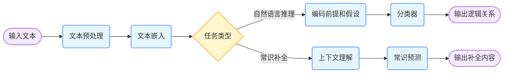

# 基于深度学习的AI自然语言推理与常识补全系统

> 关键词：深度学习、自然语言推理、常识补全、AI系统、神经网络

> 摘要：本文围绕基于深度学习的AI自然语言推理与常识补全系统展开深入研究。首先介绍了该系统开发的背景、目的和适用读者，阐述了文档结构和相关术语。接着详细讲解了核心概念，包括自然语言推理和常识补全的原理及架构，并通过Mermaid流程图进行直观展示。深入剖析了核心算法原理，结合Python代码进行说明，同时给出数学模型和公式，辅以具体例子加深理解。通过项目实战，展示了开发环境搭建、源代码实现与解读。探讨了该系统在多个领域的实际应用场景，推荐了学习资源、开发工具框架和相关论文著作。最后总结了系统的未来发展趋势与挑战，提供常见问题解答和扩展阅读参考资料，旨在为相关领域的研究者和开发者提供全面且深入的技术指导。

## 1. 背景介绍 
### 1.1 目的和范围
自然语言处理（NLP）作为人工智能领域的重要分支，旨在让计算机能够理解、处理和生成人类语言。自然语言推理和常识补全是NLP中的关键任务。自然语言推理要求计算机判断两个句子之间的逻辑关系，如蕴含、矛盾或中立；常识补全则是根据上下文信息补充缺失的常识知识。本系统的目的是利用深度学习技术构建一个高效、准确的AI系统，实现自然语言推理和常识补全功能。

本系统的范围涵盖了从文本数据的预处理、模型的训练到最终的推理和补全任务。我们将使用常见的深度学习架构，如循环神经网络（RNN）、长短时记忆网络（LSTM）和变换器（Transformer）等，对自然语言进行建模和处理。

### 1.2 预期读者
本文预期读者包括自然语言处理领域的研究者、深度学习开发者、人工智能爱好者以及相关专业的学生。对于想要了解自然语言推理和常识补全技术的初学者，本文将提供详细的基础介绍和实现步骤；对于有一定经验的开发者，本文将分享一些高级的算法原理和实际应用案例。

### 1.3 文档结构概述
本文将按照以下结构进行组织：
- 核心概念与联系：介绍自然语言推理和常识补全的基本概念、原理和架构，并通过Mermaid流程图展示其工作流程。
- 核心算法原理 & 具体操作步骤：详细讲解深度学习算法在自然语言推理和常识补全中的应用，包括模型的结构和训练过程，并给出Python代码示例。
- 数学模型和公式 & 详细讲解 & 举例说明：用数学公式描述模型的原理，并通过具体例子进行说明。
- 项目实战：代码实际案例和详细解释说明：展示如何搭建开发环境，实现自然语言推理和常识补全系统的源代码，并对代码进行解读和分析。
- 实际应用场景：探讨该系统在不同领域的实际应用场景。
- 工具和资源推荐：推荐学习资源、开发工具框架和相关论文著作。
- 总结：未来发展趋势与挑战：总结系统的发展趋势和面临的挑战。
- 附录：常见问题与解答：提供常见问题的解答。
- 扩展阅读 & 参考资料：提供相关的扩展阅读和参考资料。

### 1.4 术语表
#### 1.4.1 核心术语定义
- **自然语言推理（Natural Language Inference, NLI）**：判断两个句子之间的逻辑关系，如蕴含、矛盾或中立。
- **常识补全（Common Sense Completion）**：根据上下文信息补充缺失的常识知识。
- **深度学习（Deep Learning）**：一种基于人工神经网络的机器学习方法，通过多层神经网络自动学习数据的特征表示。
- **循环神经网络（Recurrent Neural Network, RNN）**：一种能够处理序列数据的神经网络，通过循环结构保存序列的历史信息。
- **长短时记忆网络（Long Short-Term Memory, LSTM）**：一种特殊的RNN，能够有效解决长序列数据中的梯度消失和梯度爆炸问题。
- **变换器（Transformer）**：一种基于自注意力机制的神经网络架构，在自然语言处理任务中取得了很好的效果。

#### 1.4.2 相关概念解释
- **文本嵌入（Text Embedding）**：将文本转换为向量表示的过程，使得计算机能够处理文本数据。
- **注意力机制（Attention Mechanism）**：一种能够自动关注输入序列中重要部分的机制，在自然语言处理中广泛应用。
- **预训练模型（Pretrained Model）**：在大规模数据集上预先训练好的模型，可以在其他相关任务中进行微调，提高模型的性能。

#### 1.4.3 缩略词列表
- **NLP**：Natural Language Processing，自然语言处理
- **NLI**：Natural Language Inference，自然语言推理
- **RNN**：Recurrent Neural Network，循环神经网络
- **LSTM**：Long Short-Term Memory，长短时记忆网络
- **Transformer**：变换器

## 2. 核心概念与联系 

### 自然语言推理原理
自然语言推理的目标是判断两个句子之间的逻辑关系。给定一个前提句子（Premise）和一个假设句子（Hypothesis），模型需要判断假设句子是否能从前提句子中推导出来（蕴含关系），是否与前提句子矛盾（矛盾关系），或者两者之间没有明显的逻辑联系（中立关系）。

其原理是通过对前提句子和假设句子进行编码，将它们转换为向量表示，然后通过一个分类器对这两个向量进行处理，输出它们之间的逻辑关系。

### 常识补全原理
常识补全是在给定上下文信息的情况下，补充缺失的常识知识。其原理是通过对上下文进行理解和分析，利用预训练模型中学习到的常识知识，预测出缺失的部分。

### 架构示意图


### 核心概念联系
自然语言推理和常识补全是相互关联的任务。在自然语言推理中，常识知识可以帮助模型更好地理解句子之间的逻辑关系；而常识补全任务也可以从自然语言推理的过程中获取上下文信息，提高补全的准确性。例如，在判断“小明去了超市，他买了一些苹果”和“小明买了水果”之间的蕴含关系时，需要常识知识知道苹果是水果的一种；在补全“小明去了超市，他买了一些____”时，自然语言推理的上下文信息可以帮助确定补全的内容。

## 3. 核心算法原理 & 具体操作步骤 

### 基于Transformer的自然语言推理算法
#### 原理
Transformer是一种基于自注意力机制的神经网络架构，它能够捕捉输入序列中不同位置之间的依赖关系。在自然语言推理中，我们可以使用预训练的Transformer模型，如BERT（Bidirectional Encoder Representations from Transformers），对前提句子和假设句子进行编码。

具体来说，将前提句子和假设句子拼接在一起，中间用特殊的分隔符分隔，然后输入到BERT模型中。BERT模型会输出每个词的上下文表示，我们可以取[CLS]标记的输出作为整个句子对的表示，然后通过一个全连接层进行分类，得到它们之间的逻辑关系。

#### Python代码实现
```python
import torch
from transformers import BertTokenizer, BertForSequenceClassification

# 加载预训练的BERT模型和分词器
tokenizer = BertTokenizer.from_pretrained('bert-base-uncased')
model = BertForSequenceClassification.from_pretrained('bert-base-uncased', num_labels=3)

# 输入句子
premise = "The dog is running in the park."
hypothesis = "The animal is playing outside."

# 对句子进行分词和编码
inputs = tokenizer(premise, hypothesis, return_tensors='pt')

# 进行推理
outputs = model(**inputs)
logits = outputs.logits

# 获取预测结果
predicted_class_id = torch.argmax(logits, dim=-1).item()
label_map = {0: '蕴含', 1: '矛盾', 2: '中立'}
predicted_label = label_map[predicted_class_id]

print(f"预测结果: {predicted_label}")
```

### 基于LSTM的常识补全算法
#### 原理
LSTM是一种特殊的RNN，能够有效处理长序列数据。在常识补全中，我们可以使用LSTM对上下文进行建模，然后通过一个全连接层预测缺失的常识内容。

具体来说，将上下文句子进行分词和嵌入，然后输入到LSTM模型中。LSTM模型会输出每个时间步的隐藏状态，我们可以取最后一个时间步的隐藏状态作为上下文的表示，然后通过一个全连接层进行预测，得到缺失的常识内容。

#### Python代码实现
```python
import torch
import torch.nn as nn
import torch.optim as optim

# 定义LSTM模型
class LSTMModel(nn.Module):
    def __init__(self, vocab_size, embedding_dim, hidden_dim, output_dim):
        super(LSTMModel, self).__init__()
        self.embedding = nn.Embedding(vocab_size, embedding_dim)
        self.lstm = nn.LSTM(embedding_dim, hidden_dim, batch_first=True)
        self.fc = nn.Linear(hidden_dim, output_dim)

    def forward(self, x):
        embedded = self.embedding(x)
        output, (hidden, cell) = self.lstm(embedded)
        hidden = hidden.squeeze(0)
        output = self.fc(hidden)
        return output

# 示例数据
vocab_size = 1000
embedding_dim = 100
hidden_dim = 200
output_dim = 10
model = LSTMModel(vocab_size, embedding_dim, hidden_dim, output_dim)

# 定义损失函数和优化器
criterion = nn.CrossEntropyLoss()
optimizer = optim.Adam(model.parameters(), lr=0.001)

# 模拟输入数据
input_seq = torch.randint(0, vocab_size, (1, 10))
target = torch.randint(0, output_dim, (1,))

# 训练模型
for epoch in range(10):
    optimizer.zero_grad()
    output = model(input_seq)
    loss = criterion(output, target)
    loss.backward()
    optimizer.step()
    print(f'Epoch {epoch+1}, Loss: {loss.item()}')
```

## 4. 数学模型和公式 & 详细讲解 & 举例说明 

### 自然语言推理的数学模型
#### 文本嵌入
在自然语言推理中，首先需要将文本转换为向量表示。假设我们有一个词表 $V$，大小为 $|V|$，对于一个词 $w$，我们可以使用一个嵌入矩阵 $E \in \mathbb{R}^{|V| \times d}$ 将其转换为一个 $d$ 维的向量 $\mathbf{e}_w$，其中 $d$ 是嵌入维度。

对于一个句子 $S = [w_1, w_2, \cdots, w_n]$，我们可以将其转换为一个向量序列 $\mathbf{X} = [\mathbf{e}_{w_1}, \mathbf{e}_{w_2}, \cdots, \mathbf{e}_{w_n}]$，其中 $\mathbf{e}_{w_i}$ 是词 $w_i$ 的嵌入向量。

#### Transformer编码
Transformer模型通过多头自注意力机制对输入序列进行编码。多头自注意力机制的计算公式如下：

$$
\text{MultiHead}(Q, K, V) = \text{Concat}(\text{head}_1, \cdots, \text{head}_h)W^O
$$

其中，$\text{head}_i = \text{Attention}(QW_i^Q, KW_i^K, VW_i^V)$，$\text{Attention}(Q, K, V) = \text{softmax}\left(\frac{QK^T}{\sqrt{d_k}}\right)V$，$Q$、$K$、$V$ 分别是查询、键和值矩阵，$W_i^Q$、$W_i^K$、$W_i^V$ 和 $W^O$ 是可学习的权重矩阵，$h$ 是头的数量，$d_k$ 是键的维度。

#### 分类器
在编码之后，我们取 [CLS] 标记的输出 $\mathbf{h}_{[CLS]}$ 作为整个句子对的表示，然后通过一个全连接层进行分类：

$$
\mathbf{z} = W^c\mathbf{h}_{[CLS]} + \mathbf{b}^c
$$

其中，$W^c$ 是分类器的权重矩阵，$\mathbf{b}^c$ 是偏置向量，$\mathbf{z}$ 是分类器的输出。最后，我们使用 softmax 函数将 $\mathbf{z}$ 转换为概率分布：

$$
\mathbf{p} = \text{softmax}(\mathbf{z})
$$

其中，$\mathbf{p}$ 是每个类别的概率。

#### 举例说明
假设我们有一个前提句子 “The dog is running.” 和一个假设句子 “The animal is moving.”，经过分词和嵌入后，得到输入序列 $\mathbf{X}$。然后，将 $\mathbf{X}$ 输入到 Transformer 模型中进行编码，得到 [CLS] 标记的输出 $\mathbf{h}_{[CLS]}$。接着，将 $\mathbf{h}_{[CLS]}$ 输入到分类器中，得到分类器的输出 $\mathbf{z}$。最后，使用 softmax 函数将 $\mathbf{z}$ 转换为概率分布 $\mathbf{p}$，假设 $\mathbf{p} = [0.8, 0.1, 0.1]$，则预测结果为蕴含关系。

### 常识补全的数学模型
#### LSTM建模
在常识补全中，我们使用 LSTM 对上下文进行建模。LSTM 的计算公式如下：

$$
\begin{aligned}
\mathbf{i}_t &= \sigma(W_i[\mathbf{h}_{t-1}, \mathbf{x}_t] + \mathbf{b}_i) \\
\mathbf{f}_t &= \sigma(W_f[\mathbf{h}_{t-1}, \mathbf{x}_t] + \mathbf{b}_f) \\
\mathbf{o}_t &= \sigma(W_o[\mathbf{h}_{t-1}, \mathbf{x}_t] + \mathbf{b}_o) \\
\tilde{\mathbf{C}}_t &= \tanh(W_C[\mathbf{h}_{t-1}, \mathbf{x}_t] + \mathbf{b}_C) \\
\mathbf{C}_t &= \mathbf{f}_t \odot \mathbf{C}_{t-1} + \mathbf{i}_t \odot \tilde{\mathbf{C}}_t \\
\mathbf{h}_t &= \mathbf{o}_t \odot \tanh(\mathbf{C}_t)
\end{aligned}
$$

其中，$\mathbf{i}_t$、$\mathbf{f}_t$、$\mathbf{o}_t$ 分别是输入门、遗忘门和输出门，$\tilde{\mathbf{C}}_t$ 是候选细胞状态，$\mathbf{C}_t$ 是细胞状态，$\mathbf{h}_t$ 是隐藏状态，$W_i$、$W_f$、$W_o$、$W_C$ 是可学习的权重矩阵，$\mathbf{b}_i$、$\mathbf{b}_f$、$\mathbf{b}_o$、$\mathbf{b}_C$ 是偏置向量，$\sigma$ 是 sigmoid 函数，$\tanh$ 是双曲正切函数，$\odot$ 是逐元素相乘。

#### 预测
在得到最后一个时间步的隐藏状态 $\mathbf{h}_T$ 后，我们通过一个全连接层进行预测：

$$
\mathbf{z} = W^p\mathbf{h}_T + \mathbf{b}^p
$$

其中，$W^p$ 是预测层的权重矩阵，$\mathbf{b}^p$ 是偏置向量，$\mathbf{z}$ 是预测层的输出。最后，我们使用 softmax 函数将 $\mathbf{z}$ 转换为概率分布：

$$
\mathbf{p} = \text{softmax}(\mathbf{z})
$$

其中，$\mathbf{p}$ 是每个候选常识内容的概率。

#### 举例说明
假设我们有一个上下文句子 “John went to the supermarket. He bought some ____”，经过分词和嵌入后，得到输入序列 $\mathbf{X}$。然后，将 $\mathbf{X}$ 输入到 LSTM 模型中进行建模，得到最后一个时间步的隐藏状态 $\mathbf{h}_T$。接着，将 $\mathbf{h}_T$ 输入到预测层中，得到预测层的输出 $\mathbf{z}$。最后，使用 softmax 函数将 $\mathbf{z}$ 转换为概率分布 $\mathbf{p}$，假设 $\mathbf{p}$ 中 “apples” 的概率最高，则预测结果为 “apples”。

## 5. 项目实战：代码实际案例和详细解释说明 

### 5.1  开发环境搭建
#### 安装Python和相关库
首先，确保你已经安装了Python 3.6或更高版本。然后，使用以下命令安装所需的库：
```bash
pip install torch transformers numpy pandas
```

#### 下载预训练模型
如果你使用的是预训练的Transformer模型，如BERT，可以使用 `transformers` 库自动下载和加载模型：
```python
from transformers import BertTokenizer, BertForSequenceClassification

tokenizer = BertTokenizer.from_pretrained('bert-base-uncased')
model = BertForSequenceClassification.from_pretrained('bert-base-uncased', num_labels=3)
```

### 5.2  源代码详细实现和代码解读
#### 自然语言推理代码实现
```python
import torch
from transformers import BertTokenizer, BertForSequenceClassification

# 加载预训练的BERT模型和分词器
tokenizer = BertTokenizer.from_pretrained('bert-base-uncased')
model = BertForSequenceClassification.from_pretrained('bert-base-uncased', num_labels=3)

# 输入句子
premise = "The dog is running in the park."
hypothesis = "The animal is playing outside."

# 对句子进行分词和编码
inputs = tokenizer(premise, hypothesis, return_tensors='pt')

# 进行推理
outputs = model(**inputs)
logits = outputs.logits

# 获取预测结果
predicted_class_id = torch.argmax(logits, dim=-1).item()
label_map = {0: '蕴含', 1: '矛盾', 2: '中立'}
predicted_label = label_map[predicted_class_id]

print(f"预测结果: {predicted_label}")
```
#### 代码解读
1. **加载模型和分词器**：使用 `BertTokenizer.from_pretrained` 加载预训练的BERT分词器，使用 `BertForSequenceClassification.from_pretrained` 加载预训练的BERT分类模型。
2. **输入句子**：定义前提句子和假设句子。
3. **分词和编码**：使用分词器对句子进行分词和编码，将其转换为模型可以接受的输入格式。
4. **推理**：将编码后的输入传入模型，得到模型的输出。
5. **获取预测结果**：使用 `torch.argmax` 函数获取预测结果的类别ID，然后根据类别ID映射到具体的标签。

#### 常识补全代码实现
```python
import torch
import torch.nn as nn
import torch.optim as optim
import numpy as np

# 定义LSTM模型
class LSTMModel(nn.Module):
    def __init__(self, vocab_size, embedding_dim, hidden_dim, output_dim):
        super(LSTMModel, self).__init__()
        self.embedding = nn.Embedding(vocab_size, embedding_dim)
        self.lstm = nn.LSTM(embedding_dim, hidden_dim, batch_first=True)
        self.fc = nn.Linear(hidden_dim, output_dim)

    def forward(self, x):
        embedded = self.embedding(x)
        output, (hidden, cell) = self.lstm(embedded)
        hidden = hidden.squeeze(0)
        output = self.fc(hidden)
        return output

# 示例数据
vocab_size = 1000
embedding_dim = 100
hidden_dim = 200
output_dim = 10
model = LSTMModel(vocab_size, embedding_dim, hidden_dim, output_dim)

# 定义损失函数和优化器
criterion = nn.CrossEntropyLoss()
optimizer = optim.Adam(model.parameters(), lr=0.001)

# 模拟输入数据
input_seq = torch.randint(0, vocab_size, (1, 10))
target = torch.randint(0, output_dim, (1,))

# 训练模型
for epoch in range(10):
    optimizer.zero_grad()
    output = model(input_seq)
    loss = criterion(output, target)
    loss.backward()
    optimizer.step()
    print(f'Epoch {epoch+1}, Loss: {loss.item()}')
```
#### 代码解读
1. **定义模型**：定义一个LSTM模型，包括嵌入层、LSTM层和全连接层。
2. **初始化参数**：设置词表大小、嵌入维度、隐藏维度和输出维度。
3. **定义损失函数和优化器**：使用交叉熵损失函数和Adam优化器。
4. **模拟输入数据**：生成随机的输入序列和目标标签。
5. **训练模型**：在每个epoch中，前向传播计算损失，反向传播更新模型参数。

### 5.3  代码解读与分析
#### 自然语言推理代码分析
- **优点**：使用预训练的BERT模型可以利用大规模语料库中学习到的语言知识，提高模型的性能。代码简洁，易于实现。
- **缺点**：预训练模型的计算资源需求较大，训练和推理速度较慢。

#### 常识补全代码分析
- **优点**：LSTM模型能够处理序列数据，捕捉上下文信息。代码结构清晰，易于理解和修改。
- **缺点**：LSTM模型在处理长序列时可能会出现梯度消失和梯度爆炸问题，导致模型性能下降。

## 6. 实际应用场景 
### 智能问答系统
在智能问答系统中，自然语言推理可以帮助系统判断用户的问题和候选答案之间的逻辑关系，选择最合适的答案；常识补全可以根据用户的问题补充缺失的常识知识，提高回答的准确性和完整性。例如，当用户询问 “苹果是水果吗？” 时，系统可以通过自然语言推理判断答案为 “是”，并通过常识补全提供关于苹果的更多信息，如苹果的营养价值等。

### 信息检索
在信息检索中，自然语言推理可以帮助系统理解用户的查询意图，判断文档与查询之间的相关性；常识补全可以补充文档中缺失的信息，提高检索结果的质量。例如，当用户查询 “关于人工智能的书籍” 时，系统可以通过自然语言推理筛选出与人工智能相关的书籍，并通过常识补全提供这些书籍的作者、出版年份等信息。

### 文本生成
在文本生成任务中，自然语言推理可以帮助生成的文本在逻辑上更加连贯和合理；常识补全可以为生成的文本提供丰富的常识知识，使文本更加生动和有意义。例如，在生成新闻报道时，系统可以通过自然语言推理确保报道的内容符合事实逻辑，通过常识补全补充相关的背景信息和数据。

### 智能客服
在智能客服系统中，自然语言推理可以帮助客服系统理解用户的问题，提供准确的回答；常识补全可以为客服人员提供更多的参考信息，提高服务质量。例如，当用户咨询产品的使用方法时，系统可以通过自然语言推理判断用户的问题类型，提供相应的使用说明，并通过常识补全提供一些常见问题的解决方案。

## 7. 工具和资源推荐
### 7.1 学习资源推荐
#### 7.1.1 书籍推荐
- 《深度学习》（Deep Learning）：由Ian Goodfellow、Yoshua Bengio和Aaron Courville所著，是深度学习领域的经典教材，涵盖了深度学习的基本原理、算法和应用。
- 《自然语言处理入门》（Natural Language Processing with Python）：由Steven Bird、Ewan Klein和Edward Loper所著，介绍了使用Python进行自然语言处理的基本方法和技术。
- 《基于深度学习的自然语言处理》（Natural Language Processing with Deep Learning）：由Yoav Goldberg所著，详细介绍了深度学习在自然语言处理中的应用。

#### 7.1.2 在线课程
- Coursera上的“深度学习专项课程”（Deep Learning Specialization）：由Andrew Ng教授授课，涵盖了深度学习的各个方面，包括神经网络、卷积神经网络、循环神经网络等。
- edX上的“自然语言处理基础”（Foundations of Natural Language Processing）：介绍了自然语言处理的基本概念、算法和技术。
- 哔哩哔哩上的“动手学深度学习”（Dive into Deep Learning）：由李沐等老师授课，通过实际代码演示，让学习者更好地理解和掌握深度学习的原理和应用。

#### 7.1.3 技术博客和网站
- Medium：有许多关于深度学习和自然语言处理的优秀博客文章，如Towards Data Science、The AI Blog等。
- arXiv：提供了大量的学术论文，包括自然语言推理和常识补全领域的最新研究成果。
- Hugging Face：一个专注于自然语言处理的开源社区，提供了丰富的预训练模型和工具。

### 7.2 开发工具框架推荐
#### 7.2.1 IDE和编辑器
- PyCharm：一款功能强大的Python集成开发环境，提供了代码编辑、调试、版本控制等功能。
- Jupyter Notebook：一个交互式的开发环境，适合进行数据探索、模型训练和结果展示。
- Visual Studio Code：一款轻量级的代码编辑器，支持多种编程语言，具有丰富的插件生态系统。

#### 7.2.2 调试和性能分析工具
- PyTorch Profiler：PyTorch提供的性能分析工具，可以帮助开发者找出代码中的性能瓶颈。
- TensorBoard：一个可视化工具，可以用于监控模型的训练过程、查看模型的结构和性能指标。
- cProfile：Python标准库中的性能分析工具，可以帮助开发者分析代码的执行时间和调用关系。

#### 7.2.3 相关框架和库
- PyTorch：一个开源的深度学习框架，具有动态图和易于使用的特点，广泛应用于自然语言处理领域。
- TensorFlow：另一个开源的深度学习框架，具有强大的分布式训练和部署能力。
- Transformers：Hugging Face开发的一个自然语言处理库，提供了大量的预训练模型和工具，方便开发者进行自然语言推理和常识补全任务。

### 7.3 相关论文著作推荐
#### 7.3.1 经典论文
- “Attention Is All You Need”：介绍了Transformer架构，是自然语言处理领域的经典论文。
- “BERT: Pre-training of Deep Bidirectional Transformers for Language Understanding”：提出了BERT模型，在自然语言处理任务中取得了很好的效果。
- “Long Short-Term Memory”：介绍了LSTM模型，解决了RNN中的梯度消失和梯度爆炸问题。

#### 7.3.2 最新研究成果
- 在ACL（Association for Computational Linguistics）、EMNLP（Conference on Empirical Methods in Natural Language Processing）等自然语言处理领域的顶级会议上，有许多关于自然语言推理和常识补全的最新研究成果。
- arXiv上也有很多关于这方面的预印本论文，可以及时了解最新的研究动态。

#### 7.3.3 应用案例分析
- 一些科技公司的技术博客，如Google AI Blog、Microsoft Research Blog等，会分享自然语言推理和常识补全在实际应用中的案例和经验。
- Kaggle上也有一些相关的竞赛和数据集，可以通过参与竞赛和分析数据集来学习实际应用案例。

## 8. 总结：未来发展趋势与挑战
### 未来发展趋势
#### 多模态融合
未来的自然语言推理和常识补全系统将不仅仅局限于文本信息，还会融合图像、音频、视频等多模态信息。例如，在智能问答系统中，用户可以通过语音或图像提出问题，系统可以结合多模态信息进行推理和补全，提供更加准确和丰富的回答。

#### 知识增强
随着知识图谱等技术的发展，未来的系统将更加注重知识的利用和融合。通过将常识知识和领域知识融入到模型中，可以提高系统的推理能力和补全准确性。例如，在医学领域的问答系统中，可以结合医学知识图谱，为用户提供更加专业和准确的回答。

#### 强化学习和元学习
强化学习和元学习可以帮助系统在不同的任务和环境中快速学习和适应。未来的自然语言推理和常识补全系统可以利用强化学习和元学习技术，提高系统的泛化能力和自适应能力。例如，在不同领域的智能客服系统中，系统可以通过强化学习快速学习和适应不同领域的知识和用户需求。

### 挑战
#### 数据质量和标注成本
自然语言推理和常识补全任务需要大量的高质量数据进行训练。然而，数据的标注成本较高，而且数据的质量也难以保证。如何提高数据的质量和降低标注成本是未来需要解决的问题之一。

#### 模型可解释性
深度学习模型通常是黑盒模型，难以解释其决策过程和结果。在一些对可解释性要求较高的领域，如医疗、法律等，模型的可解释性是一个重要的挑战。如何提高模型的可解释性，让用户更好地理解模型的决策过程和结果，是未来需要研究的方向之一。

#### 计算资源和效率
深度学习模型的训练和推理需要大量的计算资源，而且计算效率较低。如何提高模型的计算效率，降低计算资源的需求，是未来需要解决的问题之一。例如，通过模型压缩、量化等技术，可以减少模型的参数数量和计算量，提高模型的计算效率。

## 9. 附录：常见问题与解答
### 自然语言推理和常识补全有什么区别？
自然语言推理主要关注判断两个句子之间的逻辑关系，如蕴含、矛盾或中立；而常识补全则是根据上下文信息补充缺失的常识知识。虽然两者都与自然语言处理相关，但任务的侧重点不同。

### 为什么要使用预训练模型？
预训练模型在大规模语料库上进行了训练，学习到了丰富的语言知识和模式。在自然语言推理和常识补全任务中使用预训练模型，可以利用这些先验知识，提高模型的性能和训练效率。同时，预训练模型还可以减少对大量标注数据的依赖。

### 如何选择合适的深度学习模型？
选择合适的深度学习模型需要考虑多个因素，如任务的复杂度、数据的规模和特点、计算资源的限制等。对于简单的任务，可以选择较为简单的模型，如LSTM；对于复杂的任务，可以选择性能更好的模型，如Transformer。此外，还可以通过实验和比较不同模型的性能，选择最合适的模型。

### 如何提高模型的性能？
提高模型的性能可以从多个方面入手，如使用更多的训练数据、调整模型的超参数、采用更复杂的模型结构、进行数据增强等。此外，还可以使用预训练模型进行微调，利用先验知识提高模型的性能。

### 模型训练过程中出现过拟合怎么办？
过拟合是指模型在训练数据上表现良好，但在测试数据上表现较差的现象。可以通过以下方法解决过拟合问题：
- 增加训练数据：更多的训练数据可以帮助模型学习到更广泛的模式，减少过拟合的风险。
- 正则化：如L1和L2正则化，可以限制模型的复杂度，减少过拟合的可能性。
- 早停：在训练过程中，当模型在验证集上的性能不再提升时，停止训练，避免模型过拟合。
- 数据增强：通过对训练数据进行变换和扩充，增加数据的多样性，提高模型的泛化能力。

## 10. 扩展阅读 & 参考资料
### 扩展阅读
- 《自然语言处理综论》（Speech and Language Processing）：全面介绍了自然语言处理的各个方面，包括语法分析、语义理解、信息检索等。
- 《深度学习实战》（Deep Learning in Practice）：通过实际案例介绍了深度学习在不同领域的应用，包括自然语言处理、计算机视觉等。
- 《人工智能：一种现代的方法》（Artificial Intelligence: A Modern Approach）：人工智能领域的经典教材，涵盖了人工智能的各个方面，包括搜索算法、机器学习、自然语言处理等。

### 参考资料
- Goodfellow, I., Bengio, Y., & Courville, A. (2016). Deep Learning. MIT Press.
- Bird, S., Klein, E., & Loper, E. (2009). Natural Language Processing with Python. O'Reilly Media.
- Goldberg, Y. (2017). Neural Network Methods for Natural Language Processing. Morgan & Claypool Publishers.
- Vaswani, A., Shazeer, N., Parmar, N., Uszkoreit, J., Jones, L., Gomez, A. N.,... & Polosukhin, I. (2017). Attention is all you need. In Advances in neural information processing systems (pp. 5998-6008).
- Devlin, J., Chang, M. W., Lee, K., & Toutanova, K. (2018). Bert: Pre-training of deep bidirectional transformers for language understanding. arXiv preprint arXiv:1810.04805.
- Hochreiter, S., & Schmidhuber, J. (1997). Long short-term memory. Neural computation, 9(8), 1735-1780.

作者：AI天才研究院/AI Genius Institute & 禅与计算机程序设计艺术 /Zen And The Art of Computer Programming