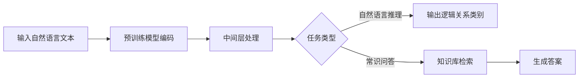

# 基于深度学习的AI自然语言推理与常识问答系统

> 关键词：深度学习、自然语言推理、常识问答系统、Transformer、预训练模型

> 摘要：本文聚焦于基于深度学习的AI自然语言推理与常识问答系统。首先介绍了该领域的背景知识，包括目的、预期读者、文档结构等内容。接着详细阐述了核心概念，如自然语言推理和常识问答的原理及架构，并给出了相应的文本示意图和Mermaid流程图。然后深入讲解了核心算法原理，通过Python源代码进行详细说明，同时给出了相关的数学模型和公式。在项目实战部分，展示了开发环境搭建、源代码实现和代码解读。还探讨了实际应用场景，推荐了学习资源、开发工具框架和相关论文著作。最后对未来发展趋势与挑战进行了总结，并给出了常见问题解答和扩展阅读参考资料。

## 1. 背景介绍 
### 1.1 目的和范围
自然语言推理（Natural Language Inference，NLI）和常识问答系统是自然语言处理（NLP）领域的重要研究方向。自然语言推理旨在判断两个句子之间的逻辑关系，如蕴含、矛盾或中立。常识问答系统则是让计算机能够理解自然语言问题，并利用常识知识给出准确的答案。本文章的目的是深入探讨基于深度学习的方法在这两个任务中的应用，包括算法原理、数学模型、实际项目实现等方面。范围涵盖了从基础概念到实际应用的全过程，帮助读者全面了解该领域的技术和发展。

### 1.2 预期读者
本文预期读者包括对自然语言处理、深度学习感兴趣的研究人员、开发者和学生。对于初学者，本文可以作为入门学习的资料，帮助他们建立起对自然语言推理和常识问答系统的基本认识；对于有一定经验的从业者，本文可以提供更深入的技术分析和实践案例，为他们的研究和开发工作提供参考。

### 1.3 文档结构概述
本文将按照以下结构进行组织：首先介绍核心概念与联系，包括自然语言推理和常识问答系统的基本原理和架构；然后详细讲解核心算法原理和具体操作步骤，通过Python代码进行说明；接着给出相关的数学模型和公式，并举例说明；在项目实战部分，展示如何搭建开发环境、实现源代码并进行代码解读；之后探讨实际应用场景；再推荐相关的工具和资源；最后总结未来发展趋势与挑战，给出常见问题解答和扩展阅读参考资料。

### 1.4 术语表
#### 1.4.1 核心术语定义
- **自然语言推理（Natural Language Inference，NLI）**：判断两个句子之间逻辑关系的任务，通常分为蕴含、矛盾和中立三种关系。
- **常识问答系统（Commonsense Question Answering System）**：利用常识知识回答自然语言问题的系统。
- **深度学习（Deep Learning）**：一类基于人工神经网络的机器学习方法，通过多层神经网络自动学习数据的特征和模式。
- **预训练模型（Pretrained Model）**：在大规模无监督数据上进行预训练的模型，如BERT、GPT等，可以为后续的任务提供强大的语言表示能力。
- **Transformer**：一种基于注意力机制的深度学习模型架构，在自然语言处理领域取得了巨大成功。

#### 1.4.2 相关概念解释
- **注意力机制（Attention Mechanism）**：一种让模型能够关注输入序列中不同部分的机制，通过计算注意力权重来动态地分配模型的注意力。
- **语言表示（Language Representation）**：将自然语言文本转换为计算机能够处理的向量表示，以便模型进行学习和推理。
- **微调（Fine-tuning）**：在预训练模型的基础上，使用特定任务的数据集对模型进行进一步训练，以适应具体的任务需求。

#### 1.4.3 缩略词列表
- **NLI**：Natural Language Inference
- **NLP**：Natural Language Processing
- **BERT**：Bidirectional Encoder Representations from Transformers
- **GPT**：Generative Pretrained Transformer

## 2. 核心概念与联系 

### 自然语言推理原理
自然语言推理的目标是判断前提句子（Premise）和假设句子（Hypothesis）之间的逻辑关系。例如，前提句子“所有的猫都喜欢吃鱼”，假设句子“这只猫喜欢吃鱼”，这两个句子之间的关系是蕴含关系。在深度学习中，通常使用神经网络模型对前提和假设句子进行编码，然后通过分类器判断它们之间的逻辑关系。

### 常识问答系统原理
常识问答系统需要理解用户提出的自然语言问题，并从常识知识库中找到相关的答案。常识知识库可以是结构化的知识图谱，也可以是无结构化的文本数据。系统通常会对问题进行编码，然后在知识库中进行检索和匹配，最后生成答案。

### 核心概念架构
下面是自然语言推理和常识问答系统的架构示意图：

```plaintext
输入层：自然语言文本（前提、假设或问题）
|
特征提取层：使用预训练模型（如BERT）对输入文本进行编码
|
中间层：可以是多层神经网络，对编码后的特征进行进一步处理
|
输出层：自然语言推理任务输出逻辑关系类别；常识问答系统输出答案
```

### Mermaid流程图


## 3. 核心算法原理 & 具体操作步骤 

### 基于Transformer的自然语言推理算法
Transformer是一种基于注意力机制的深度学习模型，在自然语言处理领域取得了巨大成功。下面是使用Python和PyTorch实现一个简单的基于Transformer的自然语言推理模型的代码：

```python
import torch
import torch.nn as nn
import torch.optim as optim
from torch.utils.data import Dataset, DataLoader

# 定义Transformer模型
class TransformerNLI(nn.Module):
    def __init__(self, vocab_size, embedding_dim, hidden_dim, num_classes):
        super(TransformerNLI, self).__init__()
        self.embedding = nn.Embedding(vocab_size, embedding_dim)
        self.transformer_encoder = nn.TransformerEncoder(
            nn.TransformerEncoderLayer(embedding_dim, nhead=8),
            num_layers=2
        )
        self.fc = nn.Linear(embedding_dim, num_classes)

    def forward(self, input_ids):
        embedded = self.embedding(input_ids)
        output = self.transformer_encoder(embedded)
        pooled_output = torch.mean(output, dim=1)
        logits = self.fc(pooled_output)
        return logits

# 定义数据集类
class NLIDataset(Dataset):
    def __init__(self, premises, hypotheses, labels):
        self.premises = premises
        self.hypotheses = hypotheses
        self.labels = labels

    def __len__(self):
        return len(self.labels)

    def __getitem__(self, idx):
        premise = self.premises[idx]
        hypothesis = self.hypotheses[idx]
        label = self.labels[idx]
        return premise, hypothesis, label

# 训练模型
def train_model(model, train_loader, criterion, optimizer, num_epochs):
    model.train()
    for epoch in range(num_epochs):
        running_loss = 0.0
        for premises, hypotheses, labels in train_loader:
            optimizer.zero_grad()
            inputs = torch.cat((premises, hypotheses), dim=1)
            logits = model(inputs)
            loss = criterion(logits, labels)
            loss.backward()
            optimizer.step()
            running_loss += loss.item()
        print(f'Epoch {epoch+1}, Loss: {running_loss/len(train_loader)}')

# 示例使用
vocab_size = 10000
embedding_dim = 128
hidden_dim = 256
num_classes = 3
model = TransformerNLI(vocab_size, embedding_dim, hidden_dim, num_classes)

# 模拟数据
premises = torch.randint(0, vocab_size, (100, 10))
hypotheses = torch.randint(0, vocab_size, (100, 10))
labels = torch.randint(0, num_classes, (100,))

dataset = NLIDataset(premises, hypotheses, labels)
train_loader = DataLoader(dataset, batch_size=16, shuffle=True)

criterion = nn.CrossEntropyLoss()
optimizer = optim.Adam(model.parameters(), lr=0.001)
num_epochs = 5
train_model(model, train_loader, criterion, optimizer, num_epochs)
```

### 具体操作步骤
1. **数据预处理**：将自然语言文本转换为模型可以处理的输入格式，如将文本分词并转换为词索引序列。
2. **模型定义**：定义基于Transformer的自然语言推理模型，包括嵌入层、Transformer编码器和分类器。
3. **数据集定义**：定义数据集类，用于加载和处理训练数据。
4. **训练模型**：使用交叉熵损失函数和Adam优化器对模型进行训练。

## 4. 数学模型和公式 & 详细讲解 & 举例说明 

### 词嵌入层
词嵌入层将词索引转换为词向量。假设词汇表大小为 $V$，嵌入维度为 $d$，则词嵌入矩阵 $E \in \mathbb{R}^{V \times d}$。对于输入的词索引序列 $x = [x_1, x_2, \cdots, x_n]$，其中 $x_i \in \{1, 2, \cdots, V\}$，词嵌入后的向量序列为 $e = [E_{x_1}, E_{x_2}, \cdots, E_{x_n}]$，其中 $E_{x_i}$ 表示词嵌入矩阵 $E$ 的第 $x_i$ 行。

### Transformer编码器
Transformer编码器由多个Transformer编码器层组成。每个编码器层包含多头自注意力机制和前馈神经网络。

#### 多头自注意力机制
多头自注意力机制将输入序列 $Q, K, V$（通常 $Q = K = V$）分别通过线性变换得到多个头的查询、键和值，然后计算每个头的注意力分数并加权求和。具体公式如下：

- 线性变换：
  - $Q^h = QW^Q_h$
  - $K^h = KW^K_h$
  - $V^h = VW^V_h$
  其中 $W^Q_h, W^K_h, W^V_h \in \mathbb{R}^{d \times d_h}$ 是可学习的权重矩阵，$d_h$ 是每个头的维度。

- 注意力分数计算：
  - $Attention(Q^h, K^h, V^h) = \text{softmax}(\frac{Q^h(K^h)^T}{\sqrt{d_h}})V^h$

- 多头注意力拼接：
  - $MultiHead(Q, K, V) = [Attention(Q^1, K^1, V^1); \cdots; Attention(Q^H, K^H, V^H)]W^O$
  其中 $H$ 是头的数量，$W^O \in \mathbb{R}^{Hd_h \times d}$ 是可学习的权重矩阵。

#### 前馈神经网络
前馈神经网络由两个线性层和一个激活函数组成：
- $FFN(x) = \text{ReLU}(xW_1 + b_1)W_2 + b_2$
  其中 $W_1 \in \mathbb{R}^{d \times d_{ff}}$，$W_2 \in \mathbb{R}^{d_{ff} \times d}$ 是可学习的权重矩阵，$b_1, b_2$ 是偏置向量，$d_{ff}$ 是前馈神经网络的隐藏维度。

### 分类器
分类器将Transformer编码器的输出进行线性变换得到每个类别的分数：
- $logits = \text{FC}(pooled\_output) = pooled\_outputW + b$
  其中 $W \in \mathbb{R}^{d \times C}$，$b \in \mathbb{R}^C$ 是可学习的权重矩阵和偏置向量，$C$ 是类别数量。

### 损失函数
通常使用交叉熵损失函数来训练模型：
- $L = -\sum_{i=1}^{N}\sum_{j=1}^{C}y_{ij}\log(p_{ij})$
  其中 $N$ 是样本数量，$C$ 是类别数量，$y_{ij}$ 是第 $i$ 个样本的真实标签的第 $j$ 个分量，$p_{ij}$ 是模型预测的第 $i$ 个样本属于第 $j$ 个类别的概率。

### 举例说明
假设输入的前提句子为“所有的猫都喜欢吃鱼”，假设句子为“这只猫喜欢吃鱼”。经过分词和词嵌入后，得到输入的词向量序列。Transformer编码器对这些词向量进行处理，通过多头自注意力机制捕捉句子中不同位置的依赖关系。最后分类器根据编码器的输出判断这两个句子之间的逻辑关系为蕴含关系。

## 5. 项目实战：代码实际案例和详细解释说明 

### 5.1  开发环境搭建
#### 安装Python和PyTorch
首先需要安装Python 3.x版本。可以从Python官方网站（https://www.python.org/downloads/）下载并安装。然后使用以下命令安装PyTorch：
```sh
pip install torch torchvision
```

#### 安装相关库
还需要安装一些其他的库，如`transformers`用于使用预训练模型，`numpy`用于数值计算，`pandas`用于数据处理等。可以使用以下命令安装：
```sh
pip install transformers numpy pandas
```

### 5.2  源代码详细实现和代码解读
以下是一个使用预训练的BERT模型进行自然语言推理的代码示例：

```python
import torch
from torch.utils.data import Dataset, DataLoader
from transformers import BertTokenizer, BertForSequenceClassification
from sklearn.model_selection import train_test_split
import pandas as pd

# 定义数据集类
class NLIDataset(Dataset):
    def __init__(self, premises, hypotheses, labels, tokenizer, max_length):
        self.premises = premises
        self.hypotheses = hypotheses
        self.labels = labels
        self.tokenizer = tokenizer
        self.max_length = max_length

    def __len__(self):
        return len(self.labels)

    def __getitem__(self, idx):
        premise = self.premises[idx]
        hypothesis = self.hypotheses[idx]
        label = self.labels[idx]
        encoding = self.tokenizer.encode_plus(
            premise,
            hypothesis,
            add_special_tokens=True,
            max_length=self.max_length,
            padding='max_length',
            truncation=True,
            return_tensors='pt'
        )
        input_ids = encoding['input_ids'].flatten()
        attention_mask = encoding['attention_mask'].flatten()
        return {
            'input_ids': input_ids,
            'attention_mask': attention_mask,
            'labels': torch.tensor(label, dtype=torch.long)
        }

# 训练模型
def train_model(model, train_loader, optimizer, num_epochs):
    model.train()
    for epoch in range(num_epochs):
        running_loss = 0.0
        for batch in train_loader:
            input_ids = batch['input_ids']
            attention_mask = batch['attention_mask']
            labels = batch['labels']

            optimizer.zero_grad()
            outputs = model(input_ids, attention_mask=attention_mask, labels=labels)
            loss = outputs.loss
            loss.backward()
            optimizer.step()
            running_loss += loss.item()
        print(f'Epoch {epoch+1}, Loss: {running_loss/len(train_loader)}')

# 示例使用
# 加载数据
data = pd.read_csv('nli_data.csv')
premises = data['premise'].tolist()
hypotheses = data['hypothesis'].tolist()
labels = data['label'].tolist()

# 划分训练集和测试集
train_premises, test_premises, train_hypotheses, test_hypotheses, train_labels, test_labels = train_test_split(
    premises, hypotheses, labels, test_size=0.2, random_state=42
)

# 加载预训练的BERT模型和分词器
tokenizer = BertTokenizer.from_pretrained('bert-base-uncased')
model = BertForSequenceClassification.from_pretrained('bert-base-uncased', num_labels=3)

# 创建数据集和数据加载器
max_length = 128
train_dataset = NLIDataset(train_premises, train_hypotheses, train_labels, tokenizer, max_length)
train_loader = DataLoader(train_dataset, batch_size=16, shuffle=True)

# 定义优化器
optimizer = torch.optim.Adam(model.parameters(), lr=2e-5)

# 训练模型
num_epochs = 3
train_model(model, train_loader, optimizer, num_epochs)
```

### 代码解读与分析
1. **数据集类**：`NLIDataset`类用于加载和处理自然语言推理数据。在`__getitem__`方法中，使用`BertTokenizer`对前提和假设句子进行编码，添加特殊标记，进行填充和截断，并返回输入ID、注意力掩码和标签。
2. **训练函数**：`train_model`函数用于训练模型。在每个epoch中，遍历训练数据加载器，计算损失并进行反向传播和参数更新。
3. **数据加载和处理**：使用`pandas`读取CSV文件中的数据，并使用`sklearn`的`train_test_split`函数将数据划分为训练集和测试集。
4. **模型加载**：使用`transformers`库加载预训练的BERT模型和分词器，并根据任务的类别数量调整模型的输出层。
5. **优化器和训练**：使用Adam优化器对模型进行训练，设置学习率为2e-5，训练3个epoch。

## 6. 实际应用场景 
### 智能客服
在智能客服系统中，自然语言推理和常识问答系统可以帮助客服机器人理解用户的问题，并根据知识库中的信息给出准确的答案。例如，当用户询问“你们的产品保修期是多久？”，系统可以通过常识问答功能快速给出答案。

### 信息检索
在信息检索系统中，自然语言推理可以用于判断查询语句和文档之间的相关性。例如，当用户输入一个查询语句“关于人工智能的最新研究成果”，系统可以通过自然语言推理技术筛选出与该查询相关的文档。

### 教育领域
在教育领域，常识问答系统可以作为学生的学习助手，帮助学生解答各种常识性问题。例如，学生在学习历史、科学等课程时，可以通过常识问答系统获取相关的知识和解释。

### 金融领域
在金融领域，自然语言推理和常识问答系统可以用于分析金融新闻和公告，判断其对市场的影响。例如，当有一则关于某公司的重大新闻发布时，系统可以通过自然语言推理技术分析该新闻对该公司股价的影响。

## 7. 工具和资源推荐
### 7.1 学习资源推荐
#### 7.1.1 书籍推荐
- 《自然语言处理入门》：这本书适合初学者，介绍了自然语言处理的基本概念、方法和技术。
- 《深度学习》：由Ian Goodfellow、Yoshua Bengio和Aaron Courville所著，是深度学习领域的经典教材，涵盖了神经网络、卷积神经网络、循环神经网络等内容。
- 《Python自然语言处理》：介绍了如何使用Python进行自然语言处理，包括文本预处理、词性标注、命名实体识别等任务。

#### 7.1.2 在线课程
- Coursera上的“自然语言处理专项课程”：由斯坦福大学的教授授课，内容涵盖了自然语言处理的各个方面，包括词嵌入、循环神经网络、Transformer等。
- edX上的“深度学习微硕士项目”：包含了多个深度学习相关的课程，如卷积神经网络、循环神经网络、生成对抗网络等。
- 吴恩达的“机器学习”课程：虽然不是专门的自然语言处理课程，但对于理解机器学习的基本概念和方法非常有帮助。

#### 7.1.3 技术博客和网站
- Hugging Face博客：提供了关于自然语言处理和深度学习的最新研究成果和技术应用，特别是关于预训练模型的使用和开发。
- Medium上的自然语言处理相关博客：有很多优秀的自然语言处理文章，涵盖了从基础概念到前沿研究的各个方面。
- arXiv.org：一个预印本论文库，提供了最新的自然语言处理和深度学习研究论文。

### 7.2 开发工具框架推荐
#### 7.2.1 IDE和编辑器
- PyCharm：一款功能强大的Python集成开发环境，提供了代码编辑、调试、版本控制等功能。
- Visual Studio Code：一个轻量级的代码编辑器，支持多种编程语言，有丰富的插件可以扩展功能。
- Jupyter Notebook：一个交互式的开发环境，适合进行数据探索和模型实验。

#### 7.2.2 调试和性能分析工具
- PyTorch Profiler：用于分析PyTorch模型的性能，包括计算时间、内存使用等。
- TensorBoard：用于可视化深度学习模型的训练过程和性能指标，如损失函数、准确率等。
- VS Code的调试工具：可以方便地调试Python代码，设置断点、查看变量值等。

#### 7.2.3 相关框架和库
- PyTorch：一个开源的深度学习框架，提供了丰富的神经网络层和优化算法，支持GPU加速。
- TensorFlow：另一个流行的深度学习框架，具有强大的分布式训练和部署能力。
- Transformers：Hugging Face开发的库，提供了多种预训练模型和工具，方便进行自然语言处理任务。

### 7.3 相关论文著作推荐
#### 7.3.1 经典论文
- “Attention Is All You Need”：提出了Transformer模型，为自然语言处理领域带来了革命性的变化。
- “BERT: Pre-training of Deep Bidirectional Transformers for Language Understanding”：介绍了BERT预训练模型，在多个自然语言处理任务上取得了优异的成绩。
- “GLUE: A Multi-Task Benchmark and Analysis Platform for Natural Language Understanding”：提出了GLUE基准测试，用于评估自然语言理解模型的性能。

#### 7.3.2 最新研究成果
- 每年的ACL（Association for Computational Linguistics）、EMNLP（Conference on Empirical Methods in Natural Language Processing）等自然语言处理会议上都会有很多最新的研究成果发表。
- arXiv.org上也会不断更新自然语言处理和深度学习的最新研究论文。

#### 7.3.3 应用案例分析
- 可以关注一些知名公司的技术博客，如Google AI博客、Facebook AI研究博客等，上面会有很多自然语言处理技术的应用案例分析。

## 8. 总结：未来发展趋势与挑战
### 未来发展趋势
- **多模态融合**：将自然语言处理与计算机视觉、语音识别等技术相结合，实现多模态的自然语言推理和常识问答。例如，在回答问题时可以结合图像、视频等信息。
- **知识增强**：将外部知识图谱和常识知识库融入到深度学习模型中，提高模型的推理能力和常识理解能力。
- **个性化服务**：根据用户的历史行为和偏好，提供个性化的自然语言推理和常识问答服务。

### 挑战
- **数据质量和规模**：高质量的自然语言推理和常识问答数据仍然比较稀缺，需要大量的标注数据来训练模型。
- **模型可解释性**：深度学习模型通常是黑盒模型，难以解释其决策过程和推理依据。
- **计算资源需求**：训练和部署大规模的深度学习模型需要大量的计算资源，如GPU集群等。

## 9. 附录：常见问题与解答
### 问题1：如何选择合适的预训练模型？
解答：选择预训练模型需要考虑任务的特点和数据集的规模。如果任务是英文自然语言处理，BERT-base-uncased是一个不错的选择；如果任务需要处理中文，BERT-base-chinese可能更合适。此外，还可以根据任务的复杂度和数据集的大小选择不同规模的模型，如BERT-large等。

### 问题2：如何提高自然语言推理模型的性能？
解答：可以从以下几个方面提高模型的性能：
- 使用更大规模的预训练模型。
- 进行数据增强，如对输入文本进行同义词替换、句子重组等。
- 调整模型的超参数，如学习率、批次大小等。
- 结合外部知识，如知识图谱、常识知识库等。

### 问题3：如何处理长文本的自然语言推理？
解答：可以采用以下方法处理长文本的自然语言推理：
- 截断文本：将长文本截断为合适的长度，但要注意保留关键信息。
- 分块处理：将长文本分成多个块，分别进行推理，然后综合结果。
- 使用专门的长文本处理模型，如Longformer等。

## 10. 扩展阅读 & 参考资料
- 《自然语言处理实战：基于Python和深度学习》
- “XLNet: Generalized Autoregressive Pretraining for Language Understanding”
- Hugging Face官方文档（https://huggingface.co/docs/transformers/index）
- PyTorch官方文档（https://pytorch.org/docs/stable/index.html）

作者：AI天才研究院/AI Genius Institute & 禅与计算机程序设计艺术 /Zen And The Art of Computer Programming