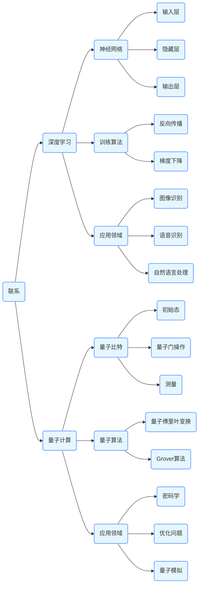

# 基于深度学习的AI量子计算优化算法设计

> 关键词：深度学习、AI、量子计算、优化算法、算法设计

> 摘要：本文聚焦于基于深度学习的AI量子计算优化算法设计。在当今科技飞速发展的背景下，量子计算因其强大的计算能力备受关注，而深度学习的引入为量子计算优化带来了新的思路和方法。文章首先介绍了相关背景，包括目的、预期读者等内容。接着阐述了核心概念及其联系，详细讲解了核心算法原理和具体操作步骤，并给出相应的Python代码示例。通过数学模型和公式深入剖析算法的理论基础，并举例说明。在项目实战部分，展示了开发环境搭建、源代码实现及解读。探讨了该算法的实际应用场景，推荐了学习资源、开发工具框架和相关论文著作。最后总结了未来发展趋势与挑战，并提供了常见问题解答和扩展阅读参考资料。

## 1. 背景介绍 
### 1.1 目的和范围
随着信息技术的不断进步，传统计算机在处理某些复杂问题时面临着计算能力的瓶颈。量子计算作为一种新兴的计算范式，利用量子力学的特性，如量子叠加和量子纠缠，能够在某些问题上实现指数级的加速。然而，量子计算系统存在着噪声、退相干等问题，限制了其实际应用的效果。深度学习作为人工智能领域的重要分支，具有强大的学习和建模能力。本文章的目的在于探讨如何将深度学习与量子计算相结合，设计出优化算法来提高量子计算的性能和稳定性。

本文章的范围涵盖了从核心概念的介绍、算法原理的推导、代码实现到实际应用场景的分析，以及相关学习资源和工具的推荐等方面。旨在为研究人员和开发者提供一个全面的关于基于深度学习的AI量子计算优化算法设计的知识体系。

### 1.2 预期读者
本文的预期读者包括但不限于以下几类人群：
- 量子计算领域的研究人员，希望通过引入深度学习的方法来解决量子计算中的优化问题。
- 人工智能和深度学习领域的研究者，对将深度学习技术应用于新兴的量子计算领域感兴趣。
- 计算机科学专业的学生，希望了解前沿的计算技术和跨学科的研究方向。
- 相关企业的技术开发者，寻求利用量子计算和深度学习技术提升产品性能和竞争力。

### 1.3 文档结构概述
本文将按照以下结构进行组织：
- 核心概念与联系：介绍深度学习、量子计算等核心概念，并阐述它们之间的联系。
- 核心算法原理 & 具体操作步骤：详细讲解基于深度学习的AI量子计算优化算法的原理，并给出具体的操作步骤和Python代码示例。
- 数学模型和公式 & 详细讲解 & 举例说明：通过数学模型和公式深入分析算法的理论基础，并通过具体例子进行说明。
- 项目实战：代码实际案例和详细解释说明：展示一个实际的项目案例，包括开发环境搭建、源代码实现和代码解读。
- 实际应用场景：探讨基于深度学习的AI量子计算优化算法在不同领域的实际应用场景。
- 工具和资源推荐：推荐相关的学习资源、开发工具框架和论文著作。
- 总结：未来发展趋势与挑战：总结该领域的未来发展趋势和面临的挑战。
- 附录：常见问题与解答：解答读者在学习和实践过程中可能遇到的常见问题。
- 扩展阅读 & 参考资料：提供相关的扩展阅读材料和参考资料。

### 1.4 术语表
#### 1.4.1 核心术语定义
- **深度学习（Deep Learning）**：是一类基于人工神经网络的机器学习技术，通过构建多层神经网络来学习数据的复杂模式和特征。
- **量子计算（Quantum Computing）**：利用量子力学的原理，如量子叠加和量子纠缠，进行信息处理和计算的一种新型计算方式。
- **优化算法（Optimization Algorithm）**：用于寻找最优解或近似最优解的算法，在本文章中主要用于提高量子计算的性能。
- **量子比特（Qubit）**：量子计算中的基本信息单元，类似于经典计算机中的比特，但可以同时处于多个状态的叠加。
- **量子门（Quantum Gate）**：用于对量子比特进行操作的基本逻辑单元，类似于经典计算机中的逻辑门。

#### 1.4.2 相关概念解释
- **量子叠加（Quantum Superposition）**：量子比特可以同时处于多个状态的叠加，例如一个量子比特可以同时处于0和1的叠加态，这使得量子计算机能够并行处理多个计算任务。
- **量子纠缠（Quantum Entanglement）**：多个量子比特之间存在一种特殊的关联，使得一个量子比特的状态会瞬间影响其他量子比特的状态，即使它们之间相隔很远。
- **神经网络（Neural Network）**：由大量神经元组成的计算模型，通过学习数据的特征和模式来进行预测和分类。
- **梯度下降（Gradient Descent）**：一种常用的优化算法，通过沿着目标函数的负梯度方向更新参数，以寻找目标函数的最小值。

#### 1.4.3 缩略词列表
- **AI（Artificial Intelligence）**：人工智能
- **ML（Machine Learning）**：机器学习
- **QPU（Quantum Processing Unit）**：量子处理单元
- **CNN（Convolutional Neural Network）**：卷积神经网络
- **RNN（Recurrent Neural Network）**：循环神经网络

## 2. 核心概念与联系 

### 2.1 深度学习概述
深度学习是机器学习的一个分支，它通过构建多层的神经网络来学习数据的复杂特征和模式。深度学习模型通常由输入层、隐藏层和输出层组成，隐藏层可以有多个。常见的深度学习模型包括卷积神经网络（CNN）、循环神经网络（RNN）、长短时记忆网络（LSTM）等。

深度学习的训练过程通常采用反向传播算法，通过不断调整神经网络的参数，使得模型的输出与真实标签之间的误差最小化。深度学习在图像识别、语音识别、自然语言处理等领域取得了巨大的成功。

### 2.2 量子计算概述
量子计算是基于量子力学原理的新型计算方式。与经典计算机使用比特（0或1）来表示信息不同，量子计算机使用量子比特（Qubit）。量子比特可以同时处于0和1的叠加态，这使得量子计算机能够并行处理多个计算任务。

量子计算的基本操作是通过量子门来实现的，量子门可以对量子比特进行旋转、翻转等操作。常见的量子门包括单比特门（如Pauli门、Hadamard门）和多比特门（如CNOT门）。

### 2.3 深度学习与量子计算的联系
深度学习和量子计算之间存在着密切的联系。一方面，深度学习可以用于优化量子计算的性能。例如，通过深度学习模型来学习量子系统的噪声特征，从而设计出更有效的纠错码和优化策略。另一方面，量子计算也可以为深度学习带来新的机遇。量子计算机的强大计算能力可以加速深度学习模型的训练过程，尤其是对于大规模的数据集和复杂的模型。

### 2.4 核心概念原理和架构的文本示意图
```plaintext
深度学习                量子计算
|                       |
|--- 神经网络            |--- 量子比特
|       |               |       |
|       |--- 输入层      |       |--- 初始态
|       |--- 隐藏层      |       |--- 量子门操作
|       |--- 输出层      |       |--- 测量
|                       |
|--- 训练算法            |--- 量子算法
|       |               |       |
|       |--- 反向传播    |       |--- 量子傅里叶变换
|       |--- 梯度下降    |       |--- Grover算法
|                       |
|--- 应用领域            |--- 应用领域
|       |               |       |
|       |--- 图像识别    |       |--- 密码学
|       |--- 语音识别    |       |--- 优化问题
|       |--- 自然语言处理|       |--- 量子模拟
```

### 2.5 Mermaid流程图


## 3. 核心算法原理 & 具体操作步骤 

### 3.1 算法原理
基于深度学习的AI量子计算优化算法的核心思想是利用深度学习模型来学习量子计算系统的特征和规律，从而设计出优化策略来提高量子计算的性能。具体来说，我们可以将量子计算的过程看作是一个黑盒，通过输入不同的量子态和量子门操作，观察输出的结果。深度学习模型可以学习输入和输出之间的映射关系，从而预测不同操作下的量子计算结果，并根据预测结果来调整量子门的参数，以达到优化的目的。

### 3.2 具体操作步骤
1. **数据采集**：收集量子计算系统的输入（量子态和量子门操作）和输出（测量结果）数据。
2. **模型构建**：选择合适的深度学习模型，如神经网络，构建输入和输出之间的映射关系。
3. **模型训练**：使用采集到的数据对深度学习模型进行训练，调整模型的参数，使得模型的预测结果与实际测量结果尽可能接近。
4. **优化策略设计**：根据训练好的深度学习模型，设计优化策略，如调整量子门的参数，以提高量子计算的性能。
5. **实验验证**：将优化策略应用到实际的量子计算系统中，验证优化效果。

### 3.3 Python源代码示例
```python
import numpy as np
import tensorflow as tf

# 数据采集
# 假设我们有100个样本，每个样本有10个输入特征和1个输出标签
num_samples = 100
input_dim = 10
output_dim = 1

# 生成随机输入数据
X = np.random.randn(num_samples, input_dim)
# 生成随机输出标签
y = np.random.randn(num_samples, output_dim)

# 模型构建
model = tf.keras.Sequential([
    tf.keras.layers.Dense(64, activation='relu', input_shape=(input_dim,)),
    tf.keras.layers.Dense(32, activation='relu'),
    tf.keras.layers.Dense(output_dim)
])

# 模型编译
model.compile(optimizer='adam', loss='mse')

# 模型训练
model.fit(X, y, epochs=10, batch_size=32)

# 优化策略设计
# 这里简单地根据模型的预测结果调整输入数据
new_X = X + 0.1 * model.predict(X)

# 实验验证
# 假设我们有一个新的量子计算系统，使用新的输入数据进行实验
# 这里只是简单示例，实际应用中需要根据具体情况进行实验
print("New input data:", new_X)
```

### 3.4 代码解释
1. **数据采集**：使用`numpy`生成随机的输入数据`X`和输出标签`y`，模拟量子计算系统的输入和输出数据。
2. **模型构建**：使用`TensorFlow`的`Sequential`模型构建一个简单的神经网络，包含两个隐藏层和一个输出层。
3. **模型编译**：使用`adam`优化器和均方误差损失函数对模型进行编译。
4. **模型训练**：使用`fit`方法对模型进行训练，训练10个epoch，每个batch包含32个样本。
5. **优化策略设计**：根据模型的预测结果调整输入数据，生成新的输入数据`new_X`。
6. **实验验证**：打印新的输入数据，实际应用中需要将新的输入数据应用到实际的量子计算系统中进行实验。

## 4. 数学模型和公式 & 详细讲解 & 举例说明 

### 4.1 深度学习模型的数学表示
假设我们有一个深度学习模型，输入为 $\mathbf{x} \in \mathbb{R}^n$，输出为 $\mathbf{y} \in \mathbb{R}^m$。模型可以表示为一系列的线性变换和非线性激活函数的组合：

$$
\begin{align*}
\mathbf{z}_1 &= W_1\mathbf{x} + \mathbf{b}_1 \\
\mathbf{a}_1 &= \sigma(\mathbf{z}_1) \\
\mathbf{z}_2 &= W_2\mathbf{a}_1 + \mathbf{b}_2 \\
\mathbf{a}_2 &= \sigma(\mathbf{z}_2) \\
&\cdots \\
\mathbf{z}_L &= W_L\mathbf{a}_{L - 1} + \mathbf{b}_L \\
\mathbf{y} &= \mathbf{a}_L = \sigma(\mathbf{z}_L)
\end{align*}
$$

其中，$W_i \in \mathbb{R}^{d_i \times d_{i - 1}}$ 是第 $i$ 层的权重矩阵，$\mathbf{b}_i \in \mathbb{R}^{d_i}$ 是第 $i$ 层的偏置向量，$\sigma(\cdot)$ 是非线性激活函数，如ReLU函数：

$$
\sigma(x) = \max(0, x)
$$

### 4.2 损失函数
为了训练深度学习模型，我们需要定义一个损失函数来衡量模型的预测结果与真实标签之间的误差。常见的损失函数包括均方误差（MSE）和交叉熵损失。对于回归问题，我们通常使用均方误差损失：

$$
L(\mathbf{y}, \hat{\mathbf{y}}) = \frac{1}{N} \sum_{i = 1}^{N} (\mathbf{y}_i - \hat{\mathbf{y}}_i)^2
$$

其中，$\mathbf{y}_i$ 是第 $i$ 个样本的真实标签，$\hat{\mathbf{y}}_i$ 是模型的预测结果，$N$ 是样本数量。

### 4.3 梯度下降算法
为了最小化损失函数，我们可以使用梯度下降算法。梯度下降算法的基本思想是沿着损失函数的负梯度方向更新模型的参数：

$$
\theta_{t + 1} = \theta_t - \alpha \nabla L(\theta_t)
$$

其中，$\theta$ 是模型的参数，$\alpha$ 是学习率，$\nabla L(\theta_t)$ 是损失函数在 $\theta_t$ 处的梯度。

### 4.4 举例说明
假设我们有一个简单的线性回归问题，输入为 $x \in \mathbb{R}$，输出为 $y \in \mathbb{R}$。我们可以构建一个简单的神经网络模型：

$$
y = Wx + b
$$

损失函数为均方误差损失：

$$
L(W, b) = \frac{1}{N} \sum_{i = 1}^{N} (y_i - (Wx_i + b))^2
$$

为了最小化损失函数，我们需要计算损失函数对 $W$ 和 $b$ 的梯度：

$$
\begin{align*}
\frac{\partial L}{\partial W} &= \frac{2}{N} \sum_{i = 1}^{N} (y_i - (Wx_i + b))(-x_i) \\
\frac{\partial L}{\partial b} &= \frac{2}{N} \sum_{i = 1}^{N} (y_i - (Wx_i + b))(-1)
\end{align*}
$$

然后使用梯度下降算法更新 $W$ 和 $b$：

$$
\begin{align*}
W_{t + 1} &= W_t - \alpha \frac{\partial L}{\partial W} \\
b_{t + 1} &= b_t - \alpha \frac{\partial L}{\partial b}
\end{align*}
$$

下面是一个简单的Python代码示例：
```python
import numpy as np

# 生成随机数据
x = np.random.randn(100)
y = 2 * x + 1 + 0.1 * np.random.randn(100)

# 初始化参数
W = 0
b = 0

# 学习率
alpha = 0.01

# 迭代次数
num_iterations = 100

# 梯度下降算法
for i in range(num_iterations):
    # 计算预测值
    y_pred = W * x + b
    
    # 计算损失函数
    loss = np.mean((y - y_pred)**2)
    
    # 计算梯度
    dW = 2 * np.mean((y - y_pred) * (-x))
    db = 2 * np.mean((y - y_pred) * (-1))
    
    # 更新参数
    W = W - alpha * dW
    b = b - alpha * db
    
    # 打印损失函数
    if i % 10 == 0:
        print(f'Iteration {i}, Loss: {loss}')

print(f'Final W: {W}, Final b: {b}')
```

在这个示例中，我们使用梯度下降算法来拟合一个简单的线性回归模型。通过不断更新参数 $W$ 和 $b$，使得损失函数逐渐减小，最终得到一个较好的拟合结果。

## 5. 项目实战：代码实际案例和详细解释说明 

### 5.1  开发环境搭建
#### 5.1.1 安装Python
首先，你需要安装Python。建议使用Python 3.7及以上版本。你可以从Python官方网站（https://www.python.org/downloads/）下载并安装Python。

#### 5.1.2 安装深度学习框架
我们使用TensorFlow作为深度学习框架。可以使用以下命令安装TensorFlow：
```sh
pip install tensorflow
```

#### 5.1.3 安装量子计算库
为了进行量子计算的模拟和实验，我们可以使用Qiskit库。可以使用以下命令安装Qiskit：
```sh
pip install qiskit
```

### 5.2  源代码详细实现和代码解读
#### 5.2.1 数据生成
我们首先生成一些量子计算的模拟数据。假设我们有一个单量子比特的系统，输入是量子比特的初始态，输出是经过一系列量子门操作后的测量结果。

```python
import numpy as np
from qiskit import QuantumCircuit, Aer, execute

# 生成随机量子态
def generate_random_state():
    theta = np.random.uniform(0, 2 * np.pi)
    phi = np.random.uniform(0, 2 * np.pi)
    state = np.array([np.cos(theta / 2), np.exp(1j * phi) * np.sin(theta / 2)])
    return state

# 量子门操作
def quantum_gate_operation(state):
    circuit = QuantumCircuit(1)
    circuit.initialize(state, 0)
    circuit.h(0)  # Hadamard门
    circuit.t(0)  # T门
    circuit.h(0)  # Hadamard门
    backend = Aer.get_backend('statevector_simulator')
    job = execute(circuit, backend)
    result = job.result()
    output_state = result.get_statevector(circuit)
    return output_state

# 生成数据
num_samples = 100
X = []
y = []
for _ in range(num_samples):
    input_state = generate_random_state()
    output_state = quantum_gate_operation(input_state)
    X.append(np.concatenate([input_state.real, input_state.imag]))
    y.append(np.concatenate([output_state.real, output_state.imag]))

X = np.array(X)
y = np.array(y)
```

#### 5.2.2 深度学习模型构建
我们使用TensorFlow构建一个简单的神经网络模型来学习输入和输出之间的映射关系。

```python
import tensorflow as tf

model = tf.keras.Sequential([
    tf.keras.layers.Dense(64, activation='relu', input_shape=(4,)),
    tf.keras.layers.Dense(32, activation='relu'),
    tf.keras.layers.Dense(4)
])

model.compile(optimizer='adam', loss='mse')
```

#### 5.2.3 模型训练
使用生成的数据对模型进行训练。

```python
model.fit(X, y, epochs=10, batch_size=32)
```

#### 5.2.4 优化策略设计
根据训练好的模型，我们可以设计优化策略。例如，我们可以尝试调整量子门的参数，使得模型的预测结果更接近理想的输出。

```python
# 假设我们要优化Hadamard门的参数
# 这里只是简单示例，实际应用中需要更复杂的优化方法
new_circuit = QuantumCircuit(1)
input_state = generate_random_state()
new_circuit.initialize(input_state, 0)
# 调整Hadamard门的参数
# 这里只是简单地乘以一个系数，实际应用中需要更复杂的调整方法
new_circuit.rx(np.pi / 4, 0)
new_circuit.h(0)
new_circuit.t(0)
new_circuit.h(0)
backend = Aer.get_backend('statevector_simulator')
job = execute(new_circuit, backend)
result = job.result()
new_output_state = result.get_statevector(new_circuit)

# 使用模型进行预测
input_data = np.concatenate([input_state.real, input_state.imag])
predicted_output = model.predict(np.array([input_data]))

# 计算误差
error = np.linalg.norm(new_output_state - predicted_output[0].reshape(2, 2).view(complex).flatten())
print(f'Error: {error}')
```

### 5.3  代码解读与分析
#### 5.3.1 数据生成部分
- `generate_random_state`函数：生成随机的单量子比特态。
- `quantum_gate_operation`函数：对输入的量子态进行一系列量子门操作，并返回操作后的量子态。
- 通过循环生成多个样本的输入和输出数据。

#### 5.3.2 深度学习模型构建部分
- 使用`tf.keras.Sequential`构建一个简单的神经网络模型，包含两个隐藏层和一个输出层。
- 使用`adam`优化器和均方误差损失函数对模型进行编译。

#### 5.3.3 模型训练部分
使用`fit`方法对模型进行训练，训练10个epoch，每个batch包含32个样本。

#### 5.3.4 优化策略设计部分
- 尝试调整量子门的参数，构建新的量子电路。
- 使用训练好的模型对新的输入数据进行预测。
- 计算预测结果与实际输出之间的误差，评估优化效果。

## 6. 实际应用场景 
### 6.1 量子密码学
在量子密码学中，量子密钥分发（QKD）是一种基于量子力学原理的安全通信方法。然而，QKD系统存在着噪声和干扰等问题，影响了密钥分发的效率和安全性。基于深度学习的AI量子计算优化算法可以用于优化QKD系统的参数，提高密钥分发的效率和安全性。例如，通过深度学习模型学习量子信道的噪声特征，设计出更有效的纠错码和密钥生成算法。

### 6.2 量子模拟
量子模拟是量子计算的一个重要应用领域，它可以用于模拟量子系统的行为和性质。然而，量子模拟的计算复杂度非常高，传统计算机在处理大规模量子系统时面临着巨大的挑战。基于深度学习的AI量子计算优化算法可以用于优化量子模拟的算法和参数，提高模拟的效率和精度。例如，通过深度学习模型学习量子系统的特征和规律，设计出更有效的量子模拟算法。

### 6.3 优化问题求解
许多实际问题都可以转化为优化问题，如旅行商问题、资源分配问题等。量子计算在解决优化问题方面具有潜在的优势，但是量子算法的设计和实现仍然面临着许多挑战。基于深度学习的AI量子计算优化算法可以用于设计和优化量子算法，提高解决优化问题的效率和性能。例如，通过深度学习模型学习优化问题的特征和规律，设计出更有效的量子优化算法。

### 6.4 药物研发
药物研发是一个复杂而漫长的过程，需要大量的实验和计算。量子计算可以用于模拟分子的结构和性质，从而加速药物研发的过程。基于深度学习的AI量子计算优化算法可以用于优化量子模拟的算法和参数，提高模拟的效率和精度。例如，通过深度学习模型学习分子的特征和规律，设计出更有效的量子模拟算法，从而加速药物研发的过程。

## 7. 工具和资源推荐
### 7.1 学习资源推荐
#### 7.1.1 书籍推荐
- 《深度学习》（Deep Learning）：由Ian Goodfellow、Yoshua Bengio和Aaron Courville所著，是深度学习领域的经典教材，涵盖了深度学习的基本概念、算法和应用。
- 《量子计算与量子信息》（Quantum Computation and Quantum Information）：由Michael A. Nielsen和Isaac L. Chuang所著，是量子计算领域的经典教材，涵盖了量子计算的基本概念、算法和应用。
- 《Python深度学习》（Deep Learning with Python）：由Francois Chollet所著，介绍了如何使用Python和Keras进行深度学习的开发和实践。

#### 7.1.2 在线课程
- Coursera上的“深度学习专项课程”（Deep Learning Specialization）：由Andrew Ng教授讲授，涵盖了深度学习的基础知识、卷积神经网络、循环神经网络等内容。
- edX上的“量子计算基础”（Fundamentals of Quantum Computation）：由麻省理工学院的教授讲授，介绍了量子计算的基本概念和算法。
- Udemy上的“Python量子计算入门”（Introduction to Quantum Computing with Python）：介绍了如何使用Python和Qiskit进行量子计算的开发和实践。

#### 7.1.3 技术博客和网站
- Medium上的“Towards Data Science”：是一个专注于数据科学和机器学习的技术博客，上面有许多关于深度学习和量子计算的文章。
- arXiv.org：是一个开放获取的预印本服务器，上面有许多关于量子计算和深度学习的最新研究成果。
- Qiskit官方文档：提供了Qiskit库的详细文档和教程，是学习量子计算的重要资源。

### 7.2 开发工具框架推荐
#### 7.2.1 IDE和编辑器
- PyCharm：是一款专业的Python集成开发环境，提供了丰富的功能和插件，适合进行深度学习和量子计算的开发。
- Jupyter Notebook：是一个交互式的开发环境，适合进行数据探索、模型训练和实验验证。
- Visual Studio Code：是一款轻量级的代码编辑器，支持多种编程语言和插件，适合进行快速开发和调试。

#### 7.2.2 调试和性能分析工具
- TensorBoard：是TensorFlow提供的一个可视化工具，可以用于监控模型的训练过程、分析模型的性能和可视化数据。
- Qiskit Aer：是Qiskit提供的一个量子计算模拟器，支持多种模拟模式和性能分析工具。
- PyTorch Profiler：是PyTorch提供的一个性能分析工具，可以用于分析模型的计算时间和内存使用情况。

#### 7.2.3 相关框架和库
- TensorFlow：是一个广泛使用的深度学习框架，提供了丰富的工具和库，支持多种深度学习模型的开发和训练。
- PyTorch：是另一个流行的深度学习框架，具有动态图的特点，适合进行快速开发和实验。
- Qiskit：是IBM开发的一个量子计算框架，提供了丰富的工具和库，支持量子算法的设计、模拟和实验。

### 7.3 相关论文著作推荐
#### 7.3.1 经典论文
- “A Fast Quantum Mechanical Algorithm for Database Search”（Lov Grover，1996）：提出了Grover算法，是量子计算中的经典算法之一，用于在无序数据库中快速搜索目标元素。
- “Quantum Computing in the NISQ era and beyond”（John Preskill，2018）：提出了NISQ（Noisy Intermediate-Scale Quantum）的概念，讨论了当前量子计算技术的发展现状和挑战。
- “Deep Learning”（Yoshua Bengio、Ian Goodfellow和Aaron Courville，2015）：是深度学习领域的经典综述论文，涵盖了深度学习的基本概念、算法和应用。

#### 7.3.2 最新研究成果
- “Quantum Machine Learning: What Quantum Computing Means to Data Mining”（Peter Wittek，2014）：探讨了量子计算与机器学习的结合，介绍了量子机器学习的基本概念和算法。
- “Quantum Neural Networks for Natural Language Processing”（Vedran Dunjko、Hans J. Briegel，2016）：提出了量子神经网络的概念，并将其应用于自然语言处理领域。
- “Hybrid Quantum-Classical Algorithms for Machine Learning”（Sergio Boixo、Vadim N. Smelyanskiy，2018）：介绍了混合量子-经典算法在机器学习中的应用，讨论了如何利用量子计算的优势来加速机器学习模型的训练。

#### 7.3.3 应用案例分析
- “Quantum Computing for Drug Discovery”（Alán Aspuru-Guzik，2018）：介绍了量子计算在药物研发中的应用，讨论了如何利用量子计算来模拟分子的结构和性质，加速药物研发的过程。
- “Quantum Optimization for Financial Portfolio Selection”（Patrick Rebentrost、Seth Lloyd，2018）：介绍了量子计算在金融投资组合选择中的应用，讨论了如何利用量子算法来优化投资组合，提高投资收益。
- “Quantum Machine Learning for Image Recognition”（Maria Schuld、Nathan Killoran，2018）：介绍了量子机器学习在图像识别中的应用，讨论了如何利用量子算法来提高图像识别的准确率和效率。

## 8. 总结：未来发展趋势与挑战
### 8.1 未来发展趋势
#### 8.1.1 算法创新
未来，基于深度学习的AI量子计算优化算法将不断创新。研究人员将探索更多的深度学习模型和量子算法的结合方式，设计出更高效、更准确的优化算法。例如，将强化学习与量子计算相结合，实现自适应的量子计算优化。

#### 8.1.2 硬件发展
随着量子计算硬件技术的不断发展，量子比特的数量和质量将不断提高。这将为基于深度学习的AI量子计算优化算法提供更强大的计算资源，推动算法的实际应用。例如，未来的量子计算机可能能够处理大规模的量子系统，实现更复杂的量子模拟和优化。

#### 8.1.3 跨学科融合
基于深度学习的AI量子计算优化算法是一个跨学科的研究领域，未来将与其他领域进行更深入的融合。例如，与生物信息学、材料科学等领域相结合，解决这些领域中的复杂问题。

### 8.2 挑战
#### 8.2.1 噪声和退相干问题
量子计算系统存在着噪声和退相干等问题，这会影响量子计算的性能和稳定性。如何利用深度学习来解决噪声和退相干问题，是未来需要面临的一个挑战。

#### 8.2.2 算法复杂度问题
深度学习模型和量子算法的复杂度都比较高，如何设计出高效的算法，降低计算复杂度，是未来需要解决的一个问题。

#### 8.2.3 实验验证问题
基于深度学习的AI量子计算优化算法需要进行实验验证，但是目前量子计算实验的成本较高，实验环境也比较复杂。如何设计出有效的实验方案，验证算法的有效性和实用性，是未来需要面临的一个挑战。

## 9. 附录：常见问题与解答
### 9.1 什么是深度学习和量子计算的结合？
深度学习和量子计算的结合是指将深度学习的方法和技术应用于量子计算领域，以提高量子计算的性能和效率。例如，利用深度学习模型来学习量子系统的特征和规律，设计出更有效的量子算法和优化策略。

### 9.2 基于深度学习的AI量子计算优化算法有哪些应用场景？
基于深度学习的AI量子计算优化算法可以应用于量子密码学、量子模拟、优化问题求解、药物研发等领域。例如，在量子密码学中，可以用于优化量子密钥分发系统的参数，提高密钥分发的效率和安全性。

### 9.3 如何学习基于深度学习的AI量子计算优化算法？
可以通过阅读相关的书籍、论文和教程，参加在线课程和培训，进行实践项目等方式来学习基于深度学习的AI量子计算优化算法。同时，需要掌握深度学习和量子计算的基础知识，以及相关的编程语言和工具。

### 9.4 目前基于深度学习的AI量子计算优化算法存在哪些挑战？
目前基于深度学习的AI量子计算优化算法存在着噪声和退相干问题、算法复杂度问题、实验验证问题等挑战。需要进一步研究和探索，寻找有效的解决方案。

## 10. 扩展阅读 & 参考资料
### 10.1 扩展阅读
- “Quantum Computing: An Applied Approach”（Jack D. Hidary，2019）：介绍了量子计算的基本概念和算法，并结合实际应用进行了详细的讲解。
- “Machine Learning with Quantum Computers”（Maria Schuld、Francesco Petruccione，2018）：探讨了机器学习与量子计算的结合，介绍了量子机器学习的基本概念和算法。
- “Quantum Information Science: An Introduction”（Paulo Nussenzveig，2010）：介绍了量子信息科学的基本概念和理论，包括量子比特、量子门、量子算法等。

### 10.2 参考资料
- Nielsen, M. A., & Chuang, I. L. (2010). Quantum Computation and Quantum Information: 10th Anniversary Edition. Cambridge University Press.
- Goodfellow, I. J., Bengio, Y., & Courville, A. (2016). Deep Learning. MIT Press.
- Grover, L. K. (1996). A fast quantum mechanical algorithm for database search. Proceedings of the twenty-eighth annual ACM symposium on Theory of computing.
- Preskill, J. (2018). Quantum Computing in the NISQ era and beyond. Quantum, 2, 79.

作者：AI天才研究院/AI Genius Institute & 禅与计算机程序设计艺术 /Zen And The Art of Computer Programming