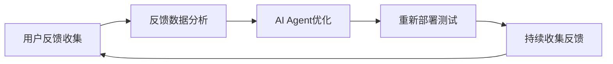

# 基于用户反馈的AI Agent迭代优化流程

> 关键词：用户反馈、AI Agent、迭代优化、流程设计、机器学习

> 摘要：本文深入探讨了基于用户反馈的AI Agent迭代优化流程。首先介绍了该研究的背景、目的、预期读者和文档结构，明确了相关术语。接着阐述了核心概念及其联系，通过文本示意图和Mermaid流程图进行清晰展示。详细讲解了核心算法原理，并用Python代码进行具体说明，同时给出了相关数学模型和公式，并举例分析。在项目实战部分，展示了开发环境搭建、源代码实现与解读。还探讨了实际应用场景，推荐了学习资源、开发工具框架以及相关论文著作。最后总结了未来发展趋势与挑战，提供了常见问题解答和扩展阅读参考资料，旨在为开发者和研究者提供全面的技术指导，推动AI Agent在用户反馈驱动下不断优化。

## 1. 背景介绍 
### 1.1 目的和范围
在当今数字化时代，AI Agent被广泛应用于各种领域，如智能客服、智能家居、自动驾驶等。然而，由于实际应用场景的复杂性和多样性，AI Agent往往难以在初始版本就达到完美的性能。用户反馈作为一种宝贵的信息来源，能够反映出AI Agent在实际使用中存在的问题和不足之处。本研究的目的在于设计一套基于用户反馈的AI Agent迭代优化流程，通过收集、分析和利用用户反馈，不断改进AI Agent的性能和用户体验。

本研究的范围涵盖了从用户反馈的收集到AI Agent迭代优化的整个过程，包括反馈数据的预处理、特征提取、模型训练和评估等关键环节。同时，还将探讨如何将用户反馈与现有的AI Agent开发和部署流程相结合，实现高效、可持续的迭代优化。

### 1.2 预期读者
本文的预期读者主要包括以下几类人群：
- **AI开发者**：希望通过用户反馈来优化自己开发的AI Agent，提高其性能和用户满意度。
- **数据科学家**：对如何处理和分析用户反馈数据，以及如何将其应用于机器学习模型训练感兴趣。
- **产品经理**：负责AI Agent产品的规划和管理，需要了解如何利用用户反馈来驱动产品的迭代升级。
- **研究人员**：从事AI Agent相关研究工作，希望深入了解基于用户反馈的迭代优化方法和技术。

### 1.3 文档结构概述
本文将按照以下结构进行组织：
- **核心概念与联系**：介绍AI Agent、用户反馈等核心概念，并阐述它们之间的联系，通过文本示意图和Mermaid流程图进行直观展示。
- **核心算法原理 & 具体操作步骤**：详细讲解用于处理用户反馈和优化AI Agent的核心算法原理，并用Python代码实现具体操作步骤。
- **数学模型和公式 & 详细讲解 & 举例说明**：给出相关的数学模型和公式，并结合具体例子进行详细讲解。
- **项目实战：代码实际案例和详细解释说明**：通过一个实际项目案例，展示开发环境搭建、源代码实现和代码解读。
- **实际应用场景**：探讨基于用户反馈的AI Agent迭代优化流程在不同领域的实际应用场景。
- **工具和资源推荐**：推荐学习资源、开发工具框架和相关论文著作。
- **总结：未来发展趋势与挑战**：总结基于用户反馈的AI Agent迭代优化流程的未来发展趋势和面临的挑战。
- **附录：常见问题与解答**：提供常见问题的解答，帮助读者更好地理解和应用本文介绍的内容。
- **扩展阅读 & 参考资料**：列出扩展阅读的相关资料和参考文献。

### 1.4 术语表
#### 1.4.1 核心术语定义
- **AI Agent**：是一种能够感知环境、自主决策并采取行动以实现特定目标的智能体。它可以是软件程序、机器人或其他具有智能行为的实体。
- **用户反馈**：指用户在使用AI Agent过程中提供的关于其性能、功能、易用性等方面的意见和建议。反馈形式可以包括文本评论、评分、投诉等。
- **迭代优化**：是一种不断重复改进的过程，通过对AI Agent进行多次迭代更新，逐步提高其性能和用户体验。

#### 1.4.2 相关概念解释
- **机器学习**：是一门多领域交叉学科，涉及概率论、统计学、逼近论、凸分析、算法复杂度理论等多门学科。它专门研究计算机怎样模拟或实现人类的学习行为，以获取新的知识或技能，重新组织已有的知识结构使之不断改善自身的性能。在AI Agent迭代优化中，机器学习算法常用于根据用户反馈数据对模型进行训练和更新。
- **自然语言处理**：是计算机科学领域与人工智能领域中的一个重要方向。它研究能实现人与计算机之间用自然语言进行有效通信的各种理论和方法。在处理用户反馈时，自然语言处理技术可用于对文本反馈进行情感分析、关键词提取等操作。

#### 1.4.3 缩略词列表
- **ML**：Machine Learning，机器学习
- **NLP**：Natural Language Processing，自然语言处理
- **RNN**：Recurrent Neural Network，循环神经网络
- **LSTM**：Long Short-Term Memory，长短期记忆网络

## 2. 核心概念与联系 
### 核心概念原理
#### AI Agent
AI Agent是一个具有自主性、反应性、社会性和能动性的智能实体。它通过传感器感知环境信息，利用内部的决策机制对感知到的信息进行处理和分析，然后通过执行器采取相应的行动。AI Agent的性能取决于其决策机制和学习能力，而学习能力可以通过不断接收用户反馈并进行迭代优化来提升。

#### 用户反馈
用户反馈是用户在与AI Agent交互过程中产生的信息，它反映了用户对AI Agent的实际使用体验和期望。用户反馈可以分为正向反馈和负向反馈，正向反馈表示用户对AI Agent的某个方面感到满意，负向反馈则表示用户遇到了问题或不满意的地方。通过对用户反馈的收集和分析，可以了解AI Agent存在的问题和改进方向。

#### 迭代优化
迭代优化是一个持续的过程，它基于用户反馈对AI Agent进行逐步改进。在每次迭代中，首先收集用户反馈数据，然后对数据进行预处理和分析，提取有用的信息。接着，根据分析结果对AI Agent的模型或参数进行调整和更新。最后，将更新后的AI Agent重新部署到实际环境中，继续收集用户反馈，开始下一轮迭代。

### 架构的文本示意图
```plaintext
+-------------------+          +-------------------+          +-------------------+
|    用户反馈收集    | -------> |    反馈数据分析    | -------> |    AI Agent优化    |
+-------------------+          +-------------------+          +-------------------+
                                                         |
                                                         v
                                                +-------------------+
                                                |    重新部署测试    |
                                                +-------------------+
                                                         |
                                                         v
                                                +-------------------+
                                                |    持续收集反馈    |
                                                +-------------------+
```

### Mermaid流程图


## 3. 核心算法原理 & 具体操作步骤 
### 核心算法原理
在基于用户反馈的AI Agent迭代优化流程中，主要涉及到以下几种核心算法：
#### 情感分析算法
情感分析用于判断用户反馈的情感倾向，即正向、负向或中性。常见的情感分析算法包括基于机器学习的方法和基于深度学习的方法。基于机器学习的方法通常使用分类算法，如朴素贝叶斯、支持向量机等，对文本进行分类。基于深度学习的方法则使用神经网络，如卷积神经网络（CNN）、循环神经网络（RNN）及其变体LSTM等，自动学习文本的特征和情感信息。

#### 关键词提取算法
关键词提取用于从用户反馈文本中提取出关键的信息和主题。常见的关键词提取算法包括TF-IDF（词频-逆文档频率）、TextRank等。TF-IDF通过计算词语在文档中的频率和在整个语料库中的逆频率，来确定词语的重要性。TextRank则是一种基于图的排序算法，通过构建词语之间的图关系，对词语进行排序，提取出重要的关键词。

#### 模型更新算法
模型更新算法用于根据用户反馈数据对AI Agent的模型进行更新。常见的模型更新算法包括梯度下降法、随机梯度下降法等。这些算法通过最小化损失函数，不断调整模型的参数，使模型的输出与用户的期望更加接近。

### 具体操作步骤
#### 步骤1：用户反馈收集
通过各种渠道收集用户反馈，如在线问卷、用户评价、日志记录等。将收集到的反馈数据存储到数据库中，以便后续处理。

#### 步骤2：反馈数据预处理
对收集到的反馈数据进行预处理，包括清洗、分词、去除停用词等操作。清洗操作主要是去除数据中的噪声和无用信息，如HTML标签、特殊字符等。分词操作将文本分割成单个的词语，去除停用词则是去除一些常见的无意义词语，如“的”、“是”、“在”等。

#### 步骤3：情感分析和关键词提取
使用情感分析算法和关键词提取算法对预处理后的反馈数据进行分析。通过情感分析判断反馈的情感倾向，通过关键词提取提取出关键信息和主题。

#### 步骤4：模型更新
根据情感分析和关键词提取的结果，确定需要对AI Agent的哪些部分进行优化。使用模型更新算法对AI Agent的模型进行更新，调整模型的参数。

#### 步骤5：重新部署测试
将更新后的AI Agent重新部署到实际环境中进行测试，收集新的用户反馈，评估优化效果。

### Python源代码实现
```python
import pandas as pd
from sklearn.feature_extraction.text import TfidfVectorizer
from sklearn.naive_bayes import MultinomialNB
from sklearn.model_selection import train_test_split
from sklearn.metrics import accuracy_score

# 步骤1：用户反馈收集（假设反馈数据存储在CSV文件中）
data = pd.read_csv('user_feedback.csv')

# 步骤2：反馈数据预处理
import re
import nltk
from nltk.corpus import stopwords
from nltk.tokenize import word_tokenize

nltk.download('stopwords')
nltk.download('punkt')

def preprocess_text(text):
    text = re.sub(r'[^a-zA-Z]', ' ', text)  # 去除非字母字符
    text = text.lower()  # 转换为小写
    tokens = word_tokenize(text)  # 分词
    stop_words = set(stopwords.words('english'))
    filtered_tokens = [token for token in tokens if token not in stop_words]  # 去除停用词
    return ' '.join(filtered_tokens)

data['processed_text'] = data['feedback_text'].apply(preprocess_text)

# 步骤3：情感分析和关键词提取
# 情感分析（使用朴素贝叶斯分类器）
X = data['processed_text']
y = data['sentiment']  # 假设数据集中有情感标签

vectorizer = TfidfVectorizer()
X_vectorized = vectorizer.fit_transform(X)

X_train, X_test, y_train, y_test = train_test_split(X_vectorized, y, test_size=0.2, random_state=42)

clf = MultinomialNB()
clf.fit(X_train, y_train)

y_pred = clf.predict(X_test)
accuracy = accuracy_score(y_test, y_pred)
print(f"情感分析准确率: {accuracy}")

# 关键词提取（使用TF-IDF）
feature_names = vectorizer.get_feature_names_out()
doc = data['processed_text'][0]  # 取第一条反馈文本为例
doc_vector = vectorizer.transform([doc])
feature_index = doc_vector.nonzero()[1]
tfidf_scores = zip(feature_index, [doc_vector[0, x] for x in feature_index])
sorted_tfidf_scores = sorted(tfidf_scores, key=lambda x: x[1], reverse=True)
top_keywords = [feature_names[i] for i, score in sorted_tfidf_scores[:5]]
print(f"关键词: {top_keywords}")

# 步骤4：模型更新（假设AI Agent是一个简单的机器学习模型）
# 这里简单模拟模型更新，实际中需要根据具体情况进行操作
new_X = vectorizer.transform(data['processed_text'])
new_y = data['sentiment']
clf.partial_fit(new_X, new_y)

# 步骤5：重新部署测试（此处省略实际部署代码）
```

## 4. 数学模型和公式 & 详细讲解 & 举例说明 
### 情感分析中的数学模型和公式
#### 朴素贝叶斯分类器
朴素贝叶斯分类器基于贝叶斯定理，假设特征之间相互独立。对于文本分类问题，给定一个文本 $x=(x_1,x_2,\cdots,x_n)$，其中 $x_i$ 表示文本中的第 $i$ 个词语，分类器的目标是预测文本的类别 $y$。根据贝叶斯定理，有：

$$P(y|x)=\frac{P(x|y)P(y)}{P(x)}$$

由于 $P(x)$ 对于所有类别都是相同的，因此可以忽略不计。朴素贝叶斯分类器的预测类别为：

$$\hat{y}=\arg\max_{y}P(y)\prod_{i=1}^{n}P(x_i|y)$$

其中，$P(y)$ 是类别 $y$ 的先验概率，$P(x_i|y)$ 是在类别 $y$ 下词语 $x_i$ 出现的条件概率。

#### 举例说明
假设我们有一个文本分类任务，要判断文本是正向还是负向。我们有一个训练数据集，包含 100 条正向文本和 100 条负向文本。在正向文本中，“good” 这个词出现了 50 次，在负向文本中，“good” 这个词出现了 10 次。现在有一个新的文本 “This is a good product”，我们要预测它的类别。

首先，计算先验概率：
$P(正向)=\frac{100}{200}=0.5$
$P(负向)=\frac{100}{200}=0.5$

然后，计算条件概率：
$P(“good”|正向)=\frac{50}{正向文本中所有词语的总数}$
$P(“good”|负向)=\frac{10}{负向文本中所有词语的总数}$

假设正向文本中所有词语的总数为 500，负向文本中所有词语的总数为 400，则：
$P(“good”|正向)=\frac{50}{500}=0.1$
$P(“good”|负向)=\frac{10}{400}=0.025$

对于新文本 “This is a good product”，由于其他词语的条件概率计算方法相同，这里只考虑 “good” 这个词。

$P(正向|文本)\propto P(正向)P(“good”|正向)=0.5\times0.1 = 0.05$
$P(负向|文本)\propto P(负向)P(“good”|负向)=0.5\times0.025 = 0.0125$

因为 $0.05>0.0125$，所以预测该文本为正向。

### 关键词提取中的数学模型和公式
#### TF-IDF
TF-IDF（词频-逆文档频率）是一种用于信息检索与文本挖掘的常用加权技术。对于一个词语 $t$ 在文档 $d$ 中的 TF-IDF 值，计算公式如下：

$$TF - IDF(t,d)=TF(t,d)\times IDF(t)$$

其中，$TF(t,d)$ 是词语 $t$ 在文档 $d$ 中的词频，即词语 $t$ 在文档 $d$ 中出现的次数除以文档 $d$ 中词语的总数。$IDF(t)$ 是词语 $t$ 的逆文档频率，计算公式为：

$$IDF(t)=\log\frac{N}{df(t)}$$

其中，$N$ 是语料库中文档的总数，$df(t)$ 是包含词语 $t$ 的文档数。

#### 举例说明
假设我们有一个语料库，包含 100 篇文档。在某一篇文档 $d$ 中，“apple” 这个词出现了 5 次，文档 $d$ 中词语的总数为 100。在整个语料库中，有 20 篇文档包含 “apple” 这个词。

首先，计算词频：
$TF(“apple”,d)=\frac{5}{100}=0.05$

然后，计算逆文档频率：
$IDF(“apple”)=\log\frac{100}{20}=\log5\approx1.609$

最后，计算 TF-IDF 值：
$TF - IDF(“apple”,d)=0.05\times1.609 = 0.08045$

### 模型更新中的数学模型和公式
#### 梯度下降法
梯度下降法是一种常用的优化算法，用于最小化损失函数。假设我们有一个损失函数 $L(\theta)$，其中 $\theta$ 是模型的参数。梯度下降法的更新公式为：

$$\theta_{t+1}=\theta_{t}-\alpha\nabla L(\theta_{t})$$

其中，$\theta_{t}$ 是第 $t$ 次迭代时的参数值，$\alpha$ 是学习率，$\nabla L(\theta_{t})$ 是损失函数在 $\theta_{t}$ 处的梯度。

#### 举例说明
假设我们有一个简单的线性回归模型 $y = \theta_0+\theta_1x$，损失函数为均方误差：

$$L(\theta)=\frac{1}{2m}\sum_{i=1}^{m}(y^{(i)}-(\theta_0+\theta_1x^{(i)}))^2$$

其中，$m$ 是样本数，$y^{(i)}$ 是第 $i$ 个样本的真实值，$x^{(i)}$ 是第 $i$ 个样本的特征值。

计算梯度：
$$\frac{\partial L(\theta)}{\partial\theta_0}=\frac{1}{m}\sum_{i=1}^{m}(y^{(i)}-(\theta_0+\theta_1x^{(i)}))$$
$$\frac{\partial L(\theta)}{\partial\theta_1}=\frac{1}{m}\sum_{i=1}^{m}(y^{(i)}-(\theta_0+\theta_1x^{(i)}))x^{(i)}$$

假设初始参数 $\theta_0 = 0$，$\theta_1 = 0$，学习率 $\alpha = 0.01$，有一个样本 $(x^{(1)} = 1, y^{(1)} = 2)$。

第一次迭代：
$$\frac{\partial L(\theta)}{\partial\theta_0}=\frac{1}{1}(2-(0 + 0\times1)) = 2$$
$$\frac{\partial L(\theta)}{\partial\theta_1}=\frac{1}{1}(2-(0 + 0\times1))\times1 = 2$$

$$\theta_0^{new}=0 - 0.01\times2=-0.02$$
$$\theta_1^{new}=0 - 0.01\times2=-0.02$$

继续迭代，直到损失函数收敛。

## 5. 项目实战：代码实际案例和详细解释说明 
### 5.1  开发环境搭建
#### 操作系统
本项目可以在Windows、Linux或macOS等操作系统上进行开发。建议使用Linux系统，因为它在机器学习和数据分析领域有广泛的应用和良好的支持。

#### Python环境
安装Python 3.7及以上版本。可以从Python官方网站（https://www.python.org/downloads/）下载安装包进行安装。安装完成后，建议使用虚拟环境来管理项目的依赖，避免不同项目之间的依赖冲突。可以使用`venv`或`conda`来创建虚拟环境。

```bash
# 使用venv创建虚拟环境
python -m venv myenv
source myenv/bin/activate  # 在Linux或macOS上激活虚拟环境
myenv\Scripts\activate  # 在Windows上激活虚拟环境
```

#### 依赖库安装
在虚拟环境中安装项目所需的依赖库，包括`pandas`、`scikit-learn`、`nltk`等。可以使用`pip`来安装这些库。

```bash
pip install pandas scikit-learn nltk
```

### 5.2  源代码详细实现和代码解读
```python
import pandas as pd
from sklearn.feature_extraction.text import TfidfVectorizer
from sklearn.naive_bayes import MultinomialNB
from sklearn.model_selection import train_test_split
from sklearn.metrics import accuracy_score

# 步骤1：用户反馈收集（假设反馈数据存储在CSV文件中）
data = pd.read_csv('user_feedback.csv')

# 代码解读：使用pandas库的read_csv函数读取存储用户反馈数据的CSV文件，并将其存储在DataFrame对象data中。

# 步骤2：反馈数据预处理
import re
import nltk
from nltk.corpus import stopwords
from nltk.tokenize import word_tokenize

nltk.download('stopwords')
nltk.download('punkt')

def preprocess_text(text):
    text = re.sub(r'[^a-zA-Z]', ' ', text)  # 去除非字母字符
    text = text.lower()  # 转换为小写
    tokens = word_tokenize(text)  # 分词
    stop_words = set(stopwords.words('english'))
    filtered_tokens = [token for token in tokens if token not in stop_words]  # 去除停用词
    return ' '.join(filtered_tokens)

data['processed_text'] = data['feedback_text'].apply(preprocess_text)

# 代码解读：定义了一个preprocess_text函数，用于对文本进行预处理。首先使用正则表达式去除非字母字符，然后将文本转换为小写，接着使用nltk的word_tokenize函数进行分词，最后去除停用词。使用DataFrame的apply方法将该函数应用到反馈文本列上，生成处理后的文本列。

# 步骤3：情感分析和关键词提取
# 情感分析（使用朴素贝叶斯分类器）
X = data['processed_text']
y = data['sentiment']  # 假设数据集中有情感标签

vectorizer = TfidfVectorizer()
X_vectorized = vectorizer.fit_transform(X)

X_train, X_test, y_train, y_test = train_test_split(X_vectorized, y, test_size=0.2, random_state=42)

clf = MultinomialNB()
clf.fit(X_train, y_train)

y_pred = clf.predict(X_test)
accuracy = accuracy_score(y_test, y_pred)
print(f"情感分析准确率: {accuracy}")

# 代码解读：将处理后的文本数据作为特征X，情感标签作为目标y。使用TfidfVectorizer将文本数据转换为TF-IDF向量表示。使用train_test_split函数将数据集划分为训练集和测试集。创建一个MultinomialNB分类器对象，并使用训练集进行训练。使用训练好的模型对测试集进行预测，并计算预测准确率。

# 关键词提取（使用TF-IDF）
feature_names = vectorizer.get_feature_names_out()
doc = data['processed_text'][0]  # 取第一条反馈文本为例
doc_vector = vectorizer.transform([doc])
feature_index = doc_vector.nonzero()[1]
tfidf_scores = zip(feature_index, [doc_vector[0, x] for x in feature_index])
sorted_tfidf_scores = sorted(tfidf_scores, key=lambda x: x[1], reverse=True)
top_keywords = [feature_names[i] for i, score in sorted_tfidf_scores[:5]]
print(f"关键词: {top_keywords}")

# 代码解读：获取TF-IDF向量器的特征名称。取第一条处理后的反馈文本，将其转换为TF-IDF向量。找出向量中非零元素的索引，计算这些元素的TF-IDF分数，并按分数降序排序。取前5个分数最高的特征名称作为关键词。

# 步骤4：模型更新（假设AI Agent是一个简单的机器学习模型）
# 这里简单模拟模型更新，实际中需要根据具体情况进行操作
new_X = vectorizer.transform(data['processed_text'])
new_y = data['sentiment']
clf.partial_fit(new_X, new_y)

# 代码解读：将所有处理后的文本数据转换为TF-IDF向量，作为新的特征。使用所有情感标签作为新的目标。使用MultinomialNB的partial_fit方法对模型进行增量训练。

# 步骤5：重新部署测试（此处省略实际部署代码）
```

### 5.3  代码解读与分析
- **数据处理部分**：通过pandas库读取和处理用户反馈数据，使用正则表达式、nltk库进行文本预处理，将文本数据转换为适合机器学习模型处理的格式。
- **情感分析部分**：使用朴素贝叶斯分类器进行情感分析，通过TF-IDF向量器将文本转换为向量表示，划分训练集和测试集，训练模型并评估准确率。
- **关键词提取部分**：基于TF-IDF算法提取文本中的关键词，通过对TF-IDF分数进行排序，找出重要的关键词。
- **模型更新部分**：使用`partial_fit`方法对模型进行增量训练，模拟根据用户反馈更新模型的过程。

整个代码实现了从用户反馈收集到AI Agent模型更新的基本流程，通过不断迭代可以逐步提高AI Agent的性能。

## 6. 实际应用场景 
### 智能客服领域
在智能客服系统中，AI Agent作为客服代表与用户进行交互。用户在与AI Agent交流过程中，会提供各种反馈，如对回答的满意度、问题是否得到解决等。通过收集和分析这些反馈，可以发现AI Agent在知识储备、回答策略等方面存在的问题。例如，如果很多用户反馈某个常见问题的回答不准确或不详细，就可以根据这些反馈更新AI Agent的知识库，优化回答策略，提高服务质量。

### 智能家居领域
智能家居中的AI Agent负责控制各种智能设备，如灯光、空调、窗帘等。用户在使用过程中可能会反馈设备控制不灵敏、场景设置不合理等问题。根据这些反馈，可以对AI Agent的控制算法进行优化，调整设备的控制参数，改进场景设置逻辑，从而提升用户的家居体验。

### 自动驾驶领域
自动驾驶汽车中的AI Agent需要实时感知环境并做出决策。通过收集驾驶员在自动驾驶过程中的反馈，如对加速、减速、转向等操作的满意度，以及遇到的危险情况等，可以发现AI Agent在决策算法、环境感知等方面的不足。根据反馈对AI Agent的模型进行更新和优化，提高自动驾驶的安全性和舒适性。

### 金融领域
在金融领域，AI Agent可用于风险评估、投资建议等。用户在使用过程中可能会对风险评估结果的准确性、投资建议的合理性提出反馈。通过分析这些反馈，可以调整AI Agent的风险评估模型和投资策略，为用户提供更准确、更个性化的服务。

## 7. 工具和资源推荐
### 7.1 学习资源推荐
#### 7.1.1 书籍推荐
- 《Python机器学习》（Sebastian Raschka著）：这本书详细介绍了Python在机器学习中的应用，包括各种机器学习算法的原理和实现，适合初学者入门。
- 《深度学习》（Ian Goodfellow、Yoshua Bengio和Aaron Courville著）：深度学习领域的经典著作，全面介绍了深度学习的基本概念、算法和应用，适合有一定基础的读者深入学习。
- 《自然语言处理入门》（何晗著）：系统介绍了自然语言处理的基本技术和方法，包括分词、词性标注、命名实体识别等，通过大量实例帮助读者理解和应用。

#### 7.1.2 在线课程
- Coursera上的“机器学习”课程（Andrew Ng教授授课）：经典的机器学习入门课程，讲解了机器学习的基本概念、算法和应用，通过编程作业帮助学生实践。
- edX上的“深度学习”系列课程：由不同高校的教授授课，涵盖了深度学习的各个方面，如卷积神经网络、循环神经网络等。
- 哔哩哔哩上的一些开源机器学习和自然语言处理课程：有很多优质的免费课程，适合初学者快速入门。

#### 7.1.3 技术博客和网站
- Medium：上面有很多机器学习和人工智能领域的技术文章，作者来自世界各地的专业人士和研究者。
- 机器之心：专注于人工智能领域的资讯和技术分享，提供最新的研究成果和应用案例。
- 开源中国：有丰富的技术文章和开源项目，涵盖了机器学习、自然语言处理等多个领域。

### 7.2 开发工具框架推荐
#### 7.2.1 IDE和编辑器
- PyCharm：功能强大的Python集成开发环境，提供代码编辑、调试、版本控制等多种功能，适合专业开发者使用。
- Jupyter Notebook：交互式的开发环境，支持Python、R等多种编程语言，方便进行数据探索和模型开发。
- Visual Studio Code：轻量级的代码编辑器，支持多种编程语言和插件扩展，具有良好的用户体验。

#### 7.2.2 调试和性能分析工具
- TensorBoard：TensorFlow的可视化工具，可用于监控模型训练过程中的各种指标，如损失函数、准确率等，帮助开发者调试和优化模型。
- Py-Spy：用于分析Python程序的性能瓶颈，通过采样的方式获取程序的运行状态和函数调用信息。
- cProfile：Python标准库中的性能分析工具，可用于分析程序的运行时间和函数调用次数。

#### 7.2.3 相关框架和库
- TensorFlow：谷歌开发的开源深度学习框架，提供了丰富的工具和接口，支持各种深度学习模型的开发和训练。
- PyTorch：Facebook开发的开源深度学习框架，具有动态图机制，易于使用和调试，在学术界和工业界都有广泛的应用。
- scikit-learn：Python的机器学习库，提供了各种机器学习算法和工具，如分类、回归、聚类等，适合快速开发和实验。
- NLTK：自然语言处理工具包，提供了丰富的语料库和工具，如分词、词性标注、情感分析等，方便进行自然语言处理任务的开发。

### 7.3 相关论文著作推荐
#### 7.3.1 经典论文
- “A Logical Calculus of the Ideas Immanent in Nervous Activity”（Warren S. McCulloch和Walter Pitts著）：这篇论文提出了人工神经网络的基本模型，开创了神经网络研究的先河。
- “Gradient-based learning applied to document recognition”（Yann LeCun、Léon Bottou、Yoshua Bengio和Patrick Haffner著）：介绍了卷积神经网络（CNN）在手写字符识别中的应用，推动了CNN在计算机视觉领域的发展。
- “Long Short-Term Memory”（Sepp Hochreiter和Jürgen Schmidhuber著）：提出了长短期记忆网络（LSTM），解决了传统循环神经网络（RNN）的梯度消失问题，在自然语言处理等领域有广泛应用。

#### 7.3.2 最新研究成果
- 关注顶级学术会议，如NeurIPS（神经信息处理系统大会）、ICML（国际机器学习会议）、ACL（计算语言学协会年会）等，这些会议上会发布最新的机器学习和自然语言处理研究成果。
- 查阅顶级学术期刊，如Journal of Artificial Intelligence Research（JAIR）、Artificial Intelligence等，了解领域内的前沿研究。

#### 7.3.3 应用案例分析
- 《人工智能：现代方法》（Stuart Russell和Peter Norvig著）：书中包含了很多人工智能在不同领域的应用案例分析，如机器人、自然语言处理、计算机视觉等。
- 一些企业的技术博客，如谷歌、微软、亚马逊等，会分享他们在AI Agent开发和应用方面的经验和案例。

## 8. 总结：未来发展趋势与挑战
### 未来发展趋势
#### 多模态反馈处理
未来的AI Agent将不仅仅处理文本反馈，还将能够处理语音、图像、视频等多模态的用户反馈。例如，在智能客服系统中，用户可以通过语音描述问题，AI Agent能够准确识别语音内容并进行处理；在自动驾驶领域，AI Agent可以结合摄像头拍摄的图像和用户的语音反馈来优化决策。

#### 个性化迭代优化
根据不同用户的反馈和偏好，为每个用户提供个性化的AI Agent服务。通过对用户数据的深入分析，了解每个用户的特点和需求，针对性地对AI Agent进行优化，提高用户满意度和忠诚度。

#### 与其他技术的融合
AI Agent将与区块链、物联网等技术深度融合。例如，在物联网环境中，AI Agent可以收集和分析大量的设备数据，并根据用户反馈进行实时优化；在区块链技术的支持下，用户反馈数据可以更加安全、可信地存储和共享，为AI Agent的迭代优化提供更可靠的基础。

#### 强化学习在迭代优化中的应用
强化学习可以使AI Agent在与环境的交互中不断学习和优化策略。未来，将更多地应用强化学习算法，根据用户反馈动态调整AI Agent的行为，提高其在复杂环境中的适应性和性能。

### 面临的挑战
#### 反馈数据质量问题
用户反馈数据可能存在噪声、不准确、不完整等问题，这会影响到数据分析和模型优化的效果。如何有效地清洗和预处理反馈数据，提高数据质量，是一个需要解决的挑战。

#### 隐私和安全问题
用户反馈数据中可能包含敏感信息，如个人身份、财务信息等。在收集、存储和处理反馈数据时，需要确保用户隐私和数据安全，遵守相关的法律法规。

#### 模型可解释性问题
随着AI Agent模型的复杂度不断增加，模型的可解释性变得越来越重要。当根据用户反馈对模型进行优化时，需要能够解释模型的决策过程和优化结果，以便用户理解和信任AI Agent。

#### 计算资源和时间成本问题
处理大量的用户反馈数据和进行模型迭代优化需要大量的计算资源和时间。如何在有限的资源和时间内完成高效的迭代优化，是一个实际应用中需要面对的挑战。

## 9. 附录：常见问题与解答
### 问题1：如何确保收集到的用户反馈数据的有效性？
解答：可以通过以下几种方式确保反馈数据的有效性：
- 设计合理的反馈收集渠道和问卷，明确反馈的目的和要求，引导用户提供准确、有用的信息。
- 对反馈数据进行初步筛选和验证，去除明显无效或恶意的反馈。
- 结合其他数据源进行综合分析，如用户行为数据、系统日志等，验证反馈数据的真实性和可靠性。

### 问题2：在进行情感分析时，如何处理不同语言的反馈数据？
解答：可以使用多语言的情感分析模型或工具，如Google Cloud Natural Language API、IBM Watson Tone Analyzer等，这些工具支持多种语言的情感分析。另外，也可以针对特定语言训练自己的情感分析模型，需要收集该语言的标注数据进行训练。

### 问题3：如何判断模型更新是否有效？
解答：可以通过以下指标来判断模型更新是否有效：
- **准确率**：在测试数据集上评估模型的预测准确率，如果更新后准确率提高，说明模型更新可能有效。
- **召回率和F1值**：对于分类问题，召回率和F1值可以更全面地评估模型的性能。
- **用户反馈**：观察用户对更新后AI Agent的反馈，如果用户满意度提高，说明模型更新取得了一定的效果。

### 问题4：在实际应用中，如何平衡模型更新的频率和稳定性？
解答：可以根据以下因素来平衡模型更新的频率和稳定性：
- **反馈数据的积累速度**：如果反馈数据积累较快，可以适当提高模型更新的频率；如果反馈数据较少，可以降低更新频率。
- **业务需求**：对于一些对实时性要求较高的业务，如智能客服，可能需要更频繁地更新模型；对于一些对稳定性要求较高的业务，如金融风险评估，需要谨慎更新模型，确保模型的稳定性。
- **模型评估结果**：在每次模型更新后，进行充分的评估，如果评估结果显示模型性能有明显提升且稳定，可以适当增加更新频率；如果评估结果不稳定，需要降低更新频率，进一步分析原因。

## 10. 扩展阅读 & 参考资料
### 扩展阅读
- 《人工智能时代》（李开复、王咏刚著）：介绍了人工智能的发展现状和未来趋势，以及对社会和人类的影响。
- 《智能时代》（吴军著）：探讨了大数据和人工智能对各个行业的变革和影响，提供了很多实际案例和思考。
- 《AI未来进行式》（李开复、陈楸帆著）：通过科幻小说的形式，展现了人工智能在未来生活中的各种应用场景和可能面临的问题。

### 参考资料
- 相关学术论文和研究报告，可通过学术数据库如IEEE Xplore、ACM Digital Library等获取。
- 开源项目的文档和代码，如TensorFlow、PyTorch等的官方文档和GitHub仓库。
- 行业报告和白皮书，如Gartner、Forrester等机构发布的关于人工智能和机器学习的报告。

作者：AI天才研究院/AI Genius Institute & 禅与计算机程序设计艺术 /Zen And The Art of Computer Programming