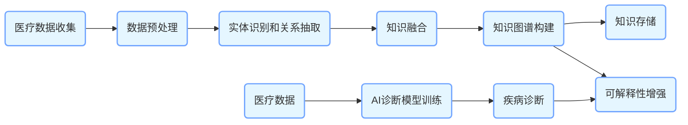

# 基于知识图谱的AI医疗诊断可解释性增强系统设计

> 关键词：知识图谱、AI医疗诊断、可解释性增强、系统设计、医疗知识表示

> 摘要：本文聚焦于基于知识图谱的AI医疗诊断可解释性增强系统的设计。首先介绍了该系统设计的背景，包括目的、预期读者、文档结构等。接着阐述了知识图谱、AI医疗诊断及可解释性增强等核心概念及其联系，并给出了相应的文本示意图和Mermaid流程图。详细讲解了核心算法原理和具体操作步骤，通过Python代码进行了示例说明。还探讨了相关的数学模型和公式，并举例加以解释。通过项目实战，展示了开发环境搭建、源代码实现与解读。分析了该系统的实际应用场景，推荐了相关的学习资源、开发工具框架和论文著作。最后总结了未来发展趋势与挑战，解答了常见问题，并提供了扩展阅读和参考资料，旨在为构建具有可解释性的AI医疗诊断系统提供全面的技术指导。

## 1. 背景介绍 
### 1.1 目的和范围
在当今医疗领域，人工智能技术正发挥着越来越重要的作用。AI医疗诊断系统能够利用大量的医疗数据进行快速准确的诊断，为医生提供决策支持。然而，目前许多AI医疗诊断系统存在可解释性不足的问题，这使得医生和患者难以理解诊断结果的依据，限制了其在临床实践中的广泛应用。

本系统设计的目的是构建一个基于知识图谱的AI医疗诊断可解释性增强系统，通过知识图谱对医疗知识进行结构化表示和推理，为AI医疗诊断结果提供清晰、可理解的解释，增强系统的可信度和实用性。

本系统的范围涵盖了医疗知识的收集、整理和存储，知识图谱的构建和更新，AI诊断模型的训练和优化，以及可解释性机制的设计和实现。系统将应用于常见疾病的诊断场景，为医生提供辅助诊断和解释服务。

### 1.2 预期读者
本文的预期读者包括医疗领域的专业人士，如医生、医学研究人员等，他们可以通过本系统更好地理解AI诊断结果，提高诊断的准确性和效率；计算机科学领域的研究人员和开发者，他们可以从系统设计和实现的角度获取技术灵感和参考；以及对AI医疗应用感兴趣的普通读者，了解基于知识图谱的AI医疗诊断可解释性增强的相关原理和方法。

### 1.3 文档结构概述
本文将按照以下结构进行组织：
1. 背景介绍：阐述系统设计的目的、范围、预期读者和文档结构。
2. 核心概念与联系：介绍知识图谱、AI医疗诊断和可解释性增强的核心概念，以及它们之间的联系，并给出相应的示意图和流程图。
3. 核心算法原理 & 具体操作步骤：详细讲解系统中涉及的核心算法原理，如知识图谱的构建算法、AI诊断模型的训练算法等，并给出具体的操作步骤，同时用Python代码进行示例说明。
4. 数学模型和公式 & 详细讲解 & 举例说明：介绍系统中使用的数学模型和公式，如概率推理公式、相似度计算公式等，并进行详细讲解和举例说明。
5. 项目实战：代码实际案例和详细解释说明：通过一个具体的项目实战，展示系统的开发环境搭建、源代码实现和代码解读。
6. 实际应用场景：分析系统在不同医疗场景中的实际应用，如疾病诊断、治疗方案推荐等。
7. 工具和资源推荐：推荐相关的学习资源、开发工具框架和论文著作，帮助读者进一步深入学习和研究。
8. 总结：未来发展趋势与挑战：总结系统的优势和不足，展望未来的发展趋势，并分析面临的挑战。
9. 附录：常见问题与解答：解答读者在阅读和实践过程中可能遇到的常见问题。
10. 扩展阅读 & 参考资料：提供相关的扩展阅读材料和参考资料，方便读者进一步查阅。

### 1.4 术语表
#### 1.4.1 核心术语定义
- **知识图谱**：一种以图的形式表示知识的方法，由节点和边组成，节点表示实体，边表示实体之间的关系。在医疗领域，知识图谱可以用来表示疾病、症状、药物、治疗方法等实体及其之间的关系。
- **AI医疗诊断**：利用人工智能技术，如机器学习、深度学习等，对医疗数据进行分析和处理，以辅助医生进行疾病诊断的过程。
- **可解释性增强**：通过一定的方法和技术，使AI系统的决策过程和结果能够被人类理解和解释的过程。在AI医疗诊断中，可解释性增强可以帮助医生和患者了解诊断结果的依据，提高系统的可信度和实用性。
- **实体**：知识图谱中的节点，表示现实世界中的具体事物或概念，如疾病、症状、药物等。
- **关系**：知识图谱中的边，表示实体之间的联系，如“导致”、“治疗”、“伴随”等。

#### 1.4.2 相关概念解释
- **本体**：一种对特定领域的概念、关系和规则进行形式化描述的方法，是构建知识图谱的基础。本体定义了领域内的实体类型、属性和关系，为知识图谱的构建提供了统一的语义框架。
- **语义网络**：一种用图表示知识的方法，与知识图谱类似，但语义网络更侧重于表示概念之间的语义关系，而知识图谱更强调实体和关系的明确表示和结构化存储。
- **机器学习**：一门多领域交叉学科，涉及概率论、统计学、逼近论、凸分析、算法复杂度理论等多门学科。它专门研究计算机怎样模拟或实现人类的学习行为，以获取新的知识或技能，重新组织已有的知识结构使之不断改善自身的性能。在AI医疗诊断中，机器学习算法可以用于疾病诊断模型的训练和优化。
- **深度学习**：机器学习的一个分支领域，它是一种基于对数据进行表征学习的方法。深度学习通过构建具有多个层次的神经网络，自动从大量数据中学习特征和模式，从而实现对数据的分类、预测等任务。在AI医疗诊断中，深度学习算法可以用于图像识别、文本分析等任务。

#### 1.4.3 缩略词列表
- **KG**：Knowledge Graph，知识图谱
- **ML**：Machine Learning，机器学习
- **DL**：Deep Learning，深度学习
- **NLP**：Natural Language Processing，自然语言处理
- **CNN**：Convolutional Neural Network，卷积神经网络
- **RNN**：Recurrent Neural Network，循环神经网络

## 2. 核心概念与联系 
### 核心概念原理
#### 知识图谱
知识图谱是一种语义网络，它以图的形式表示知识，将现实世界中的实体和它们之间的关系抽象为节点和边。在医疗领域，知识图谱可以整合来自医学文献、电子病历、临床指南等多源的数据，构建一个全面、准确的医疗知识体系。例如，一个简单的医疗知识图谱可能包含疾病节点（如“感冒”、“肺炎”）、症状节点（如“咳嗽”、“发热”）、药物节点（如“阿司匹林”、“青霉素”），以及它们之间的关系，如“感冒 - 导致 - 咳嗽”、“青霉素 - 治疗 - 肺炎”等。

知识图谱的构建通常包括以下几个步骤：
1. **数据收集**：从各种数据源中收集医疗相关的数据，如医学文献、电子病历、临床指南等。
2. **数据预处理**：对收集到的数据进行清洗、转换和标注，以提高数据的质量和可用性。
3. **实体识别和关系抽取**：从预处理后的数据中识别出实体和它们之间的关系，可以使用自然语言处理技术，如命名实体识别、关系抽取等。
4. **知识融合**：将从不同数据源中抽取的知识进行融合，解决实体冲突、关系冲突等问题，构建一个统一的知识图谱。
5. **知识存储**：将构建好的知识图谱存储在数据库中，如图数据库（如Neo4j）、三元组数据库（如Virtuoso）等，以便后续的查询和推理。

#### AI医疗诊断
AI医疗诊断是利用人工智能技术对医疗数据进行分析和处理，以辅助医生进行疾病诊断的过程。常见的AI医疗诊断方法包括机器学习和深度学习。

机器学习方法通过对大量的医疗数据进行学习，构建疾病诊断模型。例如，使用决策树算法可以根据患者的症状、检查结果等特征，构建一个决策树模型，用于疾病的分类和诊断。深度学习方法则通过构建深度神经网络，自动从医疗数据中学习特征和模式，实现疾病的诊断和预测。例如，使用卷积神经网络（CNN）可以对医学图像（如X光片、CT图像）进行分析，识别疾病的特征和病变。

#### 可解释性增强
可解释性增强是指通过一定的方法和技术，使AI系统的决策过程和结果能够被人类理解和解释的过程。在AI医疗诊断中，可解释性增强非常重要，因为医生和患者需要了解诊断结果的依据，以便做出合理的决策。常见的可解释性增强方法包括：
1. **基于规则的解释**：使用规则引擎对AI系统的决策过程进行解释，将决策过程表示为一系列的规则。例如，在疾病诊断中，可以使用规则“如果患者出现咳嗽、发热、喉咙痛等症状，且血常规检查显示白细胞计数升高，则可能患有感冒”来解释诊断结果。
2. **特征重要性分析**：分析AI模型中各个特征对决策结果的影响程度，找出最重要的特征，并将其作为解释的依据。例如，在疾病诊断模型中，可以使用特征重要性分析方法，找出对诊断结果影响最大的症状、检查结果等特征。
3. **可视化解释**：将AI系统的决策过程和结果以可视化的方式呈现给用户，如使用决策树图、热力图等，帮助用户更好地理解诊断结果。

### 核心概念架构的文本示意图
```plaintext
                AI医疗诊断系统
                    |
        +-----------------------+
        |                       |
    知识图谱                 可解释性增强模块
        |                       |
+-----------------+        +-----------------+
| 医疗知识存储    |        | 规则解释引擎    |
| 实体关系表示    |        | 特征重要性分析 |
| 知识推理        |        | 可视化解释工具 |
+-----------------+        +-----------------+
```

### Mermaid流程图


## 3. 核心算法原理 & 具体操作步骤 
### 知识图谱构建算法
#### 原理
知识图谱的构建主要涉及实体识别和关系抽取两个关键步骤。实体识别是指从文本中识别出具有特定意义的实体，如疾病、症状、药物等。关系抽取是指识别实体之间的关系，如“导致”、“治疗”等。常用的实体识别和关系抽取方法包括基于规则的方法、基于机器学习的方法和基于深度学习的方法。

基于规则的方法通过定义一系列的规则来识别实体和关系，优点是简单易懂，缺点是规则的制定需要大量的领域知识，且难以覆盖所有的情况。基于机器学习的方法通过对大量的标注数据进行学习，构建实体识别和关系抽取模型，优点是可以自动学习特征和模式，缺点是需要大量的标注数据。基于深度学习的方法通过构建深度神经网络，自动从文本中学习特征和模式，实现实体识别和关系抽取，优点是可以处理复杂的语言结构，缺点是模型的训练需要大量的计算资源和时间。

#### 具体操作步骤
1. **数据收集**：从医学文献、电子病历、临床指南等数据源中收集医疗相关的文本数据。
2. **数据预处理**：对收集到的文本数据进行清洗、分词、词性标注等预处理操作，以提高数据的质量和可用性。
3. **实体识别**：使用基于深度学习的方法，如BERT + CRF模型，对预处理后的文本数据进行实体识别。BERT是一种预训练的语言模型，可以自动学习文本的语义信息，CRF是一种序列标注模型，可以用于实体边界的识别。以下是使用Python和Hugging Face的transformers库实现实体识别的示例代码：
```python
from transformers import AutoTokenizer, AutoModelForTokenClassification
import torch

# 加载预训练的模型和分词器
tokenizer = AutoTokenizer.from_pretrained("dslim/bert-base-NER")
model = AutoModelForTokenClassification.from_pretrained("dslim/bert-base-NER")

# 待识别的文本
text = "患者出现咳嗽、发热等症状，可能患有感冒。"

# 对文本进行分词
inputs = tokenizer(text, return_tensors="pt")

# 进行实体识别
with torch.no_grad():
    outputs = model(**inputs)

# 获取预测结果
predictions = torch.argmax(outputs.logits, dim=2)

# 解码预测结果
tokens = tokenizer.convert_ids_to_tokens(inputs["input_ids"][0])
entities = []
for token, prediction in zip(tokens, predictions[0]):
    if prediction!= 0:  # 0表示非实体
        entities.append(token)

print("识别出的实体：", entities)
```
4. **关系抽取**：使用基于深度学习的方法，如BERT + BiLSTM + Attention模型，对识别出的实体进行关系抽取。BERT用于学习文本的语义信息，BiLSTM用于处理序列信息，Attention机制用于增强模型对关键信息的关注。以下是使用Python和PyTorch实现关系抽取的示例代码：
```python
import torch
import torch.nn as nn
from transformers import BertModel

# 定义BERT + BiLSTM + Attention模型
class BertBiLSTMAttention(nn.Module):
    def __init__(self, num_classes, hidden_size=768, lstm_hidden_size=128, num_layers=1):
        super(BertBiLSTMAttention, self).__init__()
        self.bert = BertModel.from_pretrained("bert-base-chinese")
        self.lstm = nn.LSTM(hidden_size, lstm_hidden_size, num_layers, bidirectional=True, batch_first=True)
        self.fc = nn.Linear(lstm_hidden_size * 2, num_classes)
        self.attention = nn.Linear(lstm_hidden_size * 2, 1)

    def forward(self, input_ids, attention_mask):
        outputs = self.bert(input_ids=input_ids, attention_mask=attention_mask)
        sequence_output = outputs.last_hidden_state
        lstm_output, _ = self.lstm(sequence_output)
        attention_scores = self.attention(lstm_output).squeeze(-1)
        attention_weights = torch.softmax(attention_scores, dim=1).unsqueeze(-1)
        weighted_output = lstm_output * attention_weights
        pooled_output = torch.sum(weighted_output, dim=1)
        logits = self.fc(pooled_output)
        return logits

# 初始化模型
num_classes = 3  # 假设有3种关系
model = BertBiLSTMAttention(num_classes)

# 示例输入
input_ids = torch.randint(0, 1000, (1, 10))
attention_mask = torch.ones((1, 10))

# 前向传播
logits = model(input_ids, attention_mask)
print("关系抽取的预测结果：", logits)
```
5. **知识融合**：将从不同数据源中抽取的知识进行融合，解决实体冲突、关系冲突等问题。可以使用基于相似度计算的方法，如余弦相似度、编辑距离等，对实体和关系进行匹配和合并。
6. **知识存储**：将构建好的知识图谱存储在图数据库中，如Neo4j。可以使用Neo4j的Python驱动程序`py2neo`来实现知识的存储和查询。以下是使用`py2neo`将实体和关系存储到Neo4j的示例代码：
```python
from py2neo import Graph, Node, Relationship

# 连接到Neo4j数据库
graph = Graph("bolt://localhost:7687", auth=("neo4j", "password"))

# 创建实体节点
disease = Node("Disease", name="感冒")
symptom = Node("Symptom", name="咳嗽")

# 创建关系
relationship = Relationship(disease, "导致", symptom)

# 将节点和关系添加到图数据库中
graph.create(disease)
graph.create(symptom)
graph.create(relationship)
```

### AI诊断模型训练算法
#### 原理
AI诊断模型的训练主要使用机器学习和深度学习算法。以深度学习中的卷积神经网络（CNN）为例，CNN通过卷积层、池化层和全连接层的组合，自动从医学图像中学习特征和模式，实现疾病的诊断和预测。卷积层通过卷积核在图像上滑动，提取图像的局部特征；池化层用于降低特征图的维度，减少计算量；全连接层将提取的特征进行分类和预测。

#### 具体操作步骤
1. **数据准备**：收集医学图像数据，如X光片、CT图像等，并进行标注，将图像分为不同的类别，如正常、患病等。
2. **数据预处理**：对图像数据进行预处理，如归一化、裁剪、旋转等，以提高数据的质量和多样性。
3. **模型构建**：使用Python和深度学习框架（如PyTorch、TensorFlow）构建CNN模型。以下是使用PyTorch构建一个简单的CNN模型的示例代码：
```python
import torch
import torch.nn as nn

# 定义CNN模型
class SimpleCNN(nn.Module):
    def __init__(self, num_classes):
        super(SimpleCNN, self).__init__()
        self.conv1 = nn.Conv2d(3, 16, kernel_size=3, padding=1)
        self.relu1 = nn.ReLU()
        self.pool1 = nn.MaxPool2d(kernel_size=2, stride=2)
        self.conv2 = nn.Conv2d(16, 32, kernel_size=3, padding=1)
        self.relu2 = nn.ReLU()
        self.pool2 = nn.MaxPool2d(kernel_size=2, stride=2)
        self.fc1 = nn.Linear(32 * 56 * 56, 128)
        self.relu3 = nn.ReLU()
        self.fc2 = nn.Linear(128, num_classes)

    def forward(self, x):
        x = self.pool1(self.relu1(self.conv1(x)))
        x = self.pool2(self.relu2(self.conv2(x)))
        x = x.view(-1, 32 * 56 * 56)
        x = self.relu3(self.fc1(x))
        x = self.fc2(x)
        return x

# 初始化模型
num_classes = 2  # 假设有2个类别
model = SimpleCNN(num_classes)
```
4. **模型训练**：使用准备好的图像数据对CNN模型进行训练。在训练过程中，使用损失函数（如交叉熵损失函数）来衡量模型的预测结果与真实标签之间的差异，并使用优化算法（如随机梯度下降）来更新模型的参数。以下是使用PyTorch进行模型训练的示例代码：
```python
import torch.optim as optim

# 定义损失函数和优化器
criterion = nn.CrossEntropyLoss()
optimizer = optim.SGD(model.parameters(), lr=0.001, momentum=0.9)

# 模拟训练数据
inputs = torch.randn(4, 3, 224, 224)
labels = torch.randint(0, 2, (4,))

# 训练模型
for epoch in range(10):
    optimizer.zero_grad()
    outputs = model(inputs)
    loss = criterion(outputs, labels)
    loss.backward()
    optimizer.step()
    print(f'Epoch {epoch+1}, Loss: {loss.item()}')
```
5. **模型评估**：使用测试数据对训练好的模型进行评估，计算模型的准确率、召回率、F1值等指标，评估模型的性能。

### 可解释性增强算法
#### 原理
可解释性增强算法主要包括基于规则的解释、特征重要性分析和可视化解释。基于规则的解释通过定义一系列的规则来解释AI系统的决策过程；特征重要性分析通过分析模型中各个特征对决策结果的影响程度，找出最重要的特征；可视化解释通过将模型的决策过程和结果以可视化的方式呈现给用户，帮助用户更好地理解诊断结果。

#### 具体操作步骤
1. **基于规则的解释**：定义一系列的规则，如“如果患者出现咳嗽、发热、喉咙痛等症状，且血常规检查显示白细胞计数升高，则可能患有感冒”。在进行疾病诊断时，根据模型的预测结果和规则库中的规则，生成相应的解释。以下是一个简单的基于规则的解释示例代码：
```python
# 规则库
rules = [
    {
        "conditions": ["咳嗽", "发热", "白细胞计数升高"],
        "disease": "感冒"
    }
]

# 患者症状和检查结果
symptoms = ["咳嗽", "发热"]
test_results = ["白细胞计数升高"]

# 查找匹配的规则
for rule in rules:
    conditions = rule["conditions"]
    all_matched = True
    for condition in conditions:
        if condition in symptoms or condition in test_results:
            continue
        else:
            all_matched = False
            break
    if all_matched:
        print(f"根据规则，患者可能患有 {rule['disease']}。")
        break
```
2. **特征重要性分析**：使用特征重要性分析方法，如随机森林的特征重要性、SHAP值等，分析模型中各个特征对决策结果的影响程度。以下是使用Python的`scikit-learn`库进行随机森林特征重要性分析的示例代码：
```python
from sklearn.ensemble import RandomForestClassifier
import numpy as np

# 模拟训练数据
X = np.random.rand(100, 5)
y = np.random.randint(0, 2, 100)

# 训练随机森林模型
model = RandomForestClassifier()
model.fit(X, y)

# 获取特征重要性
feature_importances = model.feature_importances_

# 打印特征重要性
for i, importance in enumerate(feature_importances):
    print(f"Feature {i}: Importance = {importance}")
```
3. **可视化解释**：使用可视化工具，如Matplotlib、Seaborn等，将模型的决策过程和结果以可视化的方式呈现给用户。以下是使用Matplotlib绘制特征重要性柱状图的示例代码：
```python
import matplotlib.pyplot as plt

# 特征名称
feature_names = ["Feature 0", "Feature 1", "Feature 2", "Feature 3", "Feature 4"]

# 绘制特征重要性柱状图
plt.bar(feature_names, feature_importances)
plt.xlabel("Features")
plt.ylabel("Importance")
plt.title("Feature Importance")
plt.show()
```

## 4. 数学模型和公式 & 详细讲解 & 举例说明 
### 概率推理公式
#### 原理
在知识图谱中，概率推理可以用于计算实体之间关系的概率，以及根据已知信息推断未知信息的概率。常用的概率推理方法包括贝叶斯网络和马尔可夫逻辑网。

贝叶斯网络是一种基于概率图模型的推理方法，它通过有向无环图（DAG）表示变量之间的依赖关系，并使用条件概率表（CPT）来表示变量之间的条件概率。马尔可夫逻辑网是一种结合了逻辑规则和概率推理的方法，它将逻辑规则视为软约束，并为每个规则分配一个权重，通过最大似然估计来学习规则的权重。

#### 公式
- **贝叶斯定理**：
$$P(A|B)=\frac{P(B|A)P(A)}{P(B)}$$
其中，$P(A|B)$ 表示在事件 $B$ 发生的条件下事件 $A$ 发生的概率，$P(B|A)$ 表示在事件 $A$ 发生的条件下事件 $B$ 发生的概率，$P(A)$ 表示事件 $A$ 发生的先验概率，$P(B)$ 表示事件 $B$ 发生的先验概率。

- **条件概率公式**：
$$P(A,B)=P(A|B)P(B)=P(B|A)P(A)$$
其中，$P(A,B)$ 表示事件 $A$ 和事件 $B$ 同时发生的概率。

#### 举例说明
假设在医疗领域，我们已知以下信息：
- 患感冒（$A$）的先验概率 $P(A)=0.1$。
- 出现咳嗽症状（$B$）的先验概率 $P(B)=0.2$。
- 在患感冒的情况下出现咳嗽症状的概率 $P(B|A)=0.8$。

我们可以使用贝叶斯定理计算在出现咳嗽症状的情况下患感冒的概率 $P(A|B)$：
$$P(A|B)=\frac{P(B|A)P(A)}{P(B)}=\frac{0.8\times0.1}{0.2}=0.4$$

这意味着在出现咳嗽症状的情况下，患感冒的概率为 $0.4$。

### 相似度计算公式
#### 原理
在知识图谱的构建和知识融合过程中，需要计算实体之间的相似度，以判断它们是否为同一实体或具有相似的属性。常用的相似度计算方法包括余弦相似度、编辑距离、Jaccard相似度等。

#### 公式
- **余弦相似度**：
对于两个向量 $\vec{A}=(a_1,a_2,\cdots,a_n)$ 和 $\vec{B}=(b_1,b_2,\cdots,b_n)$，它们的余弦相似度定义为：
$$\cos(\theta)=\frac{\vec{A}\cdot\vec{B}}{\|\vec{A}\|\|\vec{B}\|}=\frac{\sum_{i=1}^{n}a_ib_i}{\sqrt{\sum_{i=1}^{n}a_i^2}\sqrt{\sum_{i=1}^{n}b_i^2}}$$
其中，$\theta$ 是两个向量之间的夹角，$\vec{A}\cdot\vec{B}$ 是两个向量的点积，$\|\vec{A}\|$ 和 $\|\vec{B}\|$ 分别是两个向量的模。

- **编辑距离**：
编辑距离是指将一个字符串转换为另一个字符串所需的最少编辑操作次数，包括插入、删除和替换。编辑距离可以使用动态规划算法来计算。

- **Jaccard相似度**：
对于两个集合 $A$ 和 $B$，它们的Jaccard相似度定义为：
$$J(A,B)=\frac{|A\cap B|}{|A\cup B|}$$
其中，$|A\cap B|$ 是两个集合的交集的元素个数，$|A\cup B|$ 是两个集合的并集的元素个数。

#### 举例说明
- **余弦相似度**：
假设有两个向量 $\vec{A}=(1,2,3)$ 和 $\vec{B}=(4,5,6)$，它们的余弦相似度计算如下：
$$\vec{A}\cdot\vec{B}=1\times4 + 2\times5 + 3\times6 = 32$$
$$\|\vec{A}\|=\sqrt{1^2 + 2^2 + 3^2}=\sqrt{14}$$
$$\|\vec{B}\|=\sqrt{4^2 + 5^2 + 6^2}=\sqrt{77}$$
$$\cos(\theta)=\frac{32}{\sqrt{14}\sqrt{77}}\approx0.9746$$

- **Jaccard相似度**：
假设有两个集合 $A=\{1,2,3\}$ 和 $B=\{2,3,4\}$，它们的Jaccard相似度计算如下：
$$|A\cap B| = 2$$
$$|A\cup B| = 4$$
$$J(A,B)=\frac{2}{4}=0.5$$

### 损失函数公式
#### 原理
在AI诊断模型的训练过程中，需要使用损失函数来衡量模型的预测结果与真实标签之间的差异，以便通过优化算法更新模型的参数。常用的损失函数包括交叉熵损失函数、均方误差损失函数等。

#### 公式
- **交叉熵损失函数**：
对于一个多分类问题，假设模型的预测概率分布为 $\hat{y}=(\hat{y}_1,\hat{y}_2,\cdots,\hat{y}_C)$，真实标签的概率分布为 $y=(y_1,y_2,\cdots,y_C)$，其中 $C$ 是类别数。交叉熵损失函数定义为：
$$H(y,\hat{y})=-\sum_{i=1}^{C}y_i\log(\hat{y}_i)$$
在实际应用中，真实标签通常是一个one - hot向量，即只有一个元素为1，其余元素为0。

- **均方误差损失函数**：
对于一个回归问题，假设模型的预测值为 $\hat{y}$，真实值为 $y$，均方误差损失函数定义为：
$$MSE(y,\hat{y})=\frac{1}{n}\sum_{i=1}^{n}(y_i-\hat{y}_i)^2$$
其中，$n$ 是样本数。

#### 举例说明
- **交叉熵损失函数**：
假设一个二分类问题，模型的预测概率分布为 $\hat{y}=(0.2,0.8)$，真实标签的概率分布为 $y=(0,1)$，则交叉熵损失函数计算如下：
$$H(y,\hat{y})=-(0\times\log(0.2)+1\times\log(0.8))\approx0.2231$$

- **均方误差损失函数**：
假设一个回归问题，模型的预测值为 $\hat{y}=(1.2, 2.3, 3.4)$，真实值为 $y=(1, 2, 3)$，则均方误差损失函数计算如下：
$$MSE(y,\hat{y})=\frac{1}{3}[(1 - 1.2)^2+(2 - 2.3)^2+(3 - 3.4)^2]=\frac{1}{3}(0.04 + 0.09 + 0.16)\approx0.0967$$

## 5. 项目实战：代码实际案例和详细解释说明 
### 5.1  开发环境搭建
#### 操作系统
本项目可以在Windows、Linux或macOS等操作系统上进行开发，建议使用Linux系统，如Ubuntu 18.04或更高版本，因为Linux系统在开发和部署方面具有更好的稳定性和兼容性。

#### 编程语言和框架
- **Python**：版本3.7或更高版本，Python是一种广泛使用的编程语言，具有丰富的库和工具，适合用于数据处理、模型训练和系统开发。
- **深度学习框架**：选择PyTorch或TensorFlow，本项目以PyTorch为例，因为PyTorch具有动态图机制，易于调试和开发。可以使用以下命令安装PyTorch：
```bash
pip install torch torchvision
```
- **图数据库**：选择Neo4j作为图数据库，用于存储知识图谱。可以从Neo4j官方网站下载并安装Neo4j社区版，安装完成后，启动Neo4j服务。

#### 其他工具和库
- **自然语言处理库**：使用Hugging Face的transformers库进行实体识别和关系抽取，可以使用以下命令安装：
```bash
pip install transformers
```
- **数据处理库**：使用`pandas`和`numpy`进行数据处理和分析，可以使用以下命令安装：
```bash
pip install pandas numpy
```
- **可视化库**：使用`matplotlib`和`seaborn`进行数据可视化，可以使用以下命令安装：
```bash
pip install matplotlib seaborn
```

### 5.2  源代码详细实现和代码解读
#### 知识图谱构建模块
```python
from py2neo import Graph, Node, Relationship
from transformers import AutoTokenizer, AutoModelForTokenClassification
import torch

# 连接到Neo4j数据库
graph = Graph("bolt://localhost:7687", auth=("neo4j", "password"))

# 加载预训练的实体识别模型和分词器
tokenizer = AutoTokenizer.from_pretrained("dslim/bert-base-NER")
model = AutoModelForTokenClassification.from_pretrained("dslim/bert-base-NER")

def extract_entities(text):
    """
    从文本中提取实体
    """
    inputs = tokenizer(text, return_tensors="pt")
    with torch.no_grad():
        outputs = model(**inputs)
    predictions = torch.argmax(outputs.logits, dim=2)
    tokens = tokenizer.convert_ids_to_tokens(inputs["input_ids"][0])
    entities = []
    current_entity = ""
    for token, prediction in zip(tokens, predictions[0]):
        if prediction!= 0:  # 0表示非实体
            if token.startswith("##"):
                current_entity += token[2:]
            else:
                if current_entity:
                    entities.append(current_entity)
                current_entity = token
    if current_entity:
        entities.append(current_entity)
    return entities

def build_knowledge_graph(text):
    """
    构建知识图谱
    """
    entities = extract_entities(text)
    nodes = []
    for entity in entities:
        node = Node("Entity", name=entity)
        nodes.append(node)
        graph.create(node)
    # 这里简单假设相邻实体之间存在关系
    for i in range(len(nodes) - 1):
        relationship = Relationship(nodes[i], "RELATED_TO", nodes[i + 1])
        graph.create(relationship)

# 示例文本
text = "患者出现咳嗽、发热等症状，可能患有感冒。"
build_knowledge_graph(text)
```
**代码解读**：
- 首先，使用`py2neo`库连接到Neo4j数据库。
- 然后，加载预训练的实体识别模型和分词器。
- `extract_entities`函数用于从文本中提取实体，通过调用预训练的实体识别模型进行预测，并将预测结果解码为实体列表。
- `build_knowledge_graph`函数用于构建知识图谱，将提取的实体创建为节点，并添加到Neo4j数据库中，同时简单假设相邻实体之间存在关系，创建相应的关系并添加到数据库中。

#### AI诊断模型训练模块
```python
import torch
import torch.nn as nn
import torch.optim as optim
from torch.utils.data import Dataset, DataLoader

# 定义简单的CNN模型
class SimpleCNN(nn.Module):
    def __init__(self, num_classes):
        super(SimpleCNN, self).__init__()
        self.conv1 = nn.Conv2d(3, 16, kernel_size=3, padding=1)
        self.relu1 = nn.ReLU()
        self.pool1 = nn.MaxPool2d(kernel_size=2, stride=2)
        self.conv2 = nn.Conv2d(16, 32, kernel_size=3, padding=1)
        self.relu2 = nn.ReLU()
        self.pool2 = nn.MaxPool2d(kernel_size=2, stride=2)
        self.fc1 = nn.Linear(32 * 56 * 56, 128)
        self.relu3 = nn.ReLU()
        self.fc2 = nn.Linear(128, num_classes)

    def forward(self, x):
        x = self.pool1(self.relu1(self.conv1(x)))
        x = self.pool2(self.relu2(self.conv2(x)))
        x = x.view(-1, 32 * 56 * 56)
        x = self.relu3(self.fc1(x))
        x = self.fc2(x)
        return x

# 模拟数据集
class MockDataset(Dataset):
    def __init__(self, num_samples):
        self.data = torch.randn(num_samples, 3, 224, 224)
        self.labels = torch.randint(0, 2, (num_samples,))

    def __len__(self):
        return len(self.data)

    def __getitem__(self, idx):
        return self.data[idx], self.labels[idx]

# 初始化模型、损失函数和优化器
num_classes = 2
model = SimpleCNN(num_classes)
criterion = nn.CrossEntropyLoss()
optimizer = optim.SGD(model.parameters(), lr=0.001, momentum=0.9)

# 创建数据集和数据加载器
dataset = MockDataset(num_samples=100)
dataloader = DataLoader(dataset, batch_size=4, shuffle=True)

# 训练模型
num_epochs = 10
for epoch in range(num_epochs):
    running_loss = 0.0
    for inputs, labels in dataloader:
        optimizer.zero_grad()
        outputs = model(inputs)
        loss = criterion(outputs, labels)
        loss.backward()
        optimizer.step()
        running_loss += loss.item()
    print(f'Epoch {epoch + 1}, Loss: {running_loss / len(dataloader)}')
```
**代码解读**：
- 定义了一个简单的CNN模型`SimpleCNN`，包括卷积层、池化层和全连接层。
- 创建了一个模拟数据集`MockDataset`，用于模拟医学图像数据。
- 初始化模型、损失函数（交叉熵损失函数）和优化器（随机梯度下降）。
- 使用`DataLoader`将数据集划分为小批量进行训练。
- 在训练过程中，通过前向传播计算损失，然后通过反向传播更新模型的参数。

#### 可解释性增强模块
```python
# 规则库
rules = [
    {
        "conditions": ["咳嗽", "发热", "白细胞计数升高"],
        "disease": "感冒"
    }
]

def rule_based_explanation(symptoms, test_results):
    """
    基于规则的解释
    """
    for rule in rules:
        conditions = rule["conditions"]
        all_matched = True
        for condition in conditions:
            if condition in symptoms or condition in test_results:
                continue
            else:
                all_matched = False
                break
        if all_matched:
            return f"根据规则，患者可能患有 {rule['disease']}。"
    return "未找到匹配的规则。"

# 示例症状和检查结果
symptoms = ["咳嗽", "发热"]
test_results = ["白细胞计数升高"]
explanation = rule_based_explanation(symptoms, test_results)
print(explanation)
```
**代码解读**：
- 定义了一个规则库`rules`，包含了一些疾病诊断的规则。
- `rule_based_explanation`函数用于根据患者的症状和检查结果，在规则库中查找匹配的规则，并生成相应的解释。

### 5.3  代码解读与分析
#### 知识图谱构建模块
- 优点：使用预训练的实体识别模型可以提高实体识别的准确率，利用图数据库存储知识图谱可以方便地进行知识的查询和推理。
- 缺点：实体识别模型的性能可能受到训练数据的限制，简单假设相邻实体之间存在关系可能会导致知识图谱的准确性下降。
- 改进方向：可以使用更多的标注数据对实体识别模型进行微调，采用更复杂的关系抽取方法来提高知识图谱的质量。

#### AI诊断模型训练模块
- 优点：使用CNN模型可以自动从医学图像中学习特征和模式，提高疾病诊断的准确率。
- 缺点：模拟数据集可能与真实的医学图像数据存在差异，导致模型的泛化能力不足。
- 改进方向：收集更多的真实医学图像数据进行训练，使用数据增强技术来增加数据的多样性，采用更复杂的深度学习模型来提高模型的性能。

#### 可解释性增强模块
- 优点：基于规则的解释方法简单易懂，能够为诊断结果提供明确的解释。
- 缺点：规则库的构建需要大量的领域知识，且难以覆盖所有的情况。
- 改进方向：可以结合特征重要性分析和可视化解释等方法，提高解释的全面性和准确性，同时使用机器学习方法自动学习规则，减少人工干预。

## 6. 实际应用场景 
### 疾病诊断辅助
基于知识图谱的AI医疗诊断可解释性增强系统可以为医生提供疾病诊断的辅助。医生输入患者的症状、检查结果等信息，系统可以利用知识图谱进行推理，结合AI诊断模型的预测结果，为医生提供可能的疾病诊断和相应的解释。例如，系统可以根据患者的症状和知识图谱中疾病与症状的关系，推荐可能的疾病，并解释为什么会做出这样的诊断，帮助医生更准确地做出决策。

### 治疗方案推荐
系统可以根据疾病诊断结果和知识图谱中疾病与治疗方法的关系，为医生推荐合适的治疗方案。同时，系统可以解释推荐治疗方案的依据，如该治疗方案在类似病例中的疗效、可能的副作用等。医生可以根据系统的推荐和解释，结合患者的具体情况，制定个性化的治疗方案。

### 医学教育和培训
该系统可以作为医学教育和培训的工具，帮助医学生和实习医生更好地理解疾病的诊断和治疗过程。通过系统的可解释性机制，学生可以了解诊断结果的依据和治疗方案的选择原则，提高他们的临床思维能力和诊断水平。

### 医疗质量评估
系统可以对医疗诊断和治疗过程进行评估，分析诊断结果的准确性和治疗方案的合理性。通过知识图谱和可解释性机制，系统可以找出诊断和治疗过程中可能存在的问题，并提供相应的改进建议，有助于提高医疗质量和安全性。

## 7. 工具和资源推荐
### 7.1 学习资源推荐
#### 7.1.1 书籍推荐
- 《人工智能：一种现代的方法》：这是一本经典的人工智能教材，全面介绍了人工智能的各个领域，包括知识表示、推理、机器学习、自然语言处理等，对于理解基于知识图谱的AI医疗诊断系统的原理和方法有很大的帮助。
- 《深度学习》：由Ian Goodfellow、Yoshua Bengio和Aaron Courville三位深度学习领域的权威专家撰写，详细介绍了深度学习的基本原理、模型结构和训练方法，是深度学习领域的必读之书。
- 《医学信息学》：介绍了医学信息学的基本概念、技术和应用，包括医疗数据的管理、分析和挖掘，AI在医疗领域的应用等，对于了解AI医疗诊断系统的应用场景和需求有很大的帮助。

#### 7.1.2 在线课程
- Coursera上的“人工智能基础”课程：由北京大学的教授授课，系统介绍了人工智能的基本概念、方法和应用，包括知识图谱、机器学习、深度学习等内容。
- edX上的“深度学习专项课程”：由Andrew Ng教授授课，深入介绍了深度学习的各个方面，包括神经网络、卷积神经网络、循环神经网络等，适合有一定编程基础的学习者。
- 中国大学MOOC上的“医学信息学”课程：由国内知名高校的教授授课，介绍了医学信息学的基本理论和技术，以及AI在医疗领域的应用案例。

#### 7.1.3 技术博客和网站
- Hugging Face博客：提供了关于自然语言处理、深度学习等领域的最新技术和研究成果，对于了解实体识别、关系抽取等技术有很大的帮助。
- TensorFlow官方博客：发布了关于TensorFlow深度学习框架的最新进展和应用案例，对于学习和使用TensorFlow进行模型训练有很大的帮助。
- 医脉通：提供了医学领域的最新资讯、临床指南和病例分析等内容，对于了解医疗领域的需求和应用场景有很大的帮助。

### 7.2 开发工具框架推荐
#### 7.2.1 IDE和编辑器
- PyCharm：是一款专门为Python开发设计的集成开发环境（IDE），具有代码编辑、调试、自动补全、版本控制等功能，适合用于Python代码的开发和调试。
