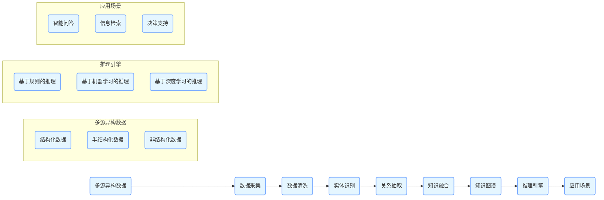

# 基于知识图谱的多源异构数据推理融合

> 关键词：知识图谱、多源异构数据、数据推理、数据融合、语义理解

> 摘要：本文聚焦于基于知识图谱的多源异构数据推理融合技术。随着信息技术的飞速发展，多源异构数据大量涌现，如何有效处理和利用这些数据成为关键问题。知识图谱作为一种强大的语义网络，为多源异构数据的推理融合提供了有力的工具。文章详细介绍了该技术的背景、核心概念、算法原理、数学模型，通过实际项目案例展示了其具体实现过程，探讨了实际应用场景，推荐了相关工具和资源，并对未来发展趋势与挑战进行了总结，旨在为相关领域的研究和实践提供全面而深入的参考。

## 1. 背景介绍 
### 1.1 目的和范围
在当今数字化时代，数据呈现出爆炸式增长，且来源广泛、格式多样，包括文本、图像、音频、视频等不同类型的数据，以及来自不同系统、不同组织的结构化、半结构化和非结构化数据。这些多源异构数据蕴含着丰富的信息，但由于其复杂性，难以直接进行分析和利用。基于知识图谱的多源异构数据推理融合技术的目的在于整合这些多源异构数据，挖掘数据之间的潜在关系，通过推理机制获取新的知识，从而为决策支持、智能问答、信息检索等应用提供更全面、准确的信息。

本文的范围涵盖了该技术的基本概念、核心算法、数学模型、实际应用案例等方面，旨在全面介绍基于知识图谱的多源异构数据推理融合的理论和实践。

### 1.2 预期读者
本文预期读者包括从事数据挖掘、人工智能、信息检索等领域的研究人员和学者，希望深入了解知识图谱和多源异构数据处理技术的专业人士，以及对相关技术感兴趣的开发者和学生。

### 1.3 文档结构概述
本文首先介绍了基于知识图谱的多源异构数据推理融合的背景信息，包括目的、预期读者和文档结构。接着阐述了核心概念与联系，包括知识图谱、多源异构数据、数据推理和数据融合的定义和相互关系，并给出了相应的文本示意图和 Mermaid 流程图。然后详细讲解了核心算法原理和具体操作步骤，通过 Python 源代码进行了说明。之后介绍了数学模型和公式，并通过举例进行了详细讲解。在项目实战部分，给出了实际案例的开发环境搭建、源代码实现和代码解读。接着探讨了该技术的实际应用场景。随后推荐了相关的工具和资源，包括学习资源、开发工具框架和相关论文著作。最后对未来发展趋势与挑战进行了总结，并提供了常见问题与解答以及扩展阅读和参考资料。

### 1.4 术语表
#### 1.4.1 核心术语定义
- **知识图谱**：是一种语义网络，用于表示实体、概念及其之间的关系。它以图的形式组织数据，节点表示实体或概念，边表示它们之间的关系。
- **多源异构数据**：指来自不同数据源、具有不同格式、结构和语义的数据。例如，关系数据库中的结构化数据、XML 文件中的半结构化数据和文本文件中的非结构化数据。
- **数据推理**：是指从已知的数据和知识中推导出新的知识或结论的过程。在知识图谱中，数据推理可以利用图谱中的关系和规则，推断出实体之间的隐含关系。
- **数据融合**：是指将来自不同数据源的数据进行整合，消除数据之间的冲突和冗余，形成统一、一致的数据集合的过程。

#### 1.4.2 相关概念解释
- **语义理解**：是指计算机对数据的语义信息进行理解和处理的能力。在知识图谱中，语义理解可以帮助计算机识别实体和关系的含义，从而更好地进行数据推理和融合。
- **本体**：是一种形式化的知识表示方法，用于描述领域内的概念、关系和规则。本体可以为知识图谱的构建和推理提供语义基础。

#### 1.4.3 缩略词列表
- **RDF**：Resource Description Framework，资源描述框架，是一种用于表示语义信息的标准数据模型。
- **OWL**：Web Ontology Language，网络本体语言，是一种用于定义和推理本体的语言。
- **SPARQL**：SPARQL Protocol and RDF Query Language，是一种用于查询 RDF 数据的语言。

## 2. 核心概念与联系 
### 核心概念原理
#### 知识图谱
知识图谱是一种基于图的数据结构，它由节点（实体或概念）和边（关系）组成。知识图谱的核心思想是将现实世界中的各种实体和它们之间的关系以图形化的方式表示出来，从而为计算机提供一种更加直观、易懂的知识表示方法。例如，在一个人物关系的知识图谱中，节点可以表示具体的人物，边可以表示人物之间的亲属关系、朋友关系等。

知识图谱的构建通常包括数据采集、数据清洗、实体识别、关系抽取和知识融合等步骤。通过这些步骤，可以将多源异构数据转换为统一的知识图谱表示形式，方便后续的推理和应用。

#### 多源异构数据
多源异构数据是指来自不同数据源、具有不同格式、结构和语义的数据。常见的数据源包括关系数据库、文件系统、网页、传感器等。不同数据源的数据格式可能包括结构化数据（如 SQL 数据库中的表）、半结构化数据（如 XML、JSON 文件）和非结构化数据（如文本、图像、音频）。

多源异构数据的存在给数据处理和分析带来了很大的挑战，因为不同格式和语义的数据难以直接进行整合和比较。因此，需要采用合适的技术和方法来处理这些数据，实现数据的融合和推理。

#### 数据推理
数据推理是指从已知的数据和知识中推导出新的知识或结论的过程。在知识图谱中，数据推理可以利用图谱中的关系和规则，推断出实体之间的隐含关系。例如，如果已知 A 是 B 的父亲，B 是 C 的父亲，那么可以通过推理得出 A 是 C 的祖父。

数据推理的方法主要包括基于规则的推理、基于机器学习的推理和基于深度学习的推理等。不同的推理方法适用于不同的场景和数据类型。

#### 数据融合
数据融合是指将来自不同数据源的数据进行整合，消除数据之间的冲突和冗余，形成统一、一致的数据集合的过程。在多源异构数据的背景下，数据融合需要考虑数据的格式、结构、语义等方面的差异，采用合适的融合策略和方法。

数据融合的步骤通常包括数据预处理、数据匹配、数据合并和数据验证等。通过这些步骤，可以将不同数据源的数据整合为一个完整、准确的知识图谱。

### 架构的文本示意图
```plaintext
多源异构数据
|-- 结构化数据（关系数据库）
|-- 半结构化数据（XML、JSON）
|-- 非结构化数据（文本、图像、音频）

数据处理流程
|-- 数据采集
|-- 数据清洗
|-- 实体识别
|-- 关系抽取
|-- 知识融合

知识图谱
|-- 节点（实体、概念）
|-- 边（关系）

推理引擎
|-- 基于规则的推理
|-- 基于机器学习的推理
|-- 基于深度学习的推理

应用场景
|-- 智能问答
|-- 信息检索
|-- 决策支持
```

### Mermaid 流程图


## 3. 核心算法原理 & 具体操作步骤 
### 基于规则的推理算法原理
基于规则的推理是一种简单而有效的推理方法，它通过定义一系列的规则来推断新的知识。规则通常由前提条件和结论组成，当前提条件满足时，就可以得出相应的结论。

在知识图谱中，基于规则的推理可以利用 RDF 或 OWL 定义的规则来进行。例如，以下是一个简单的基于规则的推理示例：

```plaintext
规则：如果 A 是 B 的父亲，B 是 C 的父亲，那么 A 是 C 的祖父。
前提条件：
- （A, 是父亲, B）
- （B, 是父亲, C）
结论：
- （A, 是祖父, C）
```

### Python 代码实现
```python
# 定义知识图谱数据
knowledge_graph = [
    ("A", "是父亲", "B"),
    ("B", "是父亲", "C")
]

# 定义规则
rule = {
    "前提条件": [
        ("?x", "是父亲", "?y"),
        ("?y", "是父亲", "?z")
    ],
    "结论": [
        ("?x", "是祖父", "?z")
    ]
}

# 推理函数
def rule_based_reasoning(knowledge_graph, rule):
    new_facts = []
    for fact1 in knowledge_graph:
        for fact2 in knowledge_graph:
            # 检查前提条件是否满足
            if fact1[1] == rule["前提条件"][0][1] and fact2[1] == rule["前提条件"][1][1] and fact1[2] == fact2[0]:
                x = fact1[0]
                z = fact2[2]
                # 生成新的事实
                new_fact = (x, rule["结论"][0][1], z)
                if new_fact not in knowledge_graph and new_fact not in new_facts:
                    new_facts.append(new_fact)
    return new_facts

# 进行推理
new_facts = rule_based_reasoning(knowledge_graph, rule)

# 输出结果
print("原始知识图谱：", knowledge_graph)
print("推理得出的新事实：", new_facts)
```

### 具体操作步骤
1. **定义知识图谱数据**：将已知的实体和关系表示为三元组的形式，存储在列表中。
2. **定义规则**：将推理规则表示为字典的形式，包含前提条件和结论。
3. **实现推理函数**：遍历知识图谱中的所有事实，检查是否满足规则的前提条件。如果满足，则生成新的事实。
4. **进行推理**：调用推理函数，得到推理得出的新事实。
5. **输出结果**：将原始知识图谱和推理得出的新事实输出。

### 基于机器学习的推理算法原理
基于机器学习的推理方法通过学习数据中的模式和规律来进行推理。常见的基于机器学习的推理方法包括逻辑回归、决策树、支持向量机等。

在知识图谱中，基于机器学习的推理可以将实体和关系表示为向量，然后利用机器学习模型对这些向量进行分类或回归，从而推断出新的关系。例如，可以使用逻辑回归模型来判断两个实体之间是否存在某种关系。

### Python 代码实现
```python
import numpy as np
from sklearn.linear_model import LogisticRegression

# 定义知识图谱数据
entities = ["A", "B", "C", "D"]
relations = ["是父亲", "是朋友"]
# 生成训练数据
X_train = np.array([
    [1, 0],  # (A, 是父亲, B)
    [0, 1],  # (A, 是朋友, C)
    [1, 0],  # (B, 是父亲, D)
    [0, 1]   # (C, 是朋友, D)
])
y_train = np.array([1, 1, 1, 1])

# 定义测试数据
X_test = np.array([
    [1, 0],  # (A, 是父亲, D)
    [0, 1]   # (A, 是朋友, D)
])

# 创建逻辑回归模型
model = LogisticRegression()

# 训练模型
model.fit(X_train, y_train)

# 进行预测
y_pred = model.predict(X_test)

# 输出结果
print("预测结果：", y_pred)
```

### 具体操作步骤
1. **定义知识图谱数据**：将实体和关系表示为向量的形式。
2. **生成训练数据**：根据已知的实体和关系，生成训练数据的特征向量和标签。
3. **创建机器学习模型**：选择合适的机器学习模型，如逻辑回归、决策树等。
4. **训练模型**：使用训练数据对模型进行训练。
5. **进行预测**：使用训练好的模型对测试数据进行预测。
6. **输出结果**：将预测结果输出。

## 4. 数学模型和公式 & 详细讲解 & 举例说明 
### 基于规则的推理数学模型
基于规则的推理可以用一阶逻辑来表示。一阶逻辑是一种形式化的逻辑语言，用于描述实体、关系和规则。

#### 基本概念
- **原子公式**：是一阶逻辑中的基本单位，用于表示实体之间的关系。例如，$R(x, y)$ 表示实体 $x$ 和 $y$ 之间存在关系 $R$。
- **规则**：由前提条件和结论组成，前提条件和结论都是原子公式的组合。例如，规则 $R_1(x, y) \land R_2(y, z) \rightarrow R_3(x, z)$ 表示如果实体 $x$ 和 $y$ 之间存在关系 $R_1$，实体 $y$ 和 $z$ 之间存在关系 $R_2$，那么实体 $x$ 和 $z$ 之间存在关系 $R_3$。

#### 推理过程
基于规则的推理过程可以看作是一个逻辑推导的过程。给定一组原子公式和规则，通过不断应用规则，推导出新的原子公式。

#### 举例说明
假设有以下规则和原子公式：
- 规则：$R_1(x, y) \land R_2(y, z) \rightarrow R_3(x, z)$
- 原子公式：$R_1(A, B)$，$R_2(B, C)$

通过应用规则，可以推导出新的原子公式 $R_3(A, C)$。

### 基于机器学习的推理数学模型
基于机器学习的推理可以用概率模型来表示。常见的概率模型包括贝叶斯网络、马尔可夫随机场等。

#### 贝叶斯网络
贝叶斯网络是一种有向无环图，用于表示变量之间的概率依赖关系。在知识图谱中，贝叶斯网络可以用于表示实体和关系之间的概率关系。

#### 数学公式
设 $X = \{X_1, X_2, \cdots, X_n\}$ 是一组随机变量，$G$ 是一个有向无环图，其中节点表示随机变量，边表示变量之间的依赖关系。贝叶斯网络的联合概率分布可以表示为：

$$P(X_1, X_2, \cdots, X_n) = \prod_{i=1}^{n} P(X_i | Pa(X_i))$$

其中，$Pa(X_i)$ 表示节点 $X_i$ 的父节点集合。

#### 举例说明
假设有一个简单的贝叶斯网络，包含三个节点 $A$、$B$ 和 $C$，其中 $A$ 是 $B$ 的父节点，$B$ 是 $C$ 的父节点。则联合概率分布可以表示为：

$$P(A, B, C) = P(A) P(B | A) P(C | B)$$

### 基于深度学习的推理数学模型
基于深度学习的推理通常使用神经网络来实现。常见的神经网络模型包括卷积神经网络（CNN）、循环神经网络（RNN）、图神经网络（GNN）等。

#### 图神经网络
图神经网络是一种专门用于处理图数据的神经网络模型。在知识图谱中，图神经网络可以用于学习实体和关系的嵌入表示，从而进行推理。

#### 数学公式
图神经网络的基本思想是通过节点之间的消息传递来更新节点的表示。设 $h_i^{(l)}$ 表示节点 $i$ 在第 $l$ 层的表示，$N(i)$ 表示节点 $i$ 的邻居节点集合，则节点 $i$ 在第 $l+1$ 层的表示可以更新为：

$$h_i^{(l+1)} = \sigma \left( W^{(l)} \sum_{j \in N(i)} \frac{1}{|N(i)|} h_j^{(l)} + b^{(l)} \right)$$

其中，$W^{(l)}$ 和 $b^{(l)}$ 是可学习的参数，$\sigma$ 是激活函数。

#### 举例说明
假设有一个简单的知识图谱，包含三个节点 $A$、$B$ 和 $C$，其中 $A$ 和 $B$ 之间有一条边，$B$ 和 $C$ 之间有一条边。使用图神经网络对这个知识图谱进行推理时，可以通过多次消息传递更新节点的表示，从而推断出节点之间的隐含关系。

## 5. 项目实战：代码实际案例和详细解释说明 
### 5.1  开发环境搭建
#### 安装 Python
首先，需要安装 Python 环境。可以从 Python 官方网站（https://www.python.org/downloads/）下载适合自己操作系统的 Python 版本，并按照安装向导进行安装。

#### 安装必要的库
在项目中，需要使用一些 Python 库来处理知识图谱和进行推理。可以使用以下命令安装这些库：
```bash
pip install rdflib  # 用于处理 RDF 数据
pip install scikit-learn  # 用于机器学习
pip install torch  # 用于深度学习
```

### 5.2  源代码详细实现和代码解读
#### 基于规则的推理代码实现
```python
from rdflib import Graph, Literal, RDF, URIRef

# 创建一个 RDF 图
g = Graph()

# 定义命名空间
ns = URIRef("http://example.org/")

# 添加实体和关系
A = ns + "A"
B = ns + "B"
C = ns + "C"
is_father = ns + "is_father"
is_grandfather = ns + "is_grandfather"

g.add((A, is_father, B))
g.add((B, is_father, C))

# 定义规则
rule = """
PREFIX ex: <http://example.org/>
CONSTRUCT {
   ?x ex:is_grandfather?z
}
WHERE {
   ?x ex:is_father?y.
   ?y ex:is_father?z
}
"""

# 进行推理
results = g.query(rule)

# 输出结果
for row in results:
    print(row)
```

#### 代码解读
1. **创建 RDF 图**：使用 `rdflib.Graph()` 创建一个 RDF 图对象。
2. **定义命名空间**：使用 `URIRef` 定义命名空间，方便后续使用。
3. **添加实体和关系**：使用 `g.add()` 方法向图中添加实体和关系。
4. **定义规则**：使用 SPARQL 查询语言定义推理规则。
5. **进行推理**：使用 `g.query()` 方法执行规则，得到推理结果。
6. **输出结果**：遍历推理结果，输出新的事实。

#### 基于机器学习的推理代码实现
```python
import numpy as np
from sklearn.linear_model import LogisticRegression

# 定义知识图谱数据
entities = ["A", "B", "C", "D"]
relations = ["is_father", "is_friend"]
# 生成训练数据
X_train = np.array([
    [1, 0],  # (A, is_father, B)
    [0, 1],  # (A, is_friend, C)
    [1, 0],  # (B, is_father, D)
    [0, 1]   # (C, is_friend, D)
])
y_train = np.array([1, 1, 1, 1])

# 定义测试数据
X_test = np.array([
    [1, 0],  # (A, is_father, D)
    [0, 1]   # (A, is_friend, D)
])

# 创建逻辑回归模型
model = LogisticRegression()

# 训练模型
model.fit(X_train, y_train)

# 进行预测
y_pred = model.predict(X_test)

# 输出结果
print("预测结果：", y_pred)
```

#### 代码解读
1. **定义知识图谱数据**：将实体和关系表示为向量的形式。
2. **生成训练数据**：根据已知的实体和关系，生成训练数据的特征向量和标签。
3. **创建机器学习模型**：使用 `sklearn.linear_model.LogisticRegression()` 创建逻辑回归模型。
4. **训练模型**：使用 `model.fit()` 方法对模型进行训练。
5. **进行预测**：使用 `model.predict()` 方法对测试数据进行预测。
6. **输出结果**：将预测结果输出。

### 5.3  代码解读与分析
#### 基于规则的推理代码分析
基于规则的推理代码通过使用 RDF 图和 SPARQL 查询语言，实现了简单的规则推理。这种方法的优点是简单易懂，推理结果可解释性强；缺点是规则的定义需要人工干预，对于复杂的推理任务，规则的定义和维护比较困难。

#### 基于机器学习的推理代码分析
基于机器学习的推理代码使用逻辑回归模型对知识图谱数据进行推理。这种方法的优点是可以自动学习数据中的模式和规律，适用于大规模的数据；缺点是模型的可解释性较差，需要大量的训练数据。

## 6. 实际应用场景 
### 智能问答系统
在智能问答系统中，基于知识图谱的多源异构数据推理融合技术可以帮助系统更好地理解用户的问题，并从知识图谱中获取相关的信息进行回答。例如，当用户询问“奥巴马的妻子的父亲是谁”时，系统可以通过知识图谱中的关系进行推理，找到奥巴马的妻子是米歇尔，然后再找到米歇尔的父亲是弗雷泽·罗宾逊，从而给出准确的回答。

### 信息检索
在信息检索领域，知识图谱可以为检索提供语义支持，提高检索的准确性和效率。通过将用户的查询与知识图谱中的实体和关系进行匹配，系统可以更准确地理解用户的意图，返回与查询相关的信息。例如，当用户搜索“苹果公司的创始人”时，系统可以通过知识图谱找到苹果公司的创始人是史蒂夫·乔布斯、史蒂夫·沃兹尼亚克和罗恩·韦恩，并将相关信息返回给用户。

### 决策支持
在企业决策支持系统中，基于知识图谱的多源异构数据推理融合技术可以整合企业内部和外部的各种数据，包括市场数据、客户数据、产品数据等，通过推理和分析为企业决策提供支持。例如，企业可以通过知识图谱分析市场趋势、竞争对手情况和客户需求，从而制定更合理的营销策略和产品规划。

### 医疗领域
在医疗领域，知识图谱可以整合医学文献、临床病例、基因数据等多源异构数据，为医生提供辅助诊断和治疗建议。例如，医生在诊断疾病时，可以通过知识图谱查询相关的症状、疾病和治疗方法，结合患者的具体情况进行推理和分析，从而做出更准确的诊断和治疗决策。

## 7. 工具和资源推荐
### 7.1 学习资源推荐
#### 7.1.1 书籍推荐
- 《知识图谱：方法、实践与应用》：本书全面介绍了知识图谱的基本概念、构建方法、推理技术和应用案例，是学习知识图谱的经典教材。
- 《人工智能：一种现代的方法》：这本书是人工智能领域的权威教材，涵盖了知识表示、推理、机器学习等多个方面的内容，对于理解基于知识图谱的多源异构数据推理融合技术有很大的帮助。

#### 7.1.2 在线课程
- Coursera 上的“Knowledge Graphs”课程：由德国马克斯·普朗克信息学研究所的教授授课，系统地介绍了知识图谱的理论和实践。
- edX 上的“Artificial Intelligence”课程：该课程涵盖了人工智能的各个方面，包括知识表示和推理，对于学习基于知识图谱的推理融合技术有一定的参考价值。

#### 7.1.3 技术博客和网站
- 知识图谱社区（https://www.knowledgegraph.tech/）：该网站提供了知识图谱领域的最新技术文章、研究成果和开源项目，是了解知识图谱技术的重要渠道。
- 开源中国（https://www.oschina.net/）：该网站汇集了大量的开源项目和技术文章，对于学习和实践基于知识图谱的多源异构数据推理融合技术有很大的帮助。

### 7.2 开发工具框架推荐
#### 7.2.1 IDE和编辑器
- PyCharm：是一款专门为 Python 开发设计的集成开发环境，提供了丰富的代码编辑、调试和分析功能，适合开发基于 Python 的知识图谱应用。
- Visual Studio Code：是一款轻量级的代码编辑器，支持多种编程语言和插件扩展，对于开发知识图谱项目也非常方便。

#### 7.2.2 调试和性能分析工具
- Jupyter Notebook：是一个交互式的开发环境，支持 Python 代码的编写、运行和调试，非常适合进行知识图谱数据的探索和分析。
- TensorBoard：是 TensorFlow 提供的一个可视化工具，用于监控和分析深度学习模型的训练过程和性能，对于基于深度学习的知识图谱推理融合技术的开发有很大的帮助。

#### 7.2.3 相关框架和库
- rdflib：是一个用于处理 RDF 数据的 Python 库，提供了创建、查询和操作 RDF 图的功能。
- PyTorch Geometric：是一个基于 PyTorch 的图神经网络库，提供了丰富的图神经网络模型和工具，适用于基于图神经网络的知识图谱推理融合任务。

### 7.3 相关论文著作推荐
#### 7.3.1 经典论文
- “Knowledge Graph Embedding: A Survey of Approaches and Applications”：该论文对知识图谱嵌入技术进行了全面的综述，介绍了各种知识图谱嵌入方法的原理和应用。
- “Translating Embeddings for Modeling Multi-relational Data”：该论文提出了 TransE 模型，是知识图谱嵌入领域的经典之作，为后续的研究奠定了基础。

#### 7.3.2 最新研究成果
- 在 ACL、AAAI、IJCAI 等顶级学术会议上发表的关于知识图谱推理融合的最新研究论文，这些论文反映了该领域的最新研究动态和技术趋势。

#### 7.3.3 应用案例分析
- 一些知名企业和研究机构发布的关于知识图谱在智能问答、信息检索、决策支持等领域的应用案例分析报告，这些报告可以为实际项目的开发提供参考。

## 8. 总结：未来发展趋势与挑战
### 未来发展趋势
#### 融合更多数据源
未来，基于知识图谱的多源异构数据推理融合技术将融合更多类型的数据源，包括物联网数据、社交媒体数据、传感器数据等，从而构建更加全面、准确的知识图谱。

#### 与深度学习的深度融合
深度学习在自然语言处理、计算机视觉等领域取得了巨大的成功，未来知识图谱推理融合技术将与深度学习进行更深度的融合，利用深度学习的强大表示能力和学习能力，提高推理的准确性和效率。

#### 应用领域的拓展
知识图谱推理融合技术将在更多的领域得到应用，如金融、教育、交通等，为这些领域的决策支持、智能服务等提供更强大的技术支持。

### 挑战
#### 数据质量和一致性问题
多源异构数据的质量和一致性是影响知识图谱推理融合效果的重要因素。不同数据源的数据可能存在错误、缺失和不一致的情况，需要采用有效的数据清洗和融合方法来解决这些问题。

#### 推理效率问题
随着知识图谱规模的不断增大，推理的效率成为一个亟待解决的问题。需要研究更高效的推理算法和数据结构，提高推理的速度和可扩展性。

#### 语义理解和知识表示问题
目前的知识图谱在语义理解和知识表示方面还存在一定的局限性，需要进一步研究和发展更先进的语义理解技术和知识表示方法，以更好地处理复杂的语义信息。

## 9. 附录：常见问题与解答
### 问题 1：什么是多源异构数据？
解答：多源异构数据是指来自不同数据源、具有不同格式、结构和语义的数据。常见的数据源包括关系数据库、文件系统、网页、传感器等，数据格式包括结构化数据、半结构化数据和非结构化数据。

### 问题 2：知识图谱和传统数据库有什么区别？
解答：知识图谱是一种语义网络，用于表示实体、概念及其之间的关系，强调数据的语义信息和关联性；而传统数据库主要用于存储和管理结构化数据，更注重数据的存储和查询效率。知识图谱可以更好地处理复杂的语义查询和推理任务，而传统数据库在这方面相对较弱。

### 问题 3：如何选择合适的推理方法？
解答：选择合适的推理方法需要考虑多个因素，如数据的特点、推理任务的复杂度、推理效率等。如果数据具有明确的规则和逻辑关系，可以选择基于规则的推理方法；如果数据量较大，且需要自动学习数据中的模式和规律，可以选择基于机器学习或深度学习的推理方法。

### 问题 4：知识图谱的构建过程中需要注意哪些问题？
解答：在知识图谱的构建过程中，需要注意以下几个问题：
- 数据质量：确保数据源的质量，对数据进行清洗和预处理，消除数据中的错误和噪声。
- 实体识别和关系抽取：选择合适的实体识别和关系抽取方法，提高识别和抽取的准确性。
- 知识融合：处理不同数据源之间的数据冲突和冗余，实现知识的融合和统一。
- 知识更新：定期更新知识图谱，保证知识的时效性和准确性。

## 10. 扩展阅读 & 参考资料
### 扩展阅读
- 《语义网基础教程》：本书详细介绍了语义网的基本概念、技术和应用，对于理解知识图谱的理论基础有很大的帮助。
- 《图数据库实战》：图数据库是存储和管理知识图谱的重要工具，这本书介绍了图数据库的原理、使用方法和应用案例，适合对图数据库感兴趣的读者阅读。

### 参考资料
- W3C 官方文档：https://www.w3.org/，提供了 RDF、OWL、SPARQL 等知识图谱相关标准的详细文档。
- 相关学术会议和期刊：如 ACL、AAAI、IJCAI、Journal of Artificial Intelligence Research 等，发表了大量关于知识图谱推理融合的研究论文。

作者：AI天才研究院/AI Genius Institute & 禅与计算机程序设计艺术 /Zen And The Art of Computer Programming