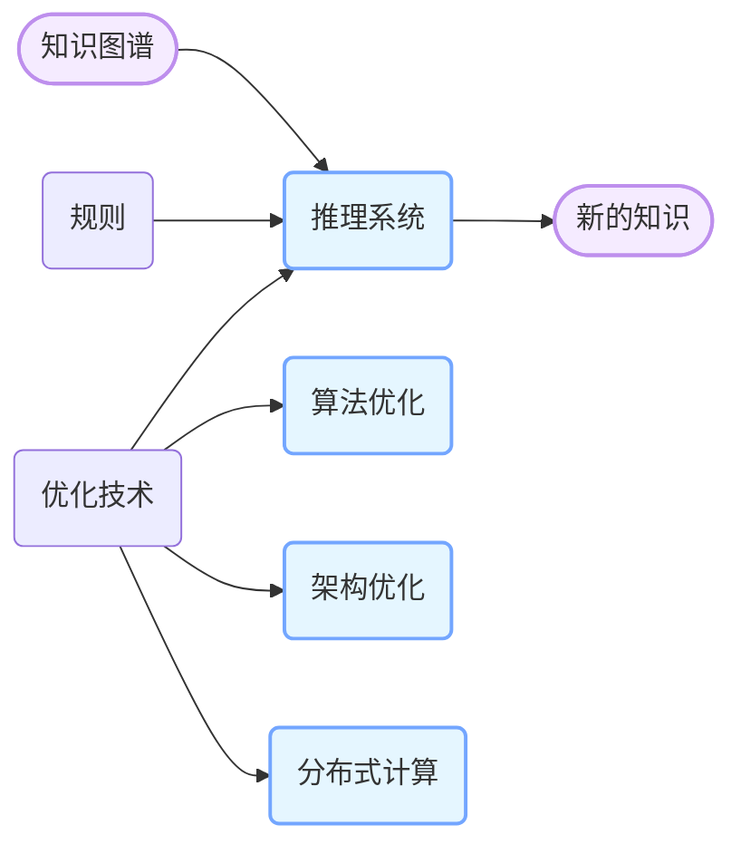

# 基于知识图谱的大规模推理系统优化技术

> 关键词：知识图谱、大规模推理系统、优化技术、图算法、分布式计算

> 摘要：本文围绕基于知识图谱的大规模推理系统优化技术展开深入探讨。首先介绍了该技术的研究背景、目的、预期读者以及文档结构，明确了核心术语和相关概念。接着阐述了知识图谱和推理系统的核心概念及其联系，给出了原理和架构的文本示意图与 Mermaid 流程图。详细讲解了核心算法原理，通过 Python 源代码进行说明，并给出了相应的数学模型和公式，辅以举例。在项目实战部分，进行了开发环境搭建，给出源代码详细实现和解读。分析了该技术的实际应用场景，推荐了学习资源、开发工具框架以及相关论文著作。最后总结了未来发展趋势与挑战，提供了常见问题解答和扩展阅读参考资料，旨在为该领域的研究和实践提供全面而深入的指导。

## 1. 背景介绍 
### 1.1 目的和范围
知识图谱作为一种语义网络，能够以结构化的方式表示实体之间的关系，广泛应用于智能问答、信息检索、推荐系统等领域。然而，随着知识图谱规模的不断增大，推理任务变得越来越复杂和耗时，这严重影响了系统的性能和响应速度。因此，对基于知识图谱的大规模推理系统进行优化具有重要的现实意义。

本文的目的在于深入研究和探讨优化基于知识图谱的大规模推理系统的相关技术，包括算法优化、架构设计、分布式计算等方面。我们将涵盖从基础概念到实际应用的各个层面，旨在为研究人员和开发者提供全面的技术指导和解决方案。

### 1.2 预期读者
本文预期读者主要包括计算机科学、人工智能、数据挖掘等领域的研究人员和学生，他们对知识图谱和推理系统有一定的了解，希望深入学习和掌握大规模推理系统的优化技术。同时，也适合从事相关软件开发和系统设计的工程师，为他们在实际项目中解决性能问题提供参考。

### 1.3 文档结构概述
本文将按照以下结构进行组织：
- 核心概念与联系：介绍知识图谱和推理系统的基本概念，以及它们之间的联系，并给出原理和架构的示意图。
- 核心算法原理 & 具体操作步骤：详细讲解优化推理系统的核心算法，使用 Python 源代码进行说明。
- 数学模型和公式 & 详细讲解 & 举例说明：给出推理系统的数学模型和公式，并进行详细讲解和举例。
- 项目实战：通过一个实际的项目案例，展示优化技术的具体应用，包括开发环境搭建、源代码实现和解读。
- 实际应用场景：分析基于知识图谱的大规模推理系统在不同领域的实际应用场景。
- 工具和资源推荐：推荐相关的学习资源、开发工具框架和论文著作。
- 总结：总结未来发展趋势与挑战。
- 附录：提供常见问题的解答和扩展阅读参考资料。

### 1.4 术语表
#### 1.4.1 核心术语定义
- **知识图谱（Knowledge Graph）**：一种以图的形式表示知识的语义网络，由实体（节点）和关系（边）组成。
- **推理系统（Reasoning System）**：根据已知的知识和规则，推导出新的知识的系统。
- **大规模推理（Large-scale Reasoning）**：在大规模知识图谱上进行的推理任务，通常涉及大量的实体和关系。
- **优化技术（Optimization Techniques）**：用于提高系统性能和效率的技术，如算法优化、架构设计、分布式计算等。

#### 1.4.2 相关概念解释
- **语义网络（Semantic Network）**：一种基于图的知识表示方法，用于表示概念之间的语义关系。
- **规则引擎（Rule Engine）**：一种基于规则的推理系统，根据预先定义的规则进行推理。
- **分布式计算（Distributed Computing）**：将计算任务分配到多个计算节点上进行并行处理的技术。

#### 1.4.3 缩略词列表
- **RDF（Resource Description Framework）**：资源描述框架，一种用于表示知识的标准语言。
- **OWL（Web Ontology Language）**：网络本体语言，用于定义知识图谱的本体。
- **SPARQL（SPARQL Protocol and RDF Query Language）**：一种用于查询 RDF 数据的语言。

## 2. 核心概念与联系 

### 知识图谱的概念
知识图谱是一种语义网络，它以图的形式表示知识。在知识图谱中，实体（如人、地点、事件等）用节点表示，实体之间的关系用边表示。例如，在一个关于人物关系的知识图谱中，“张三”和“李四”是两个实体，他们之间的“朋友”关系可以用一条边连接这两个节点来表示。

知识图谱的优点在于它能够清晰地表示实体之间的语义关系，并且可以通过图算法进行高效的查询和推理。常见的知识图谱有谷歌知识图谱、百度知识图谱等。

### 推理系统的概念
推理系统是根据已知的知识和规则，推导出新的知识的系统。在知识图谱中，推理系统可以根据已有的实体和关系，推导出新的实体和关系。例如，已知“张三是李四的朋友”和“李四是王五的朋友”，通过推理系统可以推导出“张三和王五可能是朋友”。

推理系统的核心是推理算法，常见的推理算法有基于规则的推理算法、基于机器学习的推理算法等。

### 核心概念原理和架构的文本示意图
```plaintext
知识图谱：
实体1 -[关系1]-> 实体2
实体2 -[关系2]-> 实体3
...

推理系统：
输入：知识图谱、规则
处理：推理算法
输出：新的知识（实体和关系）

优化技术：
算法优化：改进推理算法，提高推理效率
架构优化：设计合理的系统架构，支持大规模推理
分布式计算：将推理任务分配到多个节点上并行处理
```

### Mermaid 流程图


## 3. 核心算法原理 & 具体操作步骤 

### 基于规则的推理算法原理
基于规则的推理算法是最常见的推理算法之一，它根据预先定义的规则进行推理。规则通常由条件和结论两部分组成，当条件满足时，就可以得出结论。

例如，有以下规则：
```plaintext
规则1：如果 A 是 B 的父亲，B 是 C 的父亲，那么 A 是 C 的祖父。
```

在知识图谱中，如果存在“张三是李四的父亲”和“李四是王五的父亲”这样的关系，那么根据规则1就可以推导出“张三是王五的祖父”。

### Python 源代码实现
```python
# 定义知识图谱
knowledge_graph = {
    ("张三", "父亲", "李四"),
    ("李四", "父亲", "王五")
}

# 定义规则
rules = [
    {
        "条件": [("?A", "父亲", "?B"), ("?B", "父亲", "?C")],
        "结论": [("?A", "祖父", "?C")]
    }
]

# 推理函数
def reasoning(knowledge_graph, rules):
    new_knowledge = set()
    for rule in rules:
        conditions = rule["条件"]
        conclusion = rule["结论"]
        for binding in find_bindings(knowledge_graph, conditions):
            new_triples = []
            for triple in conclusion:
                new_triple = []
                for element in triple:
                    if element.startswith("?"):
                        new_triple.append(binding.get(element, element))
                    else:
                        new_triple.append(element)
                new_knowledge.add(tuple(new_triple))
    return new_knowledge

# 查找绑定函数
def find_bindings(knowledge_graph, conditions):
    bindings_list = [{}]
    for condition in conditions:
        new_bindings_list = []
        for binding in bindings_list:
            for triple in knowledge_graph:
                new_binding = binding.copy()
                if match_triple(triple, condition, new_binding):
                    new_bindings_list.append(new_binding)
        bindings_list = new_bindings_list
    return bindings_list

# 匹配三元组函数
def match_triple(triple, pattern, binding):
    for i in range(3):
        if pattern[i].startswith("?"):
            if pattern[i] in binding:
                if binding[pattern[i]]!= triple[i]:
                    return False
            else:
                binding[pattern[i]] = triple[i]
        else:
            if pattern[i]!= triple[i]:
                return False
    return True

# 进行推理
new_knowledge = reasoning(knowledge_graph, rules)
print("新的知识：", new_knowledge)
```

### 具体操作步骤
1. **定义知识图谱**：将已知的实体和关系以三元组的形式存储在一个集合中。
2. **定义规则**：将推理规则以字典的形式存储，每个规则包含条件和结论两部分。
3. **实现推理函数**：遍历规则，对于每个规则，查找满足条件的绑定，并根据绑定生成新的知识。
4. **实现查找绑定函数**：对于每个条件，查找满足条件的三元组，并更新绑定。
5. **实现匹配三元组函数**：判断一个三元组是否匹配一个模式，并更新绑定。
6. **进行推理**：调用推理函数，得到新的知识。

## 4. 数学模型和公式 & 详细讲解 & 举例说明 

### 逻辑推理的数学模型
在逻辑推理中，我们可以使用一阶逻辑来表示知识和规则。一阶逻辑由常量、变量、谓词和量词组成。

例如，我们可以用谓词 `Father(x, y)` 表示 `x` 是 `y` 的父亲，用 `Grandfather(x, y)` 表示 `x` 是 `y` 的祖父。那么上述规则可以表示为：
$$
\forall x, y, z (Father(x, y) \land Father(y, z) \rightarrow Grandfather(x, z))
$$

### 推理过程的数学表示
推理过程可以看作是一个逻辑推导的过程。给定一个知识图谱 $K$ 和一组规则 $R$，我们的目标是推导出新的知识 $K'$。

设 $T$ 是知识图谱 $K$ 中的三元组集合，$r$ 是规则 $R$ 中的一条规则，规则 $r$ 可以表示为：
$$
\bigwedge_{i=1}^{n} P_i(\vec{x}_i) \rightarrow \bigwedge_{j=1}^{m} Q_j(\vec{y}_j)
$$
其中 $P_i$ 和 $Q_j$ 是谓词，$\vec{x}_i$ 和 $\vec{y}_j$ 是变量或常量的向量。

推理过程可以分为以下几个步骤：
1. **匹配条件**：在知识图谱 $K$ 中查找满足规则 $r$ 条件的三元组。
2. **生成绑定**：根据匹配的三元组，生成变量的绑定。
3. **推导结论**：根据绑定，推导出规则 $r$ 的结论。

### 举例说明
假设知识图谱 $K$ 包含以下三元组：
$$
T = \{Father(张三, 李四), Father(李四, 王五)\}
$$
规则 $R$ 包含以下规则：
$$
r: Father(x, y) \land Father(y, z) \rightarrow Grandfather(x, z)
$$

1. **匹配条件**：在 $T$ 中查找满足 $Father(x, y)$ 和 $Father(y, z)$ 的三元组。可以找到 $(张三, 父亲, 李四)$ 和 $(李四, 父亲, 王五)$。
2. **生成绑定**：根据匹配的三元组，得到绑定 $x = 张三, y = 李四, z = 王五$。
3. **推导结论**：根据绑定，推导出 $Grandfather(张三, 王五)$。

## 5. 项目实战：代码实际案例和详细解释说明 

### 5.1  开发环境搭建
#### 安装 Python
首先，需要安装 Python 环境。可以从 Python 官方网站（https://www.python.org/downloads/）下载适合自己操作系统的 Python 版本，并按照安装向导进行安装。

#### 安装必要的库
在本项目中，我们只需要使用 Python 的标准库，不需要安装额外的库。

### 5.2  源代码详细实现和代码解读
```python
# 定义知识图谱
knowledge_graph = {
    ("张三", "父亲", "李四"),
    ("李四", "父亲", "王五")
}

# 定义规则
rules = [
    {
        "条件": [("?A", "父亲", "?B"), ("?B", "父亲", "?C")],
        "结论": [("?A", "祖父", "?C")]
    }
]

# 推理函数
def reasoning(knowledge_graph, rules):
    new_knowledge = set()
    for rule in rules:
        conditions = rule["条件"]
        conclusion = rule["结论"]
        for binding in find_bindings(knowledge_graph, conditions):
            new_triples = []
            for triple in conclusion:
                new_triple = []
                for element in triple:
                    if element.startswith("?"):
                        new_triple.append(binding.get(element, element))
                    else:
                        new_triple.append(element)
                new_knowledge.add(tuple(new_triple))
    return new_knowledge

# 查找绑定函数
def find_bindings(knowledge_graph, conditions):
    bindings_list = [{}]
    for condition in conditions:
        new_bindings_list = []
        for binding in bindings_list:
            for triple in knowledge_graph:
                new_binding = binding.copy()
                if match_triple(triple, condition, new_binding):
                    new_bindings_list.append(new_binding)
        bindings_list = new_bindings_list
    return bindings_list

# 匹配三元组函数
def match_triple(triple, pattern, binding):
    for i in range(3):
        if pattern[i].startswith("?"):
            if pattern[i] in binding:
                if binding[pattern[i]]!= triple[i]:
                    return False
            else:
                binding[pattern[i]] = triple[i]
        else:
            if pattern[i]!= triple[i]:
                return False
    return True

# 进行推理
new_knowledge = reasoning(knowledge_graph, rules)
print("新的知识：", new_knowledge)
```

#### 代码解读
1. **知识图谱的定义**：使用集合 `knowledge_graph` 存储已知的三元组。
2. **规则的定义**：使用列表 `rules` 存储推理规则，每个规则是一个字典，包含条件和结论两部分。
3. **推理函数 `reasoning`**：遍历规则，对于每个规则，调用 `find_bindings` 函数查找满足条件的绑定，并根据绑定生成新的知识。
4. **查找绑定函数 `find_bindings`**：对于每个条件，遍历知识图谱中的三元组，调用 `match_triple` 函数判断是否匹配，并更新绑定。
5. **匹配三元组函数 `match_triple`**：判断一个三元组是否匹配一个模式，并更新绑定。
6. **进行推理**：调用 `reasoning` 函数，得到新的知识，并打印输出。

### 5.3  代码解读与分析
#### 复杂度分析
- **时间复杂度**：推理函数的时间复杂度主要取决于知识图谱的大小和规则的数量。在最坏情况下，时间复杂度为 $O(n^m)$，其中 $n$ 是知识图谱中三元组的数量，$m$ 是规则中条件的数量。
- **空间复杂度**：推理函数的空间复杂度主要取决于绑定的数量。在最坏情况下，空间复杂度为 $O(n^m)$。

#### 优化建议
- **索引优化**：可以使用索引技术来加速三元组的查找，例如哈希索引、B+ 树索引等。
- **并行计算**：可以将推理任务分配到多个计算节点上进行并行处理，提高推理效率。

## 6. 实际应用场景 
### 智能问答系统
在智能问答系统中，知识图谱可以作为知识库，推理系统可以根据用户的问题和知识图谱中的信息进行推理，给出准确的答案。例如，用户问“张三的祖父是谁”，推理系统可以根据知识图谱中的信息和规则，推导出张三的祖父是谁，并给出答案。

### 信息检索系统
在信息检索系统中，推理系统可以根据用户的查询和知识图谱中的信息进行推理，扩展查询的语义，提高检索的准确性。例如，用户查询“苹果公司的创始人”，推理系统可以根据知识图谱中的信息和规则，推导出苹果公司的创始人是史蒂夫·乔布斯、史蒂夫·沃兹尼亚克和罗恩·韦恩，并返回相关的信息。

### 推荐系统
在推荐系统中，推理系统可以根据用户的历史行为和知识图谱中的信息进行推理，推荐用户可能感兴趣的物品或服务。例如，用户购买了一本书，推理系统可以根据知识图谱中的信息和规则，推导出用户可能感兴趣的其他书籍，并进行推荐。

### 金融风险评估
在金融风险评估中，知识图谱可以表示企业之间的关系、企业的财务信息等，推理系统可以根据这些信息进行推理，评估企业的信用风险和市场风险。例如，推理系统可以根据企业之间的股权关系和财务信息，推导出企业的潜在风险，并提供相应的风险预警。

## 7. 工具和资源推荐
### 7.1 学习资源推荐
#### 7.1.1 书籍推荐
- 《知识图谱：方法、实践与应用》：本书全面介绍了知识图谱的理论、方法和应用，包括知识表示、知识抽取、知识融合、知识推理等方面的内容。
- 《人工智能：一种现代的方法》：本书是人工智能领域的经典教材，涵盖了人工智能的各个方面，包括知识表示、推理、机器学习、自然语言处理等。
- 《图算法》：本书介绍了图算法的基本概念和算法，包括图的遍历、最短路径、最小生成树等，对于理解知识图谱的算法和优化技术有很大的帮助。

#### 7.1.2 在线课程
- Coursera 上的“Knowledge Graphs”课程：该课程由美国伊利诺伊大学香槟分校的教授讲授，介绍了知识图谱的基本概念、技术和应用。
- edX 上的“Artificial Intelligence”课程：该课程由麻省理工学院的教授讲授，涵盖了人工智能的各个方面，包括知识表示、推理、机器学习等。

#### 7.1.3 技术博客和网站
- 博客园：博客园上有很多关于知识图谱和推理系统的技术博客，提供了很多有价值的技术文章和案例。
- 知乎：知乎上有很多关于知识图谱和推理系统的问题和讨论，可以从中获取很多有用的信息和见解。
- 开源中国：开源中国上有很多关于知识图谱和推理系统的开源项目，可以学习和参考。

### 7.2 开发工具框架推荐
#### 7.2.1 IDE和编辑器
- PyCharm：PyCharm 是一款专门用于 Python 开发的集成开发环境，提供了丰富的功能和插件，方便开发和调试 Python 代码。
- Visual Studio Code：Visual Studio Code 是一款轻量级的代码编辑器，支持多种编程语言，包括 Python，提供了丰富的插件和扩展，方便开发和调试代码。

#### 7.2.2 调试和性能分析工具
- pdb：pdb 是 Python 的标准调试器，可以用于调试 Python 代码，查找和修复代码中的错误。
- cProfile：cProfile 是 Python 的性能分析工具，可以用于分析 Python 代码的性能，找出性能瓶颈。

#### 7.2.3 相关框架和库
- RDFLib：RDFLib 是一个用于处理 RDF 数据的 Python 库，提供了丰富的功能和接口，方便开发和处理知识图谱。
- Owlready2：Owlready2 是一个用于处理 OWL 本体的 Python 库，提供了丰富的功能和接口，方便开发和处理知识图谱。

### 7.3 相关论文著作推荐
#### 7.3.1 经典论文
- 《Knowledge Graph Embedding: A Survey of Approaches and Applications》：该论文对知识图谱嵌入的方法和应用进行了全面的综述，介绍了知识图谱嵌入的基本概念、方法和应用。
- 《Dive into Graph Neural Networks: A Survey》：该论文对图神经网络的方法和应用进行了全面的综述，介绍了图神经网络的基本概念、方法和应用。

#### 7.3.2 最新研究成果
- 每年的 AAAI、IJCAI、KDD 等顶级学术会议上都有很多关于知识图谱和推理系统的最新研究成果，可以关注这些会议的论文。
- 一些顶级学术期刊，如《Artificial Intelligence》、《Journal of Artificial Intelligence Research》等，也会发表关于知识图谱和推理系统的最新研究成果。

#### 7.3.3 应用案例分析
- 《Knowledge Graphs in Industry: Use Cases and Best Practices》：该报告介绍了知识图谱在工业领域的应用案例和最佳实践，包括智能问答、信息检索、推荐系统等方面的应用。
- 《Financial Knowledge Graph: Construction, Reasoning and Application》：该论文介绍了金融知识图谱的构建、推理和应用，包括企业信用风险评估、市场风险评估等方面的应用。

## 8. 总结：未来发展趋势与挑战
### 未来发展趋势
- **多模态知识图谱**：将文本、图像、视频等多模态数据融合到知识图谱中，构建更加丰富和全面的知识图谱，提高推理系统的性能和应用范围。
- **深度学习与知识图谱的融合**：将深度学习技术应用到知识图谱的表示、推理和应用中，提高知识图谱的表达能力和推理能力。
- **分布式推理系统**：随着知识图谱规模的不断增大，分布式推理系统将成为未来的发展趋势，通过将推理任务分配到多个计算节点上进行并行处理，提高推理系统的性能和可扩展性。
- **知识图谱的应用拓展**：知识图谱将在更多的领域得到应用，如医疗、教育、交通等，为这些领域的智能化发展提供支持。

### 挑战
- **数据质量和一致性**：知识图谱的数据来源广泛，数据质量和一致性难以保证，这会影响推理系统的性能和准确性。
- **大规模知识图谱的存储和管理**：随着知识图谱规模的不断增大，大规模知识图谱的存储和管理成为一个挑战，需要开发高效的存储和管理技术。
- **推理算法的效率和可扩展性**：在大规模知识图谱上进行推理，推理算法的效率和可扩展性是一个挑战，需要开发高效的推理算法和优化技术。
- **隐私和安全问题**：知识图谱中包含大量的敏感信息，隐私和安全问题是一个重要的挑战，需要开发有效的隐私保护和安全机制。

## 9. 附录：常见问题与解答
### 问题1：知识图谱和数据库有什么区别？
知识图谱是一种语义网络，它以图的形式表示知识，强调实体之间的语义关系。而数据库是一种数据存储和管理系统，它以表格的形式存储数据，强调数据的结构化和规范化。知识图谱可以通过图算法进行高效的查询和推理，而数据库主要通过 SQL 语句进行查询。

### 问题2：推理系统的推理结果一定是正确的吗？
推理系统的推理结果不一定是正确的，因为推理系统的推理结果依赖于已知的知识和规则。如果已知的知识和规则存在错误或不完整，那么推理结果也可能是错误的。因此，在使用推理系统时，需要对推理结果进行验证和评估。

### 问题3：如何提高推理系统的性能？
可以从以下几个方面提高推理系统的性能：
- **算法优化**：改进推理算法，提高推理效率。
- **架构优化**：设计合理的系统架构，支持大规模推理。
- **分布式计算**：将推理任务分配到多个节点上并行处理，提高推理效率。
- **索引优化**：使用索引技术来加速三元组的查找。

### 问题4：知识图谱的构建过程是怎样的？
知识图谱的构建过程主要包括以下几个步骤：
- **知识抽取**：从各种数据源中抽取实体、关系和属性等知识。
- **知识融合**：将抽取的知识进行融合，消除重复和冲突的知识。
- **知识存储**：将融合后的知识存储到知识图谱中。
- **知识推理**：根据已知的知识和规则，推导出新的知识。

## 10. 扩展阅读 & 参考资料
### 扩展阅读
- 《知识图谱导论》：本书对知识图谱的基本概念、技术和应用进行了系统的介绍，适合初学者阅读。
- 《人工智能中的不确定性推理》：本书介绍了人工智能中的不确定性推理方法，对于理解推理系统的不确定性和可靠性有很大的帮助。

### 参考资料
- 《知识图谱：方法、实践与应用》
- 《人工智能：一种现代的方法》
- 《图算法》
- 《Knowledge Graph Embedding: A Survey of Approaches and Applications》
- 《Dive into Graph Neural Networks: A Survey》
- 《Knowledge Graphs in Industry: Use Cases and Best Practices》
- 《Financial Knowledge Graph: Construction, Reasoning and Application》

作者：AI天才研究院/AI Genius Institute & 禅与计算机程序设计艺术 /Zen And The Art of Computer Programming