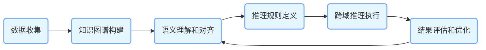

# 基于知识图谱的跨域推理能力优化框架

> 关键词：知识图谱、跨域推理、优化框架、语义理解、推理算法

> 摘要：本文聚焦于基于知识图谱的跨域推理能力优化框架。首先介绍了该研究的背景、目的、预期读者和文档结构等信息。接着详细阐述了核心概念与联系，包括知识图谱和跨域推理的原理及架构。在核心算法原理部分，使用 Python 代码进行深入讲解。同时给出了相关的数学模型和公式，并举例说明。通过项目实战展示了代码的实际案例及详细解释。探讨了该优化框架在实际中的应用场景，推荐了相关的学习资源、开发工具框架和论文著作。最后总结了未来发展趋势与挑战，还提供了常见问题解答和扩展阅读参考资料，旨在为提升基于知识图谱的跨域推理能力提供全面且深入的技术指导。

## 1. 背景介绍 
### 1.1 目的和范围
随着信息技术的飞速发展，数据呈现出爆炸式增长，且分布在不同的领域和数据源中。知识图谱作为一种强大的知识表示和管理工具，能够将不同领域的数据进行整合和关联，形成结构化的知识网络。然而，现有的知识图谱在跨域推理方面存在一定的局限性，例如无法准确理解不同领域之间的语义关联、推理效率低下等问题。

本研究的目的是构建一个基于知识图谱的跨域推理能力优化框架，旨在提高知识图谱在跨领域知识推理方面的性能和准确性。具体范围包括对知识图谱的构建、跨域推理算法的优化、以及框架的实现和评估等方面。

### 1.2 预期读者
本文的预期读者主要包括从事知识图谱、人工智能、自然语言处理等相关领域的研究人员和开发者。对于希望深入了解知识图谱跨域推理技术的学生和爱好者也具有一定的参考价值。同时，企业中负责数据管理和知识挖掘的技术人员也可以从本文中获取有益的信息，以提升企业在跨领域知识应用方面的能力。

### 1.3 文档结构概述
本文将按照以下结构进行组织：
- 核心概念与联系：介绍知识图谱和跨域推理的核心概念、原理和架构，并通过示意图和流程图进行直观展示。
- 核心算法原理 & 具体操作步骤：详细讲解跨域推理的核心算法原理，并使用 Python 代码进行具体实现和步骤说明。
- 数学模型和公式 & 详细讲解 & 举例说明：给出跨域推理相关的数学模型和公式，并结合具体例子进行详细解释。
- 项目实战：代码实际案例和详细解释说明：通过一个实际的项目案例，展示优化框架的开发环境搭建、源代码实现和代码解读。
- 实际应用场景：探讨基于知识图谱的跨域推理能力优化框架在不同领域的实际应用场景。
- 工具和资源推荐：推荐相关的学习资源、开发工具框架和论文著作。
- 总结：未来发展趋势与挑战：总结该领域的未来发展趋势和面临的挑战。
- 附录：常见问题与解答：提供常见问题的解答，帮助读者更好地理解和应用本文的内容。
- 扩展阅读 & 参考资料：列出相关的扩展阅读资料和参考文献，方便读者进一步深入研究。

### 1.4 术语表
#### 1.4.1 核心术语定义
- **知识图谱（Knowledge Graph）**：一种以图的形式表示知识的方法，由节点和边组成，节点代表实体，边代表实体之间的关系。
- **跨域推理（Cross - domain Reasoning）**：在不同领域的知识之间进行推理和推断的过程，以获取新的知识和信息。
- **语义理解（Semantic Understanding）**：对文本或数据的语义含义进行理解和分析的能力，在跨域推理中用于理解不同领域之间的语义关联。
- **推理算法（Reasoning Algorithm）**：用于在知识图谱上进行推理的算法，例如基于规则的推理算法、基于机器学习的推理算法等。

#### 1.4.2 相关概念解释
- **本体（Ontology）**：一种对特定领域的概念和关系进行明确描述的形式化模型，常用于知识图谱的构建和语义理解。
- **实体对齐（Entity Alignment）**：在不同的知识图谱或数据源中，将表示同一实体的不同节点进行匹配和合并的过程，是跨域知识融合的关键步骤。
- **图嵌入（Graph Embedding）**：将图结构中的节点和边映射到低维向量空间的技术，可用于知识图谱的表示和推理。

#### 1.4.3 缩略词列表
- **KG**：Knowledge Graph（知识图谱）
- **NLP**：Natural Language Processing（自然语言处理）
- **ML**：Machine Learning（机器学习）
- **RDF**：Resource Description Framework（资源描述框架）

## 2. 核心概念与联系 
### 知识图谱原理
知识图谱是一种语义网络，它将现实世界中的实体及其之间的关系以图的形式进行表示。知识图谱的基本组成元素包括实体（Entities）、属性（Attributes）和关系（Relations）。实体是指现实世界中的具体事物，如人、地点、组织等；属性是描述实体特征的信息，如人的姓名、年龄等；关系则表示实体之间的联系，如“位于”、“属于”等。

知识图谱的构建通常包括数据收集、数据清洗、实体识别、关系抽取和知识融合等步骤。通过这些步骤，可以将来自不同数据源的信息整合到一个统一的知识图谱中，为跨域推理提供丰富的知识基础。

### 跨域推理原理
跨域推理是指在不同领域的知识之间进行推理和推断的过程。在跨域推理中，需要解决不同领域之间的语义异构性问题，即不同领域可能使用不同的术语和概念来表示相同或相似的事物。为了实现跨域推理，需要对不同领域的知识进行语义理解和对齐，以便能够在不同领域的知识之间建立联系。

跨域推理的过程通常包括以下几个步骤：
1. **领域知识表示**：将不同领域的知识以合适的形式进行表示，例如使用知识图谱、本体等。
2. **语义理解和对齐**：对不同领域的知识进行语义分析，找出它们之间的语义关联，并进行实体对齐和关系映射。
3. **推理规则定义**：根据不同领域的知识和语义关联，定义相应的推理规则。
4. **推理执行**：在知识图谱上应用推理规则，进行跨域推理，获取新的知识和信息。

### 核心概念架构
下面是基于知识图谱的跨域推理能力优化框架的架构示意图：



该架构主要包括以下几个部分：
1. **数据收集**：从不同的数据源收集与各个领域相关的数据。
2. **知识图谱构建**：将收集到的数据进行处理和整合，构建知识图谱。
3. **语义理解和对齐**：对不同领域的知识进行语义分析和对齐，解决语义异构性问题。
4. **推理规则定义**：根据语义对齐的结果，定义跨域推理的规则。
5. **跨域推理执行**：在知识图谱上应用推理规则，进行跨域推理。
6. **结果评估和优化**：对推理结果进行评估，根据评估结果对语义理解、推理规则等进行优化。

## 3. 核心算法原理 & 具体操作步骤 
### 基于规则的跨域推理算法原理
基于规则的跨域推理算法是一种常见的跨域推理方法，它通过定义一系列的推理规则来实现跨域推理。推理规则通常以“如果...那么...”的形式表示，例如“如果实体 A 属于领域 X，实体 B 属于领域 Y，且实体 A 和实体 B 之间存在某种关系 R，那么可以推断出某个结论 C”。

下面是一个简单的基于规则的跨域推理算法的 Python 实现：

```python
# 定义知识图谱
knowledge_graph = {
    ("实体 A", "属于", "领域 X"),
    ("实体 B", "属于", "领域 Y"),
    ("实体 A", "关联", "实体 B")
}

# 定义推理规则
rules = [
    {
        "条件": [("?entity1", "属于", "领域 X"), ("?entity2", "属于", "领域 Y"), ("?entity1", "关联", "?entity2")],
        "结论": [("?entity1", "跨域关联", "?entity2")]
    }
]

def apply_rules(knowledge_graph, rules):
    new_facts = set()
    for rule in rules:
        conditions = rule["条件"]
        conclusion = rule["结论"]
        for assignment in find_assignments(knowledge_graph, conditions):
            new_fact = substitute(assignment, conclusion)
            new_facts.add(new_fact)
    return new_facts

def find_assignments(knowledge_graph, conditions):
    assignments = [{}]
    for condition in conditions:
        new_assignments = []
        for assignment in assignments:
            for fact in knowledge_graph:
                new_assignment = match(fact, condition, assignment)
                if new_assignment is not None:
                    new_assignments.append(new_assignment)
        assignments = new_assignments
    return assignments

def match(fact, condition, assignment):
    new_assignment = assignment.copy()
    for i in range(len(fact)):
        if condition[i].startswith("?"):
            variable = condition[i]
            if variable in new_assignment:
                if new_assignment[variable]!= fact[i]:
                    return None
            else:
                new_assignment[variable] = fact[i]
        else:
            if condition[i]!= fact[i]:
                return None
    return new_assignment

def substitute(assignment, conclusion):
    substituted_conclusion = []
    for fact in conclusion:
        substituted_fact = []
        for element in fact:
            if element.startswith("?"):
                substituted_fact.append(assignment[element])
            else:
                substituted_fact.append(element)
        substituted_conclusion.append(tuple(substituted_fact))
    return tuple(substituted_conclusion)

# 应用推理规则
new_facts = apply_rules(knowledge_graph, rules)
print("新的推理结果:", new_facts)
```

### 具体操作步骤
1. **知识图谱构建**：首先需要构建一个包含不同领域知识的知识图谱，可以使用 RDF 等标准格式进行表示。
2. **推理规则定义**：根据不同领域的知识和语义关联，定义相应的推理规则。推理规则可以手动定义，也可以通过机器学习等方法自动学习。
3. **推理规则应用**：将定义好的推理规则应用到知识图谱上，通过匹配规则的条件和知识图谱中的事实，推断出新的知识和信息。
4. **结果评估和优化**：对推理结果进行评估，检查推理结果的准确性和完整性。如果推理结果不理想，可以对推理规则进行调整和优化，或者对知识图谱进行进一步的完善。

## 4. 数学模型和公式 & 详细讲解 & 举例说明 
### 跨域推理的数学模型
假设我们有两个不同的领域 $D_1$ 和 $D_2$，对应的知识图谱分别为 $KG_1 = (E_1, R_1)$ 和 $KG_2 = (E_2, R_2)$，其中 $E_1$ 和 $E_2$ 分别是两个知识图谱中的实体集合，$R_1$ 和 $R_2$ 分别是两个知识图谱中的关系集合。

跨域推理的目标是在 $KG_1$ 和 $KG_2$ 之间建立联系，进行跨域知识的推理。我们可以定义一个跨域关系集合 $R_{cross}$，表示 $KG_1$ 和 $KG_2$ 之间的关系。

设 $s \in E_1$，$o \in E_2$，$r \in R_{cross}$，则一个跨域三元组可以表示为 $(s, r, o)$。跨域推理的过程就是根据已知的跨域三元组和知识图谱中的其他信息，推断出新的跨域三元组。

### 推理规则的数学表示
推理规则可以用一阶逻辑公式来表示。例如，一个简单的推理规则可以表示为：

$$\forall s_1, o_1, s_2, o_2 ((s_1, r_1, o_1) \land (s_2, r_2, o_2) \land (o_1 = s_2) \rightarrow (s_1, r_{new}, o_2))$$

其中，$(s_1, r_1, o_1)$ 和 $(s_2, r_2, o_2)$ 是已知的三元组，$r_{new}$ 是根据推理规则推断出的新关系。

### 举例说明
假设我们有两个领域：医学领域和生物学领域。医学领域的知识图谱 $KG_{medical}$ 包含三元组 $("患者 A", "患有", "疾病 X")$，生物学领域的知识图谱 $KG_{biology}$ 包含三元组 $("疾病 X", "由...引起", "病毒 Y")$。

我们可以定义一个跨域推理规则：

$$\forall patient, disease, virus ((patient, "患有", disease) \land (disease, "由...引起", virus) \rightarrow (patient, "感染", virus))$$

根据这个推理规则，我们可以从 $KG_{medical}$ 和 $KG_{biology}$ 中推断出一个新的跨域三元组 $("患者 A", "感染", "病毒 Y")$。

## 5. 项目实战：代码实际案例和详细解释说明 
### 5.1  开发环境搭建
为了实现基于知识图谱的跨域推理能力优化框架，我们需要搭建以下开发环境：
1. **Python 环境**：建议使用 Python 3.7 及以上版本。
2. **知识图谱处理库**：可以使用 `rdflib` 库来处理 RDF 格式的知识图谱。
3. **机器学习库**：如果需要使用机器学习方法进行推理规则学习，可以使用 `scikit - learn` 等库。

以下是安装所需库的命令：

```bash
pip install rdflib scikit-learn
```

### 5.2  源代码详细实现和代码解读
下面是一个完整的基于知识图谱的跨域推理项目的 Python 代码示例：

```python
import rdflib

# 构建知识图谱
def build_knowledge_graph():
    g = rdflib.Graph()
    # 医学领域知识
    patient = rdflib.URIRef("http://example.org/patientA")
    disease = rdflib.URIRef("http://example.org/diseaseX")
    g.add((patient, rdflib.URIRef("http://example.org/has"), disease))
    # 生物学领域知识
    virus = rdflib.URIRef("http://example.org/virusY")
    g.add((disease, rdflib.URIRef("http://example.org/caused_by"), virus))
    return g

# 定义推理规则
def define_rules():
    rules = [
        {
            "条件": [
                ("?patient", rdflib.URIRef("http://example.org/has"), "?disease"),
                ("?disease", rdflib.URIRef("http://example.org/caused_by"), "?virus")
            ],
            "结论": [
                ("?patient", rdflib.URIRef("http://example.org/infected_by"), "?virus")
            ]
        }
    ]
    return rules

# 应用推理规则
def apply_rules(knowledge_graph, rules):
    new_facts = set()
    for rule in rules:
        conditions = rule["条件"]
        conclusion = rule["结论"]
        query = "SELECT "
        variables = set()
        for condition in conditions:
            for element in condition:
                if isinstance(element, str) and element.startswith("?"):
                    variables.add(element)
        for variable in variables:
            query += variable + " "
        query += "WHERE {"
        for condition in conditions:
            subject, predicate, obj = condition
            if isinstance(subject, str) and subject.startswith("?"):
                subject_str = subject
            else:
                subject_str = f"<{subject}>"
            if isinstance(predicate, str) and predicate.startswith("?"):
                predicate_str = predicate
            else:
                predicate_str = f"<{predicate}>"
            if isinstance(obj, str) and obj.startswith("?"):
                obj_str = obj
            else:
                obj_str = f"<{obj}>"
            query += f"{subject_str} {predicate_str} {obj_str}. "
        query += "}"
        results = knowledge_graph.query(query)
        for result in results:
            assignment = {str(var): result[i] for i, var in enumerate(variables)}
            substituted_conclusion = []
            for fact in conclusion:
                substituted_fact = []
                for element in fact:
                    if isinstance(element, str) and element.startswith("?"):
                        substituted_fact.append(assignment[element])
                    else:
                        substituted_fact.append(element)
                substituted_conclusion.append(tuple(substituted_fact))
            new_facts.add(tuple(substituted_conclusion))
    return new_facts

# 主函数
def main():
    knowledge_graph = build_knowledge_graph()
    rules = define_rules()
    new_facts = apply_rules(knowledge_graph, rules)
    print("新的推理结果:")
    for fact in new_facts:
        for sub_fact in fact:
            print(sub_fact)

if __name__ == "__main__":
    main()
```

### 5.3  代码解读与分析
1. **构建知识图谱**：`build_knowledge_graph` 函数使用 `rdflib` 库构建了一个包含医学领域和生物学领域知识的知识图谱。
2. **定义推理规则**：`define_rules` 函数定义了一个跨域推理规则，用于从患者患有某种疾病和该疾病由某种病毒引起，推断出患者感染了该病毒。
3. **应用推理规则**：`apply_rules` 函数将定义好的推理规则应用到知识图谱上，通过 SPARQL 查询匹配规则的条件，推断出新的知识和信息。
4. **主函数**：`main` 函数调用上述函数，完成知识图谱的构建、推理规则的定义和应用，并输出推理结果。

## 6. 实际应用场景 
### 医疗健康领域
在医疗健康领域，基于知识图谱的跨域推理能力优化框架可以用于整合医学知识、生物学知识和临床数据等不同领域的信息。例如，通过跨域推理可以从患者的基因信息、疾病诊断信息和药物信息中推断出最适合患者的治疗方案。同时，还可以帮助医生发现疾病之间的潜在关联，提高疾病诊断的准确性和效率。

### 金融领域
在金融领域，该框架可以用于整合金融市场数据、企业财务数据和宏观经济数据等不同领域的信息。通过跨域推理，可以预测金融市场的走势、评估企业的信用风险和发现潜在的投资机会。例如，根据企业的财务报表和行业发展趋势，推断出企业未来的盈利能力和偿债能力。

### 智能交通领域
在智能交通领域，该框架可以用于整合交通流量数据、地理信息数据和气象数据等不同领域的信息。通过跨域推理，可以实现交通拥堵预测、路径规划优化和交通事故预警等功能。例如，根据实时交通流量、道路状况和气象条件，推断出最佳的出行路线，提高交通效率和安全性。

### 教育领域
在教育领域，该框架可以用于整合教育资源、学生学习数据和教育评价数据等不同领域的信息。通过跨域推理，可以实现个性化学习推荐、学生学习能力评估和教学质量评价等功能。例如，根据学生的学习历史、兴趣爱好和知识掌握情况，推断出适合学生的学习资源和学习路径，提高教育教学效果。

## 7. 工具和资源推荐
### 7.1 学习资源推荐
#### 7.1.1 书籍推荐
- 《知识图谱：方法、实践与应用》：全面介绍了知识图谱的基本概念、构建方法、推理技术和应用案例，是学习知识图谱的经典书籍。
- 《人工智能：一种现代的方法》：涵盖了人工智能的各个领域，包括知识表示、推理、机器学习等，对于理解跨域推理的相关理论和技术有很大的帮助。
- 《自然语言处理入门》：介绍了自然语言处理的基本方法和技术，对于处理知识图谱中的文本信息和实现语义理解有重要的参考价值。

#### 7.1.2 在线课程
- Coursera 上的“Knowledge Graphs”课程：由知名高校的教授授课，系统地介绍了知识图谱的理论和实践。
- edX 上的“Artificial Intelligence”课程：涵盖了人工智能的核心内容，包括知识表示和推理，适合初学者学习。
- 中国大学 MOOC 上的“自然语言处理”课程：提供了丰富的自然语言处理知识和实践案例，有助于提升语义理解和处理能力。

#### 7.1.3 技术博客和网站
- 知识图谱社区（https://www.knowledgegraph.tech/）：提供了知识图谱领域的最新技术动态、研究成果和实践经验分享。
- AI 科技评论（https://www.aitechtitans.com/）：关注人工智能领域的前沿技术和应用，有很多关于知识图谱和跨域推理的深度文章。
- 机器之心（https://www.alldatasheet.com/）：提供了丰富的人工智能技术资讯和研究报告，对于了解行业发展趋势有很大的帮助。

### 7.2 开发工具框架推荐
#### 7.2.1 IDE和编辑器
- PyCharm：一款专业的 Python 集成开发环境，提供了丰富的代码编辑、调试和项目管理功能，适合开发基于 Python 的知识图谱和跨域推理项目。
- Jupyter Notebook：一种交互式的开发环境，支持 Python 等多种编程语言，方便进行代码演示和数据分析，对于知识图谱的实验和研究非常有用。
- Visual Studio Code：一款轻量级的代码编辑器，支持多种编程语言和插件扩展，具有良好的代码编辑体验和开发效率。

#### 7.2.2 调试和性能分析工具
- pdb：Python 自带的调试工具，可以帮助开发者定位代码中的问题和错误。
- cProfile：Python 的性能分析工具，可以分析代码的运行时间和函数调用情况，帮助开发者优化代码性能。
- TensorBoard：用于可视化深度学习模型的训练过程和性能指标，对于使用机器学习方法进行跨域推理的项目有很大的帮助。

#### 7.2.3 相关框架和库
- rdflib：用于处理 RDF 格式的知识图谱，提供了丰富的 API 来创建、查询和操作知识图谱。
- NetworkX：一个用于创建、操作和研究复杂网络的 Python 库，可以用于知识图谱的图结构分析和可视化。
- PyTorch 和 TensorFlow：流行的深度学习框架，可用于实现基于机器学习的跨域推理算法，如知识图谱嵌入和神经网络推理。

### 7.3 相关论文著作推荐
#### 7.3.1 经典论文
- “Knowledge Graph Embedding: A Survey of Approaches and Applications”：对知识图谱嵌入技术进行了全面的综述，介绍了各种知识图谱嵌入方法和应用场景。
- “Semantic Web Rule Language (SWRL): Combining OWL and RuleML”：提出了一种将 OWL 本体和 RuleML 规则语言相结合的语义 Web 规则语言，用于实现基于规则的知识推理。
- “TransE: Translating Embeddings for Modeling Multi-relational Data”：提出了 TransE 模型，用于将知识图谱中的实体和关系嵌入到低维向量空间中，为知识图谱的推理和表示提供了新的方法。

#### 7.3.2 最新研究成果
- 关注 AAAI、IJCAI、KDD 等顶级人工智能会议和期刊上的最新研究论文，了解基于知识图谱的跨域推理领域的最新技术和方法。
- 参考 ArXiv 等预印本平台上的相关研究成果，获取最新的研究动态和前沿思想。

#### 7.3.3 应用案例分析
- 研究一些实际应用案例的论文，如医疗健康、金融、交通等领域的知识图谱跨域推理应用案例，学习如何将理论技术应用到实际场景中。

## 8. 总结：未来发展趋势与挑战
### 未来发展趋势
- **多模态知识融合**：未来的知识图谱将不仅仅局限于文本信息，还将融合图像、音频、视频等多模态数据，实现更加全面和准确的知识表示和推理。
- **深度学习与知识图谱的深度融合**：深度学习技术在自然语言处理、图像识别等领域取得了巨大的成功，未来将与知识图谱技术深度融合，提高跨域推理的准确性和效率。
- **知识图谱的自动化构建和更新**：随着数据量的不断增加，手动构建和更新知识图谱变得越来越困难。未来将发展自动化的知识图谱构建和更新技术，实现知识图谱的实时动态更新。
- **跨领域知识服务**：基于知识图谱的跨域推理能力优化框架将为不同领域提供更加智能和个性化的知识服务，如智能医疗诊断、智能金融决策等。

### 挑战
- **语义异构性问题**：不同领域之间的语义异构性是跨域推理面临的主要挑战之一。如何准确理解和对齐不同领域的语义信息，仍然是一个亟待解决的问题。
- **数据质量和完整性**：知识图谱的质量和完整性直接影响跨域推理的效果。然而，现实世界中的数据往往存在噪声、缺失和错误等问题，如何处理这些问题，提高数据质量和完整性，是一个重要的挑战。
- **计算资源和效率**：随着知识图谱的规模不断增大，跨域推理的计算复杂度也随之增加。如何在有限的计算资源下提高推理效率，是一个需要解决的技术难题。
- **隐私和安全问题**：在跨领域知识融合和推理过程中，涉及到大量的敏感信息，如个人隐私、商业机密等。如何保障数据的隐私和安全，防止信息泄露，是一个不容忽视的问题。

## 9. 附录：常见问题与解答
### 问题 1：知识图谱和传统数据库有什么区别？
知识图谱和传统数据库有以下几个主要区别：
- **数据模型**：传统数据库通常采用关系型数据模型，以表的形式存储数据；而知识图谱采用图数据模型，以节点和边的形式表示实体和关系。
- **语义表达**：知识图谱具有更强的语义表达能力，能够表示实体之间的复杂关系和语义信息；而传统数据库主要关注数据的存储和查询，语义表达能力相对较弱。
- **推理能力**：知识图谱支持推理功能，可以根据已有的知识推断出新的知识；而传统数据库一般不具备推理能力。

### 问题 2：如何选择合适的跨域推理算法？
选择合适的跨域推理算法需要考虑以下几个因素：
- **知识图谱的规模和复杂度**：如果知识图谱规模较小、结构简单，可以选择基于规则的推理算法；如果知识图谱规模较大、结构复杂，可以考虑使用基于机器学习的推理算法。
- **推理任务的要求**：不同的推理任务对推理结果的准确性、效率和可解释性有不同的要求。例如，对于一些对准确性要求较高的任务，可以选择基于逻辑推理的算法；对于一些对效率要求较高的任务，可以选择基于深度学习的算法。
- **数据的特点**：如果数据具有丰富的语义信息，可以选择能够利用语义信息进行推理的算法；如果数据存在噪声和缺失值，需要选择具有一定鲁棒性的算法。

### 问题 3：如何评估跨域推理的效果？
评估跨域推理的效果可以从以下几个方面进行：
- **准确性**：通过比较推理结果与真实结果的一致性来评估推理的准确性。可以使用准确率、召回率、F1 值等指标来衡量。
- **完整性**：检查推理结果是否涵盖了所有可能的正确结论，评估推理的完整性。
- **效率**：记录推理过程的时间和资源消耗，评估推理的效率。可以使用推理时间、内存占用等指标来衡量。
- **可解释性**：评估推理结果的可解释性，即能否清晰地解释推理的过程和依据。

## 10. 扩展阅读 & 参考资料
### 扩展阅读
- 《大数据知识工程》：介绍了大数据环境下知识工程的相关理论和技术，对于理解知识图谱的构建和应用有更深入的帮助。
- 《图神经网络：基础、前沿与应用》：详细介绍了图神经网络的原理和应用，对于使用图神经网络进行知识图谱推理有很大的参考价值。
- 《人工智能前沿技术》：涵盖了人工智能领域的最新前沿技术和研究成果，有助于了解基于知识图谱的跨域推理领域的发展趋势。

### 参考资料
- 相关学术论文和研究报告，如 AAAI、IJCAI、KDD 等会议和期刊上的论文。
- 开源知识图谱项目，如 Wikidata、DBpedia 等，可用于学习和实践知识图谱的构建和应用。
- 技术博客和论坛，如 Stack Overflow、GitHub 等，可获取更多的技术经验和代码示例。

作者：AI天才研究院/AI Genius Institute & 禅与计算机程序设计艺术 /Zen And The Art of Computer Programming