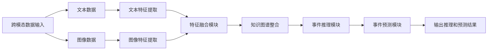

# 基于知识图谱的跨模态事件推理与预测

> 关键词：知识图谱、跨模态、事件推理、事件预测、多模态融合

> 摘要：本文聚焦于基于知识图谱的跨模态事件推理与预测这一前沿领域。首先介绍了该研究的背景，包括其目的、预期读者、文档结构和相关术语。接着详细阐述了核心概念，如知识图谱、跨模态信息等及其联系，并给出了相应的文本示意图和 Mermaid 流程图。在核心算法原理部分，使用 Python 代码进行了详细说明。同时，引入数学模型和公式，结合具体例子进行讲解。通过项目实战，展示了代码的实际应用并进行详细解读。分析了该技术在多个领域的实际应用场景，推荐了相关的学习资源、开发工具和论文著作。最后总结了未来发展趋势与挑战，并提供了常见问题解答和扩展阅读参考资料，旨在为相关研究和应用提供全面且深入的指导。

## 1. 背景介绍 
### 1.1 目的和范围
随着信息技术的飞速发展，数据呈现出多样化和多模态的特点，包括文本、图像、视频、音频等。知识图谱作为一种结构化的语义网络，能够有效地组织和表示知识。基于知识图谱的跨模态事件推理与预测旨在整合不同模态的数据信息，借助知识图谱的语义关联，实现对事件的推理和未来发展的预测。

本研究的范围涵盖了知识图谱的构建与应用、跨模态信息的融合方法、事件推理的算法设计以及事件预测的模型建立等方面。同时，探讨了该技术在多个实际领域的应用，如智能安防、金融风险预警、医疗诊断等。

### 1.2 预期读者
本文预期读者包括人工智能、计算机科学、信息科学等领域的研究人员、工程师和学生。对于从事知识图谱、跨模态处理、事件推理与预测等相关研究和开发的专业人士，本文可以提供理论基础和实践指导；对于初学者，能够帮助他们了解该领域的基本概念和技术方法。

### 1.3 文档结构概述
本文将按照以下结构展开：首先介绍核心概念与联系，明确相关术语和概念的含义以及它们之间的关系；接着阐述核心算法原理和具体操作步骤，通过 Python 代码进行详细说明；然后引入数学模型和公式，并结合具体例子进行讲解；之后通过项目实战展示代码的实际应用和详细解读；分析该技术在实际场景中的应用；推荐相关的学习资源、开发工具和论文著作；最后总结未来发展趋势与挑战，提供常见问题解答和扩展阅读参考资料。

### 1.4 术语表
#### 1.4.1 核心术语定义
- **知识图谱**：一种语义网络，由实体、关系和属性组成，用于表示现实世界中的知识和信息。
- **跨模态**：指涉及多种不同数据模态，如文本、图像、音频、视频等。
- **事件推理**：根据已知的信息和知识，推断出未知事件的过程。
- **事件预测**：基于历史数据和当前状态，对未来事件的发生和发展进行预测。
- **多模态融合**：将不同模态的数据进行整合和处理，以获取更全面和准确的信息。

#### 1.4.2 相关概念解释
- **实体**：知识图谱中的基本元素，代表现实世界中的具体对象，如人、地点、组织等。
- **关系**：表示实体之间的联系，如“属于”、“位于”、“合作”等。
- **属性**：描述实体的特征和性质，如人的年龄、身高，地点的面积、人口等。
- **模态特征**：每种数据模态所具有的独特特征，如文本的词向量、图像的视觉特征等。

#### 1.4.3 缩略词列表
- **KG**：Knowledge Graph，知识图谱
- **NLP**：Natural Language Processing，自然语言处理
- **CV**：Computer Vision，计算机视觉
- **ML**：Machine Learning，机器学习
- **DL**：Deep Learning，深度学习

## 2. 核心概念与联系 

### 核心概念原理
#### 知识图谱
知识图谱是一种以图的形式表示知识的方法，它由节点和边组成。节点表示实体，边表示实体之间的关系。例如，在一个人物知识图谱中，“张三”和“李四”是实体节点，“朋友”是他们之间的关系边。知识图谱可以通过三元组 $(h, r, t)$ 来表示，其中 $h$ 是头实体，$r$ 是关系，$t$ 是尾实体。

知识图谱的构建过程通常包括实体识别、关系抽取和知识融合等步骤。实体识别是从文本等数据中识别出实体，关系抽取是确定实体之间的关系，知识融合是将不同来源的知识进行整合和统一。

#### 跨模态信息
跨模态信息指的是来自不同数据模态的信息。不同模态的数据具有不同的特征和表示方式。例如，文本数据可以用单词、句子来表示，图像数据可以用像素值、特征向量来表示。跨模态信息融合的目的是将这些不同模态的数据进行整合，以获取更全面和准确的信息。

#### 事件推理与预测
事件推理是根据已知的事件信息和知识图谱中的知识，推断出未知事件的过程。例如，已知“张三参加了一个商务会议”，通过知识图谱中“商务会议通常会涉及合作洽谈”的知识，可以推断出“张三可能参与了合作洽谈”。

事件预测是基于历史事件数据和当前状态，对未来事件的发生和发展进行预测。例如，根据股票市场的历史数据和当前的经济形势，预测股票价格的走势。

### 架构的文本示意图
```plaintext
                跨模态数据输入
                /            \
           文本数据        图像数据
            |               |
        文本特征提取    图像特征提取
            |               |
        特征融合模块
            |
        知识图谱整合
            |
        事件推理模块
            |
        事件预测模块
            |
        输出推理和预测结果
```

### Mermaid 流程图


## 3. 核心算法原理 & 具体操作步骤 

### 特征提取算法
#### 文本特征提取
对于文本数据，我们可以使用词嵌入技术将文本转换为向量表示。常见的词嵌入模型有 Word2Vec、GloVe 等。以下是使用 Python 和 `gensim` 库实现 Word2Vec 词嵌入的示例代码：

```python
from gensim.models import Word2Vec
import numpy as np

# 示例文本数据
sentences = [["this", "is", "a", "sample"], ["another", "sample", "sentence"]]

# 训练 Word2Vec 模型
model = Word2Vec(sentences, min_count=1)

# 获取单词的向量表示
word_vector = model.wv['sample']
print("Word vector:", word_vector)

# 计算句子的向量表示
def sentence_vector(sentence, model):
    vectors = [model.wv[word] for word in sentence if word in model.wv]
    if not vectors:
        return np.zeros(model.vector_size)
    return np.mean(vectors, axis=0)

sentence_vector = sentence_vector(sentences[0], model)
print("Sentence vector:", sentence_vector)
```

#### 图像特征提取
对于图像数据，我们可以使用预训练的卷积神经网络（CNN），如 ResNet、VGG 等，提取图像的特征。以下是使用 Python 和 `torchvision` 库实现 ResNet 图像特征提取的示例代码：

```python
import torch
import torchvision.models as models
import torchvision.transforms as transforms
from PIL import Image

# 加载预训练的 ResNet 模型
model = models.resnet18(pretrained=True)
model.eval()

# 定义图像预处理转换
preprocess = transforms.Compose([
    transforms.Resize(256),
    transforms.CenterCrop(224),
    transforms.ToTensor(),
    transforms.Normalize(mean=[0.485, 0.456, 0.406], std=[0.229, 0.224, 0.225])
])

# 加载图像
image = Image.open('example.jpg')
input_tensor = preprocess(image)
input_batch = input_tensor.unsqueeze(0)

# 提取图像特征
with torch.no_grad():
    features = model(input_batch)
print("Image features:", features)
```

### 特征融合算法
特征融合的目的是将不同模态的特征进行整合。常见的融合方法有早期融合、晚期融合和混合融合等。以下是一个简单的早期融合示例，将文本特征和图像特征进行拼接：

```python
import numpy as np

# 假设已经提取了文本特征和图像特征
text_feature = np.random.rand(128)
image_feature = np.random.rand(256)

# 早期融合：特征拼接
fused_feature = np.concatenate((text_feature, image_feature))
print("Fused feature shape:", fused_feature.shape)
```

### 知识图谱整合算法
知识图谱整合是将融合后的特征与知识图谱中的知识进行关联。可以使用图神经网络（GNN）来实现知识图谱的表示学习和信息传播。以下是一个简单的图神经网络示例：

```python
import torch
import torch.nn as nn
import torch.nn.functional as F

# 定义图神经网络层
class GraphConvolution(nn.Module):
    def __init__(self, in_features, out_features):
        super(GraphConvolution, self).__init__()
        self.weight = nn.Parameter(torch.FloatTensor(in_features, out_features))
        nn.init.xavier_uniform_(self.weight)

    def forward(self, input, adj):
        support = torch.mm(input, self.weight)
        output = torch.spmm(adj, support)
        return output

# 定义图神经网络模型
class GNN(nn.Module):
    def __init__(self, nfeat, nhid):
        super(GNN, self).__init__()
        self.gc1 = GraphConvolution(nfeat, nhid)

    def forward(self, x, adj):
        x = F.relu(self.gc1(x, adj))
        return x

# 示例输入
nfeat = 384  # 融合特征的维度
nhid = 128
x = torch.randn(10, nfeat)  # 节点特征
adj = torch.randn(10, 10)  # 邻接矩阵

# 初始化模型
model = GNN(nfeat, nhid)

# 前向传播
output = model(x, adj)
print("GNN output shape:", output.shape)
```

### 事件推理与预测算法
事件推理和预测可以使用机器学习或深度学习模型，如循环神经网络（RNN）、长短时记忆网络（LSTM）等。以下是一个使用 LSTM 进行事件预测的示例代码：

```python
import torch
import torch.nn as nn

# 定义 LSTM 模型
class LSTMModel(nn.Module):
    def __init__(self, input_size, hidden_size, output_size):
        super(LSTMModel, self).__init__()
        self.lstm = nn.LSTM(input_size, hidden_size, batch_first=True)
        self.fc = nn.Linear(hidden_size, output_size)

    def forward(self, x):
        out, _ = self.lstm(x)
        out = self.fc(out[:, -1, :])
        return out

# 示例输入
input_size = 128
hidden_size = 64
output_size = 1
batch_size = 32
seq_length = 10

x = torch.randn(batch_size, seq_length, input_size)

# 初始化模型
model = LSTMModel(input_size, hidden_size, output_size)

# 前向传播
output = model(x)
print("LSTM output shape:", output.shape)
```

## 4. 数学模型和公式 & 详细讲解 & 举例说明 

### 特征提取
#### 词嵌入
Word2Vec 模型基于神经网络，通过预测上下文单词来学习单词的向量表示。其目标是最大化给定中心单词 $w_c$ 时上下文单词 $w_o$ 的概率，即：

$$
\max \prod_{t=1}^{T} \prod_{-m \leq j \leq m, j \neq 0} P(w_{t+j} | w_t)
$$

其中 $T$ 是文本的长度，$m$ 是上下文窗口的大小。

例如，对于句子 “this is a sample”，当中心单词为 “sample” 时，上下文窗口大小为 2，上下文单词为 “is”、“a”。

#### 图像特征提取
卷积神经网络（CNN）通过卷积层、池化层和全连接层对图像进行特征提取。卷积层的卷积操作可以表示为：

$$
y_{i,j}^l = \sum_{m=0}^{M-1} \sum_{n=0}^{N-1} x_{i+m,j+n}^{l-1} \cdot k_{m,n}^l + b^l
$$

其中 $y_{i,j}^l$ 是第 $l$ 层卷积层的输出特征图的 $(i,j)$ 位置的值，$x_{i+m,j+n}^{l-1}$ 是第 $l-1$ 层输入特征图的 $(i+m,j+n)$ 位置的值，$k_{m,n}^l$ 是第 $l$ 层的卷积核，$b^l$ 是偏置。

### 特征融合
早期融合的特征拼接可以表示为：

$$
f_{fused} = [f_{text}; f_{image}]
$$

其中 $f_{text}$ 是文本特征，$f_{image}$ 是图像特征，$[;]$ 表示向量拼接操作。

例如，$f_{text} = [0.1, 0.2, 0.3]$，$f_{image} = [0.4, 0.5, 0.6, 0.7]$，则 $f_{fused} = [0.1, 0.2, 0.3, 0.4, 0.5, 0.6, 0.7]$。

### 知识图谱整合
图神经网络（GNN）的图卷积操作可以表示为：

$$
H^{(l+1)} = \sigma(\tilde{D}^{-\frac{1}{2}} \tilde{A} \tilde{D}^{-\frac{1}{2}} H^{(l)} W^{(l)})
$$

其中 $H^{(l)}$ 是第 $l$ 层的节点特征矩阵，$\tilde{A} = A + I$ 是邻接矩阵加上自环，$\tilde{D}$ 是 $\tilde{A}$ 的度矩阵，$W^{(l)}$ 是第 $l$ 层的可学习权重矩阵，$\sigma$ 是激活函数。

例如，假设有 3 个节点的图，邻接矩阵 $A = \begin{bmatrix} 0 & 1 & 0 \\ 1 & 0 & 1 \\ 0 & 1 & 0 \end{bmatrix}$，$I$ 是单位矩阵，$\tilde{A} = \begin{bmatrix} 1 & 1 & 0 \\ 1 & 1 & 1 \\ 0 & 1 & 1 \end{bmatrix}$，$\tilde{D} = \begin{bmatrix} 2 & 0 & 0 \\ 0 & 3 & 0 \\ 0 & 0 & 2 \end{bmatrix}$。

### 事件推理与预测
LSTM 单元的计算公式如下：

$$
\begin{align*}
i_t &= \sigma(W_{ii} x_t + W_{hi} h_{t-1} + b_i) \\
f_t &= \sigma(W_{if} x_t + W_{hf} h_{t-1} + b_f) \\
o_t &= \sigma(W_{io} x_t + W_{ho} h_{t-1} + b_o) \\
\tilde{C}_t &= \tanh(W_{ic} x_t + W_{hc} h_{t-1} + b_c) \\
C_t &= f_t \odot C_{t-1} + i_t \odot \tilde{C}_t \\
h_t &= o_t \odot \tanh(C_t)
\end{align*}
$$

其中 $i_t$ 是输入门，$f_t$ 是遗忘门，$o_t$ 是输出门，$\tilde{C}_t$ 是候选记忆单元，$C_t$ 是记忆单元，$h_t$ 是隐藏状态，$x_t$ 是输入，$W$ 是权重矩阵，$b$ 是偏置，$\sigma$ 是 sigmoid 函数，$\odot$ 是逐元素相乘。

例如，对于时间步 $t = 1$，已知输入 $x_1$ 和上一时刻的隐藏状态 $h_0$，可以通过上述公式计算当前时刻的隐藏状态 $h_1$。

## 5. 项目实战：代码实际案例和详细解释说明 

### 5.1  开发环境搭建
#### 安装 Python
首先需要安装 Python 环境，建议使用 Python 3.7 及以上版本。可以从 Python 官方网站（https://www.python.org/downloads/）下载并安装。

#### 安装依赖库
使用 `pip` 命令安装所需的依赖库，以下是一些常用的库：

```bash
pip install gensim torch torchvision numpy
```

### 5.2  源代码详细实现和代码解读
以下是一个完整的基于知识图谱的跨模态事件推理与预测的代码示例：

```python
import torch
import torch.nn as nn
import torch.optim as optim
from gensim.models import Word2Vec
import torchvision.models as models
import torchvision.transforms as transforms
from PIL import Image
import numpy as np

# 文本特征提取
def text_feature_extraction(sentences):
    model = Word2Vec(sentences, min_count=1)
    def sentence_vector(sentence, model):
        vectors = [model.wv[word] for word in sentence if word in model.wv]
        if not vectors:
            return np.zeros(model.vector_size)
        return np.mean(vectors, axis=0)
    text_features = [sentence_vector(sentence, model) for sentence in sentences]
    return torch.tensor(text_features, dtype=torch.float32)

# 图像特征提取
def image_feature_extraction(image_path):
    model = models.resnet18(pretrained=True)
    model.eval()
    preprocess = transforms.Compose([
        transforms.Resize(256),
        transforms.CenterCrop(224),
        transforms.ToTensor(),
        transforms.Normalize(mean=[0.485, 0.456, 0.406], std=[0.229, 0.224, 0.225])
    ])
    image = Image.open(image_path)
    input_tensor = preprocess(image)
    input_batch = input_tensor.unsqueeze(0)
    with torch.no_grad():
        features = model(input_batch)
    return features.squeeze()

# 特征融合
def feature_fusion(text_feature, image_feature):
    fused_feature = torch.cat((text_feature, image_feature), dim=0)
    return fused_feature

# 图神经网络层
class GraphConvolution(nn.Module):
    def __init__(self, in_features, out_features):
        super(GraphConvolution, self).__init__()
        self.weight = nn.Parameter(torch.FloatTensor(in_features, out_features))
        nn.init.xavier_uniform_(self.weight)

    def forward(self, input, adj):
        support = torch.mm(input, self.weight)
        output = torch.spmm(adj, support)
        return output

# 图神经网络模型
class GNN(nn.Module):
    def __init__(self, nfeat, nhid):
        super(GNN, self).__init__()
        self.gc1 = GraphConvolution(nfeat, nhid)

    def forward(self, x, adj):
        x = torch.relu(self.gc1(x, adj))
        return x

# LSTM 模型
class LSTMModel(nn.Module):
    def __init__(self, input_size, hidden_size, output_size):
        super(LSTMModel, self).__init__()
        self.lstm = nn.LSTM(input_size, hidden_size, batch_first=True)
        self.fc = nn.Linear(hidden_size, output_size)

    def forward(self, x):
        out, _ = self.lstm(x)
        out = self.fc(out[:, -1, :])
        return out

# 示例数据
sentences = [["this", "is", "a", "sample"], ["another", "sample", "sentence"]]
image_path = 'example.jpg'

# 特征提取
text_features = text_feature_extraction(sentences)
image_feature = image_feature_extraction(image_path)

# 特征融合
fused_features = []
for text_feature in text_features:
    fused_feature = feature_fusion(text_feature, image_feature)
    fused_features.append(fused_feature)
fused_features = torch.stack(fused_features)

# 知识图谱整合
nfeat = fused_features.shape[1]
nhid = 128
adj = torch.randn(len(sentences), len(sentences))
gnn_model = GNN(nfeat, nhid)
gnn_output = gnn_model(fused_features, adj)

# 事件预测
input_size = nhid
hidden_size = 64
output_size = 1
lstm_model = LSTMModel(input_size, hidden_size, output_size)
lstm_input = gnn_output.unsqueeze(0)
prediction = lstm_model(lstm_input)
print("Event prediction:", prediction)

# 训练模型
criterion = nn.MSELoss()
optimizer = optim.Adam(lstm_model.parameters(), lr=0.001)

# 模拟训练数据
target = torch.randn(1, output_size)

for epoch in range(100):
    optimizer.zero_grad()
    output = lstm_model(lstm_input)
    loss = criterion(output, target)
    loss.backward()
    optimizer.step()
    if (epoch + 1) % 10 == 0:
        print(f'Epoch [{epoch+1}/100], Loss: {loss.item():.4f}')
```

### 5.3  代码解读与分析
#### 特征提取部分
- `text_feature_extraction` 函数使用 Word2Vec 模型将文本转换为向量表示，并计算句子的向量。
- `image_feature_extraction` 函数使用预训练的 ResNet 模型提取图像的特征。

#### 特征融合部分
- `feature_fusion` 函数将文本特征和图像特征进行拼接，得到融合后的特征。

#### 知识图谱整合部分
- `GraphConvolution` 类定义了图卷积层，`GNN` 类定义了图神经网络模型。通过图神经网络对融合后的特征进行处理，整合知识图谱的信息。

#### 事件预测部分
- `LSTMModel` 类定义了 LSTM 模型，用于对事件进行预测。通过 LSTM 模型处理图神经网络的输出，得到事件的预测结果。

#### 训练部分
使用均方误差损失函数（MSE）和 Adam 优化器对 LSTM 模型进行训练，不断调整模型的参数，以提高预测的准确性。

## 6. 实际应用场景 
### 智能安防
在智能安防领域，基于知识图谱的跨模态事件推理与预测可以整合视频监控图像、报警文本信息等多模态数据。通过知识图谱中存储的安防规则和历史事件信息，对当前的监控场景进行推理和分析。例如，当监控图像中出现可疑人员，同时报警文本中提到附近发生盗窃事件时，可以推断该可疑人员可能与盗窃事件有关，并预测其下一步的行动，如可能的逃跑路线等，从而及时采取防范措施。

### 金融风险预警
在金融领域，该技术可以融合新闻文本、市场数据图表、公司财务报表等多模态信息。知识图谱中存储了金融市场的各种规则、公司之间的关系等知识。通过对这些多模态数据的分析和推理，可以预测金融市场的走势和公司的财务风险。例如，当新闻文本中报道某公司出现重大负面事件，同时市场数据图表显示该公司股票价格下跌时，可以结合知识图谱中的信息，预测该公司可能面临的信用风险和股价进一步下跌的可能性，为投资者和金融机构提供风险预警。

### 医疗诊断
在医疗领域，跨模态数据包括患者的病历文本、医学影像（如 X 光、CT 等）、生命体征数据等。知识图谱中存储了医学知识、疾病诊断规则等信息。通过对这些多模态数据的整合和推理，可以辅助医生进行疾病诊断和预测病情的发展。例如，当病历文本中记录患者有咳嗽、发热等症状，医学影像显示肺部有阴影时，结合知识图谱中的医学知识，可以推断患者可能患有某种疾病，并预测病情的严重程度和发展趋势，为医生制定治疗方案提供参考。

### 智能交通
在智能交通领域，该技术可以融合交通监控视频、交通流量数据、气象信息等多模态数据。知识图谱中存储了交通规则、道路状况等信息。通过对这些多模态数据的分析和推理，可以预测交通拥堵的发生和发展，以及交通事故的可能性。例如，当交通监控视频显示某路段车辆行驶缓慢，同时交通流量数据显示该路段车流量较大，气象信息显示该地区正在下雨时，结合知识图谱中的信息，可以预测该路段可能会出现交通拥堵，并提前采取交通疏导措施。

## 7. 工具和资源推荐
### 7.1 学习资源推荐
#### 7.1.1 书籍推荐
- 《知识图谱：方法、实践与应用》：全面介绍了知识图谱的基本概念、构建方法和应用场景，对于深入理解知识图谱非常有帮助。
- 《深度学习》：由 Ian Goodfellow、Yoshua Bengio 和 Aaron Courville 所著，是深度学习领域的经典教材，涵盖了深度学习的基本原理、算法和应用。
- 《Python 深度学习》：由 Francois Chollet 所著，以 Python 和 Keras 为工具，介绍了深度学习的实践方法和应用案例。

#### 7.1.2 在线课程
- Coursera 上的 “Deep Learning Specialization”：由 Andrew Ng 教授授课，是深度学习领域的经典课程，涵盖了神经网络、卷积神经网络、循环神经网络等内容。
- edX 上的 “Artificial Intelligence”：由麻省理工学院（MIT）提供，介绍了人工智能的基本概念、算法和应用，包括知识图谱、机器学习、自然语言处理等内容。
- 中国大学 MOOC 上的 “知识图谱”：由清华大学提供，详细介绍了知识图谱的构建、推理和应用等方面的内容。

#### 7.1.3 技术博客和网站
- arXiv.org：一个预印本平台，提供了大量关于人工智能、机器学习、知识图谱等领域的最新研究论文。
- Medium.com：有许多技术博客分享了人工智能和知识图谱的最新技术和实践经验。
- 机器之心：专注于人工智能领域的资讯和技术分享，提供了丰富的知识图谱和跨模态处理的相关文章。

### 7.2 开发工具框架推荐
#### 7.2.1 IDE和编辑器
- PyCharm：一款功能强大的 Python 集成开发环境，提供了代码编辑、调试、版本控制等功能，适合 Python 项目的开发。
- Jupyter Notebook：一种交互式的开发环境，支持 Python 代码的编写、运行和可视化，非常适合进行数据分析和模型实验。
- Visual Studio Code：一款轻量级的代码编辑器，支持多种编程语言和插件扩展，可用于开发各种类型的项目。

#### 7.2.2 调试和性能分析工具
- PyTorch Profiler：PyTorch 提供的性能分析工具，可以帮助开发者分析模型的运行时间、内存使用等情况，优化模型性能。
- TensorBoard：TensorFlow 提供的可视化工具，也可以用于 PyTorch 项目，用于可视化模型的训练过程、损失曲线、模型结构等。
- cProfile：Python 自带的性能分析模块，可以分析 Python 代码的运行时间和函数调用情况。

#### 7.2.3 相关框架和库
- PyTorch：一个开源的深度学习框架，提供了丰富的神经网络层和优化算法，支持 GPU 加速，适合进行深度学习模型的开发和训练。
- TensorFlow：另一个广泛使用的深度学习框架，具有强大的分布式训练和部署能力，提供了丰富的工具和库。
- NetworkX：一个用于创建、操作和研究复杂网络的 Python 库，可用于知识图谱的构建和分析。
- SpaCy：一个高效的自然语言处理库，提供了实体识别、词性标注、依存句法分析等功能，可用于文本数据的处理。

### 7.3 相关论文著作推荐
#### 7.3.1 经典论文
- “TransE: Translating Embeddings for Modeling Multi-relational Data”：提出了 TransE 模型，用于知识图谱的表示学习，是知识图谱领域的经典论文之一。
- “Convolutional Neural Networks for Sentence Classification”：介绍了使用卷积神经网络进行句子分类的方法，对于文本特征提取和分类任务有重要的参考价值。
- “Long Short-Term Memory”：提出了长短时记忆网络（LSTM），解决了传统循环神经网络的梯度消失问题，是深度学习领域的经典论文之一。

#### 7.3.2 最新研究成果
- 在 arXiv.org 上搜索 “Knowledge Graph-based Cross-modal Event Reasoning and Prediction” 可以找到该领域的最新研究论文，了解最新的技术和方法。
- 参加相关的学术会议，如 ACL（Association for Computational Linguistics）、CVPR（IEEE Conference on Computer Vision and Pattern Recognition）等，获取最新的研究成果和趋势。

#### 7.3.3 应用案例分析
- 在 ACM Digital Library、IEEE Xplore 等学术数据库中搜索相关的应用案例论文，了解基于知识图谱的跨模态事件推理与预测在不同领域的实际应用和效果。
- 关注行业报告和企业的技术博客，了解该技术在实际项目中的应用经验和挑战。

## 8. 总结：未来发展趋势与挑战
### 未来发展趋势
#### 多模态融合的深度和广度拓展
未来，基于知识图谱的跨模态事件推理与预测将进一步拓展多模态融合的深度和广度。不仅会融合更多类型的模态数据，如音频、传感器数据等，还会探索更复杂的融合方法，以获取更全面和准确的信息。例如，在智能医疗领域，除了融合病历文本和医学影像，还可以融合患者的语音描述和可穿戴设备的健康数据，提高疾病诊断的准确性。

#### 知识图谱的动态更新和扩展
随着现实世界的不断变化，知识图谱需要进行动态更新和扩展。未来的研究将关注如何实时获取新的知识和信息，并将其融入到知识图谱中，以保证知识图谱的时效性和准确性。例如，在金融领域，实时更新的市场数据和新闻信息可以不断丰富知识图谱，提高金融风险预警的及时性。

#### 与其他技术的融合
基于知识图谱的跨模态事件推理与预测将与其他技术，如区块链、物联网等进行融合。区块链技术可以保证知识图谱数据的安全性和不可篡改性，物联网技术可以提供更多的实时数据来源。例如，在智能交通领域，结合区块链和物联网技术，可以构建更加安全和高效的交通信息管理系统。

#### 可解释性和透明度提升
随着人工智能技术的广泛应用，模型的可解释性和透明度变得越来越重要。未来的研究将致力于提高基于知识图谱的跨模态事件推理与预测模型的可解释性，使人们能够理解模型的决策过程和依据。例如，在医疗诊断中，医生需要了解模型是如何根据多模态数据和知识图谱进行疾病诊断的，以便更好地信任和应用模型的结果。

### 挑战
#### 数据质量和标注问题
跨模态数据的质量和标注是一个重要的挑战。不同模态的数据可能存在噪声、缺失值等问题，需要进行数据清洗和预处理。同时，数据标注的准确性和一致性也会影响模型的性能。例如，在图像标注中，不同标注人员可能对同一图像的标注存在差异，这会导致模型的训练效果不佳。

#### 计算资源和效率问题
基于知识图谱的跨模态事件推理与预测通常需要处理大量的多模态数据和复杂的模型，这对计算资源和效率提出了很高的要求。训练和推理过程可能需要消耗大量的计算时间和内存，尤其是在处理大规模知识图谱和实时数据时。如何优化算法和模型结构，提高计算效率，是一个亟待解决的问题。

#### 知识图谱的构建和维护成本
知识图谱的构建和维护需要耗费大量的人力、物力和时间。需要从各种数据源中提取知识，并进行知识融合和验证。同时，随着知识的不断更新和变化，知识图谱需要进行持续的维护和更新。如何降低知识图谱的构建和维护成本，提高知识图谱的质量和效率，是一个重要的挑战。

#### 跨模态语义理解问题
不同模态的数据具有不同的语义表示和特征，如何实现跨模态的语义理解和对齐是一个关键问题。例如，文本中的描述和图像中的内容可能存在语义上的差异，需要找到一种有效的方法来将它们进行关联和匹配。目前，跨模态语义理解的研究还处于初级阶段，需要进一步深入探索。

## 9. 附录：常见问题与解答
### 1. 什么是知识图谱？
知识图谱是一种语义网络，由实体、关系和属性组成，用于表示现实世界中的知识和信息。它可以通过三元组 $(h, r, t)$ 来表示，其中 $h$ 是头实体，$r$ 是关系，$t$ 是尾实体。知识图谱可以帮助计算机更好地理解和处理人类的知识，在信息检索、问答系统、智能推荐等领域有广泛的应用。

### 2. 为什么要进行跨模态信息融合？
不同模态的数据具有不同的特征和信息，单一模态的数据可能无法提供足够的信息来进行准确的事件推理和预测。通过跨模态信息融合，可以整合不同模态的数据，获取更全面和准确的信息，提高模型的性能和准确性。例如，在视频监控中，结合视频图像和音频信息可以更准确地判断事件的发生和性质。

### 3. 如何选择合适的特征提取方法？
选择合适的特征提取方法需要考虑数据的类型和特点。对于文本数据，可以使用词嵌入技术，如 Word2Vec、GloVe 等；对于图像数据，可以使用预训练的卷积神经网络，如 ResNet、VGG 等。此外，还可以根据具体的任务和数据情况，选择合适的特征提取方法或进行特征组合。

### 4. 知识图谱整合的作用是什么？
知识图谱整合的作用是将融合后的特征与知识图谱中的知识进行关联，利用知识图谱的语义信息来辅助事件推理和预测。通过知识图谱整合，可以引入外部的知识和约束，提高模型的推理能力和泛化能力。例如，在金融风险预警中，知识图谱中存储的公司之间的关系和行业规则可以帮助模型更好地理解市场情况和预测风险。

### 5. 如何评估基于知识图谱的跨模态事件推理与预测模型的性能？
可以使用多种指标来评估模型的性能，如准确率、召回率、F1 值、均方误差（MSE）等。对于分类任务，可以使用准确率、召回率和 F1 值来评估模型的分类性能；对于回归任务，可以使用均方误差来评估模型的预测准确性。此外，还可以进行实际应用场景的测试，评估模型在实际任务中的表现。

## 10. 扩展阅读 & 参考资料
### 书籍
- 《人工智能：一种现代的方法》
- 《自然语言处理入门》
- 《计算机视觉：算法与应用》

### 学术论文
- “Knowledge Graph Embedding: A Survey of Approaches and Applications”
- “Cross-modal Learning with Deep Neural Networks: A Survey”
- “Event Prediction in Social Media: A Survey”

### 网站和博客
- Knowledge Graph Research：https://kgresearch.org/
- Towards Data Science：https://towardsdatascience.com/
- AI Trends：https://aitrends.com/

作者：AI天才研究院/AI Genius Institute & 禅与计算机程序设计艺术 /Zen And The Art of Computer Programming