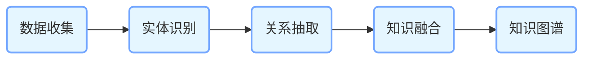
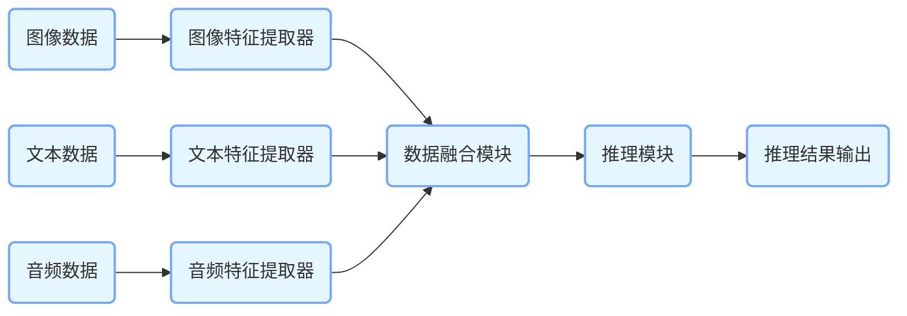

# 基于知识图谱的跨模态推理系统性能优化

> 关键词：知识图谱、跨模态推理系统、性能优化、多模态数据、深度学习

> 摘要：本文聚焦于基于知识图谱的跨模态推理系统性能优化这一核心主题。首先介绍了相关背景知识，包括研究目的、预期读者和文档结构等。详细阐述了知识图谱和跨模态推理系统的核心概念及其联系，通过文本示意图和Mermaid流程图进行直观展示。深入讲解了核心算法原理，使用Python代码进行具体操作步骤的说明。给出了相关的数学模型和公式，并结合实际例子进行解释。通过项目实战，从开发环境搭建到源代码实现及解读，全面介绍了如何构建和优化该系统。探讨了系统的实际应用场景，推荐了学习资源、开发工具框架以及相关论文著作。最后总结了未来发展趋势与挑战，并提供了常见问题解答和扩展阅读参考资料，旨在为相关领域的研究和开发人员提供全面且深入的技术指导。

## 1. 背景介绍 
### 1.1 目的和范围
随着人工智能技术的不断发展，跨模态推理系统在处理多源异构数据方面展现出巨大的潜力。知识图谱作为一种强大的语义表示工具，能够整合不同模态的数据信息，为跨模态推理提供丰富的知识支持。然而，现有的基于知识图谱的跨模态推理系统在性能方面仍存在诸多挑战，如推理效率低下、准确率不高等。本文章的目的在于深入研究基于知识图谱的跨模态推理系统性能优化的方法和技术，涵盖从理论原理到实际应用的各个方面，包括核心概念的解释、算法原理的分析、数学模型的构建、项目实战的演示以及应用场景的探讨等。

### 1.2 预期读者
本文预期读者包括人工智能、计算机科学等相关领域的研究人员、开发人员和学生。对于正在从事知识图谱、跨模态推理等方向研究的科研人员，本文提供了深入的技术分析和最新的研究思路；对于开发人员，文章中的项目实战部分提供了具体的代码实现和优化建议；对于学生而言，全面且详细的内容有助于他们系统地学习基于知识图谱的跨模态推理系统的相关知识。

### 1.3 文档结构概述
本文共分为十个部分。第一部分为背景介绍，阐述了研究目的、预期读者和文档结构等基本信息。第二部分介绍核心概念与联系，包括知识图谱和跨模态推理系统的原理和架构，并通过文本示意图和Mermaid流程图进行直观展示。第三部分讲解核心算法原理和具体操作步骤，使用Python代码详细说明。第四部分给出数学模型和公式，并结合实际例子进行详细讲解。第五部分进行项目实战，包括开发环境搭建、源代码实现和代码解读。第六部分探讨实际应用场景。第七部分推荐学习资源、开发工具框架和相关论文著作。第八部分总结未来发展趋势与挑战。第九部分为附录，提供常见问题与解答。第十部分给出扩展阅读和参考资料。

### 1.4 术语表
#### 1.4.1 核心术语定义
- **知识图谱**：是一种基于图的数据结构，由节点（实体）和边（关系）组成，用于表示实体之间的语义关系。它整合了大量的结构化和非结构化知识，为信息检索、自然语言处理等任务提供语义支持。
- **跨模态推理系统**：能够处理多种不同模态数据（如图像、文本、音频等），并进行推理和决策的系统。通过融合不同模态的数据信息，实现更准确、更全面的推理能力。
- **性能优化**：指通过各种技术手段提高系统的性能指标，如推理速度、准确率、资源利用率等，以满足实际应用的需求。

#### 1.4.2 相关概念解释
- **多模态数据**：指包含多种不同类型信息的数据，如图像、文本、音频、视频等。不同模态的数据具有不同的特征和表达方式，跨模态推理系统需要对这些数据进行有效的融合和处理。
- **深度学习**：是一种基于人工神经网络的机器学习方法，通过构建多层神经网络模型，自动学习数据的特征和模式。在跨模态推理系统中，深度学习技术常用于特征提取、数据融合和推理决策等任务。

#### 1.4.3 缩略词列表
- **KG**：Knowledge Graph，知识图谱
- **CNN**：Convolutional Neural Network，卷积神经网络
- **RNN**：Recurrent Neural Network，循环神经网络
- **Transformer**：一种基于注意力机制的深度学习模型

## 2. 核心概念与联系 

### 知识图谱原理
知识图谱是一种语义网络，它以图的形式表示实体及其之间的关系。实体可以是现实世界中的各种事物，如人、地点、组织等，关系则描述了实体之间的语义联系。知识图谱的构建通常包括数据收集、实体识别、关系抽取和知识融合等步骤。

#### 文本示意图
```plaintext
知识图谱
|-- 实体（节点）
|   |-- 人物实体
|   |-- 地点实体
|   |-- 组织实体
|   |--...
|-- 关系（边）
|   |-- 人物 - 出生地
|   |-- 组织 - 总部地点
|   |-- 人物 - 所属组织
|   |--...
```

#### Mermaid流程图


### 跨模态推理系统原理
跨模态推理系统旨在处理多种不同模态的数据，并进行有效的推理和决策。其核心步骤包括多模态数据的特征提取、数据融合和推理模块。首先，针对不同模态的数据（如图像、文本等），使用相应的特征提取方法提取其特征表示。然后，将不同模态的特征进行融合，得到统一的特征表示。最后，基于融合后的特征进行推理，得出最终的结论。

#### 文本示意图
```plaintext
跨模态推理系统
|-- 多模态数据输入
|   |-- 图像数据
|   |-- 文本数据
|   |-- 音频数据
|   |--...
|-- 特征提取模块
|   |-- 图像特征提取器
|   |-- 文本特征提取器
|   |-- 音频特征提取器
|   |--...
|-- 数据融合模块
|   |-- 特征拼接
|   |-- 注意力机制融合
|   |--...
|-- 推理模块
|   |-- 基于规则的推理
|   |-- 基于深度学习的推理
|   |--...
|-- 推理结果输出
```

#### Mermaid流程图


### 知识图谱与跨模态推理系统的联系
知识图谱为跨模态推理系统提供了丰富的语义知识支持。在跨模态推理过程中，可以利用知识图谱中的实体关系信息，对不同模态的数据进行语义关联和约束，从而提高推理的准确性和可靠性。例如，在图像和文本的跨模态推理中，知识图谱可以帮助确定图像中的实体与文本中提到的实体之间的对应关系，进而更好地理解和推理两者之间的语义联系。同时，跨模态推理系统也可以为知识图谱的构建和更新提供新的信息和证据，通过对多模态数据的推理和分析，发现新的实体和关系，不断完善知识图谱。

## 3. 核心算法原理 & 具体操作步骤 

### 特征提取算法
在跨模态推理系统中，特征提取是关键的一步。对于不同模态的数据，需要使用不同的特征提取算法。

#### 图像特征提取（以CNN为例）
卷积神经网络（CNN）是一种常用的图像特征提取方法。其基本原理是通过卷积层、池化层和全连接层对图像进行特征提取和抽象。以下是一个使用Python和PyTorch实现的简单CNN图像特征提取代码示例：

```python
import torch
import torch.nn as nn

# 定义一个简单的CNN模型
class SimpleCNN(nn.Module):
    def __init__(self):
        super(SimpleCNN, self).__init__()
        self.conv1 = nn.Conv2d(3, 16, kernel_size=3, padding=1)
        self.relu1 = nn.ReLU()
        self.pool1 = nn.MaxPool2d(2)
        self.conv2 = nn.Conv2d(16, 32, kernel_size=3, padding=1)
        self.relu2 = nn.ReLU()
        self.pool2 = nn.MaxPool2d(2)
        self.fc1 = nn.Linear(32 * 8 * 8, 128)
        self.relu3 = nn.ReLU()

    def forward(self, x):
        x = self.pool1(self.relu1(self.conv1(x)))
        x = self.pool2(self.relu2(self.conv2(x)))
        x = x.view(-1, 32 * 8 * 8)
        x = self.relu3(self.fc1(x))
        return x

# 加载图像数据
image = torch.randn(1, 3, 32, 32)  # 假设输入图像大小为32x32，通道数为3
model = SimpleCNN()
features = model(image)
print("图像特征维度:", features.shape)
```

#### 文本特征提取（以Transformer为例）
Transformer是一种基于注意力机制的深度学习模型，在自然语言处理中广泛应用于文本特征提取。以下是一个使用Hugging Face的Transformers库实现的文本特征提取代码示例：

```python
from transformers import AutoTokenizer, AutoModel
import torch

# 加载预训练的模型和分词器
tokenizer = AutoTokenizer.from_pretrained('bert-base-uncased')
model = AutoModel.from_pretrained('bert-base-uncased')

# 输入文本
text = "This is a sample sentence."
inputs = tokenizer(text, return_tensors='pt')

# 提取文本特征
with torch.no_grad():
    outputs = model(**inputs)
    text_features = outputs.last_hidden_state.mean(dim=1)
print("文本特征维度:", text_features.shape)
```

### 数据融合算法
数据融合是将不同模态的特征进行整合的过程。常见的数据融合方法包括特征拼接和注意力机制融合。

#### 特征拼接
特征拼接是最简单的数据融合方法，即将不同模态的特征直接拼接在一起。以下是一个Python代码示例：

```python
import torch

# 假设图像特征和文本特征
image_features = torch.randn(1, 128)
text_features = torch.randn(1, 128)

# 特征拼接
merged_features = torch.cat((image_features, text_features), dim=1)
print("融合后特征维度:", merged_features.shape)
```

#### 注意力机制融合
注意力机制可以根据不同模态特征的重要性，动态地分配权重进行融合。以下是一个简单的注意力机制融合代码示例：

```python
import torch
import torch.nn as nn

class AttentionFusion(nn.Module):
    def __init__(self, input_dim):
        super(AttentionFusion, self).__init__()
        self.linear = nn.Linear(input_dim * 2, 1)
        self.softmax = nn.Softmax(dim=1)

    def forward(self, image_features, text_features):
        combined_features = torch.cat((image_features, text_features), dim=1)
        attention_weights = self.softmax(self.linear(combined_features))
        weighted_image = attention_weights[:, 0].unsqueeze(1) * image_features
        weighted_text = attention_weights[:, 1].unsqueeze(1) * text_features
        fused_features = weighted_image + weighted_text
        return fused_features

# 假设图像特征和文本特征
image_features = torch.randn(1, 128)
text_features = torch.randn(1, 128)

fusion_model = AttentionFusion(128)
fused_features = fusion_model(image_features, text_features)
print("融合后特征维度:", fused_features.shape)
```

### 推理算法
推理算法基于融合后的特征进行决策和推理。常见的推理方法包括基于规则的推理和基于深度学习的推理。

#### 基于规则的推理
基于规则的推理是根据预先定义的规则进行推理。以下是一个简单的基于规则的推理代码示例：

```python
# 定义规则
def rule_based_reasoning(fused_features):
    if fused_features.sum() > 0:
        return "Positive"
    else:
        return "Negative"

# 假设融合后的特征
fused_features = torch.randn(1, 256)
result = rule_based_reasoning(fused_features)
print("推理结果:", result)
```

#### 基于深度学习的推理
基于深度学习的推理通常使用神经网络模型进行推理。以下是一个简单的基于全连接神经网络的推理代码示例：

```python
import torch
import torch.nn as nn

class ReasoningModel(nn.Module):
    def __init__(self, input_dim):
        super(ReasoningModel, self).__init__()
        self.fc1 = nn.Linear(input_dim, 64)
        self.relu = nn.ReLU()
        self.fc2 = nn.Linear(64, 2)
        self.softmax = nn.Softmax(dim=1)

    def forward(self, x):
        x = self.relu(self.fc1(x))
        x = self.softmax(self.fc2(x))
        return x

# 假设融合后的特征
fused_features = torch.randn(1, 256)
model = ReasoningModel(256)
output = model(fused_features)
prediction = torch.argmax(output, dim=1)
print("推理结果:", prediction.item())
```

## 4. 数学模型和公式 & 详细讲解 & 举例说明 

### 特征提取数学模型
#### CNN图像特征提取
在CNN中，卷积层的数学模型可以表示为：

$$y_{i,j}^l = \sum_{m=0}^{M-1} \sum_{n=0}^{N-1} x_{i+m,j+n}^{l-1} \cdot w_{m,n}^l + b^l$$

其中，$y_{i,j}^l$ 是第 $l$ 层卷积层在位置 $(i,j)$ 的输出，$x_{i+m,j+n}^{l-1}$ 是第 $l-1$ 层在位置 $(i+m,j+n)$ 的输入，$w_{m,n}^l$ 是第 $l$ 层的卷积核权重，$b^l$ 是偏置项，$M$ 和 $N$ 是卷积核的大小。

例如，假设输入图像 $x$ 是一个 $32\times32$ 的矩阵，卷积核大小为 $3\times3$，则经过卷积操作后，输出特征图的大小会根据卷积的步长和填充方式而变化。

#### Transformer文本特征提取
Transformer中的多头注意力机制的数学模型可以表示为：

$$\text{MultiHead}(Q, K, V) = \text{Concat}(\text{head}_1, \ldots, \text{head}_h)W^O$$

其中，$\text{head}_i = \text{Attention}(QW_i^Q, KW_i^K, VW_i^V)$，$\text{Attention}(Q, K, V) = \text{softmax}(\frac{QK^T}{\sqrt{d_k}})V$，$Q$、$K$、$V$ 分别是查询、键和值矩阵，$W_i^Q$、$W_i^K$、$W_i^V$ 和 $W^O$ 是可学习的权重矩阵，$d_k$ 是键的维度，$h$ 是头的数量。

例如，在处理一段文本时，Transformer会将文本分词后转化为词向量表示，然后通过多头注意力机制计算每个词与其他词之间的关联程度，从而提取文本的特征。

### 数据融合数学模型
#### 特征拼接
特征拼接的数学模型很简单，假设图像特征向量为 $\mathbf{x}_i$，文本特征向量为 $\mathbf{x}_t$，则融合后的特征向量 $\mathbf{x}_f$ 为：

$$\mathbf{x}_f = [\mathbf{x}_i; \mathbf{x}_t]$$

其中，$[\cdot; \cdot]$ 表示向量拼接操作。

例如，若图像特征向量 $\mathbf{x}_i = [1, 2, 3]$，文本特征向量 $\mathbf{x}_t = [4, 5, 6]$，则融合后的特征向量 $\mathbf{x}_f = [1, 2, 3, 4, 5, 6]$。

#### 注意力机制融合
注意力机制融合的数学模型可以表示为：

$$\mathbf{a} = \text{softmax}(W[\mathbf{x}_i; \mathbf{x}_t] + b)$$

$$\mathbf{x}_f = a_i \mathbf{x}_i + a_t \mathbf{x}_t$$

其中，$\mathbf{a} = [a_i; a_t]$ 是注意力权重向量，$W$ 和 $b$ 是可学习的参数。

例如，假设图像特征向量 $\mathbf{x}_i = [1, 2]$，文本特征向量 $\mathbf{x}_t = [3, 4]$，经过注意力机制计算得到注意力权重向量 $\mathbf{a} = [0.3; 0.7]$，则融合后的特征向量 $\mathbf{x}_f = 0.3\times[1, 2] + 0.7\times[3, 4] = [0.3, 0.6] + [2.1, 2.8] = [2.4, 3.4]$。

### 推理数学模型
#### 基于规则的推理
基于规则的推理可以用一个简单的条件判断公式表示。假设融合后的特征向量为 $\mathbf{x}_f$，规则为：如果 $\sum_{i=1}^{n} x_{f_i} > 0$，则推理结果为正类，否则为负类。

#### 基于深度学习的推理
基于全连接神经网络的推理数学模型可以表示为：

$$\mathbf{h}_1 = \text{ReLU}(W_1\mathbf{x}_f + b_1)$$

$$\mathbf{y} = \text{softmax}(W_2\mathbf{h}_1 + b_2)$$

其中，$\mathbf{h}_1$ 是隐藏层的输出，$W_1$、$b_1$、$W_2$ 和 $b_2$ 是可学习的权重和偏置项，$\mathbf{y}$ 是输出的概率分布。

例如，假设融合后的特征向量 $\mathbf{x}_f$ 是一个长度为 256 的向量，隐藏层有 64 个神经元，则 $W_1$ 是一个 $64\times256$ 的矩阵，$b_1$ 是一个长度为 64 的向量。经过神经网络的计算，最终得到输出的概率分布 $\mathbf{y}$，通过取最大值的索引得到推理结果。

## 5. 项目实战：代码实际案例和详细解释说明 

### 5.1  开发环境搭建
#### 操作系统
推荐使用Linux系统，如Ubuntu 18.04或更高版本，因为Linux系统在开发和部署深度学习项目方面具有良好的兼容性和性能。

#### Python环境
使用Python 3.7或更高版本。可以通过Anaconda来管理Python环境，具体步骤如下：
1. 下载并安装Anaconda：从Anaconda官方网站（https://www.anaconda.com/products/individual）下载适合自己操作系统的Anaconda安装包，并按照安装向导进行安装。
2. 创建虚拟环境：打开终端，运行以下命令创建一个名为 `kg_cross_modal` 的虚拟环境：
```bash
conda create -n kg_cross_modal python=3.8
```
3. 激活虚拟环境：运行以下命令激活虚拟环境：
```bash
conda activate kg_cross_modal
```

#### 依赖库安装
在激活的虚拟环境中，安装项目所需的依赖库，包括PyTorch、Hugging Face的Transformers库等。可以使用以下命令进行安装：
```bash
pip install torch torchvision torchaudio
pip install transformers
```

### 5.2  源代码详细实现和代码解读
以下是一个完整的基于知识图谱的跨模态推理系统的代码示例，包括图像特征提取、文本特征提取、数据融合和推理模块。

```python
import torch
import torch.nn as nn
from transformers import AutoTokenizer, AutoModel

# 图像特征提取模型
class SimpleCNN(nn.Module):
    def __init__(self):
        super(SimpleCNN, self).__init__()
        self.conv1 = nn.Conv2d(3, 16, kernel_size=3, padding=1)
        self.relu1 = nn.ReLU()
        self.pool1 = nn.MaxPool2d(2)
        self.conv2 = nn.Conv2d(16, 32, kernel_size=3, padding=1)
        self.relu2 = nn.ReLU()
        self.pool2 = nn.MaxPool2d(2)
        self.fc1 = nn.Linear(32 * 8 * 8, 128)
        self.relu3 = nn.ReLU()

    def forward(self, x):
        x = self.pool1(self.relu1(self.conv1(x)))
        x = self.pool2(self.relu2(self.conv2(x)))
        x = x.view(-1, 32 * 8 * 8)
        x = self.relu3(self.fc1(x))
        return x

# 文本特征提取模型
class TextFeatureExtractor(nn.Module):
    def __init__(self):
        super(TextFeatureExtractor, self).__init__()
        self.tokenizer = AutoTokenizer.from_pretrained('bert-base-uncased')
        self.model = AutoModel.from_pretrained('bert-base-uncased')

    def forward(self, text):
        inputs = self.tokenizer(text, return_tensors='pt')
        with torch.no_grad():
            outputs = self.model(**inputs)
            text_features = outputs.last_hidden_state.mean(dim=1)
        return text_features

# 数据融合模型
class AttentionFusion(nn.Module):
    def __init__(self, input_dim):
        super(AttentionFusion, self).__init__()
        self.linear = nn.Linear(input_dim * 2, 1)
        self.softmax = nn.Softmax(dim=1)

    def forward(self, image_features, text_features):
        combined_features = torch.cat((image_features, text_features), dim=1)
        attention_weights = self.softmax(self.linear(combined_features))
        weighted_image = attention_weights[:, 0].unsqueeze(1) * image_features
        weighted_text = attention_weights[:, 1].unsqueeze(1) * text_features
        fused_features = weighted_image + weighted_text
        return fused_features

# 推理模型
class ReasoningModel(nn.Module):
    def __init__(self, input_dim):
        super(ReasoningModel, self).__init__()
        self.fc1 = nn.Linear(input_dim, 64)
        self.relu = nn.ReLU()
        self.fc2 = nn.Linear(64, 2)
        self.softmax = nn.Softmax(dim=1)

    def forward(self, x):
        x = self.relu(self.fc1(x))
        x = self.softmax(self.fc2(x))
        return x

# 主函数
def main():
    # 初始化模型
    image_model = SimpleCNN()
    text_model = TextFeatureExtractor()
    fusion_model = AttentionFusion(128)
    reasoning_model = ReasoningModel(128)

    # 模拟输入数据
    image = torch.randn(1, 3, 32, 32)
    text = "This is a sample sentence."

    # 提取特征
    image_features = image_model(image)
    text_features = text_model(text)

    # 数据融合
    fused_features = fusion_model(image_features, text_features)

    # 推理
    output = reasoning_model(fused_features)
    prediction = torch.argmax(output, dim=1)
    print("推理结果:", prediction.item())

if __name__ == "__main__":
    main()
```

### 5.3  代码解读与分析
#### 图像特征提取模型（SimpleCNN）
- `__init__` 方法：定义了CNN的网络结构，包括两个卷积层、两个池化层和一个全连接层。
- `forward` 方法：实现了前向传播过程，将输入图像经过卷积、池化和全连接操作，最终输出图像特征向量。

#### 文本特征提取模型（TextFeatureExtractor）
- `__init__` 方法：加载预训练的BERT模型和分词器。
- `forward` 方法：对输入文本进行分词，然后使用BERT模型提取文本特征，最后对特征进行平均池化得到最终的文本特征向量。

#### 数据融合模型（AttentionFusion）
- `__init__` 方法：定义了一个线性层和一个Softmax层，用于计算注意力权重。
- `forward` 方法：将图像特征和文本特征拼接在一起，通过线性层计算注意力权重，然后根据权重对图像特征和文本特征进行加权求和，得到融合后的特征向量。

#### 推理模型（ReasoningModel）
- `__init__` 方法：定义了一个两层的全连接神经网络，包括一个隐藏层和一个输出层。
- `forward` 方法：将融合后的特征向量经过隐藏层的ReLU激活函数和输出层的Softmax函数，得到输出的概率分布，通过取最大值的索引得到推理结果。

#### 主函数（main）
- 初始化各个模型。
- 模拟输入图像和文本数据。
- 依次调用图像特征提取、文本特征提取、数据融合和推理模块，最终输出推理结果。

## 6. 实际应用场景 
### 智能问答系统
在智能问答系统中，用户的问题可能包含图像和文本等多种模态信息。基于知识图谱的跨模态推理系统可以利用知识图谱中的语义知识，对图像和文本进行综合分析和推理，从而更准确地回答用户的问题。例如，用户询问一张图片中人物的相关信息，系统可以结合图像识别技术和知识图谱中的人物信息进行推理，给出详细的回答。

### 医疗诊断辅助
在医疗领域，医生可以同时获取患者的病历文本、医学影像等多模态数据。跨模态推理系统可以融合这些数据，并结合医学知识图谱进行推理，辅助医生进行疾病诊断。例如，通过分析患者的病历文本和X光图像，结合医学知识图谱中疾病的症状和影像特征，系统可以给出可能的疾病诊断建议。

### 自动驾驶
在自动驾驶场景中，车辆需要处理来自摄像头、雷达等多种传感器的多模态数据。基于知识图谱的跨模态推理系统可以利用知识图谱中的交通规则、道路信息等知识，对多模态数据进行推理和决策。例如，通过分析摄像头拍摄的图像和雷达检测的数据，结合交通规则知识图谱，系统可以判断前方是否有障碍物、是否需要停车等。

### 智能家居
在智能家居系统中，用户可以通过语音指令、手机APP等多种方式与设备进行交互。跨模态推理系统可以融合语音、图像等多模态信息，并结合智能家居知识图谱进行推理，实现更智能的家居控制。例如，用户通过语音说“打开客厅的灯”，系统可以结合图像识别技术判断用户所在的位置是否是客厅，然后根据智能家居知识图谱中的设备信息，控制客厅的灯打开。

## 7. 工具和资源推荐
### 7.1 学习资源推荐
#### 7.1.1 书籍推荐
- 《人工智能：一种现代的方法》：全面介绍了人工智能的各个领域，包括知识表示、推理、机器学习等，是学习人工智能的经典教材。
- 《深度学习》：由Ian Goodfellow、Yoshua Bengio和Aaron Courville三位深度学习领域的专家撰写，系统地介绍了深度学习的基本原理和方法。
- 《知识图谱：方法、实践与应用》：详细介绍了知识图谱的构建、表示和应用，对于深入理解知识图谱非常有帮助。

#### 7.1.2 在线课程
- Coursera上的“人工智能基础”课程：由知名高校的教授授课，涵盖了人工智能的基本概念、算法和应用。
- edX上的“深度学习专项课程”：由Andrew Ng教授主讲，系统地介绍了深度学习的各个方面，包括神经网络、卷积神经网络、循环神经网络等。
- 哔哩哔哩上的“知识图谱入门教程”：由国内知名学者讲解，适合初学者快速了解知识图谱的基本概念和构建方法。

#### 7.1.3 技术博客和网站
- Medium：是一个技术博客平台，上面有很多关于人工智能、知识图谱、跨模态推理等领域的优质文章。
- arXiv：是一个预印本数据库，收录了大量的学术论文，包括最新的研究成果和技术进展。
- 机器之心：是一个专注于人工智能领域的科技媒体，提供了丰富的技术资讯、研究报告和开源项目介绍。

### 7.2 开发工具框架推荐
#### 7.2.1 IDE和编辑器
- PyCharm：是一款专门为Python开发设计的集成开发环境，具有代码编辑、调试、版本控制等功能，非常适合开发基于Python的跨模态推理系统。
- Jupyter Notebook：是一个交互式的开发环境，可以在浏览器中编写和运行代码，方便进行数据探索、模型调试和结果展示。
- Visual Studio Code：是一款轻量级的代码编辑器，支持多种编程语言和插件扩展，具有丰富的代码编辑和调试功能。

#### 7.2.2 调试和性能分析工具
- PyTorch Profiler：是PyTorch自带的性能分析工具，可以帮助开发者分析模型的运行时间、内存使用等性能指标，找出性能瓶颈。
- TensorBoard：是TensorFlow的可视化工具，也可以与PyTorch结合使用，用于可视化模型的训练过程、损失曲线、准确率等指标。
- cProfile：是Python标准库中的性能分析工具，可以对Python代码进行性能分析，找出耗时较长的函数和代码段。

#### 7.2.3 相关框架和库
- PyTorch：是一个开源的深度学习框架，具有动态图、易于使用等优点，广泛应用于图像、文本等领域的深度学习任务。
- Hugging Face的Transformers库：提供了丰富的预训练模型和工具，方便进行自然语言处理任务，如文本分类、命名实体识别等。
- DGL（Deep Graph Library）：是一个用于图神经网络的深度学习框架，可用于知识图谱的表示学习和推理任务。

### 7.3 相关论文著作推荐
#### 7.3.1 经典论文
- “Knowledge Graph Embedding: A Survey of Approaches and Applications”：对知识图谱嵌入的方法和应用进行了全面的综述，是了解知识图谱嵌入技术的重要参考。
- “Attention Is All You Need”：提出了Transformer模型，开创了基于注意力机制的深度学习时代，对自然语言处理和跨模态推理产生了深远的影响。
- “Multimodal Machine Learning: A Survey and Taxonomy”：对多模态机器学习的方法和应用进行了分类和综述，为跨模态推理系统的研究提供了理论基础。

#### 7.3.2 最新研究成果
- 可以通过arXiv、ACM Digital Library、IEEE Xplore等学术数据库搜索最新的关于基于知识图谱的跨模态推理系统的研究论文，了解该领域的最新技术进展和研究方向。

#### 7.3.3 应用案例分析
- 可以参考一些实际应用案例的论文和报告，如智能问答系统、医疗诊断辅助、自动驾驶等领域的应用案例，学习如何将基于知识图谱的跨模态推理系统应用到实际场景中，并解决实际问题。

## 8. 总结：未来发展趋势与挑战
### 未来发展趋势
#### 多模态数据融合技术的不断创新
未来，多模态数据融合技术将不断创新，不仅包括特征拼接、注意力机制融合等方法的改进，还将探索更高效、更智能的数据融合方式。例如，结合强化学习的思想，动态地调整不同模态数据的融合策略，以适应不同的应用场景和任务需求。

#### 知识图谱的不断完善和扩展
知识图谱将不断完善和扩展，涵盖更多的领域和知识，并且知识的表示和推理能力将不断提高。例如，引入语义网技术，实现知识图谱的语义互操作性，使得不同领域的知识图谱可以相互关联和融合。

#### 跨模态推理系统与其他技术的融合
跨模态推理系统将与其他技术，如区块链、物联网等进行融合，拓展其应用范围和功能。例如，将跨模态推理系统应用于物联网设备的智能管理和控制，通过融合传感器数据和知识图谱中的信息，实现更智能、更高效的物联网应用。

#### 端到端的跨模态推理系统的发展
未来将出现更多端到端的跨模态推理系统，从数据输入到推理结果输出，整个过程将更加自动化和智能化。例如，在智能汽车领域，端到端的跨模态推理系统可以直接根据传感器数据进行决策和控制，无需人工干预。

### 挑战
#### 多模态数据的异质性和复杂性
多模态数据具有不同的特征和表达方式，其异质性和复杂性给数据融合和推理带来了很大的挑战。例如，图像数据和文本数据的特征空间差异很大，如何有效地将它们进行融合是一个亟待解决的问题。

#### 知识图谱的构建和更新
知识图谱的构建和更新需要大量的人力和物力投入，并且知识的准确性和完整性也难以保证。此外，随着知识的不断更新和变化，如何及时地更新知识图谱也是一个挑战。

#### 计算资源和效率问题
跨模态推理系统通常需要处理大量的多模态数据，并且推理过程复杂，对计算资源的需求很大。如何在有限的计算资源下提高系统的推理效率，是一个需要解决的问题。

#### 隐私和安全问题
在跨模态推理系统中，涉及到大量的用户隐私数据，如医疗数据、个人信息等。如何保护这些数据的隐私和安全，防止数据泄露和滥用，是一个重要的挑战。

## 9. 附录：常见问题与解答
### 如何选择合适的特征提取方法？
选择合适的特征提取方法需要考虑数据的模态、特点和任务需求。对于图像数据，可以选择CNN、ResNet等卷积神经网络；对于文本数据，可以选择Transformer、BERT等基于注意力机制的模型。同时，还可以根据具体任务进行微调，以提高特征提取的效果。

### 数据融合的方法有哪些优缺点？
特征拼接的优点是简单直观，易于实现，但缺点是没有考虑不同模态特征之间的关联和重要性。注意力机制融合的优点是可以根据不同模态特征的重要性动态地分配权重，提高融合效果，但缺点是计算复杂度较高。

### 如何优化基于知识图谱的跨模态推理系统的性能？
可以从以下几个方面进行优化：选择合适的特征提取方法和数据融合方法；优化推理算法，如使用更复杂的神经网络模型；利用知识图谱中的语义知识进行约束和指导；进行模型的调优和训练，如调整超参数、增加训练数据等。

### 跨模态推理系统在实际应用中面临哪些挑战？
跨模态推理系统在实际应用中面临多模态数据的异质性和复杂性、知识图谱的构建和更新、计算资源和效率问题以及隐私和安全问题等挑战。需要针对这些挑战采取相应的解决措施，如开发更高效的数据融合算法、利用自动化工具构建和更新知识图谱、优化计算资源的使用、加强数据的隐私保护等。

## 10. 扩展阅读 & 参考资料
### 扩展阅读
- 《自然语言处理入门》：深入学习自然语言处理的相关知识，有助于更好地理解跨模态推理系统中的文本处理部分。
- 《计算机视觉：算法与应用》：了解计算机视觉的基本算法和应用，对于跨模态推理系统中的图像处理部分有很大的帮助。
- 《图神经网络：基础与前沿》：学习图神经网络的相关知识，对于知识图谱的表示学习和推理有更深入的理解。

### 参考资料
- [Knowledge Graph Embedding: A Survey of Approaches and Applications](https://arxiv.org/abs/1703.04264)
- [Attention Is All You Need](https://arxiv.org/abs/1706.03762)
- [Multimodal Machine Learning: A Survey and Taxonomy](https://ieeexplore.ieee.org/document/7806319)
- [PyTorch官方文档](https://pytorch.org/docs/stable/index.html)
- [Hugging Face的Transformers库文档](https://huggingface.co/transformers/)
- [DGL官方文档](https://docs.dgl.ai/)

作者：AI天才研究院/AI Genius Institute & 禅与计算机程序设计艺术 /Zen And The Art of Computer Programming