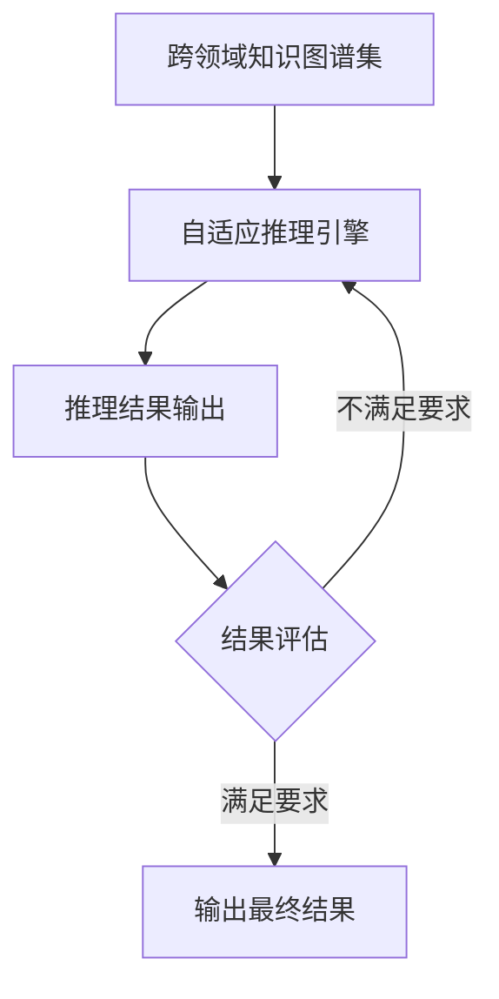

# 基于知识图谱的跨领域推理能力自适应增强

> 关键词：知识图谱、跨领域推理、自适应增强、知识表示、推理算法

> 摘要：本文围绕基于知识图谱的跨领域推理能力自适应增强展开深入研究。首先介绍了相关背景，包括研究目的、预期读者、文档结构和术语表。接着阐述了知识图谱、跨领域推理和自适应增强的核心概念及其联系，并给出了相应的原理和架构示意图以及Mermaid流程图。详细讲解了核心算法原理，通过Python代码进行具体实现。引入数学模型和公式对推理过程进行量化分析，并举例说明。通过项目实战展示了开发环境搭建、源代码实现和代码解读。探讨了实际应用场景，推荐了学习资源、开发工具框架和相关论文著作。最后总结了未来发展趋势与挑战，提供了常见问题解答和扩展阅读参考资料，旨在为该领域的研究和应用提供全面且深入的指导。

## 1. 背景介绍 
### 1.1 目的和范围
在当今信息爆炸的时代，不同领域的数据和知识呈现出海量且复杂的特点。知识图谱作为一种有效的知识表示和管理方式，能够将实体、概念及其之间的关系以图的形式进行直观展示。然而，现有的知识图谱大多针对单一领域构建，在处理跨领域问题时，其推理能力存在一定的局限性。本研究的目的在于探索如何基于知识图谱实现跨领域推理能力的自适应增强，即让知识图谱能够根据不同的跨领域任务和数据特点，自动调整和优化推理策略，以提高推理的准确性和效率。

本研究的范围涵盖了知识图谱的构建、跨领域知识的融合、推理算法的设计与优化、自适应机制的实现等多个方面。同时，将通过实际案例验证所提出方法的有效性和实用性。

### 1.2 预期读者
本文预期读者包括计算机科学、人工智能、信息检索等领域的研究人员和学生，他们对知识图谱和推理技术有一定的了解，希望深入探索跨领域推理的相关理论和方法。此外，企业中从事知识管理、智能决策等工作的技术人员也可以从本文中获取有价值的信息，将相关技术应用到实际业务中。

### 1.3 文档结构概述
本文将按照以下结构进行组织：
- 核心概念与联系：介绍知识图谱、跨领域推理和自适应增强的核心概念，分析它们之间的联系，并给出相应的原理和架构示意图以及Mermaid流程图。
- 核心算法原理 & 具体操作步骤：详细阐述实现跨领域推理能力自适应增强的核心算法原理，并通过Python代码展示具体的操作步骤。
- 数学模型和公式 & 详细讲解 & 举例说明：引入数学模型和公式对推理过程进行量化分析，详细解释公式的含义，并通过具体例子说明其应用。
- 项目实战：通过一个实际的项目案例，展示开发环境的搭建、源代码的实现和代码的解读，帮助读者更好地理解和应用相关技术。
- 实际应用场景：探讨基于知识图谱的跨领域推理能力自适应增强技术在不同领域的实际应用场景。
- 工具和资源推荐：推荐相关的学习资源、开发工具框架和论文著作，为读者提供进一步学习和研究的参考。
- 总结：未来发展趋势与挑战：总结本文的主要内容，分析该领域的未来发展趋势和面临的挑战。
- 附录：常见问题与解答：提供常见问题的解答，帮助读者解决在学习和实践过程中遇到的问题。
- 扩展阅读 & 参考资料：列出相关的扩展阅读材料和参考资料，方便读者深入研究。

### 1.4 术语表
#### 1.4.1 核心术语定义
- **知识图谱**：是一种基于图的数据结构，由节点（实体、概念）和边（关系）组成，用于表示和存储知识。
- **跨领域推理**：指在不同领域的知识图谱之间进行推理，利用一个领域的知识来推断另一个领域的信息。
- **自适应增强**：指系统能够根据不同的输入和任务要求，自动调整和优化自身的性能，以提高推理的准确性和效率。
- **知识表示**：将知识以计算机能够理解和处理的形式进行表示，常见的知识表示方法包括符号表示、向量表示等。
- **推理算法**：用于在知识图谱上进行推理的算法，如基于规则的推理算法、基于机器学习的推理算法等。

#### 1.4.2 相关概念解释
- **领域**：指具有特定主题和范围的知识集合，如医学领域、金融领域等。
- **实体**：指现实世界中的具体事物或概念，如人、地点、事件等。
- **关系**：指实体之间的联系，如“属于”、“关联”等。
- **三元组**：是知识图谱中最基本的表示形式，由实体、关系和另一个实体组成，如（姚明，职业，篮球运动员）。

#### 1.4.3 缩略词列表
- **KG**：Knowledge Graph，知识图谱
- **RDF**：Resource Description Framework，资源描述框架
- **OWL**：Web Ontology Language，网络本体语言
- **ML**：Machine Learning，机器学习
- **DL**：Deep Learning，深度学习

## 2. 核心概念与联系 
### 2.1 核心概念原理
#### 2.1.1 知识图谱
知识图谱的核心原理是将现实世界中的知识以图的形式进行表示。节点代表实体或概念，边代表实体之间的关系。通过这种方式，知识图谱能够清晰地展示知识之间的关联，方便进行知识的存储、查询和推理。例如，在一个医学知识图谱中，“疾病”、“症状”、“药物”等可以作为节点，“导致”、“治疗”等可以作为边。

#### 2.1.2 跨领域推理
跨领域推理的原理是利用不同领域知识图谱之间的关联，将一个领域的知识和推理结果应用到另一个领域。例如，在金融领域和医疗领域之间，如果发现某些疾病会影响人们的工作能力，进而影响其收入，那么可以通过医疗知识图谱中的疾病信息，在金融知识图谱中推断出相关人员的财务风险。

#### 2.1.3 自适应增强
自适应增强的原理是根据不同的跨领域任务和数据特点，动态调整推理策略和模型参数。系统可以通过学习和分析输入数据，自动选择最合适的推理算法和知识表示方法，以提高推理的准确性和效率。例如，对于不同类型的跨领域问题，系统可以选择基于规则的推理算法或基于机器学习的推理算法。

### 2.2 架构的文本示意图
```plaintext
+----------------------+
|  跨领域知识图谱集    |
|  (包含多个领域KG)    |
+----------------------+
         |
         v
+----------------------+
|  自适应推理引擎      |
|  - 推理算法选择      |
|  - 知识表示调整      |
|  - 参数优化          |
+----------------------+
         |
         v
+----------------------+
|  推理结果输出        |
|  - 跨领域信息推断    |
|  - 知识更新          |
+----------------------+
```

### 2.3 Mermaid流程图


## 3. 核心算法原理 & 具体操作步骤 
### 3.1 核心算法原理
本研究采用的核心算法是基于混合推理的自适应增强算法，结合了基于规则的推理和基于机器学习的推理。基于规则的推理能够利用领域专家制定的规则进行快速准确的推理，而基于机器学习的推理能够从大量的数据中学习到隐藏的模式和规律。自适应机制则根据不同的任务和数据特点，动态调整两种推理方法的权重。

### 3.2 具体操作步骤
#### 3.2.1 数据预处理
对不同领域的知识图谱数据进行清洗、转换和集成，确保数据的一致性和准确性。例如，将不同格式的实体名称进行统一，去除重复的三元组等。

```python
import pandas as pd

# 假设读取两个领域的知识图谱数据为DataFrame
kg1 = pd.read_csv('kg1.csv')
kg2 = pd.read_csv('kg2.csv')

# 数据清洗：去除重复行
kg1 = kg1.drop_duplicates()
kg2 = kg2.drop_duplicates()

# 数据集成：合并两个知识图谱
merged_kg = pd.concat([kg1, kg2])
```

#### 3.2.2 知识表示学习
将知识图谱中的实体和关系表示为低维向量，以便机器学习算法能够处理。常用的知识表示学习方法有TransE、DistMult等。

```python
from pykeen.models import TransE
from pykeen.triples import TriplesFactory

# 创建三元组工厂
triples_factory = TriplesFactory.from_labeled_triples(merged_kg.values)

# 训练TransE模型
model = TransE(triples_factory=triples_factory)
model.fit(triples_factory)
```

#### 3.2.3 规则推理
根据领域专家制定的规则进行推理。例如，在医学领域，如果“疾病A”会导致“症状B”，“症状B”可以用“药物C”治疗，那么可以推断出“疾病A”可以用“药物C”治疗。

```python
# 定义规则
rules = [
    ("疾病A", "导致", "症状B"),
    ("症状B", "可以用", "药物C")
]

# 规则推理函数
def rule_based_reasoning(rules, kg):
    new_triples = []
    for rule in rules:
        head, relation, tail = rule
        # 在知识图谱中查找符合规则的三元组
        matched_triples = kg[(kg[0] == head) & (kg[1] == relation)]
        for _, row in matched_triples.iterrows():
            new_triple = (row[0], relation, tail)
            new_triples.append(new_triple)
    return pd.DataFrame(new_triples)

# 进行规则推理
rule_based_result = rule_based_reasoning(rules, merged_kg)
```

#### 3.2.4 机器学习推理
利用训练好的知识表示模型进行推理。例如，通过计算实体和关系向量之间的相似度，预测可能存在的三元组。

```python
import torch

# 机器学习推理函数
def ml_based_reasoning(model, kg):
    all_entities = model.entity_representations[0]._embeddings.weight
    all_relations = model.relation_representations[0]._embeddings.weight
    new_triples = []
    for _, row in kg.iterrows():
        head = model.entity_to_id[row[0]]
        relation = model.relation_to_id[row[1]]
        head_vector = all_entities[head]
        relation_vector = all_relations[relation]
        # 计算可能的尾实体向量
        possible_tail_vectors = head_vector + relation_vector
        # 计算相似度
        similarities = torch.nn.functional.cosine_similarity(possible_tail_vectors.unsqueeze(0), all_entities)
        top_k_indices = torch.topk(similarities, k=5).indices
        for index in top_k_indices:
            tail = model.id_to_entity[index.item()]
            new_triple = (row[0], row[1], tail)
            new_triples.append(new_triple)
    return pd.DataFrame(new_triples)

# 进行机器学习推理
ml_based_result = ml_based_reasoning(model, merged_kg)
```

#### 3.2.5 自适应融合
根据任务和数据特点，动态调整规则推理和机器学习推理的权重，将两种推理结果进行融合。

```python
# 自适应融合函数
def adaptive_fusion(rule_based_result, ml_based_result, weight_rule=0.5, weight_ml=0.5):
    # 简单的加权融合
    combined_result = pd.concat([rule_based_result.sample(frac=weight_rule), ml_based_result.sample(frac=weight_ml)])
    return combined_result.drop_duplicates()

# 进行自适应融合
final_result = adaptive_fusion(rule_based_result, ml_based_result)
```

## 4. 数学模型和公式 & 详细讲解 & 举例说明 
### 4.1 知识表示学习的数学模型
以TransE模型为例，其目标是将实体和关系表示为低维向量，使得对于一个三元组 $(h, r, t)$，其中 $h$ 表示头实体，$r$ 表示关系，$t$ 表示尾实体，满足 $h + r \approx t$。具体的损失函数为：

$$
L = \sum_{(h, r, t) \in S} \sum_{(h', r, t') \in S'} [\gamma + d(h + r, t) - d(h' + r, t')]_+
$$

其中，$S$ 是正样本三元组集合，$S'$ 是负样本三元组集合，$\gamma$ 是一个边界值，$d$ 是距离度量函数，通常使用 $L_1$ 或 $L_2$ 范数，$[x]_+ = \max(0, x)$。

### 4.2 规则推理的数学模型
规则推理可以用逻辑表达式来表示。例如，对于规则 “如果 $A$ 是 $B$ 的父类，$B$ 是 $C$ 的父类，那么 $A$ 是 $C$ 的父类”，可以表示为：

$$
\forall x, y, z \ (IsParent(x, y) \land IsParent(y, z) \rightarrow IsParent(x, z))
$$

### 4.3 机器学习推理的数学模型
在机器学习推理中，通常使用相似度度量来预测可能的三元组。例如，使用余弦相似度：

$$
sim(u, v) = \frac{u \cdot v}{\|u\| \|v\|}
$$

其中，$u$ 和 $v$ 是两个向量，$\cdot$ 表示点积，$\| \cdot \|$ 表示向量的模。

### 4.4 自适应融合的数学模型
自适应融合可以用加权求和的方式表示：

$$
R = w_1 R_1 + w_2 R_2
$$

其中，$R$ 是最终的推理结果，$R_1$ 是规则推理结果，$R_2$ 是机器学习推理结果，$w_1$ 和 $w_2$ 是权重，且 $w_1 + w_2 = 1$。

### 4.5 举例说明
假设我们有一个简单的知识图谱，包含以下三元组：
- (苹果，类别，水果)
- (水果，类别，食物)

使用规则推理，根据 “如果 $A$ 是 $B$ 的类别，$B$ 是 $C$ 的类别，那么 $A$ 是 $C$ 的类别” 规则，可以推断出 (苹果，类别，食物)。

使用机器学习推理，通过训练TransE模型得到实体和关系的向量表示。计算 “苹果” 向量加上 “类别” 向量与所有实体向量的余弦相似度，发现 “食物” 向量的相似度较高，也可以推断出 (苹果，类别，食物)。

最后，通过自适应融合，根据不同的权重将规则推理和机器学习推理的结果进行合并。

## 5. 项目实战：代码实际案例和详细解释说明 
### 5.1  开发环境搭建
#### 5.1.1 安装Python
确保已经安装了Python 3.x版本，可以从Python官方网站（https://www.python.org/downloads/）下载并安装。

#### 5.1.2 安装必要的库
使用pip安装以下必要的库：
```bash
pip install pandas pykeen torch
```

### 5.2  源代码详细实现和代码解读
以下是一个完整的项目实战代码：

```python
import pandas as pd
from pykeen.models import TransE
from pykeen.triples import TriplesFactory
import torch

# 数据预处理
def data_preprocessing():
    # 假设读取两个领域的知识图谱数据为DataFrame
    kg1 = pd.read_csv('kg1.csv')
    kg2 = pd.read_csv('kg2.csv')

    # 数据清洗：去除重复行
    kg1 = kg1.drop_duplicates()
    kg2 = kg2.drop_duplicates()

    # 数据集成：合并两个知识图谱
    merged_kg = pd.concat([kg1, kg2])
    return merged_kg

# 知识表示学习
def knowledge_representation_learning(merged_kg):
    # 创建三元组工厂
    triples_factory = TriplesFactory.from_labeled_triples(merged_kg.values)

    # 训练TransE模型
    model = TransE(triples_factory=triples_factory)
    model.fit(triples_factory)
    return model

# 规则推理
def rule_based_reasoning(rules, kg):
    new_triples = []
    for rule in rules:
        head, relation, tail = rule
        # 在知识图谱中查找符合规则的三元组
        matched_triples = kg[(kg[0] == head) & (kg[1] == relation)]
        for _, row in matched_triples.iterrows():
            new_triple = (row[0], relation, tail)
            new_triples.append(new_triple)
    return pd.DataFrame(new_triples)

# 机器学习推理
def ml_based_reasoning(model, kg):
    all_entities = model.entity_representations[0]._embeddings.weight
    all_relations = model.relation_representations[0]._embeddings.weight
    new_triples = []
    for _, row in kg.iterrows():
        head = model.entity_to_id[row[0]]
        relation = model.relation_to_id[row[1]]
        head_vector = all_entities[head]
        relation_vector = all_relations[relation]
        # 计算可能的尾实体向量
        possible_tail_vectors = head_vector + relation_vector
        # 计算相似度
        similarities = torch.nn.functional.cosine_similarity(possible_tail_vectors.unsqueeze(0), all_entities)
        top_k_indices = torch.topk(similarities, k=5).indices
        for index in top_k_indices:
            tail = model.id_to_entity[index.item()]
            new_triple = (row[0], row[1], tail)
            new_triples.append(new_triple)
    return pd.DataFrame(new_triples)

# 自适应融合
def adaptive_fusion(rule_based_result, ml_based_result, weight_rule=0.5, weight_ml=0.5):
    # 简单的加权融合
    combined_result = pd.concat([rule_based_result.sample(frac=weight_rule), ml_based_result.sample(frac=weight_ml)])
    return combined_result.drop_duplicates()

# 主函数
def main():
    # 数据预处理
    merged_kg = data_preprocessing()

    # 知识表示学习
    model = knowledge_representation_learning(merged_kg)

    # 定义规则
    rules = [
        ("疾病A", "导致", "症状B"),
        ("症状B", "可以用", "药物C")
    ]

    # 规则推理
    rule_based_result = rule_based_reasoning(rules, merged_kg)

    # 机器学习推理
    ml_based_result = ml_based_reasoning(model, merged_kg)

    # 自适应融合
    final_result = adaptive_fusion(rule_based_result, ml_based_result)

    print("最终推理结果：")
    print(final_result)

if __name__ == "__main__":
    main()
```

### 5.3  代码解读与分析
- **数据预处理**：读取不同领域的知识图谱数据，进行清洗和集成，确保数据的一致性和准确性。
- **知识表示学习**：使用TransE模型将知识图谱中的实体和关系表示为低维向量，以便机器学习算法能够处理。
- **规则推理**：根据领域专家制定的规则进行推理，查找符合规则的三元组并生成新的三元组。
- **机器学习推理**：利用训练好的知识表示模型，通过计算向量相似度预测可能的三元组。
- **自适应融合**：根据不同的权重将规则推理和机器学习推理的结果进行融合，得到最终的推理结果。

## 6. 实际应用场景 
### 6.1 医疗健康领域
在医疗健康领域，知识图谱可以整合医学文献、临床指南、病例数据等多源信息。跨领域推理能力自适应增强技术可以帮助医生进行疾病诊断和治疗方案推荐。例如，结合患者的基因信息、症状表现和药物知识图谱，推断出最适合患者的治疗药物。同时，系统可以根据不同的疾病类型和患者个体差异，自适应调整推理策略，提高诊断和治疗的准确性。

### 6.2 金融领域
在金融领域，知识图谱可以关联企业信息、市场数据、政策法规等。跨领域推理能力自适应增强技术可以用于风险评估和投资决策。例如，通过分析企业的财务状况、行业竞争态势和宏观经济环境，推断企业的信用风险和发展前景。系统可以根据不同的金融产品和市场情况，自适应优化推理模型，为投资者提供更准确的建议。

### 6.3 智能交通领域
在智能交通领域，知识图谱可以整合交通设施信息、交通流量数据、气象信息等。跨领域推理能力自适应增强技术可以用于交通拥堵预测和路径规划。例如，结合实时交通流量、道路施工信息和气象条件，推断出可能出现拥堵的路段，并为驾驶员提供最佳的行驶路径。系统可以根据不同的交通场景和时间变化，自适应调整推理算法，提高交通管理的效率。

### 6.4 教育领域
在教育领域，知识图谱可以整合课程知识、学生学习记录、教学资源等。跨领域推理能力自适应增强技术可以用于个性化学习推荐和教学评估。例如，根据学生的学习进度、兴趣爱好和知识掌握情况，推断出适合学生的学习资源和学习策略。系统可以根据不同的学科和教学目标，自适应优化推理模型，提高教育教学的质量。

## 7. 工具和资源推荐
### 7.1 学习资源推荐
#### 7.1.1 书籍推荐
- 《知识图谱：方法、实践与应用》：全面介绍了知识图谱的基本概念、构建方法、推理技术和应用案例。
- 《人工智能：一种现代的方法》：经典的人工智能教材，涵盖了知识表示、推理、机器学习等多个方面的内容。
- 《深度学习》：详细介绍了深度学习的基本原理和应用，对于理解知识表示学习有很大帮助。

#### 7.1.2 在线课程
- Coursera上的“Knowledge Graphs”课程：由知名教授授课，系统介绍了知识图谱的理论和实践。
- edX上的“Artificial Intelligence”课程：提供了人工智能领域的全面知识，包括知识图谱和推理技术。
- 中国大学MOOC上的“人工智能基础”课程：适合初学者，对知识图谱和推理进行了深入浅出的讲解。

#### 7.1.3 技术博客和网站
- 开源知识图谱社区（https://kg.cs.tsinghua.edu.cn/）：提供了知识图谱领域的最新研究成果和开源工具。
- 人工智能前沿技术博客（https://www.ai-forefront.com/）：关注人工智能领域的前沿动态，包括知识图谱和推理技术的应用案例。
- 机器之心（https://www.alienstar.cn/）：提供了大量的人工智能技术文章和资讯，对知识图谱和推理的研究有一定的参考价值。

### 7.2 开发工具框架推荐
#### 7.2.1 IDE和编辑器
- PyCharm：功能强大的Python集成开发环境，支持代码编辑、调试、版本控制等功能。
- Jupyter Notebook：交互式的开发环境，适合进行数据探索和模型实验。
- Visual Studio Code：轻量级的代码编辑器，支持多种编程语言和插件扩展。

#### 7.2.2 调试和性能分析工具
- Py-Spy：用于分析Python代码的性能瓶颈，找出耗时的函数和代码段。
- TensorBoard：用于可视化深度学习模型的训练过程和性能指标。
- Memory Profiler：用于分析Python代码的内存使用情况，找出内存泄漏问题。

#### 7.2.3 相关框架和库
- PyKeen：用于知识图谱嵌入和推理的Python库，提供了多种知识表示学习模型和推理算法。
- RDFlib：用于处理RDF数据的Python库，支持知识图谱的创建、查询和更新。
- NetworkX：用于图论和网络分析的Python库，可以用于知识图谱的可视化和分析。

### 7.3 相关论文著作推荐
#### 7.3.1 经典论文
- “Translating Embeddings for Modeling Multi-relational Data”：提出了TransE模型，开创了知识图谱嵌入的研究方向。
- “Knowledge Graph Embedding: A Survey of Approaches and Applications”：对知识图谱嵌入的方法和应用进行了全面的综述。
- “Reasoning over Knowledge Graphs with Neural Tensor Networks for Question Answering”：介绍了基于神经网络的知识图谱推理方法，用于问答系统。

#### 7.3.2 最新研究成果
- “Adaptive Knowledge Graph Embedding for Incremental Knowledge Graphs”：提出了自适应知识图谱嵌入方法，用于处理动态变化的知识图谱。
- “Cross-Domain Knowledge Graph Alignment via Graph Convolutional Networks”：研究了跨领域知识图谱对齐的方法，利用图卷积网络进行特征提取。
- “Meta-Learning for Few-Shot Knowledge Graph Completion”：将元学习应用于少样本知识图谱补全问题，提高了模型的泛化能力。

#### 7.3.3 应用案例分析
- “Applying Knowledge Graphs in Healthcare: A Systematic Review”：分析了知识图谱在医疗健康领域的应用案例和挑战。
- “Knowledge Graphs in Finance: A Survey”：对知识图谱在金融领域的应用进行了全面的调研和分析。
- “Using Knowledge Graphs for Intelligent Transportation Systems: A Review”：探讨了知识图谱在智能交通领域的应用现状和发展趋势。

## 8. 总结：未来发展趋势与挑战
### 8.1 未来发展趋势
- **多模态融合**：未来的知识图谱将融合文本、图像、音频等多模态信息，进一步拓展跨领域推理的能力。例如，在医疗领域，结合医学影像和文本病历进行更准确的疾病诊断。
- **强化学习与自适应推理**：引入强化学习算法，使系统能够在不断的交互中自动优化推理策略，提高自适应能力。例如，在智能交通领域，通过强化学习动态调整交通信号控制策略。
- **知识图谱的联邦学习**：在保护数据隐私的前提下，实现多个机构之间的知识图谱联合构建和推理。例如，在金融领域，不同银行之间可以通过联邦学习共享部分知识，提高风险评估的准确性。

### 8.2 挑战
- **知识融合难题**：不同领域的知识图谱在数据格式、语义表达等方面存在差异，如何有效地进行知识融合是一个挑战。例如，医学领域和生物领域的知识图谱可能使用不同的术语和概念，需要进行语义对齐。
- **推理效率问题**：随着知识图谱规模的不断增大，推理的计算复杂度也会增加，如何提高推理效率是一个亟待解决的问题。例如，在大规模的社交网络知识图谱上进行推理，需要优化算法和数据结构。
- **自适应机制的设计**：设计一个有效的自适应机制，能够准确地根据不同的任务和数据特点调整推理策略，是一个具有挑战性的任务。例如，如何确定规则推理和机器学习推理的最佳权重，需要进行大量的实验和优化。

## 9. 附录：常见问题与解答
### 9.1 知识图谱构建过程中如何处理数据质量问题？
在知识图谱构建过程中，可以采用以下方法处理数据质量问题：
- 数据清洗：去除重复、错误和不一致的数据。例如，使用正则表达式检查数据格式，删除不符合要求的记录。
- 数据验证：通过与权威数据源进行比对，验证数据的准确性。例如，在构建医学知识图谱时，可以参考医学教科书和临床指南。
- 数据补全：对于缺失的数据，可以采用机器学习方法进行预测和补全。例如，使用基于概率图模型的方法预测实体之间的关系。

### 9.2 跨领域推理时如何解决语义冲突问题？
解决跨领域推理时的语义冲突问题可以采用以下方法：
- 语义映射：建立不同领域术语之间的映射关系，将不同领域的语义进行统一。例如，通过本体对齐技术，将医学领域和生物领域的术语进行映射。
- 上下文感知：考虑数据的上下文信息，根据具体的应用场景来理解语义。例如，在金融领域和法律领域，同一个术语可能有不同的含义，需要结合上下文进行判断。
- 多源知识融合：综合多个领域的知识，从多个角度来理解和解决语义冲突问题。例如，在智能交通领域，结合交通规则、气象信息和地理信息来理解交通事件的语义。

### 9.3 自适应增强机制如何进行参数调整？
自适应增强机制的参数调整可以采用以下方法：
- 手动调参：根据经验和实验结果，手动调整参数。例如，在自适应融合中，手动调整规则推理和机器学习推理的权重。
- 网格搜索：通过遍历所有可能的参数组合，选择最优的参数。例如，在机器学习模型中，使用网格搜索来选择最优的学习率和正则化参数。
- 自适应学习：利用强化学习或元学习算法，让系统自动学习最优的参数。例如，在强化学习中，通过奖励机制让系统不断调整参数以获得最大的奖励。

## 10. 扩展阅读 & 参考资料
### 10.1 扩展阅读
- 《知识图谱与深度学习》：深入探讨了知识图谱与深度学习的结合应用，为跨领域推理提供了新的思路。
- 《大数据知识工程》：介绍了大数据环境下知识工程的理论和方法，对于知识图谱的构建和推理有一定的参考价值。
- 《人工智能与知识工程》：全面介绍了人工智能和知识工程的基本概念和技术，对跨领域推理的研究有一定的启发作用。

### 10.2 参考资料
- [1] Bordes, A., Usunier, N., Garcia-Duran, A., Weston, J., & Yakhnenko, O. (2013). Translating embeddings for modeling multi-relational data. Advances in neural information processing systems.
- [2] Lin, Y., Liu, Z., Sun, M., Liu, Y., & Zhu, X. (2015). Learning entity and relation embeddings for knowledge graph completion. Proceedings of the AAAI conference on artificial intelligence.
- [3] Nickel, M., Murphy, K., Tresp, V., & Gabrilovich, E. (2016). A review of relational machine learning for knowledge graphs. Proceedings of the IEEE, 104(1), 11-33.

作者：AI天才研究院/AI Genius Institute & 禅与计算机程序设计艺术 /Zen And The Art of Computer Programming