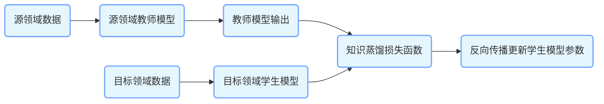

# 基于知识蒸馏的跨域推理能力迁移技术研究

> 关键词：知识蒸馏、跨域推理能力迁移、深度学习、模型压缩、领域自适应

> 摘要：本文围绕基于知识蒸馏的跨域推理能力迁移技术展开深入研究。首先介绍了该技术的研究背景、目的、适用读者以及文档结构，明确了相关术语。接着阐述了核心概念及其联系，包括知识蒸馏和跨域推理能力迁移的原理与架构，并给出了相应的文本示意图和 Mermaid 流程图。详细讲解了核心算法原理，通过 Python 源代码进行具体说明，同时给出了数学模型和公式，并举例进行了详细讲解。在项目实战部分，介绍了开发环境搭建、源代码实现与解读。探讨了该技术的实际应用场景，推荐了相关的学习资源、开发工具框架以及论文著作。最后总结了未来发展趋势与挑战，还提供了常见问题解答和扩展阅读参考资料，旨在为相关领域的研究和实践提供全面且深入的指导。

## 1. 背景介绍 
### 1.1 目的和范围
随着深度学习在各个领域的广泛应用，不同领域的数据和任务呈现出多样性和差异性。在实际应用中，我们常常会遇到这样的情况：在一个领域（源领域）训练好的模型，在另一个领域（目标领域）的性能表现不佳。这主要是因为源领域和目标领域的数据分布存在差异，导致模型的泛化能力受到限制。

基于知识蒸馏的跨域推理能力迁移技术旨在解决这一问题，通过知识蒸馏的方法将源领域模型的推理能力迁移到目标领域模型中，使得目标领域模型能够在较少的目标领域数据下，快速学习到源领域模型的有用知识，从而提高目标领域模型的性能。

本文的研究范围涵盖了知识蒸馏和跨域推理能力迁移的基本概念、核心算法原理、数学模型、项目实战以及实际应用场景等方面，旨在为读者提供一个全面且深入的技术研究视角。

### 1.2 预期读者
本文预期读者主要包括以下几类人群：
- **研究人员**：对深度学习、知识蒸馏、领域自适应等领域感兴趣的科研人员，希望通过本文了解基于知识蒸馏的跨域推理能力迁移技术的最新研究进展和方法。
- **工程师**：从事人工智能、机器学习相关项目开发的工程师，需要将该技术应用到实际项目中，本文提供的项目实战部分将为他们提供具体的实现思路和代码示例。
- **学生**：学习计算机科学、人工智能等相关专业的学生，希望通过阅读本文加深对知识蒸馏和跨域推理能力迁移技术的理解，为后续的学习和研究打下基础。

### 1.3 文档结构概述
本文的文档结构如下：
- **背景介绍**：介绍研究的目的和范围、预期读者以及文档结构概述，并给出相关术语的定义。
- **核心概念与联系**：阐述知识蒸馏和跨域推理能力迁移的核心概念、原理和架构，给出文本示意图和 Mermaid 流程图。
- **核心算法原理 & 具体操作步骤**：详细讲解核心算法原理，并使用 Python 源代码进行具体说明。
- **数学模型和公式 & 详细讲解 & 举例说明**：给出该技术的数学模型和公式，并通过具体例子进行详细讲解。
- **项目实战：代码实际案例和详细解释说明**：介绍开发环境搭建、源代码实现与解读。
- **实际应用场景**：探讨该技术在不同领域的实际应用场景。
- **工具和资源推荐**：推荐相关的学习资源、开发工具框架以及论文著作。
- **总结：未来发展趋势与挑战**：总结该技术的未来发展趋势和面临的挑战。
- **附录：常见问题与解答**：提供常见问题的解答。
- **扩展阅读 & 参考资料**：列出扩展阅读的相关资料和参考文献。

### 1.4 术语表
#### 1.4.1 核心术语定义
- **知识蒸馏（Knowledge Distillation）**：是一种模型压缩和知识迁移的技术，通过将一个大的、复杂的教师模型（Teacher Model）的知识迁移到一个小的、简单的学生模型（Student Model）中，使得学生模型能够在保持一定性能的同时，减少模型的复杂度和计算量。
- **跨域推理能力迁移（Cross - Domain Reasoning Ability Transfer）**：指的是将在一个领域（源领域）训练好的模型的推理能力迁移到另一个领域（目标领域）的模型中，以提高目标领域模型在目标领域数据上的性能。
- **源领域（Source Domain）**：是指模型最初训练的领域，该领域通常拥有大量的标注数据。
- **目标领域（Target Domain）**：是指我们希望模型能够在其数据上取得良好性能的领域，该领域的数据分布可能与源领域不同，且标注数据可能较少。

#### 1.4.2 相关概念解释
- **教师模型（Teacher Model）**：在知识蒸馏中，教师模型通常是一个在源领域训练好的大模型，具有较高的性能和丰富的知识。教师模型的输出（如概率分布）被用作学生模型学习的目标。
- **学生模型（Student Model）**：是需要学习教师模型知识的小模型。学生模型通过最小化与教师模型输出之间的差异，来学习教师模型的知识。
- **领域自适应（Domain Adaptation）**：是一种解决跨域问题的方法，旨在通过调整模型的参数，使得模型在不同领域的数据上都能取得较好的性能。知识蒸馏可以作为领域自适应的一种手段。

#### 1.4.3 缩略词列表
- **KD**：Knowledge Distillation（知识蒸馏）
- **DA**：Domain Adaptation（领域自适应）

## 2. 核心概念与联系 

### 知识蒸馏原理
知识蒸馏的核心思想是让学生模型学习教师模型的输出，而不仅仅是学习训练数据的标签。具体来说，教师模型在输入数据上会输出一个概率分布，这个概率分布包含了教师模型对不同类别的置信度信息。学生模型的目标是尽可能地逼近教师模型的输出。

假设我们有一个分类任务，输入数据为 $x$，教师模型 $T$ 的输出为 $p_T(x)$，学生模型 $S$ 的输出为 $p_S(x)$。知识蒸馏的损失函数通常由两部分组成：一部分是学生模型输出与教师模型输出之间的损失，另一部分是学生模型输出与真实标签 $y$ 之间的损失。

### 跨域推理能力迁移原理
跨域推理能力迁移的目标是将源领域模型的推理能力迁移到目标领域模型中。由于源领域和目标领域的数据分布不同，直接将源领域模型应用到目标领域往往效果不佳。通过知识蒸馏，我们可以让目标领域的学生模型学习源领域教师模型的知识，从而提高目标领域模型的性能。

### 架构示意图
以下是基于知识蒸馏的跨域推理能力迁移的架构文本示意图：

```plaintext
源领域数据 -> 源领域教师模型 -> 教师模型输出（概率分布）
目标领域数据 -> 目标领域学生模型
教师模型输出（概率分布） + 目标领域学生模型输出 -> 知识蒸馏损失函数
知识蒸馏损失函数 -> 反向传播更新目标领域学生模型参数
```

### Mermaid 流程图


## 3. 核心算法原理 & 具体操作步骤 

### 核心算法原理
知识蒸馏的核心算法可以分为以下几个步骤：
1. **训练源领域教师模型**：使用源领域的标注数据训练一个大的、复杂的教师模型。教师模型可以是任何类型的深度学习模型，如卷积神经网络（CNN）、循环神经网络（RNN）等。
2. **初始化目标领域学生模型**：选择一个小的、简单的模型作为目标领域的学生模型，并随机初始化其参数。
3. **知识蒸馏过程**：在目标领域的数据上，同时输入学生模型和教师模型。计算学生模型输出与教师模型输出之间的损失，以及学生模型输出与真实标签之间的损失（如果有目标领域的标注数据）。将这两个损失相加得到总损失。
4. **更新学生模型参数**：使用反向传播算法，根据总损失更新学生模型的参数。

### Python 源代码实现
以下是一个简单的基于 PyTorch 的知识蒸馏代码示例：

```python
import torch
import torch.nn as nn
import torch.optim as optim

# 定义教师模型
class TeacherModel(nn.Module):
    def __init__(self):
        super(TeacherModel, self).__init__()
        self.fc1 = nn.Linear(10, 20)
        self.fc2 = nn.Linear(20, 5)

    def forward(self, x):
        x = torch.relu(self.fc1(x))
        x = self.fc2(x)
        return x

# 定义学生模型
class StudentModel(nn.Module):
    def __init__(self):
        super(StudentModel, self).__init__()
        self.fc1 = nn.Linear(10, 15)
        self.fc2 = nn.Linear(15, 5)

    def forward(self, x):
        x = torch.relu(self.fc1(x))
        x = self.fc2(x)
        return x

# 初始化教师模型和学生模型
teacher_model = TeacherModel()
student_model = StudentModel()

# 定义损失函数和优化器
criterion_teacher = nn.CrossEntropyLoss()
criterion_distillation = nn.KLDivLoss()
optimizer = optim.Adam(student_model.parameters(), lr=0.001)

# 模拟训练数据
num_samples = 100
input_data = torch.randn(num_samples, 10)
target_labels = torch.randint(0, 5, (num_samples,))

# 训练教师模型（这里省略具体训练过程）
#...

# 知识蒸馏训练过程
num_epochs = 10
for epoch in range(num_epochs):
    optimizer.zero_grad()
    teacher_output = teacher_model(input_data)
    student_output = student_model(input_data)

    # 计算蒸馏损失
    distillation_loss = criterion_distillation(torch.log_softmax(student_output, dim=1),
                                               torch.softmax(teacher_output, dim=1))

    # 计算分类损失（如果有目标领域标注数据）
    classification_loss = criterion_teacher(student_output, target_labels)

    # 总损失
    total_loss = distillation_loss + classification_loss

    total_loss.backward()
    optimizer.step()

    print(f'Epoch {epoch + 1}/{num_epochs}, Loss: {total_loss.item()}')
```

### 具体操作步骤解释
1. **定义模型**：定义教师模型和学生模型。教师模型通常比学生模型更复杂。
2. **初始化模型和优化器**：初始化教师模型和学生模型的参数，并选择合适的优化器。
3. **模拟训练数据**：生成一些模拟的训练数据，包括输入数据和目标标签。
4. **训练教师模型**：使用源领域的数据训练教师模型，这里省略了具体的训练过程。
5. **知识蒸馏训练**：在目标领域的数据上，同时计算教师模型和学生模型的输出。计算蒸馏损失和分类损失，并将它们相加得到总损失。使用反向传播算法更新学生模型的参数。

## 4. 数学模型和公式 & 详细讲解 & 举例说明 

### 数学模型和公式
知识蒸馏的损失函数通常由两部分组成：蒸馏损失和分类损失。

#### 蒸馏损失
蒸馏损失用于衡量学生模型输出与教师模型输出之间的差异。常用的蒸馏损失函数是 KL 散度（Kullback - Leibler Divergence），其公式如下：

$$
L_{distillation} = KL(p_S(x) || p_T(x)) = \sum_{i} p_T(x)_i \log \frac{p_T(x)_i}{p_S(x)_i}
$$

其中，$p_S(x)$ 是学生模型的输出概率分布，$p_T(x)$ 是教师模型的输出概率分布。

#### 分类损失
分类损失用于衡量学生模型输出与真实标签之间的差异。常用的分类损失函数是交叉熵损失（Cross - Entropy Loss），其公式如下：

$$
L_{classification} = - \sum_{i} y_i \log p_S(x)_i
$$

其中，$y$ 是真实标签的 one - hot 编码。

#### 总损失
总损失是蒸馏损失和分类损失的加权和，公式如下：

$$
L_{total} = \alpha L_{distillation} + (1 - \alpha) L_{classification}
$$

其中，$\alpha$ 是一个超参数，用于控制蒸馏损失和分类损失的相对重要性。

### 详细讲解
- **KL 散度**：KL 散度是一种衡量两个概率分布之间差异的指标。在知识蒸馏中，我们希望学生模型的输出概率分布尽可能地接近教师模型的输出概率分布，因此使用 KL 散度作为蒸馏损失函数。
- **交叉熵损失**：交叉熵损失是分类问题中常用的损失函数，用于衡量模型输出的概率分布与真实标签之间的差异。在知识蒸馏中，如果有目标领域的标注数据，我们可以使用交叉熵损失来监督学生模型的训练。
- **超参数 $\alpha$**：$\alpha$ 的取值范围是 $[0, 1]$。当 $\alpha = 1$ 时，总损失只包含蒸馏损失，此时学生模型主要学习教师模型的知识；当 $\alpha = 0$ 时，总损失只包含分类损失，此时学生模型只学习目标领域的标注数据。

### 举例说明
假设我们有一个二分类问题，输入数据 $x$，教师模型的输出概率分布为 $p_T(x) = [0.8, 0.2]$，学生模型的输出概率分布为 $p_S(x) = [0.6, 0.4]$，真实标签的 one - hot 编码为 $y = [1, 0]$。

#### 计算蒸馏损失
$$
L_{distillation} = KL(p_S(x) || p_T(x)) = 0.8 \log \frac{0.8}{0.6} + 0.2 \log \frac{0.2}{0.4} \approx 0.133
$$

#### 计算分类损失
$$
L_{classification} = - (1 \times \log 0.6 + 0 \times \log 0.4) \approx 0.511
$$

假设 $\alpha = 0.5$，则总损失为：

$$
L_{total} = 0.5 \times 0.133 + 0.5 \times 0.511 \approx 0.322
$$

## 5. 项目实战：代码实际案例和详细解释说明 

### 5.1  开发环境搭建
#### 操作系统
推荐使用 Linux 系统，如 Ubuntu 18.04 或更高版本，也可以使用 Windows 10 或 macOS。

#### Python 环境
建议使用 Python 3.7 或更高版本。可以使用 Anaconda 来管理 Python 环境，具体步骤如下：
1. 下载并安装 Anaconda：从 Anaconda 官方网站（https://www.anaconda.com/products/individual）下载适合你操作系统的 Anaconda 安装包，并按照安装向导进行安装。
2. 创建虚拟环境：打开终端或命令提示符，运行以下命令创建一个新的虚拟环境：
```bash
conda create -n knowledge_distillation python=3.8
```
3. 激活虚拟环境：
```bash
conda activate knowledge_distillation
```

#### 深度学习框架
使用 PyTorch 作为深度学习框架，安装命令如下：
```bash
pip install torch torchvision
```

### 5.2  源代码详细实现和代码解读
以下是一个更完整的基于知识蒸馏的跨域推理能力迁移的代码示例，使用 CIFAR - 10 数据集作为源领域数据，MNIST 数据集作为目标领域数据：

```python
import torch
import torch.nn as nn
import torch.optim as optim
import torchvision
import torchvision.transforms as transforms
from torch.utils.data import DataLoader

# 定义教师模型
class TeacherModel(nn.Module):
    def __init__(self):
        super(TeacherModel, self).__init__()
        self.conv1 = nn.Conv2d(3, 16, kernel_size=3, padding=1)
        self.pool = nn.MaxPool2d(2, 2)
        self.conv2 = nn.Conv2d(16, 32, kernel_size=3, padding=1)
        self.fc1 = nn.Linear(32 * 8 * 8, 128)
        self.fc2 = nn.Linear(128, 10)

    def forward(self, x):
        x = self.pool(torch.relu(self.conv1(x)))
        x = self.pool(torch.relu(self.conv2(x)))
        x = x.view(-1, 32 * 8 * 8)
        x = torch.relu(self.fc1(x))
        x = self.fc2(x)
        return x

# 定义学生模型
class StudentModel(nn.Module):
    def __init__(self):
        super(StudentModel, self).__init__()
        self.conv1 = nn.Conv2d(1, 8, kernel_size=3, padding=1)
        self.pool = nn.MaxPool2d(2, 2)
        self.conv2 = nn.Conv2d(8, 16, kernel_size=3, padding=1)
        self.fc1 = nn.Linear(16 * 7 * 7, 64)
        self.fc2 = nn.Linear(64, 10)

    def forward(self, x):
        x = self.pool(torch.relu(self.conv1(x)))
        x = self.pool(torch.relu(self.conv2(x)))
        x = x.view(-1, 16 * 7 * 7)
        x = torch.relu(self.fc1(x))
        x = self.fc2(x)
        return x

# 数据预处理
transform_cifar = transforms.Compose([
    transforms.ToTensor(),
    transforms.Normalize((0.5, 0.5, 0.5), (0.5, 0.5, 0.5))
])

transform_mnist = transforms.Compose([
    transforms.ToTensor(),
    transforms.Normalize((0.1307,), (0.3081,))
])

# 加载数据集
trainset_cifar = torchvision.datasets.CIFAR10(root='./data', train=True,
                                              download=True, transform=transform_cifar)
trainloader_cifar = DataLoader(trainset_cifar, batch_size=32, shuffle=True)

trainset_mnist = torchvision.datasets.MNIST(root='./data', train=True,
                                            download=True, transform=transform_mnist)
trainloader_mnist = DataLoader(trainset_mnist, batch_size=32, shuffle=True)

# 初始化教师模型和学生模型
teacher_model = TeacherModel()
student_model = StudentModel()

# 定义损失函数和优化器
criterion_teacher = nn.CrossEntropyLoss()
criterion_distillation = nn.KLDivLoss()
optimizer = optim.Adam(student_model.parameters(), lr=0.001)

# 训练教师模型
num_epochs_teacher = 10
for epoch in range(num_epochs_teacher):
    running_loss = 0.0
    for i, data in enumerate(trainloader_cifar, 0):
        inputs, labels = data
        optimizer.zero_grad()
        outputs = teacher_model(inputs)
        loss = criterion_teacher(outputs, labels)
        loss.backward()
        optimizer.step()
        running_loss += loss.item()
    print(f'Epoch {epoch + 1}/{num_epochs_teacher}, Loss: {running_loss / len(trainloader_cifar)}')

# 知识蒸馏训练学生模型
num_epochs_student = 10
alpha = 0.5
for epoch in range(num_epochs_student):
    running_loss = 0.0
    for i, data in enumerate(trainloader_mnist, 0):
        inputs, labels = data
        optimizer.zero_grad()
        teacher_output = teacher_model(inputs.repeat(1, 3, 1, 1))  # 将单通道 MNIST 数据转换为三通道
        student_output = student_model(inputs)

        # 计算蒸馏损失
        distillation_loss = criterion_distillation(torch.log_softmax(student_output, dim=1),
                                                   torch.softmax(teacher_output, dim=1))

        # 计算分类损失
        classification_loss = criterion_teacher(student_output, labels)

        # 总损失
        total_loss = alpha * distillation_loss + (1 - alpha) * classification_loss

        total_loss.backward()
        optimizer.step()
        running_loss += total_loss.item()
    print(f'Epoch {epoch + 1}/{num_epochs_student}, Loss: {running_loss / len(trainloader_mnist)}')
```

### 5.3  代码解读与分析
#### 模型定义
- **教师模型**：使用一个简单的卷积神经网络作为教师模型，适用于 CIFAR - 10 数据集（三通道图像）。
- **学生模型**：使用一个更简单的卷积神经网络作为学生模型，适用于 MNIST 数据集（单通道图像）。

#### 数据加载
- 使用 `torchvision.datasets` 加载 CIFAR - 10 和 MNIST 数据集，并使用 `DataLoader` 进行批量处理。
- 对数据进行预处理，包括转换为张量和归一化。

#### 教师模型训练
使用 CIFAR - 10 数据集训练教师模型，使用交叉熵损失函数和 Adam 优化器。

#### 知识蒸馏训练
在 MNIST 数据集上进行知识蒸馏训练，同时计算蒸馏损失和分类损失，并将它们加权求和得到总损失。使用反向传播算法更新学生模型的参数。

## 6. 实际应用场景 
### 图像识别领域
在图像识别任务中，不同的数据集可能具有不同的图像风格、光照条件和物体分布。例如，在医疗图像识别中，不同医院的设备和拍摄条件可能导致图像数据分布存在差异。通过基于知识蒸馏的跨域推理能力迁移技术，可以将在大规模公开数据集上训练好的教师模型的知识迁移到针对特定医院数据的学生模型中，从而提高学生模型在该医院数据上的识别准确率。

### 自然语言处理领域
在自然语言处理任务中，不同的领域（如新闻、科技、医学等）具有不同的语言表达方式和词汇分布。例如，在情感分析任务中，不同领域的文本情感表达可能存在差异。通过知识蒸馏，可以将在通用领域数据集上训练好的教师模型的知识迁移到特定领域的学生模型中，提高学生模型在该领域文本情感分析的性能。

### 语音识别领域
语音识别任务中，不同的说话人、口音、环境噪声等因素会导致语音数据分布的差异。例如，在智能家居语音交互系统中，不同地区的用户可能具有不同的口音。通过知识蒸馏，可以将在大规模通用语音数据集上训练好的教师模型的知识迁移到针对特定地区用户的学生模型中，提高学生模型在该地区用户语音识别的准确率。

## 7. 工具和资源推荐
### 7.1 学习资源推荐
#### 7.1.1 书籍推荐
- 《深度学习》（Deep Learning）：由 Ian Goodfellow、Yoshua Bengio 和 Aaron Courville 所著，是深度学习领域的经典教材，涵盖了深度学习的基本概念、算法和应用。
- 《动手学深度学习》（Dive into Deep Learning）：由 Aston Zhang、Zachary C. Lipton、Mu Li 和 Alexander J. Smola 所著，提供了丰富的代码示例和实践项目，适合初学者快速上手。

#### 7.1.2 在线课程
- Coursera 上的“深度学习专项课程”（Deep Learning Specialization）：由 Andrew Ng 教授授课，包括五门课程，全面介绍了深度学习的各个方面。
- edX 上的“强化学习基础”（Foundations of Reinforcement Learning）：介绍了强化学习的基本概念和算法，对于理解基于知识蒸馏的跨域推理能力迁移技术在强化学习中的应用有帮助。

#### 7.1.3 技术博客和网站
- Medium 上的 Towards Data Science：提供了大量关于数据科学、机器学习和深度学习的文章和教程。
- arXiv.org：是一个预印本服务器，包含了许多最新的学术研究论文，对于了解基于知识蒸馏的跨域推理能力迁移技术的最新研究进展非常有帮助。

### 7.2 开发工具框架推荐
#### 7.2.1 IDE和编辑器
- PyCharm：是一款专门为 Python 开发设计的集成开发环境（IDE），提供了丰富的代码编辑、调试和分析功能。
- Jupyter Notebook：是一个交互式的开发环境，适合进行数据探索、模型实验和代码演示。

#### 7.2.2 调试和性能分析工具
- TensorBoard：是 TensorFlow 提供的一个可视化工具，可以用于可视化模型的训练过程、损失曲线和模型结构等。
- PyTorch Profiler：是 PyTorch 提供的性能分析工具，可以帮助用户分析模型的运行时间、内存使用等性能指标。

#### 7.2.3 相关框架和库
- PyTorch：是一个开源的深度学习框架，提供了丰富的神经网络层和优化算法，方便用户进行模型开发和训练。
- Scikit - learn：是一个用于机器学习的 Python 库，提供了许多常用的机器学习算法和工具，如数据预处理、模型评估等。

### 7.3 相关论文著作推荐
#### 7.3.1 经典论文
- “Distilling the Knowledge in a Neural Network”：由 Geoffrey Hinton、Oriol Vinyals 和 Jeff Dean 发表，是知识蒸馏领域的经典论文，首次提出了知识蒸馏的概念。
- “Unsupervised Domain Adaptation by Backpropagation”：提出了一种基于反向传播的无监督领域自适应方法，对于理解跨域推理能力迁移技术有重要参考价值。

#### 7.3.2 最新研究成果
- 关注 arXiv.org 上关于知识蒸馏和领域自适应的最新研究论文，了解该领域的最新技术和方法。

#### 7.3.3 应用案例分析
- 一些顶级学术会议（如 NeurIPS、ICML、CVPR 等）的论文集中包含了许多基于知识蒸馏的跨域推理能力迁移技术的应用案例，可以从中学习该技术在不同领域的实际应用方法。

## 8. 总结：未来发展趋势与挑战
### 未来发展趋势
- **多模态知识蒸馏**：随着多模态数据（如图像、文本、语音等）的广泛应用，未来的研究可能会关注如何进行多模态知识蒸馏，将不同模态的知识从教师模型迁移到学生模型中，以提高模型在多模态任务中的性能。
- **自适应知识蒸馏**：开发自适应的知识蒸馏方法，根据目标领域数据的特点和分布，自动调整蒸馏损失和分类损失的权重，以实现更高效的跨域推理能力迁移。
- **结合强化学习**：将知识蒸馏与强化学习相结合，用于解决复杂的决策问题，如机器人控制、自动驾驶等。通过知识蒸馏，可以将在一个环境中学习到的策略知识迁移到另一个环境中，提高智能体的学习效率和泛化能力。

### 挑战
- **领域差异大**：当源领域和目标领域的数据分布差异较大时，知识蒸馏的效果可能会受到影响。如何有效地处理这种大的领域差异，是未来研究需要解决的一个挑战。
- **标注数据不足**：在目标领域标注数据不足的情况下，如何利用源领域的知识进行有效的跨域推理能力迁移，是一个具有挑战性的问题。
- **计算资源限制**：知识蒸馏通常需要同时运行教师模型和学生模型，这会增加计算资源的消耗。如何在有限的计算资源下实现高效的知识蒸馏，也是一个需要解决的问题。

## 9. 附录：常见问题与解答
### 问题 1：知识蒸馏一定能提高目标领域模型的性能吗？
不一定。知识蒸馏的效果受到多种因素的影响，如源领域和目标领域的数据分布差异、教师模型和学生模型的结构和性能、蒸馏损失和分类损失的权重等。当源领域和目标领域的数据分布差异较大时，知识蒸馏可能无法有效提高目标领域模型的性能。

### 问题 2：如何选择合适的教师模型和学生模型？
教师模型通常选择在源领域上性能较好的大模型，如深度卷积神经网络、循环神经网络等。学生模型则选择相对简单、计算量较小的模型，以便在目标领域快速学习教师模型的知识。同时，学生模型的输入输出维度需要与教师模型相匹配。

### 问题 3：如何确定蒸馏损失和分类损失的权重 $\alpha$？
$\alpha$ 的取值需要根据具体的任务和数据情况进行调整。可以通过实验的方法，尝试不同的 $\alpha$ 值，选择使得目标领域模型性能最优的 $\alpha$ 值。一般来说，当目标领域的标注数据较少时，可以适当增大 $\alpha$ 的值，让学生模型更多地学习教师模型的知识。

## 10. 扩展阅读 & 参考资料
### 扩展阅读
- 关注相关领域的学术会议（如 NeurIPS、ICML、CVPR、ACL 等）的论文，了解最新的研究进展。
- 阅读一些深度学习领域的前沿博客和技术文章，如 Google AI Blog、Facebook AI Research Blog 等。

### 参考资料
- Hinton, G., Vinyals, O., & Dean, J. (2015). Distilling the Knowledge in a Neural Network. arXiv preprint arXiv:1503.02531.
- Ganin, Y., & Lempitsky, V. (2014). Unsupervised Domain Adaptation by Backpropagation. arXiv preprint arXiv:1409.7495.

作者：AI天才研究院/AI Genius Institute & 禅与计算机程序设计艺术 /Zen And The Art of Computer Programming