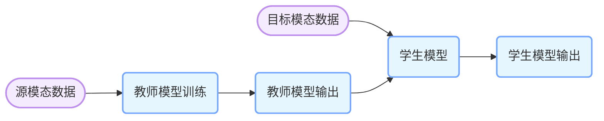

# 基于知识蒸馏的跨感官模态推理能力迁移

> 关键词：知识蒸馏、跨感官模态、推理能力迁移、人工智能、多模态学习

> 摘要：本文聚焦于基于知识蒸馏的跨感官模态推理能力迁移这一前沿领域。详细介绍了相关的背景知识，包括目的、预期读者等。深入阐述了核心概念与联系，给出了原理和架构的文本示意图及 Mermaid 流程图。通过 Python 源代码详细讲解了核心算法原理和具体操作步骤，并运用数学模型和公式进行理论分析，结合实际例子加深理解。进行了项目实战，涵盖开发环境搭建、源代码实现与解读。探讨了实际应用场景，推荐了学习资源、开发工具框架以及相关论文著作。最后总结了未来发展趋势与挑战，并提供了常见问题解答和扩展阅读参考资料，旨在为该领域的研究和实践提供全面且深入的指导。

## 1. 背景介绍 
### 1.1 目的和范围
在人工智能和机器学习领域，多模态数据处理是一个重要的研究方向。不同的感官模态（如视觉、听觉、触觉等）包含着丰富的信息，但目前大多数模型都是针对单一模态进行训练和学习的。然而，人类在认知过程中能够自然地整合多种感官信息进行推理和决策。基于知识蒸馏的跨感官模态推理能力迁移的研究目的就是尝试让模型模拟人类的这种跨模态信息整合和推理能力，将一个模态上学习到的推理能力迁移到另一个模态上。

本研究的范围主要涵盖了知识蒸馏技术在跨感官模态推理能力迁移中的应用，包括核心概念的理解、算法原理的研究、实际项目的开发以及在不同领域的应用探索等方面。

### 1.2 预期读者
本文预期读者主要包括人工智能、机器学习、计算机视觉、自然语言处理等相关领域的研究人员和开发者。对于正在探索多模态学习和知识蒸馏技术的研究生和科研人员，本文可以提供深入的理论和实践指导；对于从事实际项目开发的工程师，本文中的项目实战部分和应用场景分析可以为他们提供具体的实现思路和参考案例。

### 1.3 文档结构概述
本文将按照以下结构进行组织：首先介绍相关的背景知识，包括目的、预期读者和文档结构等。接着阐述核心概念与联系，给出原理和架构的文本示意图及 Mermaid 流程图，帮助读者理解跨感官模态推理能力迁移的基本原理。然后详细讲解核心算法原理和具体操作步骤，通过 Python 源代码进行示例。运用数学模型和公式对算法进行理论分析，并结合实际例子进行说明。进行项目实战，包括开发环境搭建、源代码实现与解读。探讨实际应用场景，为读者展示该技术的应用价值。推荐学习资源、开发工具框架以及相关论文著作，方便读者进一步深入学习。最后总结未来发展趋势与挑战，提供常见问题解答和扩展阅读参考资料。

### 1.4 术语表
#### 1.4.1 核心术语定义
- **知识蒸馏（Knowledge Distillation）**：是一种模型压缩和知识迁移的技术，通过让一个较小的学生模型学习一个较大的教师模型的输出，从而将教师模型的知识迁移到学生模型中。
- **跨感官模态（Cross-sensory Modality）**：指的是不同的感官通道，如视觉、听觉、触觉等，在跨感官模态学习中，需要处理和整合来自不同感官模态的数据。
- **推理能力迁移（Reasoning Ability Transfer）**：将在一个模态上学习到的推理能力应用到另一个模态上，使得模型能够在不同的模态下进行有效的推理和决策。
- **多模态学习（Multimodal Learning）**：研究如何整合来自多个模态的数据进行学习和决策，以提高模型的性能和泛化能力。

#### 1.4.2 相关概念解释
- **教师模型（Teacher Model）**：在知识蒸馏中，通常是一个较大、较复杂的模型，具有较高的性能和丰富的知识。教师模型的输出作为学生模型学习的目标。
- **学生模型（Student Model）**：一个较小、较简单的模型，通过学习教师模型的输出，试图捕捉教师模型的知识和推理能力。
- **模态特征（Modality Feature）**：每个感官模态所包含的特征信息，如视觉模态中的图像特征、听觉模态中的音频特征等。

#### 1.4.3 缩略词列表
- **KD**：Knowledge Distillation（知识蒸馏）
- **ML**：Machine Learning（机器学习）
- **AI**：Artificial Intelligence（人工智能）

## 2. 核心概念与联系 

### 核心概念原理
基于知识蒸馏的跨感官模态推理能力迁移的核心思想是利用知识蒸馏技术将一个模态（如视觉）上的推理能力迁移到另一个模态（如听觉）上。具体来说，首先在源模态上训练一个教师模型，该模型能够对源模态的数据进行有效的推理和决策。然后，使用知识蒸馏的方法，让一个学生模型学习教师模型的输出，将教师模型在源模态上的推理能力迁移到学生模型中。最后，将学生模型应用到目标模态上，使其能够在目标模态上进行推理和决策。

### 架构的文本示意图
```plaintext
源模态数据（如视觉数据） -> 教师模型（在源模态上训练） -> 教师模型输出（包含推理信息）
                                                           |
                                                           v
目标模态数据（如听觉数据） -> 学生模型（通过知识蒸馏学习教师模型） -> 学生模型输出（在目标模态上的推理结果）
```

### Mermaid 流程图


## 3. 核心算法原理 & 具体操作步骤 

### 核心算法原理
知识蒸馏的核心算法主要基于损失函数的设计，通过最小化学生模型和教师模型输出之间的差异，让学生模型学习教师模型的知识。常用的损失函数是蒸馏损失（Distillation Loss），通常使用 KL 散度（Kullback-Leibler Divergence）来衡量两个概率分布之间的差异。

假设教师模型的输出为 $T$，学生模型的输出为 $S$，蒸馏损失可以定义为：

$$L_{distillation} = KL(S || T) = \sum_{i} S_i \log \frac{S_i}{T_i}$$

其中，$S_i$ 和 $T_i$ 分别是学生模型和教师模型输出的第 $i$ 个元素。

### 具体操作步骤

#### 步骤 1：教师模型训练
首先，在源模态数据上训练一个教师模型。以下是一个简单的使用 PyTorch 训练视觉分类教师模型的示例代码：

```python
import torch
import torch.nn as nn
import torch.optim as optim
from torchvision import datasets, transforms

# 定义教师模型
class TeacherModel(nn.Module):
    def __init__(self):
        super(TeacherModel, self).__init__()
        self.conv1 = nn.Conv2d(3, 16, kernel_size=3, padding=1)
        self.relu1 = nn.ReLU()
        self.pool1 = nn.MaxPool2d(2)
        self.fc1 = nn.Linear(16 * 16 * 16, 10)

    def forward(self, x):
        x = self.conv1(x)
        x = self.relu1(x)
        x = self.pool1(x)
        x = x.view(-1, 16 * 16 * 16)
        x = self.fc1(x)
        return x

# 数据预处理
transform = transforms.Compose([
    transforms.ToTensor(),
    transforms.Normalize((0.5, 0.5, 0.5), (0.5, 0.5, 0.5))
])

# 加载训练数据
train_dataset = datasets.CIFAR10(root='./data', train=True,
                                 download=True, transform=transform)
train_loader = torch.utils.data.DataLoader(train_dataset, batch_size=32,
                                           shuffle=True)

# 初始化教师模型、损失函数和优化器
teacher_model = TeacherModel()
criterion = nn.CrossEntropyLoss()
optimizer = optim.SGD(teacher_model.parameters(), lr=0.001, momentum=0.9)

# 训练教师模型
for epoch in range(10):
    running_loss = 0.0
    for i, data in enumerate(train_loader, 0):
        inputs, labels = data
        optimizer.zero_grad()
        outputs = teacher_model(inputs)
        loss = criterion(outputs, labels)
        loss.backward()
        optimizer.step()
        running_loss += loss.item()
    print(f'Epoch {epoch + 1}, Loss: {running_loss / len(train_loader)}')

print('Finished Training Teacher Model')
```

#### 步骤 2：知识蒸馏
接下来，使用知识蒸馏的方法训练学生模型。以下是一个简单的知识蒸馏示例代码：

```python
# 定义学生模型
class StudentModel(nn.Module):
    def __init__(self):
        super(StudentModel, self).__init__()
        self.fc1 = nn.Linear(3 * 32 * 32, 10)

    def forward(self, x):
        x = x.view(-1, 3 * 32 * 32)
        x = self.fc1(x)
        return x

# 初始化学生模型、损失函数和优化器
student_model = StudentModel()
criterion_distillation = nn.KLDivLoss(reduction='batchmean')
optimizer_student = optim.SGD(student_model.parameters(), lr=0.001, momentum=0.9)

# 知识蒸馏训练
temperature = 2.0
alpha = 0.5

for epoch in range(10):
    running_loss = 0.0
    for i, data in enumerate(train_loader, 0):
        inputs, labels = data
        optimizer_student.zero_grad()

        # 教师模型输出
        with torch.no_grad():
            teacher_outputs = teacher_model(inputs)
            teacher_logits = teacher_outputs / temperature

        # 学生模型输出
        student_outputs = student_model(inputs)
        student_logits = student_outputs / temperature

        # 计算蒸馏损失
        distillation_loss = criterion_distillation(torch.log_softmax(student_logits, dim=1),
                                                   torch.softmax(teacher_logits, dim=1))

        # 计算交叉熵损失
        cross_entropy_loss = nn.CrossEntropyLoss()(student_outputs, labels)

        # 总损失
        total_loss = alpha * distillation_loss + (1 - alpha) * cross_entropy_loss

        total_loss.backward()
        optimizer_student.step()
        running_loss += total_loss.item()

    print(f'Epoch {epoch + 1}, Loss: {running_loss / len(train_loader)}')

print('Finished Knowledge Distillation Training')
```

## 4. 数学模型和公式 & 详细讲解 & 举例说明 

### 蒸馏损失的数学模型
如前面所述，蒸馏损失使用 KL 散度来衡量学生模型和教师模型输出之间的差异，公式为：

$$L_{distillation} = KL(S || T) = \sum_{i} S_i \log \frac{S_i}{T_i}$$

### 详细讲解
KL 散度是一种非对称的度量，用于衡量两个概率分布之间的差异。在知识蒸馏中，我们希望学生模型的输出分布尽可能接近教师模型的输出分布，因此使用 KL 散度作为损失函数。当 $S$ 和 $T$ 完全相同时，$KL(S || T) = 0$；当 $S$ 和 $T$ 差异越大时，$KL(S || T)$ 的值越大。

### 举例说明
假设教师模型的输出为 $T = [0.1, 0.2, 0.7]$，学生模型的输出为 $S = [0.2, 0.3, 0.5]$。则蒸馏损失的计算如下：

$$
\begin{align*}
L_{distillation} &= \sum_{i} S_i \log \frac{S_i}{T_i} \\
&= 0.2 \log \frac{0.2}{0.1} + 0.3 \log \frac{0.3}{0.2} + 0.5 \log \frac{0.5}{0.7} \\
&\approx 0.2 \times 0.693 + 0.3 \times 0.405 + 0.5 \times (-0.336) \\
&\approx 0.139 + 0.122 - 0.168 \\
&\approx 0.093
\end{align*}
$$

### 总损失的数学模型
在知识蒸馏中，通常还会结合交叉熵损失来进行训练，总损失的计算公式为：

$$L_{total} = \alpha L_{distillation} + (1 - \alpha) L_{cross - entropy}$$

其中，$\alpha$ 是一个超参数，用于控制蒸馏损失和交叉熵损失的权重。

### 详细讲解
交叉熵损失用于衡量学生模型的输出和真实标签之间的差异，而蒸馏损失用于衡量学生模型的输出和教师模型的输出之间的差异。通过调整 $\alpha$ 的值，可以平衡这两种损失的影响。当 $\alpha$ 较大时，学生模型更倾向于学习教师模型的输出；当 $\alpha$ 较小时，学生模型更注重拟合真实标签。

### 举例说明
假设蒸馏损失 $L_{distillation} = 0.093$，交叉熵损失 $L_{cross - entropy} = 0.5$，$\alpha = 0.5$。则总损失为：

$$
\begin{align*}
L_{total} &= \alpha L_{distillation} + (1 - \alpha) L_{cross - entropy} \\
&= 0.5 \times 0.093 + (1 - 0.5) \times 0.5 \\
&= 0.0465 + 0.25 \\
&= 0.2965
\end{align*}
$$

## 5. 项目实战：代码实际案例和详细解释说明 

### 5.1  开发环境搭建
#### 操作系统
本项目可以在 Windows、Linux 或 macOS 操作系统上进行开发。建议使用 Linux 系统，如 Ubuntu 18.04 或更高版本，因为 Linux 系统在深度学习开发中具有更好的稳定性和兼容性。

#### Python 环境
使用 Python 3.7 或更高版本。可以使用 Anaconda 来管理 Python 环境，以下是创建和激活虚拟环境的命令：

```bash
conda create -n knowledge_distillation python=3.8
conda activate knowledge_distillation
```

#### 深度学习框架
使用 PyTorch 深度学习框架，安装命令如下：

```bash
pip install torch torchvision
```

### 5.2  源代码详细实现和代码解读
#### 教师模型训练代码解读
```python
import torch
import torch.nn as nn
import torch.optim as optim
from torchvision import datasets, transforms

# 定义教师模型
class TeacherModel(nn.Module):
    def __init__(self):
        super(TeacherModel, self).__init__()
        self.conv1 = nn.Conv2d(3, 16, kernel_size=3, padding=1)
        self.relu1 = nn.ReLU()
        self.pool1 = nn.MaxPool2d(2)
        self.fc1 = nn.Linear(16 * 16 * 16, 10)

    def forward(self, x):
        x = self.conv1(x)
        x = self.relu1(x)
        x = self.pool1(x)
        x = x.view(-1, 16 * 16 * 16)
        x = self.fc1(x)
        return x

# 数据预处理
transform = transforms.Compose([
    transforms.ToTensor(),
    transforms.Normalize((0.5, 0.5, 0.5), (0.5, 0.5, 0.5))
])

# 加载训练数据
train_dataset = datasets.CIFAR10(root='./data', train=True,
                                 download=True, transform=transform)
train_loader = torch.utils.data.DataLoader(train_dataset, batch_size=32,
                                           shuffle=True)

# 初始化教师模型、损失函数和优化器
teacher_model = TeacherModel()
criterion = nn.CrossEntropyLoss()
optimizer = optim.SGD(teacher_model.parameters(), lr=0.001, momentum=0.9)

# 训练教师模型
for epoch in range(10):
    running_loss = 0.0
    for i, data in enumerate(train_loader, 0):
        inputs, labels = data
        optimizer.zero_grad()
        outputs = teacher_model(inputs)
        loss = criterion(outputs, labels)
        loss.backward()
        optimizer.step()
        running_loss += loss.item()
    print(f'Epoch {epoch + 1}, Loss: {running_loss / len(train_loader)}')

print('Finished Training Teacher Model')
```
- **模型定义**：`TeacherModel` 是一个简单的卷积神经网络，包含一个卷积层、一个 ReLU 激活函数、一个最大池化层和一个全连接层。
- **数据预处理**：使用 `transforms.Compose` 对图像数据进行预处理，包括转换为张量和归一化操作。
- **数据加载**：使用 `torchvision.datasets.CIFAR10` 加载 CIFAR-10 数据集，并使用 `torch.utils.data.DataLoader` 创建数据加载器。
- **模型训练**：使用交叉熵损失函数和随机梯度下降优化器进行训练，训练 10 个 epoch。

#### 知识蒸馏代码解读
```python
# 定义学生模型
class StudentModel(nn.Module):
    def __init__(self):
        super(StudentModel, self).__init__()
        self.fc1 = nn.Linear(3 * 32 * 32, 10)

    def forward(self, x):
        x = x.view(-1, 3 * 32 * 32)
        x = self.fc1(x)
        return x

# 初始化学生模型、损失函数和优化器
student_model = StudentModel()
criterion_distillation = nn.KLDivLoss(reduction='batchmean')
optimizer_student = optim.SGD(student_model.parameters(), lr=0.001, momentum=0.9)

# 知识蒸馏训练
temperature = 2.0
alpha = 0.5

for epoch in range(10):
    running_loss = 0.0
    for i, data in enumerate(train_loader, 0):
        inputs, labels = data
        optimizer_student.zero_grad()

        # 教师模型输出
        with torch.no_grad():
            teacher_outputs = teacher_model(inputs)
            teacher_logits = teacher_outputs / temperature

        # 学生模型输出
        student_outputs = student_model(inputs)
        student_logits = student_outputs / temperature

        # 计算蒸馏损失
        distillation_loss = criterion_distillation(torch.log_softmax(student_logits, dim=1),
                                                   torch.softmax(teacher_logits, dim=1))

        # 计算交叉熵损失
        cross_entropy_loss = nn.CrossEntropyLoss()(student_outputs, labels)

        # 总损失
        total_loss = alpha * distillation_loss + (1 - alpha) * cross_entropy_loss

        total_loss.backward()
        optimizer_student.step()
        running_loss += total_loss.item()

    print(f'Epoch {epoch + 1}, Loss: {running_loss / len(train_loader)}')

print('Finished Knowledge Distillation Training')
```
- **模型定义**：`StudentModel` 是一个简单的全连接神经网络。
- **损失函数**：使用 `nn.KLDivLoss` 作为蒸馏损失函数，`nn.CrossEntropyLoss` 作为交叉熵损失函数。
- **知识蒸馏训练**：通过计算蒸馏损失和交叉熵损失的加权和作为总损失，然后进行反向传播和参数更新。

### 5.3  代码解读与分析
#### 教师模型训练
教师模型的训练过程是一个典型的深度学习模型训练过程，通过不断迭代训练数据，使用交叉熵损失函数来优化模型参数，使得模型能够对源模态数据进行有效的分类。

#### 知识蒸馏训练
知识蒸馏训练的关键在于计算蒸馏损失和交叉熵损失的加权和。蒸馏损失使得学生模型能够学习教师模型的输出分布，而交叉熵损失保证学生模型能够拟合真实标签。通过调整温度参数 `temperature` 和权重参数 `alpha`，可以控制知识蒸馏的效果。

## 6. 实际应用场景 
### 智能安防领域
在智能安防系统中，通常会使用摄像头和麦克风等设备收集视觉和听觉信息。基于知识蒸馏的跨感官模态推理能力迁移可以将视觉模态上学习到的目标检测和识别能力迁移到听觉模态上，例如通过声音识别可疑人员或异常行为。当摄像头检测到某个区域有人员活动时，系统可以利用迁移后的推理能力，根据该区域的声音特征进一步判断人员的行为是否异常，提高安防系统的准确性和可靠性。

### 智能家居领域
智能家居系统可以集成多种传感器，如视觉传感器（摄像头）、听觉传感器（麦克风）和触觉传感器等。通过跨感官模态推理能力迁移，系统可以将视觉模态上学习到的用户行为模式推理能力迁移到听觉模态上。例如，当摄像头检测到用户进入客厅时，系统可以根据用户说话的声音特征，如语调、音量等，进一步推断用户的情绪状态和需求，从而自动调整智能家居设备的运行状态，如调节灯光亮度、温度等，提供更加个性化的服务。

### 医疗健康领域
在医疗诊断中，医生通常会结合多种检查结果进行综合判断，如视觉图像（X光、CT等）和听觉信息（心脏杂音、呼吸音等）。基于知识蒸馏的跨感官模态推理能力迁移可以帮助医疗模型将视觉模态上学习到的疾病诊断能力迁移到听觉模态上。例如，通过训练一个在视觉图像上表现良好的教师模型，然后使用知识蒸馏的方法将其推理能力迁移到一个学生模型上，让学生模型能够根据患者的呼吸音等听觉信息进行疾病的初步诊断，辅助医生进行决策，提高诊断效率和准确性。

## 7. 工具和资源推荐
### 7.1 学习资源推荐
#### 7.1.1 书籍推荐
- 《深度学习》（Deep Learning）：由 Ian Goodfellow、Yoshua Bengio 和 Aaron Courville 所著，是深度学习领域的经典教材，涵盖了深度学习的基本原理、算法和应用等方面的知识。
- 《Python 深度学习》（Deep Learning with Python）：由 Francois Chollet 所著，介绍了如何使用 Python 和 Keras 进行深度学习模型的开发和训练，适合初学者入门。
- 《多模态机器学习：基础与应用》（Multimodal Machine Learning: Foundations and Applications）：全面介绍了多模态机器学习的理论和方法，包括跨模态学习、知识蒸馏等相关内容。

#### 7.1.2 在线课程
- Coursera 上的“深度学习专项课程”（Deep Learning Specialization）：由 Andrew Ng 教授授课，系统地介绍了深度学习的各个方面，包括神经网络、卷积神经网络、循环神经网络等。
- edX 上的“人工智能基础”（Introduction to Artificial Intelligence）：涵盖了人工智能的基本概念、算法和应用，对理解跨感官模态推理能力迁移的背景知识有很大帮助。
- Udemy 上的“多模态学习实战课程”（Multimodal Learning Practical Course）：专门介绍了多模态学习的实际应用和开发技巧，包括知识蒸馏在多模态学习中的应用。

#### 7.1.3 技术博客和网站
- Medium：上面有很多关于人工智能、深度学习和多模态学习的技术文章，作者们会分享自己的研究成果和实践经验。
- arXiv：是一个预印本平台，上面有大量的最新研究论文，包括跨感官模态推理能力迁移相关的研究。
- Towards Data Science：专注于数据科学和机器学习领域的技术博客，提供了很多实用的教程和案例分析。

### 7.2 开发工具框架推荐
#### 7.2.1 IDE和编辑器
- PyCharm：是一款专门为 Python 开发设计的集成开发环境，具有代码自动补全、调试、版本控制等功能，非常适合深度学习项目的开发。
- Jupyter Notebook：是一个交互式的开发环境，可以将代码、文本和可视化结果集成在一起，方便进行数据分析和模型实验。
- Visual Studio Code：是一款轻量级的代码编辑器，支持多种编程语言和插件扩展，也可以用于深度学习项目的开发。

#### 7.2.2 调试和性能分析工具
- TensorBoard：是 TensorFlow 提供的一个可视化工具，可以用于监控模型的训练过程、可视化模型结构和分析模型性能。
- PyTorch Profiler：是 PyTorch 提供的性能分析工具，可以帮助开发者找出代码中的性能瓶颈，优化模型的训练和推理速度。
- NVIDIA Nsight Systems：是 NVIDIA 提供的一款性能分析工具，专门用于分析 GPU 上的程序性能，可以帮助开发者优化深度学习模型在 GPU 上的运行效率。

#### 7.2.3 相关框架和库
- PyTorch：是一个开源的深度学习框架，具有动态图机制和丰富的神经网络层库，非常适合进行模型开发和实验。
- TensorFlow：是另一个广泛使用的深度学习框架，具有强大的分布式训练和部署能力，适合大规模工业应用。
- Scikit-learn：是一个用于机器学习的 Python 库，提供了丰富的机器学习算法和工具，如分类、回归、聚类等，可用于数据预处理和模型评估。

### 7.3 相关论文著作推荐
#### 7.3.1 经典论文
- “Distilling the Knowledge in a Neural Network”：由 Geoffrey Hinton 等人发表，首次提出了知识蒸馏的概念，为后续的研究奠定了基础。
- “Multimodal Machine Learning: A Survey and Taxonomy”：对多模态机器学习进行了全面的综述和分类，介绍了多模态学习的主要方法和应用场景。
- “Cross-modal Retrieval with Deep Neural Networks”：探讨了如何使用深度神经网络进行跨模态检索，为跨感官模态推理能力迁移提供了相关的理论和方法。

#### 7.3.2 最新研究成果
- 在 arXiv 上搜索“Knowledge Distillation for Cross-sensory Modality Reasoning”等关键词，可以找到很多关于基于知识蒸馏的跨感官模态推理能力迁移的最新研究论文。
- 关注顶级学术会议，如 NeurIPS、ICML、CVPR 等，这些会议上会有很多相关领域的最新研究成果发布。

#### 7.3.3 应用案例分析
- 可以在学术数据库（如 IEEE Xplore、ACM Digital Library 等）中搜索相关的应用案例分析论文，了解基于知识蒸馏的跨感官模态推理能力迁移在不同领域的实际应用情况和效果评估。

## 8. 总结：未来发展趋势与挑战
### 未来发展趋势
#### 更复杂的多模态融合
未来的研究可能会探索更复杂的多模态融合方式，不仅仅局限于视觉和听觉模态，还会涉及到触觉、嗅觉等更多的感官模态。通过融合多种模态的信息，模型可以获得更全面、更准确的认知，从而提高推理和决策的能力。

#### 自适应的知识蒸馏方法
现有的知识蒸馏方法通常使用固定的温度参数和权重参数，未来可能会发展出自适应的知识蒸馏方法，根据不同的任务和数据集自动调整这些参数，以达到更好的蒸馏效果。

#### 跨领域的应用拓展
基于知识蒸馏的跨感官模态推理能力迁移技术将在更多的领域得到应用，如自动驾驶、虚拟现实、教育等。通过将该技术应用到不同的领域，可以解决这些领域中多模态数据处理和推理的问题，推动相关领域的发展。

### 挑战
#### 模态差异处理
不同的感官模态具有不同的特征和分布，如何有效地处理这些模态差异是一个挑战。例如，视觉数据通常是高维的图像数据，而听觉数据是一维的音频信号，如何将视觉模态上的推理能力准确地迁移到听觉模态上是一个需要解决的问题。

#### 数据稀缺问题
在某些领域，获取大量的多模态数据是非常困难的，这可能会影响模型的训练效果。如何在数据稀缺的情况下进行有效的跨感官模态推理能力迁移是一个亟待解决的问题。

#### 计算资源需求
知识蒸馏和多模态学习通常需要大量的计算资源，尤其是在处理大规模数据集和复杂模型时。如何优化算法和模型结构，降低计算资源的需求，提高模型的训练和推理效率是一个挑战。

## 9. 附录：常见问题与解答
### 问题 1：知识蒸馏中的温度参数有什么作用？
温度参数 `temperature` 用于调整教师模型和学生模型输出的概率分布的平滑程度。较高的温度会使概率分布更加平滑，使得模型对不同类别的预测更加均匀；较低的温度会使概率分布更加尖锐，突出模型对某些类别的偏好。通过调整温度参数，可以控制知识蒸馏的效果，使学生模型更好地学习教师模型的知识。

### 问题 2：如何选择知识蒸馏中的权重参数 $\alpha$？
权重参数 $\alpha$ 用于控制蒸馏损失和交叉熵损失的权重。选择 $\alpha$ 的值通常需要通过实验来确定。一般来说，如果教师模型的性能较好，可以适当增大 $\alpha$ 的值，让学生模型更多地学习教师模型的输出；如果训练数据比较丰富，可以适当减小 $\alpha$ 的值，让学生模型更注重拟合真实标签。

### 问题 3：跨感官模态推理能力迁移可以应用于无监督学习吗？
可以。在无监督学习中，可以使用自编码器等模型在源模态上学习数据的特征表示，然后使用知识蒸馏的方法将这些特征表示迁移到目标模态上。通过这种方式，模型可以在目标模态上进行无监督的特征学习和推理。

### 问题 4：如何评估基于知识蒸馏的跨感官模态推理能力迁移的效果？
可以使用多种指标来评估迁移效果，如准确率、召回率、F1 值等。对于分类任务，可以使用分类准确率来评估模型在目标模态上的分类性能；对于回归任务，可以使用均方误差（MSE）、平均绝对误差（MAE）等指标来评估模型的预测准确性。此外，还可以使用可视化方法来直观地观察模型的推理结果，评估迁移效果。

## 10. 扩展阅读 & 参考资料
### 扩展阅读
- 《神经网络与深度学习》（Neural Networks and Deep Learning）：深入介绍了神经网络和深度学习的原理和算法，对理解知识蒸馏和跨感官模态推理能力迁移的基础理论有很大帮助。
- 《人工智能：一种现代的方法》（Artificial Intelligence: A Modern Approach）：是人工智能领域的经典教材，涵盖了人工智能的各个方面，包括机器学习、知识表示、推理等内容。
- 《多模态数据融合：方法与应用》（Multimodal Data Fusion: Methods and Applications）：详细介绍了多模态数据融合的方法和技术，对跨感官模态推理能力迁移的研究有参考价值。

### 参考资料
- Hinton, G., Vinyals, O., & Dean, J. (2015). Distilling the Knowledge in a Neural Network. arXiv preprint arXiv:1503.02531.
- Baltrušaitis, T., Ahuja, C., & Morency, L.-P. (2018). Multimodal Machine Learning: A Survey and Taxonomy. IEEE Transactions on Pattern Analysis and Machine Intelligence, 41(2), 423-443.
- Gong, Y., Lazebnik, S., & Gordo, A. (2014). Cross-modal Retrieval with Deep Neural Networks. In Proceedings of the IEEE Conference on Computer Vision and Pattern Recognition (pp. 2121-2128).

作者：AI天才研究院/AI Genius Institute & 禅与计算机程序设计艺术 /Zen And The Art of Computer Programming