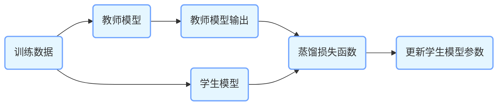
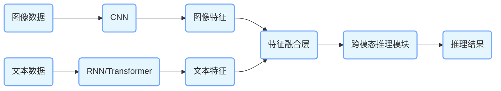

# 基于知识蒸馏的跨模态推理能力迁移

> 关键词：知识蒸馏、跨模态推理、能力迁移、多模态学习、人工智能

> 摘要：本文围绕基于知识蒸馏的跨模态推理能力迁移展开深入探讨。首先介绍了相关背景，明确研究目的、范围、预期读者等内容。接着阐述核心概念与联系，包括知识蒸馏、跨模态推理等原理及架构。详细讲解了核心算法原理，并给出 Python 源代码示例。通过数学模型和公式进一步剖析其内在机制，并举例说明。在项目实战部分，展示了开发环境搭建、源代码实现与解读。分析了实际应用场景，推荐了学习、开发相关的工具和资源，包括书籍、在线课程、开发工具等。最后总结未来发展趋势与挑战，解答常见问题，并提供扩展阅读和参考资料，旨在为研究者和开发者在跨模态推理能力迁移领域提供全面的技术指导。

## 1. 背景介绍 
### 1.1 目的和范围
在人工智能领域，多模态数据处理和推理是一个重要的研究方向。不同模态的数据，如图像、文本、音频等，蕴含着丰富的信息。然而，不同模态之间存在着巨大的差异，使得跨模态推理面临诸多挑战。基于知识蒸馏的跨模态推理能力迁移旨在解决如何将一种模态上学习到的推理能力有效地迁移到另一种模态上，以提高跨模态任务的性能。本研究的范围涵盖了知识蒸馏技术在跨模态推理中的应用，包括核心算法原理、数学模型分析、实际项目开发以及应用场景探讨等方面。

### 1.2 预期读者
本文预期读者包括人工智能领域的研究者、机器学习和深度学习方向的研究生、从事跨模态数据处理和推理相关项目的开发者。对于希望深入了解知识蒸馏和跨模态推理技术，并将其应用于实际项目的人员具有重要的参考价值。

### 1.3 文档结构概述
本文将按照以下结构进行组织：首先介绍核心概念与联系，明确知识蒸馏和跨模态推理的基本原理和架构；接着详细阐述核心算法原理，并给出具体的 Python 代码实现；然后通过数学模型和公式进一步解释算法的内在机制，并举例说明；在项目实战部分，展示开发环境搭建、源代码实现和代码解读；分析实际应用场景；推荐相关的学习、开发工具和资源；最后总结未来发展趋势与挑战，解答常见问题，并提供扩展阅读和参考资料。

### 1.4 术语表
#### 1.4.1 核心术语定义
- **知识蒸馏（Knowledge Distillation）**：一种模型压缩和知识迁移技术，通过将一个大型、复杂的教师模型的知识传递给一个小型、简单的学生模型，使学生模型能够学习到教师模型的泛化能力。
- **跨模态推理（Cross-modal Reasoning）**：在不同模态的数据之间进行推理和理解的能力，例如根据图像推理出相关的文本描述，或者根据文本生成对应的图像。
- **能力迁移（Ability Transfer）**：将在一种模态上学习到的推理能力应用到另一种模态上的过程。

#### 1.4.2 相关概念解释
- **多模态数据（Multi-modal Data）**：包含多种不同类型数据的集合，如图像、文本、音频、视频等。不同模态的数据具有不同的特征和表示方式。
- **教师模型（Teacher Model）**：在知识蒸馏中，通常是一个大型、复杂的预训练模型，具有较高的性能和丰富的知识。
- **学生模型（Student Model）**：通过知识蒸馏从教师模型中学习知识的小型、简单的模型。

#### 1.4.3 缩略词列表
- **KD**：Knowledge Distillation（知识蒸馏）
- **CNN**：Convolutional Neural Network（卷积神经网络）
- **RNN**：Recurrent Neural Network（循环神经网络）
- **Transformer**：一种基于注意力机制的深度学习模型架构

## 2. 核心概念与联系 
### 知识蒸馏原理
知识蒸馏的核心思想是让学生模型学习教师模型的输出分布，而不仅仅是学习训练数据的标签。教师模型通常是一个在大规模数据上预训练的复杂模型，具有较好的泛化能力。学生模型则是一个相对简单的模型，通过最小化与教师模型输出分布的差异来学习知识。

#### 知识蒸馏的架构示意图


### 跨模态推理原理
跨模态推理需要建立不同模态数据之间的映射关系。例如，在图像 - 文本跨模态推理中，需要将图像特征和文本特征映射到同一个特征空间，以便进行推理。通常采用深度学习模型，如卷积神经网络（CNN）处理图像数据，循环神经网络（RNN）或 Transformer 处理文本数据，然后通过全连接层等方式将不同模态的特征进行融合。

#### 跨模态推理的架构示意图


### 知识蒸馏与跨模态推理的联系
知识蒸馏可以用于跨模态推理能力的迁移。具体来说，可以在一种模态上训练一个教师模型，然后通过知识蒸馏将该教师模型的推理能力迁移到另一种模态的学生模型上。例如，在图像模态上训练一个强大的图像推理教师模型，然后使用知识蒸馏让文本模态的学生模型学习图像推理的能力，从而提高文本模态的跨模态推理性能。

## 3. 核心算法原理 & 具体操作步骤 
### 核心算法原理
基于知识蒸馏的跨模态推理能力迁移的核心算法主要包括两个部分：知识蒸馏损失函数的定义和跨模态特征融合。

#### 知识蒸馏损失函数
常见的知识蒸馏损失函数采用 KL 散度（Kullback - Leibler Divergence）来衡量学生模型输出分布和教师模型输出分布之间的差异。设教师模型的输出为 $p_T$，学生模型的输出为 $p_S$，则知识蒸馏损失函数 $L_{KD}$ 定义为：

$$L_{KD} = D_{KL}(p_T || p_S) = \sum_{i} p_T(i) \log \frac{p_T(i)}{p_S(i)}$$

其中 $i$ 表示输出的类别。

#### 跨模态特征融合
跨模态特征融合的目的是将不同模态的特征映射到同一个特征空间，并进行有效的融合。一种常见的方法是使用全连接层将不同模态的特征进行线性变换，然后通过加法或拼接的方式进行融合。设图像特征为 $f_{img}$，文本特征为 $f_{text}$，融合后的特征为 $f_{fusion}$，则可以通过以下方式进行融合：

$$f_{fusion} = W_{img} f_{img} + W_{text} f_{text}$$

其中 $W_{img}$ 和 $W_{text}$ 是可学习的权重矩阵。

### 具体操作步骤
#### 步骤 1：训练教师模型
在源模态（例如图像模态）上使用大规模数据训练一个复杂的教师模型，使其具有良好的推理能力。

#### 步骤 2：准备跨模态数据
收集跨模态数据，包括源模态数据和目标模态数据（例如图像和文本），并进行预处理，如归一化、分词等。

#### 步骤 3：构建学生模型
在目标模态上构建一个相对简单的学生模型。

#### 步骤 4：知识蒸馏训练
在训练过程中，同时输入源模态数据和目标模态数据。教师模型对源模态数据进行推理，得到教师模型的输出。学生模型对目标模态数据进行推理，得到学生模型的输出。计算知识蒸馏损失函数 $L_{KD}$，并结合目标模态数据的分类损失 $L_{cls}$（如果有分类任务），得到总损失函数：

$$L_{total} = \alpha L_{KD} + (1 - \alpha) L_{cls}$$

其中 $\alpha$ 是一个超参数，用于平衡知识蒸馏损失和分类损失。

#### 步骤 5：更新学生模型参数
使用梯度下降等优化算法，根据总损失函数 $L_{total}$ 更新学生模型的参数。

### Python 代码实现
```python
import torch
import torch.nn as nn
import torch.optim as optim

# 定义教师模型
class TeacherModel(nn.Module):
    def __init__(self, input_dim, output_dim):
        super(TeacherModel, self).__init__()
        self.fc = nn.Linear(input_dim, output_dim)

    def forward(self, x):
        return self.fc(x)

# 定义学生模型
class StudentModel(nn.Module):
    def __init__(self, input_dim, output_dim):
        super(StudentModel, self).__init__()
        self.fc = nn.Linear(input_dim, output_dim)

    def forward(self, x):
        return self.fc(x)

# 定义知识蒸馏损失函数
def knowledge_distillation_loss(teacher_output, student_output, temperature=1.0):
    teacher_prob = nn.functional.softmax(teacher_output / temperature, dim=1)
    student_log_prob = nn.functional.log_softmax(student_output / temperature, dim=1)
    kd_loss = nn.KLDivLoss(reduction='batchmean')(student_log_prob, teacher_prob) * (temperature ** 2)
    return kd_loss

# 训练函数
def train(teacher_model, student_model, optimizer, criterion, train_loader, temperature=1.0, alpha=0.5):
    teacher_model.eval()
    student_model.train()
    total_loss = 0
    for inputs, labels in train_loader:
        optimizer.zero_grad()
        # 教师模型推理
        with torch.no_grad():
            teacher_output = teacher_model(inputs)
        # 学生模型推理
        student_output = student_model(inputs)
        # 计算知识蒸馏损失
        kd_loss = knowledge_distillation_loss(teacher_output, student_output, temperature)
        # 计算分类损失
        cls_loss = criterion(student_output, labels)
        # 总损失
        loss = alpha * kd_loss + (1 - alpha) * cls_loss
        loss.backward()
        optimizer.step()
        total_loss += loss.item()
    return total_loss / len(train_loader)

# 示例代码调用
input_dim = 10
output_dim = 5
teacher_model = TeacherModel(input_dim, output_dim)
student_model = StudentModel(input_dim, output_dim)
optimizer = optim.Adam(student_model.parameters(), lr=0.001)
criterion = nn.CrossEntropyLoss()

# 模拟训练数据加载器
train_loader = []  # 这里需要根据实际情况填充数据
num_epochs = 10
for epoch in range(num_epochs):
    loss = train(teacher_model, student_model, optimizer, criterion, train_loader)
    print(f'Epoch {epoch + 1}/{num_epochs}, Loss: {loss:.4f}')
```

## 4. 数学模型和公式 & 详细讲解 & 举例说明 
### 知识蒸馏的数学模型
知识蒸馏的核心是通过最小化教师模型输出分布和学生模型输出分布之间的差异来让学生模型学习教师模型的知识。如前面所述，使用 KL 散度作为损失函数：

$$L_{KD} = D_{KL}(p_T || p_S) = \sum_{i} p_T(i) \log \frac{p_T(i)}{p_S(i)}$$

#### 详细讲解
KL 散度是一种衡量两个概率分布之间差异的度量方法。在知识蒸馏中，$p_T$ 是教师模型的输出概率分布，$p_S$ 是学生模型的输出概率分布。$p_T(i)$ 表示教师模型输出中第 $i$ 个类别的概率，$p_S(i)$ 表示学生模型输出中第 $i$ 个类别的概率。当 $p_T$ 和 $p_S$ 完全相同时，$L_{KD}$ 为 0；两者差异越大，$L_{KD}$ 越大。

#### 举例说明
假设教师模型的输出概率分布 $p_T = [0.1, 0.2, 0.7]$，学生模型的输出概率分布 $p_S = [0.2, 0.3, 0.5]$。则：

$$L_{KD} = 0.1 \log \frac{0.1}{0.2} + 0.2 \log \frac{0.2}{0.3} + 0.7 \log \frac{0.7}{0.5} \approx 0.057$$

### 跨模态特征融合的数学模型
跨模态特征融合的数学模型可以表示为：

$$f_{fusion} = W_{img} f_{img} + W_{text} f_{text}$$

#### 详细讲解
$f_{img}$ 是图像特征向量，$f_{text}$ 是文本特征向量，$W_{img}$ 和 $W_{text}$ 是可学习的权重矩阵。通过线性变换将不同模态的特征映射到同一个特征空间，然后进行相加操作得到融合后的特征 $f_{fusion}$。权重矩阵 $W_{img}$ 和 $W_{text}$ 在训练过程中通过反向传播算法进行更新，以使得融合后的特征能够更好地用于跨模态推理。

#### 举例说明
假设图像特征向量 $f_{img} = [0.2, 0.3, 0.5]^T$，文本特征向量 $f_{text} = [0.1, 0.4, 0.5]^T$，权重矩阵 $W_{img} = \begin{bmatrix} 0.1 & 0 & 0 \\ 0 & 0.2 & 0 \\ 0 & 0 & 0.3 \end{bmatrix}$，$W_{text} = \begin{bmatrix} 0.2 & 0 & 0 \\ 0 & 0.3 & 0 \\ 0 & 0 & 0.4 \end{bmatrix}$。则：

$$W_{img} f_{img} = \begin{bmatrix} 0.1 & 0 & 0 \\ 0 & 0.2 & 0 \\ 0 & 0 & 0.3 \end{bmatrix} \begin{bmatrix} 0.2 \\ 0.3 \\ 0.5 \end{bmatrix} = \begin{bmatrix} 0.02 \\ 0.06 \\ 0.15 \end{bmatrix}$$

$$W_{text} f_{text} = \begin{bmatrix} 0.2 & 0 & 0 \\ 0 & 0.3 & 0 \\ 0 & 0 & 0.4 \end{bmatrix} \begin{bmatrix} 0.1 \\ 0.4 \\ 0.5 \end{bmatrix} = \begin{bmatrix} 0.02 \\ 0.12 \\ 0.2 \end{bmatrix}$$

$$f_{fusion} = W_{img} f_{img} + W_{text} f_{text} = \begin{bmatrix} 0.02 + 0.02 \\ 0.06 + 0.12 \\ 0.15 + 0.2 \end{bmatrix} = \begin{bmatrix} 0.04 \\ 0.18 \\ 0.35 \end{bmatrix}$$

### 总损失函数的数学模型
总损失函数结合了知识蒸馏损失和分类损失：

$$L_{total} = \alpha L_{KD} + (1 - \alpha) L_{cls}$$

#### 详细讲解
$\alpha$ 是一个超参数，用于平衡知识蒸馏损失 $L_{KD}$ 和分类损失 $L_{cls}$。当 $\alpha$ 接近 1 时，模型更注重学习教师模型的知识；当 $\alpha$ 接近 0 时，模型更注重在目标模态数据上的分类性能。

#### 举例说明
假设 $L_{KD} = 0.1$，$L_{cls} = 0.2$，$\alpha = 0.5$，则：

$$L_{total} = 0.5 \times 0.1 + (1 - 0.5) \times 0.2 = 0.15$$

## 5. 项目实战：代码实际案例和详细解释说明 
### 5.1  开发环境搭建
#### 安装 Python
首先需要安装 Python 环境，建议使用 Python 3.7 及以上版本。可以从 Python 官方网站（https://www.python.org/downloads/）下载并安装。

#### 安装深度学习框架
本项目使用 PyTorch 作为深度学习框架。可以使用以下命令安装 PyTorch：

```bash
pip install torch torchvision
```

#### 安装其他依赖库
还需要安装一些其他的依赖库，如 NumPy、Matplotlib 等：

```bash
pip install numpy matplotlib
```

### 5.2  源代码详细实现和代码解读
#### 数据准备
假设我们有一个跨模态数据集，包含图像和文本数据。首先需要对数据进行预处理，例如图像的归一化、文本的分词等。以下是一个简单的数据加载器示例：

```python
import torch
from torch.utils.data import Dataset, DataLoader
import numpy as np

# 自定义数据集类
class CrossModalDataset(Dataset):
    def __init__(self, image_data, text_data, labels):
        self.image_data = image_data
        self.text_data = text_data
        self.labels = labels

    def __len__(self):
        return len(self.labels)

    def __getitem__(self, idx):
        image = self.image_data[idx]
        text = self.text_data[idx]
        label = self.labels[idx]
        return torch.tensor(image, dtype=torch.float32), torch.tensor(text, dtype=torch.float32), torch.tensor(label, dtype=torch.long)

# 模拟数据
num_samples = 100
image_dim = 10
text_dim = 8
num_classes = 5
image_data = np.random.randn(num_samples, image_dim)
text_data = np.random.randn(num_samples, text_dim)
labels = np.random.randint(0, num_classes, num_samples)

# 创建数据集和数据加载器
dataset = CrossModalDataset(image_data, text_data, labels)
train_loader = DataLoader(dataset, batch_size=10, shuffle=True)
```

#### 定义模型
定义教师模型和学生模型：

```python
import torch.nn as nn

# 教师模型
class TeacherModel(nn.Module):
    def __init__(self, input_dim, output_dim):
        super(TeacherModel, self).__init__()
        self.fc1 = nn.Linear(input_dim, 20)
        self.relu = nn.ReLU()
        self.fc2 = nn.Linear(20, output_dim)

    def forward(self, x):
        x = self.fc1(x)
        x = self.relu(x)
        x = self.fc2(x)
        return x

# 学生模型
class StudentModel(nn.Module):
    def __init__(self, input_dim, output_dim):
        super(StudentModel, self).__init__()
        self.fc = nn.Linear(input_dim, output_dim)

    def forward(self, x):
        return self.fc(x)

# 初始化模型
teacher_model = TeacherModel(image_dim, num_classes)
student_model = StudentModel(text_dim, num_classes)
```

#### 定义损失函数和优化器
```python
import torch.optim as optim

# 定义知识蒸馏损失函数
def knowledge_distillation_loss(teacher_output, student_output, temperature=1.0):
    teacher_prob = nn.functional.softmax(teacher_output / temperature, dim=1)
    student_log_prob = nn.functional.log_softmax(student_output / temperature, dim=1)
    kd_loss = nn.KLDivLoss(reduction='batchmean')(student_log_prob, teacher_prob) * (temperature ** 2)
    return kd_loss

# 分类损失函数
criterion = nn.CrossEntropyLoss()

# 优化器
optimizer = optim.Adam(student_model.parameters(), lr=0.001)
```

#### 训练过程
```python
num_epochs = 10
alpha = 0.5
temperature = 2.0

for epoch in range(num_epochs):
    teacher_model.eval()
    student_model.train()
    total_loss = 0
    for images, texts, labels in train_loader:
        optimizer.zero_grad()
        # 教师模型推理
        with torch.no_grad():
            teacher_output = teacher_model(images)
        # 学生模型推理
        student_output = student_model(texts)
        # 计算知识蒸馏损失
        kd_loss = knowledge_distillation_loss(teacher_output, student_output, temperature)
        # 计算分类损失
        cls_loss = criterion(student_output, labels)
        # 总损失
        loss = alpha * kd_loss + (1 - alpha) * cls_loss
        loss.backward()
        optimizer.step()
        total_loss += loss.item()
    print(f'Epoch {epoch + 1}/{num_epochs}, Loss: {total_loss / len(train_loader):.4f}')
```

### 5.3  代码解读与分析
#### 数据加载部分
`CrossModalDataset` 类继承自 `torch.utils.data.Dataset`，用于封装跨模态数据。`DataLoader` 用于批量加载数据，方便训练过程中的迭代。

#### 模型定义部分
`TeacherModel` 是一个简单的两层全连接神经网络，作为教师模型。`StudentModel` 是一个单层全连接神经网络，作为学生模型。

#### 损失函数部分
`knowledge_distillation_loss` 函数计算知识蒸馏损失，使用 KL 散度衡量教师模型和学生模型输出分布的差异。`nn.CrossEntropyLoss` 用于计算分类损失。

#### 训练过程部分
在每个 epoch 中，首先将教师模型设置为评估模式，学生模型设置为训练模式。然后遍历数据加载器，计算知识蒸馏损失和分类损失，求和得到总损失。使用反向传播算法更新学生模型的参数。

## 6. 实际应用场景 
### 智能问答系统
在智能问答系统中，用户的问题可能以文本形式输入，而系统需要从图像、视频等多模态数据中获取答案。基于知识蒸馏的跨模态推理能力迁移可以将图像推理能力迁移到文本模态的模型上，使得系统能够更好地理解用户的文本问题，并从图像数据中找到相关的答案。例如，用户询问“图片中物体的名称是什么”，系统可以通过跨模态推理从图像中提取信息并给出准确的回答。

### 多媒体搜索
在多媒体搜索中，用户可能使用文本描述来搜索相关的图像、视频等多媒体内容。通过知识蒸馏将图像搜索的推理能力迁移到文本模态的搜索模型上，可以提高文本搜索多媒体内容的准确性。例如，用户输入“一只白色的猫在草地上玩耍的图片”，系统可以更精准地从图像数据库中找到符合描述的图片。

### 自动驾驶
在自动驾驶领域，车辆需要处理多种模态的数据，如摄像头图像、激光雷达点云等。跨模态推理能力迁移可以将图像识别的推理能力迁移到点云数据处理模型上，提高车辆对周围环境的感知和理解能力。例如，通过图像识别模型学习到的物体分类知识，可以帮助点云数据处理模型更准确地识别道路上的车辆、行人等物体。

### 医疗诊断
在医疗诊断中，医生可能需要结合患者的病历文本、医学影像（如 X 光、CT 等）进行诊断。基于知识蒸馏的跨模态推理能力迁移可以将医学影像诊断的推理能力迁移到文本诊断模型上，辅助医生更全面地分析患者的病情。例如，将 CT 影像诊断模型的知识迁移到病历文本分析模型上，帮助医生从病历文本中发现潜在的疾病信息。

## 7. 工具和资源推荐
### 7.1 学习资源推荐
#### 7.1.1 书籍推荐
- 《深度学习》（Deep Learning）：由 Ian Goodfellow、Yoshua Bengio 和 Aaron Courville 所著，是深度学习领域的经典教材，涵盖了神经网络、卷积神经网络、循环神经网络等基础知识，对理解跨模态推理和知识蒸馏的原理有很大帮助。
- 《多模态机器学习：基础与应用》（Multimodal Machine Learning: Foundations and Applications）：专门介绍多模态机器学习的书籍，详细阐述了跨模态数据处理、融合和推理的方法和技术。

#### 7.1.2 在线课程
- Coursera 上的“深度学习专项课程”（Deep Learning Specialization）：由 Andrew Ng 教授授课，包含多个深度学习相关的课程，对深度学习的基础和应用有深入的讲解。
- edX 上的“多模态机器学习”（Multimodal Machine Learning）课程：系统介绍多模态机器学习的理论和实践，适合对跨模态推理感兴趣的学习者。

#### 7.1.3 技术博客和网站
- Medium 上的 Towards Data Science：有许多关于深度学习、多模态学习的高质量文章，涵盖了最新的研究成果和实践经验。
- arXiv.org：是一个预印本论文平台，上面有大量关于跨模态推理、知识蒸馏的最新研究论文，可以及时了解该领域的前沿动态。

### 7.2 开发工具框架推荐
#### 7.2.1 IDE和编辑器
- PyCharm：是一款专门为 Python 开发设计的集成开发环境（IDE），具有强大的代码编辑、调试和项目管理功能，适合开发基于 PyTorch 的跨模态推理项目。
- Jupyter Notebook：是一个交互式的开发环境，支持代码、文本、图表等多种形式的展示，方便进行实验和数据分析，在深度学习研究和开发中广泛使用。

#### 7.2.2 调试和性能分析工具
- PyTorch Profiler：是 PyTorch 自带的性能分析工具，可以帮助开发者分析模型的运行时间、内存使用等情况，优化模型性能。
- TensorBoard：是一个可视化工具，可以用于可视化模型的训练过程、损失曲线、准确率等指标，方便开发者监控模型的训练状态。

#### 7.2.3 相关框架和库
- PyTorch：是一个开源的深度学习框架，具有丰富的神经网络层和优化算法，支持动态图计算，非常适合跨模态推理模型的开发。
- Hugging Face Transformers：提供了大量预训练的 Transformer 模型，如 BERT、GPT 等，可以方便地用于文本处理和跨模态融合任务。

### 7.3 相关论文著作推荐
#### 7.3.1 经典论文
- “Distilling the Knowledge in a Neural Network”：由 Geoffrey Hinton 等人发表，首次提出了知识蒸馏的概念，为后续的研究奠定了基础。
- “Learning Deep Structured Semantic Models for Web Search using Clickthrough Data”：介绍了一种基于深度学习的语义匹配模型，对跨模态语义理解有重要的启示。

#### 7.3.2 最新研究成果
- 关注 arXiv 上关于“Cross-modal Reasoning”和“Knowledge Distillation”的最新论文，了解该领域的最新技术和方法。

#### 7.3.3 应用案例分析
- 可以在 ACM SIGKDD、IEEE ICML 等顶级学术会议的论文集中查找关于跨模态推理和知识蒸馏在实际应用中的案例分析，学习如何将这些技术应用到具体的项目中。

## 8. 总结：未来发展趋势与挑战
### 未来发展趋势
#### 更复杂的跨模态融合方法
未来的研究可能会探索更复杂的跨模态融合方法，不仅仅局限于简单的线性融合。例如，使用注意力机制、图神经网络等方法来更好地捕捉不同模态数据之间的关系，提高跨模态推理的性能。

#### 无监督和自监督学习的应用
随着无监督和自监督学习技术的发展，未来可能会更多地将这些技术应用于跨模态推理能力迁移中。通过无监督和自监督学习，可以在大规模无标注数据上进行预训练，提高模型的泛化能力和跨模态理解能力。

#### 多模态预训练模型的发展
类似于单模态的预训练模型（如 BERT、GPT 等），未来可能会出现更多的多模态预训练模型。这些模型可以在大规模的跨模态数据上进行预训练，然后在具体的跨模态任务上进行微调，提高模型的性能和效率。

### 挑战
#### 跨模态数据的异质性
不同模态的数据具有不同的特征和表示方式，如何有效地处理跨模态数据的异质性是一个挑战。例如，图像数据是连续的像素值，而文本数据是离散的字符序列，需要找到合适的方法将它们映射到同一个特征空间。

#### 知识蒸馏的有效性
虽然知识蒸馏在一定程度上可以提高学生模型的性能，但如何选择合适的教师模型、如何调整知识蒸馏的参数（如温度、$\alpha$ 等）以达到最佳的效果，仍然是一个需要深入研究的问题。

#### 计算资源和数据需求
跨模态推理和知识蒸馏通常需要大量的计算资源和数据。如何在有限的计算资源和数据条件下，实现高效的跨模态推理能力迁移是一个实际的挑战。

## 9. 附录：常见问题与解答
### 问题 1：知识蒸馏中的温度参数有什么作用？
温度参数（temperature）用于软化教师模型和学生模型的输出分布。在计算知识蒸馏损失时，通过将输出除以温度参数，可以使输出分布更加平滑，突出不同类别之间的相对差异。较高的温度会使分布更加平滑，较低的温度会使分布更加尖锐。合适的温度参数可以提高知识蒸馏的效果。

### 问题 2：如何选择知识蒸馏中的 $\alpha$ 参数？
$\alpha$ 参数用于平衡知识蒸馏损失和分类损失。选择 $\alpha$ 参数通常需要通过实验来确定。一般来说，如果教师模型的性能较好，可以适当增大 $\alpha$ 的值，让学生模型更多地学习教师模型的知识；如果目标模态数据的分类任务比较复杂，可以适当减小 $\alpha$ 的值，让学生模型更注重在目标模态数据上的分类性能。

### 问题 3：跨模态特征融合有哪些其他方法？
除了线性融合方法外，还有以下几种常见的跨模态特征融合方法：
- 拼接融合：将不同模态的特征直接拼接在一起，然后通过全连接层进行进一步处理。
- 乘法融合：将不同模态的特征进行逐元素相乘，然后通过全连接层进行处理。
- 注意力融合：使用注意力机制来动态地融合不同模态的特征，根据特征的重要性分配不同的权重。

### 问题 4：知识蒸馏是否适用于所有类型的模型？
知识蒸馏适用于大多数类型的深度学习模型，包括卷积神经网络（CNN）、循环神经网络（RNN）、Transformer 等。但对于一些特殊的模型，如基于规则的模型，知识蒸馏可能不太适用。在实际应用中，需要根据具体的模型和任务来判断是否适合使用知识蒸馏。

## 10. 扩展阅读 & 参考资料
### 扩展阅读
- 《人工智能：一种现代的方法》（Artificial Intelligence: A Modern Approach）：全面介绍人工智能的基础理论和方法，对理解跨模态推理和知识蒸馏的背景和应用有帮助。
- 《模式识别与机器学习》（Pattern Recognition and Machine Learning）：深入讲解模式识别和机器学习的理论和算法，适合进一步学习跨模态推理的数学基础。

### 参考资料
- Goodfellow, I., Bengio, Y., & Courville, A. (2016). Deep Learning. MIT Press.
- Hinton, G., Vinyals, O., & Dean, J. (2015). Distilling the Knowledge in a Neural Network. arXiv preprint arXiv:1503.02531.
- PyTorch 官方文档：https://pytorch.org/docs/stable/index.html
- Hugging Face Transformers 官方文档：https://huggingface.co/docs/transformers/index

作者：AI天才研究院/AI Genius Institute & 禅与计算机程序设计艺术 /Zen And The Art of Computer Programming