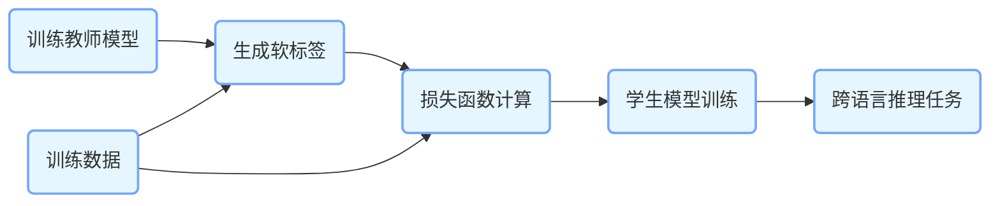

# 基于知识蒸馏的跨语言推理能力增强技术

> 关键词：知识蒸馏、跨语言推理、能力增强、语言模型、知识迁移

> 摘要：本文聚焦于基于知识蒸馏的跨语言推理能力增强技术。首先介绍了该技术产生的背景、目的、适用读者及文档结构等内容。接着阐述了知识蒸馏和跨语言推理的核心概念及其联系，给出了相应的原理和架构示意图与流程图。详细讲解了核心算法原理，并结合Python代码说明具体操作步骤。同时给出了相关的数学模型和公式，辅以举例加深理解。通过项目实战，从开发环境搭建到源代码实现及解读，全面展示了该技术在实际中的应用。分析了其实际应用场景，推荐了学习、开发相关的工具和资源，最后对未来发展趋势与挑战进行了总结，还给出了常见问题解答及扩展阅读参考资料，旨在为读者提供关于该技术的全面且深入的认知。

## 1. 背景介绍 
### 1.1 目的和范围
在当今全球化的时代，信息交流跨越了语言的界限，跨语言处理成为自然语言处理领域的重要研究方向。跨语言推理能力是指模型能够在不同语言之间进行有效的逻辑推理和知识迁移的能力。然而，由于不同语言在语法、词汇、语义等方面存在巨大差异，构建具有强大跨语言推理能力的模型面临诸多挑战。

知识蒸馏作为一种有效的模型压缩和知识迁移技术，能够将教师模型的知识传递给学生模型，从而提升学生模型的性能。本技术旨在研究如何利用知识蒸馏来增强跨语言推理能力，通过将一个在某语言或多语言上具有较强推理能力的教师模型的知识，迁移到一个学生模型中，使学生模型在跨语言推理任务上表现更优。

本技术的范围涵盖了各种跨语言推理任务，如跨语言问答、跨语言文本蕴含、跨语言语义推理等。同时，适用于多种类型的语言模型，包括基于Transformer架构的预训练语言模型等。

### 1.2 预期读者
本文预期读者包括自然语言处理领域的研究人员、工程师和开发者，对跨语言处理和知识蒸馏技术感兴趣的学生，以及希望将跨语言推理能力应用于实际项目的企业技术人员。读者需要具备一定的机器学习和自然语言处理基础知识，熟悉Python编程语言和深度学习框架（如PyTorch或TensorFlow）。

### 1.3 文档结构概述
本文将按照以下结构进行组织：
- 核心概念与联系：介绍知识蒸馏和跨语言推理的核心概念，以及它们之间的联系，并给出相应的原理和架构示意图与流程图。
- 核心算法原理 & 具体操作步骤：详细讲解基于知识蒸馏的跨语言推理能力增强的核心算法原理，并使用Python代码说明具体操作步骤。
- 数学模型和公式 & 详细讲解 & 举例说明：给出相关的数学模型和公式，进行详细讲解，并辅以举例加深理解。
- 项目实战：通过实际案例，从开发环境搭建到源代码实现及解读，全面展示该技术在实际中的应用。
- 实际应用场景：分析该技术在不同领域的实际应用场景。
- 工具和资源推荐：推荐学习、开发相关的工具和资源，包括书籍、在线课程、技术博客、开发工具框架和相关论文著作等。
- 总结：对未来发展趋势与挑战进行总结。
- 附录：给出常见问题解答。
- 扩展阅读 & 参考资料：提供进一步学习的扩展阅读内容和参考资料。

### 1.4 术语表
#### 1.4.1 核心术语定义
- **知识蒸馏（Knowledge Distillation）**：一种模型压缩和知识迁移技术，通过让学生模型学习教师模型的输出（软标签）来提升学生模型的性能。
- **跨语言推理（Cross - lingual Reasoning）**：模型在不同语言之间进行逻辑推理和知识迁移的能力，例如判断不同语言文本之间的蕴含关系。
- **教师模型（Teacher Model）**：在知识蒸馏中，具有较强性能和丰富知识的模型，用于向学生模型传递知识。
- **学生模型（Student Model）**：在知识蒸馏中，需要学习教师模型知识以提升自身性能的模型。
- **软标签（Soft Labels）**：教师模型输出的概率分布，包含了比硬标签（单一类别标签）更多的信息。

#### 1.4.2 相关概念解释
- **预训练语言模型（Pretrained Language Model）**：在大规模文本数据上进行无监督预训练的语言模型，如BERT、GPT等，具有强大的语言理解和生成能力。
- **Transformer架构（Transformer Architecture）**：一种基于注意力机制的深度学习架构，广泛应用于自然语言处理任务，具有并行计算和长序列处理的优势。
- **文本蕴含（Textual Entailment）**：判断一个文本（前提）是否蕴含另一个文本（假设）的关系，分为蕴含、矛盾和中立三种情况。

#### 1.4.3 缩略词列表
- **BERT**：Bidirectional Encoder Representations from Transformers
- **GPT**：Generative Pretrained Transformer
- **NLP**：Natural Language Processing
- **MLM**：Masked Language Modeling
- **CLS**：Classification Token

## 2. 核心概念与联系 

### 知识蒸馏原理
知识蒸馏的核心思想是让学生模型学习教师模型的输出，从而获得教师模型的知识。传统的分类任务中，模型通常使用硬标签（如类别编号）进行训练，而知识蒸馏引入了软标签的概念。软标签是教师模型输出的概率分布，包含了更多的信息，例如不同类别之间的相对可能性。

知识蒸馏的过程可以分为以下几个步骤：
1. 训练教师模型：在大规模数据集上训练一个性能较好的教师模型。
2. 生成软标签：使用训练好的教师模型对训练数据进行推理，得到软标签。
3. 训练学生模型：让学生模型同时学习硬标签和软标签，通过最小化损失函数来优化学生模型的参数。

### 跨语言推理原理
跨语言推理旨在解决不同语言之间的逻辑推理问题。为了实现跨语言推理，通常需要解决以下几个关键问题：
1. 跨语言表示学习：将不同语言的文本映射到同一个语义空间中，使得语义相近的文本在该空间中距离较近。
2. 语言无关的推理机制：设计一种不依赖于特定语言的推理机制，能够在跨语言的情况下进行有效的推理。

常见的跨语言表示学习方法包括使用多语言预训练语言模型（如mBERT）、基于对比学习的方法等。

### 知识蒸馏与跨语言推理的联系
知识蒸馏可以用于增强跨语言推理能力。通过将一个在某语言或多语言上具有较强推理能力的教师模型的知识，迁移到一个学生模型中，可以提升学生模型在跨语言推理任务上的性能。具体来说，知识蒸馏可以帮助学生模型学习到教师模型在跨语言表示和推理方面的知识，从而更好地处理不同语言之间的推理问题。

### 核心概念原理和架构的文本示意图
```plaintext
+---------------------+         +---------------------+
|      教师模型       |         |      学生模型       |
+---------------------+         +---------------------+
| - 大规模数据集训练  |         | - 学习硬标签和软标签 |
| - 生成软标签        |         | - 优化模型参数      |
+---------------------+         +---------------------+
            |                             ^
            |                             |
            v                             |
+---------------------+                   |
|      训练数据       |                   |
+---------------------+                   |
| - 原始文本数据      |                   |
| - 硬标签            |                   |
+---------------------+                   |
            |                             |
            v                             |
+---------------------+                   |
|    软标签生成器     |                   |
+---------------------+                   |
| - 教师模型推理      |                   |
| - 生成软标签        |                   |
+---------------------+                   |
            |                             |
            v                             |
+---------------------+                   |
|    损失函数计算     |                   |
+---------------------+                   |
| - 硬标签损失        |                   |
| - 软标签损失        |                   |
| - 总损失计算        |                   |
+---------------------+                   |
            |                             |
            v                             |
+---------------------+                   |
|    学生模型训练     |                   |
+---------------------+                   |
| - 反向传播更新参数  |                   |
+---------------------+                   |
```

### Mermaid流程图


## 3. 核心算法原理 & 具体操作步骤 

### 核心算法原理
基于知识蒸馏的跨语言推理能力增强的核心算法可以分为以下几个部分：

#### 1. 教师模型训练
教师模型通常是一个在大规模数据集上预训练的语言模型，例如mBERT。在跨语言推理任务中，教师模型需要在特定的跨语言推理数据集上进行微调，以适应具体的任务。

#### 2. 软标签生成
使用训练好的教师模型对训练数据进行推理，得到软标签。软标签是教师模型输出的概率分布，表示每个类别的可能性。

#### 3. 学生模型训练
学生模型在训练过程中需要同时学习硬标签和软标签。硬标签是原始数据集中的类别标签，软标签是教师模型生成的概率分布。

损失函数通常由两部分组成：硬标签损失和软标签损失。硬标签损失可以使用交叉熵损失函数，软标签损失可以使用KL散度损失函数。总损失是硬标签损失和软标签损失的加权和。

#### 4. 反向传播和参数更新
使用反向传播算法计算总损失对学生模型参数的梯度，并使用优化器（如Adam）更新学生模型的参数。

### 具体操作步骤（Python代码实现）
以下是一个基于PyTorch的示例代码，展示了基于知识蒸馏的跨语言推理能力增强的具体操作步骤：

```python
import torch
import torch.nn as nn
import torch.optim as optim
from transformers import AutoTokenizer, AutoModelForSequenceClassification

# 1. 初始化教师模型和学生模型
teacher_model_name = "bert-base-multilingual-cased"
student_model_name = "distilbert-base-multilingual-cased"

teacher_tokenizer = AutoTokenizer.from_pretrained(teacher_model_name)
teacher_model = AutoModelForSequenceClassification.from_pretrained(teacher_model_name, num_labels=3)

student_tokenizer = AutoTokenizer.from_pretrained(student_model_name)
student_model = AutoModelForSequenceClassification.from_pretrained(student_model_name, num_labels=3)

# 2. 定义损失函数和优化器
hard_label_loss_fn = nn.CrossEntropyLoss()
soft_label_loss_fn = nn.KLDivLoss(reduction="batchmean")

optimizer = optim.Adam(student_model.parameters(), lr=1e-5)

# 3. 模拟训练数据
train_texts = ["This is a sample text in English.", "这是一段中文示例文本。"]
train_labels = [0, 1]

# 4. 训练过程
num_epochs = 3
temperature = 2.0  # 温度参数，用于调整软标签的平滑度
alpha = 0.5  # 软标签损失的权重

for epoch in range(num_epochs):
    for text, label in zip(train_texts, train_labels):
        # 对输入文本进行编码
        teacher_inputs = teacher_tokenizer(text, return_tensors="pt")
        student_inputs = student_tokenizer(text, return_tensors="pt")
        
        # 教师模型生成软标签
        with torch.no_grad():
            teacher_outputs = teacher_model(**teacher_inputs)
            teacher_logits = teacher_outputs.logits / temperature
            teacher_probs = torch.softmax(teacher_logits, dim=1)
        
        # 学生模型前向传播
        student_outputs = student_model(**student_inputs)
        student_logits = student_outputs.logits
        student_probs = torch.softmax(student_logits / temperature, dim=1)
        
        # 计算硬标签损失
        hard_label_loss = hard_label_loss_fn(student_logits, torch.tensor([label]))
        
        # 计算软标签损失
        soft_label_loss = soft_label_loss_fn(torch.log(student_probs), teacher_probs)
        
        # 计算总损失
        total_loss = alpha * soft_label_loss + (1 - alpha) * hard_label_loss
        
        # 反向传播和参数更新
        optimizer.zero_grad()
        total_loss.backward()
        optimizer.step()
    
    print(f"Epoch {epoch + 1}/{num_epochs}, Loss: {total_loss.item()}")
```

### 代码解释
1. **初始化模型和分词器**：使用`transformers`库初始化教师模型和学生模型，以及对应的分词器。
2. **定义损失函数和优化器**：使用交叉熵损失函数计算硬标签损失，使用KL散度损失函数计算软标签损失。使用Adam优化器更新学生模型的参数。
3. **模拟训练数据**：定义训练文本和对应的硬标签。
4. **训练过程**：
    - 对输入文本进行编码，分别输入教师模型和学生模型。
    - 教师模型生成软标签，通过温度参数`temperature`调整软标签的平滑度。
    - 学生模型前向传播，计算硬标签损失和软标签损失。
    - 计算总损失，使用反向传播算法更新学生模型的参数。

## 4. 数学模型和公式 & 详细讲解 & 举例说明 

### 数学模型和公式

#### 1. 硬标签损失
硬标签损失通常使用交叉熵损失函数，用于衡量学生模型的输出和真实硬标签之间的差异。交叉熵损失函数的公式如下：

$$
L_{hard} = -\sum_{i=1}^{C} y_i \log(p_i)
$$

其中，$C$ 是类别的数量，$y_i$ 是第 $i$ 个类别的真实标签（通常是一个one - hot向量），$p_i$ 是学生模型输出的第 $i$ 个类别的概率。

#### 2. 软标签损失
软标签损失通常使用KL散度损失函数，用于衡量学生模型的输出和教师模型生成的软标签之间的差异。KL散度损失函数的公式如下：

$$
L_{soft} = \sum_{i=1}^{C} q_i \log\left(\frac{q_i}{p_i}\right)
$$

其中，$q_i$ 是教师模型生成的第 $i$ 个类别的软标签概率，$p_i$ 是学生模型输出的第 $i$ 个类别的概率。

为了调整软标签的平滑度，通常会引入温度参数 $T$。在计算软标签和学生模型输出的概率时，使用以下公式：

$$
p_i = \frac{\exp\left(\frac{z_i}{T}\right)}{\sum_{j=1}^{C} \exp\left(\frac{z_j}{T}\right)}
$$

$$
q_i = \frac{\exp\left(\frac{w_i}{T}\right)}{\sum_{j=1}^{C} \exp\left(\frac{w_j}{T}\right)}
$$

其中，$z_i$ 是学生模型的第 $i$ 个类别的logits，$w_i$ 是教师模型的第 $i$ 个类别的logits。

#### 3. 总损失
总损失是硬标签损失和软标签损失的加权和，公式如下：

$$
L_{total} = \alpha L_{soft} + (1 - \alpha) L_{hard}
$$

其中，$\alpha$ 是软标签损失的权重，取值范围为 $[0, 1]$。

### 详细讲解
- **硬标签损失**：硬标签损失用于让学生模型学习到真实的类别标签，保证学生模型在训练数据上的分类准确性。
- **软标签损失**：软标签损失用于让学生模型学习到教师模型的知识，通过引入软标签的平滑度，使得学生模型能够学习到不同类别之间的相对可能性。
- **总损失**：通过加权组合硬标签损失和软标签损失，可以平衡学生模型对真实标签的学习和对教师模型知识的学习。

### 举例说明
假设我们有一个三分类任务，真实硬标签为 $y = [1, 0, 0]$，教师模型生成的软标签为 $q = [0.8, 0.1, 0.1]$，学生模型的logits为 $z = [2, 1, 0]$。

#### 1. 计算硬标签损失
首先，计算学生模型的概率分布：

$$
p = \frac{\exp(z)}{\sum_{i=1}^{3} \exp(z_i)} = \left[\frac{\exp(2)}{\exp(2) + \exp(1) + \exp(0)}, \frac{\exp(1)}{\exp(2) + \exp(1) + \exp(0)}, \frac{\exp(0)}{\exp(2) + \exp(1) + \exp(0)}\right] \approx [0.665, 0.244, 0.091]
$$

然后，计算硬标签损失：

$$
L_{hard} = -\sum_{i=1}^{3} y_i \log(p_i) = -\log(0.665) \approx 0.407
$$

#### 2. 计算软标签损失
假设温度参数 $T = 2$，计算学生模型的概率分布：

$$
p = \frac{\exp\left(\frac{z}{T}\right)}{\sum_{i=1}^{3} \exp\left(\frac{z_i}{T}\right)} = \left[\frac{\exp(1)}{\exp(1) + \exp(0.5) + \exp(0)}, \frac{\exp(0.5)}{\exp(1) + \exp(0.5) + \exp(0)}, \frac{\exp(0)}{\exp(1) + \exp(0.5) + \exp(0)}\right] \approx [0.524, 0.277, 0.199]
$$

计算软标签损失：

$$
L_{soft} = \sum_{i=1}^{3} q_i \log\left(\frac{q_i}{p_i}\right) = 0.8 \log\left(\frac{0.8}{0.524}\right) + 0.1 \log\left(\frac{0.1}{0.277}\right) + 0.1 \log\left(\frac{0.1}{0.199}\right) \approx 0.194
$$

#### 3. 计算总损失
假设 $\alpha = 0.5$，则总损失为：

$$
L_{total} = \alpha L_{soft} + (1 - \alpha) L_{hard} = 0.5 \times 0.194 + 0.5 \times 0.407 = 0.3005
$$

## 5. 项目实战：代码实际案例和详细解释说明 

### 5.1  开发环境搭建
#### 操作系统
本项目可以在Windows、Linux或macOS操作系统上进行开发。建议使用Linux系统，因为它在深度学习开发中具有更好的稳定性和性能。

#### Python环境
建议使用Python 3.7及以上版本。可以使用Anaconda或Miniconda来管理Python环境，以下是创建和激活虚拟环境的示例命令：

```bash
conda create -n cross_language_distillation python=3.8
conda activate cross_language_distillation
```

#### 安装依赖库
使用`pip`安装所需的依赖库，包括`transformers`、`torch`等：

```bash
pip install transformers torch numpy pandas
```

### 5.2  源代码详细实现和代码解读
以下是一个完整的项目实战代码示例，用于基于知识蒸馏的跨语言推理任务：

```python
import torch
import torch.nn as nn
import torch.optim as optim
from transformers import AutoTokenizer, AutoModelForSequenceClassification
import pandas as pd
from torch.utils.data import Dataset, DataLoader

# 自定义数据集类
class CrossLanguageDataset(Dataset):
    def __init__(self, texts, labels, tokenizer, max_length):
        self.texts = texts
        self.labels = labels
        self.tokenizer = tokenizer
        self.max_length = max_length
    
    def __len__(self):
        return len(self.texts)
    
    def __getitem__(self, idx):
        text = self.texts[idx]
        label = self.labels[idx]
        
        encoding = self.tokenizer.encode_plus(
            text,
            add_special_tokens=True,
            max_length=self.max_length,
            padding="max_length",
            truncation=True,
            return_tensors="pt"
        )
        
        input_ids = encoding["input_ids"].flatten()
        attention_mask = encoding["attention_mask"].flatten()
        
        return {
            "input_ids": input_ids,
            "attention_mask": attention_mask,
            "labels": torch.tensor(label, dtype=torch.long)
        }

# 训练函数
def train_model(teacher_model, student_model, train_dataloader, num_epochs, temperature, alpha, optimizer):
    hard_label_loss_fn = nn.CrossEntropyLoss()
    soft_label_loss_fn = nn.KLDivLoss(reduction="batchmean")
    
    for epoch in range(num_epochs):
        student_model.train()
        total_loss = 0
        
        for batch in train_dataloader:
            input_ids = batch["input_ids"]
            attention_mask = batch["attention_mask"]
            labels = batch["labels"]
            
            # 教师模型生成软标签
            with torch.no_grad():
                teacher_outputs = teacher_model(input_ids=input_ids, attention_mask=attention_mask)
                teacher_logits = teacher_outputs.logits / temperature
                teacher_probs = torch.softmax(teacher_logits, dim=1)
            
            # 学生模型前向传播
            student_outputs = student_model(input_ids=input_ids, attention_mask=attention_mask)
            student_logits = student_outputs.logits
            student_probs = torch.softmax(student_logits / temperature, dim=1)
            
            # 计算硬标签损失
            hard_label_loss = hard_label_loss_fn(student_logits, labels)
            
            # 计算软标签损失
            soft_label_loss = soft_label_loss_fn(torch.log(student_probs), teacher_probs)
            
            # 计算总损失
            total_loss_batch = alpha * soft_label_loss + (1 - alpha) * hard_label_loss
            
            # 反向传播和参数更新
            optimizer.zero_grad()
            total_loss_batch.backward()
            optimizer.step()
            
            total_loss += total_loss_batch.item()
        
        print(f"Epoch {epoch + 1}/{num_epochs}, Loss: {total_loss / len(train_dataloader)}")

# 主函数
def main():
    # 初始化教师模型和学生模型
    teacher_model_name = "bert-base-multilingual-cased"
    student_model_name = "distilbert-base-multilingual-cased"
    
    teacher_tokenizer = AutoTokenizer.from_pretrained(teacher_model_name)
    teacher_model = AutoModelForSequenceClassification.from_pretrained(teacher_model_name, num_labels=3)
    
    student_tokenizer = AutoTokenizer.from_pretrained(student_model_name)
    student_model = AutoModelForSequenceClassification.from_pretrained(student_model_name, num_labels=3)
    
    # 加载训练数据
    data = pd.read_csv("train_data.csv")
    texts = data["text"].tolist()
    labels = data["label"].tolist()
    
    # 创建数据集和数据加载器
    max_length = 128
    train_dataset = CrossLanguageDataset(texts, labels, student_tokenizer, max_length)
    train_dataloader = DataLoader(train_dataset, batch_size=16, shuffle=True)
    
    # 定义优化器
    optimizer = optim.Adam(student_model.parameters(), lr=1e-5)
    
    # 训练模型
    num_epochs = 3
    temperature = 2.0
    alpha = 0.5
    train_model(teacher_model, student_model, train_dataloader, num_epochs, temperature, alpha, optimizer)

if __name__ == "__main__":
    main()
```

### 5.3  代码解读与分析
#### 自定义数据集类 `CrossLanguageDataset`
- 该类继承自`torch.utils.data.Dataset`，用于处理训练数据。
- `__init__`方法初始化数据集的文本、标签、分词器和最大长度。
- `__len__`方法返回数据集的长度。
- `__getitem__`方法根据索引返回一个样本，包括输入ID、注意力掩码和标签。

#### 训练函数 `train_model`
- 该函数用于训练学生模型，接收教师模型、学生模型、训练数据加载器、训练轮数、温度参数、软标签损失权重和优化器作为输入。
- 在每个训练轮次中，遍历训练数据加载器，计算硬标签损失和软标签损失，然后计算总损失并进行反向传播和参数更新。

#### 主函数 `main`
- 初始化教师模型和学生模型，以及对应的分词器。
- 加载训练数据，创建数据集和数据加载器。
- 定义优化器，调用`train_model`函数进行模型训练。

## 6. 实际应用场景 
### 跨语言问答系统
在跨语言问答系统中，用户可能使用不同的语言提出问题，系统需要在不同语言的知识库中寻找答案。基于知识蒸馏的跨语言推理能力增强技术可以帮助模型更好地理解不同语言的问题，并在跨语言的知识表示之间进行推理，从而提高问答系统的准确性和效率。

### 跨语言文本蕴含识别
跨语言文本蕴含识别任务需要判断不同语言的两个文本之间是否存在蕴含关系。通过知识蒸馏技术，可以将一个在多语言上训练良好的教师模型的知识迁移到学生模型中，增强学生模型在跨语言文本蕴含识别任务上的能力。

### 跨语言信息检索
在跨语言信息检索中，用户可能使用一种语言输入查询，系统需要在不同语言的文档集合中检索相关信息。基于知识蒸馏的跨语言推理能力增强技术可以帮助模型更好地理解不同语言的查询和文档，从而提高信息检索的准确率。

### 国际商务和金融领域
在国际商务和金融领域，需要处理大量的跨语言文本信息，如合同、报告、新闻等。基于知识蒸馏的跨语言推理能力增强技术可以帮助企业更好地理解和分析不同语言的商务和金融信息，从而做出更明智的决策。

## 7. 工具和资源推荐
### 7.1 学习资源推荐
#### 7.1.1 书籍推荐
- 《自然语言处理入门》：介绍了自然语言处理的基本概念、算法和技术，适合初学者入门。
- 《深度学习》：全面介绍了深度学习的理论和实践，包括神经网络、卷积神经网络、循环神经网络等。
- 《Transformer神经网络实战》：详细介绍了Transformer架构及其在自然语言处理中的应用，包括BERT、GPT等模型。

#### 7.1.2 在线课程
- Coursera上的“Natural Language Processing Specialization”：由顶尖大学的教授授课，涵盖了自然语言处理的各个方面。
- edX上的“Deep Learning for Natural Language Processing”：介绍了深度学习在自然语言处理中的应用，包括知识蒸馏等技术。
- 哔哩哔哩上的一些自然语言处理相关的视频教程，如“NLP从入门到精通”等。

#### 7.1.3 技术博客和网站
- Hugging Face博客：提供了关于自然语言处理和深度学习的最新技术和研究成果，包括知识蒸馏、跨语言模型等方面的内容。
- arXiv.org：一个预印本平台，包含了大量的自然语言处理和机器学习领域的研究论文。
- Towards Data Science：一个数据科学和机器学习领域的博客平台，有很多关于自然语言处理的优质文章。

### 7.2 开发工具框架推荐
#### 7.2.1 IDE和编辑器
- PyCharm：一个功能强大的Python集成开发环境，提供了代码编辑、调试、版本控制等功能。
- Jupyter Notebook：一个交互式的开发环境，适合进行数据探索、模型实验和代码演示。
- Visual Studio Code：一个轻量级的代码编辑器，支持多种编程语言和插件，可用于Python开发。

#### 7.2.2 调试和性能分析工具
- PyTorch Profiler：PyTorch自带的性能分析工具，可以帮助开发者分析模型的性能瓶颈。
- TensorBoard：一个可视化工具，可用于监控模型的训练过程、可视化模型的结构和性能指标。
- cProfile：Python自带的性能分析模块，可以帮助开发者分析代码的执行时间和调用关系。

#### 7.2.3 相关框架和库
- Transformers：Hugging Face开发的一个强大的自然语言处理库，提供了多种预训练语言模型和工具，方便开发者进行模型的加载、微调等操作。
- PyTorch：一个开源的深度学习框架，具有动态图机制和丰富的工具库，广泛应用于自然语言处理和计算机视觉等领域。
- NumPy：一个用于科学计算的Python库，提供了高效的多维数组对象和各种数学函数，是深度学习和自然语言处理的基础库之一。

### 7.3 相关论文著作推荐
#### 7.3.1 经典论文
- “Distilling the Knowledge in a Neural Network”：知识蒸馏的经典论文，首次提出了知识蒸馏的概念和方法。
- “BERT: Pre-training of Deep Bidirectional Transformers for Language Understanding”：介绍了BERT模型的预训练和微调方法，是自然语言处理领域的里程碑式论文。
- “Multilingual BERT: A State-of-the-Art Model for Cross-Lingual NLP”：介绍了多语言BERT模型的原理和应用，为跨语言自然语言处理提供了重要的基础。

#### 7.3.2 最新研究成果
- 在arXiv.org上搜索“Knowledge Distillation for Cross-Lingual Reasoning”等关键词，可以找到关于基于知识蒸馏的跨语言推理能力增强技术的最新研究成果。
- 参加自然语言处理领域的顶级会议，如ACL、EMNLP等，了解最新的研究进展和技术趋势。

#### 7.3.3 应用案例分析
- 一些企业和研究机构会发布基于知识蒸馏的跨语言推理技术的应用案例，如谷歌、微软等公司的技术博客和研究报告。
- 在GitHub上搜索相关的开源项目，了解实际应用中的代码实现和技术细节。

## 8. 总结：未来发展趋势与挑战
### 未来发展趋势
#### 多模态融合
未来的跨语言推理技术可能会与多模态信息（如图像、音频等）进行融合，实现更加全面和复杂的推理任务。例如，在跨语言的图像描述生成任务中，模型需要同时理解图像内容和不同语言的文本描述，并进行跨语言的推理和生成。

#### 低资源语言支持
目前的跨语言推理技术主要集中在高资源语言上，对于低资源语言的支持还比较有限。未来的研究可能会更加关注低资源语言的跨语言推理能力增强，通过知识蒸馏等技术将高资源语言的知识迁移到低资源语言模型中。

#### 可解释性和可信赖性
随着跨语言推理技术在越来越多的关键领域得到应用，模型的可解释性和可信赖性变得越来越重要。未来的研究可能会致力于开发具有可解释性和可信赖性的跨语言推理模型，让用户能够理解模型的决策过程和依据。

### 挑战
#### 语言差异和文化差异
不同语言之间存在巨大的语法、词汇和语义差异，同时还受到文化背景的影响。如何有效地处理这些差异，实现准确的跨语言推理，是一个巨大的挑战。

#### 数据质量和标注成本
跨语言推理任务需要大量高质量的标注数据，但数据的收集和标注成本非常高。此外，不同语言的数据分布可能存在偏差，这也会影响模型的性能。

#### 模型复杂度和计算资源
基于知识蒸馏的跨语言推理模型通常比较复杂，需要大量的计算资源进行训练和推理。如何在有限的计算资源下提高模型的性能和效率，是一个亟待解决的问题。

## 9. 附录：常见问题与解答
### 1. 知识蒸馏中的温度参数有什么作用？
温度参数 $T$ 用于调整软标签的平滑度。当 $T$ 较大时，软标签的分布会更加平滑，不同类别的概率差异会减小；当 $T$ 较小时，软标签的分布会更加尖锐，不同类别的概率差异会增大。通过调整温度参数，可以控制学生模型学习到的教师模型知识的粒度。

### 2. 如何选择软标签损失的权重 $\alpha$？
软标签损失的权重 $\alpha$ 需要根据具体的任务和数据集进行调整。一般来说，可以通过实验来确定最优的 $\alpha$ 值。如果教师模型的性能较好，可以适当增大 $\alpha$ 的值，让学生模型更多地学习教师模型的知识；如果训练数据的质量较高，可以适当减小 $\alpha$ 的值，让学生模型更多地学习真实标签。

### 3. 知识蒸馏是否适用于所有类型的模型？
知识蒸馏适用于大多数类型的模型，包括神经网络、决策树等。但不同类型的模型在知识蒸馏的实现方式上可能会有所不同。例如，对于神经网络模型，通常使用软标签损失和硬标签损失的加权和来进行训练；对于决策树模型，可能需要采用不同的知识表示和迁移方法。

### 4. 如何评估基于知识蒸馏的跨语言推理模型的性能？
可以使用常见的自然语言处理评估指标，如准确率、召回率、F1值等，来评估模型在跨语言推理任务上的性能。此外，还可以使用一些跨语言的评估指标，如跨语言语义相似度等，来评估模型的跨语言表示能力。

## 10. 扩展阅读 & 参考资料
### 扩展阅读
- 《Advances in Neural Information Processing Systems (NeurIPS)》会议论文集，包含了大量关于深度学习和自然语言处理的最新研究成果。
- 《Journal of Artificial Intelligence Research (JAIR)》期刊，发表了很多高质量的人工智能领域的研究论文。
- 《自然语言处理综论》（第二版），全面介绍了自然语言处理的理论、方法和应用。

### 参考资料
- [Hugging Face官方文档](https://huggingface.co/docs/transformers/index)
- [PyTorch官方文档](https://pytorch.org/docs/stable/index.html)
- [“Distilling the Knowledge in a Neural Network”论文](https://arxiv.org/abs/1503.02531)
- [“BERT: Pre-training of Deep Bidirectional Transformers for Language Understanding”论文](https://arxiv.org/abs/1810.04805)

作者：AI天才研究院/AI Genius Institute & 禅与计算机程序设计艺术 /Zen And The Art of Computer Programming